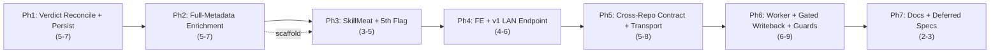

# Decisions Block: CCDash Automated AAR Review Loop — Remaining Efforts (P2–P4)

**Feature Goal**: Turn CCDash's deterministic AAR↔session triage (P1, shipped) into a *persisted, fully-evidenced, LAN-consumable* review loop — enriching the canonical surface flags with the full session-metadata + linked-plan/task + SkillMeat-artifact topology CCDash already ingests, then closing the loop through op/ARC's gates via a cross-repo consumer contract and a gated, self-recursion-guarded autonomous worker.

**This Decisions Block** scopes the *remaining* work (P2–P4 of the PRD; P1 shipped as `feature_contracts/features/ccdash-aar-review-mvp.md`). It pins phase boundaries, agent/model routing, risk hotspots, and estimation anchors so `implementation-planner` (sonnet) can expand it into the full Implementation Plan without re-litigating architecture. The hard invariants (§5 of the PRD) are review-failure conditions in *every* phase and are restated in the risk section.

---

## Decisions

| Decision | Rationale | Status |
|----------|-----------|--------|
| D1: Reconcile shipped flat 2-value DTO → PRD §7.2 nested `correlation{}` + 3-value `triage_verdict` (`+human_triage_required`); bump `schema_version`; flat fields deprecated-alias for one release. | PRD is authoritative; P1 was an MVP slice. Reconcile before P2 persists + P3 consumes §7.3. Near-zero blast radius today (log-only event, no external consumer). | locked |
| D2: User-mandated enrichment (full session metadata + linked plan/task frontmatter + SkillMeat rankings) SHARPENS the canonical 5 flags deterministically; adds evidence/reasons, not new semantic verdicts. | Hard Invariant #1: no LLM/semantic judgment on the read path. Plan-vs-session comparisons are set/threshold/ruleset — deterministic. | locked |
| D3: CCDash emits only; never dispatches ARC/swarm, never mutates SkillMeat/skills/agents. P4 writeback trigger is exclusively `op approve` on an approved run. | Hard Invariant #2 (accepted-ADR seam contract). | locked |
| D4: 3 self-recursion guards DESIGNED in persistence/enrichment (provenance cols + dedup key first-class), ENFORCED at P4. | No escalation path pre-P4; but guard inputs must exist from the persistence phase. | locked |
| D5: op-consumption transport = existing REST/MCP/CLI PULL as v1; promote log-only event to durable PUSH only if P3 smoke proves pull insufficient. | op already polls at its dispatch gate; avoid an unproven push transport + new write path until a real consumer needs it. | pending |
| D6: Enrichment traversal reuses existing `CorePorts` storage (sessions/documents/features/entity_links) + `session_detail`/`feature_forensics`/`artifact_intelligence` services; NO new correlation key, NO new port. | Hard Invariant #3 (reuse, don't rebuild). | locked |

---

## 1. Phase Boundaries

Boundaries sit where the *shape of the work product* changes (schema → evidence → external contract → autonomy), not at arbitrary task counts. PRD tier mapping: **P2 → Phases 1–4 · P3 → Phase 5 · P4 → Phase 6 · Docs → Phase 7.**

| Phase | Name | Scope | Success Criteria | Exit Gate |
|-------|------|-------|------------------|-----------|
| 1 | Verdict Reconciliation + Persistence Foundation | Reconcile DTO to PRD §7.2 (3-value verdict, nested correlation, bumped schema_version); add `aar_reviews` rollup table (dual SQLite+PG DDL, `retry_on_locked`, direct-count assertion test, `COLUMN_PARITY_DRIFT_ALLOWLIST`); persist verdicts + provenance/dedup fields (D4). | Reconciled DTO passes contract test; `aar_reviews` backfills existing AAR↔session pairs; parity test green; guard-input columns present. | ADR-007 write-path checklist + direct-count test pass; parity allowlist updated. |
| 2 | Full-Metadata Evidence Enrichment | New deterministic enrichment layer over `session_detail` (tokens, context_window, detection/capture cols, subagents, artifacts, links) + doc→feature→plan/progress→task frontmatter traversal (acceptance_criteria, assigned_to, assigned_model, effort, phase). Sharpens the 4 shipped flags; populates `evidence_refs`/`triage_reasons` with plan/task/metadata refs. | Each flag's evidence carries concrete plan/task/session-metadata refs; unit-tested over fixtures; a test asserts NO model client on the compute path. | Invariant-1 no-LLM assertion test green; flag-fixture suite green. |
| 3 | SkillMeat Artifact-Review Linkage + 5th Flag | Wire `ArtifactIntelligenceQueryService` rankings/recommendations into `stack_ineffectiveness` + implement 5th flag `new_skill_or_agent_need` (deterministic: used agents/skills/workflow vs effectiveness/cost rankings + repeated-missing-artifacts signal). Attach recommendation *evidence* (drafts), never catalog mutations. | 5th flag unit-tested; SkillMeat linkage deterministic + read-only; recommendation evidence attached, no SkillMeat write. | Invariant-2 no-write review; 5th-flag fixture suite green. |
| 4 | Read Surfaces: FE panel + v1 LAN endpoint + capability | `FeatureAARReviewPanel.tsx` (read-only, resilient to all optional fields, all 3 verdict states); `/api/v1/.../aar-review` v1 endpoint (redaction-applied) + `aar-review` capability string so op/ARC/Hermes pull over LAN from the nuc. | FE renders 3 verdict states + null-resilience (R-P2); v1 endpoint returns persisted verdict; capability advertised; **runtime smoke** (R-P4). | task-completion-validator + **karen milestone (end of P2)**; runtime_smoke recorded. |
| 5 | Cross-Repo Consumer Contract + Event Transport Decision (P3) | Author op-side consumer contract (in op repo) referencing PRD §7.3 verbatim; resolve D5 (pull-as-v1 vs promote event to durable push) and record as ADR addendum; best-effort cross-repo smoke: op consumes a real verdict → routed decision with NO CCDash code change. | Contract doc cites §7.3 schema; transport decision recorded; cross-repo smoke shows consumption + routing; `human_triage_required` never auto-routes to `op council`. | ADR addendum merged; smoke evidence captured. |
| 6 | Gated Writeback Seam + Autonomous Worker + Guards (P4) | Enforce 3 self-recursion guards (provenance self-exclusion via skill_name/workflow_id; idempotent `(aar_document_id, session_id)` dedup ledger; hard env-configured escalation quota); `AARReviewSweepJob` worker (incremental, coalescing-guarded, `CCDASH_AAR_REVIEW_AUTONOMOUS_WORKER_ENABLED` default-off); writeback seam driven only by `op approve`. | Guards tested (rejected/pending run NEVER writes); worker incremental + bounded, off hot path; writeback gated integration test green. | task-completion-validator + **karen milestone (end of P4)**. |
| 7 | Documentation Finalization + Deferred-Items Design Specs | Guides + CHANGELOG (`changelog_required: true`) + CLAUDE.md pointer + capability/operator doc + LAN deployment note; DOC-006 design specs for each deferred item (OQ-3 frontmatter contract, OQ-4 quota default, D5 transport if deferred). | All docs land; DOC-006 covers every open/deferred item; CHANGELOG `[Unreleased]` entry present. | **karen end-of-feature**; ac-coverage + validate-phase-completion clean. |

**Boundary Rationale**:
- **P1→P2 (existing gate, not this plan)**: P1 flags must validate as useful/low-false-positive against real AARs before persistence (scope-findings Inc-2 gate). The implementation-planner should add an entry-criteria note that Phase 1 begins only after that validation signal.
- **Ph1→Ph2**: Schema/verdict contract must be frozen + persisted before evidence enrichment layers richer refs onto it.
- **Ph2→Ph3**: Session/plan-metadata evidence is a prerequisite for the SkillMeat correlation (5th flag reads both used-artifacts *and* the task-domain context enrichment surfaces).
- **Ph3→Ph4**: Full verdict (all 5 flags + reconciled 3-value) must exist before it's rendered/exposed.
- **Ph4→Ph5**: The v1 pull surface + capability must exist before an external consumer contract can reference a real endpoint.
- **Ph5→Ph6**: op-side routing must be proven before autonomous writeback runs unattended (highest blast radius last).

---

## 2. Agent Routing

| Phase | Primary Agent(s) | Secondary Agent | Notes |
|-------|------------------|-----------------|-------|
| 1 | data-layer-expert | python-backend-engineer | data-layer owns dual-DDL migration + repo (ADR-007); python-backend reconciles DTO + service serialization. |
| 2 | python-backend-engineer | backend-architect | backend-architect designs the deterministic doc→feature→plan→task traversal + evidence contract; python-backend implements enrichment service + flag sharpening. |
| 3 | python-backend-engineer | — | Consume `artifact_intelligence` read APIs; implement 5th flag + SkillMeat evidence attach. |
| 4 | ui-engineer-enhanced (FE) | python-backend-engineer (v1 endpoint) | File-ownership split (FE `.tsx` ∥ BE `client_v1.py`); **integration_owner** required (seam: DTO field → panel + v1 payload). Runtime smoke mandatory (R-P4). |
| 5 | backend-architect | documentation-writer | backend-architect resolves transport (D5) + ADR addendum; documentation-writer authors the op-side contract doc. Cross-repo op impl is OUT of this repo. |
| 6 | backend-architect | python-backend-engineer | backend-architect designs guards + escalation-quota contract; python-backend implements worker job (telemetry_exporter pattern) + gated writeback seam. |
| 7 | documentation-writer (haiku) | changelog-generator; ai-artifacts-engineer | Guides + CHANGELOG + CLAUDE.md pointer; ai-artifacts-engineer only if a project skill's domain shifts. |

**Parallel Opportunities**:
- Ph2 and Ph3 partially parallelize *after* the Ph2 enrichment evidence contract is defined (the 5th flag in Ph3 depends on the enrichment surface, but the SkillMeat-ranking plumbing can be scaffolded in parallel).
- Ph4 FE ∥ v1-endpoint with file ownership (FE `.tsx` vs `client_v1.py`), joined by a seam task.
- Ph1 → everything: serial critical-path root (schema freeze).

---

## 3. Risk Hotspots

### Risk 1: Hard-Invariant #1 violation (LLM/semantic judgment on the read path)
- **Severity**: high
- **Rationale**: The enrichment mandate (compare plan-task intent vs session behavior) is exactly where a "was this the *right* agent" semantic heuristic could creep in, or where someone reaches for a model to classify task domain. Any of these breaks the accepted seam contract and is a review failure in any phase.
- **Mitigation**: Every flag evaluator stays a pure function unit-tested over fixtures (precedent: `persona_extract_rules.py` R1–R8). Phase 2 ships a test asserting no model client is importable/invoked on the compute path. Task-domain→specialist mapping is a static deterministic ruleset/lookup table, never inference. Code-review gate explicitly checks Invariant 1.

### Risk 2: Contract divergence (flat/2-value vs nested/3-value) breaking cross-repo consumers
- **Severity**: high
- **Rationale**: P1 shipped a flatter DTO + 2-value verdict; PRD §7.2/§7.3 specify nested `correlation{}` + 3-value `triage_verdict`. If persistence (Ph1) or the P3 contract locks the wrong shape, op/ARC integration breaks or drifts silently.
- **Mitigation**: D1 — reconcile in Phase 1 *before* persistence and before any consumer; bump `schema_version`; record in an ADR addendum; the Phase 5 contract doc references the reconciled §7.3 schema verbatim; a contract test pins the field shape.

### Risk 3: Writeback blast radius + self-recursion (P4)
- **Severity**: high
- **Rationale**: An autonomous worker triaging AARs can (a) triage its own review outputs (recursion) or (b) trigger unbounded escalation/writeback into SkillMeat/skills/agents.
- **Mitigation**: 3 guards designed from Ph1 (provenance self-exclusion via `skill_name`/`workflow_id` — never content-sniff; idempotent `(aar_document_id, session_id)` dedup ledger; hard env-configured escalation quota per window). Integration test asserts a rejected/pending run NEVER writes. Worker flag-gated default-off. `op approve` is the only writeback trigger (D3).

### Risk 4: Correlation reliability — two-hop is the norm (OQ-1/OQ-2)
- **Severity**: medium
- **Rationale**: The one real AAR exercised in P1 carried zero direct session frontmatter and reached its session purely via the doc→feature→session two-hop. If two-hop confidence is over-trusted, low-confidence pairings could auto-escalate.
- **Mitigation**: Keep the 0.64–1.0 band; resolve OQ-2 in Phase 1 (decision: whether every two-hop pairing routes to `human_triage_required` regardless of score). Sample additional real AARs during Ph1–Ph2 to move OQ-1 off a single data point.

### Risk 5: Autonomous worker load on the sync/watcher hot path
- **Severity**: medium
- **Rationale**: A naive sweep re-triaging all AARs each cycle adds unbounded load to the ingest path.
- **Mitigation**: Incremental (changed/new AAR docs only, mirroring `CCDASH_INCREMENTAL_LINK_REBUILD_ENABLED`); reuse the existing `(project_id, trigger)` coalescing guard (no second scheduler); bounded batch; worker flag independent of the read path.

### Risk 6: LAN egress of session-derived evidence without redaction (agentic-nuc)
- **Severity**: medium
- **Rationale**: The v1 endpoint + events stream session-derived evidence to op/ARC/Hermes over the LAN; raw JSONL or unredacted fields must never leave.
- **Mitigation**: Invariant #4 — consume only redaction-passed `session_detail` output, never raw JSONL; the v1 endpoint applies redaction before serialization; events remain count-only (IDs, flag_ids, verdict — no payload).

---

## 4. Estimation Anchors

### Total (remaining): 26–34 points (P1's ~12 pts already shipped; full-feature 34–45 per PRD §17)

| Phase | Points | Reasoning Anchor |
|-------|--------|------------------|
| 1 | 5–7 | H1 new-noun (`aar_reviews` table ≥2 pts + dual DDL + parity) + DTO reconciliation. Anchor: RF-telemetry P2 correlation-persistence wave (~8 pts) minus the read-side already built. |
| 2 | 5–7 | H3 algorithmic (doc→feature→plan→task traversal + deterministic flag sharpening; "correlation/resolution/graph" triggers ≥3 pts). New enrichment service + fixtures. |
| 3 | 3–5 | H3 (5th flag = ranking-lookup + threshold correlation, ≥3 pts) + SkillMeat read wiring (existing service, low plumbing). |
| 4 | 4–6 | FE panel (resilient, 3 states, runtime smoke) + v1 endpoint + capability. Anchor: prior planning-surface read panels (~4 pts) + v1 endpoint plumbing (H6). |
| 5 | 5–8 | Cross-repo consumer CONTRACT + ADR transport decision + best-effort smoke. No RF analogue (+30–70% per H5). Heavy op-side impl is OUT of this repo. |
| 6 | 6–9 | H3 (escalation-quota + dedup ledger) + worker (telemetry_exporter pattern ~4 pts) + gated writeback seam + guard tests. No RF analogue. |
| 7 | 2–3 | H6 hidden-plumbing (docs, CHANGELOG, CLAUDE.md pointer, DOC-006 design specs). |

**Estimation Notes**:
- Bottom-up (H4 bundle-vs-sum) floors the remaining work at ~26 pts across 7 capability areas (persistence, enrichment, SkillMeat correlation, LAN surfaces, cross-repo contract, guards, worker).
- **H5 anchor**: RF run telemetry (`9594fcc`, Tier 3 ~26 pts full; its correlation-persistence wave ~8 pts is the load-bearing comparable). This remaining slice exceeds RF by the cross-repo consumer phase (Ph5) + guarded-writeback phase (Ph6), neither of which RF had.
- Phase 5 point range is unusually wide because most implementation is cross-repo; the in-repo deliverable is the contract + transport decision + smoke harness.

---

## 5. Dependency Map

**Critical Path**: Ph1 (schema/verdict freeze) → Ph2 (evidence enrichment) → Ph3 (SkillMeat + 5th flag) → Ph4 (read surfaces) → Ph5 (consumer contract) → Ph6 (worker + writeback) → Ph7 (docs).

**Parallelizable Slices**:
- Ph2 evidence-contract definition unblocks a parallel scaffold of Ph3 SkillMeat-ranking plumbing.
- Ph4 FE (`FeatureAARReviewPanel.tsx`) ∥ Ph4 v1 endpoint (`client_v1.py`) under file ownership, joined by a seam task (DTO field → both surfaces).
- Ph7 doc drafting can begin against frozen contracts once Ph5 lands.

---

## 6. Model Routing

| Phase | Agent | Model | Effort | Rationale |
|-------|-------|-------|--------|-----------|
| 1 | data-layer-expert | sonnet | adaptive | Dual-DDL migration is patterned (ADR-007); low novelty. |
| 1 | python-backend-engineer | sonnet | adaptive | DTO reconciliation is mechanical once shape is decided. |
| 2 | backend-architect | sonnet | extended | Deterministic traversal design (doc→feature→plan→task) has real algorithmic surface; use extended thinking. |
| 2 | python-backend-engineer | sonnet | adaptive | Implementation against a defined evidence contract. |
| 3 | python-backend-engineer | sonnet | adaptive | Ranking-lookup + 5th flag; existing read APIs. |
| 4 | ui-engineer-enhanced | sonnet | adaptive | Read-only resilient panel; established planning-surface patterns. |
| 4 | python-backend-engineer | sonnet | adaptive | v1 endpoint follows client_v1 pattern. |
| 5 | backend-architect | sonnet | extended | Transport decision (D5) + cross-repo seam contract needs careful reasoning. |
| 5 | documentation-writer | haiku | adaptive | Contract doc authoring from the resolved decision. |
| 6 | backend-architect | sonnet | extended | Guards + escalation-quota + writeback seam is the highest-blast-radius design. |
| 6 | python-backend-engineer | sonnet | adaptive | Worker job follows telemetry_exporter pattern. |
| 7 | documentation-writer | haiku | adaptive | Guides/CHANGELOG/pointers. |

**Model Routing Notes**:
- No external-model (Codex/Gemini) tasks anticipated; escalate Ph6 guard-logic debugging to `gpt-5.3-codex` only after 2 failed local cycles.
- Reviewer gates (Tier 3): `task-completion-validator` per phase; `karen` at end-of-P2 (Ph4) and end-of-P4 (Ph6) milestones + end-of-feature (Ph7).

---

## 7. Open Questions for Expansion

- **OQ-1** (from PRD §15): Do real `op story` AARs carry a session/feature frontmatter ref, or does triage lean entirely on the two-hop fallback? One live P1 data point shows zero direct refs. → implementation-planner: add a Ph1/Ph2 task to sample ≥5 real AARs and record prevalence; default to two-hop-lean.
- **OQ-2** (from PRD §15): Is the 0.64–1.0 two-hop confidence band sufficient for autonomous triage, or should every two-hop pairing route to `human_triage_required` regardless of score? → Resolve in Ph1 (before persistence locks verdict semantics).
- **OQ-3** (from PRD §15): Exact frontmatter contract `op story` should adopt if a session-ref increment is pursued, and who owns that cross-repo change? → DOC-006 design spec in Ph7; not a blocker.
- **OQ-4** (from PRD §15): Escalation-quota default (count/window) for P4 — per-project or global? Must be env-configured (§8.1 guard 3). → Resolve in Ph6; DOC-006 records rationale.
- **OQ-5** (reconciliation): Does the reconciled DTO keep flat fields as deprecated aliases, or hard-cut to nested? → Decide in Ph1; D1 defaults to one-release deprecation window.
- **OQ-6** (D5): Does op consumption stay PULL (REST/MCP/CLI) as v1, or does the log-only event get promoted to a durable/queued push? → Resolve in Ph5 from cross-repo smoke evidence.
- **OQ-7** (enrichment scope guard): Confirm every enrichment comparison is deterministic (set/threshold/ruleset). Any comparison requiring semantic judgment is OUT of CCDash scope and belongs to op/ARC synthesis. → implementation-planner must annotate each enrichment task with its deterministic rule.

---

## 8. Plan Skeleton Pointer

This decisions block expands into a full **Implementation Plan** using the template:

- **Template**: `.claude/skills/planning/templates/implementation-plan-template.md`
- **Process**: `implementation-planner` (sonnet) reads this block + the PRD (`docs/project_plans/PRDs/features/ccdash-automated-aar-review-v1.md`) + the completed P1 contract (`docs/project_plans/feature_contracts/features/ccdash-aar-review-mvp.md`) and expands each section into full phase descriptions, task tables (with `Model`/`Effort` columns), batch/parallelization definitions, structured ACs (per Plan Generator Rules R-P1..R-P4), and per-phase success criteria.
- **Output path**: `docs/project_plans/implementation_plans/features/ccdash-automated-aar-review-v1.md` (split into phase files if >800 lines).
- **Frontmatter**: carry `prd_ref` to the PRD, `changelog_required: true`, `deferred_items_spec_refs: []`, `findings_doc_ref: null`.
- **Opus review**: brief sanity check (~3K tokens) post-expansion — verify phase boundaries + agent routing + that Hard Invariant #1 (no-LLM) is a per-phase AC.

---

## Notes for implementation-planner

- **Scope guard**: The PRD's canonical flag set is FIXED at 5 (`context_ballooning`, `missing_artifacts`, `generic_agent_vs_specialist`, `stack_ineffectiveness`, `new_skill_or_agent_need`) + the `retry_failure_churn` bonus signal. Do NOT invent new triage flags. The user's enrichment mandate SHARPENS these deterministically (richer evidence/reasons/thresholds), it does not add semantic verdicts (D2, Invariant #1).
- **§1 Phase Boundaries** → expand each row into a Phase Overview with entry/exit criteria; add the P1-validation entry-criterion to Ph1.
- **R-P2 (resilience)**: every new backend field gets an explicit "FE handles missing X" AC in Ph4.
- **R-P3 (seam)**: Ph4 has FE+BE overlap → declare `integration_owner` + a seam task (DTO field → panel + v1 payload).
- **R-P4 (runtime smoke)**: Ph4 (`.tsx`) requires a runtime-smoke task referencing every `target_surfaces` entry.
- **§7.4 integration points**: reuse `aar_review.py`, `session_detail.py`, `feature_forensics.py`, `artifact_intelligence.py`, `entity_graph`, `progress.py` parser, `client_v1.py`, `otel.py`, worker/`adapters/jobs` + `runtime/container.py` (telemetry_exporter as the worker template). No new CorePort (D6).
- **§7.5 deferred items**: OQ-3, OQ-4, and (if unresolved) OQ-6 each get a DOC-006 design-spec task in Ph7.
- **Estimation Sanity Check (H1–H6)** → write to the Human Brief (`docs/project_plans/human-briefs/ccdash-automated-aar-review.md`), not the plan body.
