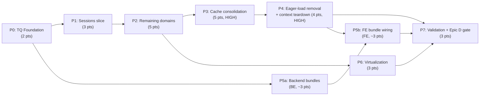

# Decisions Block: CCDash Frontend Data Layer Refactor

**Feature Goal**: Replace CCDash's three hand-rolled server-state caches (the 476-line `AppEntityDataContext`, `services/planning.ts`, `services/featureSurfaceCache.ts`) with a single TanStack Query layer, stop eager-loading at the provider root, shrink contexts to client-state, collapse per-view request waterfalls with backend fat-read bundles, complete list virtualization, and scope (not execute) a Next.js/SSR migration.

**This Decisions Block** captures the architectural judgment for expansion. SPIKE was waived (Tier 3): the incoming analyzing-agent notes + the three inventory worknotes are the research basis. `implementation-planner` (sonnet) expands this into the detailed plan; Opus sanity-reviews post-expansion.

---

## 1. Phase Boundaries

The work product *shape* changes at each boundary: foundation → one proven domain → all domains → cache teardown → root teardown → backend bundles → virtualization → validation/gate. Migration is **incremental and facade-preserving** — `useData()` keeps working until the very end.

| Phase | Name | Scope | Success Criteria | Exit Gate |
|-------|------|-------|------------------|-----------|
| P0 | TQ Foundation & Guardrails | Install `@tanstack/react-query` v5; mount `QueryClientProvider` (above `DataProvider` in App.tsx); author `lib/queryClient.ts` (staleTime/gcTime/retry defaults) + `services/queryKeys.ts` registry; devtools flag; extend source-reading guardrail tests (permit TQ, ban *new* hand-rolled LRU/TTL/in-flight refs) | TQ mounted; app renders identically; guardrail scaffold present; zero domains migrated yet | `vitest run` green; runtime smoke: app boots, all routes load |
| P1 | Sessions Vertical Slice (canonical pattern) | Migrate sessions end-to-end: `useSessionsQuery` + `useSessionDetailQuery`; remove the **duplicate** cold-load session fetch (`AppEntityDataContext.tsx:111` + `AppRuntimeContext.tsx`); back-nav renders from cache; resolve OQ-1 (infinite vs page) | Sessions fully on TQ; one cold-load session request (was 2); back-nav has no spinner; `useData()` sessions facade still returns | AC-A2, AC-A3; runtime smoke Dashboard + SessionInspector |
| P2 | Remaining Entity Domains | Migrate documents, tasks, features, alerts, notifications, projects to TQ hooks (replicate P1 pattern); paginate tasks/features → **kill `limit=5000`** | All 6 domains on TQ; tasks/features paginated; facade preserved | AC-B1, AC-C2(subset); runtime smoke PlanCatalog + ProjectBoard |
| P3 | Hand-rolled Cache Consolidation **(HIGH RISK)** | Retire `planning.ts` LRU Maps + `featureSurfaceCache.ts`/`featureCacheBus.ts` onto TQ; preserve `useFeatureSurface` public API via thin TQ-backed adapter; map planning freshness-bucket keying into queryKey/staleTime | Both legacy caches deleted; `useFeatureSurface` API-compatible; regression matrix + planning tests green | AC-B1(cache subset); `FeatureSurfaceRegressionMatrix` green; runtime smoke Planning + FeatureModal |
| P4 | Eager-load Removal + Context Shrinkage + Optimistic Mutations **(HIGH RISK)** | Remove `AppRuntimeContext` 7–8-request fan-out; route-colocate queries with `enabled`; port polling (30s health / 5s feature) to `refetchInterval`; shrink then **delete** `AppEntityDataContext` (only after all 15 screens migrated); port optimistic mutations to `onMutate`/`onError`/`onSettled` | Dashboard cold load ≤2 requests, no non-Dashboard domains; `AppEntityDataContext` deleted; contexts client-state-only; mutations optimistic via TQ | AC-B2, AC-B3, AC-B4; **karen milestone**; runtime smoke ALL screens |
| P5 | Backend Fat-Read Bundles + Waterfall Collapse | Add `GET /api/v1/dashboard`, `GET /api/agent/planning/view?include=`, `GET /api/analytics/overview-bundle` composing already-cached `agent_queries` reads; wire FE TQ queries onto them | Bundle endpoints ship (compose cached reads, ~0 extra DB cost); FE consumes; ≤1 above-fold request/view | AC-C1; backend unit tests; runtime smoke Dashboard/Planning/Analytics |
| P6 | List Virtualization | Virtualize session list (SessionInspector), document list (PlanCatalog), legacy feature list (ProjectBoard) via `@tanstack/react-virtual`; request narrow fieldsets | Three lists virtualized; smooth scroll at scale; memory-guard interplay verified | AC-C3, AC-C4; runtime smoke with large datasets |
| P7 | Validation, Docs & Epic D Scoping | Update `docs/guides/feature-surface-architecture.md` (two-layer cache model: server `@memoized_query` + client TQ); CHANGELOG `[Unreleased]`; full guardrail suite; comprehensive runtime smoke across all target surfaces; **author Epic D entry-criteria design spec (DOC-006)** + `ccdash-nextjs-migration-v1` sub-plan stub | All guardrail tests green; docs updated; Epic D gate doc authored | All ACs verified; **karen end-of-feature** |

**Boundary Rationale**:
- **P0–P1**: Foundation must exist before any domain migrates; sessions is the canonical slice that de-risks the hook/cache pattern before scaling to six domains.
- **P1–P2**: Prove on one domain, then replicate. Keeps P1 small and reviewable; P2 becomes mechanical.
- **P2–P3**: Entity domains are straightforward fetch→hook; cache *consolidation* is delicate adapter work and is isolated into its own phase to contain blast radius.
- **P3–P4**: All consumers must be on TQ (P1–P3) before the root context can be safely dismantled. Deleting `AppEntityDataContext` earlier would break unmigrated screens.
- **P4–P5**: Backend bundles have **no FE dependency** and can begin in parallel from after P0; FE wiring needs migrated consumers. Split keeps the parallelism explicit.
- **P5–P6**: Virtualization is orthogonal to data source; sequence after domains exist.
- **P6–P7**: Validation, docs, and the Epic D gate land last.

---

## 2. Agent Routing

| Phase | Primary Agent(s) | Secondary Agent | Notes |
|-------|------------------|-----------------|-------|
| P0 | ui-engineer-enhanced | — | TQ install, provider mount, `queryClient.ts`, `queryKeys.ts`, guardrail test extension |
| P1 | ui-engineer-enhanced | — | Sessions hooks + consumer wiring; defines the pattern doc all later phases copy |
| P2 | ui-engineer-enhanced | frontend-developer | Parallel per-domain (file-ownership batches: each domain = own hook file + its consumers) |
| P3 | ui-engineer-enhanced | — | Cache adapter + freshness keying; preserve `useFeatureSurface` API |
| P4 | ui-engineer-enhanced | — | Context surgery; screen-by-screen; polling→refetchInterval; live-SSE interplay |
| P5 | python-backend-engineer | ui-engineer-enhanced | BE builds bundle endpoints (parallel-early); FE wires TQ queries (after P0) |
| P6 | ui-engineer-enhanced | — | `useVirtualizer` on three lists; narrow fieldsets |
| P7 | documentation-writer | ui-engineer / documentation-complex | docs+CHANGELOG (haiku); guardrail tests (sonnet); Epic D entry-criteria spec (sonnet) |

**Parallel Opportunities**:
- **P5 backend endpoints ∥ P2/P3** — backend-only, disjoint files (`backend/routers/`, `agent_queries/`) from the FE migration. Start P5a backend after P0.
- **P2 domains internally parallel** — 6 domains split by file ownership (one hook + consumers each).
- **P6 ∥ P4/P5** — virtualization touches list-render code, independent of context teardown, once the relevant domain hooks (P1/P2) exist.

**Must sequence**: P0 → all; P1 → P2; (P1,P2,P3) → P4 (no root teardown until all consumers migrated).

---

## 3. Risk Hotspots

### Risk 1: Hand-rolled cache retirement breaks consumers silently (P3)
- **Severity**: high
- **Rationale**: `featureSurfaceCache.ts`/`featureCacheBus.ts` feed `useFeatureSurface` across the feature surface; `planning.ts` uses a project × freshness-bucket × payload-type Map keying that has **no direct TQ analogue**. Naive replacement loses freshness semantics or silently returns stale/empty data with no type error.
- **Mitigation**: Preserve `useFeatureSurface` public API via a thin TQ-backed adapter (no consumer edits in P3). Fold the backend `dataFreshness` token into the queryKey so freshness changes invalidate naturally. Keep `featureCacheBus` event names mapped to `queryClient.invalidateQueries` during the transition. **Extend `FeatureSurfaceRegressionMatrix.test.tsx`** to assert the TQ path. Source-reading guardrail test bans re-introduction of LRU Maps.

### Risk 2: Root context teardown while 24 components consume `useData()` (P4)
- **Severity**: high
- **Rationale**: 24 component files call `useData()`; `activeProject` is consumed by ~12/15 screens. Deleting `AppEntityDataContext` mid-migration breaks any unmigrated screen.
- **Mitigation**: Maintain the `useData()` facade as a compatibility shim through P1–P4 (AC-B3). Delete `AppEntityDataContext` **only after** all 15 screens are individually migrated and runtime-smoked. Extend `contexts/__tests__/dataArchitecture.test.ts` to assert facade stability per migrated screen.

### Risk 3: Polling / live-SSE behavior regression (P4)
- **Severity**: medium
- **Rationale**: `AppRuntimeContext` owns a 30s health+all-data poll and a 5s feature fallback, gated against `VITE_CCDASH_LIVE_*` SSE flags. Porting to per-query `refetchInterval` risks changed cadence or double-fetch when SSE is also active.
- **Mitigation**: Map each poll to a specific query's `refetchInterval`; ensure SSE-enabled paths set `refetchInterval: false` (SSE supersedes poll). Runtime-smoke live updates with flags on and off.

### Risk 4: Pagination semantics change when `limit=5000` is removed (P2/P5)
- **Severity**: medium
- **Rationale**: Tasks/features currently load "everything"; consumers that compute counts/filters by reducing the full client list break when paginated.
- **Mitigation**: Audit consumers for full-list reductions before paginating. Source aggregate counts from summary/bundle endpoints (`statusCounts`, `FeatureCardDTO` task counts), not client-side reduction over a partial page.

### Risk 5: Next.js / SSR migration (Epic D) — gated, not executed
- **Severity**: high (deferred)
- **Rationale**: `HashRouter` across ~30 files + module-scope `window.location.hash` read (`AppRuntimeContext.tsx:43`) are SSR-hostile. Attempting execution within this plan would balloon scope and risk.
- **Mitigation**: P7 authors only the entry-criteria design spec + a `ccdash-nextjs-migration-v1` sub-plan stub. Execution requires a separate plan after Epics A–C ship and smoke-clean for 2 weeks (AC-D1).

### Risk 6: Runtime smoke discipline (process, all UI phases)
- **Severity**: medium
- **Rationale**: CLAUDE.md requires a browser smoke before marking any UI phase complete; a clean unit pass is not a substitute.
- **Mitigation**: Every UI phase (P0–P6) carries a runtime-smoke task referencing its `target_surfaces`. If runtime is unavailable, the phase records `runtime_smoke: skipped` + reason and cannot be marked `completed`.

---

## 4. Estimation Anchors

### Total: ~31 points (Epics A–C committed) + 1 pt Epic D gate artifact

| Phase | Points | Reasoning Anchor |
|-------|--------|------------------|
| P0 | 2 | Library install + provider + registry + config + flag + test scaffold. Comparable to a foundation phase in `feature-surface-data-loading-redesign-v1`. |
| P1 | 3 | One full domain vertical (hooks + consumers + dedup + back-nav). Higher than later domains because it sets the pattern (H3: SWR/dedup is algorithmic). |
| P2 | 5 | Six domains × ~0.8 pt mechanical replication + pagination work on two of them. |
| P3 | 5 | Two cache systems retired with API-preservation adapter + freshness keying design (H3 algorithmic flag: stale-while-revalidate keying). Anchor: `ccdash-planning-reskin-v2` SWR cache build. |
| P4 | 4 | Context teardown across 15 screens + polling port + optimistic mutations. High coordination, medium code volume. |
| P5 | 6 | 3 bundle endpoints (BE, compose cached reads) + FE wiring. Anchor: planning `summary`/`session-board` bundle endpoints already in repo (~2 pt each). |
| P6 | 3 | Three list virtualizations; `@tanstack/react-virtual` already a dependency (transcript precedent). |
| P7 | 2 + 1 | Docs/CHANGELOG/guardrails/smoke (2) + Epic D entry-criteria spec & sub-plan stub (1). |

**Estimation Notes**:
- Bottom-up (H4 bundle-vs-sum): 2+3+5+5+4+6+3+3 = **31** committed, consistent with the PRD top-down. Trust bottom-up.
- H5 anchors: `feature-surface-data-loading-redesign-v1` (prior FE data-loading refactor) and `ccdash-planning-reskin-v2` (planning SWR cache). Both confirm a 30+ pt multi-phase FE refactor is in-family.
- H6 hidden plumbing (~15%): queryKey registry hygiene, devtools wiring, OpenAPI/DTO updates for bundles, guardrail-test upkeep — absorbed into P0/P5/P7.
- Tech-debt payoff: deleting ~1,450 lines of bespoke context + two cache modules offsets new TQ-hook line count; net code likely flat-to-negative.

---

## 5. Dependency Map

**Critical Path**: P0 → P1 → P2 → P3 → P4 → P7 (the FE migration spine; P4 cannot start until P1–P3 done).

**Parallelizable Slices**:
- P5 **backend** endpoints start after P0, run ∥ P2/P3/P4 (disjoint files, different owner).
- P2's six domains parallelize internally by file ownership.
- P6 virtualization runs ∥ P4/P5 once P1/P2 domain hooks exist.
- P5 **FE wiring** joins after its endpoint ships AND the relevant domain is migrated.

---

## 6. Model Routing

Claude effort vocabulary: `adaptive` (default) or `extended` only.

| Phase | Agent | Model | Effort | Rationale |
|-------|-------|-------|--------|-----------|
| P0 | ui-engineer-enhanced | sonnet | adaptive | Setup with clear scope; no deep reasoning |
| P1 | ui-engineer-enhanced | sonnet | extended | Canonical pattern — worth deeper reasoning so replication is clean |
| P2 | ui-engineer-enhanced / frontend-developer | sonnet | adaptive | Mechanical replication of the P1 pattern |
| P3 | ui-engineer-enhanced | sonnet | extended | Delicate adapter + freshness-keying design; silent-breakage risk |
| P4 | ui-engineer-enhanced | sonnet | extended | High-risk context teardown across 15 screens; polling/SSE interplay |
| P5 | python-backend-engineer | sonnet | adaptive | Bundle composition over already-cached reads; low novelty |
| P5 (FE) | ui-engineer-enhanced | sonnet | adaptive | Wire TQ queries onto bundle endpoints |
| P6 | ui-engineer-enhanced | sonnet | adaptive | Virtualization with an existing dependency precedent |
| P7 | documentation-writer | haiku | adaptive | Docs + CHANGELOG |
| P7 | documentation-complex | sonnet | adaptive | Epic D entry-criteria design spec (cross-system framing) |

**Model Routing Notes**:
- Reviewers: `task-completion-validator` after every phase; `karen` at the P4 milestone and end of P7.
- No external models needed. If P3 freshness-keying design stalls, escalate the OQ-2 decision to an Opus consult rather than switching model tiers.

---

## 7. Open Questions for Expansion

- **OQ-1** (P1): `useInfiniteQuery` vs preserved page-number pagination for the session list. PRD recommends `useInfiniteQuery` (matches existing "Load more" UX without page-number state). Planner should confirm `loadMoreSessions` consumers tolerate the infinite-query cursor shape.
- **OQ-2** (P3): How to represent `planning.ts` freshness-bucket keying in TQ — fold the backend `dataFreshness` token into the queryKey (invalidate-on-change) vs `staleTime` + explicit invalidation. Recommend queryKey inclusion.
- **OQ-3** (P4): Delete the `useData()` facade at end of P4, or keep it as a permanent thin TQ-backed shim for stability? Default: keep a minimal shim that re-exports TQ hooks + client-state contexts, to avoid touching 24 import sites in one risky sweep.
- **OQ-4** (P0): Migration flag mechanism. Because migration is incremental + facade-preserved, a runtime cutover flag is likely unnecessary; recommend code-level per-domain cutover plus a single `VITE_CCDASH_QUERY_DEVTOOLS` flag for devtools. Planner to confirm no per-deploy rollback need.
- **OQ-5** (P5): Do bundle endpoints need new `agent_queries` methods, or can they compose existing cached ones? Inventory says compose existing — planner confirms per endpoint.
- **OQ-6** (P4): `refetchInterval` mapping for the 30s health + 5s feature polls — per-query intervals vs a single poll-coordinator query. Confirm interaction with `VITE_CCDASH_LIVE_*` SSE suppression.

---

## 8. Plan Skeleton Pointer

This decisions block expands into a full **Implementation Plan** using:

- **Template**: `.claude/skills/planning/templates/implementation-plan-template.md`
- **Output path**: `docs/project_plans/implementation_plans/refactors/ccdash-frontend-data-layer-refactor-v1.md`
- **Likely >800 lines** → break into phase files under `docs/project_plans/implementation_plans/refactors/ccdash-frontend-data-layer-refactor-v1/phase-[N]-[name].md` (group: P0–P2 foundation+domains, P3–P4 teardown, P5–P7 backend+validation).
- **Frontmatter**: `doc_type: implementation_plan`, `prd_ref` → the PRD, `status: draft`, `risk_level: medium`, `changelog_required: true`, `feature_slug`, `deferred_items_spec_refs: []` (Epic D spec lands here in P7), `findings_doc_ref: null`.
- **Mandatory**: Phase Summary table (canonical orchestration index); Estimation Sanity Check → Human Brief (qualifies: 31 pts, 8 phases); per-phase `task-completion-validator` gate; `karen` at P4 + P7; DOC-006 row for the Epic D entry-criteria design spec; runtime-smoke task in every UI phase referencing `target_surfaces`.
- **Opus review**: ~3K-token sanity check post-expansion — verify phase boundaries, agent routing propagation, and that no high risk was dropped.
