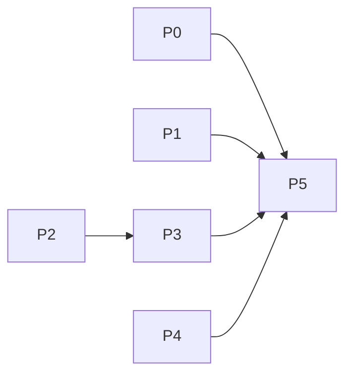

# Decisions Block — CCDash Runtime & Deploy Remediation v1

Opus-authored scaffold for `implementation-planner`. Tier 3, `risk_level: high` (migration + watcher architecture). Theme: **make the runtime treat the DB registry as authoritative (ADR-006)** — both project selection and watcher fan-out — plus deploy-stack hardening. Source of truth for root causes: the investigation report (`spike_ref`).

## Thesis & Spine
Two of the four workstreams (W1 project selection, W2 watcher fan-out) are the *same* defect class: the running app ignores the DB-authoritative registry. W3 (PG upgrade path) and W4 (finding cleanup) are independent hardening folded into the epic. Sequence to deliver user value first (W1 fixes the visible "no data" symptom) and to gate the high-risk architecture (W2) behind a SPIKE.

## Phase Boundaries

| Phase | Name | Scope | Exit gate |
|------|------|-------|-----------|
| **P0** | Registry-authoritative project resolution (W1) | `/api/projects` + active resolution honors DB `is_active`; seed/example/test projects filtered or flagged; FE app-shell default selection lands on active project; explicit user selection still persists/overrides | Fresh-DB browser smoke: load → lands on active project with data; `task-completion-validator` |
| **P1** | Postgres in-place upgrade-path fix (W3) | Reorder `_run_migrations_inner` so `project_id`-dependent indexes/constraints run AFTER versioned column ALTERs (or gate idempotently); add seeded-old-volume compose smoke | Both fresh-volume AND seeded-v28-volume migrate to v35 green; `task-completion-validator` + `karen` milestone (migration risk) |
| **P2** | Watcher fan-out SPIKE/design (W2) | Resolve OQs (watch-all vs watch-active; dynamic registry change handling; per-project probe/health rollup; partial-failure isolation; single-process vs supervised). Output design_spec | Design spec answers every OQ with test scenarios enumerable; `karen` milestone before P3 build |
| **P3** | Registry-driven watch fan-out impl (W2) | Watcher derives target set from DB registry; `CCDASH_WORKER_WATCH_PROJECT_ID` demoted to optional scoping filter; per-project probe/health rollup; dynamic add/remove; compose/env/docs updated | Multi-project ingest verified in container; one project's failure doesn't kill others; `task-completion-validator` |
| **P4** | Finding triage & cleanup (W4) | Fix-in-scope or explicitly defer F-W3-001/002, F-001/002/003, F-W6-001 with promotion triggers | All findings dispositioned; tests green; `task-completion-validator` |
| **P5** | Docs finalization + deferred-items + CHANGELOG (DOC-006) | Guides, CLAUDE.md pointers, deferred-items design specs, CHANGELOG `[Unreleased]`, frontmatter close-out | `karen` end-of-feature APPROVED |

## Agent Routing (primary + secondary per phase)

| Phase | Primary | Secondary | Parallel opportunity |
|------|---------|-----------|----------------------|
| P0 | python-backend-engineer (API) + ui-engineer (FE selection) | code-reviewer | BE + FE in parallel; seam task joins them (integration_owner = BE) |
| P1 | data-layer-expert | backend-architect (review) | none (single delicate file) |
| P2 | backend-architect / spike-writer | data-layer-expert | 1–2 research legs parallel |
| P3 | python-backend-engineer + backend-architect | code-reviewer | watch-engine vs probe-rollup splittable after design |
| P4 | python-backend-engineer | documentation-writer | doc/test/tooling fixes parallel |
| P5 | documentation-writer (haiku) + changelog-generator | karen | doc tasks parallel |

**Execution-environment constraint (load-bearing for executors)**: the Agent tool overflows on this repo's CLAUDE.md (`Prompt is too long`, subagent_tokens=0). All code-touching subagents MUST run via ICA `~/ica-claude.sh --bare` bash delegation (`--model 'claude-sonnet-4-6[1m]'`, `--add-dir` repo root, `--dangerously-skip-permissions`, generous `--max-turns` 60–75). `--bare` drops CLAUDE.md, so embed invariants (ADR-006/007, PRAGMA busy_timeout=30000, dual DDL, named-test-only) in every prompt. Run implementers in a shared wave worktree by absolute path; verify output on disk (tests + `git status`), not via transcript. Ref: memory `ccdash-agent-env-constraints`, `ccdash-core-remediation-plan`.

## Risk Hotspots

| Risk | Severity | Rationale | Mitigation |
|------|----------|-----------|------------|
| Migration reorder breaks fresh DBs while fixing old ones (P1) | **HIGH** | `_TABLES` ordering is load-bearing for both paths | Require BOTH fresh-volume and seeded-v28-volume smoke green; forward-only + idempotent index creation; karen milestone |
| Watcher fan-out resource/backpressure with N projects (P3) | **HIGH** | One process watching many trees; watchfiles polling on macOS | Per-project isolation (one project's watch failure cannot kill siblings); bounded concurrency; probe rollup surfaces per-project state; SPIKE-first |
| Dynamic registry change handling (P3) | MED | Projects added/removed/activated at runtime | Reconcile loop re-reads registry on interval; add/remove watch subscriptions idempotently |
| W1 default-selection regression (P0) | MED | Users relying on stored selection could be surprised | `is_active` is default ONLY when no explicit persisted selection; explicit selection always overrides |
| Seed/test project pollution (P0) | LOW | `default-skillmeat`, `test-project-1` imported from projects.json | Filter from default-candidate set or flag `is_example`; never auto-select |

## Estimation Anchors (H1–H6 bottom-up)

| Phase | Pts | Anchor / rationale |
|------|-----|--------------------|
| P0 | 5 | FE+BE behavior change + seam + smoke. Anchor: project-switcher/active-resolution work in core-remediation (~5). H6 plumbing (DTO/flag) +1. |
| P1 | 5 | Migration reorder is small LOC but high-care; +smoke harness (seeded old volume). Anchor: core-remediation Postgres parity (~5). H3 (no algorithm) but H-risk. |
| P2 | 3 | SPIKE/design only. |
| P3 | 12 | Architecture: multi-project watch engine + dynamic registry + per-project probe/health rollup + container/env/docs. H2 (dual runtime worker/worker-watch) ~1.8× on the runtime slice; H4 bundle floor across watch-engine + probe + wiring. Anchor: original worker/watcher build. |
| P4 | 3 | Mechanical doc/test/tooling fixes across catalogued findings. |
| P5 | 3 | Docs + deferred specs + CHANGELOG + close-out. |
| **Total** | **~31** | Tier 3 confirmed (13+). Bottom-up > naive top-down; trust bottom-up. |

## Dependency Map
- **Independent / parallelizable**: P0, P1, P2 (different files/owners — BE+FE, data-layer, research).
- **Sequential**: P2 → P3 (design gates build). P0–P4 → P5 (close-out).
- **P4** can slot anytime; schedule alongside P3 to fill review wait.
- **Critical path**: P2 → P3 → P5.

## Model Routing (per phase)

| Phase | Model | Effort | Notes |
|------|-------|--------|-------|
| P0 | sonnet (impl) | adaptive | FE+BE |
| P1 | sonnet (data-layer) | extended | migration care; review by opus-read-only via ICA |
| P2 | sonnet (or opus for arch synthesis) | extended | design reasoning |
| P3 | sonnet | extended | largest build |
| P4 | sonnet impl / haiku docs | adaptive | |
| P5 | haiku docs / sonnet skill / opus karen | adaptive | karen gate on opus |

## Open Questions for implementation-planner (expand)
- **OQ-1 (W1)**: Should `/api/projects` exclude example/test projects from the default-candidate set entirely, or return them with an `is_example` flag the FE filters? Recommend: add a server-side flag + FE filters from default-selection but still lists them under an "Examples" affordance. Planner: enumerate the exact response-shape change + FE consumption.
- **OQ-2 (W2)**: Watch ALL registered projects or only `is_active`? Recommend: watch all registered with bounded concurrency; `is_active` affects UI default, not ingest breadth. Confirm against resource budget in P2 SPIKE.
- **OQ-3 (W2)**: Does demoting `CCDASH_WORKER_WATCH_PROJECT_ID` break the existing single-watcher compose contract? Spec a backward-compatible default (env present → scope to that id; env absent → registry-driven all-projects).
- **OQ-4 (W3)**: Are there other `_TABLES` objects (beyond `sessions` indexes) that depend on columns added by versioned ALTERs? Planner: audit `_TABLES` exhaustively, list every column-dependent index/constraint.
- **OQ-5 (W2)**: Per-project probe rollup contract — single `/readyz` aggregate (degraded if any project degraded) vs per-project sub-status. Recommend aggregate + `detailz` per-project breakdown.

## Plan Skeleton Pointer
- Template: `.claude/skills/planning/templates/implementation-plan-template.md`
- Output: `docs/project_plans/implementation_plans/enhancements/ccdash-runtime-deploy-remediation-v1.md`
- Frontmatter: `doc_type: implementation_plan`, `prd_ref` (PRD path above), `risk_level: high`, `changelog_required: true`, `deferred_items_spec_refs: []`, `findings_doc_ref: .claude/findings/ccdash-core-remediation-findings.md`.
- Mandatory: Phase Summary table (phase, pts, agents, model); per-phase task tables with AC blocks (R-P1..R-P4); P5 DOC-006 rows for every deferred finding.
