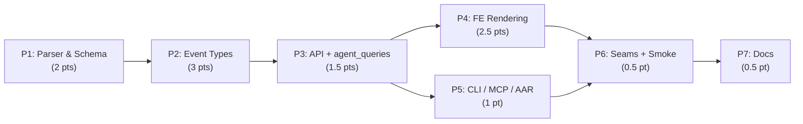

# Decisions Block: JSONL Shape Gap Coverage

**Feature Goal**: Close the 13 Claude Code JSONL shape gaps identified in the 2026-05-19 audit by capturing newly-observed fields (`promptId`, `sessionKind`, `bridgeSessionId`, `attributionSkill`, `attributionPlugin`, `thinking.signature`, `leafUuid`), handling new event types (`attachment` ×14 subtypes, `ai-title`, `last-prompt`, `permission-mode`, expanded `system.subtype`), and surfacing the resulting forensics/display value through transcript, Session Inspector, CLI, MCP, and AAR pipelines — all additive, no breaking changes, with R-P2 resilience fallbacks for every new optional field.

**This Decisions Block** captures phase boundaries, agent routing, risk hotspots, estimation anchors, and model routing. `implementation-planner` (sonnet) expands it into the full Implementation Plan with batches, task IDs, and success criteria.

---

## 1. Phase Boundaries

| Phase | Name | Scope | Success Criteria | Exit Gate |
|-------|------|-------|------------------|-----------|
| P1 | Parser & Schema Enrichment (Bucket A) | Add 8 nullable `AgentSession` columns + matching `types.ts` fields; migrate SQLite and PostgreSQL; parser captures top-level `promptId`, `sessionKind`, `bridgeSessionId`, `lastSequenceNum`, `attributionSkill`, `attributionPlugin`, `thinking.signature`, `leafUuid`. | All AC-A1…A6 pass unit tests on JSONL fixtures; migrations idempotent on both backends. | `task-completion-validator` confirms additive-only schema diff + migration round-trip works. |
| P2 | New Event-Type Handling (Bucket B) | Parser branches for `type: "ai-title"`, `type: "attachment"` (single dispatch over 14 subtypes), `type: "last-prompt"`, `type: "permission-mode"`; `system.subtype` dispatch for `turn_duration`, `away_summary`, `bridge_status`, `local_command`. Includes `agent-setting`/`agent-name` branches (low-volume, no UI). | All AC-B1…B5 pass; unknown attachment subtypes log warning and fall through to system-log entry. | Fixture coverage for each subtype + unknown-subtype fallback test green. |
| P3 | API + agent_queries exposure | New fields surfaced via `backend/routers/` responses (sessions, analytics, agent), agent_queries intelligence layer for `promptId`/`leafUuid` forensics + attribution rollups; `types.ts` propagated. | Contract tests pass; agent_queries surfaces queryable from REST + MCP + CLI; OpenAPI/types regenerated cleanly. | `task-completion-validator` confirms transport-neutral layer is the single source of truth (no router-side SQL or business logic). |
| P4 | Transcript & Session Inspector rendering (FE) | UI additions: attachment cards (`SessionInspector` transcript), permission-mode transition chips, turn-duration histogram, away-summary banner, attribution rollup panel, `promptId`/`leafUuid` forensics row, tool-category enrichment. Every component handles `null`/missing field gracefully (R-P2 fallback ACs). | All AC-C1…C5 + AC-C7 pass; missing-field UI states match resilience contract. | Vitest passes; manual runtime smoke shows old (pre-enrichment) sessions render without "—" gaps becoming visual noise. |
| P5 | Forensics rollups via CLI / MCP / AAR | `ccdash session search --prompt-id` (CLI), `mcp__ccdash__*` filter additions for promptId/leafUuid/attribution, AAR report consumes new forensics fields. | AC-C6 passes; JSON-mode regression coverage for CLI; MCP server tests cover new tool inputs. | `task-completion-validator` confirms parity between REST + CLI + MCP query surfaces. |
| P6 | Integration Seams + Cross-Surface Smoke | One seam task per BE↔FE owner boundary (P1↔P4, P3↔P4); one runtime smoke task enumerating every R-P1 `target_surfaces` entry from the PRD's structured ACs. | All target surfaces render correctly on a sample new-shape JSONL + a pre-enrichment JSONL. | Runtime smoke artifact (screenshots + console-clean) attached to phase progress. |
| P7 | Documentation Finalization | CHANGELOG `[Unreleased]` entry (mandatory — `changelog_required: true`); README/user-docs delta for new transcript surfaces; `ccdash` skill SPEC update if new CLI commands ship; `docs/guides/cli-timeout-debugging.md` cross-link if forensics flags introduced. | Docs pass `mkdocs build --strict` (if configured) or markdown lint; CHANGELOG entry categorized correctly. | `documentation-writer` + reviewer sign-off; `karen` end-of-feature pass. |

**Boundary Rationale**:
- P1↔P2: Schema must be stable before event-type handlers persist into it; both phases touch `parser.py` but P1 owns top-level field captures and P2 owns `type`-dispatched branches, so file ownership is partitioned by code region not by file.
- P2↔P3: API/agent_queries cannot expose what the parser does not yet capture. Sequential.
- P3↔P4↔P5: Once contracts are stable, FE rendering (P4) and forensics CLI/MCP surfaces (P5) are file-disjoint and parallelizable.
- P6 always runs after all implementation phases — its job is to verify the cross-owner contract, which is meaningless before that contract has been wired end-to-end.
- P7 always last (docs reflect shipped behavior, not intent).

---

## 2. Agent Routing

| Phase | Primary Agent(s) | Secondary Agent | Notes |
|-------|------------------|-----------------|-------|
| P1 | `python-backend-engineer` | `data-layer-expert` | python-backend-engineer owns parser captures; data-layer-expert owns SQLite + PostgreSQL migration parity (OQ-3 resolution). |
| P2 | `python-backend-engineer` | — | Sole owner: attachment subtype dispatch table + system.subtype dispatch. Sequential within parser.py — no parallelism inside this phase. |
| P3 | `python-backend-engineer` | `backend-typescript-architect` | python-backend-engineer owns routers + agent_queries; backend-typescript-architect mirrors types.ts and verifies OpenAPI regen. |
| P4 | `ui-engineer-enhanced` | `frontend-developer` | ui-engineer-enhanced owns transcript + inspector subcomponents (uses `codebase-explorer` for existing patterns); frontend-developer owns rollup widgets (histogram, banner). R-P3 declares `integration_owner: ui-engineer-enhanced` for P1↔P4 + P3↔P4 seams. |
| P5 | `python-backend-engineer` | — | CLI in `packages/ccdash_cli/`, MCP server in `backend/mcp/`, AAR report consumer in `agent_queries/`. Single-owner phase; no parallelism. |
| P6 | `task-completion-validator` | `ui-engineer-enhanced` | Validator authors the seam contract trace; ui-engineer-enhanced executes the runtime smoke task across all target surfaces from R-P1 ACs. |
| P7 | `documentation-writer` | `ai-artifacts-engineer` | documentation-writer owns CHANGELOG + README + guides (haiku-class work). ai-artifacts-engineer only if P5 adds new CLI commands that require `ccdash` skill SPEC update. |

**Parallel Opportunities**:
- **P4 ∥ P5**: file-disjoint after P3 lands. P4 touches `components/**`; P5 touches `packages/ccdash_cli/**` + `backend/mcp/**`. Two parallel sprints saves ~1 calendar day.
- **Within P1**: parser-captures and migrations can run as separate Task() calls in batch_1 (file ownership: `parsers/platforms/claude_code/parser.py` vs `backend/db/migrations.py` + `backend/models.py`).
- **Within P4**: each new component widget is file-disjoint → batch up to 4 in parallel (`SessionInspector` transcript additions vs histogram vs banner vs forensics row).
- **NOT parallelizable**: P1 and P2 inside `parser.py` (file ownership rule); P3 and P4 (P4 needs P3's types.ts).

---

## 3. Risk Hotspots

### Risk 1: PostgreSQL migration parity drift
- **Severity**: medium
- **Rationale**: CCDash dual-targets SQLite (default) and PostgreSQL via `CCDASH_DB_BACKEND`. Past additive-column work has occasionally landed SQLite-only migrations and surfaced PG failures at deployment time. Eight new nullable columns × two backends = real surface area.
- **Mitigation**: data-layer-expert authors migrations against both backends in P1; CI run includes `CCDASH_DB_BACKEND=postgres` smoke in P1 exit gate; `task-completion-validator` rejects merge if either backend's migration is missing.

### Risk 2: Attachment subtype coverage gaps
- **Severity**: medium
- **Rationale**: Findings doc samples 14 subtypes from 30 sessions on Claude Code 2.1.123–2.1.144. Real-world subtype distribution may include unobserved subtypes; silent drop would lose forensics value.
- **Mitigation**: Parser dispatch table includes a `default` branch that logs `attachment.unknown_subtype` warning and persists raw payload as opaque system-log entry. Test fixture covers an "unknown_subtype" case to lock the fallback contract. Surfaced as AC-B1 explicit requirement.

### Risk 3: Transcript render-cost regression
- **Severity**: medium
- **Rationale**: Sessions with 100+ attachment events × new card components × inline turn-duration markers could degrade scroll perf in `SessionInspector`. Existing virtualization (if any) may not cover the new card kinds.
- **Mitigation**: ui-engineer-enhanced runs `codebase-explorer` on existing virtualization patterns first; new attachment cards lazy-render payload bodies on expand; P6 runtime smoke includes a large-transcript (500+ events) check.

### Risk 4: promptId indexing cost vs forensics ROI
- **Severity**: low
- **Rationale**: `promptId` appears on 1,276 lines across the sample. Indexing it on `events` rows would help forensics queries but adds write cost. Over-indexing without confirmed forensics consumers is YAGNI.
- **Mitigation**: P1 captures `promptId` to a column but defers index decision (OQ-2) to P5; if AAR/CLI forensics queries actually filter by it, P5 adds the index; otherwise, ship without and revisit if perf complaints arise.

### Risk 5: FE resilience regressions on pre-enrichment sessions
- **Severity**: low (but contract-mandated by R-P2)
- **Rationale**: Older JSONL files omit every new field. Naive `string | undefined` access in components produces empty cells, "undefined" strings, or layout collapse if not handled.
- **Mitigation**: Every new field has an explicit R-P2 AC pair (capture + FE fallback). P6 runtime smoke is required to load a pre-enrichment fixture session and verify zero visual regression.

---

## 4. Estimation Anchors

### Total: 11 points

| Phase | Points | Reasoning Anchor |
|-------|--------|------------------|
| P1 | 2 | Anchor: `claude-code-session-thread-scope-rollups-v1` Phase 1 (also added AgentSession fields + parser captures, ~2 pts). Adds 8 nullable cols × 2 backends, plus 8 top-level captures — slightly above anchor (more fields), offset by additive-only nature. |
| P2 | 3 | Anchor: `session-transcript-append-deltas-v1` event-type expansion (~3 pts for new event types + branch dispatch). 4 new event branches + 14-subtype routing table = comparable scope. |
| P3 | 1.5 | Anchor: `claude-code-session-thread-scope-rollups-v1` agent_queries plumbing (~1.5 pts). Pattern is well-established: extend response models + agent_queries surface. |
| P4 | 2.5 | Anchor: `ccdash-planning-reskin-v2` per-component widgets (~0.5 pt each × 5 widgets: attachment card, permission chip, turn-duration histogram, away-summary banner, attribution rollup panel). |
| P5 | 1 | Anchor: `ccdash-query-caching-and-cli-ergonomics-v1` CLI flag additions (~1 pt). Three surfaces (CLI flag, MCP filter, AAR consumer) but each is small. |
| P6 | 0.5 | Anchor: any prior cross-owner phase. Seam + smoke task = single artifact phase. |
| P7 | 0.5 | Anchor: standard CHANGELOG + 1–2 doc deltas. ccdash skill SPEC only if P5 adds new CLI commands; if so, +0.5 (range 0.5–1). |

**Estimation Notes**:
- Upside risk: PG migration (Risk 1) could push P1 to 2.5 if migration tooling needs work for one of the backends.
- Downside risk: P4 widgets share a card primitive that already exists → could land at 2 pts.
- Bottom-up total dominates: H1 noun-count (8 fields + 4 event branches + 14 subtypes + 7 ACs C1–C7) lands at ~11 pts, matching anchor sum. No top-down disagreement.
- No H2 (no dual-implementation here — CCDash is single-tenant local-first).
- H3 (algorithmic flag): `attachment` subtype dispatch is conditional logic, not algorithmic — under threshold, no SPIKE needed.
- H6 hidden plumbing (~15%): types.ts mirror, OpenAPI regen, CHANGELOG, migration scripts ≈ already absorbed across phases.

---

## 5. Dependency Map

**Critical Path**: P1 → P2 → P3 → P6 → P7
**Parallel slices**: (P4 ∥ P5) after P3 closes.

**File-ownership parallelization rules**:
- Within P1: `parser.py` captures (Task A) ∥ `models.py` + `migrations.py` (Task B) — file-disjoint.
- Within P4: each widget file-disjoint → batch up to 4 in parallel.
- Across P4↔P5: file-disjoint (`components/**` vs `packages/ccdash_cli/**` + `backend/mcp/**`) → parallel sprints.

---

## 6. Model Routing

| Phase | Agent | Model | Effort | Rationale |
|-------|-------|-------|--------|-----------|
| P1 | python-backend-engineer | sonnet | adaptive | Additive captures, well-understood parser pattern; no extended thinking needed. |
| P1 | data-layer-expert | sonnet | adaptive | Migration parity is mechanical; CCDash migration patterns documented. |
| P2 | python-backend-engineer | sonnet | extended | 14-subtype dispatch + system.subtype taxonomy has classification nuance; extended thinking pays off in catching subtype edge cases (Risk 2 mitigation). |
| P3 | python-backend-engineer | sonnet | adaptive | Routine router + agent_queries plumbing; pattern well-established. |
| P3 | backend-typescript-architect | sonnet | adaptive | types.ts mirroring + OpenAPI regen; mechanical. |
| P4 | ui-engineer-enhanced | sonnet | adaptive | Component additions with existing primitives; R-P2 fallback ACs guide design. |
| P4 | frontend-developer | sonnet | adaptive | Histogram + banner are common UI patterns. |
| P5 | python-backend-engineer | sonnet | adaptive | CLI flag + MCP tool input is mechanical. |
| P6 | task-completion-validator | sonnet | extended | Cross-owner contract verification needs full propagation trace; extended thinking earns its budget here. |
| P6 | ui-engineer-enhanced | sonnet | adaptive | Smoke task is execution, not design. |
| P7 | documentation-writer | haiku | adaptive | CHANGELOG + README delta is haiku-tier work. |
| P7 | ai-artifacts-engineer | sonnet | adaptive | Only invoked if P5 ships new CLI commands requiring `ccdash` skill SPEC update. |

**Model Routing Notes**:
- No opus required at any phase — feature is bounded, low-risk, and well-anchored. Opus orchestration overhead at phase boundaries is sufficient.
- No external models (Gemini / Codex / nano-banana) required — no UI mockups, no web research, no debugging escalation anticipated.
- If Risk 3 (transcript perf regression) materializes during P4, escalate to `react-performance-optimizer` (sonnet/extended) as a P4 sub-task; do not promote the whole phase.

---

## 7. Open Questions for Expansion

Carry forward all four PRD open questions plus one new orchestration OQ:

- **OQ-1** (PRD): Should `attachment` events become first-class artifact rows (new table or new `event_kind`), or stay denormalized on session payload? **Lean**: denormalized initially (P2 ships as system-log entries); promote if forensics demand emerges in P5. The implementation plan should NOT add a new `attachments` table.
- **OQ-2** (PRD): Should `promptId` become a queryable index on `AgentSession.events` or just a passthrough field? **Lean**: capture in P1 unindexed; P5 adds index only if CLI/MCP forensics filters land. Plan must explicitly flag the index decision as a P5 task subject to evidence.
- **OQ-3** (PRD): Are PostgreSQL migrations required, or only SQLite? **Lean**: both backends required (CCDash dual-targets per CLAUDE.md). P1 exit gate runs both backends through CI.
- **OQ-4** (PRD): Should `permission-mode` transitions feed the existing per-turn timeline or a separate transition log? **Lean**: same per-turn timeline as chips inline with the turn they apply to; do NOT add a separate "transitions" view. Verify with ui-engineer-enhanced via `codebase-explorer` of existing timeline component.
- **OQ-5** (orchestration): Where do `attributionPlugin` / `attributionSkill` rollups live — agent_queries (multi-transport) or Session Inspector–only? **Lean**: agent_queries (per CCDash transport-neutral convention); P3 implements the query, P4 renders the rollup panel, P5 exposes via MCP filter `--attribution-plugin`/`--attribution-skill`. Confirm in plan.

---

## 8. Plan Skeleton Pointer

This decisions block expands into a full **Implementation Plan** using the template:

- **Template**: `.claude/skills/planning/templates/implementation-plan-template.md`
- **PRD reference**: `docs/project_plans/PRDs/enhancements/jsonl-shape-gap-coverage-v1.md`
- **Output path**: `docs/project_plans/implementation_plans/enhancements/jsonl-shape-gap-coverage-v1.md`
- **Process**: `implementation-planner` (sonnet) reads this decisions block + the PRD and produces the detailed plan with batches, task IDs (T1-001…T7-NNN convention), success criteria, and the mandatory Phase Summary table.
- **Opus review**: brief sanity check (~3K tokens) post-expansion confirming phase boundaries, agent routing, and R-P1/R-P2/R-P3/R-P4 propagation into task table.

---

## Notes for implementation-planner

- **R-P1/R-P2/R-P3/R-P4 propagation**: PRD already encodes ACs in structured `target_surfaces` form. Task table must reference AC IDs explicitly; runtime smoke task in P6 enumerates every R-P1 `target_surfaces` entry.
- **Deferred items**: None at present — all 13 gaps are in scope. Initialize plan frontmatter `deferred_items_spec_refs: []` and `findings_doc_ref: null`; the findings doc this work derives from is referenced via `related_documents`, not as in-flight findings.
- **changelog_required**: `true` — Phase 7 MUST include a CHANGELOG `[Unreleased]` entry (Added category: new transcript surfaces, new CLI flag, new MCP filter inputs).
- **No Human Brief required**: 11 pts, 7 phases — borderline against the §4 heuristic. Skip the brief unless the user requests one; the decisions block + PRD already capture the orchestration view at this size.
- **Estimation Sanity Check**: PRD §9 already contains H1–H6. Plan should reference, not duplicate.
- **Wave plan defaults**: phase-level `model: sonnet`, `effort: adaptive` except P2 + P6 (`effort: extended`) and P7 documentation-writer (`model: haiku`).
