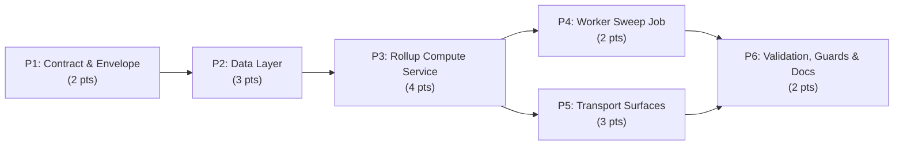

# Decisions Block: Proof → Routing Feedback Loop (BP-6)

**Feature Goal**: Turn CCDash's existing proof (repeatedly-failing / expensive routes) into a deterministic, opt-in, no-LLM `(task_class × model)` routing-feedback rollup that the MeatySkills delegation-router PULLs as an empirical routing prior — closing the AOS "backward pass" (outcome→learning→changed behavior) so that failing/expensive routes are downweighted **automatically, visibly, and reversibly**, without ever putting a model on the decision path (AOS Constraint 4).

**This Decisions Block** captures phase boundaries, agent routing, risk hotspots, estimation anchors, and model routing for the **CCDash producer side**. `implementation-planner` (sonnet) expands it into the full PRD + Implementation Plan. Router-side consumption is a named cross-repo deferral (D1, D8).

**Provenance**: `/plan:explore` verdict `conditional` (feasibility brief conf 0.75); precondition **cleared 2026-07-26** — the cross-repo `task_class` vocabulary join is pinned by `agentic_meta_dev/docs/agentic-operator/contracts/routing-feedback.md` + `routing-feedback-task-map.v1.json` (mapping v1.0.0) + `aos.routing.task_class` v1.0.0 (MeatySkills). Contract id `aos.routing.feedback` v1.0.0. Envelope digests are pinned: `taxonomy_digest sha256:d96a0819…`, `mapping_digest sha256:45a49bb1…`.

---

## Decisions

| Decision | Rationale | Status |
|----------|-----------|--------|
| D1: Ship CCDash producer surface only; router merge/consumption is a cross-repo (MeatySkills) deferral | Squash target is CCDash main; router repo owns merge math (currently `live_consumption_disabled`). Matches brief Phase 6. | locked |
| D2: Emit `(task_class × model)`; drop profile/effort_tier/model_variant; provider derived | Those 3 fields are 0/14,399 (write-path-dead); coarsened tuple density-validated (40 keys, 52% N≥5). | locked |
| D3: Apply pinned v1 mapping, emit canonical task_class + full 11-field envelope; unmapped → `_unclassified` coverage-only | 17 skill names vs 12 policy keys, 0 overlaps → exact mapping mandatory; defends silent/coincidental mis-join. | locked |
| D4: Persist worker-computed `routing_rollup` table as PULL source (not read-time) | Deterministic PULL, compute off the read path, clones `aar_reviews`. Resolves tech OQ-2. | locked |
| D5: CCDash designs the empirical metric payload (sample_count/success_rate/cost_index/regression_rate/confidence/window) | Contract pins only envelope+vocab; numeric proof fields are the producer's design surface. | locked |
| D6: Capability `routing:feedback` + default-OFF flag `CCDASH_ROUTING_FEEDBACK_ENABLED`; disabled → deterministic disabled envelope | Mirrors AAR-review capability gate + flag; opt-in default-off honours contract baseline. | locked |
| D7: Reversibility = emit-only + flag-flip (immediate, deterministic); CCDash never actuates | Emission reversibility is CCDash's; adjustment reversibility (scorecard revert, human-override, MUST-stay-primary immunity) is the router's. | locked |
| D8: Router numeric merge (cap/floor/min-sample/decay/RoutingRecord provenance) out of scope; DOC-006 handoff spec | MeatySkills/ibm-main owns it; not buildable here. | locked |
| D9: The metric payload is provisional/additive-versioned; socializing it to the router owner is a strong recommendation before Phase 5 seals — NOT a hard gate; this feature's "done" asserts producer-surface completeness, not that the feedback loop is live end-to-end | The contract leaves the numeric payload unspecified — a unilateral shape risks an unconsumable rollup, but router-owner acknowledgment cannot block CCDash's own completion on an external repo's availability/timeline. | attempted (informal) |

### D9 Socialization Attempt (recorded 2026-07-31)

Per this decision's own rationale, D9 is a schedule-risk gate, not a blocker — CCDash's Phase 5
completion does not wait on a router-owner response. An informal, real, cross-repo attempt was
nonetheless made before Phase 5 was marked complete:

- **Channel**: GitHub issue (cross-repo, informal — the acceptable evidence tier named by the
  Phase 5 plan itself).
- **Target repo**: `github.com/miethe/MeatySkills` (the repo hosting the `delegation-router`
  skill / `aos.routing.feedback` v1.0.0 contract, branch `ibm-main`).
- **URL**: <https://github.com/miethe/MeatySkills/issues/1>
- **Date**: 2026-07-31
- **Content**: Documented the full D5 metric-payload shape (`model`, `provider`, `sample_count`,
  `success_rate`, `cost_index`, `regression_rate`, `confidence`, `eligible_for_adjustment`,
  `window_start`, `window_end`, `freshness_ts` — verbatim from `RoutingRollupKeyDTO`) and asked
  three concrete questions ahead of DI-1's router-side merge-math work: (1) whether
  `success_rate`/`regression_rate` always being `None` in v1 blocks the bounded-adjustment-cap /
  effective-score-floor guardrails or can degrade gracefully; (2) whether `cost_index` is usable
  as-is or needs router-side normalization; (3) whether `eligible_for_adjustment` is sufficient
  as the min-sample-gate signal or the router wants raw `sample_count` + its own threshold only.
- **Response**: pending as of this phase's completion — no reply yet. Non-blocking per D9's own
  rationale; this is the documented attempt, not a resolution.

---

## 1. Phase Boundaries

| Phase | Name | Scope | Success Criteria | Exit Gate |
|-------|------|-------|------------------|-----------|
| P1 | Contract & Envelope Foundations | Vendor `routing-feedback-task-map.v1.json` into CCDash + pin digests; define envelope constants (contract/taxonomy/mapping ids+versions+digests); capability string `routing:feedback`; config flag `CCDASH_ROUTING_FEEDBACK_ENABLED` (default off). No behavior. | Constants + flag land; parity test asserts vendored mapping bytes == normative JSON digest. | Digest-parity test green; flag reads false by default. |
| P2 | Data Layer | `routing_rollup` table dual DDL (SQLite+PG); repository (`retry_on_locked`, busy_timeout=30000); migration + column-parity allowlist. | Table exists in both backends; repo upsert/read + direct-count assertion test pass. | Dual-DDL parity + repo tests green (ADR-006/007). |
| P3 | Rollup Compute Service | `RoutingRollupQueryService` in `agent_queries/`: aggregate sessions grouped by `(task_class × model)`; apply v1 mapping; derive provider; coverage (mapped/unclassified/distinct-unmapped); metric payload (D5); min-sample eligibility hint; window/freshness. **No LLM.** | Deterministic rollup from a fixture DB; coverage + eligibility correct; `_unclassified` never a routing key. | Determinism + mapping-fidelity + no-LLM-import tests green. |
| P4 | Worker Sweep Job | `RoutingRollupSweepJob` cloning `AARReviewSweepJob`: multi-project (`workspace_registry.list_projects()`, ADR-006), incremental, idempotent, flag-gated, cache-invalidate on write. | Sweep populates `routing_rollup` for every registered project when flag on; no-op when off. | Multi-project sweep test + flag-off no-op test green. |
| P5 | Transport Surfaces | REST `GET /api/v1/routing/rollup` (envelope-complete DTO), MCP tool, CLI `ccdash routing rollup`, capability advertisement; default-off disabled responses across all three. | All surfaces return the full 11-field envelope + metrics + coverage; disabled state deterministic. | DTO contract-lock test + disabled-state test green across REST/MCP/CLI. |
| P6 | Validation, Guards & Docs | No-LLM CI grep-guard; DTO contract lock; cross-repo digest parity test; sparse/`_unclassified`/disabled ACs; docs (consumer-contract doc, operator guide, CHANGELOG); DOC-006 deferred router-merge handoff design spec. | Guards green; docs land; deferred router work captured. | `task-completion-validator` + `karen` (feature end) pass. |

**Boundary Rationale**:
- P1–P2: Envelope + mapping constants must be frozen (and digest-verified) before any row shape or emission logic references them — the seam is the highest-risk surface.
- P2–P3: Persistence contract (table columns) is the compute service's write target; freeze it before aggregation logic.
- P3–P4: Aggregation logic is developed/tested standalone (fixture DB) before wrapping it in the multi-project worker loop.
- P4–P5: Worker (writer) and transport (reader) touch disjoint files and can partially parallelize once the table + envelope are frozen.
- P5–P6: All behavior lands before the guard/parity/determinism test battery and docs finalize.

---

## 2. Agent Routing

| Phase | Primary Agent(s) | Secondary Agent | Notes |
|-------|------------------|-----------------|-------|
| P1 | backend-architect | python-backend-engineer | Precision-critical seam; envelope constants + digest pin + capability + flag. |
| P2 | data-layer-expert | — | Dual DDL + repo + migration parity (ADR-006/007 discipline). |
| P3 | backend-architect | python-backend-engineer | Algorithmic (H3): aggregation + mapping + coverage + metric design. |
| P4 | python-backend-engineer | — | Mechanical clone of `AARReviewSweepJob`. ICA-offload eligible. |
| P5 | python-backend-engineer | — | Mechanical clone of AAR REST/MCP/CLI surfaces. ICA-offload eligible. |
| P6 | task-completion-validator (gate) | documentation-writer, python-backend-engineer | Guards + DTO/parity tests + docs + DOC-006 handoff spec. |

**Parallel Opportunities**:
- P4 (worker/writer) ∥ P5 (transport/reader) once P1 envelope + P2 table shape are frozen — disjoint files (`adapters/jobs/*` vs `routers/agent.py` + `mcp/server.py` + `cli/*`).
- P1 → P2 → P3 is the serial critical path (each freezes a contract the next consumes).

---

## 3. Risk Hotspots

### Risk 1: Silent non-join / cross-repo vocabulary drift (seam risk, R-P3)
- **Severity**: high
- **Rationale**: A well-formed rollup that the router cannot join is empirically inert; a coincidental mis-join corrupts routing. The join key is external and lives in a repo CCDash cannot see.
- **Mitigation**: Emit canonical `task_class` via the exact pinned mapping (never raw `skill_name`); carry all three digests (contract/taxonomy/mapping) verbatim; **CI parity test** asserting CCDash's vendored mapping bytes hash to the normative `mapping_digest`; router's implemented fail-closed `validateFeedbackJoin` is the backstop; `integration_owner` = the P6 parity/seam task.

### Risk 2: Per-key sparsity for a single-operator workload
- **Severity**: medium
- **Rationale**: If every `(task_class × model)` key is too thin to clear the router's min-sample gate, the signal never actuates.
- **Mitigation**: Coarsened tuple (density-validated 52% N≥5); emit `sample_count` + eligibility hint so the router applies its threshold; thin keys simply don't route (safe, not wrong); `_unclassified` visibility surfaces coverage gaps.

### Risk 3: Constraint-4 violation (LLM on the compute/read path)
- **Severity**: medium
- **Rationale**: An accidental model import in the worker or service breaks the AOS invariant and the contract's CI-enforced no-LLM clause.
- **Mitigation**: Pure-SQL aggregation; worker/service import nothing from `backend.adapters.agents`/`services.agents`; clone AAR's no-LLM grep-guard CI test; determinism test over a fixture DB.

### Risk 4: Metric-payload unconsumability (schedule/cross-repo)
- **Severity**: medium
- **Rationale**: The contract leaves the numeric payload unspecified; a unilaterally-designed shape may not match what the router's (future) merge needs.
- **Mitigation**: D5 payload is additive-versioned; P1 records it in a CCDash-authored addendum to the seam doc; **socialize to the router owner before P5 ships** (D9, attempted 2026-07-31 — see "D9 Socialization Attempt" above; response pending); keep it evidence-only so mismatch is inert, never harmful.

### Risk 5: Blast radius on CCDash
- **Severity**: low
- **Rationale**: New table/worker/endpoints could regress existing reads.
- **Mitigation**: Additive-only DDL; default-OFF flag; zero mutation of `sessions`/`aar_reviews`; instant env-var revert; disabled state returns a deterministic empty envelope.

---

## 4. Estimation Anchors

### Total: 16 points (Tier 2/3 boundary — held at Tier 2)

| Phase | Points | Reasoning Anchor |
|-------|--------|------------------|
| P1 | 2 | Constants + vendored JSON + flag + one parity test. Sub-phase of AAR-review contract wiring. |
| P2 | 3 | One additive table, dual DDL, repo + migration parity — direct analog of an `aar_reviews`-sized table (H1 noun-count ~2 + H2 dual-impl ~1.5×). |
| P3 | 4 | Algorithmic (H3: aggregation/mapping/ranking/coverage) — the only non-mechanical phase; anchored to AAR's query-service core. |
| P4 | 2 | Near-exact clone of `AARReviewSweepJob` (multi-project sweep already shipped); clone-discounted. |
| P5 | 3 | Clone of AAR REST+MCP+CLI + capability + disabled-state; three surfaces but mechanical. |
| P6 | 2 | Guards/DTO/parity tests clone AAR's; docs are focused; DOC-006 is a stub handoff spec. |

**Estimation Notes**:
- H5 anchor (primary basis): AAR-review loop (merged `7d96c3e`, ~30–45 pts / 7 phases) — this feature **skips** AAR's two heaviest phases (multi-hop feature→plan→task traversal; SkillMeat 5th-flag semantic linkage) and adds no LLM/semantic layer → ~16 pts is a ~55% discount off the anchor.
- **Reconciliation with the feasibility brief**: the brief's original 10–16 pt range assumed a
  read-time-only aggregation path. This plan instead commits to the **persisted** path (D4), whose
  comparable AAR-review-clone expectation is actually ~16–20 pts — 16 pts is therefore the **floor**
  of that 16–20 range, not the ceiling of the brief's original (read-time) 10–16 range. Three named
  contingencies could push the total toward 20: (1) Phase 3 is tied to D9 socialization risk — the
  metric-payload shape may need revision after router-owner feedback; (2) Phase 4's rolling-window
  UPSERT identity (post-B2 grain fix: `(project_id, source_skill_name, model)` with no `window_start`
  in the key) differs from the AAR-review job's simpler append-only triage pattern, so it is not a pure
  mechanical clone; (3) Phase 6's DOC-006 task authors THREE design specs (including DI-1, the
  router-merge-math handoff, which requires real synthesis), not one boilerplate stub.
- H6 hidden plumbing (~15%: DTOs, capability advertisement, OpenAPI, CHANGELOG, config) is absorbed into P1/P5/P6 line items.
- Boundary call: 16 pts nominally reads Tier 3, but complexity/risk are Tier 2 (one algorithmic phase; rest are additive clones) and the SPIKE is satisfied by the exploration. Held at **Tier 2** with a strengthened reviewer gate — `karen` at the P3 milestone (algorithmic core) **and** feature end, in addition to `task-completion-validator` per phase.

---

## 5. Dependency Map

**Critical Path**: P1 → P2 → P3 → (P4 ∥ P5) → P6

**Parallelizable Slices**: After P3, the worker (P4, writes `routing_rollup`) and the transport surfaces (P5, read `routing_rollup`) touch disjoint files and run in parallel under file-ownership batching. P1 and P2–P3 are strictly serial (each freezes a contract the next consumes).

---

## 6. Model Routing

Routing follows `/delegation-router`: contract-precision + algorithmic phases stay on primary Claude; mechanical clone waves are ICA-offload-eligible (`claude-sonnet-5[1m]`) to cost-shift bounded work. No task touches auth/payments/deletion (a new additive migration is not a Mode-D migration of existing data) — no Mode-D primary-lock. No external models (no UI/image/web-research surface). Opus does not execute (orchestration only).

| Phase | Agent | Model | Effort | Rationale |
|-------|-------|-------|--------|-----------|
| P1 | backend-architect | sonnet | adaptive | Seam precision (digest pins, envelope) — keep on primary; do not offload. |
| P2 | data-layer-expert | sonnet | adaptive | Dual-DDL + migration parity; primary for schema-parity rigor. |
| P3 | backend-architect / python-backend-engineer | sonnet | extended | Algorithmic core (aggregation + mapping + coverage + metric design) — highest reasoning need; primary. |
| P4 | python-backend-engineer | sonnet | adaptive | Mechanical `AARReviewSweepJob` clone — **ICA-offload eligible** (`claude-sonnet-5[1m]`), re-run gates on return. |
| P5 | python-backend-engineer | sonnet | adaptive | Mechanical REST/MCP/CLI clone — **ICA-offload eligible**; re-run gates on return. |
| P6 | documentation-writer (docs), python-backend-engineer (tests), task-completion-validator (gate) | haiku (docs) / sonnet (tests) | adaptive | Docs are focused (haiku); guard/parity tests need sonnet; validator gate is mandatory. |

**Model Routing Notes**:
- Fallback for ICA-offloaded P4/P5: if ICA unavailable, execute on primary sonnet (per delegation-router `fallback_chain`); output must re-pass P6 guards regardless of provider.
- Cross-repo/seam phases (P1, P3, P6-parity) are **not** offloaded — precision + digest-fidelity outweigh cost-shift.

---

## 7. Open Questions for Expansion

- **OQ-1** *(resolved by D4)*: Persisted table vs read-time aggregation → **persisted**. Planner: confirm `routing_rollup` is the sole PULL source and the worker is its only writer.
- **OQ-2**: Exact metric-payload schema (D5). Planner proposes concrete fields+types: `sample_count:int`, `success_rate:float`, `cost_index:float`, `regression_rate:float`, `confidence:float`, `window_start`/`window_end`, `freshness_ts`; and marks which are router-consumed vs CCDash-diagnostic.
- **OQ-3**: Min-sample split. CCDash emits `sample_count` + an `eligibility_hint` (default threshold 5, per value-findings N≥5); the numeric gate is the router's. Planner: define `eligibility_hint` semantics + default + override env.
- **OQ-4**: Protected-class emission policy. Default: emit `orchestration` / `mode_d` / `_unclassified` as **coverage-only** rows (never routing keys), config-gated. Planner: confirm and name the config.
- **OQ-5**: Vendored-mapping location + refresh procedure. Planner picks a CCDash path for the v1 JSON (e.g., `backend/application/services/agent_queries/routing_task_map_v1.json`) and defines the version+digest-bump refresh + the CI parity test.
- **OQ-6**: Window length + decay-input representation (contract says CCDash "owns window/freshness/decay inputs" but fixes no length). Planner proposes a default rolling window (anchor: value-findings used 30-day) + a config knob.

---

## 8. Plan Skeleton Pointer

This decisions block expands into a full **PRD + Implementation Plan**:

- **PRD template**: `.claude/skills/planning/templates/prd-template.md` → `docs/project_plans/PRDs/infrastructure/proof-to-routing-loop-v1.md`
- **Plan template**: `.claude/skills/planning/templates/implementation-plan-template.md` → `docs/project_plans/implementation_plans/infrastructure/proof-to-routing-loop-v1.md`
- **Process**: `prd-writer` (sonnet) authors the PRD from this block + the feasibility brief; `implementation-planner` (sonnet) then expands this block + the PRD into the phased plan with `wave_plan` frontmatter, task tables, and per-task model/effort columns.
- **Opus review**: sanity check post-expansion (phase boundaries, agent routing, AC discipline R-P1..R-P4, no dropped risks) before execution begins.

---

## Notes for prd-writer / implementation-planner

- **Import** the feasibility brief into PRD `related_documents`: `docs/project_plans/exploration/proof-to-routing-loop/proof-to-routing-loop-feasibility-brief.md` (+ the 3 spike findings + design spec).
- **AC discipline (R-P1..R-P4)**: this feature has **no FE surface** — R-P2/R-P4 (FE fallback + UI runtime smoke) map instead to *consumer-absent*, *version-mismatch*, *sparse-key*, and *disabled-state* resilience ACs. R-P3 seam = the **cross-repo** producer↔router seam; the seam task is the P6 digest-parity + envelope-completeness test; declare `integration_owner` on P6.
- **Structured ACs** required for: envelope completeness (all 11 pinned fields + coverage counts), mapping fidelity (vendored bytes == `mapping_digest`), determinism / no-LLM, default-off disabled behavior, sparse/`_unclassified` handling, reversibility (flag flip → deterministic disabled envelope).
- **Deferred items** (→ DOC-006 in P6): router-side empirical merge + live consumption (cross-repo, MeatySkills, D8); `model`/`provider` cross-repo namespacing (profile dropped as write-path-dead); read-time-vs-persisted (resolved, note only).
- **Do NOT** describe or plan router-repo code as in-scope tasks; reference it as a pinned seam + handoff only.
- **changelog_required: true** — this adds operator-facing CLI/MCP/REST surfaces + a capability string.
