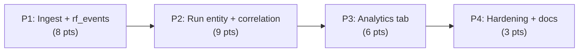

# Decisions Block: Research Foundry Run Telemetry in CCDash

**Feature Goal**: Ingest, persist, correlate, and visualize Research Foundry search-run telemetry (RF spec §11.2 `search_run` / §16 `execution_event`) in CCDash as a first-class run entity — linked to existing sessions — so the operator can see provider cost/quality/drift and close the ADR's evidence-driven provider-selection loop.

**This Decisions Block** captures phase boundaries, correlation strategy, risk hotspots, estimation anchors, and model routing. Opus authored it from the completed exploration (`docs/project_plans/exploration/research-foundry-run-telemetry/`); `implementation-planner` (sonnet) expands it into the full PRD + Implementation Plan. The exploration bundle satisfies the Tier-3 SPIKE gate — no separate SPIKE required.

---

## Decisions

| Decision | Rationale | Status |
|----------|-----------|--------|
| D1: Transport = new `POST /api/v1/ingest/rf-events` + `rf_events` table, reusing NDJSON/ingest_cursors/dead-letter (ADR-008/009/014/015) | RF emits YAML only inside its own workspace; `/ingest/sessions` is semantically wrong. FS-watch over RF's `ccdash/events/` is the no-RF-rework fallback. | locked |
| D2: Correlate run↔session via `links.py` entity-link rows (kind=research_run) keyed by UUID `run_id`; RF ids display-only; no `aos_correlation.py` extension | RF ids are non-UUID slugs incompatible with the AOS URN graph. | locked |
| D3: Dual SQLite+PG DDL, `retry_on_locked`, direct-count test, parity-allowlist entry (ADR-007) | Non-negotiable DB write-path rule; `ingest_cursors` v36 precedent. | locked |
| D4: 4-panel tab inside `AnalyticsDashboard.tsx`, not a new top-level route | Existing visual language; reversible; YAGNI. | locked |
| D5: D-001 dedup on any run↔session rollup from day one + regression test | Same one-to-many shape as deferred D-001 over-count. | locked |
| D6: `rf_events` (raw log) + `research_runs` (derived rollup) as two tables | Ingest stays append-only/idempotent; rollup recomputable. | pending |
| D7: per-provider splits via `source_cards` join now vs. defer | §16 event has no per-provider splits. | pending |

---

## 1. Phase Boundaries

| Phase | Name | Scope | Success Criteria | Exit Gate |
|-------|------|-------|------------------|-----------|
| P1 | Ingest transport + persistence | New `POST /api/v1/ingest/rf-events` (workspace-token auth, NDJSON/JSON); `rf_events` raw table (dual DDL); idempotent enqueue via `ingest_cursors`; dead-letter; `/api/v1/capabilities` advert (`ingest:rf-events`); redaction pass | RF-shaped event POSTs, persists idempotently, dead-letters on failure; parity + direct-count tests green | Real+seeded event ingested; `ingest_sources[]` health shows the source |
| P2 | Run entity + intelligence + correlation | `research_runs` rollup (dual DDL); `run_intelligence.py` agent-query service; `GET /api/agent/research-runs` (+ detail); run↔session `links.py` correlation (kind=research_run, UUID `run_id`); D-001 dedup; MCP/CLI parity | Runs queryable with metrics + linked sessions; dedup regression test passes | AC-covered endpoint returns run rollups; correlation + dedup tests green |
| P3 | Analytics visualization tab | 4-panel "Research / Provider Economics" tab in `AnalyticsDashboard.tsx`; TanStack Query hooks + query-key registry; `types.ts` entities; resilience for absent/optional fields | Tab renders from live+seeded data; degrades gracefully with zero events | Runtime smoke on the tab at ≥1440px; resilience AC verified |
| P4 | Hardening + docs + deferred specs | Operator guide, CHANGELOG, deferred-panel design specs (per-provider, by-domain, claims), feature-flag doc | Docs land; deferred items captured as specs; karen end-of-feature pass | karen sign-off; AC coverage matrix green |

**Boundary Rationale**:
- P1–P2: The ingest contract + raw persistence must be stable before the run rollup/query surface derives from it (contract-first; P1 does not depend on RF being wired).
- P2–P3: Backend run contract defined and testable (seedable) before the UI renders it; FE can proceed against the typed contract independently.
- P3–P4: Feature is functional before hardening/docs; deferred-panel specs depend on knowing what MVP shipped.

---

## 2. Agent Routing

| Phase | Primary Agent(s) | Secondary Agent | Notes |
|-------|------------------|-----------------|-------|
| P1 | data-layer-expert (rf_events DDL, migrations, parity) | python-backend-engineer (ingest endpoint, dead-letter, cursors) | File-ownership split: schema/migrations vs router/service |
| P2 | python-backend-engineer (run_intelligence service, endpoint) | backend-architect (correlation strategy, D-001 dedup design) | backend-architect owns the links.py join + dedup; extended effort |
| P3 | ui-engineer-enhanced (tab + panels + hooks) | frontend-developer (charts, types, resilience fallbacks) | Match existing AnalyticsDashboard patterns |
| P4 | documentation-writer (guide/CHANGELOG/specs) | task-completion-validator / karen (gates) | haiku for docs |

**Parallel Opportunities**:
- P1 schema (data-layer-expert) ∥ P1 endpoint scaffold (python-backend-engineer) under file ownership.
- P4 docs can begin during P3 tail.
- P2 and P3 must sequence: FE renders the P2 contract.

---

## 3. Risk Hotspots

### Risk 1: D-001 correlation over-count reproduced at run↔session join
- **Severity**: high
- **Rationale**: run↔session is one-to-many; naive SUM over joined rows double-counts cost/workload, reproducing the deferred D-001 bug at a new layer.
- **Mitigation**: Apply DISTINCT/GROUP-BY-before-sum from day one (P2); ship a dedup regression test as an exit gate. Reference `docs/project_plans/design-specs/f-w6-001-correlation-overcounting.md` Option A.

### Risk 2: Correlation-key mismatch (RF slugs vs CCDash UUIDs)
- **Severity**: medium
- **Rationale**: RF `intent_id`/`task_node_id` are semantic strings that fail `UUID_RE`/`AOS_URN_RE`; force-fitting into `aos_correlation.py` corrupts the AOS graph.
- **Mitigation**: D2 — entity-link rows keyed by genuine UUID `run_id`; RF ids stored as display-only attributes. No `aos_correlation.py` change.

### Risk 3: Per-provider data gap (panels not computable from the event)
- **Severity**: medium
- **Rationale**: §16 event carries run-level aggregates + a provider LIST only; "by provider/domain/extractor" panels can't be derived from it alone.
- **Mitigation**: Build the honest per-mode/per-run grain (P3 MVP); defer per-provider panels to P4 specs with a named unblock (RF per-provider splits OR a `source_cards` join). D7.

### Risk 4: RF telemetry may not flow yet (cross-system coupling)
- **Severity**: medium
- **Rationale**: RF transport is `defined_stubbed`; live events depend on the handed-off RF addendum shipping.
- **Mitigation**: Contract-first P1 (buildable now); resilience-by-default so every surface degrades to empty state; feature flag; FS-watch fallback needs no RF change. Seed fixtures for tests.

### Risk 5: Dual-DDL parity drift
- **Severity**: low-medium
- **Rationale**: Two new tables across SQLite + Postgres risk column-parity drift.
- **Mitigation**: `migration_governance` + `COLUMN_PARITY_DRIFT_ALLOWLIST` + `ingest_cursors` v36 as the copy-precedent; parity test in P1 exit gate.

---

## 4. Estimation Anchors

### Total: 26 points

| Phase | Points | Reasoning Anchor |
|-------|--------|------------------|
| P1 | 8 | Remote session ingest / ADR-008 stack (`ingest_cursors` v36, dead-letter, capability advert) — same transport shape, one new raw table |
| P2 | 9 | Existing agent_queries services (`system_metrics.py`, `artifact_intelligence.py`) + links.py correlation + D-001 dedup (algorithmic → risk leg flagged, +3 per H3) |
| P3 | 6 | Existing `AnalyticsDashboard` tabs (MetricCard strip + recharts + drill table) — 4 panels, one new tab body |
| P4 | 3 | Hidden-plumbing/docs budget (H6): guide, CHANGELOG, deferred specs, gates |

**Estimation Notes**:
- Confirms Tier 3 (>13 pts). SPIKE gate satisfied by the completed exploration bundle.
- P2 carries the algorithmic risk (correlation + dedup); it is the phase most likely to inflate — budget `karen` milestone here.
- H2 dual-implementation multiplier already absorbed (dual SQLite+PG DDL is the norm, priced into P1/P2).

---

## 5. Dependency Map

**Critical Path**: P1 (ingest+persistence) → P2 (run entity+correlation) → P3 (viz tab). P4 trails P3.

**Parallelizable Slices**: P1 schema ∥ P1 endpoint (file ownership); P4 docs ∥ P3 tail.

---

## 6. Model Routing

| Phase | Agent | Model | Effort | Rationale |
|-------|-------|-------|--------|-----------|
| P1 | data-layer-expert | sonnet | medium | DDL parity + migration governance is patterned but detail-sensitive |
| P1 | python-backend-engineer | sonnet | medium | Ingest endpoint reuses ADR-008 stack |
| P2 | backend-architect | sonnet | extended | Correlation strategy + D-001 dedup is the algorithmic hotspot |
| P2 | python-backend-engineer | sonnet | medium | Service + endpoint implementation |
| P3 | ui-engineer-enhanced | sonnet | medium | Match existing dashboard patterns |
| P3 | frontend-developer | sonnet | low | Chart wiring + resilience fallbacks |
| P4 | documentation-writer | haiku | adaptive | Docs/CHANGELOG/specs |

**Model Routing Notes**:
- No external-model callouts required.
- `task-completion-validator` per phase (sonnet); `karen` at P2 milestone + end of feature.

---

## 7. Open Questions for Expansion

- **OQ-1**: One table (`rf_events`) or two (`rf_events` raw + `research_runs` rollup)? Lean two (D6) — confirm and define the rollup recompute trigger.
- **OQ-2**: Feature-flag name + default. Recommend `CCDASH_RF_TELEMETRY_ENABLED` (default true, fail-open) gating ingest + tab.
- **OQ-3**: Expose run intelligence via MCP + CLI in this feature (transport-neutral pattern) or defer to a follow-up? Recommend include the query service; MCP/CLI thin wrappers optional in P2.
- **OQ-4**: Per-provider split — `source_cards` join now or defer to P4 spec? (D7) Recommend defer; document the unblock.
- **OQ-5**: Should `run_id`↔IntentTree `intent_id` resolve via the IntentTree API, or store the slug opaque? Recommend opaque display-only for MVP; IntentTree resolution is a follow-up.

---

## 8. Plan Skeleton Pointer

Expands into a full **Implementation Plan** using:
- **Location**: `.claude/skills/planning/templates/implementation-plan-template.md`
- **PRD**: authored first by `prd-writer` at `docs/project_plans/PRDs/features/research-foundry-run-telemetry-v1.md`, importing the feasibility brief into `related_documents`.
- **Output path**: `docs/project_plans/implementation_plans/features/research-foundry-run-telemetry-v1.md`
- **Opus review**: sanity check post-expansion; verify phase boundaries + correlation strategy (D2/D5) survived expansion.
