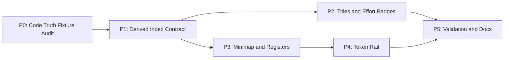

# Decisions Block: Session Transcript Orchestration Intelligence V1

**Feature Goal**: Make CCDash session transcripts navigable by command, task, workflow, effort, plan metadata, branch/thread structure, and token burn.

This block captures high-level decisions that shaped the PRD and implementation plan.

## Decisions

| Decision | Rationale | Status |
|----------|-----------|--------|
| Frame V1 as a successor integration over the existing CCDash observability architecture. | Plan 2, usage-attribution, context/cost, workflow-registry, planning-board, and append-delta work already define the source semantics and runtime boundaries. | locked |
| Use a derived transcript intelligence index before adding a persisted marker table. | The current session detail/log APIs already carry enough source data for V1, while Agent Teams and workflow output-file shapes still need fixture validation. | locked |
| Represent task and workflow state as sidepane registers with transcript marker links. | This reduces transcript noise without hiding raw rows and creates a stable place for stateful orchestration data. | locked |
| Treat token data as coverage-aware and never split assistant-turn usage across tool calls without event-level attribution. | Per-message token usage exists today, but per-tool-call attribution is only defensible when usage-event attribution data exists. | locked |
| Infer effort from launch sidecars first, then transcript commands and metadata. | Launch capture is explicit when present; transcript commands cover mid-session changes and legacy rows with null effortTier. | locked |
| Build on transcript append deltas; do not add a second live transport. | The transcript surface already has live append plumbing, so V1 should extend the existing topic/fallback rather than creating parallel update paths. | locked |

## 1. Phase Boundaries

| Phase | Name | Scope | Success Criteria | Exit Gate |
|-------|------|-------|------------------|-----------|
| P0 | Code Truth Fixture and Source Audit | Confirm route/API ownership, Agent Teams event shape, workflow output-file safety, live sample markers, and available usage granularity. | Fixture matrix documents supported and unknown sources. | Research note appended to implementation PR before backend contract locks. |
| P1 | Derived Index Contract | Add backend DTOs/service for inferred titles, effort transitions, transcript markers, task register, workflow register, and token coverage. | API contract returns deterministic marker/register payloads for synthetic and live sample sessions. | Backend unit/API tests pass. |
| P2 | Session List and Header | Render inferred titles and effort/model badges. | `/sessions` list and selected detail header show useful titles and effort state. | Frontend tests plus runtime smoke. |
| P3 | Minimap and Registers | Add minimap, task register, workflow register, and plan metadata sidepane views. | User can jump to major markers and inspect task/workflow state. | Runtime smoke on live sample. |
| P4 | Token Rail and Agent Detail | Add coverage-aware token rail and agent/workflow token summaries. | Row-level token detail appears only where source data supports it. | Token fixture tests and runtime smoke. |
| P5 | Validation, Docs, Rollout | Regression, accessibility, performance, changelog, and operator guidance. | Feature flag rollout path and docs complete. | Full selected test suite plus browser smoke. |

**Boundary Rationale**:

- P0 is separate because Agent Teams and workflow output-file contracts are not yet stable from local code alone.
- P1 creates a backend-derived contract so P2-P4 do not each parse raw transcript rows independently.
- P4 follows P3 because token rail alignment depends on final row grouping and minimap markers.

## 2. Agent Routing

| Phase | Primary Agent(s) | Secondary Agent | Notes |
|-------|------------------|-----------------|-------|
| P0 | codebase-explorer, backend-architect | documentation-writer | Code truth, fixture/source audit, and findings note. |
| P1 | backend-architect, python-backend-engineer | data-layer-expert | Derived DTO/query service, no persisted marker table. |
| P2 | ui-engineer-enhanced | frontend-developer | Session list/header rendering. |
| P3 | ui-engineer-enhanced, frontend-developer | web-accessibility-checker | Minimap, task/workflow sidepane, keyboard behavior. |
| P4 | frontend-developer | react-performance-optimizer | Token rail and row alignment/performance. |
| P5 | task-completion-validator, documentation-writer | web-accessibility-checker | Validation, docs, changelog. |

**Parallel Opportunities**:

- P2 can start after P1 exposes inferred-title/effort fields.
- P3 task/workflow sidepane and minimap components can split by file ownership after P1 DTOs are stable.
- P4 must sequence after row grouping to avoid rail alignment churn.

## 3. Risk Hotspots

### Risk 1: Agent Teams event shape is unknown

- **Severity**: medium
- **Rationale**: Treating Agent Teams like normal Task/Agent calls could misrepresent workflow topology.
- **Mitigation**: Phase 0 fixture audit; unknown rows render as unclassified orchestration markers until support is explicit.

### Risk 2: Token false precision

- **Severity**: high
- **Rationale**: Claude Code per-message `message.usage` is assistant-turn-level, not tool-call-level.
- **Mitigation**: Token rail must include source/coverage labels and never allocate turn tokens to tool calls without usage-attribution events.

### Risk 3: Transcript row alignment and performance

- **Severity**: medium
- **Rationale**: Minimap, token rail, and collapsed task rows interact with virtualized transcript layout.
- **Mitigation**: Stable row ids, measured row heights, runtime smoke on large sessions, and reduced-motion support.

### Risk 4: Plan metadata over-correlation

- **Severity**: medium
- **Rationale**: Feature slugs and task ids can appear in prose without being authoritative links.
- **Mitigation**: Every derived link includes method and confidence; low-confidence links are presented as suggestions.

## 4. Estimation Anchors

### Total: 20 points

| Phase | Points | Reasoning Anchor |
|-------|--------|------------------|
| P0 | 2.5 | Similar to branch-aware planning feasibility audits, plus route/API/component ownership confirmation. |
| P1 | 5 | Comparable to planning-agent-session-board query contract work, with less new persistence. |
| P2 | 2.5 | Similar to session-card metadata display work plus stale-link compatibility cleanup. |
| P3 | 5 | UI-heavy, comparable to Planning Agent Session Board interaction slices. |
| P4 | 3 | Builds on per-message-token-usage contract plus usage attribution foundations. |
| P5 | 2 | Required browser smoke, a11y, performance, and docs for UI-heavy transcript work. |

**Estimation Notes**:

- This is Tier 3 because it spans backend derived contracts, existing transcript UI, task/workflow semantics, plan metadata, and token visualization.
- No new CRUD domain noun is planned in V1; a persisted marker table would promote scope.

## 5. Dependency Map

**Critical Path**: P0 -> P1 -> P3 -> P4 -> P5.

**Parallelizable Slices**:

- P2 can run after P1 exposes title/effort fields.
- P3 minimap and task/workflow sidepane can split after DTOs are stable.

## 6. Model Routing

| Phase | Agent | Model | Effort | Rationale |
|-------|-------|-------|--------|-----------|
| P0 | codebase-explorer | sonnet | adaptive | Code truth, fixture, and source audit. |
| P1 | backend-architect | sonnet | extended | Contract design must prevent UI re-parsing and false links. |
| P1 | python-backend-engineer | sonnet | adaptive | DTO/service/test implementation. |
| P2 | ui-engineer-enhanced | sonnet | adaptive | Focused metadata UI. |
| P3 | ui-engineer-enhanced | sonnet | extended | Complex interactive minimap and sidepane states. |
| P4 | frontend-developer | sonnet | adaptive | Token rail component and formatting. |
| P5 | task-completion-validator | sonnet | adaptive | Acceptance review. |

## 7. Open Questions for Expansion

- **OQ-1**: What Agent Teams JSONL/events are available in local/live sessions?
- **OQ-2**: Should workflow output-file metadata be parsed during sync or linked lazily?
- **OQ-3**: What minimap density threshold prevents long-session overload?
- **OQ-4**: Which plan/task link methods are high-confidence enough for primary display?

## 8. Plan Skeleton Pointer

- **PRD**: `docs/project_plans/PRDs/enhancements/session-transcript-orchestration-intelligence-v1.md`
- **Implementation Plan**: `docs/project_plans/implementation_plans/enhancements/session-transcript-orchestration-intelligence-v1.md`
- **Design Spec**: `docs/project_plans/design-specs/session-transcript-orchestration-intelligence-v1.md`
- **Human Brief**: `docs/project_plans/human-briefs/session-transcript-orchestration-intelligence-v1.md`
