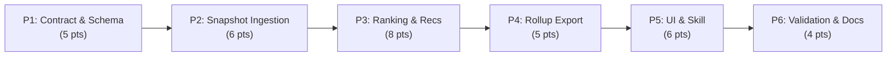

# Decisions Block: SkillMeat Artifact Usage Intelligence Exchange V1

**Feature Goal**: Close the CCDash↔SkillMeat artifact intelligence loop by adding snapshot exchange, project/user/collection-aware usage rollups, artifact rankings, and advisory optimization recommendations.

**This Decisions Block** captures phase boundaries, agent routing, risk hotspots, estimation anchors, and model routing. Opus authors this; sonnet `implementation-planner` expands it into the full Implementation Plan.

---

## 1. Phase Boundaries

| Phase | Name | Scope | Success Criteria | Exit Gate |
|-------|------|-------|------------------|-----------|
| P1 | Contract & Snapshot Foundation | Snapshot/rollup JSON schemas, CCDash DTOs (Pydantic + TS), freshness semantics, compatibility shims for existing artifact outcome payloads | Schema files parse; DTO round-trip tests pass; existing telemetry exporter tests still green | Unit tests for schema validation + backward-compat assertion |
| P2 | Snapshot Ingestion & Storage | `skillmeat_client.py` snapshot fetch, freshness/identity mapping persistence in DB, snapshot diagnostics query, sync integration | CCDash fetches and stores a snapshot for a configured project/collection; freshness and identity mapping queryable via repository | Integration test: fetch → store → query cycle with seeded SkillMeat fixture |
| P3 | Ranking & Recommendation Engine | Ranking computation service (artifact × project × collection × user × workflow × period), recommendation classifier (7 types), evidence/confidence gating | Rankings queryable by all dimensions; recommendations pass advisory-only assertion; gating suppresses weak-evidence recs | Calibration test with seeded attribution data; recommendation type coverage |
| P4 | Rollup Export & SkillMeat Persistence | Extend `telemetry_exporter.py` with project/user/collection rollup payloads, SkillMeat additive ingestion endpoints, privacy guard assertions | Rollup export succeeds end-to-end; SkillMeat stores project/collection metrics; existing artifact outcome ingestion unaffected | Export integration test + SkillMeat contract test + privacy payload assertion |
| P5 | UI & Skill Surfaces | Analytics artifact rankings view, Workflow Effectiveness artifact contribution, Execution Workbench recommendation surface, Settings snapshot health, `ccdash` MCP/CLI recommendation query | All 5 surfaces render with seeded data; `ccdash` skill returns concise recommendation summary | Runtime smoke per surface + MCP tool test |
| P6 | Validation, Privacy & Docs | Contract tests, seeded fixture tests, recommendation calibration review, privacy audit of all export payloads, operator docs, CHANGELOG | All contract tests pass; privacy audit finds no PII leaks; operator docs exist; calibration report generated | Full test suite green + privacy checklist signed off |

**Boundary Rationale**:
- P1→P2: Schemas and DTOs must be finalized before any I/O code can be written. Keeps contract changes isolated from implementation.
- P2→P3: Snapshot must be ingested and queryable before rankings can be computed against it. Identity mapping drives ranking correctness.
- P3→P4: Rankings and recommendations must exist locally before they can be exported. Export is additive to existing telemetry — sequencing prevents regressions.
- P4→P5: Backend APIs must be stable before UI surfaces consume them. UI is the widest blast radius — do it after contracts are locked.
- P5→P6: Validation phase tests the integrated system, not individual layers. Privacy audit must cover the complete export path including UI-triggered exports.

---

## 2. Agent Routing

| Phase | Primary Agent(s) | Secondary Agent | Notes |
|-------|------------------|-----------------|-------|
| P1 | python-backend-engineer | ui-engineer-enhanced | BE: Pydantic models + schema validation. FE: TS type generation from schema |
| P2 | python-backend-engineer | data-layer-expert | Snapshot fetch, repository, sync wiring. DLE for migration + query optimization |
| P3 | python-backend-engineer | backend-architect | Ranking computation is algorithmic (H3). Architect reviews ranking algebra |
| P4 | python-backend-engineer | python-backend-engineer | Extend telemetry exporter + add SkillMeat ingestion contract stubs |
| P5 | ui-engineer-enhanced | frontend-developer | Analytics/WF/Execution surfaces. FD for Settings panel + `ccdash` MCP/CLI |
| P6 | task-completion-validator | documentation-writer | Validator runs contract tests; doc-writer produces operator docs |

**Parallel Opportunities**:
- P1: BE schema + FE types can run in parallel (no file overlap)
- P5: Analytics surface + Settings surface + MCP query can parallelize (distinct file owners)
- P2 and P3 are strictly serial (P3 depends on P2 snapshot data)
- P4 depends on P3 (rollup payloads carry ranking/recommendation data)

---

## 3. Risk Hotspots

### Risk 1: Artifact Identity Resolution
- **Severity**: high
- **Rationale**: CCDash usage attribution uses observed skill/agent/artifact names; SkillMeat uses UUIDs + content hashes. Mismatches produce incorrect rankings and false recommendations. This is the hardest algorithmic problem in the feature.
- **Mitigation**: Three-tier resolution: (1) snapshot UUID/content-hash exact match, (2) alias/name fuzzy match with confidence threshold, (3) unresolved quarantine with `identity_reconciliation` recommendation. Seeded fixture tests with known mismatches.

### Risk 2: Privacy Leakage in Rollup Export
- **Severity**: high
- **Rationale**: Rollups aggregate token usage, effectiveness, and user scopes. Raw prompts, transcripts, paths, or unhashed usernames must never leak. Hosted vs. local mode have different privacy contracts.
- **Mitigation**: `AnonymizationVerifier` guard (already exists for telemetry exporter) extended to cover new rollup fields. Explicit field-level allowlist. Privacy assertion tests on every export payload shape. Local mode uses pseudonymous user scope or omits dimension entirely.

### Risk 3: Recommendation Aggression
- **Severity**: medium
- **Rationale**: Users may act on recommendations without understanding confidence bounds. A "disable_candidate" on a rarely-used but critical skill could break workflows.
- **Mitigation**: V1 is strictly advisory — no automatic mutations. Every recommendation requires evidence, confidence ≥ threshold, adequate sample size, and fresh snapshot. Stale-snapshot recommendations suppressed. UI shows confidence prominently.

### Risk 4: Snapshot Staleness
- **Severity**: medium
- **Rationale**: If snapshot fetch fails or ages, rankings compare observed usage against an outdated artifact inventory. False "unused" artifacts appear.
- **Mitigation**: Freshness metadata on every ranking/recommendation. Configurable staleness threshold. Stale snapshots suppress destructive recommendation types (`disable_candidate`, `workflow_specific_swap`). Diagnostics surface shows snapshot age.

### Risk 5: Existing Telemetry Exporter Regression
- **Severity**: medium
- **Rationale**: P4 extends telemetry exporter with new payload dimensions. Breaking existing artifact outcome ingestion would regress the foundation.
- **Mitigation**: Additive contract — new fields are optional in rollup payloads. Existing artifact outcome tests pinned as regression suite. Backward-compat assertion in P1 schema work.

---

## 4. Estimation Anchors

### Total: 34 points

| Phase | Points | Reasoning Anchor |
|-------|--------|------------------|
| P1 | 5 | Schema + DTO work comparable to OTel ingestion foundation (Phase 1 of otel-session-metrics-ingestion: ~4 pts for schemas + 1 pt for TS types) |
| P2 | 6 | Snapshot fetch + persistence comparable to telemetry exporter Phase 1 (queue + repo + sync = 7 pts, slightly less complex here — no queue) |
| P3 | 8 | Ranking engine is algorithmic (H3): multi-dimensional aggregation + 7 recommendation classifiers + confidence gating. Comparable to workflow_effectiveness.py (~5 pts) but with more dimensions and recommendation logic (+3 pts) |
| P4 | 5 | Extends existing telemetry exporter patterns; comparable to exporter Phase 2 (client + job = 7 pts) but simpler — reuses existing client/job, adds payloads only |
| P5 | 6 | 5 UI surfaces (Analytics, WF, Execution, Settings, MCP/CLI). ~1 pt per surface on average; comparable to planning control plane UI (~5 pts) + MCP tool (+1 pt) |
| P6 | 4 | Validation + docs comparable to telemetry exporter Phase 4 (hardening = 5 pts) minus load testing scope |

**Estimation Notes**:
- P3 is the riskiest phase (algorithmic + highest point count). Consider splitting into P3a (ranking computation) and P3b (recommendation classifier) if mid-flight estimate exceeds +50%.
- Cross-system integration (CCDash + SkillMeat) adds latency to feedback loops — budget 10% velocity drag for contract negotiation.
- H3 flag: Ranking engine and identity resolution are algorithmic. Test scenarios must be enumerated in task ACs.

### Estimation Sanity Check

**Noun count (H1)**: ~4 new domain concepts (snapshot_cache, artifact_ranking, artifact_recommendation, usage_rollup_log) → ≥8 pt floor
**Dual-impl multiplier (H2)**: N — CCDash uses single async DB backend (SQLite/PostgreSQL via same interface), not dual repository pattern
**Algorithmic flag (H3)**: artifact_ranking_service (ranking + multi-dimensional aggregation), recommendation_classifier (7-type classifier with confidence gating), identity_resolver (3-tier resolution) → 3 flagged services, budgeted at 8 pts (P3) + 2 pts embedded in P2
**Bundle decomposition (H4)**:
  | Area | Independent Est. | Notes |
  |------|-----------------|-------|
  | Snapshot exchange (P1+P2) | 11 pts | Schema + fetch + store |
  | Ranking & recommendations (P3) | 8 pts | Algorithmic core |
  | Rollup export (P4) | 5 pts | Extends existing exporter |
  | UI & skill surfaces (P5) | 6 pts | 5 surfaces |
  | Validation & docs (P6) | 4 pts | Cross-cutting |
  | **Σ** | **34 pts** | |
**Anchor (H5)**: `ccdash-telemetry-exporter` cost 28 pts over 4 phases (3-4 weeks). This plan has wider surface (6 phases, 3 algorithmic services, 5 UI surfaces, cross-system contract) — 34 pts (+21%) is within range given additional scope.
**Plumbing budget (H6)**: ~5 pts (~15%) embedded across phases for DTOs, feature flags, OpenAPI, CHANGELOG, config entries.

**Bottom-up total**: 34 pts
**Top-down intuition**: 30-35 pts (5-7 week timeline per PRD)
**Locked estimate**: 34 pts

---

## 5. Dependency Map

**Critical Path**: P1 → P2 → P3 → P4 → P5 → P6 (strict serial for core data flow)

**Parallelizable Slices**:
- P1: BE schemas ∥ FE TS types (distinct files)
- P5: Analytics surface ∥ Settings surface ∥ MCP/CLI query (distinct component owners)
- P6: Contract tests ∥ Privacy audit ∥ Operator docs (independent verification activities)

---

## 6. Model Routing

| Phase | Agent | Model | Effort | Rationale |
|-------|-------|-------|--------|-----------|
| P1 | python-backend-engineer | sonnet | medium | Schema design requires moderate reasoning for backward compat |
| P1 | ui-engineer-enhanced | sonnet | low | TS type generation is mechanical from schema |
| P2 | python-backend-engineer | sonnet | medium | Snapshot fetch + identity mapping has integration complexity |
| P2 | data-layer-expert | sonnet | medium | Migration design + query optimization for snapshot tables |
| P3 | python-backend-engineer | sonnet | high | Algorithmic ranking + recommendation logic requires deep reasoning |
| P3 | backend-architect | sonnet | medium | Review ranking algebra and recommendation gating logic |
| P4 | python-backend-engineer | sonnet | medium | Extends existing patterns but new payload dimensions |
| P5 | ui-engineer-enhanced | sonnet | medium | Multiple surfaces with data binding + fallback handling |
| P5 | frontend-developer | sonnet | low | Settings panel + MCP query are straightforward |
| P6 | task-completion-validator | sonnet | medium | Contract test verification requires cross-system understanding |
| P6 | documentation-writer | haiku | low | Operator docs are descriptive, not architectural |

**Model Routing Notes**:
- No external model callouts needed — all work fits Claude model capabilities
- P3 is the only high-effort phase; consider escalating to opus if ranking algebra proves complex during implementation
- karen reviewer at P3 milestone (algorithmic core complete) and P6 end (feature complete) per Tier 3 requirements

---

## 7. Open Questions for Expansion

- **OQ-1**: Should the SkillMeat snapshot be a new dedicated endpoint, or should CCDash compose it from existing project/artifact/workflow endpoints? (PRD OQ-1 — planner should recommend based on latency and atomicity trade-offs)
- **OQ-2**: Should `context_pressure` incorporate static artifact size metadata from the snapshot, or only observed token attribution? (PRD OQ-3 — planner should design the pressure calculation)
- **OQ-3**: How should the ranking service handle the cold-start case where a project has a snapshot but no usage data yet? (Planner should define the `insufficient_data` recommendation threshold)
- **OQ-4**: Should P3 be split into P3a (ranking) and P3b (recommendations) to reduce per-phase risk? (Planner should assess based on task count and file overlap)
- **OQ-5**: What is the minimum snapshot freshness threshold for each recommendation type? (Planner should define per-type staleness gates)

---

## 8. Plan Skeleton Pointer

This decisions block expands into a full **Implementation Plan** using the template:

- **Template**: `.claude/skills/planning/templates/implementation-plan-template.md`
- **PRD**: `docs/project_plans/PRDs/integrations/skillmeat-artifact-usage-intelligence-exchange-v1.md`
- **Output path**: `docs/project_plans/implementation_plans/integrations/skillmeat-artifact-usage-intelligence-exchange-v1.md`
- **Phase breakout**: Plan will exceed 800 lines — break into phase files under `docs/project_plans/implementation_plans/integrations/skillmeat-artifact-usage-intelligence-exchange-v1/`
- **Opus review**: Brief sanity check (~3K tokens) post-expansion; verify phase boundaries and agent routing before execution begins.

---

## Notes for implementation-planner

- **Section 1 (Phase Boundaries)**: Expand each row into a full Phase Overview section. P3 is the most complex — enumerate ranking dimensions and recommendation classifier logic in task ACs.
- **Section 2 (Agent Routing)**: Expand into team assignments. Note parallel batches within P1 and P5.
- **Section 3 (Risks)**: Identity resolution (Risk 1) should produce specific test scenarios in P2 and P3 task ACs. Privacy (Risk 2) should produce an explicit field-level allowlist task in P4.
- **Section 4 (Estimation)**: Expand into detailed task tables per phase. Respect the 34-pt total and per-phase allocations.
- **Section 5 (Dependency Map)**: Define batch_1, batch_2, etc. within each phase for parallel execution.
- **Section 6 (Model Routing)**: Propagate model/effort into every task row in the plan's task tables.
- **Section 7 (OQs)**: Resolve OQ-1 through OQ-5 in the plan's Architecture Decisions section. Prefer pragmatic defaults over theoretical optimality.
- **Deferred Items**: PRD OQ-2 (per-user rollups in local mode) and OQ-4 (recommendation training signals) are deferred to V2. Create DOC-006 design-spec tasks for each.
- **Plan R-P rules**: Apply R-P1 (no vague "across all" ACs), R-P2 (FE fallback for every new BE field), R-P3 (integration owner for cross-specialty phases), R-P4 (runtime smoke for UI phases). P5 is the critical R-P4 phase.
