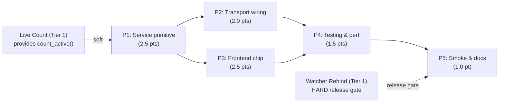

# Decisions Block: System-Wide Metrics

**Feature Goal**: Add a trustworthy, transport-neutral cross-project "currently running agents" metric to CCDash, surfaced on the home dashboard with explicit staleness signals and ready for future widget consumers.

**This Decisions Block** captures phase boundaries, agent routing, risks, estimation anchors, and model routing for expansion by `implementation-planner` (sonnet). It is intentionally Opus-direct judgment — the kind of decisions a sonnet planner would otherwise have to re-derive from scratch from the PRD.

---

## 1. Phase Boundaries

| Phase | Name | Scope | Success Criteria | Exit Gate |
|-------|------|-------|------------------|-----------|
| P1 | Service primitive | `SystemMetricsQueryService` in `agent_queries/system_metrics.py`; `SystemActiveCountDTO` + `ProjectActiveCountSummaryDTO`; `is_stale` computation; bounded `asyncio.gather`; `@memoized_query` caching; per-project error isolation | FR-1 through FR-6 satisfied; unit tests pass for staleness boundary + partial-aggregate resilience | All unit tests pass; service returns valid DTO for fixture with 3+ projects including stale + erroring entries |
| P2 | Transport wiring | REST (`GET /api/agent/system/active-count`), MCP (`ccdash_system_active_count`), CLI (`ccdash system active-count`); env vars; OpenAPI registration; `Cache-Control` header | FR-7 through FR-9 satisfied; transport-parity integration test passes | Integration test `test_system_metrics_transport_parity` green |
| P3 | Frontend home-dashboard surface | "Live now" count chip in `Dashboard.tsx`; expand-to-breakdown table; polling hook (30s, pause on hidden); all R-P2 resilience states | FR-10 through FR-12 satisfied; Vitest component tests pass | All component tests green; manual interaction confirms expand/collapse |
| P4 | Testing & performance validation | Multi-project fixture (36 projects); performance test asserting p95 < 200ms; full transport-parity validation; resilience edge cases; FE/BE contract seam test (R-P3) | AC-4 (perf), AC-3 (resilience), AC-1 (parity) all verified | All test suites green; performance budget met |
| P5 | Runtime smoke + documentation | `npm run dev` smoke against home dashboard (AC-6); CHANGELOG `[Unreleased]` entry; CLAUDE.md convention pointer; deferred-items spec stubs (background rollup, lazy rescan, widget API hardening) | AC-6 manually verified; CHANGELOG entry committed; deferred specs scaffolded | Operator smoke test signed off; `task-completion-validator` end-of-feature pass; `karen` review |

**Boundary Rationale**:
- **P1–P2**: Service contract must be finalized before transports wire to it; transports are thin adapters and shouldn't contain logic. Separate phase isolates the service test surface from transport tests.
- **P2–P3**: REST contract must exist before frontend integrates — but the frontend can develop against a mocked OpenAPI spec, enabling P2/P3 parallelism (see §2).
- **P3–P4**: Frontend code complete before integration/perf tests run end-to-end. Performance test requires the full fan-out path including DB.
- **P4–P5**: Validation gate before docs/smoke — smoke test requires confidence the code works.

---

## 2. Agent Routing

| Phase | Primary Agent(s) | Secondary Agent | Notes |
|-------|------------------|-----------------|-------|
| P1 | `python-backend-engineer` | `data-layer-expert` (advisory for staleness query path on Postgres) | Service is pure Python; primary owns the `agent_queries` pattern. Escalate to `backend-architect` only if fan-out concurrency design hits an edge case. |
| P2 | `python-backend-engineer` | — | Transport wiring is mechanical; one agent owns all three transports for shape consistency. |
| P3 | `ui-engineer-enhanced` | `ui-designer` (advisory for chip visual spec only if a design review is requested) | Frontend chip + breakdown table. Integration owner per R-P3 (see §3). |
| P4 (BE) | `python-backend-engineer` | — | Backend test authoring (fixture + perf + parity). |
| P4 (FE) | `ui-engineer-enhanced` | — | Vitest component tests with mock variants. |
| P4 gate | `task-completion-validator` | — | Mandatory Tier 2 phase gate per CLAUDE.md. |
| P5 docs | `documentation-writer` | — | Routine docs (CLAUDE.md pointer, deferred spec stubs). |
| P5 changelog | `changelog-generator` | — | Specialized agent for CHANGELOG entry. |
| P5 gate | `karen` | — | End-of-feature review per Tier 2 reviewer gates. |

**Parallel Opportunities**:
- **P2 and P3 can run in parallel** after P1 lands and the REST DTO shape is frozen. P3 develops against a mocked REST response matching the DTO; integration happens in P4. File-ownership is fully disjoint: P2 owns `backend/routers/`, `backend/mcp/`, `backend/cli/`; P3 owns `components/Dashboard.tsx` and any new sub-component (e.g., `components/SystemMetricsChip.tsx`). No file overlap.
- **P4 backend and P4 frontend tests can also run in parallel** (different test runners, no shared fixtures beyond the multi-project DB fixture which both consume read-only).
- **P5 docs can begin during P4** — CHANGELOG and CLAUDE.md updates do not depend on test results, only on the implementation being final.

---

## 3. Risk Hotspots

### Risk 1: Stale `sessions.status` for non-active projects produces wrong "live" counts
- **Severity**: HIGH
- **Rationale**: Spike OQ-3 runtime verification (2026-05-20) confirmed `status='active'` rows up to 93 days stale exist today. The freshness clamp in `count_active` (from live-count Tier 1) gives semantic correctness for the count, but `is_stale` is the only signal that distinguishes "really zero" from "we don't know."
- **Mitigation**: `is_stale` flag is a **mandatory contract field**, not optional. HARD dependency on `watcher-rebind-on-active-project-switch-v1` before user-facing release. Frontend treats missing `is_stale` as `true` (defensive). Document in service docstring that staleness handling is load-bearing.

### Risk 2: Multi-owner phase (P3 → P2 contract) crossing FE/BE seam without integration verification (R-P3 trigger)
- **Severity**: MEDIUM
- **Rationale**: P3 frontend depends on P2 REST contract. If the DTO shape drifts during P2 (e.g., `is_stale` renamed to `stale`, `per_project` renamed), P3 silently breaks. CCDash incident history (`ccdash-planning-reskin-v2-interaction-performance-addendum`) shows this exact class of seam gap.
- **Mitigation**: Declare `integration_owner: python-backend-engineer` on P3 (the agent who shipped the contract owns the verification). Add a dedicated seam task in P4: `test_dashboard_contract_parity` — fetches the live REST response and asserts every field used by the frontend exists. Freeze the OpenAPI schema at end of P2 and gate P3 merge on that schema diff being empty.

### Risk 3: Performance regression at scale (current 36 projects → future 100+)
- **Severity**: MEDIUM
- **Rationale**: In-process fan-out scales linearly. With 100 projects and 10ms per query: ~100ms wall clock with concurrency=10. With 200: ~200ms. The spike's Option 2 (single-SQL `GROUP BY`) is the escape hatch but adds repository complexity.
- **Mitigation**: Performance test asserts p95 < 200ms at 36 projects (AC-4); deferred-items spec documents Option 2 (single-SQL) and Option 3 (background rollup) escape hatches with promotion thresholds. Bounded `asyncio.Semaphore` (default 10) prevents connection exhaustion. Telemetry exporter emits `project_count` + duration histogram so we know when we cross thresholds.

### Risk 4: Postgres staleness query path divergence (PRD OQ-5)
- **Severity**: LOW
- **Rationale**: `max(sessions.updated_at)` per project may behave differently on Postgres (composite index usage) than SQLite. Plan currently assumes one query per project; could collapse to `SELECT project_id, COUNT(*), MAX(updated_at) FROM sessions WHERE status='active' AND updated_at >= ? GROUP BY project_id`.
- **Mitigation**: OQ-5 explicitly deferred to implementation; resolve during P1. If Postgres parity costs >1 pt extra, escalate to Opus for re-routing (e.g., promote to a single-SQL implementation for both backends, which lifts Risk 3 simultaneously).

### Risk 5: Frontend polling stampede / resource use
- **Severity**: LOW
- **Rationale**: 30s polling × N dashboard tabs × cache TTL alignment. If multiple tabs poll uncached, fan-out repeats.
- **Mitigation**: `@memoized_query` (FR-6) absorbs duplicate polls. `Cache-Control: max-age=30` header lets browser dedup. Pause polling on hidden tabs (FR-12).

---

## 4. Estimation Anchors

### Total: 10 points

| Phase | Points | Reasoning Anchor |
|-------|--------|------------------|
| P1 | 2.5 | Comparable: `project_status.py` service (~2 pts at original authoring). +0.5 for `is_stale` computation + fan-out + cache fingerprint. |
| P2 | 2.0 | Comparable: `ccdash-cli-mcp-enablement-v1` transport wiring (~1.5 pts per new endpoint × 3 surfaces = mechanical, ~1.5 pts total) + 0.5 buffer for OpenAPI/`Cache-Control` plumbing (H6). |
| P3 | 2.5 | Comparable: existing dashboard chips (~1.5 pts each) + 1 pt for expand-to-breakdown interaction with R-P2 resilience matrix. |
| P4 | 1.5 | Multi-project fixture (~0.75 pt) + perf test + transport-parity + frontend component tests. |
| P5 | 1.0 | Smoke (0.25) + CHANGELOG (0.25) + CLAUDE.md pointer (0.25) + deferred-spec stubs (0.25). H6 plumbing budget included. |
| **Σ** | **9.5 → rounded to 10** | 0.5 pt buffer for OQ-5 Postgres path uncertainty (Risk 4) and the cross-phase integration seam task (R-P3) the per-phase decomposition under-weighted. |

**Estimation Notes**:
- The PRD's H1–H6 sanity check produced 9.0 pts bottom-up. This Decisions Block adds 0.5–1 pt for the R-P3 seam task in P4 that the PRD's per-phase decomposition did not separately budget.
- If OQ-5 resolves toward a single-SQL `GROUP BY` implementation (Risk 3 + 4 mitigation), P1 grows by ~1 pt and P4 shrinks by ~0.5 pt (less concurrency edge-case testing). Net +0.5 pt — absorbed by the buffer.

---

## 5. Dependency Map

**Critical Path**: P1 → P2 → P4 → P5 (service → transport → integration test → smoke/docs).

**Parallelizable Slices**:
- P3 (frontend) runs in parallel with P2 (backend transport) once P1 freezes the DTO shape. File ownership is fully disjoint.
- P5 docs can begin during P4 — CHANGELOG draft + CLAUDE.md edit don't depend on test outcomes.

**External preconditions** (not phases of this feature, but block release):
- `live-agents-count-v1` (Tier 1) — provides `SessionsRepository.count_active()` and `idx_sessions_project_status_updated`. Soft dependency: feature is buildable without it but DRY cost is high.
- `watcher-rebind-on-active-project-switch-v1` (Tier 1) — **HARD precondition for user-facing release**. Without it, non-active project counts are arbitrarily stale and `is_stale` carries all the trust burden.

---

## 6. Model Routing

| Phase | Agent | Model | Effort | Rationale |
|-------|-------|-------|--------|-----------|
| P1 | `python-backend-engineer` | sonnet | adaptive | Service authoring with concurrency + caching — moderate reasoning. Sonnet handles `asyncio` patterns well without extended thinking. |
| P2 | `python-backend-engineer` | sonnet | adaptive | Mechanical transport wiring across three known patterns; existing endpoints in same router provide templates. |
| P3 | `ui-engineer-enhanced` | sonnet | adaptive | Component authoring with established design system + resilience patterns. Skill should auto-find existing chip patterns. |
| P4 (BE) | `python-backend-engineer` | sonnet | adaptive | Test authoring, especially the multi-project fixture. |
| P4 (FE) | `ui-engineer-enhanced` | sonnet | adaptive | Vitest component tests with mock variants. |
| P4 gate | `task-completion-validator` | sonnet | adaptive | Mandatory Tier 2 phase gate. |
| P5 docs | `documentation-writer` | haiku | adaptive | Routine docs (CLAUDE.md pointer, deferred spec stubs). |
| P5 changelog | `changelog-generator` | haiku | adaptive | Specialized agent for CHANGELOG entry. |
| P5 gate | `karen` | sonnet | adaptive | End-of-feature review per Tier 2 reviewer gates. |

**Model Routing Notes**:
- No external models needed (no image gen, no current-info web search required).
- Opus is involved only for: this Decisions Block, post-expansion sanity review of the implementation plan, and end-of-feature commit. All implementation is delegated to sonnet/haiku.
- If OQ-5 resolution (Risk 4) blocks P1, escalate that single decision to Opus rather than re-routing the whole phase.

---

## 7. Open Questions for Expansion

- **OQ-EXP-1**: Where exactly does the count chip live in `components/Dashboard.tsx` — top-right corner alongside existing project status, or a new dedicated row above the project switcher? Implementation-planner should examine the current Dashboard layout and propose a placement that maintains visual hierarchy. (Defer to `ui-engineer-enhanced` design judgment.)
- **OQ-EXP-2**: Should the new sub-component be `components/SystemMetricsChip.tsx` (new file) or live inline within `Dashboard.tsx`? Recommended: new file, follows existing CCDash component decomposition pattern. Confirm against existing patterns.
- **OQ-EXP-3 (= PRD OQ-5)**: Postgres staleness query path — separate `SELECT MAX(updated_at)` per project, or extend `count_active` to return both count and `max_updated_at` in one query? Recommend: extend `count_active` to optionally return `max_updated_at` (single round-trip); evaluate at P1 implementation time.
- **OQ-EXP-4**: Frontend cache layer — should the polling hook integrate with the existing planning browser cache (SWR + LRU per CLAUDE.md), or implement its own simpler polling? Recommend: own simpler polling — the planning cache's invalidation bus is overkill for a single-endpoint chip. Confirm by reading `services/planning.ts`.
- **OQ-EXP-5**: Should `ccdash system active-count` CLI command live under a new `system` subcommand group (new file under `backend/cli/`) or extend an existing group? Recommend: new group — establishes the namespace for future `ccdash system *` commands.

---

## 8. Plan Skeleton Pointer

This decisions block expands into a full **Implementation Plan** using the template:

- **Template**: `.claude/skills/planning/templates/implementation-plan-template.md`
- **Process**: `implementation-planner` (sonnet) reads this decisions block + the PRD and expands each section into the full plan structure: detailed phase descriptions, task breakdowns, batch definitions (per phase, file-ownership-disjoint), task tables with `Model` + `Effort` columns, success criteria per phase, and the mandatory Estimation Sanity Check section (carry forward from PRD §13).
- **Output path**: `docs/project_plans/implementation_plans/features/system-wide-metrics-v1.md`
- **Opus review**: ~3K-token sanity check post-expansion. Verify phase boundaries match this block; verify R-P3 seam task lands in P4; verify model routing propagates to task table; verify Estimation Sanity Check is present.

---

## Notes for implementation-planner

- **Section 1 (Phase Boundaries)**: Expand each row into a "Phase X Overview" section with full scope, dependencies, owner, exit gate validation steps. Include the `runtime_smoke` gate language from CLAUDE.md for P3 and P5.
- **Section 2 (Agent Routing)**: Propagate the `integration_owner` field for P3 (FE+BE seam) into the task table per R-P3.
- **Section 3 (Risks)**: All five risks here must appear in the plan's Risks section. Risk 1 ties directly to AC-2 and Risk 2 ties directly to the new P4 seam test — verify both are AC-traced.
- **Section 4 (Estimation)**: Carry forward the PRD's full H1–H6 Estimation Sanity Check into the plan's mandatory section. Do not redo H1–H6 — the PRD already locked it.
- **Section 5 (Dependency Map)**: Translate the mermaid graph into the plan's "Critical Path" section verbatim; capture the parallelization in `parallelization.batch_N` YAML in the phase progress files.
- **Section 6 (Model Routing)**: Propagate to every task row's `Model` + `Effort` columns. Use the Canonical Effort Vocabulary — `adaptive` for all sonnet/haiku rows.
- **Section 7 (OQs)**: Resolve OQ-EXP-1, OQ-EXP-2, OQ-EXP-4, OQ-EXP-5 inline based on the recommendations above (light judgment expected). OQ-EXP-3 / PRD OQ-5 remains open at planning time; surface it as a decision required at P1 implementation.
- **Plan Generator Rules R-P1 through R-P4**: All AC entries must use structured AC schema. R-P3 requires an `integration_owner` declaration on P3 AND a dedicated seam task in P4. R-P4 requires runtime smoke task in P5 referencing every `target_surfaces` entry from P3 (i.e., `components/Dashboard.tsx` plus any new sub-component).
- **Documentation Finalization (Phase 5)**: `changelog_required: true` is set on the PRD — a CHANGELOG `[Unreleased]` entry is **mandatory** before release. Use `changelog-generator` agent.
- **Deferred Items**: Spec stubs for background rollup, lazy rescan, and desktop widget API hardening go in `docs/project_plans/design-specs/` per the planning skill's deferred-items policy. Initialize `deferred_items_spec_refs: []` in plan frontmatter; populate in P5.
