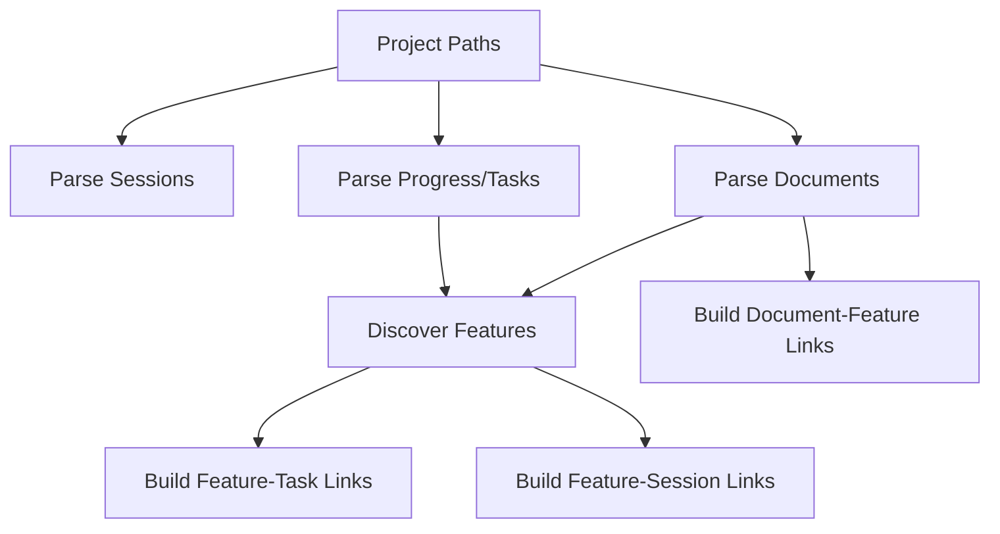

# Entity Linking User Guide

Last updated: 2026-02-18

This guide explains how CCDash links `Documents`, `Features`, and `Sessions` (and where `Tasks` fit in), so you can understand what you see in Feature and Session views.

## What Gets Linked

Primary entities in the app:

- `Project`: active root + configured source paths.
- `Document`: markdown from project plans/progress.
- `Feature`: discovered from plans/PRDs/progress.
- `Task`: parsed from progress frontmatter task lists.
- `Session`: parsed from agent JSONL sessions.
- `EntityLink`: relationship edge (`feature->session`, `feature->task`, `document->feature`, etc.).

## Entity-by-Entity Mapping

| Entity | Where it comes from | What it links to | Strongest signals |
| --- | --- | --- | --- |
| `Project` | configured paths in app settings | all entities under those roots | source roots + parser scope |
| `Document` | markdown under plans/progress/report roots | `Feature` | canonical path patterns + frontmatter (`related`, `prd`, `linkedFeatures`) |
| `Feature` | discovered from implementation plans, PRDs, progress | `Document`, `Task`, `Session` | normalized feature slug, base/version variants |
| `Task` | progress frontmatter task blocks | `Feature` (and session context indirectly) | progress file path + task metadata |
| `Session` | agent JSONL commands, file updates, artifacts | `Feature` | command args path + file update path + resolved feature slug |
| `EntityLink` | generated during link rebuild | all cross-entity edges | confidence + deterministic path checks |

## High-Level Flow

## File Structure Patterns That Drive Mapping

The strongest matching comes from file paths and feature tokens.

Supported plan-style layout:

- `{PROJECT_PLANS_ROOT}/{DOC_TYPE}/{FEATURE_TYPE}/{FEATURE_NAME}.md`
- `{PROJECT_PLANS_ROOT}/{DOC_TYPE}/{FEATURE_TYPE}/{FEATURE_NAME}/{PHASE_DOC}.md`

Supported progress layout:

- `{ROOT}/.claude/progress/{FEATURE_NAME}/{PROGRESS_PHASE_FILE}.md`

Examples:

- `docs/project_plans/implementation_plans/features/my-feature-v1.md`
- `docs/project_plans/implementation_plans/features/my-feature-v1/phase-1-backend.md`
- `.claude/progress/my-feature-v1/phase-1-progress.md`

## Command Behavior and Linking

- `/dev:execute-phase`: usually maps strongly when command args include the feature plan/progress path.
- `/recovering-sessions`: treated as continuation; mapping follows the recovered feature path evidence.
- `/dev:quick-feature`: can be intentionally ambiguous; often maps to quick-feature docs unless an explicit feature path is present.
- `/fix:debug` and others: linked when file updates/command paths clearly reference feature docs/progress.

## Why Some Features Show No Linked Sessions

After tightening accuracy rules, a feature may have zero sessions when:

- No session command/path references that feature.
- Work happened under generic or unrelated paths.
- Feature docs exist but sessions did not touch those files.
- The feature is planning-only or incomplete.

This is expected for some features and is safer than over-linking unrelated sessions.

Current snapshot (after the latest rebuild): `73/89` features have at least one linked session, `16/89` currently have none.

## How to Improve Link Accuracy as an Author

- Keep feature slug consistent across plan, PRD, and progress folder names.
- Use explicit feature paths in command args when executing/planning work.
- Keep phase progress files under the canonical feature progress directory.
- Prefer explicit frontmatter references (`related`, `prd`, `linkedFeatures`) when known.
- Avoid putting path-like free text in frontmatter fields not meant for references.

## What "Core" Sessions Mean

Core/primary sessions are a subset of linked sessions with stronger evidence (task-bound or high-confidence command/path/write signals). They are not just all linked sessions.

## Quick Troubleshooting Checklist

- Does the session signal path contain the target feature token?
- Does the feature have canonical plan/PRD/progress files with matching slug?
- Was `/dev:quick-feature` used without a clear feature path?
- Are links relying on title only, or on actual path evidence?

## Related Docs

- Developer reference: `docs/entity-linking-developer-reference.md`
- Regression analysis: `docs/linking-regression-report-2026-02-18.md`
- Review packs:
  - `docs/linking-tuning-review-2026-02-18.csv`
  - `docs/linking-tuning-review-2026-02-18-round2.csv`
