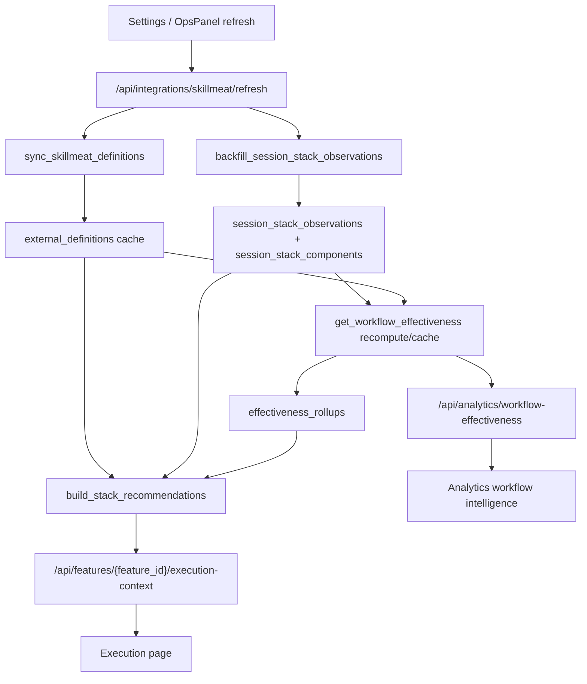

# Workflow + SkillMeat Integration Developer Reference

Last updated: 2026-03-14

This document explains how CCDash currently integrates with SkillMeat for workflow intelligence, recommended stacks, and artifact resolution. It is a current-state implementation reference for developers tuning the integration, not a future-state PRD.

## Why this doc exists

Related docs already exist, but they are split across:

- user-facing guidance
- rollout references
- PRDs and implementation plans
- one-off reports

Those documents do not fully describe the end-to-end runtime path for:

1. how CCDash pulls SkillMeat data
2. how that data is cached and enriched
3. how CCDash derives workflow observations from sessions
4. how effectiveness rollups and recommended stacks are computed
5. where workflow data is truly SkillMeat-backed versus CCDash-derived
6. where the current design is still hybrid or approximate

Use this file as the main reference when changing Workflow integration behavior.

## Short version

CCDash currently uses a hybrid model:

- SkillMeat is the source of truth for reusable definitions:
  - artifacts
  - workflows
  - context modules
  - bundles
- CCDash is the source of truth for observed session behavior and outcome scoring.
- Recommended workflows and stacks are not mocked.
- They are also not purely driven by SkillMeat workflow definitions.
- In practice, CCDash first derives workflow identity from session evidence, especially commands, then tries to resolve that identity onto cached SkillMeat workflow or artifact definitions.

That means command-shaped workflows like `/dev:execute-phase` are often represented in CCDash as a workflow observation that resolves to a SkillMeat command artifact such as `command:execute-phase`, not always to a SkillMeat `workflow` definition.

## Design boundary

The intended boundary is:

- SkillMeat owns definition authoring and reusable supply-side structure.
- CCDash owns telemetry, historical evidence, scoring, recommendation ranking, and UI presentation.

Current implementation files:

- [backend/services/integrations/skillmeat_client.py](/Users/miethe/dev/homelab/development/CCDash/backend/services/integrations/skillmeat_client.py)
- [backend/services/integrations/skillmeat_sync.py](/Users/miethe/dev/homelab/development/CCDash/backend/services/integrations/skillmeat_sync.py)
- [backend/services/integrations/skillmeat_contracts.py](/Users/miethe/dev/homelab/development/CCDash/backend/services/integrations/skillmeat_contracts.py)
- [backend/services/integrations/skillmeat_resolver.py](/Users/miethe/dev/homelab/development/CCDash/backend/services/integrations/skillmeat_resolver.py)
- [backend/services/integrations/skillmeat_routes.py](/Users/miethe/dev/homelab/development/CCDash/backend/services/integrations/skillmeat_routes.py)
- [backend/services/integrations/skillmeat_refresh.py](/Users/miethe/dev/homelab/development/CCDash/backend/services/integrations/skillmeat_refresh.py)
- [backend/services/stack_observations.py](/Users/miethe/dev/homelab/development/CCDash/backend/services/stack_observations.py)
- [backend/services/workflow_effectiveness.py](/Users/miethe/dev/homelab/development/CCDash/backend/services/workflow_effectiveness.py)
- [backend/services/stack_recommendations.py](/Users/miethe/dev/homelab/development/CCDash/backend/services/stack_recommendations.py)
- [backend/routers/integrations.py](/Users/miethe/dev/homelab/development/CCDash/backend/routers/integrations.py)
- [backend/routers/features.py](/Users/miethe/dev/homelab/development/CCDash/backend/routers/features.py)
- [backend/routers/analytics.py](/Users/miethe/dev/homelab/development/CCDash/backend/routers/analytics.py)
- [components/execution/RecommendedStackCard.tsx](/Users/miethe/dev/homelab/development/CCDash/components/execution/RecommendedStackCard.tsx)
- [components/execution/WorkflowEffectivenessSurface.tsx](/Users/miethe/dev/homelab/development/CCDash/components/execution/WorkflowEffectivenessSurface.tsx)
- [backend/services/workflow_registry.py](/Users/miethe/dev/homelab/development/CCDash/backend/services/workflow_registry.py)
- [components/Workflows/WorkflowRegistryPage.tsx](/Users/miethe/dev/homelab/development/CCDash/components/Workflows/WorkflowRegistryPage.tsx)
- [services/workflows.ts](/Users/miethe/dev/homelab/development/CCDash/services/workflows.ts)

## Configuration and feature gates

Frontend defaults and normalization live in:

- [services/agenticIntelligence.ts](/Users/miethe/dev/homelab/development/CCDash/services/agenticIntelligence.ts)
- [services/skillmeat.ts](/Users/miethe/dev/homelab/development/CCDash/services/skillmeat.ts)

Per-project SkillMeat config includes:

- `enabled`
- `baseUrl`
- `projectId`
- `collectionId`
- `aaaEnabled`
- `apiKey`
- `requestTimeoutSeconds`
- `featureFlags`

Important flags:

- `stackRecommendationsEnabled`
- `workflowAnalyticsEnabled`
- `usageAttributionEnabled`
- `sessionBlockInsightsEnabled`

Current meaning:

- `projectId` scopes workflows and context modules in SkillMeat.
- `collectionId` scopes artifact and bundle lookups.
- `aaaEnabled` and `apiKey` control read-only bearer auth.

## End-to-end runtime flow

## Step 1: SkillMeat config validation and refresh

Validation and refresh are exposed from [backend/routers/integrations.py](/Users/miethe/dev/homelab/development/CCDash/backend/routers/integrations.py).

Key endpoints:

- `POST /api/integrations/skillmeat/validate-config`
- `POST /api/integrations/skillmeat/sync`
- `POST /api/integrations/skillmeat/refresh`
- `POST /api/integrations/skillmeat/observations/backfill`
- `GET /api/integrations/skillmeat/definitions`
- `GET /api/integrations/skillmeat/observations`

`refresh` is the main operational path. In [backend/services/integrations/skillmeat_refresh.py](/Users/miethe/dev/homelab/development/CCDash/backend/services/integrations/skillmeat_refresh.py) it does:

1. sync SkillMeat definitions into CCDash
2. rebuild stack observations from current sessions and current definitions

Rollups are then computed lazily or on demand by workflow-effectiveness APIs.

## Step 2: What CCDash pulls from SkillMeat

The read-only client is [backend/services/integrations/skillmeat_client.py](/Users/miethe/dev/homelab/development/CCDash/backend/services/integrations/skillmeat_client.py).

Current definition pulls:

### Artifacts

- endpoint: `/api/v1/artifacts`
- scope: `collectionId`
- cached as `definition_type="artifact"`

These include skills, agents, commands, and other artifact-backed items.

### Workflows

- endpoint: `/api/v1/workflows`
- scope:
  - global workflows
  - project-scoped workflows using `projectId`
- cached as `definition_type="workflow"`

Additional workflow enrichment pulls:

- `GET /api/v1/workflows/{id}`
- `POST /api/v1/workflows/{id}/plan`
- `GET /api/v1/workflow-executions`
- `GET /api/v1/workflow-executions/{id}`

Only a capped subset is enriched each sync to keep refresh cost bounded.

### Context modules

- endpoint: `/api/v1/context-modules`
- scope: `projectId`
- cached as `definition_type="context_module"`

Additional enrichment:

- `POST /api/v1/context-packs/preview`

This is used to estimate what context a workflow can actually assemble.

### Bundles

- endpoint: `/api/v1/bundles`
- cached as `definition_type="bundle"`

Additional enrichment:

- `GET /api/v1/bundles/{id}`

## Step 3: How synced definitions are enriched

Definition sync is orchestrated in [backend/services/integrations/skillmeat_sync.py](/Users/miethe/dev/homelab/development/CCDash/backend/services/integrations/skillmeat_sync.py).

Important enrichment behavior from [backend/services/integrations/skillmeat_contracts.py](/Users/miethe/dev/homelab/development/CCDash/backend/services/integrations/skillmeat_contracts.py):

### Workflow enrichment

`annotate_effective_workflows(...)`

- groups workflows by normalized workflow name
- prefers project-scoped workflow definitions over global ones
- stores:
  - `effectiveWorkflowKey`
  - `effectiveWorkflowId`
  - `effectiveWorkflowName`
  - `isEffective`
  - aliases for matching

`attach_workflow_detail(...)`

- stores `rawWorkflow`
- parses SWDL/YAML with `extract_workflow_swdl_summary(...)`
- stores `planSummary`

SWDL extraction currently captures:

- `artifactRefs`
- `contextRefs`
- `stageOrder`
- `stageGraph`
- `gateCount`
- `fanOutCount`

Important limitation:

- the SWDL parser looks for artifact refs and context refs in stage payloads
- it does not currently model "workflow composed of other workflows" as a first-class structure inside CCDash

`attach_workflow_executions(...)`

- stores recent execution summaries
- stores aggregate execution metadata like running/completed counts

### Context-module enrichment

`resolve_workflow_context_modules(...)`

- maps workflow `contextRefs` onto cached context-module definitions
- attaches preview summaries when available
- stores `resolvedContextModules`
- stores `contextSummary`

### Bundle enrichment

`attach_bundle_detail(...)`

- extracts `bundleSummary.artifactRefs`
- gives CCDash a curated artifact bundle shape for stack alignment

### Stable source URLs

[backend/services/integrations/skillmeat_routes.py](/Users/miethe/dev/homelab/development/CCDash/backend/services/integrations/skillmeat_routes.py) rewrites cached `source_url` values to stable SkillMeat UI routes:

- artifacts: `/collection?collection=<id>&artifact=<external_id>`
- workflows: `/workflows/<id>`
- context modules: `/projects/<projectId>/memory`
- bundles: `/collection?collection=<id>`

## Step 4: Where CCDash stores SkillMeat data

## Workflow Registry surface

The new Workflow Registry surface makes the hybrid model visible instead of hiding it behind a single `workflowRef`.

Route:

- `/workflows`

It consumes:

- `GET /api/analytics/workflow-registry`
- `GET /api/analytics/workflow-registry/detail`

What it exposes per workflow entity:

1. identity
2. correlation state
3. composition summary
4. effectiveness summary
5. issue cards
6. action links into SkillMeat or CCDash

This is intentionally different from the existing analytics leaderboard:

- `/analytics?tab=workflow_intelligence` is optimized for ranking and comparison
- `/workflows` is optimized for identity inspection, correlation debugging, and drill-down navigation

Relevant tables:

- `external_definition_sources`
- `external_definitions`
- `session_stack_observations`
- `session_stack_components`
- `effectiveness_rollups`

Current meaning:

- `external_definitions` stores normalized SkillMeat definitions and enrichment metadata.
- `session_stack_observations` stores one CCDash-observed workflow/stack observation per session.
- `session_stack_components` stores the observed components of that session stack.
- `effectiveness_rollups` stores cached aggregated scores for workflows, agents, skills, contexts, bundles, and stacks.

This separation matters:

- SkillMeat definitions are external reusable supply.
- observations and rollups are CCDash-owned evidence and scoring layers.

## Step 5: How CCDash builds workflow observations from sessions

Observation building lives in [backend/services/stack_observations.py](/Users/miethe/dev/homelab/development/CCDash/backend/services/stack_observations.py).

### Input signals

For each session CCDash inspects:

- session logs
- session artifacts
- session file updates
- derived badges from session activity
- session mapping metadata

### Component extraction

The builder emits components such as:

- `agent`
- `skill`
- `artifact`
- `command`
- `workflow`
- `context_module`
- `model_policy`

### Workflow identity

Current workflow identity is derived mainly from CCDash session evidence:

1. classify command events with session mapping helpers
2. prefer `relatedCommand` from workflow metadata when present
3. otherwise prefer the first slash command token seen in the session

This produces canonical workflow refs such as:

- `/dev:execute-phase`
- `/plan:plan-feature`
- `/fix:debug`

This is why current workflow observations are command-shaped.

### Canonicalization

`canonicalize_stack_observation(...)` then normalizes observations by:

- rewriting old workflow keys like `key-dev-execute-phase` to slash-command refs when possible
- filtering generated agent hashes when friendly names also exist
- rewriting workflow component payloads to the canonical workflow ref

### Definition resolution

After observation extraction, CCDash tries to resolve observed components against cached SkillMeat definitions via [backend/services/integrations/skillmeat_resolver.py](/Users/miethe/dev/homelab/development/CCDash/backend/services/integrations/skillmeat_resolver.py).

Resolution target types:

- `artifact`
- `workflow`
- `context_module`

Current rules:

- `skill`, `agent`, and `command` components resolve against `artifact` definitions
- `workflow` components try `workflow` first, then `artifact`

This is the core reason the system is hybrid.

## Step 6: How workflow effectiveness is computed

Aggregation lives in [backend/services/workflow_effectiveness.py](/Users/miethe/dev/homelab/development/CCDash/backend/services/workflow_effectiveness.py).

`get_workflow_effectiveness(...)` can:

- read cached rollups from `effectiveness_rollups`
- or recompute them from the session + observation dataset

Rollups are computed for scope types including:

- `workflow`
- `effective_workflow`
- `agent`
- `skill`
- `context_module`
- `bundle`
- `stack`

Current scoring inputs include:

- session outcome status
- tests and integrity signals
- later debug/rework signals
- token, cost, duration, queue pressure, and subagent pressure
- component resolution quality
- usage-attribution metrics when enabled

Workflow and bundle enrichment contributes additional references and display metadata, but the scoring baseline is still CCDash evidence, not SkillMeat execution outcomes alone.

## Step 7: How recommended workflows and stacks are built

Recommendation generation lives in [backend/services/stack_recommendations.py](/Users/miethe/dev/homelab/development/CCDash/backend/services/stack_recommendations.py) and is called from [backend/routers/features.py](/Users/miethe/dev/homelab/development/CCDash/backend/routers/features.py) when building feature execution context.

Current flow:

1. load cached SkillMeat definitions
2. load stack observations for the project
3. load stack effectiveness rollups
4. recompute stale rollups when needed
5. rank candidate stacks against the current feature and recommendation rule
6. enrich candidates with SkillMeat evidence
7. emit:
   - `recommendedStack`
   - `stackAlternatives`
   - `stackEvidence`
   - `definitionResolutionWarnings`

### Stack ranking is driven by

- success
- efficiency
- quality
- risk
- workflow match to the current command recommendation
- overlap of agents and skills
- sample size

### SkillMeat enrichment adds

- effective workflow precedence
- context coverage
- curated bundle alignment
- recent SkillMeat workflow execution signals

### Current workflow naming behavior

The recommendation service currently prefers:

1. canonicalized workflow refs from observations
2. resolved workflow component data
3. SkillMeat definition labels when available

It does not yet maintain a fully separate "workflow family id" that is independent from command identity.

## What the Execution page is actually showing

On the execution page:

- the top-level workflow label is usually derived from CCDash-observed workflow refs
- artifact chips and modal content may be backed by resolved SkillMeat definitions
- workflow references can therefore be:
  - CCDash-derived identifiers
  - SkillMeat workflow definitions
  - SkillMeat command artifacts

That means the screen is real and evidence-backed, but the "Workflow" concept is still partially overloaded:

- sometimes it means "the command family we observed in CCDash"
- sometimes it means "a SkillMeat workflow definition"
- sometimes it means "the best artifact-backed object we could resolve for that workflow-like thing"

## Current limitations and design gaps

These are the most important gaps for future tuning.

### 1. Workflow identity is still command-first

Today the canonical observed workflow ref is often the slash command token. That is useful operationally, but it means CCDash does not yet have a clean abstraction for:

- workflow family id
- workflow definition id
- command artifact id
- workflow display label

Those concepts should likely be separated.

### 2. Workflow composition is not first-class

SkillMeat workflows can contain:

- artifact refs
- context refs
- staged execution structures
- gate and fan-out metadata

But CCDash does not yet model "workflow composed of other workflows, artifacts, and context modules" as a first-class graph in its own domain model.

For your stated goal, this is the biggest current gap.

### 3. Workflow-to-workflow nesting is not explicit

The current SWDL parsing extracts artifact and context refs from workflow YAML, but it does not create a native CCDash representation for higher-tier workflows that orchestrate sub-workflows.

If SkillMeat is going to treat a top-tier Workflow as a collection of:

- other workflows
- context files/modules
- artifacts
- bundles
- gates and policies

then CCDash likely needs:

1. a dedicated workflow-composition cache model
2. explicit nested workflow refs in resolution metadata
3. UI and scoring rules that distinguish parent workflow structure from observed session commands

### 4. Bundle support is artifact-centric

Bundles currently help with curated stack alignment, but they are not yet used as a true "recommended workflow package" abstraction.

### 5. Deep links are object-specific, not graph-specific

CCDash can now deep-link to artifacts, workflows, bundles, and memory, but it cannot yet deep-link to a structured "workflow composition view" in CCDash because that view does not exist as a first-class model.

### 6. Cache freshness is still coarse

CCDash relies on:

- manual refresh
- refresh after settings changes
- cached rollups

It does not yet subscribe to SkillMeat change events, so definitions and rollups can drift until refresh/recompute runs.

## Practical tuning targets

If the goal is to improve the Workflow tier specifically, these are the highest-value next steps.

### A. Define a canonical workflow identity contract

Introduce separate fields for:

- observed workflow ref
- workflow family ref
- resolved SkillMeat workflow id
- resolved command artifact id
- display label

This removes the current overloading of `workflowRef`.

### B. Model workflow composition explicitly

Extend cached workflow metadata to represent:

- child workflows
- artifact refs
- context refs
- bundle refs
- stage graph
- gate graph
- dependency graph

This is the main prerequisite for treating top-tier workflows as "collections of other workflows, context files, etc."

### C. Separate command artifacts from workflow definitions in recommendation ranking

Right now command artifacts are often the best available resolution target for observed workflow refs. That is useful, but it hides the distinction between:

- the command used to invoke work
- the workflow definition that describes the actual orchestrated process

Both should be rankable and inspectable independently.

### D. Promote workflow graph data into UI payloads

The current UI payloads mostly expose:

- labels
- refs
- modal metadata
- evidence

To support real Workflow-tier tuning, the payloads should eventually expose:

- resolved child workflows
- resolved context modules
- bundle membership
- stage graph summaries
- gate counts and dependency chains

### E. Decide whether "top-tier workflows" should be sourced from workflows, bundles, or a new composite type

There are three plausible models:

1. SkillMeat `workflow` remains the top-level composite object.
2. SkillMeat `bundle` becomes the stack/package abstraction and workflows are execution templates beneath it.
3. CCDash introduces its own composite recommendation entity derived from both.

Current code is closest to option 3, but without an explicit model.

## Recommended implementation direction

For the next round of tuning, the most coherent direction is:

1. keep CCDash read-only against SkillMeat
2. keep CCDash as the scoring and recommendation layer
3. add a first-class workflow-composition model in CCDash
4. store and expose nested workflow structure from SkillMeat workflow definitions
5. stop treating command-like workflow refs as the only canonical workflow identity

In short:

- retain CCDash-observed command/workflow evidence
- but add a richer resolved workflow graph so recommendations can be anchored to actual SkillMeat workflow structure

## Related docs

- [docs/agentic-sdlc-intelligence-developer-reference.md](/Users/miethe/dev/homelab/development/CCDash/docs/agentic-sdlc-intelligence-developer-reference.md)
- [docs/agentic-sdlc-intelligence-user-guide.md](/Users/miethe/dev/homelab/development/CCDash/docs/agentic-sdlc-intelligence-user-guide.md)
- [docs/project_plans/PRDs/enhancements/agentic-sdlc-intelligence-foundation-v1.md](/Users/miethe/dev/homelab/development/CCDash/docs/project_plans/PRDs/enhancements/agentic-sdlc-intelligence-foundation-v1.md)
- [docs/project_plans/reports/agentic-sdlc-intelligence-v2-integration-overview-2026-03-08.md](/Users/miethe/dev/homelab/development/CCDash/docs/project_plans/reports/agentic-sdlc-intelligence-v2-integration-overview-2026-03-08.md)
