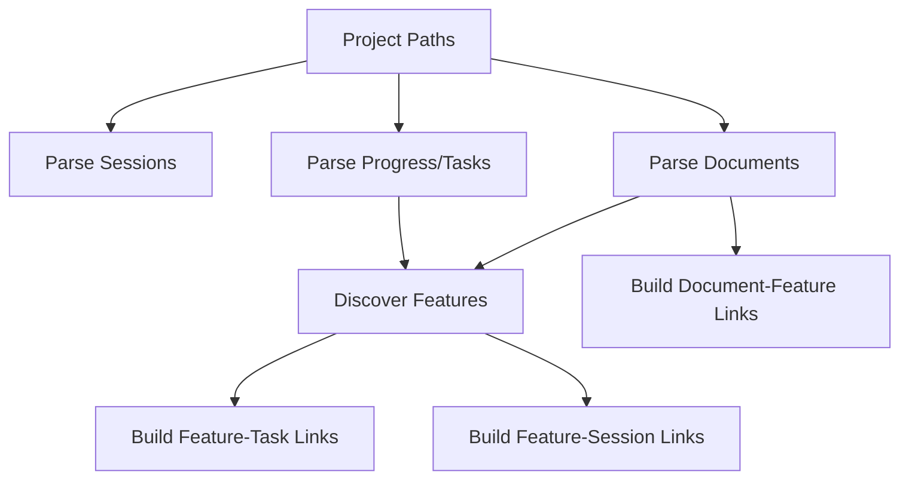

# Document Entity and Linking Guide

User-facing document/entity behavior plus developer contracts for document parsing, entity linking, and mapping.

> Consolidated from the former top-level user and developer docs. `docs/project_plans/` content was intentionally left untouched.

## Document Entity User Guide

Last updated: 2026-03-12

This guide explains what changed in the Documents experience (`/plans`), what data is available, and how to use the new filters and views.

### What Changed

The Documents system now:

- Indexes both plan docs and progress docs as first-class `Document` records.
- Normalizes canonical schema fields into typed metadata (description/summary, priority/risk/complexity/track, timeline/release/milestone, readiness/test impact, typed linked-feature refs, and doc-type-specific blocks).
- Uses canonical project-relative paths for stable identity.
- Supports richer cross-entity linking (`document <-> feature/task/session/document`).
- Provides faceted filtering and broader search coverage in `/plans`.
- Preserves migration compatibility for legacy frontmatter aliases and superseded root-level schema docs.

### Document Sources

Documents are ingested from:

- Project plans root: `docs/project_plans/...`
- Progress root: `.claude/progress/...`

Progress files remain first-class documents, but the default `/plans` scope starts on non-progress-focused content.

### Using `/plans`

### Scope tabs

Top-level tabs let you quickly narrow the document set:

- `Plans`
- `PRDs`
- `Reports`
- `Progress`
- `All`

### Filters

The sidebar supports faceted filtering by:

- `Subtype`
- `Type`
- `Status`
- `Category`
- `Feature`
- `PRD`
- `Phase`
- `Frontmatter presence`

Filter values are normalized into a fixed canonical set before faceting so historical value drift does not fragment options.

- `Status` canonical values: `pending`, `in_progress`, `review`, `completed`, `deferred`, `blocked`, `archived`, `inferred_complete`
- `Subtype` canonical values:
  - `implementation_plan`, `phase_plan`, `prd`, `report`, `spec`
  - `design_spec`, `design_doc`, `spike`, `idea`, `bug_doc`
  - `progress_phase`, `progress_all_phases`, `progress_quick_feature`, `progress_other`
  - `document` (fallback)

### Search

Search now matches across:

- Title and paths
- Type/subtype/category/status
- Feature and PRD hints
- Phase token
- Request IDs
- Commit refs
- Linked refs (`relatedRefs`, `pathRefs`, `slugRefs`, linked features/sessions)
- Typed metadata blocks (owners/contributors/request IDs/commit refs)

### Document Modal

The modal now uses canonical tabs:

1. `Summary`
2. `Delivery`
3. `Relationships`
4. `Content`
5. `Timeline`
6. `Raw`

Across these tabs it shows:

- Core typed metadata (`docType`, `docSubtype`, `rootKind`, normalized status)
- Canonical path and ownership/audience metadata
- Delivery/execution metadata (`execution_readiness`, `timeline_estimate`, `test_impact`, file/context/source refs)
- Progress-aware metrics (phase, overall progress, task counters)
- Typed feature relationships (`linked_features[]` with type/source/confidence)
- Request IDs, commit refs, PR refs, and linked entities

Linked entities are sourced from normalized entity links, not from ad-hoc assumptions on frontmatter fields.

The dependency-aware execution rollout also surfaces a few document-specific behaviors in the modal:

- `Relationships` now includes linked feature pills that navigate back to the feature board.
- `Blocked By` metadata is rendered as hard dependency chips so blocked plans and progress files are obvious at a glance.
- Family lineage and sequence metadata remain visible in the `Summary` tab, matching the family-aware summaries in the board and workbench.

### Editing and save behavior

- Plan documents (`rootKind = project_plans`) can be edited directly from the modal `Content` view.
- Progress documents remain view-only in this flow.
- Local plan docs write back to the underlying file immediately when saved.
- GitHub-backed plan docs require an enabled GitHub integration plus project/repo write access before save is allowed.
- When GitHub write-back is available, CCDash writes through the managed repo workspace, creates a commit, pushes it to the configured branch, and refreshes document state in the UI.
- Operators can provide an optional commit message during save; otherwise CCDash uses the default managed write-back message.

### Linked Data Behavior

Links include:

- `Document -> Feature`
- `Document -> Task`
- `Document -> Session`
- `Document -> Document`

Feature links prioritize explicit refs; path inference and referenced-document inheritance are fallback strategies.

### Completion Equivalence and Write-Through

Feature completion now treats the following document collections as equivalent completion sources:

- PRD completion
- Plan completion (top-level implementation plan, or all phase-plan docs when those are the plan shape)
- All linked progress phase documents completed

If any of those completion groups is complete, the Feature is treated as `done` even when other linked docs were not manually updated.

When completion is inferred this way, CCDash writes through to linked PRD/Plan docs and sets their frontmatter status to `inferred_complete` when they were not already completion-equivalent.

### Known Operational Notes

- Very large projects can include hundreds of documents. The UI now pages `/api/documents` behind the scenes and aggregates results.
- If `/plans` appears stale, run a full resync/backfill (`POST /api/cache/sync` with `force=true`) to refresh typed metadata and links.

### Quick Troubleshooting

1. If `/plans` is empty, check backend logs for `/api/documents` validation errors.
2. If links look missing, run a full forced sync and link rebuild.
3. If a document exists in Feature modal but not `/plans`, verify canonical path normalization and active project roots.

### Related Docs

- `docs/schemas/document_frontmatter/README.md`
- `docs/schemas/document_frontmatter/document-and-feature-mapping.md`
- `docs/guides/document-entity-and-linking.md`
- `docs/guides/document-entity-and-linking.md`

## Entity Linking User Guide

Last updated: 2026-02-18

This guide explains how CCDash links `Documents`, `Features`, and `Sessions` (and where `Tasks` fit in), so you can understand what you see in Feature and Session views.

### What Gets Linked

Primary entities in the app:

- `Project`: active root + configured source paths.
- `Document`: markdown from project plans/progress.
- `Feature`: discovered from plans/PRDs/progress.
- `Task`: parsed from progress frontmatter task lists.
- `Session`: parsed from agent JSONL sessions.
- `EntityLink`: relationship edge (`feature->session`, `feature->task`, `document->feature`, etc.).

### Entity-by-Entity Mapping

| Entity | Where it comes from | What it links to | Strongest signals |
| --- | --- | --- | --- |
| `Project` | configured paths in app settings | all entities under those roots | source roots + parser scope |
| `Document` | markdown under plans/progress/report roots | `Feature` | canonical path patterns + frontmatter (`related`, `prd`, `linkedFeatures`) |
| `Feature` | discovered from implementation plans, PRDs, progress | `Document`, `Task`, `Session` | normalized feature slug, base/version variants |
| `Task` | progress frontmatter task blocks | `Feature` (and session context indirectly) | progress file path + task metadata |
| `Session` | agent JSONL commands, file updates, artifacts | `Feature` | command args path + file update path + resolved feature slug |
| `EntityLink` | generated during link rebuild | all cross-entity edges | confidence + deterministic path checks |

### High-Level Flow



### File Structure Patterns That Drive Mapping

The strongest matching comes from file paths and feature tokens.

Supported plan-style layout:

- `{PROJECT_PLANS_ROOT}/{DOC_TYPE}/{FEATURE_TYPE}/{FEATURE_NAME}.md`
- `{PROJECT_PLANS_ROOT}/{DOC_TYPE}/{FEATURE_TYPE}/{FEATURE_NAME}/{PHASE_DOC}.md`

Supported progress layout:

- `{ROOT}/.claude/progress/{FEATURE_NAME}/{PROGRESS_PHASE_FILE}.md`

Examples:

- `docs/project_plans/implementation_plans/features/my-feature-v1.md`
- `docs/project_plans/implementation_plans/features/my-feature-v1/phase-1-backend.md`
- `.claude/progress/my-feature-v1/phase-1-progress.md`

### Command Behavior and Linking

- `/dev:execute-phase`: usually maps strongly when command args include the feature plan/progress path.
- `/recovering-sessions`: treated as continuation; mapping follows the recovered feature path evidence.
- `/dev:quick-feature`: can be intentionally ambiguous; often maps to quick-feature docs unless an explicit feature path is present.
- `/fix:debug` and others: linked when file updates/command paths clearly reference feature docs/progress.

### Why Some Features Show No Linked Sessions

After tightening accuracy rules, a feature may have zero sessions when:

- No session command/path references that feature.
- Work happened under generic or unrelated paths.
- Feature docs exist but sessions did not touch those files.
- The feature is planning-only or incomplete.

This is expected for some features and is safer than over-linking unrelated sessions.

Current snapshot (after the latest rebuild): `73/89` features have at least one linked session, `16/89` currently have none.

### How to Improve Link Accuracy as an Author

- Keep feature slug consistent across plan, PRD, and progress folder names.
- Use explicit feature paths in command args when executing/planning work.
- Keep phase progress files under the canonical feature progress directory.
- Prefer explicit frontmatter references (`related`, `prd`, `linkedFeatures`) when known.
- Avoid putting path-like free text in frontmatter fields not meant for references.

### What "Core" Sessions Mean

Core/primary sessions are a subset of linked sessions with stronger evidence (task-bound or high-confidence command/path/write signals). They are not just all linked sessions.

### Quick Troubleshooting Checklist

- Does the session signal path contain the target feature token?
- Does the feature have canonical plan/PRD/progress files with matching slug?
- Was `/dev:quick-feature` used without a clear feature path?
- Are links relying on title only, or on actual path evidence?

### Related Docs

- Developer reference: `docs/guides/document-entity-and-linking.md`
- Sync/audit operations: `docs/guides/operations-panel.md`
- Regression analysis: `docs/linking-regression-report-2026-02-18.md`
- Review packs:
  - `docs/linking-tuning-review-2026-02-18.csv`
  - `docs/linking-tuning-review-2026-02-18-round2.csv`

## Document Entity Developer Reference

Last updated: 2026-03-23

This is the implementation-level reference for the document-entity enhancement pass.

### Goals

- Treat progress markdown as first-class documents.
- Persist typed metadata in DB for stable filtering/search.
- Use canonical project-relative path identity everywhere possible.
- Improve document mapping to features/tasks/sessions/documents.
- Expose a paginated/filterable document API and facet catalog.

### Core Components

### Shared linking/normalization

- `backend/document_linking.py`
  - Canonical path/root helpers
  - Subtype/root classification
  - Expanded frontmatter ref extraction (`plan_ref`, `prd_link`, `related_documents`, `request_log_id`, etc.)

### Parsing

- `backend/parsers/documents.py`
  - Parses frontmatter/body
  - Produces typed `PlanDocument`
  - Computes:
    - `docType`, `docSubtype`, `rootKind`
    - `statusNormalized`
    - `featureSlugHint`, `featureSlugCanonical`
    - `phaseToken`, `phaseNumber`
    - `overallProgress`, task counters
    - owners/contributors/request/commit refs
    - normalized `dates` + `timeline` with confidence/source metadata

- `backend/parsers/features.py`
  - Reuses document-level date extraction for linked docs when deriving feature timelines/dates.

### Sync and linking

- `backend/db/sync_engine.py`
  - Synces docs from both plan and progress roots
  - Synces changed progress markdown into both `documents` and `tasks`
  - Rebuilds document links to features/tasks/sessions/documents
  - Uses canonical project root inference
  - Builds git date metadata in batches (no per-file git calls)

### Storage

- `backend/db/sqlite_migrations.py`
- `backend/db/postgres_migrations.py`
- `backend/db/repositories/documents.py`
- `backend/db/repositories/postgres/documents.py`

Enhancements include typed columns in `documents` and normalized `document_refs` table.

### API

- `backend/routers/api.py`
  - `GET /api/documents` (paginated + filterable)
  - `GET /api/documents/catalog` (facet counts)
  - `GET /api/documents/{doc_id}`
  - `GET /api/documents/{doc_id}/links`

### Frontend

- `types.ts`: expanded `PlanDocument` shape
- `contexts/AppEntityDataContext.tsx`: paged document fetching and document-state refresh
- `contexts/DataContext.tsx`: compatibility facade consumed by existing UI components
- `components/PlanCatalog.tsx`: scope tabs, facets, metadata-aware search
- `components/DocumentModal.tsx`: typed metadata + normalized links panels, plus dependency-aware family/blocked-by presentation
- `components/ProjectBoard.tsx`: canonical path doc resolution fallback and dependency-aware execution summaries

### Canonical Identity Rules

- Canonical path is project-relative and slash-normalized.
- Document IDs are path-derived (`DOC-...`) and stable against absolute path drift.
- Linking logic should prefer canonical path comparisons before legacy/fallback matching.

### Link Strategy Summary

### Document -> Feature

Priority:

1. Explicit frontmatter refs (`linkedFeatures`, parsed feature refs, PRD refs)
2. Canonical/path-derived feature hint
3. Referenced-document inheritance

Metadata includes strategy and confidence.

### Document -> Document

- Path refs from normalized ref extraction are resolved to document IDs via canonical path.

### Document -> Task

- Progress document source path links to tasks parsed from that same canonical source file.

### Document -> Session

- Explicit session refs in document frontmatter
- Task session refs inherited through linked tasks

### DB Notes

`documents` now includes typed fields for:

- Identity and classification (`canonical_path`, `root_kind`, `doc_subtype`, etc.)
- Search/filter keys (`status_normalized`, `feature_slug_canonical`, `phase_token`, etc.)
- Progress metrics (`overall_progress`, task counters)
- `metadata_json` (typed extension payload)

`document_refs` stores normalized reference rows:

- `(document_id, ref_kind, ref_value_norm, source_field)` uniqueness
- `(project_id, ref_kind, ref_value_norm)` query index

### API Filter Parameters

`GET /api/documents` supports:

- `q`
- `doc_subtype`
- `root_kind`
- `doc_type`
- `category`
- `status`
- `feature`
- `prd`
- `phase`
- `include_progress`
- `offset`
- `limit`

### Verification and Backfill

For existing projects, run a full forced sync after migration updates.

Expected outcomes:

- `documents` populated for plans + progress markdown
- typed columns and `document_refs` filled
- link graph rebuilt with document-centric mappings
- date fields recomputed from normalized precedence (frontmatter + git + filesystem)

### Date Resolution Strategy

`createdAt` precedence:

1. frontmatter `created*` (`high`)
2. git first commit touching file (`high`)
3. filesystem birthtime (`medium`)
4. filesystem mtime fallback (`low`)

`updatedAt` precedence:

1. git latest commit touching file (`high`)
2. frontmatter `updated*` (`medium`)
3. filesystem mtime when file is dirty/untracked (`high`)
4. filesystem mtime fallback (`low`)
5. frontmatter created fallback (`low`)

`completedAt` precedence:

1. frontmatter `completed*` (`high`)
2. frontmatter `updated*` for completion-equivalent statuses (`medium`)
3. filesystem mtime fallback for completion-equivalent statuses (`low`)

Implementation references:

- `backend/db/sync_engine.py` (`_build_git_doc_dates`, `_sync_documents`, `sync_changed_files`, `_sync_features`)
- `backend/parsers/documents.py` (`_build_document_date_fields_with_git`)
- `backend/parsers/features.py` (`_extract_doc_metadata`, `scan_features`)

### One-Time Date Backfill (Existing Data)

Use a full forced sync to recalculate and persist dates for all docs/features:

```bash
curl -X POST http://127.0.0.1:8000/api/cache/sync \
  -H 'Content-Type: application/json' \
  -d '{"force": true, "background": true, "trigger": "api"}'
```

Then poll operation status until `completed`:

```bash
curl http://127.0.0.1:8000/api/cache/operations/<operation_id>
```

This backfills existing rows; no manual per-file migration is required.

### Tests Added/Updated

- `backend/tests/test_document_linking.py`
- `backend/tests/test_documents_parser.py`
- `components/__tests__/dependencyAwareExecutionUi.test.tsx`

Coverage includes:

- canonical path/root handling
- subtype classification
- expanded frontmatter key extraction
- typed progress metadata parsing
- dependency-aware family and blocked-by rendering across the board, plan catalog, and document modal

## Entity Linking Developer Reference

Last updated: 2026-02-18

This document is the implementation-level reference for linking across app entities.

### Entity Model

Core entities and storage tables:

- `Project` -> active project config and source paths.
- `Session` -> `sessions`, `session_logs`, `session_file_updates`, `session_artifacts`.
- `Document` -> `documents`.
- `Task` -> `tasks` (from progress frontmatter).
- `Feature` -> `features`, `feature_phases`.
- `EntityLink` -> `entity_links` (auto/manual relationships).

Primary edge types in current system:

- `feature -> task`
- `feature -> session`
- `document -> feature`

### Entity-by-Entity Responsibilities

| Entity | Primary table(s) | Parser/source | Outgoing links | Core resolver |
| --- | --- | --- | --- | --- |
| `Project` | `projects` | configured roots | scope for all parsing | `SyncEngine.sync_project` |
| `Document` | `documents` | `backend/parsers/documents.py` | `document->feature` | frontmatter + `feature_slug_from_path` |
| `Feature` | `features`, `feature_phases` | `backend/parsers/features.py` | `feature->task`, `feature->session` | base slug + constrained aliases |
| `Task` | `tasks` | progress parser/frontmatter tasks | (indirect in UI, direct to feature in links) | progress directory feature slug |
| `Session` | `sessions`, `session_logs`, `session_file_updates`, `session_artifacts` | session JSONL parser | `session<->feature` view relations via `entity_links` | command/file signal scoring |
| `EntityLink` | `entity_links` | rebuild stage | all graph edges | `_rebuild_entity_links` |

### Pipeline Entry Points

- Full sync orchestrator:
  - `backend/db/sync_engine.py:219`
- Link rebuild stage:
  - `backend/db/sync_engine.py:569`
- Feature linked sessions API:
  - `backend/routers/features.py:424`
- Session linked features API/model use:
  - `backend/routers/api.py:158`

### Rebuild Triggers And Caching

- Auto links are persisted in `entity_links` and rebuild state is tracked in `app_metadata` key `entity_link_state`.
- Full-sync startup now rebuilds links only when one of these is true:
  - force sync is requested
  - any sessions/documents/tasks/features were actually synced
  - linking logic version changed (`CCDASH_LINKING_LOGIC_VERSION`)
- Changed-file sync (`sync_changed_files`) now triggers a link rebuild only when link-affecting entities changed, plus version-mismatch safety for logic bumps.
- Manual rebuild endpoint remains available:
  - `POST /api/cache/rebuild-links`

### Linking Utilities (Canonical Rules)

Shared utility module:

- `backend/document_linking.py`

Key functions:

- Path normalization:
  - `normalize_ref_path` (`backend/document_linking.py:104`)
- Feature token validation:
  - `is_feature_like_token` (`backend/document_linking.py:145`)
- Feature extraction from path (supports nested plan and progress structures):
  - `feature_slug_from_path` (`backend/document_linking.py:195`)
- Alias extraction from path:
  - `alias_tokens_from_path` (`backend/document_linking.py:272`)
- Frontmatter reference extraction:
  - `extract_frontmatter_references` (`backend/document_linking.py:345`)

Important behavior:

- Frontmatter parsing now rejects noisy free text that only incidentally contains `/`.
- Feature refs are derived from explicit relation keys + valid feature-like tokens.
- Progress feature mapping prefers progress parent directory (`.../progress/{feature}/...`).

### Documents -> Features

Document parsing:

- `backend/parsers/documents.py:78`

Feature discovery and doc augmentation:

- `scan_features` (`backend/parsers/features.py:586`)
- Auxiliary doc scan (`backend/parsers/features.py:497`)
- Feature alias set (`backend/parsers/features.py:547`)
- Doc match predicate (`backend/parsers/features.py:562`)

Current matching strategy:

- Seed features from implementation plans.
- Enrich with PRDs and progress docs.
- Augment with auxiliary docs only when feature base slug/path-derived feature slug aligns.
- No transitive alias snowballing during augmentation.

### Features -> Sessions

Session evidence linking is built in `_rebuild_entity_links`:

- Feature evidence set construction:
  - `backend/db/sync_engine.py:914`
- Candidate signal collection and command/path checks:
  - `backend/db/sync_engine.py:1159`
- Confidence computation:
  - `backend/db/sync_engine.py:688`
- Candidate title derivation from candidate evidence:
  - `backend/db/sync_engine.py:720`

Guardrails now enforced:

- Paths contribute only when their extracted feature slug matches the candidate feature.
- Doc/related/prd alias ingestion is constrained to matching feature base.
- Command path matching rejects command paths that clearly map to another feature.
- `/dev:quick-feature` and `/recovering-sessions` use adjusted weighting for ambiguity handling.
- Global command-hint boosting is disabled (`has_command_hint=False` in scoring).

Session-title guardrail:

- Title derivation prefers feature slug resolved from candidate evidence paths.
- Falls back only when evidence-based slug resolution is unavailable.

### Document -> Feature Links

Document-level auto links are resolved from frontmatter and inferred feature slugs:

- `backend/db/sync_engine.py:1336`

Rules:

- Candidate refs from `linkedFeatures`, parsed `featureRefs`, and `prd`.
- `feature_slug_from_path` is applied when ref is path-like.
- Non feature-like tokens are ignored.
- Base-slug expansion allows versioned variants.

### Title Semantics

Session titles shown in feature/session views are not raw link keys.

- Link metadata title generation:
  - `backend/db/sync_engine.py:720`
- View-layer session metadata title fallback:
  - `backend/routers/features.py:186`
  - `backend/routers/api.py:139`

Design intent:

- Prefer summary/custom titles when present.
- Prefer evidence-resolved feature slug over candidate feature fallback.
- Avoid random feature labels when evidence points elsewhere.

### Why Many Features Can Have Zero Sessions

With stricter mapping, no link is created unless evidence is sufficiently feature-specific.

Common causes:

- No matching command args/path evidence in sessions.
- Planning docs exist but no execution sessions touched those files.
- Generic or unrelated file activity in sessions.
- Ambiguous quick-feature sessions without explicit feature path.

Observed current state: `73/89` features have at least one linked session; `16/89` have none.

### Operational Diagnostics

Audit script:

- `backend/scripts/link_audit.py`

Typical usage:

- Global: `python backend/scripts/link_audit.py --db data/ccdash_cache.db --limit 50`
- Per feature: `python backend/scripts/link_audit.py --db data/ccdash_cache.db --feature <feature-id> --limit 50`

Rebuild workflow:

- Full forced rebuild from Python (`SyncEngine.sync_project(..., force=True)`) or API rescan route.

Observability + control APIs:

- `GET /api/cache/status`
- `GET /api/cache/operations`
- `GET /api/cache/operations/{operation_id}`
- `POST /api/cache/sync`
- `POST /api/cache/rebuild-links`
- `POST /api/cache/sync-paths`
- `GET /api/links/audit` (alias: `GET /api/cache/links/audit`)

Detailed API usage doc:

- `docs/guides/operations-panel.md`

### Tests

Relevant test files:

- `backend/tests/test_document_linking.py`
- `backend/tests/test_sync_engine_linking.py`
- `backend/tests/test_features_router_links.py`
- `backend/tests/test_features_router_linked_sessions.py`
- `backend/tests/test_sessions_api_router.py`

Added/validated focus areas:

- Feature slug extraction from nested doc/progress paths.
- Rejection of free-text slash tokens as feature refs.
- Command parsing and prioritization behavior.

### Extension Points

When tuning further, keep these invariants:

- Do not add aliases from non-feature-like tokens.
- Prefer deterministic path-derived feature mapping over fuzzy title heuristics.
- Keep quick-feature logic conservative unless manual mapping exists.
- Add tests for every new heuristic branch.

Suggested future enhancement:

- Add explicit manual mapping table for ambiguous quick-feature sessions.
- Surface “unlinked but likely related” as suggestions (not auto-links).
- Add entity-level link confidence thresholds configurable per command class.

### Link Audit Feedback Loop

Recommended tuning cycle:

1. Run full rebuild.
2. Export audit sample (`backend/scripts/link_audit.py`) for suspicious links.
3. Review with labeling CSV (`KEEP`, `NOISE`, `UNCERTAIN`).
4. Tune only deterministic path/token logic first.
5. Rebuild and compare feature coverage + suspect counts.

This keeps precision high without reintroducing cross-feature alias bleed.
