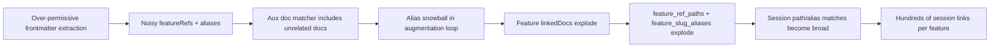

# Linking Regression Report (Docs <> Features <> Sessions)

Date: 2026-02-18
Workspace: /Users/miethe/dev/homelab/development/CCDash
Data source: /Users/miethe/dev/homelab/development/CCDash/data/ccdash_cache.db
Primary impacted project: /Users/miethe/dev/homelab/development/skillmeat

## Executive Summary

The regression is real and severe. Feature-level link fan-out is being driven by two compounding issues introduced in the recent document-linking refactor:

1. Frontmatter reference extraction is over-permissive and is converting non-path free text into feature aliases.
2. Feature doc augmentation performs transitive alias expansion (`aliases.update(...)`) while iterating, causing a snowball effect that pulls in many unrelated docs.

Those over-linked docs are then used as evidence inputs for feature-to-session linking, so session links fan out across many features and elevate some unrelated sessions to Core/Primary.

## Current Impact (Measured)

Global counts from DB:

- Total `entity_links`: `40,666`
- `feature -> session`: `38,887`
- `feature -> task`: `1,654`
- `document -> feature`: `125`

Fan-out indicators:

- Top features have `640-717` linked sessions each.
- Top sessions are linked to `71-75` features each.

For `marketplace-source-detection-improvements-v1`:

- `linkedDocs`: `108`
- `feature -> session` links: `500`
- `97/108` linked docs do not contain the feature slug in `filePath` or `prdRef`.

Quality signal:

- Only `19/500` links for this feature are `confidence >= 0.75`.
- Many of those high-confidence links are still unrelated, because the evidence path belongs to other features.

Correlation:

- Correlation between `linkedDocs` count and `feature->session` count: `0.864`

## What Changed

### Regression Window

- Commit `/Users/miethe/dev/homelab/development/CCDash` `a8400c5` (`Validate feature-session links`) introduced the document-linking refactor and major link-surface expansion.
- Commit `b22becc` (`Update session linking heuristics`) previously enhanced session evidence matching but did not introduce the doc explosion by itself.

### Code Changes That Expanded Matching Surface

- New shared linking helpers:
  - `/Users/miethe/dev/homelab/development/CCDash/backend/document_linking.py:231`
  - `/Users/miethe/dev/homelab/development/CCDash/backend/document_linking.py:167`
- Feature parser augmentation:
  - `/Users/miethe/dev/homelab/development/CCDash/backend/parsers/features.py:497`
  - `/Users/miethe/dev/homelab/development/CCDash/backend/parsers/features.py:799`
  - `/Users/miethe/dev/homelab/development/CCDash/backend/parsers/features.py:822`
- Session linker consumes expanded doc refs/aliases:
  - `/Users/miethe/dev/homelab/development/CCDash/backend/db/sync_engine.py:862`
  - `/Users/miethe/dev/homelab/development/CCDash/backend/db/sync_engine.py:879`
  - `/Users/miethe/dev/homelab/development/CCDash/backend/db/sync_engine.py:1142`
  - `/Users/miethe/dev/homelab/development/CCDash/backend/db/sync_engine.py:1171`

## How Linking Currently Works (Entity Overview)

```mermaid
flowchart TD
    A[Markdown Docs + Progress Files] --> B[Document Parsing + Frontmatter Extraction]
    B --> C[Feature Discovery (Plans + PRDs + Progress)]
    C --> D[Feature linkedDocs]
    D --> E[Session Evidence Linking]
    E --> F[feature->session entity_links]
    B --> G[document->feature entity_links]

    H[Feature Modal] --> D
    H --> F
```

### Docs -> Features

1. Docs and progress files are scanned.
2. Frontmatter references are extracted into `relatedRefs`, `featureRefs`, `prdRefs`, etc.
3. Features are seeded from implementation plans, enriched by PRDs and progress docs.
4. Auxiliary docs are appended if `_doc_matches_feature(...)` returns true.

Key files:

- `/Users/miethe/dev/homelab/development/CCDash/backend/parsers/documents.py:105`
- `/Users/miethe/dev/homelab/development/CCDash/backend/parsers/features.py:582`
- `/Users/miethe/dev/homelab/development/CCDash/backend/parsers/features.py:799`

### Features -> Sessions

1. For each feature, linker builds `feature_ref_paths` and `feature_slug_aliases` from all `linkedDocs`, plus each doc's `relatedRefs` and `prdRef`.
2. For each session, linker checks file updates and parsed command paths against those refs/aliases.
3. Confidence is computed from signal mix; links are upserted.

Key files:

- `/Users/miethe/dev/homelab/development/CCDash/backend/db/sync_engine.py:862`
- `/Users/miethe/dev/homelab/development/CCDash/backend/db/sync_engine.py:1112`
- `/Users/miethe/dev/homelab/development/CCDash/backend/db/sync_engine.py:1184`

### Core Session Classification

Core/primary classification in the feature API uses confidence + signal types:

- `/Users/miethe/dev/homelab/development/CCDash/backend/routers/features.py:118`

With polluted feature evidence, unrelated sessions can still qualify as primary if they trip command-path/write signals.

## Root Cause Analysis



### Root Cause 1: Free-text with `/` treated as paths

In `/Users/miethe/dev/homelab/development/CCDash/backend/document_linking.py:246`, all scalar frontmatter values are scanned; anything containing `/` is treated as path-like.

In progress notes, text like:

- `... None/empty to clear mapping`
- `... validation/persistence flows`
- `... invalid paths/types ...`

becomes path refs and then slug refs such as:

- `empty to clear mapping`
- `persistence flows`
- `types, documented all error codes`

These non-feature phrases end up in `featureRefs`/aliases.

### Root Cause 2: Transitive alias snowball in feature augmentation

In `/Users/miethe/dev/homelab/development/CCDash/backend/parsers/features.py:822`, each newly matched doc adds more aliases during the same matching pass.

Measured effect for `marketplace-source-detection-improvements-v1`:

- Step 1-3 docs: `7`
- After Step 4 without snowball (`aliases.update` removed): `31`
- After current Step 4 with snowball: `108`
- Snowball-only additions: `77`

Across features:

- Average docs after Step 1-3: `4.37`
- Average with static matching: `36.60`
- Average with current dynamic snowball: `111.18`
- Average snowball-only increase: `74.57`

### Root Cause 3: Generic-ish tokens are not filtered

`alias_tokens_from_path` keeps parent/grandparent tokens unless explicitly listed as generic:

- `/Users/miethe/dev/homelab/development/CCDash/backend/document_linking.py:167`

Tokens such as `design-specs`, `metrics`, `all-phases-progress` can become match bridges.

### Root Cause 4: Session linker trusts expanded doc graph as hard evidence surface

The session linker now consumes all linked doc paths + related refs + PRD refs + alias intersections:

- `/Users/miethe/dev/homelab/development/CCDash/backend/db/sync_engine.py:879`
- `/Users/miethe/dev/homelab/development/CCDash/backend/db/sync_engine.py:1171`

Once feature doc graph is noisy, session matching naturally fans out.

## Concrete Mis-Mapping Examples

### Session Examples (feature: `marketplace-source-detection-improvements-v1`)

- `S-08d6b152-8d32-4aad-b600-c1fef910483a` (`0.75`)
  - title: `Execute Phase 4 - memory-context-system-v1`
  - evidence path: `.../implementation_plans/features/memory-context-system-v1.md`
  - why likely wrong: explicit other feature in title/path.

- `S-06680128-f6d2-41cb-8414-4b0281c12ada` (`0.75`)
  - title: `Path-based tag extraction Phase 1 implementation complete`
  - evidence path: `.../path-based-tag-extraction-v1.md`
  - why likely wrong: different feature.

- `S-24c3e7cb-259f-43a0-b6bd-ac7c12886317` (`0.75`)
  - title: `Catalog Modal Enhancement Phase 2 Complete`
  - evidence path: `.../catalog-entry-modal-enhancement-v1.md`
  - why likely wrong: different feature.

- `S-3b6f31ee-8463-4756-8a5d-eb8b4f9490ff` (`0.75`)
  - title: `Plan Feature - workflow-orchestration-v1`
  - evidence path: `.../specs/workflow-orchestration-schema-spec.md`
  - why likely wrong: different feature.

### Document Examples (same feature)

Linked docs include many unrelated docs, such as:

- `.../implementation_plans/features/memory-context-system-v1.md`
- `.../implementation_plans/features/workflow-orchestration-v1.md`
- `.../implementation_plans/features/catalog-entry-modal-enhancement-v1.md`
- `progress/multi-platform-project-deployments/phase-1-progress.md`
- `progress/entity-lifecycle-management-v1/all-phases-progress.md`

The linkedDocs distribution for unrelated docs (by type) in this feature:

- `progress`: `73`
- `implementation_plan`: `12`
- `prd`: `4`
- `document`: `4`
- `phase_plan`: `3`
- `spec`: `1`

## Why Core Sessions Inflated

Primary/Core logic itself is not the first-order bug. It is receiving contaminated candidate links.

- Primary rules are in `/Users/miethe/dev/homelab/development/CCDash/backend/routers/features.py:118`.
- For the example feature, 19 links exceed `0.75`; many are still unrelated due incorrect evidence assignment upstream.

## Recommended Fix Plan

### Immediate Hotfix

1. Stop transitive alias snowball.
   - Remove `aliases.update(alias_tokens_from_path(file_path))` in augmentation loop.
   - File: `/Users/miethe/dev/homelab/development/CCDash/backend/parsers/features.py:822`

2. Restrict frontmatter auto path extraction.
   - Remove or tightly scope scalar sweep at `/Users/miethe/dev/homelab/development/CCDash/backend/document_linking.py:246`.
   - Only parse path-like values from explicit relation keys.

3. Tighten alias eligibility.
   - Require feature-slug-like token pattern (no spaces/punctuation-heavy values).
   - Expand generic token denylist (`all-phases-progress`, taxonomy directories, etc.).

4. Rebuild from clean links phase after fixes.
   - Full sync or at minimum links rebuild once data model is corrected.

### Short-Term Hardening

1. Add invariant tests:
   - No alias with spaces from path/slug extraction.
   - Progress note text cannot become `featureRefs`.
   - Feature linkedDocs cardinality guardrails (threshold alerts).

2. Add link audit checks into sync workflow.
   - Use `/Users/miethe/dev/homelab/development/CCDash/backend/scripts/link_audit.py`.
   - Flag high fanout and title/path mismatches before UI consumption.

3. Add confidence gating for Core sessions.
   - Require stronger direct evidence (task-bound or exact feature path) for Core status.

### Structural Refactor (Document-Centric)

1. Build a canonical document graph index keyed by:
   - absolute path
   - project-relative path
   - slug + canonical slug
   - doc type/category
   - frontmatter relationship fields (explicit only)

2. Use one normalized matcher for:
   - feature linkedDocs discovery
   - document->feature links
   - session evidence path-to-feature resolution

3. Move to deterministic, non-transitive matching passes:
   - pass A: exact path and explicit relations
   - pass B: canonical slug matching with strict token validation
   - pass C: optional low-confidence related suggestions (never auto-core)

## Appendix: Key Files

- `/Users/miethe/dev/homelab/development/CCDash/backend/document_linking.py`
- `/Users/miethe/dev/homelab/development/CCDash/backend/parsers/features.py`
- `/Users/miethe/dev/homelab/development/CCDash/backend/parsers/documents.py`
- `/Users/miethe/dev/homelab/development/CCDash/backend/db/sync_engine.py`
- `/Users/miethe/dev/homelab/development/CCDash/backend/routers/features.py`
- `/Users/miethe/dev/homelab/development/CCDash/backend/scripts/link_audit.py`
