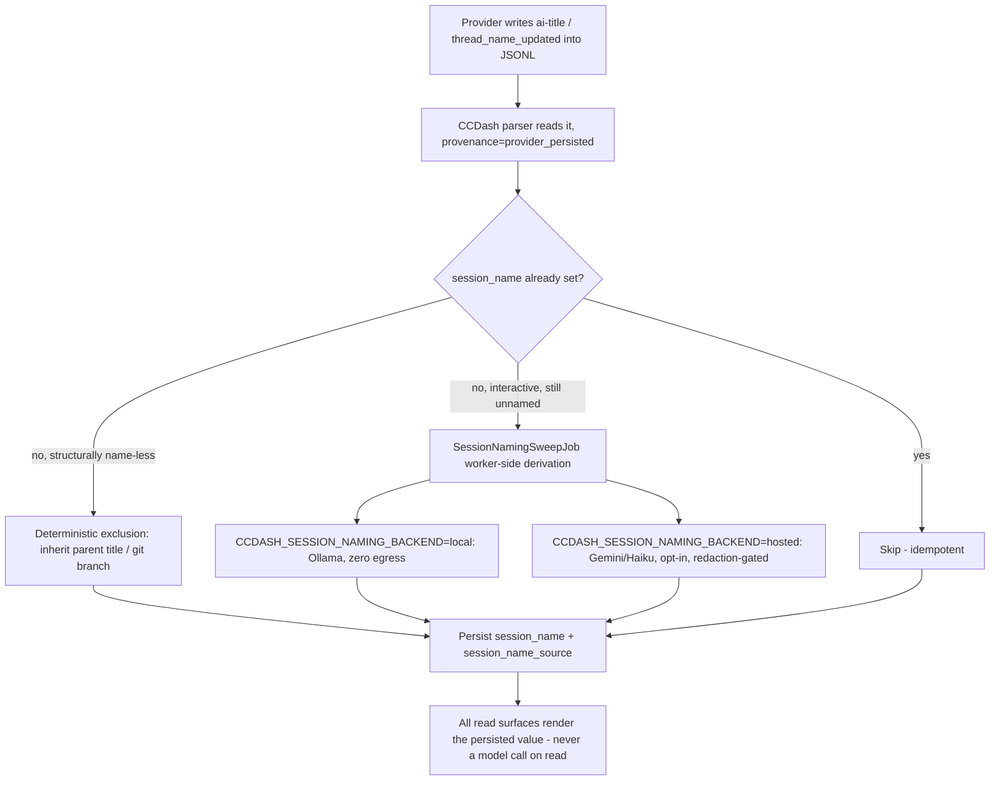

# Feature Brief & Metadata

**Feature Name:**

> Automatic Session Naming

**Filepath Name:**

> `automatic-session-naming-v1`

**Date:**

> 2026-08-04

**Author:**

> prd-writer (Claude)

**Related Epic(s)/PRD ID(s):**

> None — net-new feature slug `automatic-session-naming`

**Related Documents:**

> - Feasibility brief (verdict `go`, confidence 0.87, extended by a 4th leg to `go` on the derived-naming scope): `docs/project_plans/exploration/automatic-session-naming/automatic-session-naming-feasibility-brief.md`
> - tech-claude SPIKE: `docs/project_plans/exploration/automatic-session-naming/spikes/tech-claude-spike.md`
> - tech-codex SPIKE: `docs/project_plans/exploration/automatic-session-naming/spikes/tech-codex-spike.md`
> - integration SPIKE: `docs/project_plans/exploration/automatic-session-naming/spikes/integration-spike.md`
> - derived-naming SPIKE (4th leg, post-verdict addendum): `docs/project_plans/exploration/automatic-session-naming/spikes/derived-naming-spike.md`
> - H5 anchor: `skill_name_source` end-to-end (commits `2cb0df4` + `ad7c70c`, schema v49) — 5 points shipped, 14 files, 423-line dedicated test file
> - Compose env-allowlist precedent: commit `5cb8e00`

---

## 1. Executive Summary

Claude Code and Codex already generate a human-meaningful session name or title and persist it inside the same per-session JSONL files CCDash's parsers already read — Claude Code as a top-level `ai-title` record, Codex as an `event_msg` with `payload.type == "thread_name_updated"`. CCDash currently discards both: no `session_name` column exists, and the Codex parser reads `thread_name` into a local variable and throws it away. Every CCDash surface that shows a session today shows a raw UUID instead. This feature adds a `session_name` / `session_name_source` column pair, wires both providers' provider-persisted names through the full transport-neutral surface (REST, CLI, MCP, standalone CLI, NDJSON ingest, FE), deterministically excludes the ~58.6% of the corpus that structurally has no name to give (subagent sidechains, headless automation), and adds a worker-side derived-naming job (local-model default, hosted-model opt-in) that fills in a name for the remaining unnamed, interactive sessions — all with zero model calls on any read/render path.

**Priority:** MEDIUM (P2)

**Key Outcomes:**
- Outcome 1: Interactive Claude Code and Codex sessions show a real, provider-generated task title instead of a raw UUID on every session surface (FE cards, inspector, planning board, CLI, MCP).
- Outcome 2: Sessions that structurally cannot be named by a provider (subagent sidechains, headless automation) are deterministically resolved (inherited parent title, git branch, or explicit null) instead of silently falling through to a UUID.
- Outcome 3: The remaining unnamed, interactive sessions get a best-effort derived name from a worker-side job, with zero egress by default and an explicit opt-in path for a hosted backend.

---

## 2. Context & Background

### Current State

`AgentSession` (backend `models.py` / frontend `types.ts`) has no `session_name` or equivalent field. Every session-showing surface (SessionCard, SessionInspector, PlanningAgentSessionBoard, MultiProjectSessionBoard, CLI/MCP output) renders a raw session UUID or a truncated first-user-message string as the de facto title. This is true even though both supported providers already compute and persist a better name upstream, inside a file CCDash already opens line-by-line.

### Problem Space

Users scanning session lists, the planning board, or the command center cannot tell sessions apart without opening each one — every card looks like a UUID. The pain is specifically about *interactive* work (an operator watching what an agent has been doing); it was never about naming automation/subagent noise, which has its own identity mechanisms already (`agent-name` records, workflow/skill attribution).

### Current Alternatives / Workarounds

`components/SessionCard.tsx`'s `deriveSessionCardTitle` / `deriveTranscriptIntelligenceTitle` chain already falls through empty-string → `sessionTypeLabel` → raw `sessionId`. This scaffold predates this feature (built for the flagged, deterministic "transcript intelligence" title system) and is the existing fallback floor this feature raises, not replaces.

### Architectural Context

Router → Service → Repository layering; DTOs only across API boundaries; cursor pagination for lists; `ErrorResponse` envelope for failures (all unaffected by this feature — no new endpoints, only new fields on existing ones). CLI (`backend/cli/`), MCP (`backend/mcp/tools/sessions.py`), the standalone `packages/ccdash_cli` formatters, and NDJSON remote ingest are all **dynamic passthrough** layers — a field on the underlying DTO/row reaches all four with zero code change (integration spike §1).

---

## 3. Problem Statement

**User Story Format:**
> "As an operator watching CCDash's session boards, when I scan a list of active or recent sessions, I see indistinguishable UUIDs instead of the task-descriptive title the provider already generated, so I cannot tell sessions apart without opening each one."

**Technical Root Cause:**
- No `session_name` column exists in `sessions` (SQLite or Postgres).
- Codex parser (`backend/parsers/platforms/codex/parser.py`, `event_msg` handling ~lines 1148–1173) computes `summary_text` from keys that don't exist on a `thread_name_updated` payload; the branch still fires and emits a mislabeled `ImpactPoint`, and the actual `thread_name` string is read into memory and discarded (confirmed: zero hits for `grep -rn "thread_name" backend/`).
- Claude Code's `ai-title` record is never read into `AgentSession` at all — no consuming field exists.
- Secondary, same-record discard on Codex: `session_meta.payload.git.branch` (95.0% present) is never read; `AgentSession.gitBranch` is hardcoded `None`.

---

## 4. Goals & Success Metrics

### Primary Goals

**Goal 1: Stop discarding provider-persisted names**
- Wire `ai-title.aiTitle` (Claude Code) and `thread_name_updated.thread_name` (Codex) into `AgentSession.sessionName` with provenance `provider_persisted`, reaching every transport surface.
- Success: a Claude Code top-level-large session or a `codex_vscode`-originated session shows its provider title on every surface listed in §6 target_surfaces, verified by runtime smoke.

**Goal 2: Deterministically resolve the structurally name-less segment**
- Claude subagent sidechains (49.8% of local corpus) inherit the parent's title via a one-hop extension of the existing `backfill_skill_name_inheritance` call site, or fall back to `agent-name`.
- Codex `codex_exec` headless sessions (8.8% of local corpus) use `session_meta.payload.git.branch` (95.0% coverage) as a fallback.
- Success: no session in either excluded segment renders a bare UUID when a deterministic fallback value exists; both are zero-model-call.

**Goal 3: Fill the remaining gap with a worker-side, opt-in-controlled derived-naming job**
- A `SessionNamingSweepJob` persists a best-effort name for interactive sessions that have no provider or deterministic name, using a pluggable local-default / hosted-opt-in backend.
- Success: the job runs on a schedule, is fail-open, is idempotent, and never executes on a read/render path.

### Success Metrics

| Metric | Baseline | Target | Measurement Method |
|--------|----------|--------|-------------------|
| Provider-title coverage on interactive Claude Code sessions (top-level-large) | 0% (discarded) | 87.2% (matches tech-claude spike's measured `ai-title` coverage on this segment) | Re-parse + DB query: `COUNT(session_name_source='provider_persisted') / COUNT(*)` scoped to top-level, 500+ line sessions |
| Provider-title coverage on `codex_vscode`-originated sessions | 0% (discarded) | 72.4% (matches tech-codex spike's measured coverage) | Same query pattern, scoped to `originator='codex_vscode'` |
| Structurally-name-less sessions with a non-null resolved name (inherited or git-branch fallback) | 0% | 100% of the deterministic-exclusion segment (58.6% of local corpus) where a parent title or branch value exists | DB query scoped to `isSidechain=true` (Claude) and `originator='codex_exec'` (Codex) |
| Sessions rendering a raw UUID as their only visible label | not measured (current de facto behavior) | reduced; not a hard percentage target — no source measured the residual after all three lanes | Manual runtime smoke across FE surfaces in §6 |

---

## 5. User Personas & Journeys

### Personas

**Primary Persona: CCDash operator**
- Role: Developer/operator monitoring agent sessions across one or more projects.
- Needs: Distinguish sessions at a glance on the planning board, command center, and session list without opening each one.
- Pain Points: Every card is a UUID today; distinguishing "which session was the auth refactor" from "which was the docs pass" requires opening each session.

### High-level Flow

---

## 6. Requirements

### 6.1 Functional Requirements

| ID | Requirement | Priority | Notes |
| :-: | ----------- | :------: | ----- |
| FR-1 | Add `session_name TEXT` and `session_name_source TEXT` nullable columns to `sessions` (SQLite + Postgres DDL, schema v49→v50). | Must | `backend/db/sqlite_migrations.py`, `backend/db/postgres_migrations.py` |
| FR-2 | New closed-vocabulary module `backend/parsers/session_name_provenance.py` implementing the four-token rank (see Provenance Vocabulary §14). Unrecognised tokens MUST be treated as "unknown provenance," never a hard-fail. | Must | Mirrors `skill_provenance.py` / `effort_provenance.py` pattern exactly |
| FR-3 | Claude Code parser emits `sessionName`/`sessionNameSource` from the `ai-title` record, keyed by "latest wins" (idempotent re-emission is expected; 2.1% of files mutate the value). Parser MUST assert `ai-title.sessionId == <file's session id>` and skip on mismatch. | Must | `backend/parsers/platforms/claude_code/parser.py` |
| FR-4 | Codex parser emits `sessionName`/`sessionNameSource` from `event_msg.payload.thread_name_updated`, keyed by "latest wins" (replace-in-place semantics observed). | Must | `backend/parsers/platforms/codex/parser.py`, ~lines 1148–1173 |
| FR-5 | Codex parser additionally reads `session_meta.payload.git.branch` (currently discarded, hardcoded `None`) into `AgentSession.gitBranch` and makes it available as the deterministic fallback source for FR-7. | Must | Same parser file; secondary discard fix identified in tech-codex spike Finding 5 |
| FR-6 | `sessions` repositories (SQLite + Postgres) persist the two new columns via INSERT column list + `ON CONFLICT` UPDATE. No new repository method needed (no cross-session inheritance join for provider-persisted names). | Must | `backend/db/repositories/sessions.py`, `backend/db/repositories/postgres/sessions.py` |
| FR-7 | Deterministic exclusion: Claude subagent sidechains (`isSidechain=true`) inherit the parent session's `session_name` via a one-hop extension of the existing `backfill_skill_name_inheritance` call site (`backend/db/sync_engine.py:3307`), falling back to the `agent-name` record when no parent name exists. Codex `codex_exec` sessions use `session_meta.payload.git.branch` (from FR-5) with provenance `derived_deterministic`. | Must | Zero model calls; extends existing one-hop, `(id, project_id)`-scoped join shape |
| FR-8 | `AgentSession` (backend `models.py`) and `AgentSession` (frontend `types.ts`) gain `sessionName: string \| null` and `sessionNameSource: string \| null`. | Must | |
| FR-9 | `routers/api.py` (`list_sessions`, `get_session`), `PlanningAgentSessionCardDTO` + `planning_sessions.py` card builders, and `_client_v1_sessions.py` (`list_sessions_v1`, `search_sessions_v1`, `get_session_family_v1`) surface the new fields. | Must | 6 files per integration spike §1 |
| FR-10 | FE surfaces render `session.sessionName` via the existing `deriveSessionCardTitle`/`deriveTranscriptIntelligenceTitle` fallback chain as `explicitTitle` — no new fallback logic, just new call sites. | Must | `SessionCard.tsx`, `SessionInspector.tsx`, `SessionInspectorPanels.tsx`, `PlanningAgentSessionBoard.tsx`, `MultiProjectSessionBoard.tsx` |
| FR-11 | `_V1_CAPABILITIES` gains `"sessions:name"` (see OQ-3 in frontmatter for the unconditional-vs-gated timing decision — left open, not blocking). | Should | `backend/routers/client_v1.py` |
| FR-12 | New `SessionNamingSweepJob` (`backend/adapters/jobs/session_naming_sweep_job.py`), registered in `RuntimeContainer.startup()` (`backend/runtime/container.py`, beside the `aar_review_sweep_job=` block) only for `worker`/`worker-watch` profiles. Reads eligible rows (`session_name IS NULL`, excluding rows resolved by FR-7), derives a name via the selected backend, persists via the existing repository upsert path. | Must | Mirrors `AARReviewSweepJob` shape exactly |
| FR-13 | Backend selection via `CCDASH_SESSION_NAMING_BACKEND=local\|hosted`. `local` (Ollama) is the **default**. `hosted` (Gemini/Haiku, reusing `ai_insight.py`'s transport) requires the redaction gate to run on the extracted first-user-message text before it is placed in the outbound prompt. | Must | New Ollama HTTP client (no existing precedent); hosted lane reuses `backend/services/ai_insight.py` transport pattern |
| FR-14 | Input sourcing hard invariant: the naming job MUST read the first-user-message text via the redacted bundle (`session_detail.get_session_detail`, which already runs `redact_entries`), never a raw JSONL read. | Must | New explicit hard invariant, not yet enforced anywhere; mirrors AAR review's Hard Invariant #4 |
| FR-15 | Idempotency: `WHERE session_name IS NULL` at the sweep's candidate-selection query. Any session with a non-null `session_name`, from any source, is never re-derived. | Must | |
| FR-16 | Kill-switch + quota: `CCDASH_SESSION_NAMING_ENABLED` (recommend default **false** for the derive-worker specifically — the deterministic FR-1–FR-11 wiring ships unconditionally, but the model-touching worker is opt-in at launch), `CCDASH_SESSION_NAMING_QUOTA` (default 200/tick), `CCDASH_SESSION_NAMING_WINDOW_HOURS` (default 24), `CCDASH_SESSION_NAMING_SWEEP_INTERVAL_SECONDS` (default 1800). | Must | Mirrors `CCDASH_AAR_REVIEW_AUTONOMOUS_WORKER_ENABLED` / `_QUOTA` / `_WINDOW_HOURS` pattern |
| FR-17 | Fail-open: any model-call failure (timeout, 4xx/5xx, Ollama unreachable) leaves `session_name` NULL for that session and logs — never crashes the sweep tick, never blocks the next candidate. | Must | Mirrors `AARReviewSweepJob`'s per-document try/except-and-continue |
| FR-18 | `CCDASH_GEMINI_API_KEY` (hosted-lane credential) added to the compose `x-backend-shared-env` allowlist in the same change that ships the hosted-lane code, or it silently no-ops in `worker`/`worker-watch` while appearing set on the host. | Must | Same gap class `5cb8e00` fixed for five other flags; currently `.env.example`-only |

### 6.2 Non-Functional Requirements

**Performance:**
- No model call on any read/render path. The naming job is worker-side only; every read surface (REST, CLI, MCP, standalone CLI, NDJSON) renders an already-persisted `session_name` column value, exactly like `ai-title`/`thread_name_updated` today. (Non-negotiable — verified by a static-walk-contract test mirroring `test_aar_review_no_llm_imports.py`, inverted: a positive assertion that no router/service on the read path imports a model client.)

**Security / Egress:**
- Zero egress by default. `CCDASH_SESSION_NAMING_BACKEND` defaults to `local`; the `hosted` lane is CCDash's first transcript-content egress and ships default-off, opt-in, and mandatorily behind the redaction gate (`CCDASH_REDACTION_PATTERNS_ENABLED`, default true, sufficient for this plain-text input shape). A positive test must assert every outbound `hosted`-lane prompt has passed `redact_entries` first before the flag can be flipped on in any deployment.

**Reliability:**
- Fail-open (FR-17); idempotent (FR-15); offline-CLI degrades `session_name` to null (worker-only enrichment, contract state not a bug, identical to cost/analytics KPIs today).

**Observability:**
- OpenTelemetry span for the sweep job tick, mirroring `AARReviewSweepJob`; structured log on every derivation attempt (success/fail/skip) with trace_id — never logging transcript content, only counts/status per the redaction-event-log convention.

---

## 7. Scope

### In Scope

- Provider-persisted name ingest for Claude Code (`ai-title`) and Codex (`thread_name_updated`) — 8 pts.
- Deterministic exclusion / fallback for structurally name-less sessions (Claude subagent inheritance, Codex `codex_exec` git-branch fallback) — 1 pt.
- Dual-backend derived-naming worker (Lane A local-default, Lane B hosted-opt-in) for the remaining unnamed, interactive segment — ~6 pts.
- Schema migration (v49→v50), provenance vocabulary module, transport-neutral surface wiring (REST/CLI/MCP/standalone-CLI/NDJSON/FE).

### Out of Scope

- Lane C (embedding k-NN title transfer) — see Deferred Items §15.
- Operator-editable / manually-renamed session names (`operator_set` provenance token reserved but not implemented) — see Deferred Items §15.
- Any change to routing/rollup logic (`routing_rollup`, `skill_name_source` consumption) — this feature has no adjacent-system disturbance, unlike `skill_name_source`'s explicit scope note.
- Secondary FE link renderers beyond the required set in FR-10 (`FeatureModal/SessionsTab.tsx`, `DocumentModal.tsx`, `Planning/CommandCenter/PhasePlanTable.tsx`) — today's UUID fallback there is already resilient; upgrading is polish, tracked as optional/deferred, not required for this PRD's Definition of Done.
- `LinkedFeatureSessionDTO.title` reuse decision (OQ-1) — resolve during implementation planning, not scoped as a code change here until resolved.

---

## 8. Dependencies & Assumptions

### External Dependencies

- **Ollama (local model daemon)**: required for the default `local` backend (FR-13). No existing repo precedent for an Ollama HTTP client — this is new integration surface.
- **Gemini/Haiku hosted API**: required only if `CCDASH_SESSION_NAMING_BACKEND=hosted` is selected. Reuses `backend/services/ai_insight.py`'s existing httpx transport pattern; `CCDASH_GEMINI_API_KEY` already exists as a config value but is not yet in the compose allowlist (FR-18).

### Internal Dependencies

- **`skill_name_source` precedent** (schema v49, commits `2cb0df4` + `ad7c70c`): the H5 estimation anchor and the direct template for the provenance module, the one-hop inheritance call site, and the `COLUMN_PARITY_DRIFT_ALLOWLIST` pattern.
- **`AARReviewSweepJob`** (`backend/adapters/jobs/aar_review_sweep_job.py`): the direct structural template for `SessionNamingSweepJob` — conditional registration, quota/window guard shape, fail-open try/except-and-continue.
- **`ai_insight.py` / `routers/ai.py`**: existing hosted-LLM transport precedent (Gemini) — reused by Lane B, but note it currently sends only aggregated metrics, never transcript content, so the redaction-gate wiring for Lane B's input text is genuinely new work, not a reuse.
- **`redaction.py`**: existing Layer 1 pattern-scan module (`CCDASH_REDACTION_PATTERNS_ENABLED`, default true) — sufficient for the plain first-user-message input shape; must be wired onto the Lane B outbound prompt path.
- **`deriveSessionCardTitle` / `deriveTranscriptIntelligenceTitle`** (`components/SessionCard.tsx`): existing FE fallback chain, already accepts `explicitTitle` and already resilient to an empty value — no new FE fallback logic required, only new call sites.

### Assumptions

- Node PG corpus's provider/subagent mix is assumed to match the local corpus's ratio (28.7% candidate population) — not independently measured on the node (derived-naming spike §3, explicit ASSUMPTION).
- Lane A's ~1.5s per-session amortized latency (Ollama, warm daemon) is untested on this hardware — flagged as ASSUMPTION in the derived-naming spike §3.
- Lane B pricing figures ($0.075/$0.30 per MTok Gemini Flash-class; $1/$5 per MTok Haiku-class) are point-in-time illustrative estimates — must be reverified before implementation, not load-bearing for scope or the go decision (cost is a non-issue at this scale regardless).

### Feature Flags

- `CCDASH_SESSION_NAMING_BACKEND` (`local` | `hosted`, default `local`) — selects the derive-worker backend.
- `CCDASH_SESSION_NAMING_ENABLED` (default **false**) — kill-switch for the derive-worker specifically (deterministic ingest/exclusion ships unconditionally, unflagged).
- `CCDASH_SESSION_NAMING_QUOTA` (default 200/tick), `CCDASH_SESSION_NAMING_WINDOW_HOURS` (default 24), `CCDASH_SESSION_NAMING_SWEEP_INTERVAL_SECONDS` (default 1800).
- `CCDASH_REDACTION_PATTERNS_ENABLED` (existing, default true) — must remain on for any `hosted` backend deployment; not a new flag but a load-bearing precondition.

---

## 9. Risks & Mitigations

| Risk | Impact | Likelihood | Mitigation |
| ----- | :----: | :--------: | ---------- |
| Cross-session attribution (a name copied from/matching a different session; inheritance creep without a hop-limit) | High | Low | No inheritance logic beyond the single explicit one-hop case in FR-7; refuted for Claude Code by direct test (`ai-title.sessionId` matches containing filename 12,746/12,746, single apparent mismatch resolves to an orphan-suffix artifact). Any future extension must mirror `skill_provenance.py`'s one-hop + `(id, project_id)`-scoped join exactly. |
| Migration/column-parity drift (SQLite vs Postgres DDL diverge) | Medium | Low | `COLUMN_PARITY_DRIFT_ALLOWLIST` assertion test; `skill_name_source` shipped with 0 entries as the template — expect the same here (both nullable TEXT, no type/nullability drift). |
| FE null-handling regression (a component assumes `sessionName` is always present) | Medium | Medium | `deriveSessionCardTitle`'s existing empty-string-falls-through is the guard; new call sites must route through it, never render `session.sessionName` directly. |
| Ingest-contract versioning (old daemon never emits `sessionName`) | Low | Medium | `IngestSessionEvent.payload` is `extra="allow"` (ADR-006 F-6); old daemon simply omits the key, no rejection. |
| Node deploy drift (schema ships to main but node runs stale baked image) | Medium | High (standing hazard) | `podman-compose build` (not restart) on next node redeploy; verify via `/api/health/detail` schema version. |
| `LinkedFeatureSessionDTO.title` reuse ambiguity (OQ-1) creates two divergent "name" concepts | Medium | Medium | Resolve OQ-1 during implementation planning, before the milestone that touches feature-linked-sessions DTOs — not mid-execution. |
| Title quality / hallucination on thin input (~200 tokens, first message only, derive-worker lanes) | Medium | Medium | `derived_generative`'s deliberately lower trust rank signals consumers to treat it as best-effort; consider a minimum-input-length gate that leaves the field null rather than forcing a low-quality title. |
| Exfiltration via Lane B (hosted backend) off-box egress | **High** | Low (with gate) / High (without) | Mandatory redaction-gate wiring (FR-14) before any outbound prompt; default-off flag (FR-16) until the positive redaction-coverage test exists; explicit operator opt-in required. |
| `CCDASH_GEMINI_API_KEY` not in the compose env-allowlist | Medium | High (standing hazard, per `5cb8e00`) | FR-18 — add to `x-backend-shared-env` in the same change that ships the hosted-lane code. |
| **Schema migration halts for human approval (Mode-D)** | — | — | This feature adds DB columns via a schema migration (v49→v50). Per the project's Mode-D policy, schema-migration steps halt execution for explicit human approval before the migration is applied to any shared environment (node PG in particular). This is a process gate, not a technical risk, but must be scheduled as an explicit approval checkpoint in the implementation plan. |

---

## 10. Target State (Post-Implementation)

**User Experience:**
- Session cards, the session inspector, the planning board, and the multi-project session board show a real task-descriptive title for the ~87% of substantive Claude Code sessions and ~72% of `codex_vscode` Codex sessions that already have a provider title, plus an inherited or git-branch-derived label for the deterministically-excluded segment, plus (when the derive-worker is enabled) a best-effort generated title for the remainder.
- A session with no name anywhere in the chain still renders the pre-existing UUID/first-message fallback — no surface regresses.

**Technical Architecture:**
- `sessions.session_name` / `sessions.session_name_source` are the single source of truth, populated by three independent write paths (parser ingest, deterministic exclusion backfill, worker-side derive job) that never race because each writes only when the prior value is null.
- No read path ever calls a model. The `SessionNamingSweepJob` is the only model-touching code, and it runs on a schedule in `worker`/`worker-watch` profiles only.

**Observable Outcomes:**
- `session_name_source` distribution is queryable and should show `provider_persisted` as the plurality on interactive sessions, `derived_deterministic` on the excluded segment, and (once enabled) `derived_generative` on the residual — giving an operator a direct signal of how much of the corpus still needs the worker.

---

## 11. Overall Acceptance Criteria (Definition of Done)

### Functional Acceptance

- [ ] FR-1 through FR-18 implemented.
- [ ] A re-sync of the local corpus populates `session_name`/`session_name_source` on all previously-discarded provider-persisted names (backfill via ordinary full re-parse, no new backfill mechanism — integration spike §4 confirms this is the same class of operation `sync_engine.py`'s existing `force=True` full-scan path already performs).
- [ ] Deterministic exclusion resolves 100% of the Claude subagent segment with an existing parent title, and 100% of the Codex `codex_exec` segment with a non-empty `git.branch` value.

### Resilience Acceptance (missing `session_name` is a contract state, not a bug)

Per-surface null-handling table (source: integration spike §3):

| Surface | Required behaviour when `session_name` is null |
| --- | --- |
| `sessions` DB row | `NULL`; `session_name_source` also `NULL` — never a name with no source |
| `AgentSession` (models.py / types.ts) | `sessionName: null` — explicit contract state, not omitted from the payload |
| `SessionDetailV1.session` dict | key absent from the row dict entirely on pre-migration rows; consumers MUST use `.get()`, never `[]` |
| `PlanningAgentSessionCardDTO` | `session_name: None` → card builder falls back to existing `agent_name`/`session_id` label logic (pre-feature baseline, unchanged) |
| `SessionCard.tsx` / `deriveSessionCardTitle` | Already resilient — `explicitTitle` empty falls through to `sessionTypeLabel` → raw `sessionId`. Zero new fallback code required; new call sites must route through this chain, never render `session.sessionName` directly. |
| `SessionInspector.tsx` header / `SessionInspectorPanels.tsx` | Same fallback chain via `SessionSummaryCard` |
| CLI / MCP JSON output | `null` in JSON; generic table/markdown formatters render `""` for a missing key (existing `table.py` behavior, no new formatter code) |
| NDJSON ingest payload | Field simply absent from `payload` dict on an old-schema daemon (`extra="allow"`, ADR-006 F-6) — no rejection |
| `/api/v1/capabilities` | Absence of `"sessions:name"` means "server predates this feature"; consumers MUST NOT hard-fail (existing convention) |

- [ ] Every row in the table above has a corresponding test or manual smoke check confirming the documented behaviour.

### Escaping / Render-Safety Acceptance

- `session_name` can arrive via the remote NDJSON ingest path (`POST /api/v1/ingest/sessions`), i.e. from a caller-controlled source (a daemon relaying a third-party's session), and is rendered directly in FE session surfaces.
- [ ] **AC-ESC-1**: `session_name` MUST be escaped/sanitised on every FE render path before display (React's default JSX text-node escaping satisfies this for plain `{session.sessionName}` interpolation; any surface that renders it via `dangerouslySetInnerHTML`, a raw HTML string, or a markdown renderer MUST explicitly sanitise first). No FE surface may render `session_name` as trusted HTML.
  - target_surfaces:
    - components/SessionCard.tsx
    - components/SessionInspector.tsx
    - components/SessionInspector/SessionInspectorPanels.tsx
    - components/Planning/PlanningAgentSessionBoard.tsx
    - components/Planning/CommandCenter/MultiProjectSessionBoard.tsx
  - propagation_contract: `session_name` flows DB row → DTO → REST/NDJSON response → FE fetch → `deriveSessionCardTitle`/`deriveTranscriptIntelligenceTitle` → JSX text interpolation.
  - resilience: null → existing fallback chain (see Resilience Acceptance table above).
  - visual_evidence_required: false (escaping is a code-path property, not a visual difference — verified by a render test asserting no raw-HTML sink is used, not a screenshot).
  - verified_by: implementation-plan test task covering FR-10's five FE call sites.

### Technical Acceptance

- [ ] Follows Router → Service → Repository layering; no raw SQL in routers.
- [ ] Dual DDL (SQLite + Postgres) ships in the same change set; `COLUMN_PARITY_DRIFT_ALLOWLIST` reviewed (0 new entries expected).
- [ ] Provenance module unrecognised-token behavior is unit-tested (never hard-fail).
- [ ] `SessionNamingSweepJob` has zero model-call imports in any file on the read path — verified by a static-walk-contract test mirroring `test_aar_review_no_llm_imports.py`, inverted.
- [ ] Every outbound Lane B prompt has passed `redact_entries` — verified by a positive assertion test before the hosted backend can be flipped on in any deployment.

### Quality Acceptance

- [ ] New dedicated test file (~250–350 lines, per integration spike §1 sizing estimate) covering provenance, resilience, and idempotency.
- [ ] Direct-count assertion test for the new write path (per ADR-007, `retry_on_locked` compliance on the sessions repository writes).

### Documentation Acceptance

- [ ] CHANGELOG `[Unreleased]` entry (this feature is user-facing — sessions now show real titles).
- [ ] `docs/guides/` note on the naming provenance vocabulary and the two backend flags, mirroring the redaction-tuning / AAR-review-loop guide pattern.

---

## 12. Assumptions & Open Questions

### Assumptions

- The node PG corpus's provider/subagent mix matches the local corpus's 28.7% candidate-population ratio (unmeasured on the node).
- Lane A's local wall-clock latency (~1.5s/session) is untested on production hardware.
- Lane B pricing figures are point-in-time and require reverification before implementation (not load-bearing on scope).

### Open Questions

Carried forward verbatim from the exploration spikes — see full list in frontmatter `open_questions`. Not re-litigated here; see §15 Deferred Items for how OQ-C3 (subagent inheritance) is resolved by this PRD's FR-7, and OQ-1 (integration, `LinkedFeatureSessionDTO.title`) which remains genuinely open and must be resolved during implementation planning.

- [ ] **OQ-1 (integration)**: `LinkedFeatureSessionDTO.title` reuse vs. distinct field — **A**: TBD, resolve before the milestone touching feature-surface DTOs.
- [ ] **OQ-3 (integration)**: `sessions:name` capability — unconditional vs. gated — **A**: TBD, default to unconditional unless the implementation plan surfaces a reason to gate.
- [ ] **OQ-C1/OQ-C2 (tech-claude)**: `ai-title` trigger mechanism and operator-influenceability — **A**: not determinable from on-disk data; does not block implementation.
- [ ] **OQ-1/OQ-3/OQ-4 (tech-codex)**: `thread_name_updated` generation mechanism, batch-retitle inference, single-environment measurement — **A**: none block implementation; documented as residual uncertainty.

---

## 13. Appendices & References

### Related Documentation

- Feasibility brief (verdict `go`, 0.87 confidence; 4th-leg addendum extends scope to ~15 pts): `docs/project_plans/exploration/automatic-session-naming/automatic-session-naming-feasibility-brief.md`
- `skill_name_source` end-to-end precedent: commits `2cb0df4`, `ad7c70c` (schema v49)
- Compose env-allowlist precedent: commit `5cb8e00`
- AAR Review Loop guide (structural template for the sweep job): `docs/guides/aar-review-loop.md`
- Redaction tuning guide: `docs/guides/redaction-tuning.md`
- Offline CLI contract (worker-only enrichment degradation): `docs/guides/offline-cli.md`

### Prior Art

- `backend/parsers/skill_provenance.py`, `backend/parsers/effort_provenance.py` — closed-vocabulary provenance module template.
- `backend/adapters/jobs/aar_review_sweep_job.py` + `aar_review_sweep_guards.py` — worker-job registration, quota/window guard, fail-open shape template.
- `backend/services/ai_insight.py` + `backend/routers/ai.py` — existing hosted-LLM transport precedent (Gemini), reused by Lane B.

---

## 14. Provenance Vocabulary

Closed-vocabulary module `backend/parsers/session_name_provenance.py`. **Consumers MUST treat an unrecognised token as "unknown provenance" and never hard-fail** — the same `KNOWN_SKILL_SOURCES` frozenset-plus-fallback pattern already shipped in `skill_provenance.py`/`effort_provenance.py`, and the same invariant this project already applies to `effort_tier_source`.

Four-token rank, strongest to weakest trust, plus one reserved token:

| Rank | Token | Meaning |
|---|---|---|
| 1 (strongest) | `provider_persisted` | Read verbatim from a provider-written on-disk artifact — Claude Code's `ai-title` record or Codex's `thread_name_updated` event. Zero model call on CCDash's side; the value was computed and persisted upstream by the provider's own client. |
| 2 | `derived_deterministic` | Computed by CCDash with no model call — inherited parent title (Claude subagent one-hop), git-branch fallback (Codex `codex_exec`), or any future zero-model-call extraction (last-prompt, slash-command). Same trust tier as the shipped `SessionInferredTitle.source` literal, but a distinct field with different persistence semantics (persisted column vs. request-time-computed). |
| 3 | `derived_embedding_transfer` | Reserved for the deferred Lane C (embedding k-NN title transfer). Not implemented in this PRD's scope. Ranked above generative because it would be grounded in an actual similar, real, provider-named session — but only when similarity-gated. |
| 4 (weakest active) | `derived_generative` | Produced by the `SessionNamingSweepJob`'s model backend (Lane A local or Lane B hosted — one token for both; which lane produced a given row is an operational/log detail, not a schema-contract concern). Lowest active trust: most likely to be generic or mildly off given ~200 input tokens. |
| reserved | `operator_set` | Manual rename. Explicitly out of scope for this PRD (see §15 Deferred Items). Token reserved now so a future rename feature doesn't require a second migration. |

---

## 15. Coverage Model

Coverage must always be read against the correct denominator. The all-files denominator is a defect of measurement, not of the feature — segmenting by structural nameability resolves it completely.

**All-files denominator (misleading in isolation):**

| Provider | All-files coverage |
|---|---:|
| Claude Code | 11.29% (850/7,531 files) |
| Codex | 15.79% (541/3,427 files) |

**Segmented denominator (the correct read):**

| Segment | Share of local corpus | Coverage / treatment |
|---|---:|---|
| Claude subagent sidechains (`isSidechain=true`) | 49.8% (5,462/10,958 combined corpus) | 0.0% provider-titled at every size band — never a target for provider naming; resolved by FR-7 deterministic inheritance |
| Codex `codex_exec` headless | 8.8% (960/10,958) | 0.0% provider-titled, including 412 spawned-subagent threads with 0 inheriting a parent name — resolved by FR-7 git-branch fallback |
| **Structurally name-less subtotal** | **58.6%** (6,422/10,958) | Never a candidate for provider or worker-derived naming — resolved deterministically by design |
| Claude top-level, large (500+ lines) | — | **87.2%** (251/288) provider-titled |
| Codex `codex_vscode` originator | — | **72.4%** (257/355) provider-titled |
| Already provider-named (both providers, all segments) | 12.7% (1,391/10,958) | Rank 1 in the fallback chain — done |
| **Remaining genuine derived-naming candidate population** | **28.7%** (3,145/10,958) | Interactive sessions with no provider title and no structural exclusion — target of the `SessionNamingSweepJob` (FR-12–FR-17) |

**Node extrapolation (unmeasured, explicit assumption):** applying the local 28.7% candidate ratio to the ~16,600-session node PG corpus yields an estimated ~4,764 candidate sessions. The node's actual provider/subagent mix has not been measured — this is an assumption, not a measured figure (derived-naming spike §3).

**Charter bar reconciliation:** the exploration charter's `go` criterion was ">=50% coverage on real local data." Read on the all-files denominator, neither provider clears it. Read on the interactive-session denominator (the segment the "opaque UUID" pain actually describes), both clear it by a wide margin (87.2% / 72.4%). The feasibility brief's verdict (`go`, 0.87 confidence) rests on the segmented reading being the correct one — non-interactive sessions were never the target of the pain this feature addresses and have separate, already-shipped identity mechanisms.

---

## 16. Deferred Items

| Item | Defer-until condition | Rationale |
|---|---|---|
| **Lane C — embedding k-NN title transfer** | `session_embeddings.embedding` is populated by an unrelated feature (making the embedding-generation half free), **or** the shipped lanes' (A/B) title quality proves inadequate in practice | Not a reuse — `app.session_embeddings` DDL exists but `embedding` is always inserted `NULL`; no embedding-generation code exists anywhere in the repo (zero grep hits for `sentence_transformers`/`embed(`/an embeddings endpoint). Enterprise/Postgres-only (`migration_governance.py`'s `_OBSERVED_ENTITY_ENTERPRISE_ONLY_CONCERNS`), categorically unavailable on local SQLite, the majority deployment target. At 9 points it is as large as the entire base feature (8+1+6=15). |
| **Operator-editable session names** (`operator_set` provenance) | A future rename-affordance feature is explicitly scoped and prioritized | Explicitly out of scope per the exploration charter. The token is reserved in the vocabulary (§14) now so a future feature doesn't require a second migration. |
| **OQ-C1 (tech-claude)**: `ai-title` generation trigger (turn-count/content threshold) | Provider changes behavior or exposes the trigger in documentation | Not determinable from on-disk data; bounds the expected coverage ceiling but does not block implementation. |
| **OQ-C2 (tech-claude)**: is `ai-title` operator-influenceable? | Provider documentation or client-side instrumentation clarifies the mechanism | Affects only whether `operator_set` provenance is reachable today; not load-bearing for this PRD's scope. |
| **OQ-1 (tech-codex)**: is `thread_name_updated` a client-side model call or deterministic heuristic? | Codex client becomes open-source or vendor documentation clarifies | Does not affect AOS constraint 4 either way — the value is already computed upstream of CCDash's read path. |
| **OQ-2 (tech-codex)**: will `codex_exec` ever populate `thread_name`? | Codex ships a headless-mode naming capability | Named as the concrete precondition for closing the `codex_exec` provider-coverage gap; FR-7's git-branch fallback covers this segment in the interim. |
| **OQ-3/OQ-4 (tech-codex)**: batch-retitle inference; single-environment measurement generalization | Multi-environment measurement becomes available | Residual uncertainty, does not block implementation. |
| **OQ-1 (integration)**: `LinkedFeatureSessionDTO.title` reuse vs. distinct field | Resolved during implementation planning | Genuinely open design fork — must be decided before the milestone touching feature-surface DTOs, not mid-execution. |
| **OQ-3 (integration)**: `sessions:name` capability — unconditional vs. gated | Resolved during implementation planning | Low-stakes sequencing decision; default to unconditional absent a reason to gate. |
| **Secondary FE link renderers** (`FeatureModal/SessionsTab.tsx`, `DocumentModal.tsx`, `Planning/CommandCenter/PhasePlanTable.tsx`) | Product prioritization decides the UUID-fallback there is worth upgrading | Today's bare-UUID fallback in these renderers is already resilient; upgrading is polish, not contract-breaking, and not required for this PRD's Definition of Done. |

---

## Implementation

### Phased Approach (indicative — see the implementation plan for milestone structure)

**Slice A: Provider-name ingest (8 pts)**
- Schema migration (v49→v50), provenance module, parser wiring (Claude + Codex), repository writes, DTO/router/FE surface propagation per FR-1–FR-11.

**Slice B: Deterministic exclusion / fallback (1 pt)**
- One-hop subagent inheritance extension, Codex git-branch fallback, per FR-7.

**Slice C: Dual-backend derived-naming worker (~6 pts)**
- `SessionNamingSweepJob`, Lane A (Ollama) client, Lane B (hosted, redaction-gated) reuse of `ai_insight.py` transport, guards (idempotency/kill-switch/quota/fail-open), compose allowlist fix, per FR-12–FR-18.

### Epics & User Stories Backlog

| Story ID | Short Name | Description | Acceptance Criteria | Estimate |
|----------|-----------|-------------|-------------------|----------|
| ASN-001 | Provider ingest — schema + provenance | Migration + provenance module | FR-1, FR-2 | 2 |
| ASN-002 | Provider ingest — parsers | Claude + Codex parser wiring | FR-3, FR-4, FR-5 | 2 |
| ASN-003 | Provider ingest — repos + models/API | Repository writes, DTO/router surfaces | FR-6, FR-8, FR-9, FR-11 | 2 |
| ASN-004 | Provider ingest — FE surfaces | FE call-site wiring | FR-10, AC-ESC-1 | 2 |
| ASN-005 | Deterministic exclusion | Subagent inheritance + git-branch fallback | FR-7 | 1 |
| ASN-006 | Derive worker — job + Lane A | `SessionNamingSweepJob`, Ollama client, guards | FR-12, FR-13 (local), FR-14, FR-15, FR-16, FR-17 | 4 |
| ASN-007 | Derive worker — Lane B + compose fix | Hosted backend, redaction gate, allowlist fix | FR-13 (hosted), FR-18 | 2 |

---

**Progress Tracking:**

See progress tracking: `.claude/progress/automatic-session-naming/phase-N-progress.md` (created when implementation planning begins).
