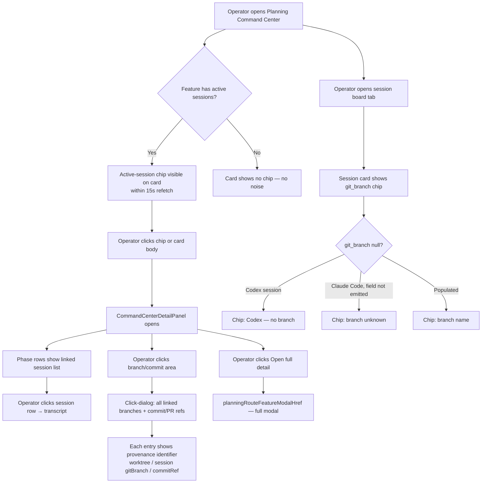

# Feature Brief & Metadata

**Feature Name:**

> Branch-Aware Planning Intelligence — Phase 1 (display-from-existing-data)

**Filepath Name:**

> `branch-aware-planning-intelligence-v1`

**Date:**

> 2026-06-04

**Author:**

> Claude Sonnet 4.6 (PRD Writer)

**Related Documents:**

> - Feasibility brief: `docs/project_plans/exploration/branch-aware-planning-intelligence/branch-aware-planning-intelligence-feasibility-brief.md`
> - Exploration charter: `docs/project_plans/exploration/branch-aware-planning-intelligence/branch-aware-planning-intelligence-charter.md`
> - Tech findings: `docs/project_plans/exploration/branch-aware-planning-intelligence/spikes/tech-findings.md`
> - Risk findings: `docs/project_plans/exploration/branch-aware-planning-intelligence/spikes/risk-findings.md`
> - UX value findings: `docs/project_plans/exploration/branch-aware-planning-intelligence/spikes/ux-value-findings.md`
> - ADR-006: `docs/project_plans/adrs/adr-006-db-authoritative-project-registry.md`
> - ADR-007: `docs/project_plans/adrs/adr-007-db-write-failure-surfacing-standard.md`
> - Phase surface architecture: `docs/guides/feature-surface-architecture.md`
> - Planning modal-first nav guide: `.claude/worknotes/ccdash-planning-reskin-v2-interaction-performance-addendum/feature-guide.md`

---

## 1. Executive Summary

Branch-aware planning intelligence surfaces git branch/commit provenance, live active-session chips, and per-phase session links directly on CCDash planning board items — using data already persisted to the database. Phase 1 closes the display gap entirely: operators can see which sessions are running, which branches they ran on, and which sessions contributed to each feature phase, without leaving the planning command center.

**Priority:** HIGH

**Key outcomes:**
- Operators see live active-session chips on `CommandCenterFeatureCard` within one 15s refetch cycle, eliminating the need to cross-reference the session board for "what is running now."
- `PlanningAgentSessionCardDTO` gains a `git_branch` chip so operators can identify which branch a session operated on directly from the planning session board.
- Clicking the branch/commit area on a feature card opens a dialog showing all linked branches and commit/PR refs with link-provenance identifiers (source: `document_refs`, coverage: 99.1% on feature-linked sessions).
- Per-phase session links in `CommandCenterDetailPanel` enable one-click transcript access from phase rows.
- Both planning hooks gain `refetchInterval: 15_000` so the board refreshes without manual navigation.
- A small "Open full detail" button in `CommandCenterDetailPanel` links to `planningRouteFeatureModalHref` as a bridge affordance pending full consolidation.

---

## 2. Context & Background

### Current state

The CCDash planning command center (`PlanningCommandCenter` → `CommandCenterFeatureCard` / `CommandCenterDetailPanel`) already shows a branch row and commit SHA chip per feature card, but both fields fall back to "branch TBD" / "commit TBD" unless an explicit worktree context has been registered via the planning launch flow. The planning session board (`PlanningAgentSessionBoard`) renders session cards with correlation, token, and lineage data — but no `git_branch` field. Neither planning surface has a `refetchInterval`: they are static until the user navigates away and back.

The data substrate is complete and already in production:
- `sessions.git_branch` is a direct DB column, populated by the Claude Code parser for every session that carries the field.
- `commitRefs`/`prRefs` are parsed from document frontmatter and stored in the `document_refs` table.
- `planning_worktree_contexts` holds operator-declared branch-per-feature context.
- `usePlanningCommandCenterQuery` and `usePlanningSessionBoardQuery` both accept `refetchInterval` — no callers pass it.

The gap is entirely in DTO surface exposure and polling configuration, not in data collection.

### Problem space

Operators running multi-worktree or multi-branch development workflows use the planning command center as their primary view of feature progress. They cannot answer "which sessions are running right now on this feature?" without switching to the session board. They cannot answer "which branch did this session run on?" without checking the ProjectBoard modal (7 tabs, not surfaced on planning cards). Per-phase session investigation requires a four-surface workflow: planning board → session board filter → session card → transcript.

### Current alternatives / workarounds

- **ProjectBoard feature modal**: carries full sessions, history, and commit tabs with branch/commit data. Operators must navigate away from the planning surface to use it.
- **PlanningAgentSessionBoard**: shows live session state but lacks branch provenance and has no per-phase grouping in the detail pane.
- **WorktreeGitStatePanel**: shows branch for features with registered worktree contexts; silent for all others.

### Architectural context

Phase 1 follows the existing CCDash transport-neutral pattern:
- **Agent queries layer** (`backend/application/services/agent_queries/`): extension point for new DTO fields on `PlanningCommandCenterItemDTO`, `PlanningAgentSessionCardDTO`, `FeatureSummaryItem`, and `PhaseContextItem`.
- **Repository layer** (`backend/db/repositories/`): additive index on `sessions(git_branch, project_id)` and an optional `phase_number` filter on `SqliteFeatureSessionRepository`. No new write paths; ADR-007 compliance cost is zero for Phase 1.
- **Frontend hooks** (`services/queries/planning.ts`): `refetchInterval` is already a supported parameter on both hooks; callers add it at their component level.
- **Migration runner** (`backend/db/sqlite_migrations.py`): additive `IF NOT EXISTS` index additions only.

---

## 3. Problem Statement

> "As an operator using the CCDash planning command center, when I look at a feature card or phase row, I see no indication of which sessions are currently running, which branches they ran on, or which sessions contributed to a given phase — so I must manually cross-reference three or four separate surfaces to answer a question that should be one click."

**Technical root cause:**
- `PlanningCommandCenterItemDTO` has no `activeSessions` field; the active-session data is available via existing session queries but not joined into the command center response.
- `PlanningAgentSessionCardDTO` (`backend/application/services/agent_queries/models.py`) has no `git_branch` field; the column is selected in `feature_sessions.py` but not passed through to the DTO.
- `FeatureSummaryItem` has no `commit_refs`/`pr_refs`; the data is in `features.data_json` but not included in planning query service summary items.
- `PhaseContextItem` has no `linked_sessions_by_phase`; the inverse phase→sessions query is not exposed.
- `usePlanningCommandCenterQuery` and `usePlanningSessionBoardQuery` callers never pass `refetchInterval`, leaving both surfaces static.

---

## 4. Goals & Success Metrics

### Primary goals

**Goal 1: Live active-session visibility on command center cards**
- Operators see a pulsing active-session chip on `CommandCenterFeatureCard` for any feature with one or more running sessions, without navigating to the session board.
- Success: chip appears within one 15s refetch cycle of a session transitioning to `running` state.

**Goal 2: Branch and commit provenance on planning items**
- Session cards on the planning session board display a `git_branch` chip; feature cards expose a click-dialog listing all linked branches and commit/PR refs with provenance identifiers.
- Success: branch chip renders on ≥99% of Claude Code session cards (matching the 99.1% feature-linked coverage confirmed by the 2026-06-04 audit); Codex sessions render a distinct "Codex — no branch" chip.

**Goal 3: Per-phase session links for one-click investigation**
- `CommandCenterDetailPanel` phase rows show linked sessions with transcript links.
- Success: clicking a session link in a phase row opens the correct transcript view without additional navigation.

**Goal 4: Live board updates**
- Both `usePlanningCommandCenterQuery` and `usePlanningSessionBoardQuery` poll at 15s, matching the `ProjectBoard` feature modal cadence.
- Success: board data refreshes within 15s of a session state change under the standard dev topology.

### Success metrics

| Metric | Baseline | Target | Measurement |
|--------|----------|--------|-------------|
| Clicks to answer "what is running on this feature?" | 4+ (navigate to session board, filter, find feature) | 1 (glance at command center card) | Manual workflow count |
| Clicks to reach a phase session transcript | 4+ (session board filter → feature → phase → transcript) | 1 (click session link in detail panel phase row) | Manual workflow count |
| Planning board data staleness | No polling (manually stale) | ≤15s under standard topology | Observed refetch interval |
| Branch chip coverage on planning session board | 0% (field absent from DTO) | ≥99% for Claude Code sessions; 100% Codex null-state display | DTO field presence + null-state rendering |

---

## 5. User Personas & Journeys

### Personas

**Primary persona: Multi-worktree operator**
- Role: Developer running 2–4 parallel Claude Code or Codex sessions across feature branches and worktrees.
- Needs: Real-time visibility into which features have active sessions, which branches those sessions are on, and quick access to transcripts without leaving the planning surface.
- Pain points: Must context-switch to ProjectBoard to see session/branch data; planning cards show "TBD" fallbacks for all branch fields without explicit worktree registration.

**Secondary persona: Feature-phase investigator**
- Role: Developer or operator reviewing completed or in-progress feature phases.
- Needs: Ability to jump from a phase row to the sessions that contributed to it.
- Pain points: Phase plan table shows agent/model/files but no session links; finding phase sessions requires manual session-board filtering.

### High-level flow

---

## 6. Requirements

### 6.1 Functional requirements

| ID | Requirement | Priority | Notes |
|----|-------------|----------|-------|
| FR-1 | `PlanningCommandCenterItemDTO` gains `activeSessions: list[AggregateWorkItemSession]`; backend query joins live sessions to command center items | Must | Pattern: `AggregateWorkItem.activeSessions` in multi-project path |
| FR-2 | `CommandCenterFeatureCard` renders active-session chip row (pulsing dot + agent name + "+N" overflow) when `activeSessions` is non-empty | Must | Template: `MultiProjectWorkItemCard.tsx` lines 97–123 |
| FR-3 | `PlanningAgentSessionCardDTO` gains `git_branch: str \| None` and `git_commit_hash: str \| None`; planning session board card renders a branch chip | Must | Null-safe; distinct display for Codex structural null vs Claude Code data-not-emitted null |
| FR-4 | `FeatureSummaryItem` gains `commit_refs: list[str]` and `pr_refs: list[str]` populated from `features.data_json` via planning query service | Must | Data already in `document_refs`; no new parsing required |
| FR-5 | Branch/commit area on `CommandCenterFeatureCard` opens a click-dialog listing all linked branches and commit/PR refs with link-provenance identifiers (worktree, session gitBranch, or commitRef source) | Must | Provenance identifier must be shown per entry so operators know the data source |
| FR-6 | `PhaseContextItem` gains `linked_sessions_by_phase: dict[int, list[SessionLink]]`; `CommandCenterDetailPanel` phase rows render a session list with transcript links | Must | Inverse phase→sessions query via existing `entity_links` table and `phase_hints` |
| FR-7 | `usePlanningCommandCenterQuery` callers pass `refetchInterval: 15_000` | Must | 1-line change at component call site; no hook API change required |
| FR-8 | `usePlanningSessionBoardQuery` (and `usePlanningFeatureSessionBoardQuery`) callers pass `refetchInterval: 15_000` | Must | Match ProjectBoard polling cadence |
| FR-9 | `CommandCenterDetailPanel` includes an "Open full detail" button that navigates to `planningRouteFeatureModalHref()` | Must | Bridge affordance; full consolidation is deferred |
| FR-10 | Additive DB index `sessions(git_branch, project_id)` added via `sqlite_migrations.py` with `IF NOT EXISTS` guard | Should | Performance: branch-keyed session queries at planning board load |
| FR-11 | `CommandCenterFeatureCard` branch row shows "No worktree registered" with a visible affordance prompting worktree registration when `planning_worktree_contexts` has no entry for the feature | Must | See AC-WORKTREE-EMPTY |

### 6.2 Non-functional requirements

**Performance:**
- Planning command center query response time must not increase by more than 50ms p95 after adding `activeSessions` join. Measure with existing backend profiling before and after.
- `WorktreeGitStateProbe` subprocess cost does not increase; probe is already capped at 0.8s per call with a 5s TTL cache.
- The 15s `refetchInterval` adds at most one additional backend hit per 15s per planning-page visitor; the `@memoized_query` 600s TTL means repeated hits within the cache window are served from memory.

**Live-update topology (non-negotiable documentation requirement, AC-SSE-TOPOLOGY):**
- Under the standard CCDash development topology (`npm run dev`, worker and API in the same process), live session chip updates are delivered within one 15s `refetchInterval` cycle.
- Under SQLite deployments where the worker and API run as separate processes, live-update delivery from the worker is not guaranteed. Session state changes made by the worker may not reach the API's in-memory SSE bus.
- Postgres deployments receive live updates across processes via `NOTIFY` fanout.

**Reliability:**
- All new optional backend fields (`activeSessions`, `git_branch`, `commit_refs`, `pr_refs`, `linked_sessions_by_phase`) must have explicit frontend fallback behavior. Missing = a contract state, not a bug.
- No Phase 1 story may use `session_forensics_json` workingDirectories/cwd data for branch inference, worktree matching, or any filterable query (AC-CWD-EXCLUSION; cwd is in a JSON blob, not a direct DB column — requires migration if needed).

**Observability:**
- New backend query methods in `agent_queries/` must include OpenTelemetry spans consistent with existing planning query instrumentation.
- Any new `sessions(git_branch)` index usage should be reflected in structured query logs.

---

## 7. Scope

### In scope (Phase 1, ~12 pts)

- **S-ACT (3 pts):** Active-session chips on `CommandCenterFeatureCard`. Backend: new `activeSessions` field on `PlanningCommandCenterItemDTO`. Frontend: chip row using `MultiProjectWorkItemCard.tsx` lines 97–123 as template. Includes transcript links from chips.
- **S1 (2 pts):** `git_branch` and `git_commit_hash` chips on planning session board cards. Backend: `PlanningAgentSessionCardDTO` field additions and `build_active_session_card` population. Frontend: chip below agent/model row. Requires null-safe display with two distinct null states (Codex structural null; Claude Code data-not-emitted null).
- **S3 (3 pts):** `commitRefs`/`prRefs` click-dialog on `CommandCenterFeatureCard`. Backend: `FeatureSummaryItem` field additions. Frontend: click-dialog showing all linked branches/commits with link-provenance identifiers. S3 is **unconditionally in Phase 1** (gitBranch coverage audit passed 2026-06-04: 99.1% on feature-linked sessions >> 30% threshold).
- **S4 (3 pts):** Per-phase session links in `CommandCenterDetailPanel`. Backend: optional `phase_number` filter on `SqliteFeatureSessionRepository`; `linked_sessions_by_phase` on `PhaseContextItem`. Frontend: session list section in detail panel phase rows with transcript links.
- **S5/S6 (1 pt):** `refetchInterval: 15_000` added to `usePlanningCommandCenterQuery` and `usePlanningSessionBoardQuery` call sites.
- **Bridge affordance (bundled with S4):** "Open full detail" button in `CommandCenterDetailPanel` routing to `planningRouteFeatureModalHref()`.
- **Empty-state display:** "No worktree registered" affordance on `CommandCenterFeatureCard` branch row when `planning_worktree_contexts` is empty for the feature.

### Out of scope

- **Phase 2 / multi-branch doc scanning**: multi-branch FileWatcher paths, `BranchWatcherRegistry`, S2 branch-signal correlation step in `session_correlation.py`. Gated on R-01 spike (in flight: `docs/project_plans/exploration/branch-aware-planning-intelligence/spikes/r01-branch-watcher/`).
- **cwd/workingDirectories-based inference**: `session_forensics_json` blob content is not queryable without a schema migration. No Phase 1 story may use cwd for branch or worktree inference.
- **Full CommandCenterDetailPanel → board modal consolidation**: deferred. The "Open full detail" button is the bridge affordance; the side pane is not replaced.
- **Postgres NOTIFY cross-process live update topology**: pre-existing capability, not new work. Document in NFR; no new engineering required.
- **Remote GitHub/GitLab API integration**: PR status from remote, remote branch enumeration.
- **Non-git VCS support.**
- **Top-level active branch chip in `PlanningTopBar`** (UX leg priority 4, lower value; deferred).

---

## 8. Dependencies & Assumptions

### Internal dependencies

- **PlanningAgentSessionBoard (shipped):** The session board with `PlanningAgentSessionCardDTO` is live and provides the DTO extension point for `git_branch`.
- **Planning Command Center (shipped):** `CommandCenterFeatureCard`, `CommandCenterDetailPanel`, `usePlanningCommandCenterQuery` are live. The `refetchInterval` parameter already exists on the hook.
- **entity_links table:** Phase 1 S4 depends on the existing `entity_links` table and `phase_hints` field on sessions for the inverse phase→sessions query. Both are confirmed present.
- **`document_refs` table:** S3 commit/PR refs are already stored in `document_refs` with `ref_kind='commit'|'pr'`. No new parsing required.
- **`planning_worktree_contexts` table:** Operator-declared branch-per-feature mapping. Phase 1 empty-state display requires reading this table (already queried in `PlanningCommandCenterQueryService`).
- **`MultiProjectWorkItemCard.tsx` active-session chip pattern (lines 97–123):** Direct template for S-ACT implementation. Must not be moved or refactored before S-ACT lands.
- **`planningRoutes.ts:planningRouteFeatureModalHref()`:** Already implemented; used in `PlanningAgentSessionBoard` card actions. Bridge affordance depends on this function.

### Assumptions

- `planning_worktree_contexts` is operator-populated; operators who do not use the planning control plane launch flow will see the "No worktree registered" empty state, not an error.
- The gitBranch coverage audit result (99.1% on feature-linked sessions, 2026-06-04) is representative of the production dataset. S3 proceeds unconditionally on this basis.
- Codex sessions will always have `git_branch = NULL` (hardcoded in `backend/parsers/platforms/codex/parser.py` line 1244). This is a structural constraint, not a data-quality issue, and requires a dedicated display state.
- Phase 1 write paths are all read-only queries or additive index-only migrations; no ADR-007 `retry_on_locked` cost applies.
- `WorktreeGitStateProbe` subprocess cost is acceptable for Phase 1 (already capped at 0.8s/call, 5s TTL). Operator worktree count is assumed small (<10 per project).

### Feature flags

No new feature flags are introduced in Phase 1. All stories are additive display changes. `CCDASH_PLANNING_CONTROL_PLANE_ENABLED` (existing) continues to gate the planning control plane launch flow that populates `planning_worktree_contexts`.

---

## 9. Risks & Mitigations

| Risk | Impact | Likelihood | Mitigation |
|------|--------|------------|------------|
| R-01: Multi-branch FileWatcher binding — `FileWatcher` has no multi-branch path support; BranchWatcherRegistry design is unresolved | High (for Phase 2) | High | Phase 1 is unaffected — all data is read from existing DB columns; no new watcher paths. Phase 2 is gated on R-01 spike in flight. |
| R-02: gitBranch null fraction — Codex sessions hardcode NULL (788 sessions, 0% coverage); older Claude Code versions may not emit the field | Medium | High | All branch-display UI is null-safe. Two distinct null states are required (see AC-NULLBRANCH-1, AC-NULLBRANCH-2). S3 proceeds unconditionally on 99.1% feature-linked coverage audit pass. |
| R-05: Query-cache staleness — `@memoized_query` 600s backend TTL; new fields without branch context in cache key may serve stale data up to 600s | Low | Medium | Existing 30s frontend `staleTime` + 15s `refetchInterval` means effective staleness ≤15s for most cases. Branch-aware fields are additive; cache key strategy is a Phase 2 concern. |
| R-07: SSE in-process only under SQLite — live-update delivery not guaranteed in multi-process SQLite deployments | Low | Low (non-standard topology) | Document deployment topology in NFR (AC-SSE-TOPOLOGY). No new engineering required; pre-existing constraint. |
| R-08: WorktreeGitStateProbe subprocess cost — N active worktrees × 15s refetch accumulates subprocess calls | Medium | Medium (large worktree counts) | Probe is already capped. Monitor subprocess count in production. Rate-limit if needed. |
| R-09: cwd not a direct DB column — `session_forensics_json` blob is not filterable | Medium | High if cwd inference is attempted | AC-CWD-EXCLUSION enforced at AC level. No Phase 1 story may use cwd without a migration task. |
| R-10: `planning_worktree_contexts` operator-gated — operators not using launch flow see empty branch state | Medium | High | "No worktree registered" empty state with call-to-action (AC-WORKTREE-EMPTY) replaces "branch TBD" fallback. |

---

## 10. Target state (post-implementation)

**User experience:**
- The `CommandCenterFeatureCard` shows a pulsing active-session chip for any feature with running sessions, without the operator needing to navigate away. The chip shows agent name and "+N" overflow for multiple sessions, with transcript links.
- Clicking the branch/commit area opens a dialog showing all linked branches and commit/PR refs, each labeled with its provenance (worktree mapping, session gitBranch, or frontmatter commitRef).
- Empty-state branch rows show "No worktree registered" with a registration prompt rather than "branch TBD", making the operator action clear.
- `CommandCenterDetailPanel` phase rows list the sessions that contributed to each phase, with direct transcript links.
- The "Open full detail" button is always visible in the detail panel, routing to the full ProjectBoard-style feature modal for operators who need the complete session/history/commit view.
- Planning session board cards display a branch chip per session, with two distinct null states for Codex sessions and Claude Code sessions where the field was not emitted.
- Both planning surfaces refresh automatically every 15s, matching the existing ProjectBoard cadence.

**Technical architecture:**
- `PlanningCommandCenterItemDTO.activeSessions` is populated by a join in `PlanningCommandCenterQueryService` using the same pattern as `AggregateWorkItem.activeSessions` in the multi-project path.
- `PlanningAgentSessionCardDTO.git_branch` is populated from `session.get("git_branch")` in `planning_sessions.py:build_active_session_card`.
- `FeatureSummaryItem.commit_refs` and `pr_refs` are read from `feature.commitRefs` / `feature.prRefs` in `planning.py:_build_summary_from_data`.
- `PhaseContextItem.linked_sessions_by_phase` is populated via an optional `phase_number` filter on `SqliteFeatureSessionRepository`, matching sessions by `phase_hints`.
- An additive DB index `sessions(git_branch, project_id)` supports branch-keyed session queries.
- Frontend hooks `usePlanningCommandCenterQuery` and `usePlanningSessionBoardQuery` receive `refetchInterval={15_000}` at their call sites.

**Observable outcomes:**
- Zero "branch TBD" fallbacks for features with operator-registered worktrees.
- Active-session chip visible within 15s of session start under standard topology.
- Per-phase session links reduce investigation workflow from 4+ steps to 1 click.

---

## 11. Acceptance criteria (definition of done)

### AC-NULLBRANCH-1: Codex structural null-branch display

When a session's `git_branch` is `NULL` because the session was produced by the Codex platform (identifiable via the session's `platform` or `source` field, which `parser.py` sets to `codex`):

#### AC-NULLBRANCH-1: Codex session branch chip
- target_surfaces:
    - components/Planning/PlanningAgentSessionBoard.tsx
    - components/Planning/CommandCenter/CommandCenterFeatureCard.tsx
- propagation_contract: >
    `PlanningAgentSessionCardDTO.git_branch` is `null` and `PlanningAgentSessionCardDTO.platform` is `"codex"` (or equivalent source discriminator). Each target surface reads both fields to determine the chip label.
- resilience: >
    If `platform` field is absent but `git_branch` is null, fall back to AC-NULLBRANCH-2 (generic "branch unknown"). Do not crash or hide the session card.
- visual_evidence_required: branch chip renders with "Codex — no branch" label (or approved equivalent) at desktop width ≥1280px
- verified_by:
    - verify-nullbranch-codex

The branch chip must display "Codex — no branch" (or approved equivalent wording) and must NOT display the generic null indicator used for Claude Code sessions where the field was not emitted. This state is structural (788 affected sessions in production) and must be determinable from the session's platform/source field, not solely from the null `git_branch` value.

---

### AC-NULLBRANCH-2: Claude Code data-not-emitted null-branch display

When a session's `git_branch` is `NULL` because the Claude Code version that produced the session did not emit the `gitBranch` field:

#### AC-NULLBRANCH-2: Claude Code null branch chip
- target_surfaces:
    - components/Planning/PlanningAgentSessionBoard.tsx
    - components/Planning/CommandCenter/CommandCenterFeatureCard.tsx
- propagation_contract: >
    `PlanningAgentSessionCardDTO.git_branch` is `null` and `platform` is not `"codex"`. Target surfaces render the generic null-branch indicator.
- resilience: >
    Render "branch unknown" indicator. Session card remains fully visible and usable. All other session fields (agent, model, tokens, correlation) render normally.
- visual_evidence_required: chip renders with "branch unknown" label (or approved equivalent) at desktop width ≥1280px, distinct from AC-NULLBRANCH-1 chip
- verified_by:
    - verify-nullbranch-claudecode

The branch chip must display a generic "branch unknown" indicator. Session display is not blocked; the null state is rendered gracefully.

---

### AC-WORKTREE-EMPTY: Planning worktree contexts empty-state display

When `planning_worktree_contexts` contains no entries for the current feature (operator has not used the planning control plane launch flow):

#### AC-WORKTREE-EMPTY: Feature card branch empty state
- target_surfaces:
    - components/Planning/CommandCenter/CommandCenterFeatureCard.tsx
- propagation_contract: >
    `PlanningCommandCenterItemDTO.worktree` is `null` or absent. The card branch row reads this field and renders the empty state when it is null.
- resilience: >
    Render "No worktree registered" text with a visible affordance (link or button) directing the operator to register a worktree via the planning launch flow. Do NOT render "branch TBD". Do NOT render an error state.
- visual_evidence_required: empty-state renders at desktop ≥1280px with both the label and affordance visible
- verified_by:
    - verify-worktree-empty-state

Two distinct sub-states must also be handled and tested:
1. `planning_worktree_contexts` has no entry for this feature: render "No worktree registered" + registration prompt.
2. `planning_worktree_contexts` has an entry but `branch` is not yet resolved (e.g., probe returned null): render "Worktree registered — branch resolving" (or equivalent), not the registration prompt.

---

### AC-SSE-TOPOLOGY: Live-update deployment topology documentation and behavior

**Non-functional requirement — must appear in code comments and operator-facing documentation:**

Live session chip updates (S-ACT, S5/S6) behave as follows by deployment topology:

| Topology | Live-update behavior |
|----------|---------------------|
| Standard dev (`npm run dev`, worker + API share one process) | Updates delivered within one 15s `refetchInterval` cycle. SSE invalidation from worker reaches the API's in-memory bus directly. |
| SQLite, worker + API as separate processes | Live-update delivery from the worker is **not guaranteed**. Session state changes written by the worker may not reach the API's in-memory SSE bus. The 15s `refetchInterval` still fires on the frontend but hits a stale cache until the API's own sync cycle runs. |
| Postgres | Live updates delivered across processes via `NOTIFY` fanout. |

This topology constraint is a pre-existing architectural property, not a new limitation introduced by Phase 1. It must be documented in the code comment at the relevant hook call sites and in the operator guide.

---

### AC-CWD-EXCLUSION: No cwd/workingDirectories inference in Phase 1

No Phase 1 story, task, or implementation may use `session_forensics_json` `workingDirectories` or `cwd` data for:
- Branch inference
- Worktree matching
- Any filterable or indexable query

If cwd-based inference is needed in a future story, a schema migration task (extracting `cwd` as a direct DB column) must be added to that story's scope before the story is accepted. This AC is tested by code review gate: any PR touching `session_forensics_json` parsing for branch/worktree purposes must be rejected without a corresponding migration task.

---

### AC-ACTIVE-SESSION-CHIP: S-ACT active-session chip on CommandCenterFeatureCard

#### AC-ACTIVE-SESSION-CHIP: Active session chip rendering
- target_surfaces:
    - components/Planning/CommandCenter/CommandCenterFeatureCard.tsx
- propagation_contract: >
    `PlanningCommandCenterItemDTO.activeSessions` (new field, `list[AggregateWorkItemSession]`) is populated by the backend query and received by the card component. The component renders the chip row when `activeSessions` is non-empty. Transcript links are derived from `activeSessions[i].session_id`.
- resilience: >
    When `activeSessions` is absent or null (backend has not yet shipped the field), the chip row is not rendered. The card remains fully functional. No error is thrown. This fallback must be covered by a unit test.
- visual_evidence_required: pulsing green dot + agent name + "+N" overflow chip visible at desktop ≥1280px with at least one active session present
- verified_by:
    - verify-active-session-chip
    - smoke-planning-command-center

Chip template follows `MultiProjectWorkItemCard.tsx` lines 97–123. Transcript link from chip navigates to `#/sessions/{session_id}`.

---

### AC-BRANCH-DIALOG: S3 commitRefs/prRefs click-dialog

#### AC-BRANCH-DIALOG: Branch and commit provenance dialog
- target_surfaces:
    - components/Planning/CommandCenter/CommandCenterFeatureCard.tsx
- propagation_contract: >
    `FeatureSummaryItem.commit_refs` and `pr_refs` (new fields) are populated from `features.data_json` by `planning.py:_build_summary_from_data` and delivered to the card component. Clicking the branch/commit area triggers the dialog. Each entry in the dialog shows a link-provenance identifier (one of: `worktree`, `session-git-branch`, `commit-ref`, `pr-ref`) so the operator knows the data source.
- resilience: >
    When `commit_refs` and `pr_refs` are both absent or empty, the click-dialog trigger is either hidden or disabled with a tooltip "No branch or commit data linked." The branch row remains visible showing the worktree branch if available.
- visual_evidence_required: dialog opens on click and shows at least one entry with a visible provenance label at desktop ≥1280px
- verified_by:
    - verify-branch-dialog
    - smoke-planning-command-center

---

### AC-PHASE-SESSION-LINKS: S4 per-phase session links in CommandCenterDetailPanel

#### AC-PHASE-SESSION-LINKS: Phase rows show linked sessions
- target_surfaces:
    - components/Planning/CommandCenter/CommandCenterDetailPanel.tsx
- propagation_contract: >
    `PhaseContextItem.linked_sessions_by_phase` (new field, `dict[int, list[SessionLink]]`) is populated via inverse phase→sessions query using `entity_links` and `phase_hints`. The detail panel renders a session list section below each phase row when the phase has linked sessions.
- resilience: >
    When `linked_sessions_by_phase` is absent or the phase key is missing, the phase row renders without a session section. No error state. A "No sessions linked to this phase" placeholder may be shown if the panel already renders a session section container.
- visual_evidence_required: at least one phase row with a session list visible at desktop ≥1280px; each session entry has a clickable transcript link
- verified_by:
    - verify-phase-session-links
    - smoke-planning-detail-panel

Transcript link from session row navigates to `#/sessions/{session_id}`. Agent name and session start time are shown per session entry.

---

### AC-REFETCH-INTERVAL: S5/S6 live polling on both planning hooks

Both `usePlanningCommandCenterQuery` and `usePlanningSessionBoardQuery` (including `usePlanningFeatureSessionBoardQuery`) must receive `refetchInterval={15_000}` at their call sites in their respective page/panel components. This is verified by:
1. Code inspection: call sites in `PlanningCommandCenter.tsx` and `PlanningAgentSessionBoard.tsx` pass the argument.
2. Browser DevTools observation: XHR/fetch calls to planning endpoints fire at ~15s intervals with the board open.
3. Unit test: `refetchInterval` prop is passed in the hook invocation under test.

---

### AC-OPEN-FULL-DETAIL: Bridge affordance button

`CommandCenterDetailPanel` includes an "Open full detail" button. Clicking it navigates to `planningRouteFeatureModalHref(featureId)` (from `services/planningRoutes.ts`). The button is always visible when the detail panel is open for a feature with a known `featureId`. The button renders correctly when `featureId` is null or undefined — either hidden or disabled with tooltip "Feature ID not available."

---

### General acceptance

- [ ] All five stories (S-ACT, S1, S3, S4, S5/S6) are implemented and pass the above ACs.
- [ ] All new optional backend fields have explicit frontend fallback behavior (resilience fields above).
- [ ] AC-CWD-EXCLUSION is enforced: no `session_forensics_json` cwd/workingDirectories access for branch or worktree inference.
- [ ] AC-SSE-TOPOLOGY is documented in hook call-site comments and operator notes.
- [ ] DB migration for `sessions(git_branch, project_id)` index ships with `IF NOT EXISTS` guard and does not alter existing columns.
- [ ] Runtime smoke check performed on the planning command center and session board before marking implementation complete (`CCDASH_PLANNING_CONTROL_PLANE_ENABLED=true`).

---

## 12. Assumptions & open questions

### Assumptions

- gitBranch coverage audit (2026-06-04, 99.1% on feature-linked sessions) is the gate for S3. S3 is unconditionally included in Phase 1 on the basis of this audit passing.
- Phase 1 write paths are additive index additions only; ADR-007 `retry_on_locked` compliance is not required for Phase 1 (no new write paths).
- `WorktreeGitStateProbe` subprocess overhead is acceptable at typical operator worktree counts (<10). No rate-limiting changes required for Phase 1.
- The `platform` or `source` field on session records is a reliable discriminator for Codex sessions (parser.py hardcodes `gitBranch=None` for Codex; the field is sufficient for AC-NULLBRANCH-1 differentiation).

### Open questions

- [ ] **OQ-1**: What exact wording should the "Codex — no branch" chip use? "Codex — no branch" is the PRD default; final copy subject to UX review.
  - **A**: TBD — UX review during implementation.
- [ ] **OQ-2**: Should the `activeSessions` count in the chip title be capped at a display maximum (e.g., "+N more" when N > 5)? The `MultiProjectWorkItemCard` pattern uses "+N" overflow.
  - **A**: Follow `MultiProjectWorkItemCard` pattern exactly (lines 97–123); cap at the same threshold.
- [ ] **OQ-3**: Should the branch/commit click-dialog be a popover (inline) or a modal dialog? Neither the feasibility brief nor the UX leg specifies the component type.
  - **A**: TBD — use a popover/tooltip-drawer consistent with existing planning card affordances. Implementation-time decision.
- [ ] **OQ-4**: Branch-name exclusion list and minimum-length threshold for the correlation pipeline (S2). Does not block Phase 1; blocks Phase 2.
  - **A**: Deferred to Phase 2. See deferred items below.

---

## 13. Deferred items

The following items are explicitly deferred from Phase 1 and must not be scheduled until their stated preconditions are met.

| Item | Blocked on | Phase target | Notes |
|------|-----------|--------------|-------|
| Phase 2: Multi-branch doc scanning | R-01 BranchWatcherRegistry spike (in flight: `docs/project_plans/exploration/branch-aware-planning-intelligence/spikes/r01-branch-watcher/`) | Phase 2 (~6 pts) | FileWatcher is single-path per project_id; BranchWatcherRegistry design must complete before any Phase 2 implementation begins. ADR-006 registry semantics must not be violated. |
| S2: Branch-signal correlation step in `session_correlation.py` | R-01 spike + branch-name exclusion list/threshold spec (OQ-4) | Phase 2 | Matching `git_branch` tokens against feature slugs; FP rate on generic branch names (main, dev) is uncharacterized. |
| S3 (if audit had failed): commitRefs/prRefs dialog | gitBranch coverage audit | N/A — audit passed | S3 is in Phase 1. This entry is retained for audit trail only. |
| Full `CommandCenterDetailPanel` → board modal consolidation | Phase 2 or later; triggered by maintenance cost threshold | Post-Phase 2 | `MultiProjectDetailRail` already acknowledges this debt ("Future: full modal replacement"). The "Open full detail" bridge button is the Phase 1 interim affordance. |
| Postgres NOTIFY cross-process live update guidance | No new engineering required | Operator docs | Document topology in operator guide alongside AC-SSE-TOPOLOGY. May ship as a docs-only task in Phase 1 doc finalization. |
| Top-level active branch chip in `PlanningTopBar` | No blocker — low-value affordance | Post-Phase 1 | UX leg priority 4, confidence 0.65. Deferred in favor of higher-value affordances. |
| Cache key strategy for branch-aware queries | Phase 2 architecture decision | Phase 2 | Current 30s `staleTime` + 15s `refetchInterval` is sufficient for Phase 1. |

---

## 14. Appendices & references

### Related documentation

- **ADR-006** (DB-authoritative project registry): `docs/project_plans/adrs/adr-006-db-authoritative-project-registry.md`
- **ADR-007** (DB write failure surfacing standard): `docs/project_plans/adrs/adr-007-db-write-failure-surfacing-standard.md`
- **Feature surface architecture** (cache tiers, polling): `docs/guides/feature-surface-architecture.md`
- **Planning modal-first navigation**: `.claude/worknotes/ccdash-planning-reskin-v2-interaction-performance-addendum/feature-guide.md`
- **Feasibility brief** (verdict, story list, audit): `docs/project_plans/exploration/branch-aware-planning-intelligence/branch-aware-planning-intelligence-feasibility-brief.md`
- **Tech findings** (integration points, DTO gaps, estimates): `docs/project_plans/exploration/branch-aware-planning-intelligence/spikes/tech-findings.md`
- **Risk findings** (R-01..R-10 register): `docs/project_plans/exploration/branch-aware-planning-intelligence/spikes/risk-findings.md`
- **UX value findings** (priority order, UX shapes, consolidation): `docs/project_plans/exploration/branch-aware-planning-intelligence/spikes/ux-value-findings.md`
- **R-01 BranchWatcherRegistry spike** (gates Phase 2): `docs/project_plans/exploration/branch-aware-planning-intelligence/spikes/r01-branch-watcher/`

### Key files

| Concern | File |
|---------|------|
| Session DTO extension point | `backend/application/services/agent_queries/models.py` |
| Planning session query service | `backend/application/services/agent_queries/planning_sessions.py` |
| Planning command center query service | `backend/application/services/agent_queries/planning_command_center.py` |
| Planning query service (FeatureSummaryItem, PhaseContextItem) | `backend/application/services/agent_queries/planning.py` |
| Feature session repository (phase filter) | `backend/db/repositories/feature_sessions.py` |
| DB index migration | `backend/db/sqlite_migrations.py` |
| Frontend planning hooks | `services/queries/planning.ts` |
| CommandCenterFeatureCard | `components/Planning/CommandCenter/CommandCenterFeatureCard.tsx` |
| CommandCenterDetailPanel | `components/Planning/CommandCenter/CommandCenterDetailPanel.tsx` |
| PlanningAgentSessionBoard | `components/Planning/PlanningAgentSessionBoard.tsx` |
| Active-session chip template | `components/MultiProject/MultiProjectWorkItemCard.tsx` (lines 97–123) |
| planningRouteFeatureModalHref | `services/planningRoutes.ts` |
| Frontend type definitions | `types.ts` |

---

**Progress tracking:**

See progress tracking: `.claude/progress/branch-aware-planning-intelligence/`
