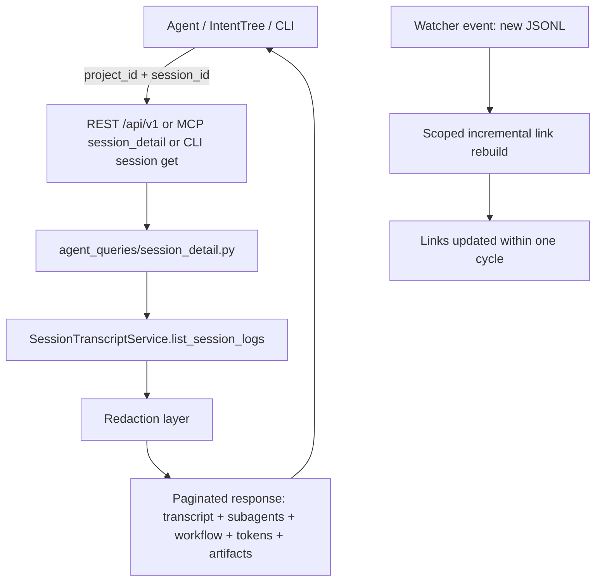

# Feature Brief & Metadata

**Feature Name:** CCDash Core Remediation v1

**Filepath Name:** `ccdash-core-remediation-v1`

**Date:** 2026-06-10

**Author:** Nick Miethe (Opus)

**Related Documents:**
- `docs/project_plans/reports/investigations/ccdash-core-remediation-diagnostic-v1.md` — full diagnostic evidence, 9 verified findings, two investigative workflows

---

## 1. Executive Summary

CCDash was architected for a single active project and is now being operated as a multi-project, multi-consumer platform including external API consumers (IntentTree) and agent toolchains (MCP, CLI). This program remediates four root-cause themes identified in the diagnostic report: cross-project session correctness gaps, missing transcript/subagent/workflow detail on external surfaces, live link freshness latency, and model/pricing detection failures. The top deliverable is a fully wired, redaction-guarded transcript service enabling any agent or external consumer to retrieve complete session detail — including transcript, subagents, and workflow content — for any project, via MCP, CLI, or REST.

**Priority:** HIGH

**Key Outcomes:**
- Outcome 1: Any session in any project is fully retrievable (transcript + subagent + workflow) via MCP/CLI/REST without active-project switching.
- Outcome 2: Live link freshness is restored; new subagent JSONL activity is linked within one watcher cycle with no restart.
- Outcome 3: Novel or unknown model IDs are flagged as unpriced rather than silently mispriced at Sonnet rates.
- Outcome 4: CCDash is Postgres- and container-ready, unblocking enterprise and multi-tenant deployments.

---

## 2. Context & Background

### Current state

CCDash's data layer, sync engine, and API routers were designed for a single active project. Project_id scoping is absent from `get_by_id` / `get_many_by_ids` in both SQLite and Postgres session repositories. The `/api/v1 get_session_detail_v1` endpoint returns analytics facts only (see `models.py:961`) — no transcript. `SessionTranscriptService.list_session_logs` already exists and is transport-neutral, but is not exposed via REST, MCP, or standalone CLI. Cross-project watchers survive active-project switches, but there is no periodic reconcile or self-heal mechanism. The sync coalescing guard is absent under Postgres/durable-queue backends. Model detection relies on bare-slug matching; Fable sessions are silently mispriced at Sonnet rates.

### Problem space

The single-active-project optimization creates four observable failure classes:

1. **Cross-project correctness**: Session reads can return rows from the wrong project; session family derivation loses project_id; drilldown queries are active-project-bound.
2. **Session detail inaccessibility**: No path from MCP, CLI, or REST for external consumers to retrieve transcript or subagent content for sessions in non-active projects.
3. **Live link staleness**: The incremental link rebuild feature exists but defaults off; links trail watcher events requiring manual restart.
4. **Detection and pricing gaps**: Unknown model families default to Sonnet pricing; workflow.json sidecars are parsed but not joined to session records; subagent attribution is fragile under null sidecars.

Full evidence and verdicts are in the diagnostic report referenced in frontmatter. This PRD does not restate that evidence.

### Architectural context

CCDash follows a layered architecture: routers call services/repositories; repositories own all DB I/O; a transport-neutral agent-query layer (`backend/application/services/agent_queries/`) is shared by REST, MCP, and CLI. All new session-detail intelligence must originate in this layer and be wired to all three transports per the transport-neutral pattern in `CLAUDE.md`.

---

## 3. Problem Statement

> "As an operator running multiple projects, when I request full session detail (transcript, subagents, workflow) from MCP or the CLI, I receive analytics-only stubs and cannot inspect non-active project sessions without restarting the server and switching the active project."

> "As an external API consumer (IntentTree), when I call `/api/v1` for any project, I cannot obtain transcript content or session family trees, and the API has no stable OpenAPI contract or CORS configuration for LAN use."

**Technical root causes (verified):**
- `get_by_id` / `get_many_by_ids` in `backend/db/repositories/sessions.py` (lines 206, 215) and `backend/db/repositories/postgres/sessions.py` (lines 142, 148) omit `project_id` from WHERE clauses despite the composite PK.
- `get_session_family_v1` in `_client_v1_sessions.py:269` is active-project-bound.
- `SessionTranscriptService.list_session_logs` exists (`application/services/sessions.py:92`) but has no REST/MCP/CLI exposure.
- `CCDASH_INCREMENTAL_LINK_REBUILD_ENABLED` defaults to `False`; scoped rebuild is unproven on the hot path.
- `_estimate_cost` defaults unknown slugs to Sonnet pricing; Fable is absent from the pricing catalog.
- No coalescing guard at sync dispatch under `JOB_QUEUE_BACKEND != memory`.

---

## 4. Goals & Success Metrics

### Primary goals

**Goal 1: Full session detail accessible from all surfaces for any project**
- Any agent can call MCP `session_detail`, CLI `session get`, or REST `GET /api/v1/sessions/{id}/detail` with any `project_id` and receive transcript, subagent list, workflow linkage, token telemetry, and artifact references.
- Redaction layer runs on all tool-call payloads before egress.

**Goal 2: Cross-project data correctness**
- Session reads never return rows from a different project.
- Session family derivation propagates project_id end-to-end.

**Goal 3: Live link freshness**
- New subagent JSONL activity is linked within one watcher cycle; no server restart required.

**Goal 4: Accurate model detection and pricing**
- Novel `claude-<family>` IDs are flagged as unpriced, not silently billed at Sonnet rates.
- Fable sessions show correct (or explicitly unpriced) cost.
- Workflow.json sidecar data joins to session records for 1M-context attribution.

**Goal 5: Postgres parity and container readiness**
- All new columns present in both SQLite and Postgres DDL.
- `docker compose up` smoke passes with `api + worker + postgres`.
- Sync coalescing guard prevents duplicate full-scans under durable queue backend.

**Goal 6: External API contract (IntentTree)**
- `/api/v1` has checked-in OpenAPI spec; LAN CORS and bind config documented; capability advertisement endpoint live.

### Success metrics

| Metric | Baseline | Target | Measurement |
|--------|----------|--------|-------------|
| MCP `session_detail` returns transcript for non-active project | Not supported | 100% of calls with valid project_id | MCP parity test |
| Cross-project row leak in session reads | Present (unguarded) | Zero (collision test: 2 projects, shared IDs) | ADR-007 collision test |
| Link freshness: new subagent JSONL → linked | Requires restart | ≤ 1 watcher cycle (~30 s) | Integration test |
| Novel model ID pricing | Silent Sonnet default | Flagged `unpriced` | Regression fixture |
| Duplicate full-sync under Postgres | Unguarded | Zero per project/trigger | Coalescing unit test |
| compose e2e smoke | No container support | Green on `api + worker + postgres` | CI/manual smoke |
| OpenAPI spec committed | None | Committed and contract-pinned | PR gate |

---

## 5. User Personas & Journeys

### Personas

**Primary — Operator / power user (Nick)**
- Runs 4+ active projects simultaneously.
- Uses MCP tools from within Claude Code to inspect session detail, debug agent failures, and correlate workflow runs.
- Pain: Cannot retrieve transcript from non-active project sessions; model costs are wrong for Fable/unknown models.

**Secondary — External API consumer (IntentTree agent)**
- Calls `/api/v1` from a separate process on LAN.
- Needs stable schema, CORS, and ability to list/search/detail sessions by project_id.
- Pain: No OpenAPI contract; detail endpoint returns analytics-only stubs.

### High-level flow



---

## 6. Requirements

### 6.1 Functional requirements

| ID | Requirement | Priority | Notes |
|:--:|-------------|:--------:|-------|
| FR-1 | `get_by_id` and `get_many_by_ids` must accept and enforce `project_id` in WHERE clauses (SQLite + Postgres) | Must | Phase 0; blocks all cross-project reads |
| FR-2 | `get_session_family_v1` must be project-scoped; family anchor must propagate `project_id` | Must | Phase 0 |
| FR-3 | New `agent_queries/session_detail.py` service exposing transcript, subagents, tokens, artifacts, links via include-flags and cursor pagination | Must | Phase 1; reuses `SessionTranscriptService`, no new retrieval engine |
| FR-4 | Redaction layer on all tool-call payloads before egress; configurable via env; pattern-based + tool-name-aware field redaction | Must | Phase 1; local-trust scope |
| FR-5 | `/api/v1` detail + transcript endpoints with cross-project `project_id` param; response models in contracts package | Must | Phase 2 |
| FR-6 | MCP tools: `session_search`, `session_detail`, `session_transcript`; chunk/pagination budget defined; standalone CLI `session` command group; REST/MCP/CLI parity test | Must | Phase 3 |
| FR-7 | SKILL.md update for MCP session tools | Must | Phase 3 |
| FR-8 | `CCDASH_INCREMENTAL_LINK_REBUILD_ENABLED` default `True`; scoped rebuild proven on hot path; no global fingerprint scan on watcher event | Must | Phase 4 |
| FR-9 | `workflow.json` sidecar parser with `runId`/`taskId` join (±1 min window); workflow + subagent linkage hardening; skill attribution | Must | Phase 5 |
| FR-10 | New detection columns (`workflow_id`, `subagent_parent_id`, `skill_name`, etc.) in dual DDL (SQLite + Postgres) with `COLUMN_PARITY_DRIFT_ALLOWLIST` update | Must | Phase 5 |
| FR-11 | Frontend fallbacks for all new optional backend fields (Phase 5 columns, Phase 6 unpriced state) | Must | Phases 5 and 6; resilience-by-default |
| FR-12 | `_estimate_cost` flags unknown model slug as `unpriced`; Fable added to pricing catalog; pricing regression fixture | Must | Phase 6 |
| FR-13 | Frontend unpriced state indicator | Should | Phase 6 |
| FR-14 | Sync coalescing guard keyed by `project_id` at dispatch level (in-proc + durable queue) | Must | Phase 7 |
| FR-15 | Recent-first session parse with configurable window and lazy backfill | Should | Phase 7 |
| FR-16 | Startup sync boot-cost reduction under `--reload` | Should | Phase 7 |
| FR-17 | Periodic all-projects reconcile; watcher liveness self-heal; non-active project writeback stays off | Should | Phase 8 |
| FR-18 | All new columns validated on Postgres; compose e2e smoke (api + worker + postgres); durable coalescing queue; `/readyz` endpoint | Must | Phase 9 |
| FR-19 | `/api/v1` as external contract with checked-in OpenAPI; CORS/bind config for LAN; capability advertisement; example client | Must | Phase 10 |
| FR-20 | Launch-time capture wrapper recording launcher profile (ica-delegate), effort tier, model variant sidecar; parser ingestion; first-class fields + FE fallbacks | Should | Phase 11 (fast-follow) |
| FR-21 | CHANGELOG `[Unreleased]` entry; `feature-surface-architecture.md` update; `CLAUDE.md` conventions for new patterns; observability freshness probes; `analytics.py:553` double-count check | Must | Phase 12 |

### 6.2 Non-functional requirements

**Performance:**
- New subagent JSONL → linked within one watcher cycle (no restart).
- No global fingerprint scan on the watcher hot path after Phase 4.
- Recent sessions queryable within seconds of startup (recent-first window, Phase 7).
- Sync dispatch emits zero duplicate full-scans per project per trigger under Postgres.

**Security / egress:**
- Redaction layer is a hard Phase 1 deliverable; Phase 2 and 3 endpoints may not ship without it.
- Local-trust model: redaction on all surfaces (REST + MCP + repo-CLI); secret/PII patterns configurable via env.
- Cross-project reads must never return rows from a different project (zero-leak contract, Phase 0).
- Auth for cross-host LAN `/api/v1`: bearer token or none-on-LAN under local-trust (OQ-6 to resolve in Phase 10).

**Reliability:**
- Every new DB write path uses `retry_on_locked` (ADR-007) with direct-count assertion test.
- Every new SQLite connection issues `PRAGMA busy_timeout = 30000`.
- Watcher self-heals on crash within one reconcile interval (Phase 8).

**Observability:**
- OpenTelemetry spans for new service methods and endpoints.
- Structured logs for redaction events (redacted field count, no payload contents).
- Freshness probes for watcher liveness added in Phase 12.

**Postgres parity:**
- All new columns added via dual DDL (SQLite migration + Postgres migration) in the same change set.
- `COLUMN_PARITY_DRIFT_ALLOWLIST` updated at the time of each column addition, not post-hoc.
- Phase 9 Bash-enabled PG seam review is a mandatory exit gate (not edit-less; memory note: edit-less reviewer missed 3 PG-only bugs).

**Runtime smoke gate:**
- UI-touching phases (3, 5, 6, 11) require dev server up + browser smoke against each `target_surfaces` entry before `status: completed`.

---

## 7. Scope

### In scope

- Cross-project session repository correctness (project_id enforcement, family derivation)
- Transport-neutral `session_detail` service with transcript, subagent, workflow, tokens, artifact content and cursor pagination
- Redaction layer (secret/PII patterns + tool-name-aware field redaction, env-configurable)
- REST v1, MCP, and repo-CLI / standalone CLI exposure of session detail
- MCP/CLI/REST parity test
- Live link freshness: scoped incremental link rebuild defaulted on
- Workflow.json sidecar parser + runId/taskId join + subagent/skill linkage hardening
- Model detection columns (dual DDL + parity) + FE fallbacks
- Pricing correctness: unknown slug → `unpriced`; Fable in catalog
- Sync coalescing guard (in-proc + durable queue) + recent-first parse
- Cross-project watcher hardening: periodic reconcile + liveness self-heal
- Postgres parity for all new DDL; container compose e2e smoke
- External API contract: OpenAPI checked in, CORS/bind, capability advertisement (IntentTree target)
- Launch-time profile/effort capture sidecar (Phase 11 fast-follow)
- Documentation finalization, CHANGELOG, observability probes, karen end-of-feature pass

### Out of scope

- **Token undercount fix**: Already shipped 2026-03-09. Residual: one analytics display check folded into Phase 12 only.
- **ICA-delegate profile / Ultracode / effort log-parsing**: Data absent in current logs. Addressed only via Phase 11 launch-time capture sidecar (new mechanism), not retrospective log mining.
- **User authentication / multi-tenancy**: Local-trust model applies; no RBAC or user accounts in this program.
- **UI redesign or dashboard reskin**: Incremental FE changes only (unpriced state indicator, FE fallbacks, runtime smoke checks).
- **Token budget optimization / inference cost reduction**: Not a deliverable of this program.

---

## 8. Dependencies & Assumptions

### Internal dependencies

- **ADR-006** (`db-authoritative-project-registry`): Registry is DB-authoritative; `projects.json` is import-seed/export-only. All new cross-project reads go through DB, not file-backed ProjectManager.
- **ADR-007** (`db-write-failure-surfacing-standard`): All new write paths must use `retry_on_locked` and ship direct-count assertion tests.
- **`SessionTranscriptService.list_session_logs`** (`application/services/sessions.py:92`): Exists and is transport-neutral. Phase 1 is exposure + wiring + redaction, not a new retrieval engine.
- **`CCDASH_INCREMENTAL_LINK_REBUILD_ENABLED`**: Exists but defaults off. Phase 4 proves scoped path, then flips default.
- **`COLUMN_PARITY_DRIFT_ALLOWLIST`**: Must be updated in the same change set as each new column addition.
- **Planning control plane feature flag** (`CCDASH_PLANNING_CONTROL_PLANE_ENABLED`): Not modified by this program; no dependency.

### External dependencies

- Docker / Docker Compose: Phase 9 container smoke.
- Postgres 15+: Phase 9 PG parity validation.
- IntentTree agent: Consumer of Phase 10 external API; no build dependency, but example client required.

### Assumptions

- The diagnostic report (`ccdash-core-remediation-diagnostic-v1.md`) is authoritative for root-cause findings; no re-investigation required.
- `SessionTranscriptService` returns complete transcript content for all JSONL-backed sessions; no data-absence gap on transcript side.
- Local-trust model is accepted by the operator; no network-level auth is required for Phase 10 LAN deployment (OQ-6 to confirm bearer-vs-none).
- Phases are executed in wave order per the dependency map; Phase 0 must be green before Phase 2 or 3 ships.
- ICA-delegate / Ultracode logs are genuinely absent in pre-Phase 11 JSONL (verified in diagnostic); no silent data loss.

### Feature flags

- `CCDASH_INCREMENTAL_LINK_REBUILD_ENABLED`: Flipped to `True` default in Phase 4.
- `CCDASH_STARTUP_SYNC_LIGHT_MODE`: Referenced in CLAUDE.md; not modified by this program.
- `CCDASH_QUERY_CACHE_REFRESH_INTERVAL_SECONDS`: Not modified; coalescing guard is at dispatch level.

### Open questions (for implementation plan)

| ID | Question | Phase | Resolution path |
|:--:|----------|:-----:|----------------|
| OQ-1 | Redaction strategy: pattern-based secret scan vs allowlist field redaction vs layered? | 1 | Recommend layered: known patterns + tool-name-aware payload field redaction; configurable via env |
| OQ-2 | MCP transcript chunk size / max envelope bytes | 3 | Pick concrete default in Phase 3 design |
| OQ-3 | Recent-first window: N most-recent vs last-K-days vs mtime budget | 7 | Decide in Phase 7 |
| OQ-4 | Periodic reconcile cadence; registry-change-event-driven feasibility | 8 | Decide in Phase 8 |
| OQ-5 | Launch-time capture transport: wrapper script vs Claude Code SessionStart hook vs sidecar convention | 11 | Decide in Phase 11 |
| OQ-6 | Auth for LAN `/api/v1`: bearer token vs none-on-LAN under local-trust | 10 | Decide in Phase 10 |

---

## 9. Risks & Mitigations

| Risk | Impact | Likelihood | Mitigation |
|------|:------:|:----------:|------------|
| Shared-file collisions: Phases 5, 7, 8 all edit `runtime.py`, `sync_engine.py`, `config.py` | High | High | Single-thread sync/runtime file edits across phases; explicit file-ownership per phase; no parallel agents on these files |
| Postgres column drift (Phases 5, 6, 11 add columns) | High | Med | Dual SQLite + PG DDL + `COLUMN_PARITY_DRIFT_ALLOWLIST` update in the same change; Phase 9 Bash-enabled PG seam review as hard gate |
| Cross-project read leak returns wrong project's rows | High | Med | Phase 0 is a hard prerequisite; collision tests assert project_id never returns another project's rows; Phase 2/3 blocked until Phase 0 green |
| Transcript egress leaks secrets or PII | High | Med | Redaction layer is a Phase 1 deliverable, not optional; redaction unit tests required; local-trust documented |
| Incremental link rebuild default-on regresses performance (global fingerprint scan) | Med | Low | Phase 4 proves scoped path and asserts no global scan before flipping default |
| Recent-first backfill silently partial | Med | Low | Backfill count == baseline full-scan assertion; log dropped/deferred counts (no silent caps) |
| Runtime smoke gate bypassed for UI phases | Med | Med | Phase exit criteria enforce dev server + browser smoke for phases 3, 5, 6, 11; `runtime_smoke: skipped` requires explicit reason |
| MCP transcript payload size causes client timeout | Med | Med | Defined chunk/pagination budget + documented max in Phase 3 |
| PG seam reviewer using edit-less mode misses PG-only bugs | High | Med | Phase 9 seam review must be Bash-enabled (per memory: edit-less missed 3 PG-only bugs) |

---

## 10. Target state (post-implementation)

**User experience:**
- An operator using MCP within Claude Code can call `session_detail` with any project_id and receive full transcript content, subagent tree, workflow correlation, token telemetry, and artifact references — without restarting the server or switching the active project.
- The CLI `ccdash session get <id> --project <slug>` returns the same content in JSON or markdown.
- The REST endpoint `GET /api/v1/sessions/{id}/detail?project_id=<id>` returns a stable, paginated response with an OpenAPI-pinned schema.
- IntentTree can call `/api/v1` from LAN, discover capabilities, and iterate over sessions from any project.

**Technical architecture:**
- `agent_queries/session_detail.py` is the single source of truth for session detail retrieval; REST, MCP, and CLI are thin transports over it.
- Redaction runs as a composable middleware layer before any egress; configurable patterns stored in env.
- Session repositories enforce `project_id` on all ID-based reads in both backends.
- Incremental link rebuild is default-on and scoped to the family; global fingerprint scans do not occur on the hot path.
- All new columns exist in both SQLite and Postgres DDL; parity is verified by CI.
- CCDash runs cleanly in `docker compose up` with `api + worker + postgres`.

**Observable outcomes:**
- Zero cross-project row leaks in session reads (collision test permanent fixture).
- Novel model IDs produce `unpriced` flag in cost estimates rather than silent Sonnet default.
- Fable session cost is catalog-correct.
- No duplicate full-sync events per project under Postgres durable queue.
- Watcher self-heals within one reconcile interval after a crash.

---

## 11. Overall Acceptance Criteria (Definition of Done)

### Cross-project correctness (Phase 0)

- [ ] ADR-007 collision tests green: two projects with overlapping session IDs — each `get_by_id` returns exactly the row from its own project, never the other.
- [ ] `get_many_by_ids` enforces project_id in both SQLite and Postgres backends.
- [ ] `get_session_family_v1` scoped; family anchor propagates project_id end-to-end.
- [ ] Existing test suites pass unmodified.

### Session detail service + redaction (Phase 1)

- [ ] `agent_queries/session_detail.py` returns transcript + subagents + tokens + artifacts + links for any `project_id` via include-flags and cursor pagination.
- [ ] Redaction unit tests: known secret patterns are scrubbed; tool-name-aware payload field redaction active; no payload leaks in test fixtures.
- [ ] No new transcript retrieval engine introduced; `SessionTranscriptService` is the sole reader.

### REST endpoints (Phase 2)

- [ ] `GET /api/v1/sessions/{id}/detail?project_id=<id>` returns full session detail including transcript for a non-active project.
- [ ] Response envelope matches contracts package model; contract test pins shape.
- [ ] Redaction layer runs before response serialization.

### MCP + CLI parity (Phase 3)

- [ ] MCP `session_detail` returns full detail (transcript, subagents, workflow) for a non-active project session.
- [ ] MCP/CLI/REST parity test: same session queried via all three surfaces returns semantically equivalent content.
- [ ] MCP chunk/pagination budget defined and documented.
- [ ] Standalone CLI `ccdash session get` rewired to new service.
- [ ] SKILL.md updated with session tools.
- [ ] Runtime smoke: MCP client can call `session_detail` without timeout on a realistic transcript.

### Live link freshness (Phase 4)

- [ ] New subagent JSONL file → linked session visible within one watcher cycle (~30 s); no server restart.
- [ ] No global fingerprint scan occurs on the watcher hot path (assert in integration test).
- [ ] `CCDASH_INCREMENTAL_LINK_REBUILD_ENABLED` defaults `True` in config.

### Detection + workflow linkage (Phase 5)

- [ ] A 1M-context session shows `context_window: 1M` via sidecar join (within ±1 min window).
- [ ] Workflow groups root session + subagents correctly; linkage survives null sidecar.
- [ ] All new columns present in dual DDL; parity tests pass on both backends.
- [ ] Frontend: every new optional field has a fallback UI state (missing = contract state, not error).

### Pricing correctness (Phase 6)

- [ ] `_estimate_cost` with an unknown `claude-<family>` slug returns `unpriced` status (not Sonnet price).
- [ ] Fable is in pricing catalog with correct tier.
- [ ] Regression fixture green.
- [ ] Frontend unpriced indicator renders without crash when `cost_estimate: null`.

### Sync correctness (Phase 7)

- [ ] Zero duplicate full-sync events per project per trigger under Postgres durable queue (unit test + log assertion).
- [ ] Recent sessions queryable within seconds of startup (recent-first window).
- [ ] Backfill count == baseline full-scan count (no silent partial backfill).

### Cross-project hardening (Phase 8)

- [ ] A plan document added to a non-active project appears in CCDash within one reconcile interval.
- [ ] A crashed watcher self-heals within one reconcile interval.
- [ ] Non-active project writeback remains off (regression test).

### Postgres + containers (Phase 9)

- [ ] `docker compose up` e2e smoke green: `api + worker + postgres`.
- [ ] Phase 9 Bash-enabled PG seam review signed off by `senior-code-reviewer`.
- [ ] All new columns from Phases 5, 6, and earlier present and parity-clean in Postgres.
- [ ] `/readyz` endpoint returns 200 with healthy status.

### External API / IntentTree (Phase 10)

- [ ] IntentTree can list, search, and detail sessions from any project_id via documented schema.
- [ ] OpenAPI spec committed to repo; contract test pins envelope shape.
- [ ] CORS and LAN bind config documented.
- [ ] Example client demonstrates list + detail flow.

### Launch-time capture (Phase 11)

- [ ] A session launched via `~/ica-claude.sh` attributes `profile: ica-delegate` in session record.
- [ ] Effort tier populated when available.
- [ ] All new columns parity-clean on both backends.
- [ ] Frontend fallbacks for profile/effort fields render without crash when absent.

### Documentation + karen (Phase 12)

- [ ] CHANGELOG `[Unreleased]` section populated with user-facing changes from this program.
- [ ] `feature-surface-architecture.md` updated with session detail surface.
- [ ] `CLAUDE.md` updated with new conventions (redaction config, coalescing guard, launch-time capture).
- [ ] Observability freshness probes added for watcher liveness.
- [ ] `analytics.py:553` per-lifecycle-event in+out sum verified not surfaced as workload total in any dashboard panel.
- [ ] karen end-of-feature pass signed off.
- [ ] Runtime smoke for all UI-touching phases (3, 5, 6, 11) recorded or re-executed.

---

## 12. Implementation phases

The program executes in 13 phases (0–12) across six waves. The implementation plan will expand each phase into full task tables, batch definitions, and subagent assignments. **Do not expand task tables here.**

| Phase | Name | Scope summary | Est. pts | Primary agent | Wave |
|:-----:|------|---------------|:--------:|---------------|:----:|
| 0 | Cross-project session correctness | project_id enforcement on get_by_id/get_many_by_ids (SQLite + PG); family anchor project_id; drilldown audit | ~3 | data-layer-expert | 1 |
| 1 | Transport-neutral transcript service + redaction | New `agent_queries/session_detail.py`; include-flags; cursor pagination; redaction layer | ~5 | python-backend-engineer | 2 |
| 2 | REST v1 detail + transcript endpoints | v1 handlers; response models; contracts package; cross-project param | ~3 | python-backend-engineer | 3 |
| 3 | MCP session tools + repo-CLI session group | MCP search/detail/transcript tools; CLI session command; parity test; SKILL.md | ~5 | python-backend-engineer | 4 |
| 4 | Live link freshness | Prove scoped rebuild on hot path; flip default True; family-scoped rebuild | ~3 | data-layer-expert | 2 |
| 5 | Detection (log-derivable) | workflow.json sidecar parser + join; subagent/skill linkage; new columns dual DDL; FE fallbacks | ~8 | python-backend-engineer + ui-engineer-enhanced | 3 |
| 6 | Pricing correctness | unknown slug → unpriced; Fable in catalog; FE unpriced state | ~3 | python-backend-engineer | 2 |
| 7 | Sync coalescing + recent-first + startup hygiene | project_id-keyed coalescing guard (in-proc + durable); recent-first parse; reload boot cost | ~5 | python-backend-engineer / backend-architect | 2 |
| 8 | Cross-project freshness hardening | Periodic all-projects reconcile; watcher self-heal; writeback guard | ~5 | python-backend-engineer | 3 |
| 9 | Postgres parity + container/compose | Validate all new columns on PG; compose e2e smoke; durable coalescing; /readyz | ~8 | data-layer-expert + devops-architect | 4 |
| 10 | External API (IntentTree) | /api/v1 as external contract; OpenAPI; CORS/bind; capability advertisement; example client | ~5 | api-designer / python-backend-engineer | 4 |
| 11 | Launch-time profile/effort capture | Wrapper/hook capture; parser ingestion; first-class fields; FE fallbacks | ~8 | python-backend-engineer | 5 |
| 12 | Docs finalization + CHANGELOG + karen | CHANGELOG; feature-surface-architecture.md; CLAUDE.md; observability probes; karen pass | ~3 | documentation-writer + changelog-generator | 6 |

**Total estimate: ~67 pts + ~18% hidden plumbing (H6) ≈ 79 pts effective.**

**Critical path**: Phase 0 → Phase 1 → Phase 2 → Phase 3 (top deliverable). Phases 2 and 3 are blocked until Phase 0 is green. Phases 5, 6, 9 feed Postgres parity gate. Phase 12 + karen close.

**Dependency graph:**
```
0 ─▶ 1 ─▶ 2 ─▶ 3 ─▶ 11
          └──▶ 10
4 (independent, P0)
5 ─▶ 9 ;  6 ─▶ 9 ;  7 ─▶ 9
8 (independent hardening)
{4,5,9,10,11} ─▶ 12 (+ karen)
```

**Progress tracking:** `.claude/progress/ccdash-core-remediation/phase-N-progress.md`

---

## 13. Appendices & References

### Related documentation

- **Diagnostic report** (authoritative evidence): `docs/project_plans/reports/investigations/ccdash-core-remediation-diagnostic-v1.md`
- **ADR-006** (DB-authoritative project registry): `docs/project_plans/adrs/adr-006-db-authoritative-project-registry.md`
- **ADR-007** (DB write failure surfacing): `docs/project_plans/adrs/adr-007-db-write-failure-surfacing-standard.md`
- **Feature surface architecture**: `docs/guides/feature-surface-architecture.md`
- **Telemetry exporter guide**: `docs/guides/telemetry-exporter-guide.md`
- **Query cache tuning**: `docs/guides/query-cache-tuning-guide.md`
- **CLI timeout debugging**: `docs/guides/cli-timeout-debugging.md`

### Decisions block

`.claude/worknotes/ccdash-core-remediation/decisions-block.md` — Opus architectural scaffold; locked decisions, phase boundaries, risk hotspots, estimation anchors, dependency map, model routing, and open questions for the implementation planner.

### Locked decisions (do not re-litigate)

1. **Egress**: local-trust, all surfaces (REST + MCP + repo-CLI), with secret/PII redaction on tool-call payloads.
2. **Detection**: ship log-derivable now; ica-delegate profile + Ultracode/effort are data-absent in logs → delivered only via launch-time capture fast-follow (Phase 11).
3. **Postgres/containers**: move now → coalescing guard, PG parity, container smoke are P0-infra.
4. **Appetite**: full roadmap, one orchestrated effort (Phases 0–12).
