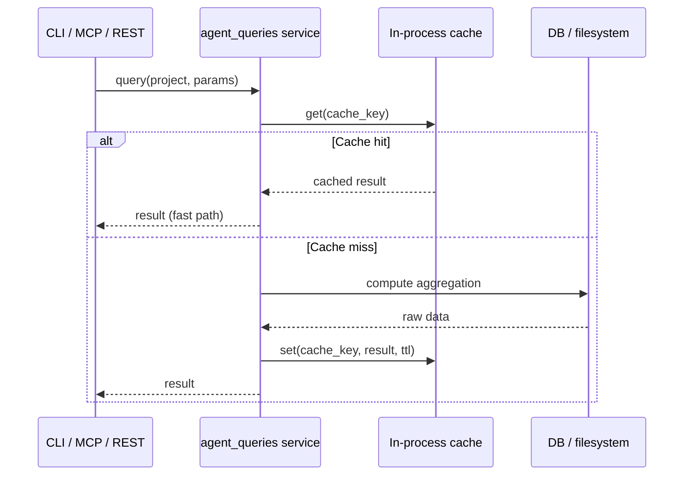

# Feature Brief & Metadata

**Feature Name:**

> CCDash Query Caching and CLI Ergonomics

**Filepath Name:**

> `ccdash-query-caching-and-cli-ergonomics-v1`

**Date:**

> 2026-04-14

**Author:**

> Claude Sonnet 4.6 (PRD Writer)

**Related Epic(s)/PRD ID(s):**

> Agentic SDLC Intelligence Foundation (enhancements/agentic-sdlc-intelligence-foundation-v1.md)

**Related Documents:**

> - `docs/project_plans/PRDs/enhancements/agentic-sdlc-intelligence-foundation-v1.md` — agent-queries transport-neutral layer this builds on

---

## 1. Executive Summary

This PRD covers four targeted ergonomics and performance enhancements to CCDash that surfaced during real-world CLI and MCP usage of the agent-queries layer: configurable HTTP timeouts for the standalone CLI, in-process caching of four expensive agent-query endpoints, top-level alias fields on the feature-show DTO, expanded feature-list pagination defaults with keyword filtering, and data-integrity reconciliation between the inline `linked_sessions` array and the dedicated `feature sessions` endpoint. Together these changes eliminate the most common friction points in interactive CLI/MCP sessions — opaque transport failures on long queries, slow repeated aggregations, awkward nested DTO access, hidden features due to pagination defaults, and silent data disagreement between endpoints — without introducing new infrastructure or altering any public API contracts.

**Priority:** MEDIUM

**Key Outcomes:**
- Outcome 1: Operators can extend or inspect the CLI timeout without code changes, eliminating opaque transport failures on heavy queries.
- Outcome 2: Repeated agent-query calls hit an in-process cache, reducing perceived latency on warm runs to near-zero for the four heaviest endpoints.
- Outcome 3: CLI/MCP/agent consumers can read feature name, status, and telemetry-availability indicators from flat top-level fields, removing duplicated nested-access boilerplate across all callers.
- Outcome 4: Feature list returns more results by default (200 vs 50), includes a truncation hint when results exceed the limit, and supports keyword filtering to avoid full-list client-side scans.
- Outcome 5: The inline `linked_sessions` array on feature-show is either reconciled to match the `feature sessions` endpoint or explicitly documented as a filtered subset, with a hint nudging callers to the authoritative endpoint.

---

## 2. Context & Background

### Current State

CCDash exposes a transport-neutral intelligence layer (`backend/application/services/agent_queries/`) that powers REST, the standalone CLI (`packages/ccdash_cli/`), and the MCP stdio server (`backend/mcp/`). The layer is well-factored but was built without interactive performance targets or operator-tunable configuration in the transport clients.

### Problem Space

Three concrete friction points emerged during live usage:

1. The standalone CLI uses a hardcoded HTTP timeout. Analytics queries (AAR reports, feature forensics over large session histories) occasionally exceed it, producing opaque `ConnectionError` or `ReadTimeout` messages with no guidance on how to extend the window.
2. Four agent-query endpoints recompute aggregations from raw data on every call. During an AAR drill-down an operator may invoke the same endpoint multiple times; each call bears full recomputation cost.
3. The feature-show DTO buries `name` and `status` inside a nested object. Every caller — CLI formatter, MCP tool, downstream agent — duplicates the same nested-access pattern, and the MCP schema is harder for LLMs to parse.

### Architectural Context

- **Transport-neutral agent queries**: `backend/application/services/agent_queries/` is the canonical location for cross-transport intelligence logic. Caching belongs here so all transports benefit automatically.
- **Background jobs**: `backend/adapters/jobs/` provides a runtime background job adapter already used by the worker process. Background materialization hooks in here.
- **Observability**: `backend/observability/` carries the OpenTelemetry setup. Cache hit/miss metrics are instrumented here.
- **CLI runtime**: `packages/ccdash_cli/src/ccdash_cli/runtime/client.py` owns HTTP client construction for the standalone CLI.

---

## 3. Problem Statement

The three enhancements share a common root: the agent-queries layer and its CLI surface were built for correctness, not interactive ergonomics. Operators using the CLI for real analysis workflows hit friction that is fixable with small, well-scoped changes.

**Combined user story:**
> "As an operator running CLI/MCP queries against a large project, long queries time out with no fix, repeated queries are slow, and I have to dig into nested DTO fields just to read a feature's name."

**Per-enhancement root causes:**

| # | Enhancement | Root Cause | Primary File |
|---|-------------|-----------|--------------|
| E1 | CLI timeout | `RuntimeClient` uses a hardcoded timeout constant with no env or flag override | `packages/ccdash_cli/src/ccdash_cli/runtime/client.py` |
| E2 | Query caching | Agent-query service functions have no memoization; every call recomputes from raw DB/filesystem | `backend/application/services/agent_queries/` |
| E2.5 | DTO alias fields + telemetry_available | Feature-show DTO exposes `name`/`status` only in nested sub-object; no indicator of data completeness (sessions may not be instrumented) | `backend/application/services/agent_queries/models.py` |
| E2.6 | linked_sessions reconciliation | Inline `feature_show.linked_sessions` array returns `[]` while dedicated `feature sessions <id>` endpoint returns real data; endpoints disagree silently | `backend/routers/agent.py` + `backend/application/services/agent_queries/` |
| E3 | Feature list pagination | Default limit of 50 silently hides most features (213 local, 50 returned); no truncation hint; keyword filter unavailable | `backend/routers/agent.py` + `backend/application/services/agent_queries/` |

---

## 4. Goals & Success Metrics

### Primary Goals

**Goal 1: Configurable CLI timeout**
- Operators can set timeout via `--timeout SECONDS` flag or `CCDASH_TIMEOUT` env var without touching source.
- Active timeout is visible in `ccdash doctor` / `ccdash target check` output.

**Goal 2: Warm-cache performance on heavy queries**
- Four designated endpoints return cached results on repeated calls within TTL window.
- Background materialization keeps cache warm for the heaviest rollups without blocking interactive calls.

**Goal 3: Flat DTO access for feature name, status, and telemetry availability**
- All CLI/MCP/agent callers can read `name`, `status`, and `telemetry_available` from the top-level DTO without nested access.
- Nested structure preserved for backward compatibility.
- Operators can assess data completeness (sessions may not be instrumented for older features).

**Goal 4: Feature list discoverability and filtering**
- Default feature-list limit increased to 200 (from 50) to show most registries in one call.
- Truncation hint surfaced when results exceed limit.
- Keyword filter available to avoid client-side scans of large lists.

**Goal 5: Endpoint agreement on linked sessions**
- Inline `linked_sessions` array on feature-show and dedicated `feature sessions` endpoint return identical results.
- Hint on feature-show nudges callers to the authoritative endpoint when needed.

### Success Metrics

| Metric | Baseline | Target | Measurement Method |
|--------|----------|--------|--------------------|
| CLI transport failures on analytics queries | Occurs on sessions > ~N minutes | Zero on standard analytics queries within user-set timeout | Manual test + CI fixture with slow mock |
| Cache hit rate on warm repeated query runs | 0% (no cache) | ≥ 80% on second+ call within TTL | OTel counter: `agent_query.cache.hit` / total |
| Feature-show DTO nested-access patterns in callers | 3+ callers with duplicate nested access | 0 callers after refactor (all use top-level fields) | Code search / lint rule |
| Regression: top-level vs nested field parity | N/A | 100% — automated test asserts fields are equal | Pytest regression test |
| Default feature-list visibility | 213 local features, 50 returned (76% hidden) | 213 local features, 200+ returned (≥94% visible) | `ccdash feature list` output; paginate=false |
| Feature-list keyword filter effectiveness | N/A | `ccdash feature list --q "repo"` returns only features with "repo" in name/slug | Manual test with known keywords |
| linked_sessions agreement | Inline array disagrees with endpoint (70 vs 0 sessions on same feature) | 100% agreement between both accessors | Pytest test asserts on every CI run |
| telemetry_available coverage | No indicator of data gaps | `telemetry_available: {tasks, documents, sessions}` present on all feature-show responses | DTO introspection |

---

## 5. User Personas & Journeys

### Personas

**Primary Persona: Operator / Developer**
- Role: Runs `ccdash` CLI interactively to query project health, feature status, and session analytics during active development.
- Needs: Fast, predictable CLI responses; clear error messages; no boilerplate in scripts.
- Pain Points: Opaque timeout failures; slow repeated queries during AAR drill-downs; verbose nested field access in shell scripts and agent prompts.

**Secondary Persona: AI Agent (MCP consumer)**
- Role: LLM-based agent calling CCDash MCP tools to gather project context.
- Needs: Clean, flat response schemas; low latency on repeated context reads.
- Pain Points: Nested DTO fields complicate tool-call result parsing; recomputed aggregations introduce unpredictable latency between tool invocations.

### High-level Flow (E2 — query caching)

---

## 6. Requirements

### 6.1 Functional Requirements

#### E1 — CLI timeout plumbing

| ID | Requirement | Priority | Notes |
|:--:|-------------|:--------:|-------|
| FR-E1-1 | Add `--timeout SECONDS` global flag on the CLI root command | Must | Integer or float seconds; default preserves current hardcoded value |
| FR-E1-2 | Read `CCDASH_TIMEOUT` env var as a fallback when flag is not set | Must | Flag beats env beats default (standard precedence) |
| FR-E1-3 | Wire resolved timeout into `RuntimeClient` / HTTP client construction | Must | Single point of construction; no scattered overrides |
| FR-E1-4 | Surface active timeout value in `ccdash doctor` and `ccdash target check` output | Should | Shows source (flag / env / default) for debuggability |

#### E2 — Query caching

| ID | Requirement | Priority | Notes |
|:--:|-------------|:--------:|-------|
| FR-E2-1 | Add TTL-based in-process memoization to the four designated agent-query service functions | Must | Applies to: project status rollup, feature report/AAR, workflow failures summary, feature list with aggregates |
| FR-E2-2 | Cache key must encode: project scope + query parameters + data-version fingerprint | Must | Fingerprint = max `updated_at` across relevant sessions/features; ensures auto-invalidation on new sync data |
| FR-E2-3 | Add background materialization job for the heaviest rollups via the existing background job adapter | Should | Registered in `backend/adapters/jobs/`; runs on configurable cadence |
| FR-E2-4 | Expose `CCDASH_QUERY_CACHE_TTL_SECONDS` and `CCDASH_QUERY_CACHE_REFRESH_INTERVAL_SECONDS` in `backend/config.py` | Must | Both with documented defaults |
| FR-E2-5 | Support cache bypass via `?bypass_cache=true` query param (REST) and `--no-cache` flag (CLI) | Should | For debug and force-refresh workflows |
| FR-E2-6 | Instrument cache hits and misses as OTel counters via the existing observability stack | Must | Counter names: `agent_query.cache.hit`, `agent_query.cache.miss` |

#### E2.5 — Feature-show DTO alias fields and telemetry_available indicator

| ID | Requirement | Priority | Notes |
|:--:|-------------|:--------:|-------|
| FR-E2.5-1 | Add top-level `name: str` field to the feature-show DTO mirroring the canonical nested value | Must | Value is identical to the nested field; populated in the service layer, not the model layer |
| FR-E2.5-2 | Add top-level `status: str` field to the feature-show DTO mirroring the canonical nested value | Must | Same population strategy as `name` |
| FR-E2.5-3 | Add `telemetry_available: {tasks: bool, documents: bool, sessions: bool}` object to DTO | Must | Derived from whether corresponding arrays are populated; helps callers reason about data gaps |
| FR-E2.5-4 | Preserve all existing nested DTO fields; no removals or renames | Must | Backward compatibility — existing callers must not break |
| FR-E2.5-5 | Document alias fields and `telemetry_available` in the DTO docstring | Should | Prevents future maintainers from treating them as independent sources of truth |
| FR-E2.5-6 | Update CLI and MCP formatters to prefer top-level `name` / `status` over nested access | Must | Removes the duplicated nested-access pattern |
| FR-E2.5-7 | Add a pytest regression test asserting top-level and nested values are equal for any fixture | Must | Guards against divergence |

#### E2.6 — Feature-show linked_sessions reconciliation

| ID | Requirement | Priority | Notes |
|:--:|-------------|:--------:|-------|
| FR-E2.6-1 | Reconcile `feature_show.linked_sessions` with the authoritative `feature sessions <id>` endpoint | Must | Both must return identical data, or inline array must be documented as a filtered subset |
| FR-E2.6-2 | Add a one-line hint to feature-show output: "sessions: N available — run `ccdash feature sessions <id>` for details" | Should | Nudges operators toward the authoritative endpoint when the inline array state is ambiguous |
| FR-E2.6-3 | Add integration test locking inline `linked_sessions` and `feature sessions` endpoint agreement | Must | Prevents silent divergence; test runs on every CI pass |
| FR-E2.6-4 | Document any eventual-consistency behavior in CLI help or operator guide | Should | If session linkage is eventually consistent (background job), operators need to know queries may be premature |

#### E3 — Feature list pagination and filtering

| ID | Requirement | Priority | Notes |
|:--:|-------------|:--------:|-------|
| FR-E3-1 | Bump default `--limit` on `feature list` from 50 to 200 | Must | Captures most local registries in one call; reduces surprise at hidden features |
| FR-E3-2 | Add `truncated: bool, total: int` fields to feature-list response DTO | Must | When limit is exceeded, truncated=true and total shows true count; allows CLI to surface "X more features available, use `--limit`" |
| FR-E3-3 | Add `--q <keyword>` (or `--name-contains`) flag to `feature list` | Must | Server-side substring match on feature name/slug; avoids full-list client-side filter; case-insensitive |
| FR-E3-4 | Wire keyword filter through REST → agent_queries service → repository | Must | Filter applied at DB query layer, not in-memory post-fetch |
| FR-E3-5 | Document the new limit, truncation hint, and keyword filter in CLI help and operator guides | Should | One-liner on each; update `.claude/skills/ccdash/` spec |

### 6.2 Non-Functional Requirements

**Performance:**
- Cache lookup must not add measurable latency on cache-hit path (target < 1 ms overhead).
- Background materialization must not block the HTTP request path.

**Reliability:**
- Cache must degrade gracefully on fingerprint computation failure: fall through to live query, log warning.
- CLI timeout change must be fully backward-compatible; existing scripts with no flags or env vars see identical behavior.

**Observability:**
- OTel spans wrap cache lookup + population in E2.
- E1 active timeout exposed as a logged attribute on the CLI startup span (if span is emitted) and in `doctor` output.

**Maintainability:**
- Cache implementation lives in the agent_queries layer, not in individual routers or CLI commands.
- DTO alias fields are computed once in the service layer; routers/CLI/MCP read the DTO as-is.

---

## 7. Scope

### In Scope

| Enhancement | In Scope |
|-------------|----------|
| E1 — CLI timeout | `--timeout` global flag; `CCDASH_TIMEOUT` env var; `RuntimeClient` wiring; `doctor`/`target check` display |
| E2 — Query caching | In-process TTL cache for 4 endpoints; data-version fingerprint invalidation; background materialization job; config env vars; `bypass_cache` escape hatch; OTel instrumentation |
| E2.5 — DTO alias + telemetry | `name` + `status` + `telemetry_available` top-level fields on feature-show DTO; docstring; CLI/MCP formatter updates; regression test |
| E2.6 — linked_sessions reconciliation | Reconcile inline array with dedicated endpoint; hint on feature-show; regression test locking agreement; eventual-consistency documentation (if applicable) |
| E3 — Feature list pagination | Raise default limit to 200; add truncation hint (`truncated`/`total` fields); add `--q` keyword filter; repository-layer implementation |

### Out of Scope

| Enhancement | Out of Scope |
|-------------|--------------|
| E1 — CLI timeout | Per-command timeout overrides; retry policies; streaming endpoint timeouts |
| E2 — Query caching | Distributed cache (Redis, Memcached, etc.); full query-result streaming; caching of endpoints not in the four-endpoint list; cache warming on server startup |
| E2.5 — DTO alias | Broader DTO restructuring; renaming or removing nested fields; alias fields on any DTO other than feature-show |
| E2.6 — linked_sessions | Streaming endpoint support; session linkage async job tuning (infrastructure change) |
| E3 — Feature list | Advanced search syntax (lucene, regex); faceted filtering; real-time result streaming |
| Document body retrieval | Net-new endpoint / capability; deferred to future SPIKE and design spec phase |

---

## 7.5 Deferred Items & Future Work

| Item | Description | Future Spec / Placeholder |
|------|-------------|-------------------------|
| Document body retrieval | Net-new `ccdash doc show <doc_id>` endpoint and/or flag on feature-documents to retrieve full document body, not just title. Requires design spec on document storage format and output strategy. | Design spec TBD; estimated for post-Phase-5 SPIKE |
| Session linkage eventual-consistency clarification | If the session-feature linkage is produced by a background job (not instant on creation), operator docs should say so. Investigation task (in Phase 3) will determine if this is a documentation-only fix or a code change. | Embedded in Phase 3 task E2.6-4; depends on investigation outcome |

---

## 8. Dependencies & Assumptions

### Internal Dependencies

| Dependency | Status | Notes |
|------------|--------|-------|
| `backend/application/services/agent_queries/` | In place | Transport-neutral layer; E2 and E3 implemented here |
| `backend/adapters/jobs/` runtime background job adapter | In place | E2 background materialization registers here |
| `backend/observability/` OpenTelemetry setup | In place | E2 cache metrics emitted here |
| `backend/config.py` env-var config pattern | In place | E1 `CCDASH_TIMEOUT` and E2 cache config vars added here |
| `packages/ccdash_cli/src/ccdash_cli/runtime/client.py` | In place | E1 timeout wired here |

### Assumptions

- The current hardcoded CLI timeout is a single constant in `RuntimeClient`; no scattered per-call overrides exist that need individual migration.
- The four endpoints targeted for caching share a common async invocation pattern compatible with a decorator or wrapper approach in the agent_queries layer.
- Data-version fingerprint (max `updated_at`) is queryable with a lightweight DB call that does not itself require caching.
- The feature-show DTO is a Pydantic model; alias fields can be implemented as computed `@property` or `model_validator` without changing the serialization contract.
- No distributed or multi-process cache is needed; CCDash is local-first and a single process handles all three transports in a given runtime session.

---

## 9. Risks & Mitigations

| Risk | Impact | Likelihood | Mitigation |
|------|:------:|:----------:|------------|
| Cache invalidation lag — fingerprint fingerprint not updated atomically with sync, serving stale data briefly | Med | Med | Fingerprint uses DB `max(updated_at)` which is written by the sync engine before data is committed; short TTL (default 60 s) bounds maximum staleness; bypass flag available |
| Fingerprint query adds overhead that exceeds cache benefit on small datasets | Low | Low | Fingerprint is a single lightweight aggregate query; profile before exposing config; TTL bypass available |
| Background materialization job competes with sync jobs for DB read bandwidth | Low | Low | Job runs at low priority cadence (default 5 min); can be disabled via `CCDASH_QUERY_CACHE_REFRESH_INTERVAL_SECONDS=0` |
| DTO alias fields diverge from nested values due to future nested refactor | Med | Low | Regression test asserts equality on every CI run; docstring makes intent explicit |
| CLI `--timeout` flag conflicts with a subcommand option of the same name | Low | Low | Flag is global (on root group); validate no existing subcommand uses `--timeout` before implementing |

---

## 10. Target State (Post-Implementation)

**Operator experience:**
- `ccdash feature report FEAT-123` on a large history no longer fails with an opaque timeout if the operator exports `CCDASH_TIMEOUT=120`.
- `ccdash doctor` shows `Timeout: 120 s (env: CCDASH_TIMEOUT)` in its output table.
- A second `ccdash report aar --feature FEAT-123` call within the TTL window returns in < 100 ms.
- CLI scripts read `result["name"]` and `result["status"]` directly from feature-show responses without nested drilling.

**MCP/agent experience:**
- Feature-show tool results include flat `name` and `status` keys visible in the top-level schema, simplifying LLM tool-call result parsing.
- Repeated context-gathering calls within a session benefit from the cache without any caller-side changes.

**Observable outcomes:**
- OTel dashboard shows `agent_query.cache.hit` rising to ≥ 80% during typical interactive sessions.
- Zero CLI `ReadTimeout` / `ConnectTimeout` failures in operator logs for standard analytics queries.

---

## 11. Overall Acceptance Criteria (Definition of Done)

### E1 — CLI timeout

- [ ] `ccdash --timeout 120 feature report FEAT-123` completes without transport error on a query that previously timed out.
- [ ] `CCDASH_TIMEOUT=90 ccdash status project` uses 90 s timeout; `ccdash --timeout 30 status project` uses 30 s even if env is set to 90.
- [ ] `ccdash doctor` and `ccdash target check` both display active timeout and its source.
- [ ] No change in behavior when neither flag nor env is set (backward compat).

### E2 — Query caching

- [ ] Second call to each of the four endpoints within TTL returns a result and increments `agent_query.cache.hit` counter.
- [ ] Modifying a session/feature file and triggering a sync causes the next call to recompute (fingerprint invalidation).
- [ ] `?bypass_cache=true` on REST and `--no-cache` on CLI both force a live recompute and increment `agent_query.cache.miss`.
- [ ] `CCDASH_QUERY_CACHE_TTL_SECONDS` and `CCDASH_QUERY_CACHE_REFRESH_INTERVAL_SECONDS` are respected; setting TTL to 0 disables caching.
- [ ] Background materialization job registers and runs without blocking any HTTP response.
- [ ] Cache layer degrades gracefully (live query) when fingerprint computation fails.

### E2.5 — DTO alias fields and telemetry_available indicator

- [ ] `GET /agent/feature/{id}` (and CLI/MCP equivalents) response includes top-level `name` and `status` strings.
- [ ] `telemetry_available: {tasks: bool, documents: bool, sessions: bool}` is present in all feature-show responses.
- [ ] Top-level `name` == nested canonical `name`; top-level `status` == nested canonical `status` — asserted by regression test on every CI run.
- [ ] `telemetry_available.sessions` correctly reflects whether `linked_sessions` array is populated (non-empty array = true).
- [ ] All existing callers continue to function (no breaking deserialization errors).
- [ ] CLI formatter and MCP tool schema use top-level fields; nested access removed from those callsites.
- [ ] DTO docstring documents the alias relationship and `telemetry_available` semantics.

### E2.6 — Feature-show linked_sessions reconciliation

- [ ] `feature_show.linked_sessions` inline array returns identical results to `feature sessions <id>` endpoint for the same feature.
- [ ] Integration test asserts both endpoints agree on every CI run.
- [ ] Feature-show response includes a hint: "sessions: N available — run `ccdash feature sessions <id>` for details."
- [ ] If session linkage is eventually consistent (background job), operator docs explain the timing.

### E3 — Feature list pagination and keyword filter

- [ ] `ccdash feature list` (no flags) returns 200 results by default (up from 50).
- [ ] When results are truncated, response includes `truncated: true` and `total: <actual count>`.
- [ ] CLI displays: "Showing 200 of 213 features. Use `--limit 500` to see more." when `truncated: true`.
- [ ] `ccdash feature list --q "repo"` returns only features with "repo" in name or slug (case-insensitive substring match).
- [ ] Keyword filter works in REST (`?q=keyword`) and CLI (`--q keyword`).
- [ ] Database query for keyword filter applies filter at repository layer (not post-fetch client-side).

---

## 12. Assumptions & Open Questions

### Assumptions

- The four endpoints targeted for caching are: project status rollup, feature report/AAR, workflow failures summary, feature list with aggregates. The implementation planner should verify by inspecting `backend/application/services/agent_queries/` and `backend/routers/agent.py` to confirm function names and any additional candidates.
- "Feature-show DTO" refers to the response model for the single-feature detail query; the implementation planner should confirm the exact model class name in `backend/application/services/agent_queries/models.py`.

### Open Questions

- [ ] **OQ-1**: Does the current `RuntimeClient` use a single shared `httpx.AsyncClient` or per-request clients? The answer determines whether timeout is passed at construction or per-request.
  - **A**: TBD — implementation planner to inspect `packages/ccdash_cli/src/ccdash_cli/runtime/client.py`.
- [ ] **OQ-2**: Is there an existing in-process cache utility (e.g., `cachetools`, `functools.lru_cache`) already in the backend venv, or does one need to be added as a dependency?
  - **A**: TBD — implementation planner to check `backend/requirements*.txt`.
- [ ] **OQ-3**: The feature-show DTO alias fields are described as "mirroring the canonical nested values." If the nested object is itself a union type or optional, the alias field type may need to be `Optional[str]`. Confirm nesting structure.
  - **A**: TBD — implementation planner to inspect the DTO definition.

---

## 13. Appendices & References

### Related Documentation

- **Agent-queries foundation PRD**: `docs/project_plans/PRDs/enhancements/agentic-sdlc-intelligence-foundation-v1.md`
- **Backend config conventions**: `backend/config.py` (env-var pattern)
- **Observability guide**: `docs/guides/telemetry-exporter-guide.md`

---

## Implementation

### Phased Approach

**Phase 1: CLI timeout plumbing** _(lowest risk, no backend changes)_
- Duration: 0.5–1 day
- Tasks:
  - [ ] Add `CCDASH_TIMEOUT` to `backend/config.py` (or CLI-side config if standalone)
  - [ ] Add `--timeout` global flag to CLI root; resolve precedence (flag > env > default)
  - [ ] Wire resolved value into `RuntimeClient` / HTTP client construction
  - [ ] Update `ccdash doctor` and `ccdash target check` to display active timeout + source
  - [ ] Regression test: assert default behavior unchanged when neither flag nor env set

**Phase 2: DTO alias fields and telemetry indicator** _(pure model layer, no infrastructure)_
- Duration: 0.75 days
- Tasks:
  - [ ] Add `name`, `status`, and `telemetry_available` top-level fields to feature-show DTO
  - [ ] Populate fields in the service layer
  - [ ] Update CLI formatter to use top-level fields
  - [ ] Update MCP tool schema to surface top-level fields
  - [ ] Add pytest regression test asserting parity between top-level and nested values

**Phase 2.5: Feature-show linked_sessions reconciliation** _(data-integrity fix, queries layer)_
- Duration: 0.5–0.75 days
- Tasks:
  - [ ] Investigate why `feature_show.linked_sessions` disagrees with `feature sessions <id>` endpoint
  - [ ] Reconcile inline array to match endpoint (or document as filtered subset)
  - [ ] Add "sessions: N — use `feature sessions <id>`" hint to feature-show response
  - [ ] Add integration test locking both endpoints in agreement
  - [ ] Document eventual-consistency behavior (if applicable) in operator guide

**Phase 3: Cache layer foundation** _(in-process TTL memoization)_
- Duration: 1–1.5 days
- Tasks:
  - [ ] Add `CCDASH_QUERY_CACHE_TTL_SECONDS` to `backend/config.py` (default: 60)
  - [ ] Implement cache utility (decorator or wrapper) in `agent_queries/` with TTL and key construction
  - [ ] Implement data-version fingerprint helper (max `updated_at` lightweight query)
  - [ ] Apply cache to four designated endpoints
  - [ ] Implement `bypass_cache` query param (REST) and `--no-cache` CLI flag
  - [ ] Instrument `agent_query.cache.hit` / `.miss` OTel counters

**Phase 3.5: Feature list pagination and keyword filtering** _(repository + API layer)_
- Duration: 0.75–1 days
- Tasks:
  - [ ] Raise default limit from 50 to 200 in feature-list endpoint
  - [ ] Add `truncated: bool, total: int` fields to response DTO
  - [ ] Add `--q <keyword>` CLI flag and `?q=keyword` REST param
  - [ ] Implement keyword filter in repository layer (substring match on name/slug)
  - [ ] Update CLI formatter to display truncation hint when `truncated: true`

**Phase 4: Background materialization** _(heavier rollups, job adapter)_
- Duration: 0.5–1 day
- Tasks:
  - [ ] Add `CCDASH_QUERY_CACHE_REFRESH_INTERVAL_SECONDS` to `backend/config.py` (default: 300)
  - [ ] Register background materialization job in `backend/adapters/jobs/` for the two heaviest rollups (project status, feature list aggregates)
  - [ ] Add graceful degradation: job failure does not affect interactive request path
  - [ ] Setting interval to 0 disables background job

**Phase 5: Tests and docs**
- Duration: 1.5–2 days
- Tasks:
  - [ ] Integration tests: cache invalidation on sync write, TTL expiry, bypass flag
  - [ ] CLI tests: timeout flag precedence, doctor output
  - [ ] Test linked_sessions reconciliation and agreement
  - [ ] Test feature-list pagination and keyword filter
  - [ ] Update `CLAUDE.md` with new env vars and flags
  - [ ] Create operator guides: query-cache-tuning, cli-timeout-debugging
  - [ ] Update `.claude/skills/ccdash/` with new commands and recipes
  - [ ] Create feature guide with test coverage summary

---

**Progress Tracking:**

See progress tracking: `.claude/progress/ccdash-query-caching-and-cli-ergonomics/all-phases-progress.md`
