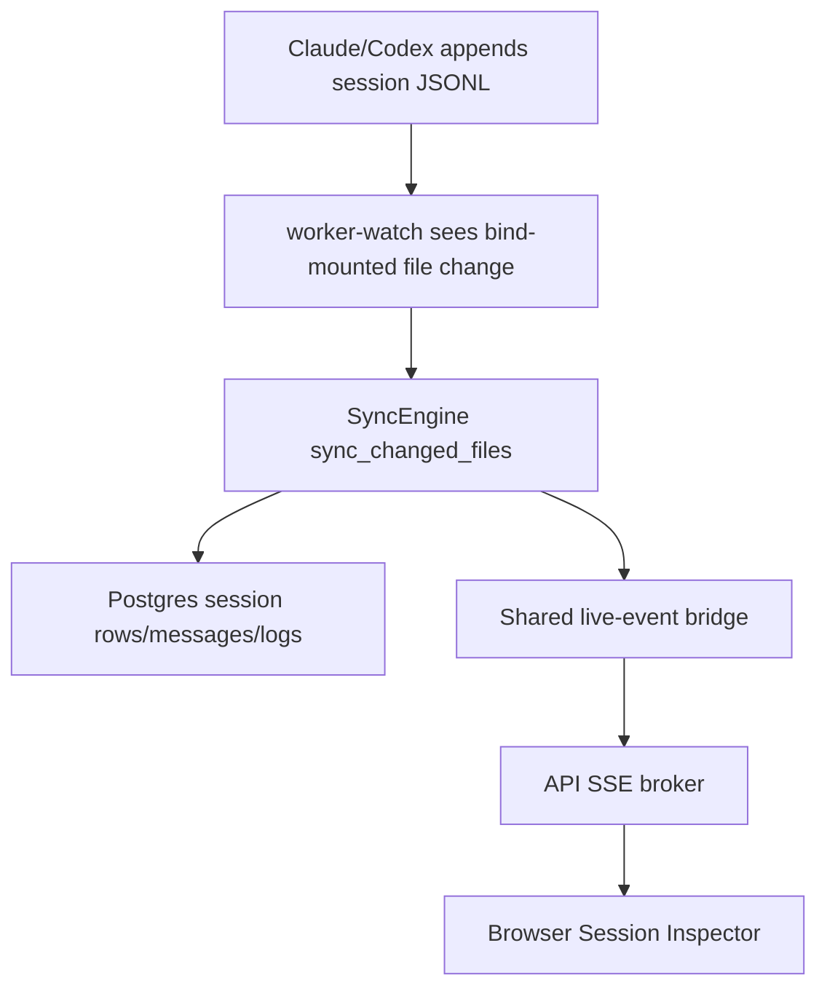

# PRD: Enterprise Live Session Ingest V1

## Executive Summary

The enterprise Docker/Postgres stack now stands up and loads historical data, but "live sessions" stop at startup sync. The `worker` runtime is allowed to sync and run scheduled jobs, yet it is not watcher-capable, and its live-event publisher is process-local while the browser is subscribed to the API process. This enhancement makes live local-session ingest explicit for enterprise deployments by adding a watcher-capable worker mode and a shared live event bridge.

Priority: HIGH

Key outcomes:

1. Operators can run a worker that watches mounted session directories and ingests active Claude/Codex session changes without restarting the stack.
2. Browser session views receive low-latency invalidations/appends from worker-originated sync events through the existing SSE client model.
3. Hosted API remains free of filesystem watcher ownership.

## Current State

Runtime behavior:

1. `backend/runtime/profiles.py` defines `local` with `watch=True`, but `worker` has `watch=False`.
2. `backend/adapters/jobs/runtime.py` starts `file_watcher` only when the runtime profile capability has `watch=True`.
3. `backend/db/file_watcher.py` already classifies `.jsonl` and `.md` changes and calls `sync_changed_files`.
4. `deploy/runtime/compose.yaml` can mount workspace, `.claude`, `.codex`, and `projects.json` into backend containers.

Live-update behavior:

1. The SSE platform and session transcript append contract exist.
2. `backend/runtime/container.py` creates an in-memory live broker per process.
3. Worker sync can publish live events into the worker process, but the frontend connects to the API process at `/api/live/stream`.
4. There is no shared event fanout between worker and API.

Operator workaround:

1. Restarting the worker forces a startup sync.
2. This recovers data eventually, but is not live and does not provide browser push behavior.

## Problem Statement

As a CCDash operator running the full containerized enterprise stack, when a Claude Code session is active and appending to JSONL files, CCDash does not ingest those changes live. I must wait for a manual worker restart or another sync trigger instead of seeing the session update through the dashboard.

Technical root causes:

1. The enterprise `worker` runtime is not watcher-capable.
2. Watch ownership is correctly excluded from the API runtime, but no enterprise watcher variant exists.
3. Live events are process-local, so worker-originated publish calls do not reach API SSE subscribers.
4. Worker binding is currently one project per worker process, so multi-project watch semantics are not part of this v1.

## Goals & Success Metrics

### Goals

1. Add an explicit enterprise watcher worker mode without weakening API statelessness.
2. Ingest active session file changes into Postgres within seconds for the worker's bound project.
3. Deliver worker-originated session live events to API SSE subscribers through a shared fanout path.
4. Preserve local runtime behavior and existing startup sync behavior.
5. Document operator setup, health checks, and macOS Docker Desktop polling caveats.

### Success Metrics

| Metric | Baseline | Target | Measurement Method |
|--------|----------|--------|--------------------|
| Active JSONL append to DB visibility | Requires restart/manual sync | p95 <= 10 seconds | Append test against mounted session dir |
| Worker watcher state | `watchEnabled=false`, `watcher=stopped` | watcher worker reports `watchEnabled=true`, `watcher=running` | `GET /detailz` |
| Worker event to browser SSE | Not delivered cross-process | p95 <= 3 seconds after sync publish | SSE integration test |
| API watcher ownership | API never watches | unchanged | runtime profile tests |
| Local mode regression | Existing watcher works | unchanged | existing sync/watcher test suite |

## User Personas & Journeys

Primary persona: local enterprise operator

- Role: Developer or platform owner running `enterprise + postgres` compose locally or on a shared host.
- Needs: Live visibility into active sessions while keeping API/worker split.
- Pain points: Historical data loads, but active sessions appear stale.

Secondary persona: platform engineer

- Role: Maintains CCDash runtime profiles and deployment docs.
- Needs: Explicit, probeable background process ownership.
- Pain points: Hidden watcher behavior in API would violate hosted runtime guarantees.

### Target Flow

## Requirements

### Functional Requirements

| ID | Requirement | Priority | Notes |
|----|-------------|----------|-------|
| FR-1 | Define a watcher-capable enterprise worker runtime profile or role. | Must | Prefer additive `worker-watch` over changing `worker` globally. |
| FR-2 | Add compose/operator support for starting the watcher worker with existing project and filesystem mounts. | Must | One worker-watch process per project in v1. |
| FR-3 | Preserve API runtime prohibition on watcher/startup sync ownership. | Must | API profile stays `watch=False`, `sync=False`. |
| FR-4 | Support macOS/container bind-mount reliability via documented `WATCHFILES_FORCE_POLLING=true`. | Should | Operator option, not necessarily default. |
| FR-5 | Publish worker-originated live session invalidations/appends to API SSE subscribers. | Must | Use a shared fanout adapter; Postgres `LISTEN/NOTIFY` is preferred for the existing stack. |
| FR-6 | Expose watcher worker health and freshness in worker detail payload. | Must | Include watcher state, watch paths count, last change sync status where practical. |
| FR-7 | Document limitations and rollout topology. | Must | Explicitly state v1 is one project per watcher worker. |

### Non-Functional Requirements

Performance:

1. File append to Postgres visibility should be p95 <= 10 seconds in local Docker Desktop and Linux bind-mount setups.
2. Worker-to-browser live event visibility should be p95 <= 3 seconds after sync publish.

Reliability:

1. If filesystem events are dropped, documented polling mode must recover expected behavior.
2. If shared live fanout is unavailable, ingestion must still persist to Postgres and browser REST refresh must remain a valid recovery path.

Security:

1. API runtime must not gain filesystem watch capabilities.
2. Watcher workers must remain bound to explicit project configuration.
3. Shared live fanout must not bypass existing topic authorization in the API SSE route.

Observability:

1. Runtime probes identify watcher enabled/running/stopped state.
2. Logs include runtime profile, project id, watched paths, and sync result for detected changes.
3. Metrics or probe fields expose last successful change sync and event bridge errors.

## Scope

### In Scope

1. Runtime profile and storage contract updates for watcher-capable worker mode.
2. Compose and env example changes for `worker-watch`.
3. File watcher startup in the watcher worker.
4. Shared cross-process live event fanout for worker-to-API delivery.
5. Tests for runtime capability, watcher startup, fanout, and session live behavior.
6. Operator documentation.

### Out of Scope

1. Multi-project watch in a single worker process.
2. Remote developer daemon ingestion.
3. Entire.io checkpoint ingestion.
4. WebSocket or bidirectional live transport.
5. Kubernetes manifests or production HA broker design.

## Dependencies & Assumptions

Internal dependencies:

1. Existing SSE platform and session transcript append topics.
2. Existing `SyncEngine.sync_changed_files` behavior.
3. Existing project registry and worker binding contract.
4. Existing enterprise Postgres deployment contract.

Assumptions:

1. The operator can mount session directories into the watcher container.
2. The watcher worker's process-local project binding remains acceptable for v1.
3. Postgres is available in enterprise deployments and can serve as the shared live-event fanout substrate.
4. Browser REST recovery paths remain available when live fanout degrades.

## Target State

The enterprise deployment has three backend roles:

1. `api`: HTTP, auth, REST, SSE subscription, no watcher.
2. `worker`: startup sync, scheduled jobs, telemetry/cache work, no watcher by default.
3. `worker-watch`: explicit filesystem ingestion adapter for one bound project.

The API and watcher worker share Postgres for canonical data and live-event fanout. The worker-watch process detects changed session JSONL files, syncs them into Postgres, and publishes live session events through the shared fanout. The API consumes fanout events into its SSE broker and forwards them to authorized browser subscribers.

## Risks & Mitigations

| Risk | Impact | Likelihood | Mitigation |
|------|--------|------------|------------|
| Docker Desktop bind mounts do not emit timely filesystem events | High | Medium | Document and test `WATCHFILES_FORCE_POLLING=true`; expose watch health. |
| Cross-process live bridge duplicates events | Medium | Medium | Use event ids/cursors and idempotent frontend handling already present in SSE platform. |
| API accidentally gains filesystem ownership | High | Low | Runtime profile tests and storage contract checks. |
| One worker per project is operationally noisy | Medium | Medium | Document limitation; leave multi-project watcher for remote-streaming/multi-source follow-up. |
| Postgres `NOTIFY` payload limits constrain event size | Medium | Medium | Send envelope metadata plus compact payload; fall back to invalidation events for large payloads. |

## Acceptance Criteria

1. `docker compose --profile enterprise --profile postgres --profile live-watch up` starts API, frontend, Postgres, and a watcher worker.
2. Worker detail probe reports watcher enabled and running when configured paths exist.
3. Appending a line to an active session JSONL file updates Postgres without restarting the worker.
4. Browser Session Inspector receives session invalidation or transcript append through `/api/live/stream`.
5. API detail probe continues to report watcher disabled/not expected.
6. Existing local, API, worker, and test runtime profile tests pass.
7. Operator docs explain setup, limitations, health checks, and troubleshooting.

## Implementation Reference

See implementation plan: `docs/project_plans/implementation_plans/enhancements/enterprise-live-session-ingest-v1.md`.
