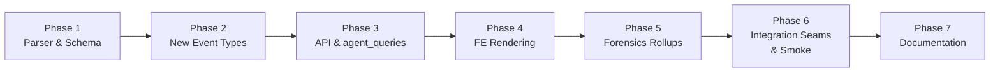

# PRD: JSONL Shape Gap Coverage V1

## Executive Summary

A 2026-05-19 audit of 30 recent Claude Code JSONL files (3,962 lines sampled, versions 2.1.123–2.1.144) found 13 distinct gaps where CCDash reads zero or only partial data from fields and event types that Claude Code now emits in production volume. The gaps fall into three buckets: (A) unread top-level session-metadata fields (`promptId`, `sessionKind`, `bridgeSessionId`, `attributionSkill`, `attributionPlugin`, `thinking.signature`, `leafUuid`, `lastSequenceNum`); (B) unhandled event types (`ai-title`, `attachment` with 14 subtypes, `last-prompt`, `permission-mode` as a transition, and four new `system.subtype` values); and (C) parsed-but-unrendered usage breakouts and forensics that remain invisible in the UI.

This PRD closes all 13 gaps additively — no breaking schema changes, no backfill of historical sessions, no new chart frameworks. Every new field is nullable; the UI must degrade gracefully when older JSONL files omit them.

**Priority:** Medium

**Key outcomes:**
- All 13 audit gaps closed; parser captures data Claude Code has been emitting for months.
- Attachment cards, permission-mode chips, turn-duration histogram, and away-summary banner appear in the Session Inspector and transcript views.
- `promptId` search and `leafUuid` trace are queryable via CLI, MCP, and agent_queries for forensics and AAR workflows.
- Attribution (`attributionSkill`, `attributionPlugin`) rollups surface per-session breakdowns and a top-plugins widget.

---

## 1. Context and current state

### Parser coverage today

`backend/parsers/platforms/claude_code/parser.py` dispatches on `entry.type` with six explicit branches: `progress`, `summary`, `custom-title`, `pr-link`, `queue-operation`, `file-history-snapshot`, plus the message-bearing `user`/`assistant` branches. The `system` branch exists only as a terminal-session marker.

`message.usage` coverage is complete for production keys. The following fields are **completely unread** as of the audit date (findings doc §1, §2 "Handled? = No"):

| Field / event | Production volume (lines) |
|---|---|
| `attributionSkill` | 742 |
| `promptId` | 1,276 |
| `type: "attachment"` (14 subtypes) | 427 |
| `type: "last-prompt"` | 229 |
| `attributionPlugin` | 188 |
| `sessionKind` | 66 |
| `subtype: "away_summary"` | 46 |
| `type: "permission-mode"` (transition) | 75 |
| `subtype: "turn_duration"` (persist) | 85 |
| `type: "ai-title"` | 87 |
| `thinking.signature` | 294 |
| `type: "bridge-session"` / `bridgeSessionId` / `lastSequenceNum` | 4 |
| `subtype: "bridge_status"`, `local_command` | 23 |

### What already works

`permissionMode` field on individual entries is already read. `turn_duration` subtype is read but only used to mark sessions terminal, not persisted. `agentName` is captured indirectly. The `agent-setting` and `agent-name` event types appear at low volume (28 and 4 lines); they are in scope as minor parser branches but are not forensics-critical.

### Architectural context

CCDash follows the Router → Service → Repository pattern. The parser writes to `AgentSession` (defined in `backend/models.py` and mirrored in `types.ts`). New additive fields propagate through:

1. **Parser** (`parser.py`) — reads from JSONL.
2. **Models** (`models.py` + `types.ts`) — nullable typed fields.
3. **DB migration** (`backend/db/migrations.py`) — column-add for both SQLite and PostgreSQL.
4. **Repositories** (`backend/db/repositories/sessions.py`) — persist and read.
5. **Routers** (`backend/routers/api.py`, `backend/routers/agent.py`) — expose via REST.
6. **Agent queries** (`backend/application/services/agent_queries/`) — transport-neutral forensics layer consumed by REST, MCP, and CLI.
7. **Frontend** (`types.ts`, `components/SessionInspector.tsx`, `components/Planning/PlanningAgentSessionBoard.tsx`) — render with explicit null-handling.

---

## 2. Problem statement

CCDash is accumulating a growing blind spot: Claude Code generates rich operational telemetry (attachment outcomes, skill attribution, background-session markers, turn timing, away summaries) that CCDash discards at parse time. The effect is compound:

- Background `TaskCreate` sessions (`sessionKind: "bg"`) look identical to foreground sessions in every list view.
- Skill attribution for command-bound skills is invisible because `attributionSkill` is the canonical source — not the `Skill` tool call that never happens for binding-activated skills.
- `turn_duration` per-turn timings (audit samples: 49 s, 532 s, 56 s) are logged but not surfaced, making it impossible to identify slow turns.
- `attachment` events (427 lines) representing hook outcomes, task reminders, IDE context injections, nested CLAUDE.md content, and user-attached files are silently dropped, leaving the transcript forensics view incomplete.
- `promptId` (1,276 lines) is the only reliable identifier for resumed conversations; without it, CCDash cannot detect long multi-session threads.

**User story — power user:**
> As a developer reviewing a long debug session, when I open the Session Inspector I need to see which turns were slow, what hook outcomes fired, and whether the session resumed a prior thread — not a blank transcript with only model messages.

**User story — engineering lead:**
> As a lead reviewing feature forensics, when I run `ccdash report aar --feature FEAT-123` I need skill and plugin attribution breakdowns, not only raw tool-call counts.

**Technical root causes:**
- `parser.py` dispatch table has 6 branches; 7 additional observed event types produce no branch match and are silently dropped.
- `system` entries dispatch on the `subtype` field for only one value (`terminal`); four other subtypes are unreachable.
- `AgentSession` has no fields for `sessionKind`, `promptId`, `leafUuid`, `bridgeSessionId`, `lastSequenceNum`, `attributionPlugin`, `permissionModeTransitions`, `turnDurations`, `awaySummaries`, `aiTitleSource`.

---

## 3. Goals and success metrics

### Primary goals

**Goal A — Complete parser coverage:** Every event type and top-level field Claude Code emits in production volume is captured or explicitly deferred with a documented reason.

**Goal B — Session-metadata enrichment:** `AgentSession` records carry `sessionKind`, `promptId`, `leafUuid`, `bridgeSessionId`, `skillsUsed` (source: `attributionSkill`, replaces heuristic), `pluginsUsed`, `permissionModeTransitions`, `turnDurations`, `awaySummaries`, and `aiTitleSource`.

**Goal C — Transcript completeness:** Session Inspector renders attachment cards, permission-mode chips, ai-title provenance, last-prompt resume hints, and turn-duration badges for sessions whose JSONL contains the data.

**Goal D — Forensics queryability:** `promptId` and `leafUuid` are searchable via the CLI and MCP; attribution rollups appear in AAR reports.

### Success metrics

| Metric | Baseline | Target | Measurement |
|--------|----------|--------|-------------|
| Parser branch coverage for observed event types | 6/13 event types handled | 13/13 handled or explicitly skipped | Parser unit tests on fixtures from audit JSONL set |
| `sessionKind` accuracy for background sessions | 0% — all sessions treated as foreground | Background sessions (`sessionKind: "bg"`) correctly tagged and filterable in session list | Integration test: fixture with `sessionKind: "bg"` produces tagged row |
| Attachment event loss rate | ~100% dropped | 0% dropped; all 14 subtypes produce at least a system-log event entry | Parser test: fixture with all 14 attachment subtypes |
| `attributionSkill` coverage gap | Skills auto-loaded via command bindings invisible | `skillsUsed` populated from `attributionSkill` field; binding-activated skills visible | Regression: session with `attributionSkill: "dev:execute-phase"` shows in skill rollup |
| Turn-duration histogram availability | Not available | Sessions with ≥1 `turn_duration` event show histogram in Session Inspector | FE integration: fixture session renders histogram widget |
| `promptId` forensics | Not queryable | `ccdash session search --prompt-id <id>` returns matching sessions | CLI test + MCP contract test |

---

## 4. Scope

### In scope

All 13 gaps from the 2026-05-19 audit findings, organized by bucket:

**Bucket A — Parser and schema enrichment (8 new fields):**
- `promptId` — captured per-entry; latest value promoted to `AgentSession.promptId`.
- `sessionKind` — captured as `AgentSession.sessionKind` (nullable string; observed: `"bg"`).
- `bridgeSessionId` + `lastSequenceNum` — captured from `bridge-session` event branch.
- `attributionSkill` — rolled into `AgentSession.skillsUsed[]` (replaces heuristic source).
- `attributionPlugin` — new `AgentSession.pluginsUsed[]`.
- `thinking.signature` — persisted alongside thinking-block text for attestation.
- `leafUuid` — captured from `last-prompt` event; stored on session for forensics.

**Bucket B — New event-type handling (5 event types, 4 system subtypes):**
- `type: "ai-title"` — seed `AgentSession.title` when `titleSource` is not already `"manual"`; record `aiTitleSource: "ai-title"`.
- `type: "attachment"` (14 subtypes) — new parser branch; all subtypes produce a system-log event with `eventType: "attachment:<subtype>"`; `hook_success`, `file`, `nested_memory`, `edited_text_file`, `opened_file_in_ide`, `selected_lines_in_ide` additionally call `add_artifact()`.
- `type: "last-prompt"` — capture `lastPrompt` text and `leafUuid` into session metadata.
- `type: "permission-mode"` (transition event) — append to `AgentSession.permissionModeTransitions[]` with timestamp and new mode.
- `system.subtype` taxonomy: `turn_duration` (persist `durationMs` + `messageCount` into `AgentSession.turnDurations[]`), `away_summary` (capture as artifact `kind: away_summary`), `bridge_status` (append transition note), `local_command` (append to system event log).

**Bucket C — Forensics and display capabilities:**
- Transcript rendering: attachment cards (collapsible per subtype), permission-mode transition chips, ai-title provenance line, last-prompt resume hint.
- Session summary enrichments: turn-duration histogram, away-summary banner, `promptId`/`leafUuid` forensics row, `attributionPlugin`/`attributionSkill` rollup panel, snapshot-churn metric (`isSnapshotUpdate` count vs total `file-history-snapshot`).
- `agent_queries` / MCP / CLI exposure: `session search --prompt-id`, `session show --leaf-uuid`, attribution breakdowns in AAR report inputs.

### Out of scope

- Backfill of historical sessions: older JSONL files omitting new fields render as "—" or null in all views.
- Breaking schema changes: all changes are additive (nullable columns, new list fields).
- Refactor of existing parser branches that already work correctly.
- New chart frameworks or telemetry exporters: reuse existing SessionInspector and PlanningAgentSessionBoard primitives.
- `agent-setting` and `agent-name` event types (low volume, 28 and 4 lines respectively): parser branches added in Bucket B but no dedicated UI surface; metadata stored only.
- `caller.type` promotion beyond existing counted-only behavior (zero non-direct callers in sample; defer until more samples collected).
- `isMeta` gating for transcript display (340 entries; needs further sampling per findings doc §5).
- `compaction_*` event types (not observed in sample).

---

## 5. Requirements

### 5.1 Functional requirements

| ID | Requirement | Priority | Notes |
|:--:|-------------|:--------:|-------|
| FR-1 | Parser must add a branch for `type: "attachment"` dispatching on `attachment.type` with separate handling per the 14 observed subtypes | Must | Findings §R1; plug-in at parser.py ~L2628 |
| FR-2 | Parser must capture `attributionSkill` and `attributionPlugin` per entry into session-assembly counters | Must | Findings §R2; roll into `skillsUsed` and `pluginsUsed` at session close |
| FR-3 | `AgentSession` must gain nullable fields: `sessionKind`, `promptId`, `leafUuid`, `bridgeSessionId`, `lastSequenceNum`, `pluginsUsed`, `permissionModeTransitions`, `turnDurations`, `awaySummaries`, `aiTitleSource`, `thinkingSignatures` | Must | Additive; DB column-add migration for both backends |
| FR-4 | Parser must add branches for `type: "ai-title"`, `type: "last-prompt"`, `type: "permission-mode"` (transition), `type: "bridge-session"` | Must | Findings §R4, §R8, §R3 |
| FR-5 | `system.subtype` dispatch must handle `turn_duration`, `away_summary`, `bridge_status`, `local_command` | Must | Findings §R5 |
| FR-6 | `thinking` block parse must persist `signature` alongside text | Must | Findings §R6; XS change |
| FR-7 | Session Inspector transcript view must render attachment cards per subtype | Must | Bucket C; collapsible; subtype determines icon/label |
| FR-8 | Session Inspector must render permission-mode transition chips in the transcript timeline | Must | Bucket C |
| FR-9 | Session Inspector session-header must render ai-title provenance line and last-prompt resume hint when data present | Should | Bucket C; fallback to existing behavior when absent |
| FR-10 | Session Inspector must render turn-duration histogram for sessions with ≥1 `turn_duration` event | Should | Bucket C; reuse existing primitives |
| FR-11 | Session Inspector must render away-summary banner when `awaySummaries` contains entries | Should | Bucket C; collapsible; high-value for session resume |
| FR-12 | Session Inspector must render `promptId`/`leafUuid` in a forensics metadata row | Should | Bucket C |
| FR-13 | Session Inspector must render `attributionPlugin`/`attributionSkill` rollup panel | Should | Bucket C |
| FR-14 | `agent_queries` must expose `promptId` search and `leafUuid` trace surfaces | Should | Consumed by REST, MCP tool, and CLI subcommand |
| FR-15 | AAR report inputs must include attribution breakdowns from `skillsUsed`/`pluginsUsed` | Should | Findings §R2, §R10 |
| FR-16 | All new optional backend fields must have explicit FE null/fallback handling | Must | R-P2 / CLAUDE.md resilience-by-default |
| FR-17 | New built-in tool names (`TaskCreate`, `TaskUpdate`, `TaskList`, `Monitor`, `EnterWorktree`, `ExitWorktree`, `AskUserQuestion`, `ToolSearch`, `SendMessage`, `NotebookEdit`) must receive `toolCategory` classifications | Should | Findings §R9; enables UI faceting |

### 5.2 Non-functional requirements

**Performance:**
- Attachment branch parsing must not increase mean session parse time by more than 5% for sessions without attachment events (measured on a 500-entry JSONL fixture).
- Turn-duration histogram renders within existing session-summary load budget; no additional API round-trip.

**Reliability:**
- New parser branches must not raise exceptions on malformed or partial attachment payloads; log and continue.
- Frontend components for new fields must render the "empty / unavailable" state as a first-class code path, not an afterthought.

**Compatibility:**
- Existing REST API consumers receive all previous fields unchanged; new fields are additive.
- SQLite DB migration uses `ALTER TABLE … ADD COLUMN … DEFAULT NULL`; no data loss.
- PostgreSQL migration uses the equivalent Alembic-style addition in `backend/db/migrations.py`.

**Observability:**
- Parser emits a structured log entry at `DEBUG` level for each unrecognized attachment subtype encountered, enabling future gap detection without a re-audit.

---

## 6. Data contracts

### 6.1 AgentSession additions (backend/models.py and types.ts)

```
sessionKind:              str | None          # "bg" | "foreground" | …
promptId:                 str | None          # latest promptId seen in session
leafUuid:                 str | None          # from last-prompt event
bridgeSessionId:          str | None          # from bridge-session event
lastSequenceNum:          int | None          # from bridge-session event
pluginsUsed:              list[str]           # from attributionPlugin field
aiTitleSource:            str | None          # "ai-title" | "first-message" | "manual"
permissionModeTransitions: list[{timestamp, mode}]
turnDurations:            list[{messageIndex, durationMs, messageCount}]
awaySummaries:            list[{timestamp, content}]
thinkingSignatures:       list[str]           # per-block signatures
```

Existing `skillsUsed` field source changes from `Skill` tool-call heuristic to `attributionSkill` field (additive merge; heuristic kept as fallback for JSONL files predating the field).

### 6.2 Attachment event shape (stored as system-log entries)

Each attachment produces a session system-log entry with:

```
eventType:   "attachment:<subtype>"   # e.g. "attachment:hook_success"
timestamp:   ISO-8601
payload:     subtype-specific dict   # raw attachment payload, truncated at 4 KB
```

Subtypes that additionally produce an artifact record: `hook_success`, `file`, `nested_memory`, `edited_text_file`, `opened_file_in_ide`, `selected_lines_in_ide`.

### 6.3 Agent queries new surfaces

New query surfaces in `backend/application/services/agent_queries/`:

| Surface | Input | Output |
|---------|-------|--------|
| `search_by_prompt_id(prompt_id)` | string | list of `AgentSession` summaries sharing the promptId |
| `trace_leaf_uuid(leaf_uuid)` | string | the session and entry offset containing the leafUuid |
| `attribution_breakdown(session_id)` | session id | `{skillsUsed: {skill: count}, pluginsUsed: {plugin: count}}` |

These surfaces are wired into:
- `GET /api/sessions?prompt_id=<id>` and `GET /api/sessions?leaf_uuid=<id>` query params on `backend/routers/api.py`.
- `backend/routers/agent.py` for agent-facing forensics endpoints.
- `backend/mcp/server.py` as MCP tools: `search_sessions_by_prompt_id`, `trace_leaf_uuid`, `get_attribution_breakdown`.
- `backend/cli/` as `ccdash session search --prompt-id` and `ccdash session show --leaf-uuid`.

---

## 7. Acceptance criteria

The AC schema below is used for multi-surface items. Single-surface items use inline bullet format.

---

#### AC-A1: `sessionKind` captured and filterable
- Parser reads `sessionKind` from each JSONL entry; last observed value promoted to `AgentSession.sessionKind`.
- DB migration adds nullable `session_kind` column.
- Session list API returns `sessionKind` on each row.
- Session list UI shows a "BG" badge when `sessionKind == "bg"`.
- **Resilience:** UI renders no badge (not an error state) when `sessionKind` is null.
- Verified by: Phase 1 parser unit test on fixture with `sessionKind: "bg"`; Phase 6 smoke task.

---

#### AC-A2: `attributionSkill` rolls into `skillsUsed`
- Parser accumulates `attributionSkill` values during session assembly.
- `AgentSession.skillsUsed` populated from `attributionSkill` field for entries that carry it; heuristic from `Skill` tool call retained as fallback.
- A session with only binding-activated skills (no `Skill` tool call) shows non-empty `skillsUsed` in Session Inspector.
- Verified by: Phase 1 parser unit test; Phase 3 API contract test.

---

#### AC-A3: `attributionPlugin` populates new `pluginsUsed` field
- Parser accumulates distinct `attributionPlugin` values into `AgentSession.pluginsUsed`.
- DB migration adds `plugins_used` column (JSON array).
- API and MCP return `pluginsUsed` on session detail.
- **Resilience:** frontend treats missing `pluginsUsed` as empty array.
- Verified by: Phase 1 parser test; Phase 4 FE null-handling test.

---

#### AC-A4: `thinking.signature` persisted
- Parser reads `block.get("signature")` alongside `block.get("thinking")` text.
- `thinkingSignatures` list on session is non-empty for sessions where thinking blocks have signatures.
- Value is returned on API session detail; not rendered in UI (forensics only).
- Verified by: Phase 1 parser unit test on fixture with thinking blocks.

---

#### AC-A5: `promptId` and `leafUuid` captured and indexed
- Parser promotes latest `promptId` to `AgentSession.promptId`.
- `leafUuid` captured from `last-prompt` event branch.
- DB migration adds `prompt_id` (indexed) and `leaf_uuid` columns.
- `GET /api/sessions?prompt_id=<id>` returns sessions sharing the promptId.
- `ccdash session search --prompt-id <id>` returns matching sessions.
- MCP tool `search_sessions_by_prompt_id` returns matching sessions in JSON-mode.
- **Resilience:** search with unknown prompt_id returns empty list, not 404.
- Verified by: Phase 3 API test; Phase 5 CLI test + MCP regression.

---

#### AC-A6: `bridgeSessionId` and `lastSequenceNum` captured
- New parser branch for `type: "bridge-session"` reads `bridgeSessionId` and `lastSequenceNum`.
- Fields stored as nullable on `AgentSession`.
- Returned on session detail API.
- **Resilience:** UI treats null `bridgeSessionId` as "no bridge session" without visible error.
- Verified by: Phase 1 parser unit test; Phase 3 API contract test.

---

#### AC-B1: All 14 attachment subtypes produce system-log entries

#### AC-B1: Attachment event handling
- target_surfaces:
    - backend/parsers/platforms/claude_code/parser.py
    - backend/db/repositories/sessions.py
    - components/SessionInspector.tsx (transcript log area)
- propagation_contract: parser branch creates a system-log entry per attachment; artifact created for artifact-bearing subtypes; session repository persists entries; SessionInspector renders cards in transcript timeline.
- resilience: if `attachment.type` is unrecognized, log at DEBUG and store as `attachment:unknown`; no exception raised; UI renders a generic "attachment" card.
- visual_evidence_required: "SessionInspector transcript showing at least hook_success card, file card, and nested_memory card — desktop ≥1440px"
- verified_by: Phase 2 parser test covering all 14 subtypes; Phase 4 FE rendering test; Phase 6 smoke task.

---

#### AC-B2: `ai-title` branch seeds session title
- New parser branch for `type: "ai-title"` sets `AgentSession.title` from `aiTitle` field when `titleSource` is not `"manual"`.
- `aiTitleSource` field set to `"ai-title"`.
- Sessions with an `ai-title` event show the AI-generated title in all list views.
- Sessions without the event retain their existing title logic.
- Verified by: Phase 2 parser unit test on fixture with and without `ai-title` entries.

---

#### AC-B3: `last-prompt` branch captures forensics data
- New parser branch for `type: "last-prompt"` reads `lastPrompt` text and `leafUuid`.
- `AgentSession.leafUuid` populated.
- `GET /api/sessions/{id}` returns `leafUuid` and a `lastPromptSnippet` (first 200 chars of `lastPrompt`).
- Session Inspector header shows "Resume hint" row when `leafUuid` is present.
- **Resilience:** header row absent (not empty) when `leafUuid` is null.
- Verified by: Phase 2 parser test; Phase 4 FE test on fixture with and without the event.

---

#### AC-B4: `permission-mode` transition event captured

#### AC-B4: Permission-mode transitions
- target_surfaces:
    - backend/parsers/platforms/claude_code/parser.py
    - backend/models.py
    - components/SessionInspector.tsx (transcript timeline)
    - components/Planning/PlanningAgentSessionBoard.tsx (session card metadata)
- propagation_contract: parser branch appends `{timestamp, mode}` to `AgentSession.permissionModeTransitions`; session API returns list; SessionInspector renders transition chips in transcript at the correct timestamp position; PlanningAgentSessionBoard shows `bypassPermissions` badge on background session cards.
- resilience: when `permissionModeTransitions` is null or empty, no chips rendered; no error state.
- visual_evidence_required: "SessionInspector transcript showing a permission-mode chip between two message entries — desktop ≥1440px"
- verified_by: Phase 2 parser test; Phase 4 FE rendering test; Phase 6 smoke task.

---

#### AC-B5: `system.subtype` dispatch handles four new subtypes
- `turn_duration`: `durationMs` and `messageCount` appended to `AgentSession.turnDurations`; not dropped.
- `away_summary`: content captured as artifact with `kind: "away_summary"`.
- `bridge_status`: appended to session system-log events.
- `local_command`: appended to session system-log events.
- Parser test covers a fixture with all four subtypes.
- Verified by: Phase 2 parser unit tests; Phase 3 API returns populated lists.

---

#### AC-C1: Attachment cards in Session Inspector transcript

#### AC-C1: Attachment cards
- target_surfaces:
    - components/SessionInspector.tsx (transcript body, specifically the log-entry renderer)
- propagation_contract: system-log entries with `eventType` matching `attachment:*` are rendered as collapsible attachment cards; card header shows subtype icon/label; body shows relevant fields (hookName + exitCode for hook_success, filename for file, path for nested_memory, etc.).
- resilience: if card payload is malformed or empty, render card header only with "(no detail available)"; never throw.
- visual_evidence_required: "SessionInspector transcript with hook_success card expanded showing hookName, exitCode, durationMs — desktop ≥1440px"
- verified_by: Phase 4 FE unit test on fixture with attachment log entries; Phase 6 smoke task.

---

#### AC-C2: Turn-duration histogram

#### AC-C2: Turn-duration histogram
- target_surfaces:
    - components/SessionInspector.tsx (session summary panel / metadata section)
- propagation_contract: `AgentSession.turnDurations` array drives a small bar histogram showing per-turn `durationMs`; tooltip shows `messageCount` for that turn; panel hidden when array is empty.
- resilience: renders nothing (not an empty chart frame) when `turnDurations` is null or empty.
- visual_evidence_required: "SessionInspector summary panel showing turn-duration histogram with 3+ bars — desktop ≥1440px"
- verified_by: Phase 4 FE unit test; Phase 6 smoke on a session with multiple `turn_duration` entries.

---

#### AC-C3: Away-summary banner

#### AC-C3: Away-summary banner
- target_surfaces:
    - components/SessionInspector.tsx (session header or transcript top-of-view banner)
- propagation_contract: most-recent `away_summary` artifact content rendered in a collapsible banner at the top of the transcript; label "Session summary (away)" with timestamp.
- resilience: banner absent when `awaySummaries` is empty; no empty banner frame shown.
- visual_evidence_required: "SessionInspector with away-summary banner expanded showing model-authored summary text — desktop ≥1440px"
- verified_by: Phase 4 FE test; Phase 6 smoke task.

---

#### AC-C4: Attribution rollup panel

#### AC-C4: Attribution rollup panel
- target_surfaces:
    - components/SessionInspector.tsx (session metadata / analytics tab)
    - components/Planning/PlanningAgentSessionBoard.tsx (session card expanded detail)
- propagation_contract: `skillsUsed` and `pluginsUsed` from session detail drive a rollup panel listing skill name → call count and plugin name → call count; sorted descending.
- resilience: panel hidden when both lists are empty; each list rendered independently (one may be present without the other).
- visual_evidence_required: false
- verified_by: Phase 4 FE unit test; Phase 5 MCP regression for `get_attribution_breakdown` tool.

---

#### AC-C5: `promptId`/`leafUuid` forensics row in Session Inspector
- Session Inspector metadata section shows a "Forensics" row with `promptId` and `leafUuid` values when present.
- Values are copy-able (click-to-copy or selectable text).
- **Resilience:** row absent when both fields are null; partial display (one present, one absent) supported.
- Verified by: Phase 4 FE unit test; Phase 6 smoke task.

---

#### AC-C6: `promptId` search via CLI and MCP
- `ccdash session search --prompt-id <id>` exits 0 and returns matching sessions in table or `--json` output.
- MCP tool `search_sessions_by_prompt_id(prompt_id)` returns `list[SessionSummary]` in JSON-mode.
- Contract test covers: match found, no match (empty list), malformed id (400).
- Verified by: Phase 5 CLI test + Phase 5 MCP regression.

---

#### AC-C7: Tool-category enrichment for new built-in tools
- `TaskCreate`, `TaskUpdate`, `TaskList`, `Monitor`, `EnterWorktree`, `ExitWorktree`, `AskUserQuestion`, `ToolSearch`, `SendMessage`, `NotebookEdit` each map to a `toolCategory` value in the classifier near parser.py ~L3066–3140.
- Session Inspector tool-usage facet groups these tools by category.
- **Resilience:** unclassified tool names fall back to `"other"` category; no crash.
- Verified by: Phase 2 parser unit test for classifier; Phase 4 FE facet test.

---

## 8. Proposed phases



### Phase 1: Parser and schema enrichment (Bucket A)
Capture all 8 new top-level fields into `AgentSession` and the DB. Additive model changes; unit tests on JSONL fixtures.

Tasks:
- Add `sessionKind`, `promptId`, `leafUuid`, `bridgeSessionId`, `lastSequenceNum`, `pluginsUsed`, `aiTitleSource`, `permissionModeTransitions`, `turnDurations`, `awaySummaries`, `thinkingSignatures` as nullable fields to `backend/models.py` and `types.ts`.
- DB migration in `backend/db/migrations.py` adding columns for both SQLite and PostgreSQL backends (see OQ-3).
- Extend `record_entry_context` (parser.py ~L2219) to accumulate `attributionSkill` and `attributionPlugin` per entry.
- Extend session-assembly block (~L1857 area) to roll accumulators into `skillsUsed` and `pluginsUsed`.
- Extend `thinking` block parse to read `signature`.
- Unit tests: fixture-based tests covering each new field; assert null-safe behavior on fixtures missing the fields.

### Phase 2: New event-type handling (Bucket B)
Add parser branches for the 5 new event types and 4 new `system.subtype` values. Parser-only phase; no DB changes beyond what Phase 1 provides.

Tasks:
- `type: "attachment"` branch with per-subtype routing (14 subtypes; `add_artifact()` for 6 of them).
- `type: "ai-title"` branch setting title and `aiTitleSource`.
- `type: "last-prompt"` branch capturing `lastPrompt` snippet and `leafUuid`.
- `type: "permission-mode"` (transition) branch appending to `permissionModeTransitions`.
- `type: "bridge-session"` branch capturing `bridgeSessionId` and `lastSequenceNum`.
- `system.subtype` dispatch: `turn_duration`, `away_summary`, `bridge_status`, `local_command`.
- Tool-category classifier extension for 10 new built-in tool names (§FR-17).
- Parser unit tests: one fixture per new event type; attachment fixture covers all 14 subtypes; `system.subtype` fixture covers all 4 new values.

### Phase 3: API and agent_queries exposure
Surface new fields through REST and transport-neutral query layer; wire MCP and CLI.

Tasks:
- Update `backend/db/repositories/sessions.py` to persist and read all new columns.
- Update `GET /api/sessions` and `GET /api/sessions/{id}` responses to include new fields.
- Add `prompt_id` and `leaf_uuid` query params to `GET /api/sessions`.
- Add `search_by_prompt_id`, `trace_leaf_uuid`, `attribution_breakdown` to `backend/application/services/agent_queries/`.
- Wire new queries into `backend/routers/agent.py`.
- Add MCP tools in `backend/mcp/server.py`: `search_sessions_by_prompt_id`, `trace_leaf_uuid`, `get_attribution_breakdown`.
- Add CLI subcommands in `backend/cli/`: `session search --prompt-id`, `session show --leaf-uuid`.
- Extend AAR report inputs to include `skillsUsed`/`pluginsUsed` breakdown.
- API contract tests for new endpoints and query params; JSON-mode regression tests for MCP tools.

Integration owner (Phase 3): backend-platform.

### Phase 4: Transcript and Session Inspector rendering (FE)
Render all new data in the UI with explicit null-handling for each new field.

Tasks:
- Attachment cards in transcript: collapsible component per subtype; icon/label from subtype; fallback to generic card for unknown subtypes.
- Permission-mode transition chips in transcript timeline.
- Ai-title provenance line in session header.
- Last-prompt resume hint row in session header.
- Turn-duration histogram in session summary panel (reuse existing bar-chart primitive or CSS bars; no new chart library).
- Away-summary collapsible banner at transcript top.
- `promptId`/`leafUuid` forensics row with copy-to-clipboard.
- Attribution rollup panel in session metadata tab and `PlanningAgentSessionBoard` expanded card.
- `sessionKind == "bg"` badge on session list cards and `PlanningAgentSessionBoard` cards.
- Snapshot-churn metric display (isSnapshotUpdate count vs total file-history-snapshot count).
- Explicit null/empty fallbacks for every new field (FR-16 / R-P2).
- FE unit tests: one per new component; null-input fixture for each.

Integration owner (Phase 4): fullstack-engineering (seam task: verify all new fields from Phase 3 API are consumed by Phase 4 FE components without type mismatch).

### Phase 5: Forensics rollups
Complete `promptId` search, `leafUuid` trace, attribution breakdown in agent_queries/MCP/CLI/AAR. This phase finalizes the Bucket C forensics surfaces started in Phase 3.

Tasks:
- End-to-end tests: `ccdash session search --prompt-id` against a local fixture DB.
- `ccdash session show --leaf-uuid` CLI test.
- MCP `search_sessions_by_prompt_id` and `get_attribution_breakdown` JSON-mode regression tests.
- AAR report integration test: session with known `skillsUsed`/`pluginsUsed` appears in attribution section.
- `PlanningAgentSessionBoard` top-plugins widget: aggregate `pluginsUsed` across session board; show top-5 bar; fallback to empty state when no plugin data.

### Phase 6: Integration seams and cross-surface smoke
Validate end-to-end data flow from JSONL → parser → DB → API → frontend across all new surfaces.

Tasks:
- Seam test: parse a fixture JSONL containing all new event types; assert DB row has all new columns populated correctly.
- Runtime smoke: start dev server; open Session Inspector on a fixture session; verify each target surface from ACs C1–C5 renders correctly.
- Smoke surfaces (R-P4): `components/SessionInspector.tsx` (attachment cards, permission-mode chips, turn-duration histogram, away-summary banner, promptId forensics row, attribution rollup panel), `components/Planning/PlanningAgentSessionBoard.tsx` (sessionKind badge, attribution panel).
- Integration test: session round-trip for background session (`sessionKind: "bg"`) — parse → DB → API → session list shows BG badge.
- Regression: existing parser tests must all pass (no regressions to working branches).

### Phase 7: Documentation finalization
CHANGELOG entry (mandatory, `changelog_required: true`), README/docs delta, ccdash skill update for new CLI surfaces.

Tasks:
- CHANGELOG `[Unreleased]` entry covering: new attachment/permission-mode/turn-duration/away-summary surfaces in Session Inspector; `sessionKind` background-session labeling; `promptId`/`leafUuid` forensics search; attribution rollup panel.
- Update `docs/guides/` with any new CLI flags (`--prompt-id`, `--leaf-uuid`).
- Update `.claude/skills/ccdash/` skill reference if new CLI surfaces are added.
- Update CLAUDE.md session-data section if parser conventions change.

---

## 9. Estimation sanity check

Using planning-skill H1–H6 bottom-up heuristics:

| Area | Estimate | Rationale |
|------|----------|-----------|
| Bucket A: 8 new schema fields (models + migration + parser accumulation) | 2.5 pts | ~0.3 pt per field avg; migration counted once |
| Bucket B: 5 new event-type branches (attachment is the heaviest at 14 subtypes) | 3.0 pts | Attachment ~1.5 pt; 4 others ~0.375 pt each |
| Bucket B: 4 system.subtype + tool-classifier (small dispatch additions) | 0.5 pt | Near-mechanical; no new state shapes |
| Phase 3: API params + agent_queries + MCP tools + CLI subcommands | 1.5 pts | ~0.5 pt per new query surface × 3 |
| Phase 4: 8 FE widgets (attachment card, chips, histogram, banner, forensics row, attribution panel, BG badge, churn metric) | 2.5 pts | ~0.3 pt per widget avg; null-handling adds overhead |
| Phase 5: forensics rollups + AAR integration | 0.5 pt | Re-uses Phase 3 surfaces; tests only |
| Docs + CHANGELOG + plumbing (H6 ~15%) | 0.5 pt | Changelog, CLI guide, skill update |
| **Total** | **~11 pts** | Within 8–12 pt Tier 2 target |

Anchor comparison: `claude-code-session-context-and-cost-observability-v1` was rated "High complexity, 6 phases, 2–4 weeks". This PRD is "medium complexity, 7 phases, 3–4 weeks" — the additional phase is offset by lower per-task complexity (additive fields vs. new analytics derivations). 11 pts is defensible; revise to 12 if PostgreSQL migration turns out non-trivial (see OQ-3).

---

## 10. Risks and mitigations

| Risk | Impact | Likelihood | Mitigation |
|------|:------:|:----------:|------------|
| PostgreSQL migration adds unexpected complexity (OQ-3 unresolved) | Med | Low | Phase 1 spike task: confirm migration pattern in `backend/db/migrations.py`; escalate to OQ-3 decision before Phase 1 merges |
| Attachment subtype explosion (Claude Code adds new subtypes before Phase 2 ships) | Low | Med | Generic `attachment:unknown` fallback in parser + DEBUG log means new subtypes are captured, not dropped; revisit in next audit cycle |
| `thinking.signature` expands in size (attestation tokens are long) | Low | Low | Store as `TEXT`/string; no length constraint; DB column is nullable |
| `away_summary` content is large (model-authored text) | Med | Med | Truncate stored content at 8 KB in parser; full content in artifact payload |
| FE null-handling regressions: new optional fields arrive before FE fallbacks land | Med | Low | R-P2 enforced: each Phase 3 API field has a corresponding Phase 4 null-handling AC; Phase 6 seam test blocks on both |
| `promptId` index on large sessions table causes migration downtime on PostgreSQL | Med | Low | Add index `CONCURRENTLY` on PostgreSQL path; document in migration note |

---

## 11. Dependencies and assumptions

### Dependencies
- `backend/parsers/platforms/claude_code/parser.py` must remain the single source of truth for JSONL ingestion; no parallel parsing paths introduced.
- `backend/db/migrations.py` handles both SQLite and PostgreSQL migration strategies (confirmed per CLAUDE.md "DB backend" convention).
- Frontend uses `@/types` for all shared interfaces; no local type duplication in components.

### Assumptions
- JSONL fixture files from the audit sample (or synthetic equivalents) are available as test fixtures in `backend/tests/fixtures/` before Phase 1 implementation begins.
- The `add_artifact()` parser helper accepts `kind` values beyond the currently documented set without schema changes.
- `components/SessionInspector.tsx` and `components/Planning/PlanningAgentSessionBoard.tsx` are the canonical transcript and session-board surfaces; no other components duplicate session-level rendering.
- Older JSONL files without new fields are treated as "missing = null"; no errors logged at runtime for missing fields.

### Feature flags
- No new runtime feature flags required (all changes are additive; rollback is handled by reverting the parser branch code).
- If the turn-duration histogram or away-summary banner prove contentious during Phase 6 smoke review, they can be gated behind `VITE_CCDASH_JSONL_ENRICHMENT_ENABLED` (default true). This flag is not planned but noted as an escape valve.

---

## 12. Open questions

| ID | Question | Lean / default | Decision needed by |
|:--:|----------|---------------|-------------------|
| OQ-1 | Should `attachment` events become first-class artifact rows (new table or new `event_kind`), or stay denormalized on session payload as system-log entries? | Denormalized initially; promote to artifact rows if forensics CLI/MCP demand direct querying by attachment type | Before Phase 2 |
| OQ-2 | Should `promptId` become a queryable index on the `agent_sessions` table, or just a passthrough field on session payload? | Index on `agent_sessions.prompt_id` (already called out in AC-A5); required for CLI/MCP search performance | Phase 1 migration task |
| OQ-3 | Are PostgreSQL migrations needed for new columns, or only SQLite? CLAUDE.md confirms dual-backend support but existing migrations may be SQLite-only. | Both backends need the migration; confirm migration runner supports PostgreSQL path before Phase 1 ships | Phase 1 spike |
| OQ-4 | Should `permission-mode` transitions feed into the existing per-turn timeline or a separate transition log surface? | Per-turn timeline (as chips between message entries) is simpler and consistent with how system events are displayed in Session Inspector today | Before Phase 4 |

---

## 13. Appendices and references

### Related documents
- **Audit findings (primary evidence):** `.claude/worknotes/jsonl-shape-audit/findings-2026-05-19.md`
- **Related PRD (context enrichment):** `docs/project_plans/PRDs/enhancements/claude-code-session-context-and-cost-observability-v1.md`
- **Related PRD (thread scope):** `docs/project_plans/PRDs/enhancements/claude-code-session-thread-scope-rollups-v1.md`
- **Parser source:** `backend/parsers/platforms/claude_code/parser.py`
- **Session model:** `backend/models.py` (AgentSession ~L154)
- **DB migrations:** `backend/db/migrations.py`
- **Agent queries layer:** `backend/application/services/agent_queries/`
- **MCP server:** `backend/mcp/server.py`
- **CLI entry points:** `backend/cli/`
- **Frontend session inspector:** `components/SessionInspector.tsx`
- **Planning session board:** `components/Planning/PlanningAgentSessionBoard.tsx`

### Gap-to-AC traceability

| Audit gap (findings §2) | AC |
|---|---|
| `type: "ai-title"` | AC-B2 |
| `type: "attachment"` (14 subtypes) | AC-B1, AC-C1 |
| `type: "last-prompt"` | AC-B3, AC-A5 (leafUuid) |
| `type: "permission-mode"` transition | AC-B4 |
| `attributionSkill` | AC-A2, AC-C4 |
| `attributionPlugin` | AC-A3, AC-C4 |
| `promptId` | AC-A5, AC-C5, AC-C6 |
| `sessionKind` | AC-A1 |
| `subtype: "turn_duration"` persist | AC-B5, AC-C2 |
| `subtype: "away_summary"` | AC-B5, AC-C3 |
| `subtype: "bridge_status"` | AC-B5 |
| `subtype: "local_command"` | AC-B5 |
| `thinking.signature` | AC-A4 |
| `bridgeSessionId` / `lastSequenceNum` | AC-A6 |
| New built-in tool names (toolCategory) | AC-C7 |

---

**Progress tracking:** `.claude/progress/jsonl-shape-gap-coverage/` (to be created at planning time)
