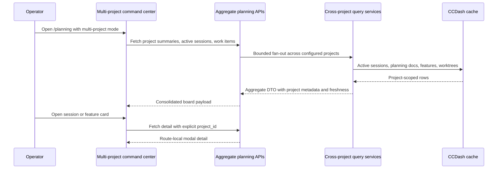

# PRD: Multi-Project Planning Command Center V1

## 1. Executive Summary

Multi-Project Planning Command Center V1 turns the recently completed single-project command center into an all-project operations cockpit. It lets an operator see every configured project, every live active session across those projects, and the next follow-up work needed for each active feature or session from one screen.

The feature is feasible with the existing V1 command-center contract, system-wide metrics fan-out, live active-count primitive, watcher rebind, and Planning Agent Session Board. The implementation must be backend-aggregate-first and performance-budgeted: the browser should not loop over every project endpoint, and the active-session board should query only active/recent sessions instead of building every full project board.

**Priority:** HIGH

**Key Outcomes:**
- Operators can monitor all active sessions across all configured projects from a consolidated board.
- Planning work items can be filtered by all projects, project group, or individual project without switching active project.
- Project color/group metadata makes cross-project status scannable.
- Cards expose enough session, feature, phase, plan, transcript, worktree, and follow-up data to keep operating without leaving the screen.
- Performance remains predictable at current scale and has clear promotion thresholds for future rollups.

## 2. Context And Background

### Current State

Planning Command Center V1 is implemented as an additive `/planning` cockpit. It exposes `GET /api/agent/planning/command-center` and `GET /api/agent/planning/command-center/{feature_id}`, rendered by `services/planningCommandCenter.ts` and `components/Planning/CommandCenter/PlanningCommandCenter.tsx`.

The V1 surface is project-scoped. It shows command-center work items for whichever project is active or explicitly selected. It does not yet answer "what is running right now across all projects?" or "which project needs my attention next?"

CCDash already has cross-project primitives:

1. `SystemMetricsQueryService` aggregates active counts across all configured projects with bounded fan-out, cache, per-project errors, and stale indicators.
2. `SessionsRepository.count_active()` and the live active-count contract define the active-session freshness window.
3. Watcher rebind on project switch is completed, making the active project trustworthy after a switch.
4. `PlanningSessionQueryService` builds session cards and correlation evidence for one project.
5. `ProjectManager` and `/api/projects` expose configured projects from `projects.json`.

### Problem Space

Operators often run agent sessions across multiple repos. Today, they must switch projects, reload planning/session boards, and manually track which project has active work or follow-up. That is exactly the context-switching burden the command center was designed to reduce, but V1 only reduces it inside one project.

### Current Alternatives / Workarounds

- Use the Dashboard system metrics chip for all-project counts, then switch projects manually to inspect sessions.
- Open `/planning` for one project at a time.
- Use session search or raw transcript inspection for active cross-project work.
- Keep external notes about which project has which worker or follow-up task.

These workarounds are too slow for an operator coordinating multiple live sessions.

## 3. Problem Statement

As a CCDash operator coordinating AI work across multiple projects, when I open the planning command center, I can only operate the currently selected project instead of seeing all live sessions, workers, and follow-up work across the configured project set.

Technical root causes:

- `PlanningCommandCenterQueryService` resolves a single project scope per request.
- `PlanningSessionQueryService` builds one full project board at a time and loads up to 500 sessions, which is too heavy for naive all-project fan-out.
- Project display metadata is not modeled, so the UI has no durable color/group semantics.
- Existing detail panels assume active or route-local project context; a cross-project cockpit needs explicit `project_id` on every detail fetch.
- Current command-center frontend fetching is manual component state; all-project mode needs shared query keys, dedupe, and invalidation.

## 4. Goals And Success Metrics

### Primary Goals

**Goal 1: All-project command center scope**
- Show command-center work items across every configured project.
- Filter by all projects, project group, project, status, phase, launch readiness, active sessions, stale state, and owner/tag where available.

**Goal 2: Consolidated active-session board**
- Show every active/recent session across all projects in one live board.
- Represent worker/subagent relationships on the card or in the card expansion.
- Provide enough context to decide whether to wait, inspect transcript, launch follow-up, review, or close out.

**Goal 3: Project identity and grouping**
- Provide deterministic project colors and grouping by default.
- Allow optional custom project color, group label, and sort order.
- Surface stale or error states at project-chip and card level.

**Goal 4: Modal access to existing detail**
- Keep users on one screen by opening project-scoped session, feature, plan, launch, and execution detail in route-local drawers/modals.
- Do not switch the process-global active project just to inspect a card.

**Goal 5: High performance**
- Use backend aggregate endpoints, bounded fan-out, active-only session queries, pagination, cache, and frontend virtualization where needed.

### Success Metrics

| Metric | Baseline | Target | Measurement Method |
|--------|----------|--------|--------------------|
| All-project active sessions visible | Not available | Consolidated board renders active sessions from all configured projects | Browser smoke with multi-project fixture |
| Aggregate command-center p95 | N/A | < 500 ms uncached at 36 projects, < 75 ms cached | Backend performance test |
| Active-session board p95 | N/A | < 250 ms uncached at 36 projects, < 50 ms cached | Backend performance test |
| Browser initial render | Single-project only | < 1.5 s to usable state at 100 work items / 100 session cards | Playwright smoke and performance marks |
| Error isolation | N/A | One project failure yields partial status, not total failure | Unit/integration test |
| Freshness visibility | System metrics only | 100% of stale project entries render warning state in project filters and cards | Component and browser tests |

## 5. User Personas And Journeys

### Primary Persona: Multi-Project Operator

- Role: Developer or lead coordinating agent sessions across repos.
- Needs: See what is running, where it is running, and what needs a follow-up command.
- Pain points: Project switching hides work, stale sessions are easy to trust accidentally, and transcript/plan lookup is manual.

### Secondary Persona: Review Coordinator

- Role: Maintainer closing out implementation sessions across multiple projects.
- Needs: Find review-ready work, open PR/session/plan context, trigger review agents, and track closeout.

### High-Level Flow

## 6. Requirements

### 6.1 Functional Requirements

| ID | Requirement | Priority | Notes |
|----|-------------|----------|-------|
| FR-1 | Add `GET /api/agent/planning/multi-project/command-center` for aggregate command-center work items. | Must | Must not require active project switching. |
| FR-2 | Add `GET /api/agent/planning/multi-project/session-board` for active sessions across projects. | Must | Active/recent only by default. |
| FR-3 | Aggregate responses include project metadata: id, name, color, group, sort order, stale state, warning/error state, and counts. | Must | Deterministic fallback color required. |
| FR-4 | Persist optional project display config for color, group label, and sort order. | Should | Store in `projects.json` via `ProjectDisplayConfig`; support unset fallback. |
| FR-5 | The consolidated active-session board shows root sessions and worker/subagent summaries. | Must | Default primary cards should avoid duplicate visual noise from worker sessions. |
| FR-6 | Active-session cards expose session state, model, agent, duration, tokens, context utilization, recent activity, correlated feature/phase, confidence, next follow-up, and links. | Must | Card must be enough to operate from the board. |
| FR-7 | Work-item cards include project metadata and preserve V1 command, phase, worktree, PR, blockers, related files, and launch/review affordances. | Must | Reuse V1 DTO semantics. |
| FR-8 | Filters support all projects, project group, project, status, phase, launch readiness, active-session state, stale state, agent, model, and text search. | Must | URL-addressable filters required. |
| FR-9 | Views include consolidated board, dense list, project matrix, and per-project tabs/chips as filters. | Should | Tabs are filters, not the default IA. |
| FR-10 | Opening a card shows route-local detail with explicit project scope. | Must | No implicit active-project switch. |
| FR-11 | The UI provides direct access to transcript, feature modal, plan/document modal, execution workbench, launch sheet, PR/review controls, and stale-project details where available. | Must | Existing modals should be reused. |
| FR-12 | Aggregate endpoints return partial success when individual projects fail. | Must | Per-project errors must be visible. |
| FR-13 | Aggregate reads are cached and expose freshness metadata. | Must | Cache TTL default 30 seconds. |
| FR-14 | Feature flag controls the multi-project mode and allows fallback to V1. | Must | Required due to broad surface area. |
| FR-15 | Command-center fetching uses shared query hooks/query keys before all-project mode ships. | Must | Avoid manual fetch duplication and cache drift at portfolio scale. |
| FR-16 | Aggregate list payloads avoid expensive off-page enrichment such as git probes unless explicitly requested. | Should | Detail drawers can lazy-load deep git/worktree state. |

### 6.2 Non-Functional Requirements

**Performance**
- Backend fan-out must be bounded by a configurable concurrency limit.
- The browser must not issue one command-center or session-board request per project on page load.
- The active-session board must query active/recent sessions only.
- Aggregate command-center results must be paginated and sorted server-side.
- Frontend card lists must virtualize or window when visible cards exceed 250.
- Git state probing must be lazy or page-bounded in all-project mode.

**Reliability**
- Stale data is never presented as authoritative.
- A project with invalid paths, failed query, or stale sessions produces an explicit warning, not a blank board.
- Existing single-project command-center behavior remains available.
- V1 does not require simultaneous watch-all-project runtime behavior; stale indicators are the trust contract until that separate topology is planned.

**Accessibility**
- Project color cannot be the only differentiator; labels and accessible names are required.
- Boards and grouped project filters must support keyboard traversal and focus restoration after modal close.

**Observability**
- Add spans for aggregate command-center fetch, active-session aggregate fetch, per-project fan-out, cache hit/miss, and detail modal fetch.
- Log project count, active project count, stale project count, item count, card count, duration, and partial/error count.

## 7. Scope

### In Scope

- Multi-project planning command center aggregate API.
- Multi-project active-session board aggregate API.
- Project display metadata with deterministic fallback and optional persisted overrides.
- Planning screen UI for consolidated operation, project filters/groups, and project-scoped modals.
- Active-session cards with worker/subagent summaries.
- Performance tests, frontend tests, and browser smoke.
- Feature flag and fallback path.

### Out Of Scope

- Simultaneously watching all project filesystems.
- Background rollup tables for planning work items.
- Full project-management CRUD unrelated to planning/session operations.
- Generic git client behavior beyond existing worktree/PR context.
- Remote multi-tenant authorization redesign.
- Replacing existing `/execution`, `/board`, or single-project command center surfaces.

## 8. Dependencies And Assumptions

### Internal Dependencies

- Planning Command Center V1 is completed and remains the single-project compatibility surface.
- System-wide metrics, live active-count, and watcher rebind are completed primitives.
- Planning Agent Session Board card/correlation DTOs are available for reuse/refactor.
- `projects.json` remains the configured project registry.

### Assumptions

- Current project count is within the in-process fan-out range documented by system-wide metrics.
- Operators value the consolidated default more than project-by-project tabs.
- Project display customization can start with small metadata fields rather than a new table.
- Session "active" means status is active/running/thinking/in-progress and updated within the configured live-agent window unless a caller explicitly requests a broader window.

### Feature Flags

- `CCDASH_MULTI_PROJECT_PLANNING_COMMAND_CENTER_ENABLED` defaults false until validation is complete.
- Frontend uses the backend capability/flag response to hide or show multi-project controls.

## 9. Target State

Opening `/planning` shows the existing planning shell plus a multi-project command center mode. The default view is a consolidated operations board:

1. Project filter rail/chips with `All`, group filters, and individual project chips.
2. Active Sessions board with cards grouped by state by default, optionally by project, feature, phase, agent, or model.
3. Follow-up Work board/list showing command-center work items across projects.
4. Detail drawers for session, feature, plan, launch, and review actions, all project-scoped.
5. Stale/error indicators on projects and cards.

## 10. Open Questions

| ID | Question | Recommended Answer |
|----|----------|--------------------|
| OQ-1 | Should worker/subagent sessions appear as separate primary cards? | Default no. Nest workers under root sessions; add a toggle to show workers as primary cards. |
| OQ-2 | Should project display metadata be backend-persisted or local-only? | Persist optional metadata in `projects.json`; deterministic fallback avoids migration pain. |
| OQ-3 | Should the multi-project screen replace V1 command center? | No. It is a mode/layer above V1 and should feature-flag fallback to V1. |
| OQ-4 | What happens for stale non-active projects? | Show stale indicators and include cards only if active/recent rows pass the freshness window. Provide a manual resync follow-on, not in v1. |
| OQ-5 | When should rollup tables replace in-process fan-out? | Promote when project count exceeds about 100 or p95 aggregate reads exceed budgets in CI/runtime. |

## 11. Risks And Mitigations

| Risk | Impact | Likelihood | Mitigation |
|------|--------|------------|------------|
| Browser fan-out creates slow page loads | High | Medium | Single aggregate endpoints only; TanStack Query dedup; cached backend service. |
| Full session-board reuse loads too much data | High | High if naive | Add active-only repository query and aggregate card builder. |
| Stale non-active project rows mislead operators | High | Medium | Reuse live window, stale indicators, project warnings, and watcher rebind state. |
| Project-scoped modals accidentally switch active project | Medium | Medium | Every detail fetch carries explicit `project_id`; tests assert no project switch. |
| Project colors fail accessibility | Medium | Low | Color plus labels; contrast tests; color is accent only. |
| DTO drift between backend and frontend | Medium | Medium | Freeze aggregate DTOs early and add FE/BE contract tests. |

## 12. Acceptance Criteria

1. `/planning` can show multi-project mode without changing the active project.
2. The active-session board displays active sessions from at least three configured projects in a fixture.
3. Worker/subagent relationships are visible on root session cards or via card expansion.
4. Work-item cards show project identity and preserve V1 command-center data.
5. Project filters include all, group, and individual project choices.
6. Stale/error projects render explicit warnings.
7. Opening feature/session/plan detail fetches with explicit `project_id`.
8. Aggregate backend performance meets the p95 targets in tests.
9. Frontend handles 100 work items and 100 active-session cards without layout overlap or unusable scroll.
10. Feature flag off returns the user to existing V1 behavior.

## 13. Feasibility Verdict

Feasibility is high if this ships as a backend aggregate with active-only session reads and explicit project-scoped detail calls. It is not advisable to implement this as a frontend loop over every existing project board. The recommended estimate is 24 to 28 points, with most risk concentrated in data-contract shaping, active-session performance, and cross-project modal scope.
