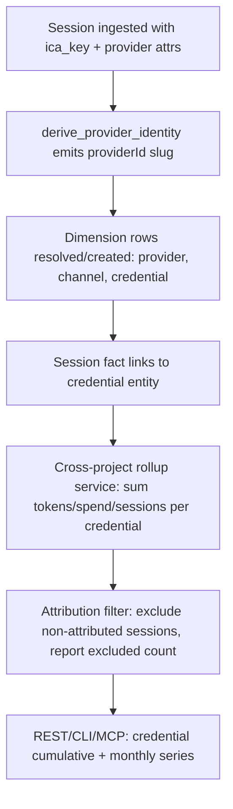

# Feature Brief & Metadata

**Feature Name:**

> Provider, Channel & Credential Entities (v1)

**Filepath Name:**

> `provider-channel-credential-entities-v1`

**Date:**

> 2026-08-10

**Author:**

> prd-writer (agent), on behalf of Nick Miethe

**Related Epic(s)/PRD ID(s):**

> Tracker node `node_01KZKZC504A3G77J6Y5VGNEDNA` (tree `tree_01KVTH95F7P7CXK3QH9ZMECM5T`)

**Related Documents:**

> - `docs/project_plans/adrs/adr-006-db-authoritative-project-registry.md` — cross-project registry pattern this feature's rollup reuses
> - `docs/project_plans/adrs/adr-007-db-write-failure-surfacing-standard.md` — write-path standard the new dimension tables must follow
> - `docs/project_plans/adrs/adr-019-provider-correlation-home-ccdash.md` (accepted 2026-08-10 — see §AC4 Decision below; **016–018 are reserved** by an unrelated tracker node, `node_01KZEXVPHVYAXR7QSKDT5FJ2G9`)

---

## 1. Executive Summary

CCDash today treats provider, channel, model, and credential as **attributes stamped on a session row** — derivable, but never addressable on their own. This feature promotes provider, channel, and credential to **entities with their own identity, history, and rollups**, so a question like "what has key CC3 spent, cumulatively and month over month, across every project?" can be answered directly instead of being phrased as a session-table aggregation. The hierarchy is **provider** (Anthropic/OpenAI/Google/IBM) → **channel** (subscription/ica/api) → **credential** (an ICA key name, a subscription seat, an API key); sessions become facts that reference these entities rather than the entities being inferred from sessions after the fact.

**Priority:** MEDIUM

**Key Outcomes:**
- Outcome 1: A key or channel is a queryable object — cumulative/periodic spend, tokens, and session counts per credential, across every project, without a session-level `GROUP BY`.
- Outcome 2: The provider/channel vocabulary already derived by `derive_provider_identity` is promoted (persisted, registered as dimension rows) rather than re-invented — one vocabulary, two consumers (runtime derivation, entity rollup).
- Outcome 3: A credential rotation (CC-key retired, new key issued for the same lane) is a continuous series in the rollup, not two disconnected ones.

---

## 2. Context & Background

### Current State

Provider identity is derived, not stored. `backend/model_identity.py:209` `derive_provider_identity(raw_model, platform_type, launcher, model_variant)` is documented (`backend/model_identity.py:217-222`) as "the single derivation path for provider identity in the backend." It emits a `providerId` slug of shape `"{vendor}:{surface}:{channel}"`, plus `providerVendor` / `providerSurface` / `providerChannel` / `providerLabel` — all computed at read time from closed vocabularies: vendor from `_PROVIDER_VENDOR_TOKENS` (`model_identity.py:115-120`: Anthropic/OpenAI/Google/Unknown), surface from `_PROVIDER_SURFACE_LABELS` (`model_identity.py:122-125`: Claude Code/Codex), channel from `_provider_channel` (`model_identity.py:160`: `subscription|ica|api|unknown`). The frontend carries a parallel type mirror at `lib/providerIdentity.ts:26-38` (`ProviderIdentity` + `ProviderChannel`) — any change to the axes is a two-file change today, and will remain one.

No provider column is persisted anywhere. `backend/routers/analytics.py:407` (`_PROVIDER_DIMENSIONS`) and `_provider_dimension_key` (`analytics.py:426`) recompute the same derivation per row, purely to serve two endpoints — `GET /api/analytics/series` (`group_by`) and `GET /api/analytics/breakdown` (`dimension`). That is the entire current provider-identity read surface: two aggregation endpoints, no addressable entity.

Credential identity already exists as a session attribute, shipped in v51 (tracker node `node_01KZKZC4HFBD5188B1SPTBNEZ8`, completed): `sessions.ica_key` (values `CC1`..`CC6`, the key **name**, never secret bytes) plus `ica_spend_start`/`ica_spend_end`/`ica_spend_delta`/`ica_spend_attribution`. The attribution vocabulary is closed and precedence-ordered in `backend/parsers/ica_spend.py:121` `decide_attribution(*, start_reading, end_reading, key_changed=False, shared_key_overlap=False)`: `incomplete_readings` → `key_changed` → `concurrent_shared_key` → `attributed`. `ica_spend_delta` is populated **only** for the `attributed` verdict — every other verdict stores `NULL`. That "never silently divided" invariant is structural today at the session level; this feature must not weaken it when it rolls sessions up into a credential-level series.

**What is missing**: (1) no persisted dimension row for provider/channel/credential — only per-row derivation; (2) no addressable identity a caller can hold onto and ask questions of directly; (3) no rollup that survives credential rotation, because there is no lineage pointer between an old credential name and its successor.

### Problem Space

Nick needs to ask three kinds of questions that the session-attribute model cannot answer directly:
1. **Cumulative and month-over-month spend of key `CC3`** across every session and every project — today this requires a hand-written aggregation over `sessions.ica_key = 'CC3'` per project, re-derived each time, with no month-over-month framing and no cross-project join built in.
2. **Which channel carries which classes of work, and how that has shifted** — today `providerChannel` exists only as a per-row derived label inside two analytics endpoints; there is no channel-level object to compare over time.
3. **Continuity of a key's series across rotation** — when CC3 is retired and CC4 issued for the same lane, nothing in the schema says these are sequential chapters of one story; a rollup today would silently see two unrelated keys.

### Current Alternatives / Workarounds

The only workaround is a bespoke SQL aggregation against `sessions` per question, re-deriving provider identity inline and manually unioning old/new credential names when rotation is known out-of-band. This is fragile (easy to omit the attribution-exclusion rule from §6.2 NFR-1), not reusable across REST/CLI/MCP, and has no persisted identity to link other entities against (e.g., IntentTree node ↔ credential cost attribution, mirroring the existing intent-node ↔ session pattern).

### Architectural Context

- **Routers → Services → Repositories** — new reads follow the transport-neutral convention: land in `backend/application/services/agent_queries/` first, then wire to REST/CLI/MCP (per CLAUDE.md).
- **Cursor Pagination** — `{ items, cursor, limit, nextCursor }` envelope, matching `/transcript` and `/tool-calls`.
- **DB-authoritative registry** — `backend/application/services/agent_queries/system_metrics.py:339,435` iterates `ports.workspace_registry.list_projects()` under `@memoized_query`; this is the pattern the cross-project credential rollup reuses (ADR-006).

---

## 3. Problem Statement

Provider, channel, and credential are facts CCDash already has the raw data for, but not the identity to ask about directly.

**User Story Format:**
> "As Nick, when I ask what a specific ICA key has cost across every project this month, I get told to write a session aggregation query instead of asking the key directly."

**Technical Root Cause:**
- Provider identity is a pure function of session attributes (`derive_provider_identity`), never persisted or given a row of its own.
- Credential identity exists as a session column (`sessions.ica_key`) with no dimension table, no rotation-lineage pointer, and no cross-project rollup service.
- Files involved: `backend/model_identity.py`, `lib/providerIdentity.ts`, `backend/routers/analytics.py`, `backend/parsers/ica_spend.py`, `backend/db/sqlite_migrations.py`, `backend/db/postgres_migrations.py`.

---

## 4. Goals & Success Metrics

### Primary Goals

**Goal 1: Addressable identity**
- Provider, channel, and credential each have their own identity/dimension row, independent of any single session.
- Success: a caller can look up a credential by name and get back an object, not a query template.

**Goal 2: Promote, don't duplicate, the existing vocabulary**
- The `providerId` slug and its constituent axes (`providerVendor`/`providerSurface`/`providerChannel`) become the dimension key — no parallel enum.
- Success: a code-review diff shows zero new vendor/surface/channel string literals outside the existing closed vocabularies in `model_identity.py`.

**Goal 3: Rotation-safe cross-project rollup**
- A credential's cumulative and periodic (e.g., monthly) spend/token/session counts are readable across every registered project and survive a key-name rotation as one continuous series.
- Success: rolling up CC3 → CC4 (declared as a rotation) returns one series; rolling up two genuinely unrelated keys does not merge.

### Success Metrics

See `success_metrics` in frontmatter (mirrored here for readability):

| Metric | Baseline | Target | Measurement Method |
|--------|----------|--------|-------------------|
| Cross-project per-credential rollup query | Not possible without hand-written SQL | Single API/CLI/MCP call returns cumulative + monthly series for a named credential | Manual + integration test against seeded multi-project fixture |
| New provider vocabulary introduced | N/A | 0 | Code review checklist against `_PROVIDER_VENDOR_TOKENS`/`_PROVIDER_SURFACE_LABELS`/`_provider_channel` |
| Rotation continuity | N/A (no lineage today) | 1 continuous series across a declared rotation | Test: seed CC3 sessions, declare rotation to CC4, seed CC4 sessions, assert one series |
| ADR-019 exists | N/A | `status: accepted`, decision + rationale recorded | Landed accepted 2026-08-10 |

---

## 5. User Personas & Journeys

### Personas

**Primary Persona: Nick (operator / cost owner)**
- Role: runs and pays for the credentials (ICA keys, subscription seats, API keys) that power every agent session across every project.
- Needs: ask "what has this key cost me" and "what shifted between channels" without writing SQL each time.
- Pain Points: today's answer is always an aggregation query, re-derived per question, blind to rotation.

**Secondary Persona: An agent query surface (CLI/MCP/REST consumer)**
- Role: a downstream tool (e.g., IntentTree cost attribution, a future budget feature) that needs a stable credential identity to link against.
- Needs: a `credential_id`/`channel_id`/`provider_id` it can hold a reference to, matching the existing intent-node ↔ session cost-attribution pattern.
- Pain Points: no such identity exists today to link against; only a raw session column.

### High-level Flow

---

## 6. Requirements

### 6.1 Functional Requirements

| ID | Requirement | Priority | Notes |
| :-: | ----------- | :------: | ----- |
| FR-1 | Persist a `provider` dimension keyed on the vendor/surface axes already emitted by `derive_provider_identity` (`model_identity.py:209`). | Must | No new vendor/surface vocabulary; reuse `_PROVIDER_VENDOR_TOKENS`/`_PROVIDER_SURFACE_LABELS`. |
| FR-2 | Persist a `channel` dimension keyed on `(provider, providerChannel)` reusing `_provider_channel` (`model_identity.py:160`). | Must | Channel values: `subscription\|ica\|api\|unknown`. Unknown channel must not fail — see NFR-4. |
| FR-3 | Persist a `credential` dimension keyed on `(channel, credential_name)`, where `credential_name` is the identifier already captured on sessions (`sessions.ica_key` for ICA; extend the same shape for subscription seats and API keys). | Must | Per Ground Truth #5: identity is the NAME, never secret bytes. |
| FR-4 | Add a rotation-lineage pointer on the credential row (e.g., `supersedes_credential_id` / `superseded_by_credential_id`) so a declared rotation links two credential rows into one lineage. | Must | This is the feature's hard algorithmic core (see Risks). Declaration mechanism is an open question (see `open_questions`). |
| FR-5 | Register/persist the existing `providerId` slug (`"{vendor}:{surface}:{channel}"`) as the dimension key connecting provider → channel → credential, rather than minting a new key format. | Must | Satisfies AC2 directly. |
| FR-6 | Backfill dimension rows from existing `sessions` rows (provider/channel always; credential wherever `ica_key` or equivalent is present). | Must | Sessions with no captured credential (pre-v51 or launcher-not-activated) get no credential row — not an error. |
| FR-7 | Add a cross-project, transport-neutral read surface returning, per credential: cumulative spend/tokens/session count, and the same broken out by month. | Must | Lands in `backend/application/services/agent_queries/` first (transport-neutral convention), then REST (and CLI/MCP as follow-on wiring). |
| FR-8 | The rollup excludes any session whose `ica_spend_attribution` is not `attributed` from spend sums, and separately reports the excluded-session count. | Must | Directly enforces the shipped `decide_attribution` invariant (Ground Truth #6) at the rollup layer. |
| FR-9 | The rollup follows a rotation lineage: querying either credential name in a declared rotation returns the same combined series. | Must | AC3's "surviving key rotation as a continuous series." |
| FR-10 | Advertise the new read surface via `GET /api/v1/capabilities` per the existing capability-advertisement convention. | Should | Matches `sessions:detail`/`sessions:tool-calls` pattern; consumers must not hard-fail on the new string. |
| FR-11 | Author ADR-019 recording the correlation-home decision (§ below), `status: accepted` — landed 2026-08-10. | Must | Satisfies AC4. Numbered 019 because 016–018 are reserved by an unrelated tracker node. |

### 6.2 Non-Functional Requirements

**NFR-1 (spend-rollup integrity, non-negotiable):** Any spend rollup MUST exclude sessions whose `ica_spend_attribution` is not `attributed` from the spend sum, and MUST report the excluded-session count alongside the total. A rollup that silently sums over `NULL` deltas, or hides how many sessions were excluded, violates the shipped invariant (`backend/parsers/ica_spend.py:121`) and is a regression, not a simplification.

**NFR-2 (dual DDL, same change set):** Every new column/table lands in both `backend/db/sqlite_migrations.py` and `backend/db/postgres_migrations.py` in the same change, plus a `COLUMN_PARITY_DRIFT_ALLOWLIST` entry per project convention. `SCHEMA_VERSION` moves 51 → 52.

**NFR-3 (write-path standard):** Every new write path uses `backend/db/repositories/base.py:retry_on_locked` and ships a direct-count assertion test (ADR-007).

**NFR-4 (unknown-vocabulary tolerance):** Consumers must not hard-fail on an unknown channel value or an unknown attribution verdict — unknown means unknown, never an exception. Matches the shipped `effort_tier_source` and `ica_spend_attribution` contracts.

**NFR-5 (no secrets in the entity layer):** Credential names are identifiers, not secrets. No secret material may enter any dimension table, log line, or API response for this feature.

**NFR-6 (transport-neutral first):** New cross-domain reads land in `backend/application/services/agent_queries/` before any router/CLI/MCP wiring, per the shared convention.

**Observability:**
- Structured logs for rotation declarations (which credential superseded which) — this is a durable business fact, not noise.
- No spend/token values in log lines beyond aggregate counts (mirrors the existing redaction-event convention: counts, never payload).

---

## 7. Scope

### In Scope

- The three entity dimensions (provider, channel, credential) and their identity.
- Persisting/registering the existing `providerId` slug as the dimension key (FR-5).
- Credential rows keyed `(channel, credential_name)` with a rotation-lineage pointer (FR-4).
- A cross-project, per-credential rollup read surface (transport-neutral service + REST; capability advertisement).
- ADR-019 (correlation-home decision, `status: accepted`).
- Dual SQLite + Postgres DDL, `SCHEMA_VERSION` 51 → 52.
- Backfill of dimension rows from existing `sessions` data.

### Out of Scope

- **Frontend/UI surfacing of any of this.** Sibling tracker node `node_01KZP4DXZ2V7M6Q4KWWTF86J4Y` already owns surfacing ICA key + spend in the session UI; this PRD is data-model/read-surface only.
- **Budgets and remaining-headroom calculations.** The entities enable the question ("what has this credential spent"); a budget/headroom object that answers "how much is left" is a follow-on feature built on top of this one.
- **Provider reliability records** (429 rates, failure modes over time). CCDash does not capture provider-side rate-limit responses today; this would need new capture first, and is a separate PRD.
- **Changing how provider identity is derived.** The axes (`providerVendor`/`providerSurface`/`providerChannel`) are promoted as-is (AC2) — this PRD does not touch `derive_provider_identity`'s logic, only what happens to its output afterward.

---

## 8. Dependencies & Assumptions

### Internal Dependencies

- **v51 ICA key + spend capture** — tracker node `node_01KZKZC4HFBD5188B1SPTBNEZ8`, **completed**. Provides `sessions.ica_key` and the `ica_spend_*` columns this feature rolls up.
- **Launcher activation (out-of-repo)** — tracker node `node_01KZP4D3BN6QYJAHC4FCRNGZNW`, **not yet shipped**. Requires `export CCDASH_LAUNCH_ICA_KEY="${ICA_KEY:-}"` in `~/ica-claude.sh` plus a `SessionEnd` hook registration in `~/.claude/settings.json`. **Until this lands, `ica_key` is NULL on every session row.** The entity model and rollup mechanism can be built and tested against seeded/synthetic data now, but AC3's live series cannot be demonstrated against real traffic until the launcher activation ships. This is a hard dependency, stated plainly: modelling can land, the series cannot yet be demonstrated end-to-end on real data.
- **ADR-006 (DB-authoritative registry)** — the cross-project rollup's project enumeration reuses `workspace_registry.list_projects()`.

### Assumptions

- Rotation is rare enough that a declared (not auto-inferred) lineage pointer is acceptable — see `open_questions`.
- Subscription seats and API keys will eventually populate the same `(channel, credential_name)` shape as ICA keys, even though no capture path for those exists yet; this PRD's schema must not be ICA-specific (per Ground Truth #5).

### Feature Flags

- None required for this backend/data-model change; a flag may be introduced if the rollup read surface needs a staged rollout, decided at implementation-plan time.

---

## 9. Risks & Mitigations

| Risk | Impact | Likelihood | Mitigation |
| ----- | :----: | :--------: | ---------- |
| Rotation-lineage design is the one genuinely hard part — a wrong model either merges unrelated keys or fails to link a real rotation. | High | Medium | Treat as the plan's algorithmic core (H3-flagged); require an explicit declare-rotation action rather than inference in v1 (see open question); write both a positive (real rotation) and negative (two unrelated keys) test. |
| Silent spend-sum-over-NULL regression if a future contributor forgets the attribution filter. | High | Medium | NFR-1 is non-negotiable and test-covered with a direct-count assertion (ADR-007 pattern); rollup service is the single place attribution filtering happens — no duplicate implementations. |
| Schema drift between SQLite and Postgres DDL. | Medium | Low | NFR-2 mandates same-change-set dual DDL + `COLUMN_PARITY_DRIFT_ALLOWLIST` check, per existing project convention. |
| AC3's live demonstration is blocked on an out-of-repo dependency (launcher activation) outside this PRD's control. | Medium | High (until launcher ships) | Documented as a hard dependency (§8); acceptance criteria for this PRD are satisfied by the modelling + seeded-data demonstration, not by live production data. |
| ADR-019's recommendation (CCDash-as-home) is presented as settled when it is not yet accepted. | Low | Low | **RETIRED 2026-08-10** — Nick accepted the decision; ADR-019 landed `status: accepted`. Row kept for traceability. |

---

## 10. Target State (Post-Implementation)

**User Experience:**
- Nick (or any consumer) asks for a named credential's cumulative and monthly spend/token/session totals across every project in one call — no session-level SQL.
- A rotation from CC3 to CC4 reads as one series once declared.

**Technical Architecture:**
- Three new/promoted dimension tables (provider, channel, credential) following the `pricing_catalog_entries` pattern (`backend/db/sqlite_migrations.py:1050-1069` — `UNIQUE`-keyed reference table with `source_type`/`sync_status` lineage columns) as the nearest existing analog.
- `derive_provider_identity`'s output (`providerId` slug) is the dimension key; no second vocabulary.
- A rollup service in `backend/application/services/agent_queries/` reads across every registered project (ADR-006 pattern) and applies the attribution-exclusion filter (NFR-1) before summing.
- ADR-019 exists, `status: accepted`, recording the correlation-home decision and its rationale.

**Observable Outcomes:**
- `SCHEMA_VERSION` is 52.
- A new capability string is advertised via `GET /api/v1/capabilities`.
- Dimension rows exist for every distinct provider/channel/credential seen in `sessions`, backfilled once.

---

## 11. Overall Acceptance Criteria (Definition of Done)

**These four ACs are reproduced verbatim from the tracker node and are the definition of done for this PRD:**

- **AC1**: Provider, channel and credential exist as addressable dimensions with their own identity, so a question can be asked of a key or a channel without aggregating a session query.
- **AC2**: The existing providerVendor/providerSurface/providerChannel axes are promoted rather than duplicated — no parallel vocabulary for the same concepts.
- **AC3**: Cumulative and periodic spend/token/session counts are readable per credential across projects, surviving key rotation as a continuous series.
- **AC4**: The decision on whether correlation lives in CCDash or elsewhere is recorded with its reason, not left implicit.

### Technical Acceptance

- [ ] Follows router → service → repository layering; new reads land in `agent_queries/` first (NFR-6).
- [ ] Dual SQLite + Postgres DDL in the same change set (NFR-2); `SCHEMA_VERSION` 51 → 52.
- [ ] New write paths use `retry_on_locked` + direct-count assertion test (NFR-3).
- [ ] No secret material in any new table/log/response (NFR-5).

### Quality Acceptance

- [ ] Positive rotation-continuity test (declared CC3→CC4 rotation yields one series).
- [ ] Negative rotation test (two undeclared, unrelated credentials do not merge).
- [ ] Attribution-exclusion test: a seeded mix of `attributed`/`key_changed`/`concurrent_shared_key`/`incomplete_readings` sessions produces a spend sum over only `attributed` rows plus a correct excluded count.
- [ ] Unknown-channel / unknown-attribution-token inputs do not raise.

### Documentation Acceptance

- [x] ADR-019 authored and accepted 2026-08-10, `status: accepted`.
- [ ] CHANGELOG `[Unreleased]` entry present (per `changelog_required: true`).
- [ ] CLAUDE.md convention entry added for the new dimension tables + rollup surface, mirroring the existing v51 entry style.

---

## AC4 — Decision on Correlation Home (ADR-019, `status: accepted`)

**Recommendation: CCDash is the correlation home, not only the ingest home.**

Reasons, in order of weight:
1. CCDash already owns the fact table (`sessions`) and the only per-session spend readings that exist anywhere.
2. CCDash already owns the DB-authoritative cross-project registry (ADR-006), which is precisely the join AC3 needs.
3. Ingest is already settled as CCDash by the requester, so siting analysis elsewhere would mean exporting the fact table to a second system and keeping two schemas in step.
4. The existing provider axes and their single derivation path (`derive_provider_identity`) already live here; an external home would either duplicate that function or depend on CCDash to pre-derive it for export anyway.

**Counter-position, stated honestly:** an external warehouse would be the right call if provider rollups needed to join against data CCDash does not hold — billing invoices, provider-side rate-limit records. That is not the current need. The decision should be revisited if it becomes one.

**This decision was accepted by Nick on 2026-08-10** and is recorded at `docs/project_plans/adrs/adr-019-provider-correlation-home-ccdash.md` with `status: accepted` (numbered 019 because 016–018 are reserved by unrelated tracker node `node_01KZEXVPHVYAXR7QSKDT5FJ2G9` — do not renumber).

---

## 12. Assumptions & Open Questions

### Assumptions

- See §8 Dependencies & Assumptions above.

### Open Questions

See `open_questions` in frontmatter (mirrored here):

- [ ] **Q1**: Is rotation lineage declared manually (an explicit action naming the predecessor) or inferred automatically?
  - **A**: TBD — leaning manual for safety against false-continuity claims; decide at implementation-plan time.
- [ ] **Q2**: Does the rollup API need an `exclude_unattributed=false` debug escape hatch?
  - **A**: TBD.
- [ ] **Q3**: Lazy vs. eager dimension-row backfill?
  - **A**: TBD — affects rollout NFR.

---

## 13. Appendices & References

### Related Documentation

- **ADRs**: ADR-006 (DB-authoritative registry), ADR-007 (write-failure standard), ADR-019 (this PRD's AC4 decision, accepted 2026-08-10: `docs/project_plans/adrs/adr-019-provider-correlation-home-ccdash.md`)
- **Ground truth sources**: `backend/model_identity.py`, `lib/providerIdentity.ts`, `backend/routers/analytics.py`, `backend/parsers/ica_spend.py`, `backend/db/sqlite_migrations.py`, `backend/application/services/agent_queries/system_metrics.py`

### Prior Art

- `pricing_catalog_entries` (`backend/db/sqlite_migrations.py:1050-1069`) — the nearest existing dimension-table pattern.
- Intent-node ↔ session cost attribution (`backend/application/services/agent_queries/intent_node_cost.py`) — the nearest existing "entity with a cost rollup" precedent, for the credential rollup's shape.

---

## Implementation

### Phased Approach (indicative — refined in the implementation plan)

**Phase 1: Entity schema + promotion**
- Dual DDL for provider/channel/credential dimension tables + rotation-lineage pointer.
- Backfill from existing `sessions`.

**Phase 2: Cross-project rollup service**
- Transport-neutral rollup in `agent_queries/`, attribution-exclusion enforced, rotation-lineage-aware.

**Phase 3: Wiring + ADR**
- REST endpoint(s), capability advertisement, ADR-019, CHANGELOG, CLAUDE.md convention entry.

### Epics & User Stories Backlog

| Story ID | Short Name | Description | Acceptance Criteria | Estimate |
|----------|-----------|-------------|-------------------|----------|
| PCC-001 | Dimension schema | Provider/channel/credential tables, dual DDL, backfill | FR-1..FR-6, NFR-2 | 5-6 pts |
| PCC-002 | Rotation lineage | Lineage pointer + declare mechanism | FR-4, FR-9 | 3-4 pts |
| PCC-003 | Cross-project rollup | Rollup service, attribution filter, cross-project join | FR-7, FR-8, NFR-1, NFR-6 | 4-5 pts |
| PCC-004 | Wiring + ADR-019 | REST/capability advertisement, ADR-019, docs | FR-10, FR-11 | 2-3 pts |

---

**Progress Tracking:**

See progress tracking (once implementation plan exists): `.claude/progress/provider-channel-credential-entities/`
