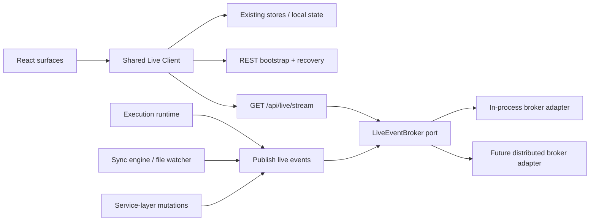

# PRD: SSE Live Update Platform V1

## Executive Summary

CCDash currently delivers "live" behavior through several independent polling loops. That approach was acceptable while live surfaces were sparse, but it now produces duplicated requests, uneven freshness, and unnecessary backend work. The session inspector alone polls full session detail, the execution workbench polls run status and incremental events, global data context polls sessions and features, and test/ops surfaces add their own timers.

This PRD defines a reusable server-sent events platform for CCDash. The target state is one scoped live-update substrate that any surface can adopt: a shared event envelope, topic-based subscriptions, resumable cursors, view-scoped connections, and a frontend client layer that integrates with existing caches and polling fallbacks. The transport is additive, not a rewrite. Existing REST endpoints remain the bootstrap and recovery path; SSE becomes the bounded low-latency update channel.

## Current-State Findings

### Observed Polling Hotspots

1. `contexts/DataContext.tsx` polls sessions every 30 seconds and features every 5 seconds.
2. `components/SessionInspector.tsx` polls live session detail every 5 seconds and also refreshes thread/session lists in the same view.
3. `components/FeatureExecutionWorkbench.tsx` polls active execution runs roughly every 900ms while a run is active.
4. `components/ProjectBoard.tsx` refreshes feature modal data every 15 seconds.
5. `components/TestVisualizer/hooks.ts` polls live test updates every 30 seconds and some broader test health flows every 60 seconds.
6. `components/OpsPanel.tsx` maintains its own operation polling loop.

### Structural Constraints

1. Most live refresh loops are implemented per component rather than through a shared transport or subscription layer.
2. Several endpoints used for "live" behavior return heavyweight read models instead of small deltas.
3. `GET /api/sessions/{id}` in `backend/routers/api.py` reconstructs full session detail from logs, tools, artifacts, and derived metadata on every request.
4. The execution workbench already has an append-only event shape (`after_sequence`) that is a strong candidate for early SSE adoption.
5. `docs/project_plans/implementation_plans/live-update-animations-v1.md` already anticipated a reusable transport abstraction, but transport remained polling-only in that iteration.

## Problem Statement

CCDash has outgrown per-surface timer-based live updates. The current model causes three failures:

1. Live views can produce excessive API traffic and backend recomputation.
2. Each surface implements its own freshness rules, retry behavior, and failure semantics.
3. New live surfaces are incentivized to add more polling instead of plugging into a platform capability.

Without a shared live-update transport, the app will continue to accumulate redundant timers and high-cost GET traffic as more views adopt live behavior.

## Goals

1. Replace ad hoc polling with a reusable SSE-based live-update platform for view-scoped real-time updates.
2. Support multiple CCDash domains through one common event envelope and topic model.
3. Make live updates additive to existing REST read models, not a forced migration to event sourcing.
4. Ensure reconnect, replay, and fallback behavior are predictable and testable.
5. Reduce request volume and expensive read-model recomputation for active views.
6. Leave a clean seam for future hosted/runtime work, including auth and external broker adapters.

## Non-Goals

1. Full bidirectional collaboration or command/control channels.
2. Replacing all polling everywhere in a single release.
3. Delivering WebSocket parity in this iteration.
4. Re-architecting the entire backend around persistent event sourcing.
5. Eliminating existing REST endpoints used for bootstrap and recovery.

## Success Metrics

| Metric | Baseline | Target |
|--------|----------|--------|
| Live session detail requests while viewing one active session | Multi-request polling with expensive full detail fetches | At least 80% reduction in request count |
| Active execution live update cadence | 900ms client polling | One stream connection plus additive event deltas |
| Number of independent polling loops needed for supported live surfaces | Many | One shared live client plus surface-specific fallback only |
| Live event latency after backend publish | Timer-bound | Under 1.5s p95 in local/dev mode |
| Recovery from transient disconnect | Inconsistent per surface | Automatic reconnect with replay or targeted catch-up in under 5s |

## User and System Outcomes

1. Users see fresher live state with fewer visual stalls and less backend churn.
2. Frontend developers gain one reusable subscription API instead of implementing timers repeatedly.
3. Backend developers publish domain events once and let surfaces subscribe by topic.
4. Future runtime/auth work can scope subscriptions by project and principal cleanly.

## Functional Requirements

### FR-1: Shared Live Event Contract

The platform must define a common event envelope used across all live surfaces.

Required fields:

1. `event_id`
2. `topic`
3. `entity_type`
4. `entity_id`
5. `event_type`
6. `occurred_at`
7. `cursor` or sequence token
8. `payload`
9. `delivery_hint` (`append`, `replace`, `invalidate`, `heartbeat`, `snapshot_required`)

Rules:

1. The contract must be additive and versionable.
2. Payloads may be domain-specific, but envelope fields must remain stable.
3. The contract must support both fine-grained deltas and invalidation-only messages.

### FR-2: Topic-Based Subscription Model

The platform must support view-scoped subscriptions using topic strings plus optional filters.

Initial topic families must support at least:

1. `session.{session_id}.transcript`
2. `session.{session_id}.status`
3. `execution.run.{run_id}`
4. `execution.feature.{feature_id}`
5. `feature.{feature_id}`
6. `project.{project_id}.features`
7. `project.{project_id}.tests`
8. `project.{project_id}.ops`

Rules:

1. Clients subscribe only to topics relevant to visible UI.
2. The system must permit one physical stream to carry multiple topics.
3. Topic authorization/scoping must be enforceable at subscribe time.

### FR-3: Reconnect and Catch-Up Semantics

The platform must survive disconnects and browser tab lifecycle events without silently drifting stale.

Requirements:

1. Stream connections send heartbeat frames.
2. Clients reconnect with the last acknowledged cursor or `Last-Event-ID` equivalent.
3. If replay is unavailable or insufficient, the server emits `snapshot_required`.
4. Clients then perform targeted REST refetch rather than full app refresh.

### FR-4: Shared Frontend Live Client

The frontend must expose one reusable live-update client and subscription API.

Requirements:

1. One connection manager per browser tab/process where feasible.
2. Topic subscription ref-counting so multiple consumers share the same underlying stream.
3. Integration points for existing stores/contexts without forcing a global state rewrite.
4. Visibility-aware pause/backoff behavior for inactive tabs or screens.
5. Fallback to existing polling strategy when live transport is unavailable.

### FR-5: Backend Publish Path

The backend must provide a generic publish API so domain code can emit live updates without direct knowledge of transport internals.

Requirements:

1. Introduce a `LiveEventBroker` abstraction.
2. Ship an in-process broker adapter for the current local runtime.
3. Keep room for a future distributed adapter (for example Redis pub/sub) without changing publishers or consumers.
4. Prefer publishing from service/runtime boundaries where data changes already occur.

### FR-6: Domain Adoption in This Iteration

V1 must support at least these adoption surfaces:

1. Execution run detail and incremental event feed.
2. Session transcript append activity and live status.
3. Feature/session modal refresh invalidation.
4. Test run freshness updates for active sessions or filtered live views.
5. Ops/sync operation status refresh.

Global session index invalidation is desirable if it fits without destabilizing the first rollout, but it is not required for acceptance.

### FR-7: Security and Scope

The stream layer must be safe to carry forward into authenticated or hosted runtimes.

Requirements:

1. Stream connections inherit request/project context.
2. Topic access is scoped to the active project and future principal permissions.
3. The client abstraction must not require unauthenticated native `EventSource` as its only option.
4. Sensitive payloads are minimized; when in doubt, publish invalidation and refetch through existing authorized endpoints.

### FR-8: Observability and Operational Controls

The platform must be observable and operable.

Requirements:

1. Track active stream count, subscription count, reconnect count, dropped publish count, and average client lag.
2. Log topic authorization failures and replay misses.
3. Feature-flag transport adoption per surface so rollouts can be staged.
4. Preserve manual refresh controls for operators even after live transport is enabled.

## Non-Functional Requirements

1. Stream implementation must not block unrelated API requests.
2. Heartbeat and keepalive behavior must tolerate local reverse proxies and browser idle timeouts.
3. The solution must work in the current FastAPI/local runtime without requiring a separate message broker.
4. Surface migrations must be incremental and reversible.
5. The architecture must align with the emerging port/adapter direction in `ccdash-hexagonal-foundation-v1`.

## Transport and Product Decisions

### Decision 1: Use SSE as the Server-to-Client Protocol

Rationale:

1. Most CCDash live traffic is server-to-client only.
2. SSE is simpler to operate than WebSockets for scoped append/invalidation events.
3. It maps cleanly to execution/event feeds and transcript append behavior.

### Decision 2: Keep REST for Bootstrap and Recovery

Rationale:

1. Existing read models already support first load.
2. Full replay for every entity is unnecessary in V1.
3. `snapshot_required` plus targeted refetch is more robust than over-designing persistence for every event stream.

### Decision 3: Use a Shared Multiplexed Client

Rationale:

1. Multiple tabs/surfaces should not create duplicate per-topic transport stacks.
2. A shared connection manager gives one place for reconnect, heartbeat, cursor persistence, and fallback rules.

### Decision 4: Support Both Delta and Invalidation Events

Rationale:

1. Some domains naturally emit append-only deltas (`execution.run.*`, transcript logs).
2. Others are better modeled as "something changed, refetch this scoped resource" (`project.*.features`, ops summaries).
3. This keeps V1 broad enough to be reused anywhere else relevant in the app.

## Target Architecture

## Proposed Event Classes

1. `append`
   - Append-only events such as execution output or transcript entries.
2. `replace`
   - Small complete replacement payload for a bounded resource.
3. `invalidate`
   - Signals that a specific read model should refetch.
4. `heartbeat`
   - Keepalive frame with no domain mutation.
5. `snapshot_required`
   - Replay/cursor gap detected; client must recover through REST.

## Scope

### In Scope

1. Shared SSE endpoint and event broker abstraction.
2. Frontend live client, connection manager, and subscription API.
3. Execution, session, feature, test, and ops adoption in phased rollout.
4. Feature flags, metrics, reconnect, and fallback behavior.

### Out of Scope

1. Distributed broker rollout.
2. Hosted deployment topology changes beyond preserving future seams.
3. Replacing every periodic refresh path in one pass.
4. Generic collaborative editing or browser-to-server push channels.

## Sequencing and Dependencies

1. The live transport should reuse the transport-abstraction intent already documented in `live-update-animations-v1`.
2. Execution run events are the best first adopter because they already expose ordered incremental reads.
3. Session transcript live updates should prefer append or invalidation over repeated full session-detail refetches.
4. The `ccdash-hexagonal-foundation-v1` direction should inform broker and publisher boundaries so the design does not calcify another singleton.

## Risks and Mitigations

| Risk | Impact | Likelihood | Mitigation |
|------|--------|------------|------------|
| Stream endpoint becomes another global singleton with poor boundaries | High | Medium | Define broker/publisher as explicit ports and inject adapters through runtime composition. |
| Cursor/replay complexity slows delivery | Medium | Medium | Support replay where natural, otherwise emit `snapshot_required` and recover through REST. |
| Overly rich payloads recreate the same backend cost in stream form | High | Medium | Default to invalidation or append deltas; avoid full heavyweight read models in stream payloads. |
| Browser or proxy disconnect behavior is noisy | Medium | Medium | Heartbeats, reconnect backoff, visibility-aware pause, and metrics. |
| Surface migrations regress user workflows | Medium | Low | Per-surface feature flags with polling fallback and staged rollout. |

## Acceptance Criteria

1. CCDash exposes a reusable SSE live-update endpoint with topic-based subscriptions and heartbeats.
2. A shared frontend live client can subscribe multiple consumers over one underlying transport.
3. Execution run updates no longer require tight polling when the live transport flag is enabled.
4. Session transcript live updates no longer depend on repeated full-session detail polling.
5. At least one invalidation-driven surface beyond execution/session is live over the platform.
6. Disconnect, replay miss, and fallback behavior are observable and documented.
