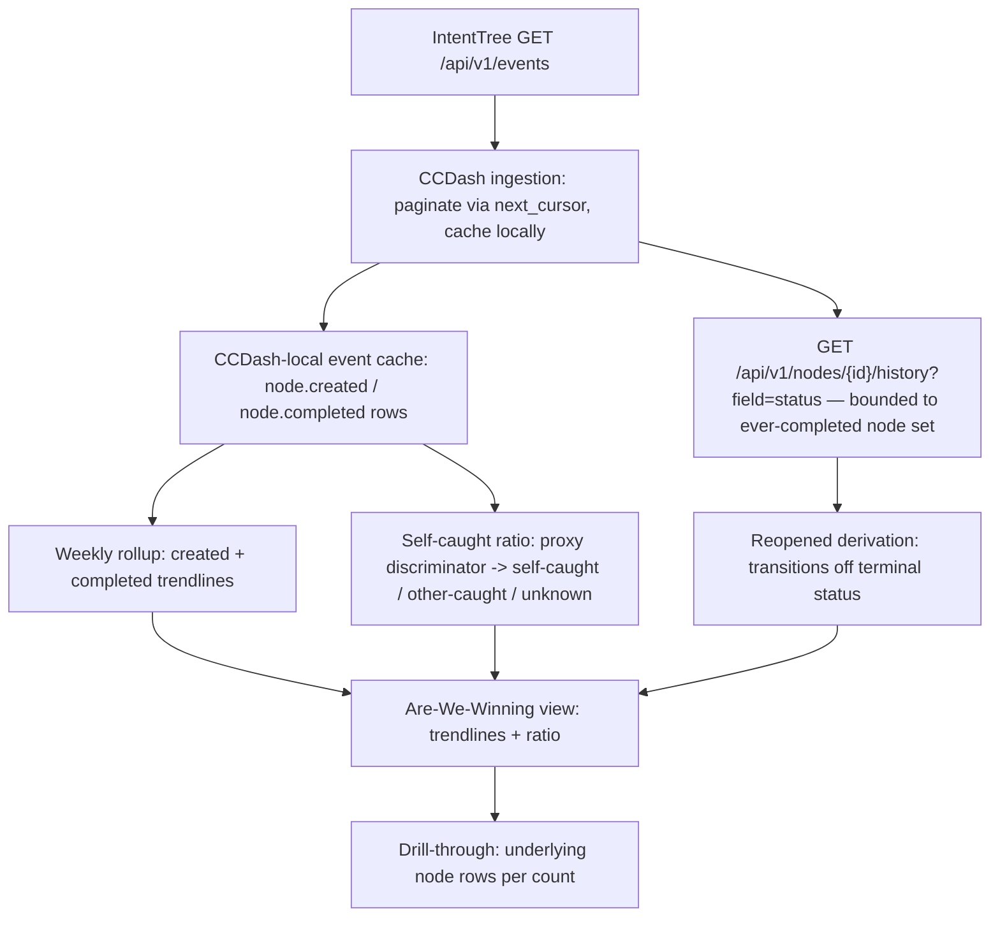

# Feature Brief & Metadata

**Feature Name:**

> Are-We-Winning Dashboard v1

**Filepath Name:**

> `are-we-winning-dashboard-v1`

**Date:**

> 2026-08-14

**Author:**

> Claude (prd-writer agent), for Nick Miethe

**Related Epic(s)/PRD ID(s):**

> IntentTree node `node_01M009H6DGAKD5VCC8QCM0KP0K` (workspace `ws_01KV8VMWX9EJ6VDQKEBMYQZRXG`, tree `tree_01KVTH95F7P7CXK3QH9ZMECM5T`)

**Related Documents:**

> - `.claude/worknotes/are-we-winning-dashboard/measured-data-availability.md` — mandatory, live-measured ground truth this PRD is built on; re-measure before trusting any count in this document from memory.
> - `docs/project_plans/PRDs/features/system-wide-metrics-v1.md` — sibling cross-project metrics surface using the same `agent_queries` pattern.
> - `backend/application/services/agent_queries/intent_node_cost.py` — the only existing IntentTree-adjacent read surface; it reads CCDash's own declared `entity_links`, not IntentTree's event log.

---

## 1. Executive Summary

Nick's standing question — "are we actually making progress?" — currently has no measured answer, only impressions from scrolling IntentTree nodes. This feature adds a CCDash view that turns IntentTree's event log into weekly created/completed/reopened trendlines and a self-caught-vs-other-caught defect ratio, with every number backed by drill-through to the rows that produced it and zero model calls anywhere on the render path. It doubles as the demo surface that shows the Agentic OS working, not just running.

**Priority:** HIGH

**Key Outcomes:**
- Outcome 1: A weekly view of nodes created vs. completed vs. reopened, replacing vibes with counted rows.
- Outcome 2: A self-caught defect ratio that is honest about what it does not yet know, via an explicit `unknown` bucket, rather than a fabricated percentage.
- Outcome 3: Every displayed number is clickable to its underlying IntentTree node rows — no unverifiable aggregate ships.

---

## 2. Context & Background

### Current State

CCDash has no IntentTree lifecycle-event data today. The only existing intent-node integration surface, `backend/application/services/agent_queries/intent_node_cost.py`, reads CCDash's own `entity_links` rows (declared node↔session bindings for cost attribution) — it never reads IntentTree's event log. IntentTree itself exposes a workspace-scoped domain event log at `GET /api/v1/events` (11,867 events measured in the bound workspace) plus a per-node field-history endpoint (`GET /api/v1/nodes/{node_id}/history`), both live on `http://10.42.10.76:8032`.

### Problem Space

Progress on the Agentic OS backlog is currently assessed by reading IntentTree nodes directly — there is no aggregate, trend, or historical view. Nick cannot answer "are we winning?" without manually scanning nodes, and there is no artifact to show a skeptical audience that the system produces measured throughput rather than activity.

### Current Alternatives / Workarounds

Ad hoc `itt` CLI queries or IntentTree UI browsing. Neither aggregates by week, neither computes a self-caught ratio, and neither is designed for repeat consumption or demo use.

### Architectural Context

CCDash follows Router → Service → Repository layering (see root `CLAUDE.md`). New cross-domain intelligence reads land first in `backend/application/services/agent_queries/`, then get exposed via REST/CLI/MCP as needed. This feature is architecturally the same shape as `system_metrics.py` and `intent_node_cost.py`: a transport-neutral service backed by a local cache, not a live upstream call per request. Any new persisted column or table requires dual DDL (SQLite + Postgres `_ensure_column`) in the same change set, per the `COLUMN_PARITY_DRIFT_ALLOWLIST` convention.

---

## 3. Problem Statement

> "As Nick, when I ask 'are we actually making progress this week,' I currently have to manually scroll IntentTree nodes and guess, instead of seeing a measured weekly trend with a number I can click through to verify."

**Technical Root Cause:**
- CCDash holds zero IntentTree lifecycle-event data — there is nothing to aggregate from yet (worknote, "Architectural fit" section).
- IntentTree's event log has no `node.reopened` event type and no payload on `node.updated`, so "reopened" cannot be read directly off the stream (worknote Finding 1).
- IntentTree's `node.created` events carry no usable actor discriminator (100% `actor_type=system`), so a self-caught ratio has no data to compute from today (worknote Finding 2).

---

## 4. Goals & Success Metrics

### Primary Goals

**Goal 1: Weekly created/completed/reopened trendlines**
- Render three time series, bucketed by week, sourced entirely from a CCDash-local cache of IntentTree events.
- Success: created and completed trendlines are a direct rollup of `node.created`/`node.completed` events; reopened is derived from per-node status history bounded to the ever-completed node set.

**Goal 2: Honest self-caught ratio**
- Render a self-caught vs. other-caught ratio using the best available proxy signal, with an explicit `unknown` bucket that is used whenever the signal cannot classify a node.
- Success: the ratio never silently divides over an unattributable population; `unknown` is a first-class, visible bucket, not a hidden default.

**Goal 3: Verifiable, fast, model-free rendering**
- Every count on the view supports drill-through to its underlying node rows; the render path performs zero model calls and no live IntentTree API calls.
- Success: dashboard load reads only from CCDash's own cache/DB.

### Success Metrics

| Metric | Baseline | Target | Measurement Method |
|--------|----------|--------|-------------------|
| Model calls on render path | N/A (no view exists) | 0 | Code review of the render-path call graph; request-path tracing shows no LLM/model client invocation. |
| Drill-through coverage | N/A | 100% of rendered counts | Manual QA: click every trendline point and every ratio bucket; each opens the underlying node-row list. |
| Self-caught ratio "unknown" honesty | N/A | `unknown` bucket present and non-hidden whenever proxy signal coverage is incomplete | Manual QA against known-low-coverage sample (worknote: `finding` tag on 17/200 sampled nodes, `meta.origin` on 7/200). |
| Reopened-derivation working-set size | N/A | Bounded to ever-completed nodes only (745 today, not all 3,941 nodes) | Code review of the derivation query scope. |

---

## 5. User Personas & Journeys

### Personas

**Primary Persona: Nick (project owner / AOS operator)**
- Role: Sole day-to-day user of CCDash and the primary consumer of the Agentic OS's own progress signal.
- Needs: A fast, honest, weekly answer to "are we winning," and a screen to show others.
- Pain Points: No aggregate view exists; manual node-scrolling does not scale and produces no artifact.

**Secondary Persona: Demo audience (marketing/adoption context)**
- Role: Someone evaluating whether the Agentic OS actually works.
- Needs: A screen that shows measured throughput, not a narrative.
- Pain Points: Impressions and demos of individual agent runs do not show sustained delivery.

### High-level Flow

---

## 6. Requirements

### 6.1 Functional Requirements

| ID | Requirement | Priority | Notes |
| :-: | ----------- | :------: | ----- |
| FR-1 | Ingest IntentTree lifecycle events (`node.created`, `node.completed` at minimum) into a CCDash-local cache, paginating past IntentTree's server-capped page size via `next_cursor` — never trust a single call for a complete result. | Must | CCDash holds zero IntentTree lifecycle data today (worknote); this is net-new acquisition, the largest single piece of this feature. |
| FR-2 | Derive weekly created and weekly completed trendlines directly from cached `node.created`/`node.completed` rows, bucketed by week (boundary convention: OQ-2). | Must | Both are direct rollups — no derivation logic needed beyond bucketing. |
| FR-3 | Derive a weekly reopened trendline by walking per-node status history for the bounded set of nodes that have ever emitted `node.completed`, counting a transition away from a terminal status as a reopen. | Must | Working set is 745 nodes today, not all nodes in the tree — bound the derivation, don't scan the whole tree. |
| FR-4 | Compute a self-caught ratio using a 3-bucket vocabulary (`self-caught` / `other-caught` / `unknown`), populated from the best available proxy signal on a node (e.g. a `finding`-style tag or an origin marker), never from `node.created` actor fields. | Must | `actor_type`/`actor_id` on `node.created` are not usable today (worknote Finding 2); a node the proxy signal cannot classify MUST land in `unknown`, never be silently excluded or defaulted into either counted bucket. |
| FR-5 | Every rendered aggregate (each week's created/completed/reopened count; each self-caught-ratio bucket) exposes a drill-through that returns the exact underlying node rows (at minimum: node id, title, occurred_at, tree id). | Must | Mirrors the resilience/verifiability posture already established for cost-attribution rollups in `intent_node_cost.py`. |
| FR-6 | The render path (request → response for the dashboard view) performs zero model/LLM calls and zero live calls to the IntentTree API — all data served from CCDash's own cache/DB. | Must | Ingestion and derivation happen off the render path, on a background/scheduled cadence (OQ-3). |
| FR-7 | New cross-domain read logic for this feature lands first in `backend/application/services/agent_queries/`, then is exposed via REST; CLI/MCP exposure is a Should, following the existing transport-neutral pattern. | Must | Per root `CLAUDE.md` convention and the shape of `system_metrics.py` / `intent_node_cost.py`. |
| FR-8 | Any new cache table/column ships with dual DDL (SQLite + Postgres `_ensure_column`) in the same change set. | Must | Per `COLUMN_PARITY_DRIFT_ALLOWLIST` convention; a schema drift between backends is a silent bug class this repo has hit before. |
| FR-9 | Ingestion must fail soft when the IntentTree API is unreachable: the dashboard continues serving the last-cached state rather than erroring the render path. | Must | Consistent with FR-6 (render path independence) and this repo's fail-open conventions for background jobs. |
| FR-10 | The dashboard view provides a visible, non-buried indicator of ratio-bucket coverage (e.g., what fraction of nodes classified vs. landed in `unknown`) so the ratio is legible as partial, not complete. | Should | Directly supports the "never silently compute" posture without requiring a numeric confidence model. |

### 6.2 Non-Functional Requirements

**Performance:**
- Dashboard render reads only cached/derived data; no synchronous upstream IntentTree calls or per-node history scans on the request path (see FR-3, FR-6).
- Ingestion/derivation jobs must remain bounded as event volume grows (11,867 events and rising) — cursor-paginate, never single-call.

**Security:**
- IntentTree API access uses the existing bearer-token credential convention (`INTENTTREE_API_TOKEN`, sourced from the operator's secrets store) — no new credential storage mechanism.

**Reliability:**
- A missing/optional field on a cached event or node row (e.g., no proxy discriminator present) is a contract state (`unknown` bucket), never a request failure — mirrors this repo's "resilience-by-default" rule for optional backend fields.

**Observability:**
- OpenTelemetry spans for the ingestion job and the query service, consistent with other `agent_queries` modules.
- Structured logs on ingestion cursor progress and reopened-derivation batch size.

---

## 7. Scope

### In Scope

- Weekly created trendline, sourced from `node.created` events.
- Weekly completed trendline, sourced from `node.completed` events.
- Weekly reopened trendline, derived from per-node status history bounded to the ever-completed node set.
- Self-caught ratio with an explicit `unknown` bucket (3-bucket vocabulary: self-caught / other-caught / unknown).
- Drill-through from every rendered count to its underlying IntentTree node rows.
- Zero model calls, zero live IntentTree calls, on the render path.
- The IntentTree event-ingestion pipeline (cursor-paginated, fail-soft) needed to back all of the above.

### Out of Scope (Explicitly Deferred)

- **Recurrence rate per defect class** — named in the IntentTree node description, but requires a defect-classification taxonomy that does not exist yet. This is a separate data-modeling effort (what counts as a "defect class," how a node is tagged with one) and is deferred to a follow-on PRD rather than silently dropped. Tracked as IntentTree node `node_01M00YGA9R4JE45WSW59G7C5PH`.
- **Gate-claims-vs-enforcement audit status** — also named in the node description, but requires a gate-declaration-vs-enforcement audit log that is a distinct capability from event-driven trendlines. Deferred to a follow-on PRD; not part of AC1's verbatim scope. Tracked as IntentTree node `node_01M00YGAJ3GP3GRRCC1NSCD3ZE`.
- Any backfill of historical self-caught attribution — per OQ-1/Decision D-2, this is permanently impossible for events already recorded under the shared service-account actor.
- Per-actor IntentTree bearer-token provisioning (the upstream fix that would make `actor_type`/`actor_id` meaningful going forward) — named as the recommended follow-up in OQ-1, but it is IntentTree-side provisioning work, not a CCDash feature, and is out of scope here.

---

## 8. Dependencies & Assumptions

### External Dependencies

- **IntentTree API** (`http://10.42.10.76:8032`, workspace `ws_01KV8VMWX9EJ6VDQKEBMYQZRXG`, tree `tree_01KVTH95F7P7CXK3QH9ZMECM5T`): `GET /api/v1/events` (event log, server-capped at 200 rows/page, `next_cursor`-based pagination, `workspace_id` required) and `GET /api/v1/nodes/{node_id}/history` (field-level status history) are the two read surfaces this feature depends on. Both are measured live and documented in the mandatory worknote.
- **Bearer credential**: `INTENTTREE_API_TOKEN`, sourced the same way other IntentTree-integrated CCDash surfaces source it.

### Internal Dependencies

- **`backend/application/services/agent_queries/`**: the transport-neutral layer this feature's new query service lands in, alongside `system_metrics.py` and `intent_node_cost.py`.
- **Dual-backend DB layer** (SQLite + Postgres): any new cache table/column follows the existing dual-DDL convention.

### Assumptions

- The bound IntentTree workspace/tree (`ws_01KV8VMWX9EJ6VDQKEBMYQZRXG` / `tree_01KVTH95F7P7CXK3QH9ZMECM5T`) is the correct and sufficient scope for "are we winning" — this is Nick's own backlog tree, not a multi-tenant rollup.
- Event volume (11,867 events measured) and the ever-completed node set (745 measured) are small enough today that a bounded, non-streaming ingestion/derivation approach is viable without a dedicated streaming pipeline; this should be revisited if volume grows by an order of magnitude.
- A weak proxy signal for self-caught classification (worknote: `finding` tag present on 17/200 sampled nodes, `meta.origin` on 7/200) is accepted as "the best available signal today," not as an adequate long-term substitute for per-actor attribution.

### Feature Flags

- A feature flag gating this dashboard's ingestion job and its REST surface is recommended (naming and default TBD in the implementation plan), consistent with this repo's pattern of flag-gating new background jobs and query surfaces.

---

## 9. Risks & Mitigations

| Risk | Impact | Likelihood | Mitigation |
| ----- | :----: | :--------: | ---------- |
| Self-caught ratio's proxy signal has weak, uneven coverage (measured: 17/200 and 7/200 sampled nodes carry any discriminator at all) — most nodes may land in `unknown`, making the ratio look sparse or unconvincing. | Medium | High | Ship the explicit `unknown` bucket as a first-class, visible element (FR-10) rather than hiding low coverage; document the upstream per-actor-token fix (OQ-1) as the real remedy, out of scope here. |
| Reopened derivation requires one history-lookup per ever-completed node; if run synchronously per render, this degrades render latency as the completed set grows. | Medium | Medium | Compute reopened counts during ingestion/derivation only (FR-3, FR-6), never on the request path; cache the result. |
| IntentTree event volume (11,867 today) grows without bound; a naive "re-fetch everything" ingestion strategy degrades over time. | Medium | Medium | Cursor-based incremental ingestion from the last-seen cursor/timestamp, not a full re-pull each cycle (FR-1). |
| A new cache table/column ships with SQLite DDL only, drifting from Postgres (a recurring bug class in this repo). | High | Low | Dual DDL in the same change set (FR-8), plus the `COLUMN_PARITY_DRIFT_ALLOWLIST` check. |
| IntentTree API downtime blocks the dashboard entirely if the render path calls it live. | High | Low | Render path never calls IntentTree live (FR-6, FR-9); ingestion fails soft and the view serves last-cached state. |

---

## 10. Target State (Post-Implementation)

**User Experience:**
- Nick opens a CCDash view and sees weekly created/completed/reopened trendlines and a self-caught ratio (with an honest `unknown` bucket) at a glance.
- Clicking any count opens the exact list of IntentTree node rows behind it.
- The view loads fast because it never waits on IntentTree or a model call.

**Technical Architecture:**
- A new CCDash-local cache of IntentTree lifecycle events, populated by a cursor-paginated, fail-soft ingestion job.
- A bounded reopened-derivation job scoped to the ever-completed node set.
- A transport-neutral `agent_queries` service producing weekly rollups + ratio buckets, exposed via REST with a drill-through query.
- A new frontend dashboard view rendering the trendlines, the ratio, and drill-through affordances.

**Observable Outcomes:**
- "Are we winning?" has a measured, weekly answer instead of an impression.
- The self-caught ratio is visibly partial rather than falsely precise.
- The view is safe to demo — it never breaks on IntentTree downtime and never triggers a model call.

---

## 11. Overall Acceptance Criteria (Definition of Done)

### AC1 (verbatim, from IntentTree node `node_01M009H6DGAKD5VCC8QCM0KP0K`)

> "A CCDash view renders weekly created/completed/reopened trendlines and a self-caught ratio from IntentTree event data, with every displayed count backed by drill-through to its rows and zero model calls on the render path"

#### AC1 decomposition

- [ ] **AC1.1** — A CCDash view renders a weekly **created** trendline, sourced from cached `node.created` IntentTree events.
- [ ] **AC1.2** — The same view renders a weekly **completed** trendline, sourced from cached `node.completed` IntentTree events.
- [ ] **AC1.3** — The same view renders a weekly **reopened** trendline, derived from per-node status-history transitions off a terminal status, computed over the bounded set of nodes that have ever emitted `node.completed` (not the full node population).
- [ ] **AC1.4** — The same view renders a **self-caught ratio** using a 3-bucket vocabulary (self-caught / other-caught / unknown); a node the available proxy signal cannot classify renders in `unknown`, never silently folded into a computed percentage.
- [ ] **AC1.5** — Every displayed count from AC1.1–AC1.4 (each week's value per trendline; each ratio bucket) supports drill-through returning the exact underlying IntentTree node rows.
- [ ] **AC1.6** — The render path (the request that produces the view's data) performs zero calls to any model/LLM service and zero live calls to the IntentTree API — all data is served from CCDash's own cache/DB.

### Functional Acceptance

- [ ] All functional requirements (FR-1 through FR-9; FR-10 is a Should) implemented.
- [ ] AC1.1 through AC1.6 verified end-to-end against live cached data (not mocked fixtures alone).
- [ ] Deferred items (recurrence rate per defect class; gate-claims-vs-enforcement audit status) remain explicitly out of scope, not silently attempted.

### Technical Acceptance

- [ ] New cross-domain read logic lands in `backend/application/services/agent_queries/` before REST wiring, per project convention.
- [ ] Any new cache table/column ships with dual DDL (SQLite + Postgres) in the same change set.
- [ ] Ingestion job fails soft on IntentTree API unavailability; dashboard render path never depends on IntentTree being up.
- [ ] OpenTelemetry spans present for the ingestion job and the new query service.

### Quality Acceptance

- [ ] Unit tests cover: weekly bucketing logic, reopened-derivation boundary (only ever-completed nodes considered), and the self-caught ratio's `unknown`-bucket behavior when the proxy signal is absent.
- [ ] An automated or documented check confirms zero model-service calls occur on the render path.
- [ ] Runtime smoke test (per root `CLAUDE.md` runtime-smoke-gate convention) performed for the new frontend view before any phase is marked complete.

### Documentation Acceptance

- [ ] CHANGELOG `[Unreleased]` entry added (this PRD sets `changelog_required: true`).
- [ ] A short operator guide or `CLAUDE.md` pointer documents the ingestion cadence, the reopened-derivation bound, and the self-caught ratio's known coverage limitation.

---

## 12. Assumptions & Open Questions

### Assumptions

- See §8 Assumptions above (workspace/tree scope, event volume viability, proxy-signal adequacy-as-interim).

### Open Questions

- [ ] **OQ-1**: How should the self-caught ratio be resolved given IntentTree's `node.created` events carry no usable actor discriminator today (measured: `actor_type=system` on 3,941/3,941 events; `actor_id` null on 199/200 sampled), and historical backfill is permanently impossible (the shared service token collapsed every actor to `system` at write time)?
  - **A**: Ship now using the best available proxy signal on a node (e.g. a `finding`-style tag or an origin marker) bucketed into `self-caught` / `other-caught` / `unknown`, with `unknown` expected to dominate initially and displayed as such (FR-4, FR-10). The durable fix is upstream: IntentTree already supports per-actor bearer tokens (`POST /api/v1/actors/{id}/tokens`); provisioning them would make `actor_type`/`actor_id` meaningful from that day forward. That provisioning is explicitly **out of scope for this PRD** and is tracked as IntentTree node `node_01M00YG9ZQ3R4DF6EMPPS0EMVW` (filed 2026-08-14, `relates_to` this feature's node). Note the cost of delay: attribution is fixed forward-only, so every unprovisioned day is a permanently unattributable day.
- [ ] **OQ-2**: Should weekly trendlines bucket by ISO calendar week (Monday–Sunday) or a rolling 7-day window ending "today"?
  - **A**: TBD — resolve in the implementation plan.
- [ ] **OQ-3**: Should IntentTree event ingestion and reopened-derivation run on CCDash's existing worker/watcher sync cadence, or a dedicated scheduled job, and at what interval?
  - **A**: TBD — resolve in the implementation plan; must satisfy FR-6/FR-9 (off render path, fail-soft) regardless of cadence chosen.
- [ ] **OQ-4**: Does drill-through reuse the existing planning modal-first navigation pattern (`lib/planning-routes.ts`) or introduce a dashboard-local modal/panel?
  - **A**: TBD — resolve in the implementation plan against current frontend conventions.

---

## 13. Appendices & References

### Related Documentation

- **Worknote (mandatory ground truth)**: `.claude/worknotes/are-we-winning-dashboard/measured-data-availability.md`
- **Sibling pattern**: `backend/application/services/agent_queries/system_metrics.py` (transport-neutral, cache-backed cross-project metrics)
- **Existing intent-node surface**: `backend/application/services/agent_queries/intent_node_cost.py` (reads CCDash's own `entity_links`, not IntentTree's event log — this feature's ingestion is net-new relative to it)

### Prior Art

- None within CCDash — this is the first feature to ingest IntentTree's own lifecycle-event log rather than CCDash's declared node↔session bindings.

---

## Implementation

### Phased Approach (indicative — refine in the implementation plan)

**Phase 1: Event ingestion & cache**
- Cursor-paginated pull from `GET /api/v1/events` (`node.created`, `node.completed` at minimum), dual-DDL cache table/columns, fail-soft on API downtime.

**Phase 2: Derivation**
- Reopened trendline via bounded per-node status-history walk (ever-completed set only).
- Self-caught ratio computation with the 3-bucket vocabulary and coverage indicator.

**Phase 3: Query service & API surface**
- Transport-neutral service in `backend/application/services/agent_queries/`; REST endpoint(s); drill-through query returning underlying node rows.

**Phase 4: Frontend dashboard view**
- Weekly trendline rendering, self-caught ratio widget with visible `unknown` bucket, drill-through interaction (OQ-4).

**Phase 5: Validation & documentation**
- Unit tests for bucketing/derivation/ratio edge cases; runtime smoke test; CHANGELOG entry; operator-guide pointer.

### Epics & User Stories Backlog

| Story ID | Short Name | Description | Acceptance Criteria | Estimate |
|----------|-----------|-------------|-------------------|----------|
| AWW-001 | Event ingestion | Cursor-paginated IntentTree event pull into a local cache | FR-1, FR-8, FR-9 | 3 pts |
| AWW-002 | Created/completed rollup | Weekly bucketing of cached create/complete events | FR-2, AC1.1, AC1.2 | 2 pts |
| AWW-003 | Reopened derivation | Bounded per-node status-history walk over ever-completed nodes | FR-3, AC1.3 | 3 pts |
| AWW-004 | Self-caught ratio | 3-bucket ratio computation with proxy signal + unknown bucket | FR-4, FR-10, AC1.4 | 2 pts |
| AWW-005 | Drill-through query & API | Underlying-row lookup per rendered count; REST exposure | FR-5, FR-6, FR-7, AC1.5, AC1.6 | 2 pts |
| AWW-006 | Dashboard view | Frontend trendlines + ratio widget + drill-through UI | AC1.1-AC1.6 (rendering) | 3 pts |

---

**Progress Tracking:**

See progress tracking (once created): `.claude/progress/are-we-winning-dashboard/all-phases-progress.md`
