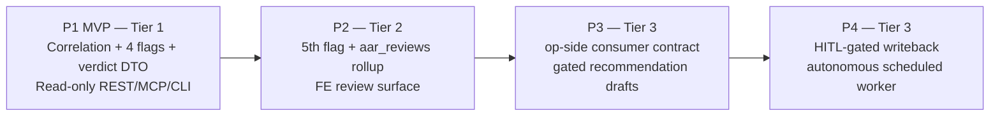

# Feature Brief & Metadata

**Feature Name:**

> CCDash Automated AAR Review Loop

**Filepath Name:**

> `ccdash-automated-aar-review-v1` (kebab-case)

**Date:**

> 2026-07-21

**Author:**

> Claude Opus 4.8 (prd-writer)

**Related Epic(s)/PRD ID(s):**

> None — new capability area. Tier 1 MVP (Phase 1 of the roadmap below) is authored
> separately as a Feature Contract at `docs/project_plans/feature_contracts/features/ccdash-automated-aar-review-mvp.md`
> (path indicative; contract writer sets the canonical path).

**Related Documents:**

> - Accepted ADR (seam contract): `docs/project_plans/exploration/ccdash-automated-aar-review/ccdash-automated-aar-review-proposed-adr.md`
> - Feasibility brief: `docs/project_plans/exploration/ccdash-automated-aar-review/ccdash-automated-aar-review-feasibility-brief.md`
> - Leg findings: `docs/project_plans/exploration/ccdash-automated-aar-review/spikes/{tech,reuse,risk,scope}-findings.md`
> - Decisions spine: `.claude/worknotes/ccdash-automated-aar-review/decisions-spine.md`
> - Precedent: RF run telemetry PRD, `docs/project_plans/PRDs/features/research-foundry-run-telemetry-v1.md` (commit `9594fcc`)

---

## 1. Executive Summary

The AOS produces After-Action Reviews (AARs) everywhere, but the loop from a *written* AAR to an
*acted-upon system improvement* (new/swapped skill or agent, config change) does not exist anywhere
today: `op story` already sources AARs from CCDash (`ccdash report aar --feature`) but its only sink
is a gated blog draft PR. This PRD specifies the full-vision, Tier 3 north-star for closing that
loop: CCDash becomes the **producer** of AAR-review evidence — pairing each agent-written AAR back to
the session log(s) it describes, computing deterministic surface flags over already-ingested data,
and emitting a model-free `aar_review_candidate` event — while `op`/ARC/SkillMeat remain the
**consumers** who own all model-driven synthesis, swarm dispatch, and gated writeback.

**Priority:** HIGH

**Key Outcomes:**
- Outcome 1: An operator or ARC can ask, over already-ingested data, "which recent sessions warrant
  a deep review, and on what evidence?" — a decision that today is entirely manual.
- Outcome 2: The AAR→system-improvement loop gets a first, safe increment — CCDash-side evidence and
  triage — without introducing any new LLM call on CCDash's recall path or any autonomous writeback.
- Outcome 3: Every downstream capability (5th flag, persisted rollup, op-side routing, gated
  writeback, autonomous scheduling) is sequenced behind explicit gates, each validated before the
  next increment ships.

---

## 2. Context & Background

### Current State

`op story` already reaches into CCDash for AAR material (`story.py:1414-1458`): it pulls completed
features, generates a synthetic AAR per feature via `ccdash report aar --feature <id>`, and triages
with a coarse "intensive feature" heuristic (≥100k tokens OR ≥3 sessions OR ≥180 minutes). Its only
terminal sink is `story.review` → `story.approve_draft` → a gated blog draft PR — a categorically
different destination from a system-improvement recommendation. ARC (adversarial council review)
exists as a full deep-dive pipeline but is invoked only when a human or `op` explicitly points it at
a target; nothing today auto-decides *which* sessions merit that expensive review.

### Problem Space

No subsystem in the AOS computes deterministic "review-worthiness" signals from raw session
evidence — missing artifacts, context ballooning, generic-agent-where-a-specialist-fit,
stack-ineffectiveness — despite CCDash already holding every input those signals need (session
JSONL, per-session token/context columns, `subagent_parent_id`/`skill_name`/`model_slug` detection
columns, `session_artifacts`). `op story` knows only three coarse thresholds; ARC knows nothing until
pointed. The AAR→system-improvement loop is therefore unowned, not merely underdeveloped.

### Current Alternatives / Workarounds

Today the triage decision is a human judgment call made by skimming AAR text and session dashboards
— inconsistent, unscalable manual review with no evidence backing it.

### Architectural Context

CCDash's transport-neutral `agent_queries` pattern (routers → services → repositories → DB) applies
unchanged. This feature is additive: a new query service alongside `reporting.py` /
`session_correlation.py`, exposed via the standing REST/CLI/MCP fan-out. No new port is required for
P1. Persisted state (P2's rollup table) follows ADR-007 (`retry_on_locked`, dual SQLite+PostgreSQL
DDL, direct-count assertion test). Project scoping follows ADR-006 (DB-authoritative registry).

---

## 3. Problem Statement

**User Story Format:**
> "As the operator (`op`) or ARC, when an agent-written AAR describes a session with real
> inefficiencies, I have no evidence-backed way to decide whether it merits a full ARC deep-dive —
> instead of getting a deterministic, evidence-backed triage verdict, I either skip review entirely
> or fall back to manually re-reading every AAR."

**Technical Root Cause:**
- `generate_aar` (`reporting.py:64`) only runs *forward*: telemetry → synthesized AAR, keyed by
  feature. No path runs the *inverse*: a written AAR document → the session(s) it describes → a
  judgment about those sessions.
- No repo (CCDash, `op`, ARC, SkillMeat) computes the four charter surface flags from session
  evidence; `story.py:1462-1485`'s `_classify_candidate` scores blog-worthiness, a different rubric
  entirely.
- Files involved (P1): new `backend/application/services/agent_queries/aar_review.py`; reused
  `session_correlation.py`, `document_linking.py`, `entity_links` repository reads.

---

## 4. Goals & Success Metrics

### Primary Goals

**Goal 1: Close the evidence gap, not the decision gap**
- CCDash emits deterministic, explainable triage evidence; it never decides "escalate to ARC" on its
  own authority.
- Success: every `aar_review_candidate` event carries `flags[]` + `evidence_refs[]` sufficient for a
  human or `op` to understand *why* a verdict was reached without re-reading raw session JSONL.

**Goal 2: Zero LLM on the recall path, ever**
- All triage computation stays deterministic (threshold/lookup/regex), matching
  `persona_extract_rules.py` R1-R8.
- Success: code review confirms no model-client import anywhere in `aar_review.py` or its
  dependencies, at every phase P1-P4.

**Goal 3: Every gate stays with its current owner**
- CCDash never dispatches swarm/ARC work and never writes to SkillMeat/skills/agents, at any phase.
- Success: writeback (P4) only occurs through `op approve` + ARC's validate gate; CCDash's own code
  contains no direct SkillMeat catalog mutation and no ARC/swarm invocation.

### Success Metrics

| Metric | Baseline | Target | Measurement Method |
|--------|----------|--------|-------------------|
| AAR review triage coverage | 0% (no capability exists) | 100% of AARs with correlation_confidence ≥ 0.64 resolve to a verdict | P1 acceptance test against sampled real AAR docs |
| LLM calls on CCDash triage path | N/A | 0 | Static import audit of `aar_review.py` + dependency graph, each phase |
| Autonomous writeback events without HITL approval | N/A | 0 (P1-P3), 0 outside `op approve` (P4) | Code review + integration test asserting every P4 writeback call site requires an approved run-record |
| False-positive flag rate on low-confidence correlations | N/A (manual today) | Low-confidence pairings (< 0.64) route to `human_triage_required`, never `deep_review_recommended` | Unit test over the triage-verdict decision table |

---

## 5. Architecture Principle (the accepted ADR — seam contract)

**This PRD's single non-negotiable architectural constraint is the accepted ADR**:
[`ccdash-automated-aar-review-proposed-adr.md`](../../exploration/ccdash-automated-aar-review/ccdash-automated-aar-review-proposed-adr.md)
(status: accepted, 2026-07-21) — *"CCDash is the producer of AAR-review evidence; op/ARC/SkillMeat
own synthesis, swarm dispatch, and writeback."* Every phase below (P1-P4) is scoped to honor this
seam without exception. Any implementation plan derived from this PRD that proposes CCDash-side swarm
dispatch, autonomous artifact synthesis, or direct SkillMeat/agents writeback is out of compliance
with this PRD and must be rejected at review.

### Hard Invariants (violation of any is a review failure, any phase)

1. **No LLM on the recall/read path.** All CCDash-side triage is deterministic
   (threshold/lookup/regex over already-ingested DB rows) — same class as
   `persona_extract_rules.py` R1-R8. Any flag requiring semantic judgment ("was this agent choice
   *wrong* given the task," not just "which agent was used") is not a triage flag; it belongs in the
   synthesis tier upstream (ADR Decision 2; risk-findings.md §3).
2. **CCDash never dispatches swarm/ARC and never writes SkillMeat/skills/agents.** It emits events;
   every irreversible gate stays upstream — `op approve|reject <run_id>`, `op story`'s approve gate,
   ARC's validate gate, or IntentTree's AgentRun gate (ADR Decision 4; risk-findings.md §2).
3. **Reuse, don't rebuild.** AAR sourcing already flows through `op story`
   (`ccdash report aar --feature`); correlation reuses `session_correlation.py` +
   `document_linking.py` + `entity_links`; no second correlation key is introduced (ADR Decision 1;
   reuse-findings.md §1-§2 — see §9 Do-Not-Build below).
4. **Every new write path follows ADR-007** (`retry_on_locked`, dual SQLite+PostgreSQL DDL,
   direct-count assertion test); every new column ships dual DDL + parity allowlist entry; every
   triage input consumes redaction-passed `session_detail` output, never raw JSONL (ADR
   Consequences; risk-findings.md §5).

---

## 6. Phased Roadmap (core of this PRD)

The full vision decomposes into four phases of increasing tier and blast radius. **P2, P3, and P4
each spawn their own implementation plan derived from this PRD** — this PRD is the durable north-star
reference all three cite; it is not itself an implementation plan. P1 is intentionally *not* part of
this PRD's own implementation plan — it ships first as an independent Tier 1 Feature Contract so its
flags are validated against real AARs before P2 persists any history.



### P1 — MVP (Tier 1, ~10-13 pts) — ships as a Feature Contract, not this plan

**Scope**: Correlation helper (reuse `session_correlation.py` + `entity_links`, no new correlation
key) + 4 deterministic surface flags (defer the 5th, speculative flag) + triage verdict DTO +
read-only REST + MCP + CLI surface + emit the model-free `aar_review_candidate` event. **No swarm, no
writeback, no scheduling.**

**Entry**: Feasibility brief verdict `go` (0.8 confidence); accepted ADR in place; decisions spine
finalized. **Exit**: all 4 flags unit-tested against representative fixtures; verdict DTO returns for
a sampled real AAR doc via REST/MCP/CLI; event schema validated; zero model-client imports.
**Gate**: `task-completion-validator` (Tier 1 standard).

### P2 — Tier 2 (~8-10 pts)

**Scope**: Add the 5th flag (need for a new skill/agent — the speculative, softest-signal flag) +
persist a rollup table `aar_reviews` (per ADR-007: dual SQLite+PostgreSQL DDL, `retry_on_locked`,
direct-count assertion test) so triage history survives beyond a single query + a frontend review
surface (panel/tab) so a human can browse triage verdicts without touching CLI/MCP.

**Entry**: P1 shipped and its flags validated as useful / low-false-positive against a sample of real
AARs (scope-findings.md Inc-2 gate — a hard precondition, not a formality). **Exit**: `aar_reviews`
backfilled for existing pairs; 5th flag unit-tested; FE surface handles every optional field per §8 AC
rules. **Gate**: `task-completion-validator` per phase (Tier 2 standard).

### P3 — Tier 3 (~8-12 pts, cross-repo consumer spec)

**Scope**: The **op-side consumer contract** — specified here because the seam must be designed
end-to-end even though the consumer code lives outside this repo. `op` reads the
`aar_review_candidate` event and, **at its own existing plan gate** (classify→plan→dispatch), routes
each candidate to one of: a surface-review note (low-cost, human-readable), `op council` (invokes the
ARC council pipeline), or discard (low value). This phase also covers gated recommendation *drafts* —
`op`/ARC may synthesize a recommendation text from CCDash's evidence bundle, landing as an
`op story`-shaped draft (mirroring `op story capture`'s existing Signal→System shape), never a direct
mutation of any authoritative state.

**Cross-repo contract to specify** (consumed, not built, in this repo):
- Event source: CCDash's `aar_review_candidate` (§7.3 below), polled or pushed per the RF→CCDash
  `ccdash_event.yaml` writeback pattern, inverted (`rf.py:309-359` precedent).
- Routing decision: `op`'s classify→plan→dispatch, using `correlation.confidence` and
  `triage_verdict` as routing inputs; `human_triage_required` verdicts never auto-route to `op
  council`.
- Recommendation sink: `op story capture`-shaped draft, landing in the Signal→System pipeline; never
  a SkillMeat catalog mutation, never an ARC invocation initiated by CCDash.

**Entry**: P2 shipped; `aar_reviews` rollup proven stable in production for ≥1 triage cadence
cycle. **Exit**: op-side contract document (in the `agentic_meta_dev`/`op` repo) references this PRD
and the §7.3 event schema verbatim; a cross-repo, best-effort integration smoke test demonstrates
`op` consuming a real event and producing a routed decision with no CCDash-side code change.
**Gate**: `op`'s own HITL gate at its plan checkpoint (external; this PRD's exit criteria require
evidence the contract was honored).

### P4 — Tier 3 (~8-10 pts)

**Scope**: HITL-gated writeback into SkillMeat/skills-agents, exclusively through `op approve` (never
initiated autonomously by CCDash or by `op` without a human approval on the run record) + an
autonomous scheduled worker that runs triage over newly-imported sessions on a cadence, reusing the
existing `(project_id, trigger)` coalescing guard (no second scheduler) + all 3 self-recursion guards
(§8) enforced in production, not just designed.

**Entry**: P3's op-side routing proven in production; escalation-quota design reviewed; self-recursion
guards implemented and tested (designed from P1 per §8, exercised at P4 volume). **Exit**:
escalation quota enforced and observably capping handoffs before any P4 volume ships; provenance
self-exclusion verified against a synthetic self-referential test case; dedup ledger passes an
idempotency test across a simulated worker restart; every writeback path requires an `op approve`d
run record, verified by an integration test asserting a rejected/pending run never writes.
**Gate**: `op approve` + ARC's validate gate (external; exit criteria require passing evidence).

---

## 7. Data Contracts

### 7.1 The 5 surface flags

| Flag ID | Verdict (tech leg) | Data source (cited) | Phase |
|---------|--------------------|----------------------|-------|
| `context_ballooning` | **computable-now** | `currentContextTokens`/`contextWindowSize`/`contextUtilizationPct` (`types.ts:631-635`); `context_window_size` (`sqlite_migrations.py:175`); `tokensIn`/`tokensOut` + cache-token columns (`types.ts:617-629`); alert-rule precedent `total_tokens > 600` (`sqlite_migrations.py:1648`) | P1 |
| `retry_failure_churn` *(bonus, folds into missing-artifacts evidence)* | **computable-now** | `detect_failure_patterns` (`reporting.py:135-201`) returning `patternType`/`sessionIds`/`averageRiskScore` | P1 |
| `missing_artifacts` | **needs-derivation** | Produced side computable-now: `session_artifacts` (`sqlite_migrations.py:368-379`, `source_tool_name`, `type`), `updatedFiles`/`linkedArtifacts` (`types.ts:653-654`), `output_artifacts_json` (:1301). "Missing" = deterministic regex/parse of AAR-claimed artifacts, diffed against `session_artifacts` | P1 |
| `generic_agent_vs_specialist` | **needs-derivation** | "Used" side computable-now: `agentName`/`agentsUsed`/`subagentType` (`types.ts:600,607,673`), `skill_name` (`sqlite_migrations.py:233`), `subagent_parent_id` (:232). Detecting `general-purpose` usage is trivial; a deterministic task-domain→specialist ruleset flags candidates — final fit judgment stays upstream (synthesis tier) | P1 |
| `stack_ineffectiveness` | **needs-derivation** | `get_workflow_effectiveness` + `detect_failure_patterns` (`reporting.py:15,124,135`); tool-error patterns (`feature_forensics.py:190-191`); `tool_summary`/`toolSummary` (`session_correlation.py:120`, `types.ts:602`). Needs a new deterministic tool/file-signature→stack map, correlated with failure/retry density | P1 |
| `new_skill_or_agent_need` | **speculative / softest signal** | Derived from `generic_agent_vs_specialist` triggers at volume + repeated `missing_artifacts` patterns across a project. Deliberately deferred — nearest the model/opinion boundary; a purely deterministic version is weak on its own (scope-findings.md S5) | **P2** |

**Resilience note (R-P2)**: every flag's `evidence[]` and `severity` fields are optional at the DTO
level (a flag with `triggered: false` may carry an empty evidence array). Consumers (REST/MCP/CLI/FE)
MUST treat an absent or empty `evidence[]` as "flag not evaluated or not triggered," never as an
error state.

### 7.2 Triage Verdict DTO

```yaml
# AARReviewDTO (backend/application/services/agent_queries/models.py)
schema_version: 1
aar_document_id: str            # deterministic hash of the AAR doc path (document_linking.make_document_id)
aar_document_path: str
correlation:
  strategy: explicit_session_ref | task_session_ref | doc_feature_session_two_hop
  confidence: float             # 0.64-1.0 per tech-findings.md; 1.0 = explicit frontmatter ref
  session_ids: [str]            # may be empty if correlation fails entirely
  feature_id: str | null        # present for task_session_ref / two-hop strategies; null for explicit_session_ref
flags:
  - flag_id: context_ballooning | missing_artifacts | generic_agent_vs_specialist | stack_ineffectiveness | new_skill_or_agent_need   # P2+
    triggered: bool
    severity: low | medium | high | null      # null when not triggered
    evidence: [str]                            # optional; may be empty
    computable_tier: computable_now | needs_derivation
triage_verdict: surface_only | deep_review_recommended | human_triage_required
triage_reasons: [str]            # at least one reason string per verdict
evidence_refs: [str]             # pointers into session_detail / session_artifacts rows, never raw JSONL paths
generated_at: datetime           # ISO 8601
```

**Verdict decision table** (deterministic, no model call):

| correlation.confidence | Any flag `severity: high`? | Verdict |
|---|---|---|
| < 0.64 | — | `human_triage_required` (never auto-escalated) |
| ≥ 0.64 | no | `surface_only` |
| ≥ 0.64 | yes | `deep_review_recommended` |

### 7.3 `aar_review_candidate` event schema (model-free; mirrors RF→CCDash `ccdash_event.yaml` inverse)

```yaml
# emitted by CCDash; consumed by op (P3). Inverse of rf.py:309-359's ccdash_event.yaml writeback.
schema_version: 1
event_type: aar_review_candidate
producer: ccdash
emitted_at: datetime             # ISO 8601
aar_document_id: str
aar_document_path: str
feature_ref: str | null
session_refs: [str]              # session_ids from correlation.session_ids
correlation:
  strategy: explicit_session_ref | task_session_ref | doc_feature_session_two_hop
  confidence: float
flags:
  - flag_id: str
    triggered: bool
    severity: low | medium | high | null
triage_verdict: surface_only | deep_review_recommended | human_triage_required
evidence_refs: [str]
guards:                          # P4 fields; null/absent in P1-P3 emissions
  provenance_excluded: bool | null      # true if this AAR/session pair was excluded by self-recursion guard 1
  dedup_key: str | null                 # "{aar_document_id}:{session_id}" per guard 2
```

**Resilience note (R-P2)**: `guards.*` fields are null in every P1-P3 emission (the guards do not
exist yet as enforced behavior before P4). Consumers MUST treat a null `guards` block as "guard state
not applicable at this producer version," never as an error, and MUST NOT infer guard enforcement
from event presence alone — the correlation `confidence` and `triage_verdict` fields are authoritative
regardless of guard-field presence.

### 7.4 Integration points (unchanged shape across all phases)

| Layer | File | Action |
|-------|------|--------|
| Query service | `backend/application/services/agent_queries/aar_review.py` (new, P1) | `AARReviewQueryService`: resolve sessions via `entity_links` (reuse `session_correlation`), pull session rows + `session_artifacts`, compute flags, return `AARReviewDTO`. Reuse `@memoized_query`. |
| Ports | Existing `CorePorts` | Reuse `storage.entity_links()`/`sessions()`/`documents()`/`features()`; no new port for P1. |
| Models | `agent_queries/models.py` | New `AARReviewDTO`, `FlagResult`, `AARReviewCandidateEvent` (P1). |
| REST | `backend/routers/agent.py` | `GET /agent/aar-review/{document_id}` (mirrors `/reports/aar`, `/feature-forensics/{feature_id}`). |
| CLI | `backend/cli/commands/report.py` | `report aar-review` subcommand (mirrors `report aar`). |
| MCP | `backend/mcp/server.py` | Same service exposed as an MCP tool (transport-neutral rule). |
| DB (P2 only) | `backend/db/sqlite_migrations.py`, `backend/db/postgres_migrations.py`, `backend/db/repositories/aar_reviews.py` | New `aar_reviews` rollup table; dual DDL + `COLUMN_PARITY_DRIFT_ALLOWLIST`; `retry_on_locked`; direct-count assertion test (ADR-007). |
| FE (P2 only) | `components/Planning/FeatureAARReviewPanel.tsx` | Read-only review surface rendering triage verdicts + flag evidence. |

---

## 8. Self-Recursion Guards & Do-Not-Build

### 8.1 Self-recursion guards (3, P4-critical — **designed from P1**)

An AAR-review job is itself a session; if any session discussing AAR review becomes eligible for the
next triage pass, the loop has no natural termination (structurally identical to a crawler
re-indexing its own index page). All three guards must be *designed* starting in P1's data model even
though they are only *exercised* under P4's autonomous volume.

1. **Provenance self-exclusion** via the `skill_name`/`workflow_id` capture columns (never
   content-sniff — that would require an LLM read on the recall path, violating the hardest
   invariant). Any session tagged as AAR-review-originated (e.g. `skill_name == "aar-review"` or a
   reserved `workflow_id` prefix) is excluded from the triage input set unconditionally. Precedent:
   the telemetry exporter's skip-without-failing path (`_push_batch`'s `skipped_artifact_ids`).
2. **Idempotent dedup ledger** keyed `(aar_document_id, session_id) → triaged_at`, so a re-run of the
   sync/watcher cycle does not re-enqueue the same pair. Precedent: `emit_artifact_outcomes`'s
   `dedup_key = f"art:{payload.event_id}"` pattern.
3. **Hard, env-configured escalation quota** (count per time window) checked *before* any handoff to
   `op`/ARC. CCDash never calls the swarm directly; it hands off a triage verdict + evidence bundle
   through the CLI/event contract, and `op`'s own classify→plan→dispatch cost/tier gating is the
   actual brake on runaway spend.

### 8.2 Do-Not-Build list (binding; brief §Do-Not-Build)

- **Do not rebuild AAR sourcing.** Reuse `op story`'s existing `ccdash report aar` calls
  (`story.py:1414-1452`). CCDash does not add a parallel synthetic-AAR generation pipeline.
- **Do not rebuild a blog-scoring rubric.** `story.py:1462-1485`'s `_classify_candidate` scores
  blog-worthiness — a categorically different rubric with a different terminal sink. Do not reuse or
  reimplement it for review-worthiness triage.
- **Do not build a second correlation key.** Reuse IntentTree's `ccdash_session_id` +
  `document_linking.py` + `entity_links`. The AAR-doc→session pairing rides the existing
  doc→feature→session two-hop fallback plus frontmatter session refs; no new correlation substrate is
  introduced at any phase.
- **Do not synthesize new artifacts.** No "create a new skill/agent" path exists in CCDash by design,
  at any phase — that stays a human/Claude authoring act (`skill-builder`/`agent-expert`). CCDash
  emits candidate *events*; all synthesis, ARC dispatch, and writeback gates stay upstream in
  `op`/ARC/SkillMeat, even in P4.

---

## 9. Requirements

### 9.1 Functional Requirements

| ID | Requirement | Priority | Phase | Notes |
| :-: | ----------- | :------: | :---: | ----- |
| FR-1 | Given an AAR document path/id, resolve its correlated session(s) via `entity_links`, reusing `session_correlation.correlate_session`; return `correlation.strategy` + `confidence` + `session_ids`. | Must | P1 | No new correlation key (§8.2). |
| FR-2 | Compute `context_ballooning` and `retry_failure_churn` flags from existing session/token columns with zero new derivation logic. | Must | P1 | Computable-now per §7.1. |
| FR-3 | Compute `missing_artifacts`, `generic_agent_vs_specialist`, and `stack_ineffectiveness` flags via deterministic derivation over existing data (regex/threshold/lookup only). | Must | P1 | Needs-derivation per §7.1; no model call permitted. |
| FR-4 | Return an `AARReviewDTO` (§7.2) via REST `GET /agent/aar-review/{document_id}`, CLI `report aar-review`, and an MCP tool, using the transport-neutral `agent_queries` pattern. | Must | P1 | Mirrors `reporting.py`/`session_correlation.py` wiring. |
| FR-5 | Emit a model-free `aar_review_candidate` event (§7.3) on every triage computation. | Must | P1 | No swarm/writeback triggered by CCDash itself. |
| FR-6 | Route any correlation with `confidence < 0.64` to `triage_verdict: human_triage_required`, never auto-escalating. | Must | P1 | Per the verdict decision table (§7.2). |
| FR-7 | Compute the `new_skill_or_agent_need` (5th) flag and persist all triage results in a new `aar_reviews` rollup table. | Must | P2 | Requires ADR-007 write-path compliance. |
| FR-8 | Render a read-only FE review surface listing triage verdicts and flag evidence for a project's AARs. | Should | P2 | See target_surfaces AC below. |
| FR-9 | Specify (in this PRD; implement cross-repo) the op-side contract for consuming `aar_review_candidate` events and routing to a surface note or `op council`. | Must | P3 | Cross-repo; this repo's obligation is contract-fidelity, not implementation. |
| FR-10 | Support HITL-gated recommendation drafts and writeback exclusively through `op approve`, with the 3 self-recursion guards (§8.1) enforced in production. | Must | P4 | No CCDash-initiated writeback under any circumstance. |
| FR-11 | Provide an autonomous scheduled worker reusing the existing `(project_id, trigger)` coalescing guard — no second scheduler. | Must | P4 | Precedent: `ArtifactRollupExportJob`. |

#### AC FR-6.1: Low-confidence correlations never auto-escalate

- target_surfaces:
    - backend/application/services/agent_queries/aar_review.py
    - backend/routers/agent.py
    - backend/cli/commands/report.py
    - backend/mcp/server.py
- propagation_contract: The verdict decision table (§7.2) is evaluated once in `aar_review.py` and
  the resulting `triage_verdict` is passed unmodified through REST, CLI, and MCP transports — no
  transport re-derives or overrides the verdict.
- resilience: If `correlation.confidence` is missing or null (e.g. correlation resolution failed
  entirely — zero session_ids), the verdict defaults to `human_triage_required`, never `surface_only`
  or `deep_review_recommended`. Missing confidence is a contract state, not a bug.
- visual_evidence_required: false
- verified_by: [unit test in aar_review's test suite asserting the decision table for confidence in {null, 0.0, 0.63, 0.64, 1.0}]

#### AC FR-8.1: FE review surface renders across every triage verdict state

- target_surfaces:
    - components/Planning/FeatureAARReviewPanel.tsx
- propagation_contract: The panel consumes `AARReviewDTO` (§7.2) from the P2 `aar_reviews` rollup via
  its query hook; each row renders `triage_verdict`, `flags[]`, and `evidence_refs[]`.
- resilience: When `flags[].evidence` is empty or `severity` is null for a given flag, the panel
  renders the flag as "not triggered / not evaluated" rather than omitting the row or throwing.
  When `correlation.feature_id` is null (explicit_session_ref strategy carries no feature), the panel
  renders session-only context without a feature link, never a broken link or crash.
- visual_evidence_required: desktop ≥1440px, panel populated with at least one row of each triage_verdict value
- verified_by: [P2 runtime smoke task covering FeatureAARReviewPanel.tsx against all three verdict states]

### 9.2 Non-Functional Requirements

**Performance:**
- P1's `GET /agent/aar-review/{document_id}` responds in <2s p95 for a sampled real AAR doc, reusing
  `@memoized_query` caching consistent with `reporting.py`.
- P4's scheduled worker triage pass does not add unbounded load to the existing sync/watcher hot path;
  it must scope to changed/new AAR docs only (incremental), mirroring
  `CCDASH_INCREMENTAL_LINK_REBUILD_ENABLED`.

**Security:**
- Triage input consumes only redaction-passed `session_detail` output; direct raw-JSONL reads are
  prohibited at every phase (Hard Invariant 4).
- Project scoping resolves through the DB-authoritative registry (ADR-006), never `projects.json`
  directly.

**Reliability:**
- Every new write path (P2's `aar_reviews` table; P4's escalation-quota/dedup ledger) uses
  `repositories/base.py:retry_on_locked` and ships a direct-count assertion test (ADR-007).
- Worker restarts must not cause duplicate escalations; the `(aar_document_id, session_id)` dedup
  ledger (§8.1 guard 2) covers this.

**Observability:**
- OpenTelemetry spans for the triage query path and (P4) the scheduled worker pass.
- Structured logs on every `aar_review_candidate` emission, including trace_id/span_id and the
  triage_verdict — never the raw session content.
- Redaction-event logs emit field COUNT only, never payload contents (existing convention).

---

## 10. Scope

### In Scope

- P1: correlation helper (reused), 4 deterministic flags, triage verdict DTO, read-only REST/MCP/CLI,
  `aar_review_candidate` event emission.
- P2: 5th flag, persisted `aar_reviews` rollup table, FE review surface.
- P3: op-side consumer contract specification (this repo's obligation is the contract; the consumer
  implementation lives in the `op`/`agentic_meta_dev` repo).
- P4: HITL-gated writeback via `op approve` (CCDash never initiates writeback), autonomous scheduled
  worker, all 3 self-recursion guards enforced.

### Out of Scope

- Any CCDash-initiated ARC/swarm dispatch, at any phase (Hard Invariant 2).
- Any direct SkillMeat/skills/agents catalog mutation by CCDash, at any phase (Hard Invariant 2, §8.2).
- A second AAR↔session correlation key or engine (§8.2).
- A blog-worthiness scoring rubric or any rebuild of `op story`'s existing candidate scoring (§8.2).
- Semantic/model-driven flag judgment on the CCDash recall path, at any phase (Hard Invariant 1).
- Implementation of the `op`-side consumer code itself (P3 specifies the contract; implementation is
  cross-repo and out of this PRD's delivery scope).

---

## 11. Dependencies & Assumptions

**External** (status: assumed stable, no breaking change expected): `op story`'s
`ccdash report aar --feature` sourcing path; `op`'s classify→plan→dispatch gate (sole ARC/council
entry point, P3); ARC/`council-review`'s scaffold→populate→validate pipeline (P3-P4 terminal, not
reimplemented).

**Internal** (all shipped/stable today): `session_correlation.correlate_session` (P1 reuse target);
`entity_links`/`document_linking.py` (3 strategies: explicit 1.0, task-session 0.96, two-hop
0.64-1.0); `session_artifacts` + detection columns `skill_name`/`subagent_parent_id`/`model_slug`/
`context_window` (P1 flag inputs); redaction pipeline (`redaction.py`, fail-closed default); ADR-007
write helpers (`retry_on_locked`); `(project_id, trigger)` coalescing guard
(`CCDASH_SYNC_COALESCING_ENABLED`, P4 scheduler reuse target).

**Assumptions**: the two-hop correlation path covers the majority of real `op story` AARs (OQ-1's
mitigation, not a rebuild, if not); P1's per-request latency is acceptable pre-persistence (P2 adds
persistence once volume justifies it); the 5-flag taxonomy, once validated in P1-P2, does not need
redesign in P3-P4 — only new consumption.

**Feature Flags**: `CCDASH_AAR_REVIEW_ENABLED` (P1, default false until validated) gates the query
service/transports; `CCDASH_AAR_REVIEW_AUTONOMOUS_WORKER_ENABLED` (P4, default false) gates the
scheduled worker independently, so the read-only path can ship without any autonomous execution.

---

## 12. Risks & Mitigations

| Risk | Impact | Likelihood | Mitigation |
| ----- | :----: | :--------: | ---------- |
| Self-referential loop: AAR-review sessions re-triaged as input to the next pass | Critical | Medium (structural — sync engine re-scans on every FS event) | Guard 1: provenance-tag self-exclusion via `skill_name`/`workflow_id`, never content-sniffing (§8.1) |
| Unbounded cost from auto-escalation to full ARC swarm | Critical | Medium-High without a day-1 ceiling | Guard 3: hard env-configured escalation quota checked before any handoff (§8.1); CCDash never calls the swarm directly |
| Autonomous writeback into SkillMeat/agents/skills bypassing HITL | Critical | Low if design honors this PRD; High if a future increment "helpfully" shortcuts the gate | Producer-only boundary (ADR); P4 writeback exclusively through `op approve`; mirrors `council_review_queries.py`'s read-only line |
| Weak/probabilistic (not exact) AAR↔session correlation key | Medium | Medium-High per risk leg's architectural reasoning | Correlation confidence is part of the verdict decision table (§7.2); low confidence routes to human triage, never auto-escalates |
| False-positive surface flags drive bad recommendations at volume | High | Medium — heuristics are inherently approximate | Low-confidence/heuristic-only flags route to human review, never straight to synthesis-tier auto-recommendation |
| Silently-swallowed write failure in a new ledger (ADR-007 regression) | High | Medium — this exact bug class has occurred before in this codebase | Mandatory `retry_on_locked`, direct-count assertion test, no bare `except Exception` swallow |
| Redaction bypass if triage reads raw JSONL | High | Low-Medium, implementation-discipline dependent | Triage consumes `session_detail.py`'s redacted output exclusively (Hard Invariant 4) |
| Duplicate/racing triage schedulers against the sync hot path | Medium | Medium if a new scheduler is added instead of reusing the existing guard | Reuse `(project_id, trigger)` coalescing guard; no second scheduler (P4, §8.1 guard 2) |
| Persona/memory inbox flooded by high-frequency low-signal auto-recommendations | Medium | Medium if triage cadence is aggressive | Rate-limit recommendation emission independently of triage-flag computation cadence (P3-P4) |

---

## 13. Target State (Post-Implementation, full vision)

**User Experience:**
- An operator or ARC queries CCDash (CLI/MCP/REST, and by P2 a FE panel) for any AAR document and
  receives a triage verdict with explainable evidence in under 2 seconds.
- By P3, `op` automatically routes high-confidence `deep_review_recommended` candidates toward
  `op council`/ARC at its own gate, with zero manual triage effort for the common case.
- By P4, low-risk, HITL-approved recommendations flow into SkillMeat/agents/skills without any
  CCDash-initiated action — every writeback traces to an explicit `op approve` on a run record.

**Technical Architecture:**
- CCDash's `aar_review.py` service sits alongside `reporting.py`/`session_correlation.py` in the
  transport-neutral `agent_queries` layer; no structural change to the layered architecture.
- The `aar_review_candidate` event is the sole cross-system integration surface; CCDash never calls
  into `op`/ARC/SkillMeat directly, and they never write into CCDash's authoritative tables.
- P4's autonomous worker is a thin adapter over the existing sync/watcher coordinator, not a second
  scheduling subsystem.

**Observable Outcomes:**
- Zero LLM calls ever observed on CCDash's triage code path, at every phase.
- Zero autonomous writebacks without an `op approve`d run record, verified continuously by
  integration tests.
- The AAR→system-improvement loop, previously nonexistent, produces measurable triage coverage and
  (by P3-P4) measurable recommendation throughput — all attributable to evidence CCDash already held.

---

## 14. Overall Acceptance Criteria (Definition of Done, full vision)

### Functional Acceptance
- [ ] P1-P4 functional requirements (FR-1 through FR-11) implemented per their phase.
- [ ] Every phase's exit criteria (§6) independently verified before the next phase's implementation
  plan begins.
- [ ] All AC target_surfaces entries (§9.1) verified by their listed `verified_by` tasks.

### Technical Acceptance
- [ ] Follows CCDash's layered `agent_queries` architecture; no new port introduced without
  justification.
- [ ] All new/changed transports return DTOs, never ORM models.
- [ ] Every new write path (P2, P4) complies with ADR-007.
- [ ] Zero model-client imports anywhere in the `aar_review` code path, at every phase.
- [ ] No direct SkillMeat/agents/skills mutation exists in CCDash's codebase, at any phase.

### Quality Acceptance
- [ ] Unit tests cover the verdict decision table (§7.2) for all confidence/severity combinations.
- [ ] Direct-count assertion tests cover the P2 `aar_reviews` table and P4 dedup ledger writes.
- [ ] A synthetic self-referential test case proves guard 1 (provenance self-exclusion) at P4.
- [ ] A simulated worker-restart test proves guard 2 (idempotent dedup) at P4.

### Documentation Acceptance
- [ ] CHANGELOG `[Unreleased]` entry per phase that ships user/operator-facing capability
  (`changelog_required: true`).
- [ ] This ADR referenced (not restated) from every phase's implementation plan.
- [ ] The op-side consumer contract (§6 P3, §7.3) is the canonical reference for the cross-repo
  implementation; do not fork or restate it in the `op` repo without a pointer back here.

---

## 15. Assumptions & Open Questions

### Assumptions

- The MVP (P1) ships and is validated as an independent Tier 1 Feature Contract before this PRD's
  own P2-P4 implementation plans are authored — H4 (bundle-vs-sum) discipline: do not fold a
  validated-independently slice into a larger plan's estimate.
- `session_correlation.py` and `entity_links` remain stable; no correlation-engine rewrite is assumed
  or required by any phase of this roadmap.

### Open Questions

- [ ] **OQ-1**: Do real `op story` AAR docs carry session/feature frontmatter today? The two-hop
  AAR→feature→session fallback is the mitigation if not.
  - **A**: TBD — tech leg confirmed the fallback needs nothing new but did not verify real-world
    frontmatter prevalence (tech-findings.md §Confidence & Residual Unknowns). Sample real AAR docs
    during P1 to close this.
- [ ] **OQ-2**: Is the two-hop confidence band (0.64-1.0) sufficient for autonomous triage, or should
  every two-hop pairing route to `human_triage_required` regardless of score?
  - **A**: TBD — §7.2 currently treats ≥0.64 as eligible; P1 validation against real AARs should
    confirm or tighten this threshold before P2 persists history.
- [ ] **OQ-3**: What frontmatter contract should `op story` adopt if a session-ref increment is
  pursued (tech-findings.md §1's "conditional lever"), and who owns that cross-repo change?
  - **A**: TBD — not a P1 blocker (two-hop fallback needs nothing new); revisit if OQ-1 shows low
    frontmatter prevalence.
- [ ] **OQ-4**: What escalation-quota default (count/time-window) should ship in P4 — per-project or
  global?
  - **A**: TBD — deferred to P4 implementation planning; must be env-configured per §8.1 guard 3.

---

## 16. Appendices & References

- **ADR** (accepted 2026-07-21): [`ccdash-automated-aar-review-proposed-adr.md`](../../exploration/ccdash-automated-aar-review/ccdash-automated-aar-review-proposed-adr.md)
- **Feasibility brief** (go, 0.8): [`ccdash-automated-aar-review-feasibility-brief.md`](../../exploration/ccdash-automated-aar-review/ccdash-automated-aar-review-feasibility-brief.md)
- **Leg findings**: [tech](../../exploration/ccdash-automated-aar-review/spikes/tech-findings.md) (0.82),
  [reuse](../../exploration/ccdash-automated-aar-review/spikes/reuse-findings.md) (0.82),
  [risk](../../exploration/ccdash-automated-aar-review/spikes/risk-findings.md) (0.65),
  [scope](../../exploration/ccdash-automated-aar-review/spikes/scope-findings.md) (0.8)
- **Precedent PRD** (Tier 3, `9594fcc`, H5 anchor §17): [`research-foundry-run-telemetry-v1.md`](./research-foundry-run-telemetry-v1.md)
- **Prior art**: `ccdash persona extract` (producer/consumer precedent this ADR generalizes,
  contracts/persona.md:35); `council_review_queries.py` (read-only ARC-state consumption precedent for
  P3); RF→CCDash `ccdash_event.yaml` writeback (`rf.py:309-359`, `9594fcc` — the structural precedent
  §7.3 inverts).

---

## 17. Estimation Sanity Check (H1-H6, anchored to RF run telemetry)

**H5 anchor**: RF run telemetry (commit `9594fcc`, Tier 3, ~26 pts) — ingest + derived entity +
run↔session correlation + analytics tab, 4 implementation-plan waves (P1: 8, P2: 9, P3: 6, P4: 3 per
its own PRD frontmatter). Its **P2 correlation wave** (~8 pts: entity minting + run↔session
correlation via `entity_graph.py`, additive-only, zero changes to `aos_correlation.py`) is this
feature's most load-bearing comparable — the MVP's correlation helper is *slightly smaller* in shape
because it reuses `session_correlation.py` rather than adding a new entity kind.

- **H1 (noun-counting)**: `AARReviewDTO`/`FlagResult` (P1, no table) + `aar_reviews` table (P2, 1
  new CRUD-adjacent table with project scoping → ≥2 pts) + the `aar_review_candidate` event schema
  (cross-cutting). New-noun floor: ~4-6 pts across P1-P2.
- **H2 (dual-implementation multiplier)**: N/A — single SQLite/PostgreSQL dual-DDL backend, not
  local+enterprise; no ×1.8 multiplier applies.
- **H3 (algorithmic service flag)**: `aar_review.py`'s flag derivation is "diff/correlation/ruleset
  lookup" — qualifies at ≥3 pts per flag. 3 needs-derivation flags × ~3 pts floor ≈ 9 pts, matching
  the tech leg's own 5-8 pt estimate for that slice.
- **H4 (bundle-vs-sum)**: Summing per-phase estimates (10-13 + 8-10 + 8-12 + 8-10) floors at
  **34-45 pts total** — the number in this PRD's frontmatter — per H4's rule that the bundled sum is
  the floor once ≥3 capability areas are involved (here: 7 — correlation, flag derivation, transport,
  persistence, cross-repo contract, HITL writeback, scheduling).
- **H5 (anchor reference)**: RF run telemetry (~26 pts, Tier 3) is the closest anchor; this feature
  exceeds it 30-70% because it adds a cross-repo consumer-contract phase (P3, no RF analogue) and a
  HITL-writeback phase with 3 self-recursion guards (P4, no RF analogue) — RF's ~8 pt correlation wave
  alone is smaller than this feature's ~13-16 pt flag-derivation slice (3 of 5 flags need new
  deterministic derivation RF's simpler run↔session join didn't require).
- **H6 (hidden plumbing budget)**: DTOs, dual-DDL (P2), OpenAPI, CHANGELOG entries — the ~15-20%
  budget is already folded into each phase's range above, per the tech leg's own per-slice breakdown.

**Bottom-up total: 34-45 pts, matching top-down intuition** — scoped from the outset as
"RF-telemetry-scale plus a cross-repo consumer and a writeback phase." No H1-H6 override needed.

---

**Progress Tracking:**

Progress tracking is established per-phase as each phase's implementation plan is authored (P2, P3,
P4) or as each phase's Feature Contract sprint runs (P1). See
`.claude/progress/ccdash-automated-aar-review/` once phase work begins.
