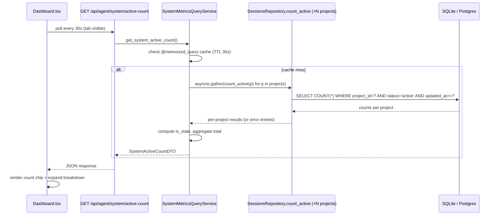

# Feature Brief & Metadata

**Feature Name:**

> System-Wide Metrics

**Filepath Name:**

> `system-wide-metrics-v1`

**Date:**

> 2026-05-20

**Author:**

> Claude Sonnet 4.6 (PRD Writer)

**Related Epic(s)/PRD ID(s):**

> - Precondition (Tier 1): `docs/project_plans/feature_contracts/features/live-agents-count-v1.md`
> - Precondition (Tier 1, HARD): `docs/project_plans/feature_contracts/features/watcher-rebind-on-active-project-switch-v1.md`

**Related Documents:**

> - `.claude/worknotes/system-wide-live-metrics-spike/spike.md` — primary research source
> - `backend/application/services/agent_queries/` — transport-neutral intelligence layer (CCDash convention)
> - `backend/routers/agent.py` — REST transport for agent intelligence queries
> - `backend/mcp/server.py` — MCP stdio transport
> - `backend/cli/` — Typer CLI surface

---

## 1. Executive Summary

CCDash manages 36 declared projects but its home dashboard presents only active-project metrics — there is no system-wide view of how many agent sessions are running across all known projects. This feature introduces a reusable, transport-neutral `SystemMetricsQueryService` that aggregates live agent counts and session summaries across all projects, exposes them via REST, MCP, and CLI, and renders a trustworthy "currently running" count on the home dashboard with per-project freshness indicators.

**Priority:** MEDIUM

**Key Outcomes:**
- Outcome 1: Home dashboard shows a system-wide live agent count that developers trust, including stale-data indicators when non-active projects have not been recently synced.
- Outcome 2: A reusable `SystemMetricsQueryService` in `agent_queries/` provides an extension point for future system-wide metrics (sessions/day, token usage, error rates).
- Outcome 3: The REST API contract is widget-friendly (small payload, cheap to poll, freshness metadata included) and ready for a future desktop widget feature without contract changes.

---

## 2. Context & Background

### Current state

Every service in `backend/application/services/agent_queries/` enters via `resolve_project_scope` (`_filters.py:35`) and operates on a single project. The runtime starts the file watcher, startup-sync, analytics snapshot, telemetry export, and cache warming all bound to the **active project** at startup (`backend/adapters/jobs/runtime.py:135–186`). `projects.json` currently declares 36 projects; none of the non-active ones receive live watcher updates.

The sessions table already stores `status`, `project_id`, and `updated_at` for every project that has ever been active. A runtime verification (spike §OQ-3, 2026-05-20) confirmed that non-active project rows are **arbitrarily stale**: the CCDash project itself had a `status='active'` row with `updated_at` 57 days in the past; a verification project had one 93 days stale. Without freshness metadata surfaced to the UI, cross-project aggregation silently produces wildly incorrect "live" counts.

The planning session board (`PlanningSessionQueryService`) already computes a per-project running-agent count, but it builds the full board (up to 500 sessions, correlation, grouping) to produce it — far too heavy for a polling home-dashboard chip.

The Tier 1 live-count primitive (`live-agents-count-v1`) introduces `SessionsRepository.count_active(project_id, window_seconds, include_subagents)` and the composite DB index `idx_sessions_project_status_updated`. This PRD builds the cross-project aggregation layer on top of that primitive.

### Architectural context

CCDash follows the **transport-neutral agent queries** convention (CLAUDE.md): intelligence logic lives in `backend/application/services/agent_queries/`, then wired to REST (`backend/routers/agent.py`), MCP (`backend/mcp/server.py`), and CLI (`backend/cli/`) independently. This PRD introduces `system_metrics.py` in that package following the same pattern as `project_status.py` and `planning_sessions.py`.

The router→service→repository pattern applies: `agent.py` router calls `SystemMetricsQueryService`, which fans out via `asyncio.gather` to per-project repository calls, and aggregates results into a structured DTO.

---

## 3. Problem Statement

The home dashboard has no cross-project view of agent activity. A developer running sessions across multiple projects must switch active projects to check each one individually — there is no "what's running right now across my entire workspace" answer available anywhere in CCDash.

**User story:**
> "As a developer orchestrating work across multiple projects, when I open the CCDash home dashboard, I see only the active project's metrics instead of a system-wide summary of how many agents are currently running and where."

**Technical root causes:**
- `resolve_project_scope` forces all agent queries into single-project scope — no cross-project query path exists (spike §2.6, confirmed by grep).
- The file watcher is bound once at startup to the active project and never rebound on project switches (spike OQ-3 runtime verification). Non-active project DB rows accumulate staleness indefinitely.
- The sessions table's `status='active'` rows for non-active projects are not invalidated — they remain `'active'` until the next startup-sync for that project, which only happens when it becomes the active project again.

---

## 4. Goals & Success Metrics

### Primary goals

**Goal 1: System-wide live count on home dashboard**
- Surface the total number of currently running agent sessions across all 36 projects on the home dashboard.
- Users can expand the count to see a per-project breakdown.
- Stale projects are flagged visually, never presented as authoritative.

**Goal 2: Reusable cross-project metrics layer**
- `SystemMetricsQueryService` is the extension point for future system-wide metrics (sessions/day, token usage by project, error rates). Adding a new metric requires extending the per-project bundle, not a new aggregation architecture.

**Goal 3: Widget-ready API contract**
- `GET /api/agent/system/active-count` returns a small, polling-friendly payload with freshness metadata. Payload shape does not need to change for a future desktop widget integration.

### Success metrics

| Metric | Baseline | Target | Measurement method |
|--------|----------|--------|-------------------|
| System-wide live count visible on home dashboard | 0 (not present) | Rendered on every dashboard load | UI smoke test |
| Aggregate latency (p95, 36 projects) | N/A | < 200 ms uncached | Integration test with fixture |
| Cached repeat latency | N/A | < 20 ms | Integration test |
| Stale-project rate accurately flagged | N/A | 100% of projects older than horizon flagged `is_stale: true` | Unit test against multi-project fixture |
| Single-project failure isolation | N/A | Aggregate succeeds with error entry when any one project fails | Unit test |

---

## 5. User Personas & Journeys

### Personas

**Primary persona: Multi-project developer**
- Role: Developer orchestrating AI agent sessions across several repos (e.g., CCDash + SkillMeat + a client project).
- Needs: At-a-glance view of "what's running right now" without switching projects in CCDash.
- Pain points: Must currently switch active project to see any session-level status for that project.

**Secondary persona: Automation / widget consumer**
- Role: Developer or ops script that polls CCDash for live-agent status (e.g., a Raycast extension, a menubar widget prototype).
- Needs: A small, cheap, stable REST endpoint returning total active count + per-project summary + freshness metadata.
- Pain points: No cross-project endpoint exists; per-project endpoint requires knowing project IDs and issuing N requests.

### High-level flow

---

## 6. Requirements

### 6.1 Functional requirements

| ID | Requirement | Priority | Notes |
|:--:|-------------|:--------:|-------|
| FR-1 | `SystemMetricsQueryService.get_system_active_count()` returns `{total, per_project, generated_at, window_seconds}` | Must | Canonical shape per spike §5 |
| FR-2 | `per_project` list includes `{project_id, project_name, count, is_stale, last_synced_at}` per project in `workspace_registry.list_projects()` | Must | All 36 projects represented |
| FR-3 | `is_stale = true` when the project's `max(sessions.updated_at)` is older than `CCDASH_SYSTEM_METRICS_STALE_HORIZON_SECONDS` (default 3600) | Must | Configurable via env |
| FR-4 | If a single project's count query fails, that entry returns `{count: null, error: "<message>", is_stale: null}` and the aggregate continues with remaining projects | Must | Resilience-by-default (CLAUDE.md) |
| FR-5 | Aggregation uses `asyncio.gather` with bounded concurrency (`asyncio.Semaphore`, default 10) across all projects | Must | Performance + DB connection safety |
| FR-6 | Results are cached via `@memoized_query` with TTL configurable by `CCDASH_SYSTEM_METRICS_CACHE_TTL_SECONDS` (default 30) | Must | Separate from the general query cache TTL |
| FR-7 | `GET /api/agent/system/active-count` on `backend/routers/agent.py` returns the DTO above | Must | REST transport |
| FR-8 | MCP tool `ccdash_system_active_count` on `backend/mcp/server.py` returns identical payload as FR-7 | Must | MCP transport |
| FR-9 | CLI `ccdash system active-count [--json]` under `backend/cli/` renders human-readable table or raw JSON | Must | CLI transport |
| FR-10 | Home dashboard renders total count chip; chip expands to per-project breakdown (collapsed by default) | Must | Frontend surface |
| FR-11 | Per-project breakdown renders `is_stale` indicator (e.g., warning icon + tooltip with `last_synced_at`) for stale entries | Must | Frontend resilience |
| FR-12 | Frontend polling interval defaults to 30s; paused when `document.visibilityState === 'hidden'` | Should | Battery/resource friendliness |
| FR-13 | `GET /api/agent/system/active-count` includes `Cache-Control: max-age=30` header | Should | Widget consumer caching hint |
| FR-14 | Session type `subagent` excluded by default (mirrors existing `count_active` convention) | Must | Consistent with live-count Tier 1 |

### 6.2 Non-functional requirements

**Performance:**
- Aggregation must complete in < 200 ms p95 against 36 projects with the composite index `idx_sessions_project_status_updated` from the live-count Tier 1.
- Cached repeat calls must return in < 20 ms.
- Design must hold to ~100 projects in-process; above that, the single-SQL `GROUP BY` escape hatch (spike Option 2) or the background-rollup table (spike Option 3) applies.

**Reliability:**
- A single project count failure must not fail the aggregate response (FR-4).
- The service must return a valid DTO (with `status: "partial"`) even when all per-project queries fail.
- `is_stale` must always be populated — it is a contract state, not an optional field.

**Resilience (R-P2 — resilience-by-default):**
- Frontend must handle `count: null` entries in the per-project list without crashing.
- Frontend must handle a missing or empty `per_project` array (renders "breakdown unavailable").
- Frontend must handle a missing `is_stale` field (treat as `true` / unknown freshness).

**Observability:**
- OpenTelemetry span wrapping `SystemMetricsQueryService.get_system_active_count()` with attributes: `project_count`, `stale_project_count`, `error_project_count`, `cache_hit`.
- Structured log at DEBUG level per project in the fan-out; single INFO log at aggregate completion.

**Security:**
- The endpoint is read-only and unauthenticated in v1 (consistent with all other CCDash local-first endpoints). No user data is exposed beyond project names and counts.

---

## 7. Scope

### In scope

- `SystemMetricsQueryService` in `backend/application/services/agent_queries/system_metrics.py`.
- `SystemActiveCountDTO` and `ProjectActiveCountSummaryDTO` Pydantic models in `backend/models.py`.
- `GET /api/agent/system/active-count` REST endpoint.
- `ccdash_system_active_count` MCP tool.
- `ccdash system active-count [--json]` CLI command.
- Home dashboard live count chip and expandable per-project breakdown.
- `is_stale` flag per project with configurable horizon env var.
- `CCDASH_SYSTEM_METRICS_STALE_HORIZON_SECONDS` and `CCDASH_SYSTEM_METRICS_CACHE_TTL_SECONDS` env vars.
- Unit tests with a multi-project fixture (including at least one stale project and one erroring project).
- Integration test verifying REST/MCP/CLI return identical aggregates for the same input state.
- Runtime smoke test (dev server, home dashboard, visual stale indicator verification).
- CHANGELOG entry and CLAUDE.md convention pointer update.
- Deferred items specification stubs for: background rollup table, lazy on-demand per-project rescan, desktop widget API hardening.

### Out of scope

- Replacing or altering any project-scoped metrics — system-wide is additive.
- Push/SSE updates for the count (polling is sufficient for v1).
- Cross-project full-text session search or session inspection.
- A separate timeseries store or Prometheus integration (observability stack already handles metrics export).
- The desktop widget itself (this PRD delivers the API contract; the widget is a future feature).
- Multi-project file watcher (`CCDASH_WATCH_ALL_PROJECTS`) — deferred to the watcher-rebind follow-on.
- Lazy on-demand per-project rescan during `get_system_active_count` — deferred (see §12 OQ-1).

---

## 8. Dependencies & Assumptions

### Internal dependencies (hard)

| Dependency | Status | Notes |
|------------|--------|-------|
| `live-agents-count-v1` (Tier 1 Feature Contract) | Precondition (soft) | Provides `SessionsRepository.count_active()` and `idx_sessions_project_status_updated` index. Could be built standalone but DRY cost is high. |
| `watcher-rebind-on-active-project-switch-v1` (Tier 1 Feature Contract) | **HARD precondition** | Without this, non-active project data is arbitrarily stale (verified: up to 93 days). `is_stale` is the only safety net until watcher rebind ships. Do not ship system-wide metrics to users without ensuring `is_stale` is prominently surfaced. |

**Watcher-rebind dependency elaboration:** The OQ-3 runtime verification (spike appendix, 2026-05-20) confirmed that `set_active_project` does not rebind the file watcher. Non-active projects accumulate unbounded staleness — the CCDash project itself had a `status='active'` row 57 days stale at verification time. The `is_stale` flag and the freshness clamp in `count_active` (`updated_at >= now() - window_seconds`) prevent wildly wrong counts, but the "live agents across non-active projects" promise is hollow until the watcher rebind Tier 1 ships. The system-wide metrics layer is buildable and testable independently, but should be released to users in a release that also contains watcher rebind.

### Assumptions

- 36 projects is the current scale. The in-process fan-out design holds to ~100 projects without degradation; above that, the escape hatch is a single-SQL `GROUP BY` or the background rollup table (see §12 OQ-3).
- All projects share a single CCDash cache DB (SQLite default or Postgres). Multi-DB-per-project deployments are not supported in v1.
- The `workspace_registry.list_projects()` method returns all known projects including inactive ones. This is the authoritative project list; `projects.json` is the backing store.
- `CCDASH_LIVE_AGENTS_WINDOW_SECONDS` (default 600) from the live-count Tier 1 is the shared window constant. `SystemMetricsQueryService` reads this env var and passes it to `count_active`.

### Feature flags

| Flag | Default | Purpose |
|------|---------|---------|
| `CCDASH_SYSTEM_METRICS_STALE_HORIZON_SECONDS` | `3600` | Project considered stale if `max(sessions.updated_at)` older than this many seconds |
| `CCDASH_SYSTEM_METRICS_CACHE_TTL_SECONDS` | `30` | Cache TTL for system metrics; separate from general query cache TTL |
| `CCDASH_SYSTEM_METRICS_CONCURRENCY` | `10` | `asyncio.Semaphore` bound for per-project fan-out |

---

## 9. Risks & Mitigations

| Risk | Impact | Likelihood | Mitigation |
|------|:------:|:----------:|------------|
| Non-active project data inflates/deflates live counts (stale `status='active'` rows) | High | High (confirmed by OQ-3 verification — 93-day stale rows exist today) | `is_stale` flag per project + `updated_at` freshness clamp in `count_active` + HARD dependency on watcher-rebind Tier 1 before user-facing release |
| Fan-out across many projects hits performance ceiling | Medium | Low (36 projects, indexed query ~5–10 ms each) | Bounded `asyncio.Semaphore` + cache TTL; escape hatch to single-SQL `GROUP BY` (spike Option 2) above ~100 projects; escape hatch to background rollup (spike Option 3) above ~200 |
| Widget consumers poll aggressively, bypassing the cache | Medium | Low | Cache TTL env var + `Cache-Control: max-age=N` response header + document recommended polling interval (30s) in OpenAPI description |
| Frontend crashes on missing/null per-project entries | Medium | Low | R-P2: explicit AC for null `count`, missing `is_stale`, and empty `per_project` array; verified by unit tests |
| Watcher-rebind Tier 1 delayed — system-wide metrics ships without it | High | Medium | Gate user-facing release on watcher-rebind. If shipped before watcher-rebind: display a persistent banner in the per-project breakdown ("counts for inactive projects may be stale") and ensure `is_stale` tooltip includes `last_synced_at`. |
| `asyncio.gather` stampede on home-dashboard load | Low | Low | Semaphore bound (FR-5) + cache (FR-6); cold-cache worst case is one fan-out, subsequent requests hit cache |

---

## 10. Target State (Post-Implementation)

**User experience:**
- The home dashboard renders a "Live now" chip showing total running agents across all 36 projects. Clicking/expanding the chip reveals a per-project table: project name, count, and a warning icon for projects whose data is older than 1 hour.
- A developer with sessions running in two different projects sees both reflected in the total, provided both projects have been the active project recently enough to have non-stale DB rows. Projects with stale data show `is_stale` icons and the last-synced timestamp as a tooltip, making the data quality transparent.
- CLI and MCP consumers (`ccdash system active-count --json`, `ccdash_system_active_count` tool) return the same payload, enabling scripting and agent-tool consumption without hitting the frontend.

**Technical architecture:**
- `SystemMetricsQueryService` in `agent_queries/system_metrics.py` is the single source of truth for system-wide metrics. It composes `SessionsRepository.count_active` (from live-count Tier 1) across all projects via `asyncio.gather`.
- REST endpoint `GET /api/agent/system/active-count` is a thin adapter in `backend/routers/agent.py`.
- MCP tool `ccdash_system_active_count` in `backend/mcp/server.py` and CLI command `ccdash system active-count` in `backend/cli/` share the same service call.
- The deferred background rollup table (spike Option 3) is a backing-store swap beneath `SystemMetricsQueryService`; the DTO contract and all consumers remain unchanged.

**Observable outcomes:**
- System-wide live count visible on home dashboard — measurable by UI smoke test.
- `is_stale` accuracy verified against multi-project fixture with known staleness ages.
- REST/MCP/CLI parity verified by integration test.
- p95 latency < 200 ms for uncached aggregation confirmed by performance test.

---

## 11. Overall Acceptance Criteria (Definition of Done)

### AC-1: Transport parity

**Short description:** REST, MCP, and CLI return identical aggregate counts for the same DB state.

- **target_surfaces:**
  - `backend/routers/agent.py` (`GET /api/agent/system/active-count`)
  - `backend/mcp/server.py` (`ccdash_system_active_count`)
  - `backend/cli/` (`ccdash system active-count --json`)
- **propagation_contract:** All three transports call `SystemMetricsQueryService.get_system_active_count()` directly; no transport-layer data transformation.
- **resilience:** Each transport independently handles `ServiceError` and returns a structured error response (REST: 500 + error body; MCP: tool error; CLI: exit code 1 + stderr message).
- **visual_evidence_required:** false
- **verified_by:** Integration test `test_system_metrics_transport_parity` seeding a multi-project fixture and calling all three surfaces.

### AC-2: Staleness signal accuracy

**Short description:** `is_stale` is true when `max(sessions.updated_at)` for a project is older than `CCDASH_SYSTEM_METRICS_STALE_HORIZON_SECONDS`; false otherwise.

- **target_surfaces:**
  - `backend/application/services/agent_queries/system_metrics.py`
  - `backend/routers/agent.py` (field propagated in REST response)
  - `components/Dashboard.tsx` (stale indicator rendered)
- **propagation_contract:** Service computes `is_stale` per project and includes it in `ProjectActiveCountSummaryDTO`. Router serializes it unchanged. Frontend reads `perProject[n].is_stale` and renders warning icon.
- **resilience:** If `max(sessions.updated_at)` is null for a project (no rows), `is_stale` is set to `true`. Frontend renders stale indicator for `is_stale: null` as well (treat unknown as stale).
- **visual_evidence_required:** Screenshot of home dashboard showing at least one project with stale indicator and one without.
- **verified_by:** Unit test `test_stale_horizon_boundary` with three fixture projects: fresh (updated 5 min ago), boundary (updated exactly at horizon), stale (updated 2h ago).

### AC-3: Resilience — single-project failure isolation

**Short description:** A single project's count failure does not fail the aggregate; that project appears with `count: null` and `error: "<message>"`.

- **target_surfaces:**
  - `backend/application/services/agent_queries/system_metrics.py`
  - `backend/routers/agent.py` (aggregate `status: "partial"` when ≥1 error)
  - `components/Dashboard.tsx` (renders breakdown entry for error project without crash)
- **propagation_contract:** `asyncio.gather(return_exceptions=True)` pattern; service maps exceptions to error entries in `per_project`; REST sets `status: "partial"`.
- **resilience:** Frontend handles `count: null` by rendering "—" in the breakdown table; handles missing `error` field by omitting error tooltip.
- **visual_evidence_required:** false
- **verified_by:** Unit test `test_partial_aggregate_resilience` with one project's count stubbed to raise `Exception`.

### AC-4: Performance budget

**Short description:** Uncached aggregation across 36 projects completes in < 200 ms p95; cached repeat in < 20 ms.

- **target_surfaces:**
  - `backend/application/services/agent_queries/system_metrics.py`
- **propagation_contract:** Measured end-to-end in the service (not including HTTP overhead).
- **resilience:** N/A (performance).
- **visual_evidence_required:** false
- **verified_by:** Integration test `test_system_metrics_performance` with 36-project fixture on SQLite WAL mode; asserts p95 < 200 ms over 10 runs.

### AC-5: Frontend home dashboard surface

**Short description:** Home dashboard renders the system-wide count chip, supports expand-to-breakdown interaction, and degrades gracefully on missing/stale entries.

- **target_surfaces:**
  - `components/Dashboard.tsx`
- **propagation_contract:** Dashboard polls `GET /api/agent/system/active-count` at 30s intervals (paused when tab hidden). Count chip renders `total` field. Expanded breakdown renders `per_project` array.
- **resilience:** If `per_project` is absent or empty: renders "breakdown unavailable" message, not a crash. If individual entry has `count: null`: renders "—". If `is_stale` is absent: treats as stale (warning icon). If the entire fetch fails: renders last known value with a "data may be outdated" indicator.
- **visual_evidence_required:** Screenshot of expanded breakdown on home dashboard (desktop ≥ 1280px) showing count chip + per-project table with at least one stale indicator.
- **verified_by:** Vitest unit test for the breakdown component with mock response variants (full, partial, empty, null fields). Runtime smoke test (AC-6).

### AC-6: Runtime smoke test (R-P4)

**Short description:** Full dev-stack smoke test confirming system-wide count and stale indicators are visible on the home dashboard against the live `projects.json` state.

- **target_surfaces:**
  - `components/Dashboard.tsx`
  - `GET /api/agent/system/active-count` (live backend)
- **propagation_contract:** `npm run dev` → open home dashboard → observe count chip → expand breakdown → verify stale indicators appear for known-stale projects (any non-active project with `updated_at` older than 1h in the local DB).
- **resilience:** If runtime is unavailable, this AC cannot be substituted by unit tests. Mark `runtime_smoke: skipped` with explicit reason only if a blocking infrastructure issue prevents running the dev stack.
- **visual_evidence_required:** Screenshot of the home dashboard with count chip expanded, stale indicators visible.
- **verified_by:** Manual operator run during Phase 5 verification.

---

## 12. Assumptions & Open Questions

### Assumptions

- The in-process fan-out with the existing shared SQLite/Postgres connection is sufficient for 36 projects. This assumption is validated by the spike's estimate (~5–10 ms per project concurrently → ~50–100 ms wall clock).
- `workspace_registry.list_projects()` is cheap (in-memory list from `projects.json`; no DB call). It can be called on every `get_system_active_count()` invocation without caching.
- The live-count Tier 1 composite index `idx_sessions_project_status_updated` ships before or together with this feature. Without it, the per-project count queries fall back to a full-table scan on `sessions` per project — still correct but slower.

### Open questions

| ID | Question | Status | Resolution |
|----|----------|--------|------------|
| OQ-1 | Should the service trigger a lazy per-project rescan (mtime-glob → parse-recent) for non-active projects during `get_system_active_count`? | **Deferred.** | Scope risk in v1: rescan concurrency + stampede risk on home-dashboard load. Mitigation (c) (`is_stale` flag) is mandatory; mitigation (a) (lazy rescan) is deferred to a follow-on spec. `CCDASH_STARTUP_SYNC_LIGHT_MODE` plumbing exists but needs wiring. |
| OQ-2 | Should `subagent` sessions be counted by default in the system-wide total? | Resolved: **No.** | Mirrors `count_active(include_subagents=False)` default from live-count Tier 1. Operator can override via CLI flag if desired. |
| OQ-3 | Scale ceiling: when does the in-process fan-out need to be replaced? | Resolved: **~100 projects in-process; ~200 projects triggers background rollup.** | Deferred-items spec will document the Option 2 (single-SQL `GROUP BY`) and Option 3 (background rollup table) escape hatches. |
| OQ-4 | Should `CCDASH_SYSTEM_METRICS_CACHE_TTL_SECONDS` default to 30 or to `CCDASH_QUERY_CACHE_TTL_SECONDS`? | Resolved: **Separate default of 30s.** | General query cache defaults to 60s; 30s is more responsive for a live-count chip. Operator can align them via env if desired. |
| OQ-5 | Postgres parity for staleness computation: `max(sessions.updated_at)` — does this require a separate DB call or can it be inlined into `count_active`? | **Open.** | Implementation plan will specify. Preferred: a separate cheap `SELECT MAX(updated_at) FROM sessions WHERE project_id = ?` called in the same gather bundle, or as an extended return value from `count_active`. |

---

## 13. Estimation Sanity Check

Applied against the spike's recommendation of ~8–10 pts and anchored against comparable `agent_queries/` surfaces.

### H1 — Noun counting

New domain nouns introduced: **2**
- `SystemActiveCountDTO` (aggregate response DTO)
- `ProjectActiveCountSummaryDTO` (per-project summary DTO)

These are read-only DTOs — no new CRUD tables, no new write paths. H1 floor is minimal: ~0.5 pts for DTO authoring (no full CRUD stack). The value of this feature is in the service and transport wiring, not in new entity persistence.

### H2 — Dual-implementation multiplier

**Not applied.** CCDash repositories use a single SQLite/Postgres path (not split local/enterprise implementations). The `count_active` repository method from the Tier 1 primitive is already authored.

### H3 — Algorithmic flag

No algorithmic surface (no graph traversal, ranking, conflict detection, or scheduling). The fan-out aggregation is trivially parallel and the staleness calculation is a timestamp comparison. **No flag triggered.**

### H4 — Bundle decomposition (≥3 capability areas)

| Capability area | Independent estimate | Notes |
|-----------------|---------------------|-------|
| `SystemMetricsQueryService` (fan-out + staleness + cache) | 2.5 pts | Core service; new `system_metrics.py`; cache fingerprint helper |
| REST endpoint + DTO models | 1.0 pt | Thin router adapter; Pydantic models; OpenAPI schema |
| MCP tool | 0.5 pt | Single tool registration; delegates to service |
| CLI command | 0.5 pt | `ccdash system active-count`; reuses existing Typer patterns |
| Frontend (chip + breakdown + polling + resilience) | 2.5 pts | New component; polling hook; expand interaction; 3 resilience states |
| Testing (unit + integration + smoke) | 1.5 pts | Multi-project fixture; transport parity test; performance test |
| Docs + CHANGELOG + CLAUDE.md update | 0.5 pt | H6 plumbing budget included here |
| **Σ** | **9.0 pts** | |

### H5 — Anchor reference

**Anchor:** `ccdash-cli-mcp-enablement-v1` (`docs/project_plans/PRDs/features/ccdash-cli-mcp-enablement-v1.md`)
- Surface: transport wiring (REST + MCP + CLI) for existing backend intelligence services, no new DB schema.
- Estimated cost at planning: ~8 pts.
- This plan adds a new service layer on top of an equivalent transport-wiring scope, plus a frontend surface.
- **Delta justification:** +1 pt for the new service (fan-out logic, staleness computation, cache fingerprint) and +0.5–1 pt for the frontend chip. Bottom-up Σ of 9 pts is within ±15% of the spike's "8–10 pts" bracket. No re-derivation needed.

### H6 — Hidden plumbing budget

Included in the Documentation row above (0.5 pt): env var declarations in `config.py`, `CLAUDE.md` convention pointer, CHANGELOG entry, OpenAPI schema registration, `Cache-Control` header wiring.

### Sanity check summary

**Bottom-up total:** 9.0 pts
**Spike recommendation:** 8–10 pts
**Locked estimate:** **10 pts** (adding 1 pt buffer for OQ-5 resolution — the Postgres staleness computation path is uncertain; if straightforward, this rounds down to 9).

---

## Implementation (Phase Sketch)

Full task breakdown will appear in the implementation plan after Opus authors the Decisions Block (planning skill Workflow 2 step 2.5).

**Phase 1 — Cross-project query primitive**
- `SystemMetricsQueryService` in `backend/application/services/agent_queries/system_metrics.py`.
- `SystemActiveCountDTO` + `ProjectActiveCountSummaryDTO` Pydantic models.
- `is_stale` computation logic; `CCDASH_SYSTEM_METRICS_STALE_HORIZON_SECONDS` env var wiring.
- Cache fingerprint helper (per-project `max(sessions.updated_at)` composite key).
- `asyncio.Semaphore` bounded gather; per-project error isolation.

**Phase 2 — REST + MCP + CLI transport wiring**
- `GET /api/agent/system/active-count` in `backend/routers/agent.py`.
- `ccdash_system_active_count` MCP tool in `backend/mcp/server.py`.
- `ccdash system active-count [--json]` CLI command in `backend/cli/`.
- `CCDASH_SYSTEM_METRICS_CACHE_TTL_SECONDS` + `CCDASH_SYSTEM_METRICS_CONCURRENCY` env vars.

**Phase 3 — Frontend home dashboard surface**
- "Live now" count chip in `components/Dashboard.tsx`.
- Expand-to-breakdown interaction (collapsed by default).
- Per-project table: name, count, stale indicator (icon + `last_synced_at` tooltip).
- Polling hook (30s, paused on tab hidden).
- All R-P2 resilience states handled.

**Phase 4 — Testing**
- Unit: `test_stale_horizon_boundary`, `test_partial_aggregate_resilience`, `test_system_metrics_transport_parity`.
- Integration: 36-project fixture; performance assertion < 200 ms p95.
- Frontend: Vitest unit tests for count chip + breakdown with mock response variants.

**Phase 5 — Runtime smoke + documentation**
- Runtime smoke: `npm run dev` → home dashboard → count chip + stale indicators (AC-6).
- CHANGELOG `[Unreleased]` entry (Added: system-wide live agent count on home dashboard).
- CLAUDE.md convention pointer: `SystemMetricsQueryService` as the extension point for future system-wide metrics.
- Deferred-items spec stubs: background rollup (spike Option 3), lazy rescan (OQ-1), desktop widget API hardening.

### Epics & user stories backlog

| Story ID | Short name | Description | Acceptance criteria | Estimate |
|----------|-----------|-------------|-------------------|----------|
| SMW-001 | SystemMetricsQueryService | Author `system_metrics.py` with fan-out, staleness, cache | FR-1 through FR-6; H4 capability area 1 | 2.5 pts |
| SMW-002 | REST endpoint | `GET /api/agent/system/active-count` + DTOs | FR-7, AC-1 (REST surface) | 1.0 pt |
| SMW-003 | MCP tool | `ccdash_system_active_count` tool registration | FR-8, AC-1 (MCP surface) | 0.5 pt |
| SMW-004 | CLI command | `ccdash system active-count [--json]` | FR-9, AC-1 (CLI surface) | 0.5 pt |
| SMW-005 | Dashboard chip + breakdown | Count chip, expand interaction, polling hook | FR-10 through FR-12, AC-5 | 2.5 pts |
| SMW-006 | Unit + integration tests | Multi-project fixture, parity test, perf test | AC-1 through AC-4 | 1.5 pts |
| SMW-007 | Smoke + docs | Runtime smoke, CHANGELOG, CLAUDE.md, deferred specs | AC-6; FR-7 `Cache-Control` | 1.0 pt |

---

**Progress tracking:**

See progress tracking (to be created): `.claude/progress/system-wide-metrics/phase-N-progress.md`

---

## 13. Appendices & References

### Related documentation

- **Spike (primary source):** `.claude/worknotes/system-wide-live-metrics-spike/spike.md` — full research, options analysis, OQ-3 runtime verification
- **Transport-neutral pattern reference:** `backend/application/services/agent_queries/project_status.py` (closest structural analog)
- **Planning session board (aggregate pattern):** `backend/application/services/agent_queries/planning_sessions.py:298–442`
- **Watcher architecture:** `backend/adapters/jobs/runtime.py:135–186`; `backend/db/file_watcher.py:72–135`
- **Cache machinery:** `backend/application/services/agent_queries/cache.py` (`@memoized_query`)
- **Precondition Tier 1 contracts:** `docs/project_plans/feature_contracts/features/live-agents-count-v1.md`, `docs/project_plans/feature_contracts/features/watcher-rebind-on-active-project-switch-v1.md`
- **Anchor PRD:** `docs/project_plans/PRDs/features/ccdash-cli-mcp-enablement-v1.md`

### Prior art

- Spike §4 Options 1–3 provide the full option space analysis with trade-offs.
- Spike §5 specifies the minimal API surface (REST + CLI + MCP shape) that this PRD formalizes as requirements.
- Spike §OQ-3 runtime verification (2026-05-20) is the evidentiary basis for the watcher-rebind HARD dependency and the mandatory `is_stale` flag.
