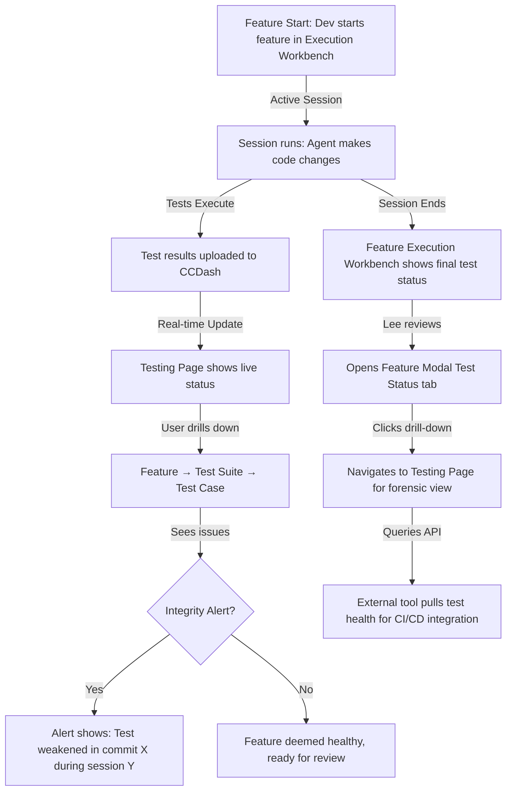

# PRD: Test Visualizer v1

## 1. Feature Brief & Metadata

**Feature Name:** Test Visualizer

**Filepath Name:** `test-visualizer-v1`

**Date:** 2026-02-28

**Author:** Claude (Haiku 4.5)

**Related Documents:**
- Design Spec: `docs/project_plans/designs/test-visualizer.md`
- Feature Execution Workbench: `docs/project_plans/PRDs/enhancements/feature-execution-workbench-v1.md`

---

## 2. Executive Summary

**Priority:** HIGH

Introduce a test and feature observability subsystem to CCDash that judges feature health by actual test coverage and integrity, not just "tests passing." The Test Visualizer adds four entry points—a dedicated Testing Page, Feature Modal Test Status Tab, Execution Page Test Status Tab, and Session Page Test Status Tab—all powered by a unified data pipeline that ingests test results, maps tests to domains and features, detects integrity signals (weakened assertions, suspicious skips), and correlates findings with agent sessions, commits, and implementation workflows.

**Key Outcomes:**
- Enable agents and engineers to assess feature health during and after agentic development sessions.
- Answer forensic questions like "when did this test break?" and "did the agent weaken the tests?"
- Provide live status updates during active sessions and historical views for completed work.
- Expose programmatic APIs for agent-driven test analysis and CLI tooling.

---

## 3. Context & Background

### Current State

CCDash already tracks agent sessions, features, documents, and analytics. However:

1. **No test observability**: SessionImpactPoint has stub fields (`testPassCount`, `testFailCount`) but no ingestion pipeline, no historical data, and no test-to-feature mapping.
2. **No domain grouping**: Tests exist but are not organized by domain, subdomain, or feature. A user cannot drill down from "Is feature X healthy?" to "which tests prove it?"
3. **No integrity signals**: The system cannot detect if an agent removed assertions, introduced skips, or weakened exception handling.
4. **No live correlation**: Test results from CI or local runs cannot be linked to agent sessions in real time.

### Problem Space

**For AI agent developers:**
- After an agent runs, they must manually check CI or run test suites locally to assess impact.
- They cannot see which tests are associated with which features or domains.
- They have no signal for whether tests were weakened (false positives).

**For engineering leads:**
- Reviewing agent work requires jumping between CI dashboards, test reports, and CCDash feature states.
- No way to audit test changes correlated with feature progress.
- No forensic trace of "first bad run" or "last known good" for a feature.

**For the system:**
- Answer: "Feature X is failing because commit Y changed module Z during agent session S" requires manual correlation across multiple systems.

### Current Alternatives / Workarounds

1. Run tests manually and cross-reference with CCDash feature status.
2. Check CI/CD dashboard separately from CCDash.
3. Use Git history and test diffs to infer which changes broke tests.
4. Rely on agent logs and manual inspection of session forensics.

All of these are fragmented and time-consuming.

### Architectural Context

CCDash follows a layered architecture:

- **Frontend:** React 19 + TypeScript, HashRouter, Tailwind CSS dark theme
- **Backend:** Python FastAPI + Uvicorn, SQLite (default) or PostgreSQL
- **Pattern:** Routers → Services → Repositories → DB
- **Data Flow:** Filesystem parsers → SyncEngine → SQLite/PostgreSQL → Repositories → REST API → Frontend

Existing subsystems:
- **SessionInspector:** Displays agent session logs, file updates, and impact history (includes ImpactView tab with stub test data).
- **FeatureExecutionWorkbench:** Centralizes feature context, documents, sessions, and analytics.
- **ProjectBoard:** Shows features and tasks in a modal-driven interface.
- **PlanCatalog:** Displays PRDs, implementation plans, and related documents.

---

## 4. Problem Statement

**User Story Format:**

> As an **AI agent developer**, when I complete a feature implementation via an agent session, I **cannot easily see which tests are passing or failing for that feature**, instead **having to manually run tests and cross-reference with CI**, causing delays and uncertainty about whether the agent preserved or weakened test coverage.

> As an **engineering lead**, when reviewing agent work, I **need to audit test changes and correlate failures with feature progress**, instead **finding test results fragmented across CI, CCDash, and Git history**, making it hard to answer "did this agent break the feature?"

> As a **system developer**, when agents modify code, I **need integrity signals that detect suspicious test weakening** (removed assertions, introduced skips, broad exception catches), instead **relying on human code review to catch these issues**.

**Technical Root Cause:**

1. No ingestion pipeline for test result parsing (JUnit XML, JSON) from local or CI runs.
2. No domain/feature-to-test mapping logic or storage.
3. No integrity analysis for test file changes.
4. SessionImpactPoint has stub fields but no backing data.
5. No correlation between test results and agent sessions in the DB or API.

---

## 5. Goals & Success Metrics

### Primary Goals

**Goal 1: Enable Live Test Status Visibility**

- Users can navigate to a dedicated Testing Page and see ALL tests across the project, organized by domain → subdomain → feature → test suite → test → test case.
- Status indicators (passing, failing, skipped, flaked) are visible at each level.
- The page updates in real time during active agent sessions.

**Goal 2: Establish Feature Health Assessment**

- A feature's health is computed from the set of tests mapped to it (passing %, integrity score, flake rate).
- Users can see a feature's health trend over time (historical view shows when it broke, when it was fixed).
- Feature Modal and Execution Page both expose test status tabs that drill down to the same data.

**Goal 3: Detect Integrity Signals**

- The system ingests test file changes (via Git) and correlates them with test result changes.
- Integrity alerts are generated for: assertions removed, skips introduced, xfails added, broad exception catches, tests edited shortly before turning green.
- Alerts are linked to agent sessions, commits, and run IDs.

**Goal 4: Provide Programmatic Access**

- Agents and CLI tools can query test health, domain status, feature timelines, integrity alerts, and correlations via REST API.
- API responses are structured (no ORM models), follow DTOs, and include links for drill-down.

**Goal 5: Unify Entry Points**

- Four UI surfaces share the same core components and data (Testing Page, Feature Modal "Test Status" Tab, Execution Page "Test Status" Tab, Session Page "Test Status" Tab).
- Users can navigate between views without losing context.
- All views respect the same filtering, sorting, and drill-down behavior.

### Success Metrics

| Metric | Baseline | Target | Measurement Method |
|--------|----------|--------|-------------------|
| Test result ingestion latency | N/A | < 500ms after test completion | API call time from CI webhook |
| Feature health accuracy | N/A | > 95% mapping confidence for top 20% of tests | Manual validation of 50 random samples |
| Live view update delay during active session | N/A | < 2 seconds after test completion | WebSocket or polling latency |
| Integrity alert precision | N/A | > 90% (< 10% false positives) | Manual audit of 100 alerts |
| Test Status Tab discoverability | N/A | > 80% of feature modals opened by test workflows show tabs | Telemetry on tab clicks |
| API adoption by agents/CLI | N/A | At least 2 internal tools consuming test health API | Audit of agent prompts/tools |
| Test mapping coverage | 0 | > 80% of tests have domain/feature mapping | Count of mapped vs unmapped tests |

---

## 6. User Personas & Journeys

### Personas

**Primary Persona: AI Agent Developer (Avery)**

- Role: Engineer who runs agentic coding sessions and needs to verify feature correctness.
- Needs: Quick validation that agent changes don't break tests; ability to see test health during and after session execution; forensic view of test failures linked to agent actions.
- Pain Points: Currently jumps between CI, terminal, and CCDash; no unified test observability; manual correlation between agent actions and test failures.
- Entry Point: Begins work on a feature via Feature Execution Workbench → clicks "Test Status" tab to see live test results.

**Secondary Persona: Engineering Lead (Lee)**

- Role: Reviews agent-generated code and makes decisions on feature readiness.
- Needs: Audit trail of test changes; visual proof that tests are not weakened; ability to identify "first bad run" and "last known good."
- Pain Points: Limited visibility into test coverage changes; hard to spot suspicious test modifications; must review multiple dashboards.
- Entry Point: Opens a feature or session → navigates to Testing Page for forensic analysis; reviews integrity alerts.

**Tertiary Persona: DevOps / CI Operator (Olivier)**

- Role: Manages test infrastructure and CI/CD pipelines.
- Needs: Programmatic access to test health; ability to query test status for features and domains; integration hooks for alerting.
- Pain Points: Test data is siloed in CI dashboards; no way to correlate CI results with CCDash feature state.
- Entry Point: Uses REST API to pull test health, feature timelines, and integrity signals; integrates with monitoring systems.

### High-level User Journey

---

## 7. Requirements

### 7.1 Functional Requirements

| ID | Requirement | Priority | Notes |
| :-: | ----------- | :------: | ----- |
| FR-1 | Parse test results from JUnit XML and optional JSON; extract status, duration, error fingerprint, artifact references | Must | Need flexible JSON extension for richer metadata. Support parameterized tests. |
| FR-2 | Ingest test result runs with metadata: run_id, timestamp, git_sha, branch, agent_session_id, env_fingerprint, trigger (local/CI) | Must | Uniqueness key: (run_id, test_id). Must support bulk ingestion. |
| FR-3 | Implement pluggable Domain Mapping Providers: RepoHeuristics, TestMetadata, SemanticLLM, UserOverrides | Must | Providers merge with precedence rules. Output: versioned mapping snapshots. |
| FR-4 | Resolve domain/subdomain/feature mappings from test metadata (markers, tags, path conventions) via RepoHeuristicsProvider | Should | Infer from: folder structure, naming patterns, dependency graph. Confidence score per mapping. |
| FR-5 | Import externally-generated mappings (e.g., from LLM semantic pass) via SemanticLLMProvider | Should | Accept JSON mapping file. Merge with existing mappings with conflict reporting. |
| FR-6 | Support future UI-authored mapping overrides via UserOverridesProvider | Could | Store as versioned artifact. Allow snapshot-in-time replay. |
| FR-7 | Detect integrity signals: assertions removed/weakened, skips/xfails introduced, broad exception catches, tests edited shortly before turning green | Should | Use Git diff + test result correlation. Store as IntegritySignal entities. Link to run_ids and commits. |
| FR-8 | Display dedicated Testing Page at `/tests` showing: Overall health + trend, Domain hierarchy with drilldown, Status indicators, Live updates during active sessions | Must | Hierarchy: Domain → Subdomain → Feature → Test Suite → Test → Test Case. Real-time updates via WebSocket or polling. |
| FR-9 | Add "Test Status" tab to Feature Modal showing test status during feature's development period (passing/failing counts, added/updated/removed tests) | Must | Tab is visible when feature has any mapped tests. Shows date range of feature work. Links to detailed Execution Page view. |
| FR-10 | Add "Test Status" tab to Execution Page (scoped to selected feature), showing LIVE view if session is active, otherwise historical view | Must | Reuses core components from Testing Page. Filtering by feature_id. |
| FR-11 | Add "Test Status" tab to Session Page (scoped to selected session), showing LIVE view if session is active, otherwise historical view | Must | Reuses core components from Testing Page. Filtering by agent_session_id. Highlight tests modified during the session. |
| FR-12 | Expose REST API endpoints for programmatic test health access: GET /api/tests/health/domains, GET /api/tests/health/features?domain=..., GET /api/tests/runs/{run_id}, GET /api/tests/{test_id}/history, GET /api/tests/features/{feature_id}/timeline, GET /api/tests/integrity/alerts?since=..., GET /api/tests/correlate?run_id=... | Must | Return DTOs (not ORM models). Cursor pagination for lists. Include_links for drill-down. Error responses follow ErrorResponse envelope. |
| FR-13 | Store test results as append-only events keyed by (run_id, test_id); maintain precomputed rollups for latest status per domain/feature | Should | Use partitioning or indexing for performance. Fingerprints for efficient joins. |
| FR-14 | Version mapping snapshots (compact JSON + hash) to allow historical replay of test-to-feature associations | Should | Store provenance: provider source, confidence, timestamp. Allow query "what was the mapping on date X?" |
| FR-15 | Correlate test failures with agent sessions, commits, file changes, and implementation workflow milestones | Must | Link test result → commit SHA → agent session ID → feature state. Enable "Feature X failed because commit Y during session S." |
| FR-16 | Support live, real-time updates during active agent sessions (e.g., new test results arrive and UI updates without page reload) | Should | Use polling (60s interval) or WebSocket. Fallback to polling if WebSocket not available. |
| FR-17 | All four entry points (Testing Page, Feature Modal tab, Execution Page tab, Session Page tab) share core display components for consistency | Must | Single source of truth for test status rendering. Variants: full page, modal tab, filtered view. |

### 7.2 Non-Functional Requirements

**Performance:**

- Test result ingestion < 500ms for single run (< 5s for bulk 100 runs).
- Domain/Feature drilldown page load (initial render) < 1s.
- Query /api/tests/health/domains with 100+ domains and 1000+ tests < 500ms.
- Real-time update delay during active session < 2 seconds (WebSocket) or < 60 seconds (polling).
- Mapping resolution (all providers) < 1s for 1000 tests.
- Historical timeline query (12 months of data) < 2s.

**Storage:**

- Full test logs/artifacts stored as blob references; only fingerprints and pointers in DB.
- Append-only test results to avoid overwrites and enable audit trail.
- Mapping snapshots stored as versioned JSON blobs.
- Target DB size: < 500MB for 1 year of 50 daily test runs (500 tests each).

**Reliability:**

- Test ingestion must be idempotent (same run_id, test_id input always produces same output).
- Mapping resolution must handle missing or conflicting provider outputs without crashing.
- Integrity signal detection must run asynchronously and not block result ingestion.
- All API endpoints must return graceful errors if test data is incomplete or mappings are missing.

**Accessibility:**

- All test status UI components must be WCAG 2.1 AA compliant.
- Drill-down hierarchies must support keyboard navigation.
- Color-only status indicators must have accompanying text labels (e.g., "Failing" not just red).

**Observability:**

- OpenTelemetry spans for all test ingestion, mapping resolution, and API queries.
- Structured JSON logs with trace_id, span_id, session_id, run_id.
- Metrics: test ingestion rate (per minute), mapping provider latency, integrity alert rate, API latency percentiles.
- Alerts for: failed ingestion, mapping conflicts, integrity signals above threshold.

---

## 8. Scope

### In Scope

1. **Test Ingestion Pipeline:**
   - JUnit XML parsing and JSON extension support.
   - Run metadata capture (git_sha, branch, session_id, env_fingerprint).
   - Idempotent bulk ingestion via REST API.

2. **Domain Mapping:**
   - RepoHeuristicsProvider (folder structure, naming patterns, dependency hints).
   - TestMetadataProvider (tags, markers, annotations from test framework).
   - SemanticLLMProvider (external mapping import).
   - Mapping storage with versioning and provenance.

3. **Integrity Signals:**
   - Detection of assertion changes, skip/xfail introduction, broad exception catches.
   - Temporal correlation (test edited shortly before turning green).
   - Alert storage linked to runs and commits.

4. **Four UI Entry Points:**
   - Dedicated Testing Page (`/tests`) with domain → feature → test hierarchy.
   - Feature Modal "Test Status" tab.
   - Execution Page "Test Status" tab (feature-scoped).
   - Session Page "Test Status" tab (session-scoped).

5. **REST API Layer:**
   - All seven endpoints listed in FR-12.
   - DTO models (no ORM exposure).
   - Cursor pagination, error envelope, tracing.

6. **Database Layer:**
   - New tables/collections: Run, TestResult, TestDefinition, Domain, Feature, Mapping, IntegritySignal.
   - Repositories for each entity.
   - Migrations for SQLite and PostgreSQL backends.

7. **Correlation System:**
   - Link test results to agent sessions via session_id.
   - Link test results to commits via git_sha.
   - Link to features via mapping.
   - Enable "drill-down" from test failure → commit → session.

### Out of Scope

1. **CI/CD Pipeline Integration:** Custom CI/CD webhooks, GitHub Actions plugins, or external test orchestration (defer to Phase 2 or external tool integration).
2. **Cloud-hosted Features:** SaaS test storage, distributed tracing backend, external alerting integrations (local only; integrations deferred).
3. **Advanced Flake Detection:** Statistical flake analysis, re-run correlation across multiple days (Phase 2 enhancement).
4. **UI Mapping Editor:** In-app mapping override UI (Phase 2; API support in v1).
5. **Test Execution / Orchestration:** Running tests via CCDash; only observing results from external sources.
6. **Performance Optimization Phase 2:** Caching, materialized views, query optimization (Phase 6-7).

---

## 9. Dependencies & Assumptions

### External Dependencies

- **Python FastAPI:** Already in use; no version change required.
- **SQLite/PostgreSQL:** Already supported; must maintain both.
- **Git CLI:** For integrity signal detection (blame, diff, log); assumed available on host.
- **JUnit XML Library (pytest-style):** Python library for parsing (e.g., `junitparser` or `junit_xml`).

### Internal Dependencies

- **Session/Feature Correlation System:** Already exists in CCDash (SessionInspector, FeatureExecutionWorkbench). This PRD depends on existing feature_id ↔ session_id linking.
- **Git Integration:** CCDash already captures git_sha, branch, and commits per session. This PRD depends on that data being accurate.
- **Repository Pattern:** All data access must follow the existing repository layer (Repositories pattern in `backend/db/repositories/`).
- **API Router Pattern:** All endpoints must follow FastAPI router pattern (in `backend/routers/`).

### Assumptions

1. **Test metadata available in test files:** Assume test frameworks (pytest, unittest, etc.) support markers/tags that can be parsed or reflected.
2. **Agent sessions accurately record git_sha:** Assume SessionImpactPoint and AgentSession.gitCommitHash are reliably populated.
3. **Domain boundaries are inference-able from code:** Assume folder structure, naming patterns, or dependency graphs contain enough signal for RepoHeuristics to infer domains with > 70% accuracy.
4. **Test runs are one-off:** Assume tests run once per integration event (agent session end, CI trigger); not continuous re-runs on the same commit.
5. **CCDash is single-user or low-concurrent:** No need for distributed lock coordination or consensus on mapping; eventual consistency acceptable.

### Feature Flags

- `CCDASH_TEST_VISUALIZER_ENABLED`: Enable/disable entire Test Visualizer subsystem (default: false, enable in Phase 1).
- `CCDASH_INTEGRITY_SIGNALS_ENABLED`: Enable integrity signal detection (default: false, enable in Phase 3).
- `CCDASH_LIVE_TEST_UPDATES_ENABLED`: Enable WebSocket-based live updates (default: false, use polling; Phase 5).
- `CCDASH_SEMANTIC_MAPPING_ENABLED`: Enable SemanticLLMProvider (default: false, Phase 2).

---

## 10. Risks & Mitigations

| Risk | Impact | Likelihood | Mitigation |
| ----- | :----: | :--------: | ---------- |
| Test result data volume exceeds SQLite capacity (100+ tests × 100+ runs/month → millions of rows) | High | Medium | Implement append-only partitioning, archival strategy, blob references for logs. Phase 6 adds PostgreSQL query optimization or time-series DB. Monitoring alerts at 80% DB size. |
| Domain mapping inaccuracy (providers conflict, low confidence mappings create false links) | High | Medium | Implement conflict resolution strategy and confidence scoring. Require > 70% confidence for "primary" mapping. Log provider disagreements. Phase 2 adds manual override UI. Start with RepoHeuristicsProvider only; add others incrementally. |
| Integrity signal false positives (report "test weakened" when assertion was refactored, not removed) | Medium | High | Strict detection rules: only flag removed lines, not modified. Require 2+ signals per test before alert. Manual review phase before rollout; tune detection thresholds. Archive false positives for learning. |
| Real-time updates create WebSocket overhead (1000+ clients polling simultaneously) | Medium | Medium | Implement polling-first strategy (60s interval); defer WebSocket to Phase 5. Use Redis or in-memory cache for rollups to avoid repeated DB queries. Monitor CPU/memory during load testing. |
| Agent session ↔ test result correlation is incomplete (test run doesn't record session_id, or session_id is wrong) | Medium | Medium | Require explicit run metadata parameter in ingestion API. Validate session_id exists before storing. Log mismatches. Provide migration utility for backfilling old runs. |
| Git-based integrity detection fails (repo history not available, Git CLI not installed, blame is slow on large files) | Low | Low | Graceful degradation: skip integrity signal if Git unavailable. Add skip-integrity-check flag to ingestion API. Cache blame/diff results to avoid repeated Git calls. Log failures with remediation steps. |
| Mapping snapshots bloat storage (versioned JSON for every mapping change) | Low | Medium | Implement compact storage: only store deltas (diffs) between versions. Archive old snapshots monthly. Partition by feature_id for faster lookups. Monitor snapshot table size. |

---

## 11. Target State (Post-Implementation)

### User Experience

**For AI Agent Developer (Avery):**

1. Start feature work in Execution Workbench.
2. Agent session runs and tests execute.
3. Open Testing Page; immediately see domain → feature → test hierarchy with live status.
4. Spot a failing test; click to drill down and see error message, duration, linked commit.
5. Click "View Session" to see which agent actions contributed to the failure.
6. If integrity alert exists, see "Assertion removed in commit X" warning.
7. Return to Feature Execution Workbench; "Test Status" tab shows current pass/fail counts and trend.

**For Engineering Lead (Lee):**

1. Open a feature or session in CCDash.
2. Click "Test Status" tab to see test health during development period.
3. Click "View on Testing Page" to see forensic timeline: when tests were added/updated/removed, first bad run, last known good.
4. See integrity alerts for suspicious changes.
5. Use that data to decide if feature is ready for review or if agent needs to fix tests.

**For DevOps / CI Operator (Olivier):**

1. Query `/api/tests/health/domains` to pull test status for dashboard.
2. Query `/api/tests/integrity/alerts?since=1h` to trigger alerts to monitoring system.
3. Query `/api/tests/features/{feature_id}/timeline` for feature health history.
4. Use REST API to integrate CCDash test data into CI/CD pipeline validation.

### Technical Architecture

**Data Model:**

- **Run** table: run_id (PK), timestamp, git_sha, branch, agent_session_id, env_fingerprint, trigger.
- **TestDefinition** table: test_id (PK), path, name, framework, tags (JSON), owner.
- **TestResult** table: (run_id, test_id) PK, status, duration_ms, error_fingerprint, artifact_refs (JSON).
- **Domain** table: domain_id (PK), name, parent_id, description.
- **Feature** table: feature_id (PK), domain_id (FK), name, parent_id, tier, priority.
- **Mapping** table: (feature_id, test_id, version) PK, provider_source, confidence, timestamp.
- **IntegritySignal** table: signal_id (PK), git_sha, file_path, signal_type, severity, details (JSON), linked_run_ids (JSON).

**API Layer:**

- Routers: `/backend/routers/tests.py` with endpoints for health, history, timeline, alerts, correlate.
- Services: `/backend/services/test_health.py` (domain/feature rollups), `/backend/services/mapping_resolver.py` (provider coordination), `/backend/services/integrity_detector.py` (signal detection).
- Repositories: `/backend/db/repositories/tests.py`, `/backend/db/repositories/mappings.py`, `/backend/db/repositories/integrity_signals.py`.

**Frontend:**

- Component: `components/TestStatusView.tsx` (reusable, filterable by domain/feature/session).
- New Page: `components/TestingPage.tsx` (`/tests` route) with hierarchy browser and drill-down.
- Tabs: New "Test Status" tabs in FeatureModal, FeatureExecutionWorkbench, SessionInspector.
- Context: Extend DataContext to include test runs, definitions, mappings, signals.

**Real-time Updates:**

- Polling backend: `/api/tests/health?since={timestamp}` to fetch new/updated test results.
- Trigger UI update on interval (60s) or on component mount.
- WebSocket support (Phase 5) for sub-2s latency.

**Integration Points:**

- Session correlation: Agent session end triggers test result fetch and correlation.
- Feature linking: Mapping pipeline links tests to features at ingestion time.
- Integrity detection: Async job runs after test result ingestion, queries Git, stores signals.

---

## 12. Overall Acceptance Criteria (Definition of Done)

### Functional Acceptance

- [ ] All FR-1 through FR-17 functional requirements implemented and tested.
- [ ] JUnit XML parser handles parameterized tests, nested suites, and errors correctly.
- [ ] Test ingestion API accepts bulk runs with proper validation and idempotency.
- [ ] Domain mapping works for at least 3 providers (Heuristics, Metadata, and one of LLM/Overrides).
- [ ] All four UI entry points (Testing Page, Feature Modal tab, Execution Page tab, Session Page tab) are functional and share core components.
- [ ] Test results are queryable and filterable by domain, feature, test, status, and date range.
- [ ] Integrity signals are detected and stored (at least for "assertion removed" and "skip introduced").
- [ ] All seven REST API endpoints return valid DTOs and handle edge cases (missing data, no mappings, etc.).
- [ ] Real-time updates work during active sessions (at least via polling; WebSocket deferred).
- [ ] Correlation between tests, sessions, commits, and features is accurate (spot-check 10+ samples).

### Technical Acceptance

- [ ] All data access follows repository pattern (no raw SQL in routers/services).
- [ ] All API responses use DTO models (no ORM leakage).
- [ ] Cursor pagination implemented for all list endpoints.
- [ ] ErrorResponse envelope used for all error cases.
- [ ] OpenTelemetry spans added to: test ingestion, mapping resolution, API queries, integrity detection.
- [ ] Structured logging includes trace_id, span_id, session_id, run_id, feature_id.
- [ ] Database migrations work for both SQLite and PostgreSQL.
- [ ] No breaking changes to existing APIs or data models.
- [ ] Feature flags properly gate new subsystem; can be disabled for rollback.

### Quality Acceptance

- [ ] Unit tests > 80% coverage for services (mapping_resolver, integrity_detector, test_health).
- [ ] Integration tests cover all API endpoints with valid and invalid inputs.
- [ ] E2E tests verify: ingest test run → check Testing Page → drill down → see correct data.
- [ ] Performance benchmarks met: ingestion < 500ms (single), health query < 500ms (100 domains), timeline < 2s.
- [ ] Load test: simulate 100 concurrent polling clients during active session; CPU/memory within bounds.
- [ ] Accessibility: All test status UI components WCAG 2.1 AA compliant; keyboard navigation works.
- [ ] Security: No SQL injection; sensitive data (artifact refs, error messages) sanitized; access control inherited from CCDash auth.

### Documentation Acceptance

- [ ] API documentation complete with examples for all seven endpoints.
- [ ] Data model ER diagram created.
- [ ] Domain Mapping Provider plugin interface documented.
- [ ] Integrity signal detection rules documented.
- [ ] User guide for Testing Page, test status tabs, and API usage.
- [ ] ADR created for: mapping provider precedence, blob reference strategy, append-only design, correlation rules.

---

## 13. Assumptions & Open Questions

### Assumptions

1. **Test framework support:** Assume pytest, unittest, and similar frameworks can produce JUnit XML output or be instrumented to do so.
2. **Git availability:** Assume Git CLI is available in the environment for blame/diff queries.
3. **Feature slug stability:** Assume feature_id (slug) does not change; used as stable foreign key for mappings.
4. **Session accuracy:** Assume agent_session_id and git_sha are accurately recorded in SessionImpactPoint and AgentSession.
5. **User trust in heuristics:** Assume domain/feature mapping via heuristics is good enough for initial rollout (> 70% accuracy); manual overrides come in Phase 2.
6. **No concurrent test result writes:** Assume test runs are serialized per feature (one run at a time); no simultaneous runs for same test to avoid race conditions.

### Open Questions

- [ ] **Q1:** Should test results include full stdout/stderr, or only fingerprints and links to artifact storage?
  - **A:** Fingerprints + artifact references (blob links). Full logs stored external to DB. Deferred to Phase 6.

- [ ] **Q2:** How should flaky tests be handled? Should passing tests that previously failed be flagged?
  - **A:** In v1, track but don't alert. Phase 2 adds flake confidence scoring and re-run correlation.

- [ ] **Q3:** Should mapping snapshots be version-controlled (e.g., commit mapping changes to Git)?
  - **A:** No; store in DB with provenance. Manual export available for auditing.

- [ ] **Q4:** How granular should integrity signals be? One alert per test file, or per assertion?
  - **A:** Per test or per test file (grouped by file_path). Assertion-level requires AST parsing (defer to Phase 3+).

- [ ] **Q5:** Should agents have write permission to the mapping API, or only read? Can agents auto-correct mappings?
  - **A:** Read-only in v1. Phase 2 adds controlled write with approval workflow.

- [ ] **Q6:** How long should test result history be retained? Purge strategy?
  - **A:** Retain 12 months by default. Configurable via env var. Archive to blob storage older than retention window.

- [ ] **Q7:** Should the Testing Page support exporting test status as JSON/CSV for external dashboards?
  - **A:** Phase 2 enhancement; v1 API endpoints sufficient for programmatic access.

---

## 14. Appendices & References

### Related Documentation

- **Design Specification:** `/docs/project_plans/designs/test-visualizer.md`
- **Feature Execution Workbench PRD:** `/docs/project_plans/PRDs/enhancements/feature-execution-workbench-v1.md`
- **Session Inspector:** Shows logs and impact history; Test Status tab will integrate here.
- **Session Impact Points:** Existing `SessionImpactPoint` type with `testPassCount`, `testFailCount` fields (stub data to be replaced).

### Symbol References

- **Backend Types:**
  - `AgentSession` (existing; used for session_id correlation).
  - `Feature` (existing; used for feature_id foreign key).
  - `SessionImpactPoint` (existing; to be populated with real test data).

- **Frontend Components:**
  - `SessionInspector` (existing; will add Test Status tab).
  - `FeatureExecutionWorkbench` (existing; will add Test Status tab).
  - `ProjectBoard` (existing feature modal; will add Test Status tab).

### Prior Art / References

- **Test Result Observability:** Patterns from Pytest plugins, JUnit reporters, TestNG.
- **Feature Health Dashboards:** Inspired by LaunchDarkly feature monitoring, CircleCI Insights.
- **Integrity Detection:** Similar to mutation testing frameworks and test change correlation in TDD tools.
- **Domain Mapping:** Inspired by code slicing / static analysis / CODEOWNERS heuristics.

---

## 15. Phased Implementation Overview

### Phase 1: Data Model & Ingestion (1-2 weeks)

Define tables (Run, TestDefinition, TestResult), implement JUnit parser, create ingestion API and repositories.

**Exit Criteria:**
- POST `/api/tests/ingest` accepts and stores test results.
- Read repositories can query runs and test definitions.
- Database schema works on both SQLite and PostgreSQL.

### Phase 2: Mapping Providers (1 week)

Implement RepoHeuristics and TestMetadata providers; merge mappings with conflict reporting.

**Exit Criteria:**
- Mappings resolve for > 70% of tests.
- Mapping snapshots are versioned and queryable.
- Precedence rules documented.

### Phase 3: Integrity Signals (1 week)

Implement detection for assertion changes, skips, xfails; correlate with Git blame.

**Exit Criteria:**
- IntegritySignal table populated after each test run.
- Signals linked to commits and runs.
- Confidence > 90% for core signal types.

### Phase 4: API Layer (1 week)

Implement seven REST endpoints with DTOs, pagination, and error handling.

**Exit Criteria:**
- All endpoints return valid responses.
- Cursor pagination works.
- OpenTelemetry instrumentation added.

### Phase 5: Testing Page & Tabs (1-2 weeks)

Build Testing Page hierarchy browser; add Test Status tabs to Feature Modal, Execution Page, Session Page. Share core TestStatusView component.

**Exit Criteria:**
- `/tests` page renders domain → feature → test hierarchy.
- All four entry points functional.
- Live updates during active sessions (polling).
- Drill-down and filtering work.

### Phase 6: Performance & Optimization (1 week)

Add precomputed rollups, query optimization, caching, load testing.

**Exit Criteria:**
- Performance benchmarks met.
- Load test with 100 concurrent clients passes.
- Database size monitored and within bounds.

### Phase 7: Testing & Docs (1 week)

Unit tests, integration tests, E2E tests, user guide, API docs.

**Exit Criteria:**
- > 80% coverage for services.
- E2E workflows verified.
- All documentation complete.

### Phase 8: Integration & Rollout (1 week)

Feature flag rollout, monitoring, agent/CLI integration examples, knowledge transfer.

**Exit Criteria:**
- Feature flag in place; can disable without issues.
- Monitoring and alerting configured.
- At least one agent tool updated to consume test health API.

---

## Implementation Notes

For detailed task breakdown, phased effort estimates, and subagent assignments, see the corresponding Implementation Plan (to be created).

All phases assume 2-3 engineers working in parallel where possible (e.g., Phase 2 mapping and Phase 3 integrity detection can overlap).

Phases 1-4 are critical path (data → API); Phase 5 is UI (can start once Phase 4 API is stable); Phases 6-8 are optimization and validation.

Total estimated effort: 6-8 weeks for full rollout; Phases 1-5 (MVP) achievable in 4 weeks.

---

**End of PRD**
