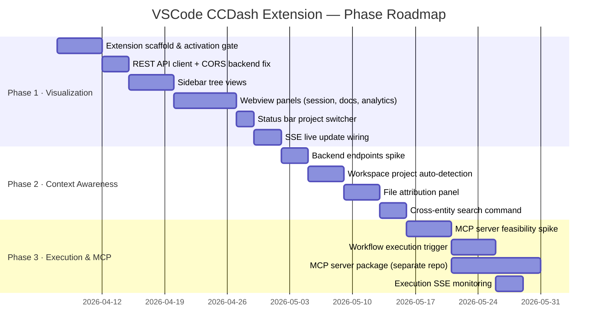

# PRD: VSCode CCDash Extension v1

## 1. Feature brief & metadata

**Feature name:** VSCode CCDash Extension

**Filepath name:** `vscode-ccdash-extension-v1`

**Date:** 2026-04-02

**Author:** Architecture Review Team

**Supersedes:** `docs/project_plans/vscode-bob-extension-technical-specification.md`
_(The original spec by "Bob" was rated C+ — broad coverage but factual errors around WebSocket usage, AI tool branding, and missing VSCode constraints. This document is the canonical requirements source.)_

---

## 2. Executive summary

**Priority:** MEDIUM

Bring CCDash's session forensics, project intelligence, and workflow execution into VSCode so developers using Claude Code never need to context-switch to the browser. The extension connects to a locally-running CCDash backend via REST and SSE, exposing sessions, documents, analytics, and (later) MCP tools directly inside the IDE.

The work ships in three phases: **Phase 1** delivers read-only visualization via sidebar and webview panels; **Phase 2** adds workspace-aware context (file attribution, cross-entity search); **Phase 3** exposes workflow execution and MCP integration for Claude Code.

---

## 3. Context & background

### Current state

CCDash already provides a full-featured browser dashboard backed by a FastAPI service on port 8000 (REST + SSE). Developers using Claude Code must alt-tab to the browser to consult session transcripts, review token costs, check document status, or kick off workflows — interrupting flow at exactly the moments when that context is most valuable.

### Problem statement

Developers using Claude Code on CCDash-tracked projects must context-switch to the browser to view session data, analytics, project status, and document context. This breaks flow and limits the practical value of CCDash's forensic data during active development.

---

## 4. Goals & success metrics

| Goal | Metric | Target |
|------|--------|--------|
| Frictionless access to CCDash data in IDE | Extension activates and renders data | < 2 s after workspace open |
| Accurate session visualization | Sessions, transcripts, tool usage, token costs render correctly | 100% data parity with browser dashboard |
| Workspace-aware project selection | Auto-detect correct CCDash project for open workspace | > 90% accuracy (Phase 2) |
| File-level context attribution | File → session linkage loads | < 2 s (Phase 2) |
| MCP context accuracy | Claude Code sessions receive correct CCDash context via MCP tools | Verified round-trip (Phase 3) |

---

## 5. Target users

- Solo developers and small teams using **Claude Code** for AI-assisted development
- Users running CCDash locally as a project intelligence dashboard
- Engineers who want session forensics (tool usage, token cost, transcript replay) without leaving the IDE

---

## 6. User stories

### Phase 1 — Visualization (MVP)

| ID | Story |
|----|-------|
| P1-1 | As a developer, I want to see my recent AI agent sessions in a VSCode sidebar so I can review what was done without leaving the IDE. |
| P1-2 | As a developer, I want to inspect a session's transcript, tool usage, and token costs in a VSCode panel. |
| P1-3 | As a developer, I want to view project documents (PRDs, plans, reports) from VSCode. |
| P1-4 | As a developer, I want to see analytics dashboards (token trends, cost, tool usage) in VSCode. |
| P1-5 | As a developer, I want to switch between CCDash projects from the VSCode status bar. |

### Phase 2 — Context awareness

| ID | Story |
|----|-------|
| P2-1 | As a developer, I want the extension to auto-detect which CCDash project matches my open workspace. |
| P2-2 | As a developer, I want to see which AI sessions modified the file I'm currently editing. |
| P2-3 | As a developer, I want to search across sessions, documents, and features from within VSCode. |

> **Backend dependency:** Phase 2 requires two new backend endpoints: `GET /api/files/context` and `GET /api/search`. These must be scoped and designed before Phase 2 implementation begins.

### Phase 3 — Workflow execution & MCP

| ID | Story |
|----|-------|
| P3-1 | As a developer, I want to execute CCDash-tracked workflows from VSCode. |
| P3-2 | As a developer, I want Claude Code to have access to CCDash context via MCP tools. |
| P3-3 | As a developer, I want real-time execution monitoring in VSCode. |

> **Architecture note:** The MCP server is a **standalone package** (separate npm package / Python process). It is not embedded in the extension. Claude Code connects to it via stdio. This separation is required for independent versioning and for correct MCP protocol behavior.

---

## 7. Functional requirements

### 7.1 Extension host (TypeScript / Node.js)

| ID | Requirement |
|----|-------------|
| EH-1 | Extension activates only when a CCDash-detectable workspace is open (presence of `projects.json`, `.ccdash`, or matching heuristic). |
| EH-2 | All CCDash data access goes through the REST API (`http://localhost:8000/api/*`). Direct DB access is prohibited. |
| EH-3 | Active project is passed per-request via `x-ccdash-project-id` header; falls back to the backend's active project when omitted. |
| EH-4 | Real-time updates use SSE (`GET /api/live/stream`) with topic-based subscriptions. No WebSocket. |
| EH-5 | Backend base URL and polling intervals are user-configurable via VSCode settings (`ccdash.backendUrl`, `ccdash.pollIntervalMs`). |

### 7.2 Sidebar tree views (Phase 1)

| ID | Requirement |
|----|-------------|
| SB-1 | Sessions tree: lists recent sessions, grouped by project; sortable by recency. |
| SB-2 | Documents tree: lists plan documents and reports; filterable by type. |
| SB-3 | Features tree: lists tracked features with status indicators. |
| SB-4 | Each tree item provides a context menu action to open a detail webview panel. |

### 7.3 Webview panels (Phase 1)

| ID | Requirement |
|----|-------------|
| WV-1 | Session Inspector panel: transcript, tool call list, token counts, cost summary. |
| WV-2 | Document Viewer panel: rendered markdown for plan documents. |
| WV-3 | Analytics panel: token trend charts, cost breakdown, tool usage frequency. |
| WV-4 | All webview panels declare an explicit Content Security Policy. `script-src` and `style-src` must use nonces or approved hashes. |
| WV-5 | Webview UI has its own Vite/webpack build pipeline. It **cannot** import modules directly from the CCDash frontend source. |

### 7.4 Status bar (Phase 1)

| ID | Requirement |
|----|-------------|
| ST-1 | Status bar item shows active CCDash project name. |
| ST-2 | Clicking the status bar item opens a project-selection quick-pick. |

### 7.5 Context awareness (Phase 2)

| ID | Requirement |
|----|-------------|
| CA-1 | On workspace open, extension attempts to match workspace root against CCDash project paths via `GET /api/projects`. |
| CA-2 | When a file is opened in the editor, extension queries `GET /api/files/context?path=<relative-path>` and shows attributed sessions in a sidebar panel or inline decoration. |
| CA-3 | Command palette command `CCDash: Search` opens a quick-pick backed by `GET /api/search?q=<query>`. |

### 7.6 Workflow execution (Phase 3)

| ID | Requirement |
|----|-------------|
| WE-1 | Features tree exposes a "Run" action that triggers `POST /api/execution/run` for the selected feature. |
| WE-2 | Execution progress streams via SSE topic `execution:{id}` and renders in a dedicated Output Channel. |
| WE-3 | MCP server (`ccdash-mcp`) is a separate installable package; the extension optionally registers it with Claude Code's MCP configuration on first activation. |

---

## 8. Non-functional requirements

| Category | Requirement |
|----------|-------------|
| Performance | Extension activation (including first API call) completes in < 2 s on a warm local backend. |
| Reliability | Extension handles backend unavailability gracefully: surfaces a status bar warning, retries on reconnect. |
| Security | No auth is required (local-first tool). Extension must not store credentials or tokens. |
| CORS | Backend must whitelist `vscode-webview://*` as an allowed origin. This requires a backend config change before Phase 1 ships. |
| Compatibility | Targets VSCode 1.85+ (stable channel). No Insiders-only APIs. |
| Bundle size | Extension VSIX < 5 MB. Webview UI assets bundled separately. |

---

## 9. Technical constraints

| Constraint | Detail |
|------------|--------|
| SSE only — no WebSocket | The backend exposes `GET /api/live/stream` with topic subscriptions. There is no WebSocket endpoint. All real-time code must use `EventSource` or equivalent. |
| CORS for webviews | VSCode webviews run on the `vscode-webview://` origin. Backend CORS config must be updated before any webview can call the API directly; alternatively the extension host proxies all API requests. |
| Webview CSP | VSCode enforces strict Content Security Policy in webviews. Chart.js, React, and any inline styles must comply. |
| No shared frontend code | The CCDash React frontend runs in a browser context with Vite. The extension webview-ui needs its own build and cannot import `@/` paths from the main frontend. Shared design tokens may be extracted as a utility package if warranted (see open questions). |
| Activation gate | Extension must not activate for arbitrary workspaces. Activation events should be conditioned on a CCDash workspace signal. |
| MCP server is a separate process | The MCP server communicates with Claude Code via stdio and is distributed as a standalone npm/Python package, not a module inside the `.vsix`. |

---

## 10. Scope

### In scope

- VSCode sidebar tree views for sessions, documents, and features
- Webview panels for session inspection, document viewing, and analytics
- Status bar project switcher
- SSE-based live update integration
- Phase 2 file context and search (contingent on new backend endpoints)
- Phase 3 execution triggers and MCP server (contingent on spike results)

### Out of scope

- Authentication or RBAC (local-first tool; no auth needed initially)
- Mobile or web extension variants
- Direct database access from the extension
- Replacing the CCDash web dashboard (extension is supplementary)
- Bundling the MCP server inside the `.vsix`

---

## 11. Dependencies

| Dependency | Owner | Required for |
|------------|-------|--------------|
| Backend CORS update for `vscode-webview://` origins | Backend team | Phase 1 |
| `GET /api/files/context` endpoint | Backend team | Phase 2 |
| `GET /api/search` endpoint | Backend team | Phase 2 |
| MCP server feasibility spike | Architecture | Phase 3 commitment |
| OpenAPI schema (optional) | Backend team | Typed API client generation |

---

## 12. Risks & mitigations

| Risk | Likelihood | Impact | Mitigation |
|------|-----------|--------|------------|
| Webview CSP blocks charting or React libraries | Medium | High | Audit CSP requirements early in Phase 1; evaluate nonce-based approach |
| SSE `EventSource` behaves differently in extension host vs. webview context | Medium | Medium | Prototype SSE in extension host first; proxy events to webviews via `postMessage` |
| MCP stdio integration is unreliable or hard to install | Medium | High | Run MCP spike before Phase 3 commitment; define fallback (REST-only context injection) |
| Backend API changes break extension | Low | Medium | Generate typed client from OpenAPI schema; pin API version in extension settings |
| Large session transcripts cause webview performance issues | Low | Medium | Paginate transcript loading; virtualize long lists |

---

## 13. Open questions (require spikes)

| # | Question | Spike owner |
|---|----------|-------------|
| OQ-1 | **MCP server**: Can a standalone `ccdash-mcp` process reliably wrap the CCDash REST API for Claude Code? What is the correct transport (stdio vs. HTTP)? | Architecture |
| OQ-2 | **Webview strategy**: Build webview-ui from scratch, or extract shared design tokens from the CCDash Tailwind theme into a utility package? | Frontend |
| OQ-3 | **API client**: Should the extension generate a typed client from the CCDash OpenAPI schema? What is the schema's current stability? | Backend |

---

## 14. Implementation phases summary

---

## 15. Acceptance criteria

### Phase 1 — Done when:

- [ ] Extension activates in < 2 s for a workspace containing a CCDash project signal
- [ ] Sessions tree renders the last 20 sessions with correct metadata
- [ ] Session Inspector webview displays full transcript, tool call list, and token/cost summary matching the browser dashboard
- [ ] Documents tree renders all plan documents; viewer renders markdown correctly
- [ ] Analytics webview displays token trend and cost charts without CSP violations
- [ ] Status bar shows active project name and allows project switching
- [ ] Backend CORS updated; all webview API calls succeed from `vscode-webview://` origin
- [ ] Extension does not activate for non-CCDash workspaces

### Phase 2 — Done when:

- [ ] Auto-detection selects the correct project for > 90% of tested workspaces
- [ ] File context panel appears within 2 s of opening an attributed file
- [ ] `CCDash: Search` quick-pick returns relevant results across sessions, documents, and features

### Phase 3 — Done when:

- [ ] Feature execution can be triggered from the Features tree and progress streams to an Output Channel
- [ ] `ccdash-mcp` package is installable independently and Claude Code sessions receive accurate CCDash context via MCP tool calls
- [ ] MCP round-trip verified: Claude Code calls a CCDash MCP tool → correct data returned from live backend
