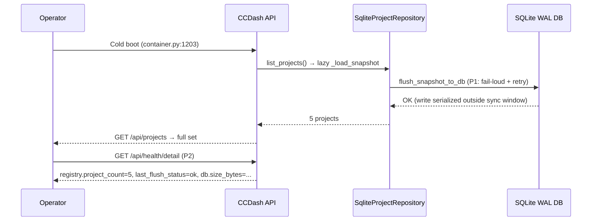

# Feature Brief & Metadata

**Feature Name:**

> CCDash DB Design Remediation

**Filepath Name:**

> `ccdash-db-design-remediation-v1`

**Date:**

> 2026-06-03

**Author:**

> Nick Miethe

**Related Documents:**

> - [SPIKE findings (11 findings S0–S3, RQ matrix, ADR proposals, backlog)](docs/dev/architecture/spikes/findings/ccdash-db-design-remediation-findings.md)
> - [SPIKE charter (conditional-GO verdict)](docs/dev/architecture/spikes/charters/ccdash-db-design-remediation-charter.md)
> - [Decisions block (phase boundaries, agent routing, risks, estimates)](.claude/worknotes/ccdash-db-design-remediation/decisions-block.md)
> - [ADR-006 — DB-authoritative project registry](docs/project_plans/adrs/adr-006-db-authoritative-project-registry.md)
> - [ADR-007 — DB-write failure-surfacing standard](docs/project_plans/adrs/adr-007-db-write-failure-surfacing-standard.md)
> - [Enterprise liveness & storage PRD (owns destructive multi-GB reclaim)](docs/project_plans/PRDs/infrastructure/ccdash-enterprise-liveness-storage-v1.md)

---

## 1. Executive summary

CCDash's project registry has been silently failing its DB flush on every startup since the enterprise-liveness work shipped, leaving the app JSON-backed despite the DB-authoritative intent. A 2026-06-03 SPIKE (verdict: conditional-GO) confirmed the defect is localized to the sync registry write path, but also surfaced seven additional design gaps: dual project managers with no reconciliation, dormant storage-retention subsystem, absent SQLite migration concurrency guard, column-level parity unchecked, duplicate `ensure_table` DDL, no DB-write observability in `/api/health`, and test coverage that passes through the flush failure.

This PRD scopes the full remediation in 5 phases (~40 pts, Tier 3): fix the registry correctness bug and collapse to the DB-authoritative model (P1, shippable independently), generalize the locked-retry helper and add health observability (P2), close migration concurrency and parity gaps (P3), activate the dormant retention subsystem with a one-time VACUUM (P4), and ratify ADRs + docs (P5). The destructive multi-GB session reclaim is owned by the enterprise-liveness-storage PRD and is referenced, not re-scoped here.

**Priority:** HIGH

**Key Outcomes:**

- Registry rows survive every restart; the silent no-op is replaced by fail-loud-then-retry behavior.
- All DB write paths share a single locked-retry helper; write failures surface in `/api/health/detail` and via a Prometheus counter.
- SQLite and Postgres migration paths reach column-level parity with a concurrency guard; `ensure_table` DDL is eliminated as a drift surface.
- The 2.23 GB freelist is reclaimed and the dormant retention subsystem is activated behind its existing flag.

---

## 2. Context & background

### Current state

The DB layer has four distinct problem clusters confirmed by SPIKE file:line evidence (see findings §2):

1. **Registry** (`backend/project_manager.py:447–460`, `backend/db/repositories/projects.py:42–49`): `DbProjectManager._flush_snapshot_to_db` swallows every `database is locked` exception and marks `_snapshot_loaded = True`, so the flush is never retried. The registry only has rows today because the table was manually populated on 2026-06-03. The intention per the enterprise-liveness PRD §4 is "DB authoritative, JSON import-only," but both a JSON-backed `ProjectManager` and a DB-backed `DbProjectManager` are instantiated in parallel (`project_manager.py:658,663`) with no reconciliation.

2. **Write reliability** (`backend/db/repositories/execution.py:33–69`): A locked-retry helper already exists in the four highest-contention queue repos but is absent from the registry sync path and all other sync writers. Every independent sync connection must also issue `PRAGMA busy_timeout` to match the async singleton (`backend/db/connection.py:34–64`).

3. **Migrations** (`backend/db/sqlite_migrations.py:2641–2659`): SQLite migrations have no first-boot concurrency guard while Postgres acquires `pg_advisory_lock` (`backend/db/postgres_migrations.py:2278–2294`). Column/constraint parity is only checked at table-name level (`test_migration_governance.py:23–27`). `SqliteProjectRepository.ensure_table` hard-codes a full `projects` CREATE TABLE in parallel with the v30 migration DDL (three separate DDL copies to maintain).

4. **Storage / observability**: `RETENTION_PRUNE_ENABLED` defaults `False` (`backend/config.py:1079`), leaving 2.23 GB of dead freelist pages and 40% of the 11 GB DB in two unbounded tables. `/api/health/detail` exposes only singleton-existence (`backend/runtime/bootstrap.py:131`), with no registry row count, last-flush status, DB size, or write-failure counter.

### Architectural context

- **DB layer**: `backend/db/repositories/` (data access); `backend/db/migrations.py` entry point routing to `backend/db/sqlite_migrations.py` / `backend/db/postgres_migrations.py`; async singleton at `backend/db/connection.py`; sync `sqlite3` connections in `repositories/projects.py` and `repositories/sessions.py` (maintenance helpers).
- **Registry**: `backend/project_manager.py` (dual-manager instantiation); `backend/runtime/container.py:1203` (startup call site); `backend/runtime_ports.py:127–140` (manager selection logic).
- **Health endpoint**: `backend/runtime/bootstrap.py:124–191` (`_build_health_payload`).
- **Retention jobs**: `backend/adapters/jobs/runtime.py:1394–1418`; config at `backend/config.py:1074–1102`.

---

## 3. Problem statement

> "As an operator, when CCDash boots with a fresh DB, the project registry silently fails to persist — so every process re-bootstraps from the stale JSON file — instead of surfacing the failure and retrying so the DB remains authoritative."

**Technical root causes (SPIKE-confirmed, file:line):**

| Finding | Severity | Evidence |
|---------|----------|----------|
| F-01: Registry flush swallows `database is locked`; `_snapshot_loaded` set True on failure | S0 | `project_manager.py:447–460`, `repositories/projects.py:42–49` |
| F-02: Dual managers, no reconciliation, no DB→JSON writeback | S1 | `project_manager.py:658,663`, `runtime_ports.py:134–136` |
| F-03: 2.23 GB dead freelist; retention default-OFF; `session_logs`+`telemetry` = 40% of DB | S2 | `config.py:1079`, `adapters/jobs/runtime.py:1414–1415` |
| F-04: SQLite migrations have no concurrency guard (Postgres has one) | S1 | `sqlite_migrations.py:2641–2659`, `postgres_migrations.py:2278–2294` |
| F-05: Column/constraint parity not tested; table-set only | S1 | `test_migration_governance.py:23–27` |
| F-06: Locked-retry helper absent from registry sync path and non-queue writers | S2 | `execution.py:33–69`, `repositories/projects.py:42–49` |
| F-07: `schema_version` records only the terminal version per run (gaps are benign but misleading) | S3 | `sqlite_migrations.py:2645–2652` |
| F-08: `ensure_table` hard-codes full DDL in three places; drifts from migration DDL | S1 | `repositories/projects.py:72–96` |
| F-09: `/api/health/detail` has no registry row count, DB size, or write-failure fields | S3 | `runtime/bootstrap.py:124–191` |
| F-10: Dead `config.DB_PATH` default `.ccdash.db` is unused (foot-gun) | S3 | `config.py:57`, `db/connection.py:25` |
| F-11: Registry persistence test passes through flush failure (JSON re-bootstraps) | S3 | `tests/test_db_project_registry.py:107–145` |

---

## 4. Goals & success metrics

### Primary goals

**Goal 1: Registry correctness (ADR-006)**
The DB `projects` table is the sole authoritative store. Flush failure is loud, retried, and surfaces via health. `projects.json` is import-seed and export target only.

**Goal 2: DB-write reliability standard (ADR-007)**
Every DB write path either retries via the shared locked-retry helper or re-raises; no write failure is silently swallowed. Write failures surface in `/api/health/detail` and `ccdash_db_write_failures_total`.

**Goal 3: Migration integrity**
SQLite migrations have a first-boot concurrency guard equivalent to the Postgres advisory lock. Column/constraint parity between backends is tested. `ensure_table` DDL is eliminated as a separate drift surface. Migration idempotency on rerun is asserted.

**Goal 4: Storage hygiene**
The 2.23 GB freelist is reclaimed via a snapshot-protected VACUUM. The existing retention subsystem runs behind its flag on a predictable schedule.

### Success metrics

| Metric | Baseline | Target | Verified by |
|--------|----------|--------|-------------|
| Registry rows survive cold restart | 0 (flush fails silently) | 5/5 rows present after restart, asserted by `repo.count()` | P1 lock-injection + direct-count test |
| Lock-injection test: flush fails loud | None | Test reproduces F-01 and asserts `Exception` raised (never silent True) | P1 `test_registry_flush_fail_loud` |
| `/api/health/detail` registry fields present | Not present | `registry.project_count`, `registry.last_flush_status`, `db.size_bytes`, `db.freelist_bytes`, `retention.last_run` all non-null after warm start | P2 health-field integration test |
| `ccdash_db_write_failures_total` counter | Not present | Counter increments under injected failure; confirmed via Prometheus scrape or test assertion | P2 counter test |
| Column-parity test passes | Not present | `migration_governance` column diff: zero drift for all shared tables | P3 parity test |
| Migration idempotency | Single-run only | `run_migrations` twice on populated DB: no error, stable schema | P3 idempotency test |
| SQLite migration concurrency | No guard | Two concurrent `run_migrations` on one file: safe (no deadlock, no `schema changed`) | P3 concurrency test |
| Freelist pages post-VACUUM | 543,926 (2.23 GB) | <1,000 pages on snapshot copy; operator runbook validated | P4 VACUUM runbook |

---

## 5. Personas & journeys

**Primary persona: CCDash operator (self-hosted)**
The operator boots CCDash (`npm run dev` or `docker compose --profile enterprise up`), adds a project via the UI, then restarts the process. Under current behavior, the project vanishes. After P1, the project survives every restart without manual DB intervention.

**Secondary persona: on-call responder**
An alert fires or the dashboard shows stale data. The responder queries `/api/health/detail` to see `registry.last_flush_status: failed` and `ccdash_db_write_failures_total > 0`, correlates to the process log, and knows exactly where to look. Under current behavior, the failure is invisible externally.



---

## 6. Requirements

### 6.1 Functional requirements

| ID | Requirement | Priority | Finding | Notes |
|----|-------------|:--------:|---------|-------|
| FR-01 | Registry bootstrap must fail loud: on flush exception, do not set `_snapshot_loaded=True`; log ERROR with reason; expose via health | Must | F-01, F-09 | ADR-006 §consequence 2 |
| FR-02 | Shared locked-retry helper in `repositories/base.py`; applied to registry sync path and all sync `sessions.py` helpers; every independent sync connection sets `PRAGMA busy_timeout` | Must | F-01, F-06 | Generalize `execution.py:_commit_with_retry` |
| FR-03 | Registry bootstrap sequenced outside (before or after) the heavy startup-sync window | Must | F-01, RQ5 | `container.py:1203` ordering |
| FR-04 | Collapse dual managers: DB-backed manager is the sole runtime instance; legacy `ProjectManager` demoted to `import_from_json()` helper; `export_to_json()` added | Must | F-02 | ADR-006 Option B |
| FR-05 | Registry persistence test: direct `SqliteProjectRepository.count()` after flush + lock-injection test that reproduces F-01 | Must | F-11 | Regression guard |
| FR-06 | `/api/health/detail` exposes `registry.project_count`, `registry.last_flush_status`, `db.size_bytes`, `db.freelist_bytes`, `retention.last_run` | Must | F-09 | ADR-007 §3 |
| FR-07 | `ccdash_db_write_failures_total{repo,reason}` Prometheus counter emitted at retry and surface sites | Must | F-09 | ADR-007 §3 |
| FR-08 | SQLite first-boot migration concurrency guard (flock or inter-process mutex) mirroring Postgres `pg_advisory_lock` intent | Must | F-04 | `sqlite_migrations.py:2641–2659` |
| FR-09 | Column/constraint-level parity diff in `migration_governance`; test asserts structural equality for all shared tables between backends | Must | F-05 | Extend `test_migration_governance.py` |
| FR-10 | `ensure_table` safety-net DDL eliminated or redirected to canonical migration DDL after P1 bootstrap-ordering guarantee | Should | F-08 | Three-copy drift surface |
| FR-11 | Migration idempotency-on-rerun test: `run_migrations` twice on populated DB produces no error and stable schema | Should | F-04, F-07 | |
| FR-12 | `RETENTION_PRUNE_ENABLED` activated (flag-gated, snapshot-first); one-time VACUUM runbook reclaims 2.23 GB freelist | Should | F-03 | P4; snapshot precondition mandatory |
| FR-13 | Per-version migration ledger: each applied version recorded with `applied_at` | Could | F-07 | `migrations_applied` table or step-by-step insert |
| FR-14 | Dead `config.DB_PATH` default removed or consolidated with `db/connection.py` | Could | F-10 | 1-pt cleanup |
| FR-15 | ADR-006 and ADR-007 ratified as accepted ADR files; CLAUDE.md updated with DB-write and registry conventions | Should | ADR-006/007 | P5 |

### 6.2 Non-functional requirements

**Reliability:**
- No DB write path may silently swallow an exception (ADR-007). Caught exceptions must retry via the shared helper, then re-raise or record to a surfaced field.
- Registry flush failure surfaces within one process lifecycle (before the first user request returns stale data).

**Performance:**
- The locked-retry helper must not spin-loop; it must use backoff with a configurable maximum retries cap (default 3, consistent with the existing `execution.py` pattern).
- The one-time VACUUM must be executed on a DB snapshot copy first, never on the live DB un-snapshotted.

**Observability:**
- `ccdash_db_write_failures_total{repo,reason}` — at minimum one label dimension per originating repository.
- `/api/health/detail` health fields: consumer frontend and CLI tools must handle each new field as optional (missing = unknown, not an error).

**Testability:**
- Every new write path ships with a direct persistence assertion (row count) and, for contention-prone paths, a lock-injection test.
- P3 migration tests must pass on both SQLite and Postgres backends in CI.

---

## 7. Scope

### In scope

- P1: Registry bootstrap fail-loud; locked-retry on the registry sync path; bootstrap sequencing (`container.py`); dual-manager collapse per ADR-006; `import_from_json()` / `export_to_json()` helpers; dead `config.DB_PATH` cleanup (F-10).
- P2: Shared locked-retry helper in `repositories/base.py`; apply to sync writers; health fields on `/api/health/detail`; `ccdash_db_write_failures_total` counter wiring.
- P3: SQLite migration first-boot concurrency guard; column/constraint parity diff + test; `ensure_table` DDL elimination; migration idempotency + concurrency tests; per-version migration ledger.
- P4: Activate `RETENTION_PRUNE_ENABLED` (flag-gated, snapshot-first); one-time VACUUM runbook on snapshot copy to reclaim the 2.23 GB freelist; WAL-checkpoint strategy documentation. Reference enterprise-liveness-storage PRD for `session_logs` dedupe/drop and `telemetry_events` bounding (these items are not re-scoped here).
- P5: Ratify ADR-006 and ADR-007 as accepted ADR files; CLAUDE.md DB-write and registry conventions; design specs for any deferred items discovered during execution; AAR.

### Out of scope

- Destructive `session_logs` dedupe/drop and `telemetry_events` bounding — owned by `ccdash-enterprise-liveness-storage-v1` PRD (reference: §4, P1-002/P1-016). P4 may verify these jobs have run but does not re-implement them.
- Frontend data layer (TanStack Query), agent-query service business logic.
- New product features, vector/embedding quality.
- Schema changes beyond what the findings backlog scopes.

---

## 8. Dependencies & assumptions

### Internal dependencies

- **ADR-006 ratified (done 2026-06-03)**: The registry-fix code shape depends on the ratified authority model. Precondition satisfied.
- **ADR-007 accepted (done 2026-06-03)**: The failure-surfacing standard is accepted as a design constraint. Precondition satisfied.
- **Enterprise-liveness-storage PRD** (`ccdash-enterprise-liveness-storage-v1`): owns `session_logs` destructive drop (P1-002/016) and `telemetry_events` bounding. P4 activates the retention subsystem that runs these jobs but does not implement the jobs themselves.
- **Existing locked-retry helper** (`backend/db/repositories/execution.py:33–69`): P2 generalizes this into `repositories/base.py`; P1 applies a local version of the pattern before P2 lands.

### Feature flags

| Flag | Default | Purpose |
|------|---------|---------|
| `RETENTION_PRUNE_ENABLED` | `False` (existing) | Gates the retention prune job; P4 activates with snapshot-first precondition |
| `RETENTION_VACUUM_ENABLED` | `True` (existing) | Gates VACUUM after prune; P4 validates the interaction |

### Assumptions

- The DB snapshot capability is available to the operator before P4 executes (SPIKE precondition #1).
- P1 ships and is verified (cold-start smoke passes) before P4 begins; this decouples the small reversible registry fix from the lock-heavy storage reclaim (SPIKE precondition #2).
- The live `projects` table currently has 5 rows (manual fix 2026-06-03); P1 must not drop or replace them.
- Both SQLite (dev) and Postgres (enterprise) backends are tested in CI; P3 migration tests must cover both.

---

## 9. Risks & mitigations

| Risk | Impact | Likelihood | Mitigation | Phase |
|------|:------:|:----------:|-----------|:-----:|
| VACUUM/retention-prune on 11 GB live DB locks for minutes; hard to reverse | High | Medium | SPIKE precondition: snapshot-before-touch, flag-gated, validate on snapshot copy first | P4 |
| Registry startup-ordering change regresses boot (wrong `container.py` sequence breaks worker binding) | Medium | Medium | Mandatory cold-start smoke gate: assert `/api/projects` returns full set and worker binds correctly | P1 |
| SQLite migration concurrency guard deadlocks dual-process boot (api + worker both run migrations) | Medium | Low | Mirror Postgres advisory-lock intent: acquire-migrate-release with timeout + skip-if-already-current; test concurrent boot of both profiles | P3 |
| Column-parity diff surfaces real existing drift, expanding P3 scope | Medium | Medium | On first drift: record to lazy findings doc, triage in-phase if small, else split a follow-up; do not let parity discovery balloon P3 | P3 |
| Collapsing dual managers breaks callers of the `manager=` explicit-JSON override | Low | Low | Grep all callers before retiring; preserve `import_from_json()` / `export_to_json()` and keep override path test-only or remove its prod uses deliberately | P1 |

---

## 10. Target state (post-implementation)

**Registry:**
- One DB-backed `ProjectManager` is the sole runtime instance. `projects.json` is read once at first boot (import seed) and written only by explicit `export_to_json()` calls (backup/portability). A fresh `data/ccdash_cache.db` on a new machine bootstraps from `projects.json` exactly once; subsequent restarts read from DB.
- Flush failure surfaces immediately as `registry.last_flush_status: failed` in `/api/health/detail` and increments `ccdash_db_write_failures_total{repo=projects,reason=locked}`.

**Write reliability:**
- `repositories/base.py` exposes a single `retry_on_locked(fn, max_retries=3, backoff=0.5)` helper. Every sync writer imports and uses it. Every independent sync connection issues `PRAGMA busy_timeout = 30000`.
- No write failure is swallowed anywhere in the repository layer; CI has a lock-injection lane.

**Migrations:**
- SQLite migrations acquire a file lock on `data/.migration.lock` before executing any DDL. Concurrent processes serialize; the second acquires the lock and detects no-op on version check.
- `migration_governance.py` diffs columns and constraints per table for all shared tables; CI fails immediately on drift.
- `ensure_table` safety-net DDL is removed from `repositories/projects.py` (both backends); canonical DDL lives only in the migration files.

**Storage:**
- `RETENTION_PRUNE_ENABLED=true` prunes `analytics_entries` and `telemetry_events` past their configured TTL on the worker's retention schedule. A one-time VACUUM (run on operator confirmation against a DB snapshot) reclaims ≥2.23 GB.

**Observability:**
- `/api/health/detail` response includes:
  ```json
  {
    "registry": {"project_count": 5, "last_flush_status": "ok"},
    "db": {"size_bytes": ..., "freelist_bytes": ..., "backend": "sqlite"},
    "retention": {"last_run": "2026-06-03T12:00:00Z", "enabled": true}
  }
  ```
- Prometheus endpoint exposes `ccdash_db_write_failures_total` with `repo` and `reason` labels.

---

## 11. Overall acceptance criteria (definition of done)

### AC-001: Registry correctness (P1)

#### AC-001a: Rows survive cold restart

- target_surfaces:
    - backend/db/repositories/projects.py (SqliteProjectRepository)
    - backend/project_manager.py (DbProjectManager._flush_snapshot_to_db)
    - backend/runtime/container.py (startup sequencing, line ~1203)
- propagation_contract: After P1, flush is called before the startup-sync window opens; retry-on-locked helper serializes the write; `_snapshot_loaded` is only set True after a confirmed successful flush.
- resilience: If flush still fails after max retries, `_snapshot_loaded` stays False (next call retries); exception propagates to the health layer.
- verified_by: [T1-005 lock-injection test, T1-006 direct-count-post-flush test, P1 cold-start smoke]

#### AC-001b: Lock-injection reproduces F-01 and proves fail-loud behavior

- target_surfaces:
    - backend/tests/test_db_project_registry.py
- propagation_contract: Test holds a write-lock on the DB in a second connection while flush executes; asserts `Exception` is raised (or retry-success), never a silent `True` return.
- resilience: N/A (test-only surface).
- verified_by: [T1-005]

### AC-002: Dual-manager collapse (P1)

- The module-level `ProjectManager(...)` (JSON-backed) at `project_manager.py:658` is removed from runtime instantiation or repurposed as `import_from_json()`.
- `export_to_json(path)` is callable and writes the current DB state to a JSON file.
- All production call sites resolve to the DB-backed manager; no call site passes the JSON manager as `manager=` argument in production code.
- verified_by: [T1-007 caller-grep audit, T1-008 import/export round-trip test]

### AC-003: Health fields surfacing (P2)

#### AC-003a: New `/api/health/detail` fields are present and correct

- target_surfaces:
    - backend/runtime/bootstrap.py (_build_health_payload)
    - backend/routers/api.py (health endpoint)
- propagation_contract: `_build_health_payload` calls `SqliteProjectRepository.count()` and reads `PRAGMA page_count * page_size` / `PRAGMA freelist_count * page_size` for size fields; reads `retention.last_run` from a stored config or job-state field.
- resilience: If `SqliteProjectRepository.count()` raises (e.g., table missing on a fresh DB), `registry.project_count` is `null` and `last_flush_status` is `"unknown"` — not an unhandled exception. Consumer (CLI, frontend) treats any missing health sub-key as `"unknown"`, not an error.
- verified_by: [T2-003 health-field integration test, T2-004 CLI `ccdash target check local` smoke]

#### AC-003b: Consumer handles missing health fields

- target_surfaces:
    - packages/ccdash_cli/ (target check command)
    - Any frontend component rendering health status
- propagation_contract: Fields are optional in the response schema; absence returns a graceful "unknown" display, not a crash or parse error.
- resilience: Missing `registry`, `db`, or `retention` top-level keys must each individually degrade gracefully.
- verified_by: [T2-005 missing-field resilience test (mock response with fields omitted)]

### AC-004: Prometheus counter (P2)

- `ccdash_db_write_failures_total{repo,reason}` is defined in `backend/observability/otel.py` (or the metrics module).
- Counter increments at each retry-on-locked site and each re-raise site in `repositories/base.py`.
- Verified by injecting a lock and asserting `ccdash_db_write_failures_total > 0` in the post-failure state.
- verified_by: [T2-006 counter-injection test]

### AC-005: Migration concurrency guard (P3)

- Two concurrent Python processes calling `run_migrations` on the same SQLite file do not produce `database is locked`, `schema changed`, or data loss; second process detects no-op via version check.
- Guard acquires `data/.migration.lock` (or equivalent) with a configurable timeout; logs `migration already complete` if it detects no-op.
- verified_by: [T3-001 concurrent-migration test]

### AC-006: Column-parity governance (P3)

- `migration_governance.py` normalized column diff: for every table in `get_sqlite_migration_tables() ∩ get_postgres_migration_tables()`, column names, types, nullability, defaults, and UNIQUE constraints are structurally equal.
- CI test fails if any drift is introduced; this test runs in the same CI job as `test_migration_governance.py`.
- verified_by: [T3-002 column-parity test]

### AC-007: Migration idempotency (P3)

- Running `run_migrations` twice on a populated SQLite DB produces no error and an identical `PRAGMA schema_version`; same for Postgres.
- verified_by: [T3-003 idempotency-on-rerun test]

### AC-008: `ensure_table` DDL elimination (P3)

- `SqliteProjectRepository.ensure_table` and `PostgresProjectRepository.ensure_table` do not contain `CREATE TABLE` statements for `projects`; they either call the canonical migration DDL or are removed entirely.
- No other repository contains an out-of-band `CREATE TABLE IF NOT EXISTS` for a table that is also in the canonical migration (audit for `_ensure_test_visualizer_tables`, `_ensure_planning_worktree_contexts_table`).
- verified_by: [T3-004 grep-for-inline-DDL audit in CI]

### AC-009: Retention activation and VACUUM runbook (P4)

- `RETENTION_PRUNE_ENABLED=true` causes the retention job to prune rows past their configured TTL; verified by a prune-then-COUNT boundary test on a seeded DB copy.
- VACUUM runbook document exists in `docs/guides/`; validated against a DB snapshot copy (freelist shrinks to near-zero); operator must explicitly confirm before running on the live DB.
- No data loss compared to the pre-VACUUM snapshot (row counts for `session_messages`, `sessions`, `projects` match).
- verified_by: [T4-001 prune-boundary test, T4-002 VACUUM-runbook smoke on snapshot]

### AC-010: ADR ratification and CLAUDE.md conventions (P5)

- `docs/project_plans/adrs/adr-006-db-authoritative-project-registry.md` has `status: accepted`.
- `docs/project_plans/adrs/adr-007-db-write-failure-surfacing-standard.md` has `status: accepted`.
- `CLAUDE.md` "Key Conventions" section documents: registry is DB-authoritative; `projects.json` is import-seed/export-only; every new write path ships a retry helper + direct-count assertion.
- verified_by: [T5-001 ADR status check, `karen` end-of-feature review]

---

## 12. Implementation — phased approach

### Phase summary

| Phase | Name | Scope | Points | Key backlog items | Model | Exit gate |
|-------|------|-------|:------:|-------------------|-------|-----------|
| P1 | Registry Correctness & Authority | ADR-006 implementation: fail-loud bootstrap, locked-retry, sequencing, manager collapse, `import`/`export`, F-10 cleanup | 11 | P0-1..P0-5, F-10 | Sonnet (impl) + Opus (ADR-006 conformance review) | Lock-injection + direct-count tests green; cold-start smoke passes |
| P2 | DB-Write Reliability & Observability | Shared helper in `base.py`; health fields; Prometheus counter (ADR-007) | 8 | P1-4, P3-1, P3-2 | Sonnet | Health-field + counter tests green; `/api/health/detail` smoke passes |
| P3 | Migration Integrity & Parity | SQLite concurrency guard; column-parity diff + test; `ensure_table` elimination; idempotency + concurrency tests; migration ledger | 13 | P1-1, P1-2, P1-3, P3-3, P3-4 | Sonnet | Concurrency + idempotency + column-parity tests green on both backends |
| P4 | Storage Hygiene Activation | Activate `RETENTION_PRUNE_ENABLED`; VACUUM runbook; WAL-checkpoint docs; reference liveness PRD for destructive items | 5 | P2-1 (P2-2/P2-3 referenced) | Sonnet (impl) + Opus (go/no-go on live-DB step) | Prune-boundary test green; VACUUM runbook validated on snapshot; operator sign-off |
| P5 | Docs, ADRs & Deferred Items | Ratify ADR-006/007; CLAUDE.md conventions; deferred-item design specs; AAR | 3 | DOC | Haiku | ADRs accepted; `karen` end-of-feature review clean |

**Total: ~40 points (Tier 3)**

**Critical path:**

```
ADR-006 ratified (done) ──> P1 ──> P2
                             │
                             ├──> P3   (parallel with P4 after P1 verifies)
                             │
                             └──> P4   (blocked on operator DB snapshot; parallel with P3)
P2 + P3 + P4 ──────────────────────────────> P5
```

### Phase 1 — Registry Correctness & Authority (~11 pts)

**Agent routing:** `data-layer-expert` (primary — sqlite registry, retry, ordering); `python-backend-engineer` (secondary — manager collapse, export/import, config cleanup)

**Backlog items:**

| ID | Item | Finding | Pts |
|----|------|---------|:---:|
| P0-1 | `_flush_snapshot_to_db`: on exception do not set `_snapshot_loaded=True`; log ERROR with reason; retry-on-next-access | F-01 | 2 |
| P0-2 | Apply locked-retry to registry sync write; `PRAGMA busy_timeout` on `SqliteProjectRepository` | F-01, F-06 | 2 |
| P0-3 | Sequence registry bootstrap before/outside the startup-sync window in `container.py` | F-01, RQ5 | 2 |
| P0-4 | Ratify ADR-006; collapse dual managers; demote legacy `ProjectManager` to `import_from_json()`; add `export_to_json()` | F-02 | 3 |
| P0-5 | Registry test hardening: direct `repo.count()` post-flush + lock-injection reproducer | F-11 | 2 |
| F-10 | Delete dead `config.DB_PATH` default or unify with `db/connection.py` | F-10 | 1 |

**P1 is shippable independently.** P2–P5 may slip without blocking this fix.

### Phase 2 — DB-Write Reliability & Observability (~8 pts)

**Agent routing:** `python-backend-engineer` (primary — helper, health fields, counter); `data-layer-expert` (secondary — apply helper to sync repos)

**Backlog items:**

| ID | Item | Finding | Pts |
|----|------|---------|:---:|
| P1-4 | Generalize locked-retry as `repositories/base.py:retry_on_locked`; apply to sync `sessions.py` helpers; audit all sync connections for `busy_timeout` | F-06, ADR-007 | 3 |
| P3-1 | `/api/health/detail`: add `registry.project_count`, `registry.last_flush_status`, `db.size_bytes`, `db.freelist_bytes`, `retention.last_run` | F-09, ADR-007 | 3 |
| P3-2 | `ccdash_db_write_failures_total{repo,reason}` counter at retry/surface sites | F-09, ADR-007 | 2 |

### Phase 3 — Migration Integrity & Parity (~13 pts)

**Agent routing:** `data-layer-expert` (sole owner — migrations, parity governance, `ensure_table`)

**Backlog items:**

| ID | Item | Finding | Pts |
|----|------|---------|:---:|
| P1-1 | SQLite migration first-boot concurrency guard (`flock`/inter-process mutex); mirror PG advisory lock intent | F-04 | 3 |
| P1-2 | Column/constraint-level parity check in `migration_governance` + CI test | F-05 | 4 |
| P1-3 | `ensure_table` safety-nets: call canonical migration DDL or delete after P1 ordering guarantees migrations-first | F-08 | 3 |
| P3-3 | Migration idempotency-on-rerun + concurrency tests | F-04, F-07 | 3 |
| P3-4 | Per-version migration ledger (`migrations_applied` with `applied_at`) | F-07 | 2 |

**Risk guard:** If column-parity diff (P1-2) surfaces real existing drift, record to the lazy findings doc (`findings_doc_ref` in plan frontmatter) and triage: fix in-phase if ≤2 pts, else split a follow-up. Do not let drift discovery balloon P3.

### Phase 4 — Storage Hygiene Activation (~5 pts)

**Agent routing:** `platform-engineer` (VACUUM/retention runbook, ops); `data-layer-expert` (retention prune boundaries)

**SPIKE preconditions (mandatory before any live-DB step):**
1. Operator confirms a DB snapshot exists and is restorable.
2. VACUUM runbook is validated on a snapshot copy; Opus go/no-go sign-off before running on the live DB.

**Backlog items:**

| ID | Item | Finding | Pts |
|----|------|---------|:---:|
| P2-1 | Enable `RETENTION_PRUNE_ENABLED` (snapshot-first, flag-gated); one-time VACUUM runbook; WAL-checkpoint docs | F-03 | 3 |
| P2-2 | `session_logs` dedupe/drop `[liveness P1-002/016]` — reference only; verify job is enabled | F-03 | ref |
| P2-3 | `telemetry_events` bounded growth `[liveness P1]` — reference; verify retention running | F-03 | 2 |

### Phase 5 — Docs, ADRs & Deferred Items (~3 pts)

**Agent routing:** `documentation-writer` (haiku)

- Ratify ADR-006 and ADR-007: set `status: accepted` in their respective ADR files.
- Update `CLAUDE.md` "Key Conventions" with DB-write and registry conventions.
- Author design specs for any deferred items surfaced during P1–P4 execution.
- Write the AAR summarizing what the SPIKE predicted vs. what was found during implementation.

---

## 13. Assumptions & open questions

### Assumptions

- ADR-006 is ratified (Option B: DB-authoritative). Encoded as a ratified decision 2026-06-03. Do not re-litigate.
- ADR-007 (DB-write failure surfacing) is accepted as a design constraint. Encoded 2026-06-03.
- The `execution.py:_commit_with_retry` helper (`backend/db/repositories/execution.py:33–69`) is the canonical starting point for the P2 generalization. No re-investigation needed.
- `projects.json` currently has 5 entries coincidentally matching the 5 manually-inserted DB rows. P1 must not wipe or replace these rows; the import-from-JSON path is additive (upsert-on-id).
- The lazy findings doc (`findings_doc_ref`) starts null and is populated only if P3 surfaces genuine column drift exceeding the in-phase threshold.

### Open questions

- [ ] **OQ-01**: Should the `migrations_applied` ledger (P3-4, FR-13) share the same table across backends or be backend-specific? Recommend a shared schema (same DDL in both migration files); backend-specific ledgers create a parity surface.
  - **A**: TBD — decide at P3 authoring.
- [ ] **OQ-02**: Should WAL-checkpoint strategy be enforced by config (a `PRAGMA wal_autocheckpoint=N` change) or by the retention job? Choosing the retention job means CHECKPOINT only runs after a prune, which may be infrequent.
  - **A**: TBD — decide at P4 authoring; document in the VACUUM runbook.

---

## 14. Appendices & references

### Related documentation

- **SPIKE findings** (severity-ranked, file:line evidence, RQ matrix, test-coverage matrix, ADR proposals): `docs/dev/architecture/spikes/findings/ccdash-db-design-remediation-findings.md`
- **SPIKE charter** (motivation, RQs, confirmed evidence, verdict): `docs/dev/architecture/spikes/charters/ccdash-db-design-remediation-charter.md`
- **Decisions block** (phase boundaries, agent routing, risks, estimation anchors, model routing): `.claude/worknotes/ccdash-db-design-remediation/decisions-block.md`
- **ADR-006** (DB-authoritative registry, JSON import/export-only): `docs/project_plans/adrs/adr-006-db-authoritative-project-registry.md`
- **ADR-007** (DB-write failure surfacing standard): `docs/project_plans/adrs/adr-007-db-write-failure-surfacing-standard.md`
- **Enterprise liveness & storage PRD** (owns `session_logs` drop, `telemetry_events` bounding): `docs/project_plans/PRDs/infrastructure/ccdash-enterprise-liveness-storage-v1.md`

### Key file anchors (from SPIKE, do not re-verify)

| File | Lines | Subject |
|------|-------|---------|
| `backend/project_manager.py` | 447–460 | `_flush_snapshot_to_db` — swallow site |
| `backend/project_manager.py` | 658, 663 | Dual-manager instantiation |
| `backend/db/repositories/projects.py` | 42–49, 72–96 | Sync connection + `ensure_table` DDL |
| `backend/db/repositories/execution.py` | 33–69 | `_commit_with_retry` / `_is_locked` |
| `backend/runtime/container.py` | 1203 | Registry lazy-bootstrap call site |
| `backend/runtime_ports.py` | 127–140 | Manager selection logic |
| `backend/db/sqlite_migrations.py` | 2641–2659 | SQLite migration runner (no concurrency guard) |
| `backend/db/postgres_migrations.py` | 2278–2294 | Postgres `pg_advisory_lock` |
| `backend/db/migration_governance.py` | — | Table-set parity (extend to column diff) |
| `backend/runtime/bootstrap.py` | 124–191 | `_build_health_payload` |
| `backend/config.py` | 57, 1074–1102 | Dead `DB_PATH`; retention config |
| `backend/adapters/jobs/runtime.py` | 1394–1418 | Retention prune job |
| `backend/tests/test_db_project_registry.py` | 107–145 | Passes through F-01 (two-instance read) |

---

**Progress tracking:** `.claude/progress/ccdash-db-design-remediation/`
