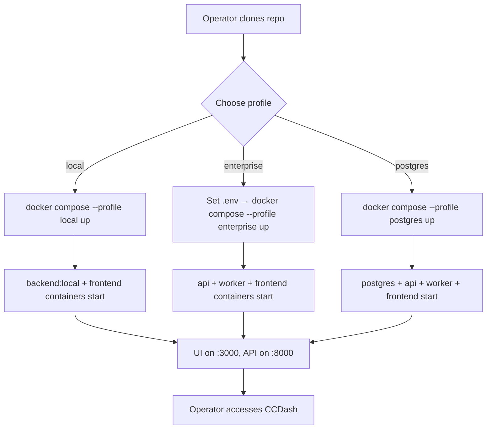

# Feature Brief & Metadata

**Feature Name:**

> Containerized Deployment Infrastructure

**Filepath Name:**

> `containerized-deployment-v1`

**Date:**

> 2026-04-20

**Author:**

> Claude Sonnet 4.6 / Nick Miethe

**Related Epic(s)/PRD ID(s):**

> Performance & Reliability Meta-Plan v1 — `docs/project_plans/meta_plans/performance-and-reliability-v1.md`

**Related Documents:**

> - `docs/guides/runtime-storage-and-performance-quickstart.md` — runtime posture guidance
> - `docs/setup-user-guide.md` — current non-container onboarding story
> - `deploy/runtime/compose.hosted.yml` — existing hosted smoke-validation compose (partial prior art)
> - `backend/runtime/profiles.py` — runtime profile definitions
> - `backend/config.py` — full `CCDASH_*` env-var surface

---

## 1. Executive Summary

CCDash currently requires a multi-terminal, host-installed Python/Node setup that imposes significant operator friction for new users and has no enterprise deployment story. This PRD specifies a first-class container packaging layer — backend image, frontend nginx image, and a `compose.yaml` with `local`, `enterprise`, and `postgres` profiles — that lets any operator run a fully functional CCDash instance with a single `docker compose up` or `podman-compose up` command. The container layer is a thin wrapper over the existing `backend/runtime/` profile dispatch and `CCDASH_*` env-var surface; no config architecture changes are required.

**Priority:** HIGH

**Key Outcomes:**
- One-command local deployment: `docker compose --profile local up`
- Enterprise split-process deployment: `docker compose --profile enterprise up`
- Optional bundled Postgres: `docker compose --profile postgres up`
- Rootless Podman compatibility for security-conscious and SELinux environments

---

## 2. Context & Background

### Current state

CCDash ships `deploy/runtime/compose.hosted.yml` — an existing single-profile hosted compose used only for CI smoke validation (`npm run docker:hosted:smoke:*`). Separate `api/` and `worker/` Dockerfiles exist, as does a multi-stage frontend Dockerfile. These are functional for the smoke workflow but expose several gaps: the compose file is enterprise-only with no local profile, there is no `local` single-container mode, Postgres is always required, and no user-facing documentation guides operators through container deployment.

### Problem space

| Persona | Pain |
|---------|------|
| New contributor / self-hoster | Must install Python 3.12, Node 22, run `npm run setup`, open three terminals, and manage SQLite path manually. Any deviation from the happy path requires deep familiarity with the `backend/config.py` env-var surface. |
| Enterprise operator | No supported, documented path to run separate api + worker containers behind a load balancer with Postgres. The smoke compose is not intended for production. |
| Security-conscious team | Docker Desktop is not available; rootless Podman is required. Existing Dockerfiles run as root (`python:3.12-slim` default) and use Docker-specific compose features. |

### Architectural context

Backend runtime dispatch is already implemented through `backend/runtime/profiles.py` and the `bootstrap_*.py` family. The `CCDASH_RUNTIME_PROFILE` env var selects which bootstrap module is invoked:

| Profile value | Process type | Key capabilities |
|--------------|-------------|-----------------|
| `local` | Combined API + worker in one process | watch, sync, jobs, no auth |
| `api` | HTTP-only, stateless | auth, integrations; no sync/jobs |
| `worker` | Background-only | sync, jobs; no HTTP |
| `test` | Stripped | all background work disabled |

The container layer maps directly onto this dispatch — it does not introduce new profile logic.

---

## 3. Problem Statement

> "As a new CCDash operator, when I try to stand up the dashboard, I must install language runtimes, manage multiple terminals, and debug environment variables manually instead of running a single compose command and immediately having a working dashboard."

**Technical root cause:**
- No `compose.yaml` targeting the `local` runtime profile (SQLite, single container, no Postgres)
- Existing `compose.hosted.yml` is smoke-test-only with no operator documentation
- Backend Dockerfiles lack non-root user configuration, making rootless Podman bind-mount ownership problematic
- No `.env.example` tuned for container deployment
- No consumer-facing quickstart guide for the container path

---

## 4. Goals & Success Metrics

### Primary goals

**Goal 1: Zero-friction local onboarding**
- Replace the "install + three terminals" flow with `docker compose --profile local up`
- UI reachable on port 3000, API on 8000, worker consuming within 60 seconds of command

**Goal 2: Enterprise deployment story**
- `--profile enterprise` runs api + worker as separate containers, each independently scalable
- Postgres wired via `--profile postgres` or external `CCDASH_DATABASE_URL`
- Health probes on all services

**Goal 3: Rootless Podman compatibility**
- All images run as a non-root UID/GID (configurable via build args)
- Named volumes preferred; bind-mount documentation covers UID mapping
- No Docker-specific compose features (e.g., no `x-docker-*` extensions, no `pull_policy: build` Docker Desktop-isms)

### Success metrics

| Metric | Baseline | Target | Measurement method |
|--------|----------|--------|-------------------|
| Onboarding time (local profile) | ~15 min (manual) | < 2 min (compose up) | Manual operator timing |
| Backend cold-start to `/api/health/ready` | n/a (no container SLA) | < 30 s in container | `start_period` in healthcheck config |
| Backend image size | n/a | < 400 MB | `docker image ls` after build |
| Frontend image size | n/a | < 50 MB | `docker image ls` after build |
| Rootless Podman local profile smoke | 0 % pass | 100 % pass | CI podman-compose validation |
| `test_runtime_bootstrap` inside container | untested | pass | `docker compose exec api python -m pytest backend/tests/test_runtime_bootstrap` |

---

## 5. User Personas & Journeys

### Personas

**Primary: Self-hosting developer**
- Role: Individual contributor or hobbyist running CCDash against their own Claude session logs
- Needs: Single command, SQLite, no cloud dependencies
- Pain: Current setup requires Python venv management and three terminals

**Secondary: Enterprise operator**
- Role: DevOps/platform engineer deploying CCDash for a team
- Needs: Separated api/worker, Postgres, horizontal scalability, health probes for load-balancer registration
- Pain: No documented container path; smoke compose not production-appropriate

**Tertiary: Security-conscious team**
- Role: Organisation running rootless Podman (RHEL, SELinux)
- Needs: Non-root images, SELinux-compatible volume labels, no privileged features
- Pain: Default `python:3.12-slim` runs as root; Docker-specific compose features break `podman-compose`

### High-level flow



---

## 6. Requirements

### 6.1 Functional requirements

| ID | Requirement | Priority | Notes |
|----|-------------|:--------:|-------|
| FR-1 | Backend image must use `CCDASH_RUNTIME_PROFILE` to select bootstrap module (`local`, `api`, `worker`) via a container entrypoint script | Must | Entrypoint replaces separate api/worker Dockerfiles with a single unified image |
| FR-2 | Frontend image must be multi-stage: Node 22 build stage producing Vite static assets, nginx 1.27-alpine runtime stage reverse-proxying `/api` to `CCDASH_API_UPSTREAM` | Must | nginx config via `default.conf.template` with `envsubst` |
| FR-3 | `compose.yaml` must define three profiles: `local` (single backend container, profile=local, SQLite), `enterprise` (api + worker as separate services), `postgres` (adds bundled Postgres service) | Must | Profiles are composable: `--profile enterprise --profile postgres` |
| FR-4 | Health checks required on all backend services: api uses `GET /api/health/ready`, worker uses `GET /readyz` on probe port 9465 | Must | `start_period: 30s`, `interval: 30s`, `retries: 3` |
| FR-5 | `data/` volume must be mounted for SQLite file (`CCDASH_DB_PATH`) and sync engine outputs | Must | Named volume for cross-runtime portability; configurable bind-mount override documented |
| FR-6 | `projects.json` must be mountable into the container at a documented path | Must | Bind-mount; default path `/app/projects.json` |
| FR-7 | Session log directories must be mountable via `CCDASH_PROJECT_ROOT` or per-project path env vars | Must | Documented bind-mount pattern; rootless UID note required |
| FR-8 | `.env.example` must be provided in `deploy/runtime/` covering all `CCDASH_*` vars relevant to container deployment | Must | Must not bake secrets; operator copies to `.env` |
| FR-9 | `compose.yaml` must consume `CCDASH_API_PORT` (default 8000) and `CCDASH_FRONTEND_PORT` (default 3000) for host port binding | Should | Avoids hard-coded port conflicts |
| FR-10 | Backend image tag strategy must be documented: `ghcr.io/ccdash/backend:<version>`, `ghcr.io/ccdash/frontend:<version>` | Should | Registry publication automation is out of scope; tagging convention only |
| FR-11 | `compose.yaml` Postgres service must use `postgres:17-alpine` with named volume, health check, and `CCDASH_POSTGRES_*` env vars for credentials | Should | Consistent with existing `compose.hosted.yml` |
| FR-12 | `npm run docker:*` scripts must be updated or a new `docker:local:*` family added to match the new `compose.yaml` layout | Should | Keeps developer ergonomics consistent |

### 6.2 Non-functional requirements

**Security:**
- All images run as a non-root user; UID/GID configurable via `BUILD_UID` / `BUILD_GID` build args (default 1000:1000)
- Base image digests pinned at release time; quarterly digest rotation process documented
- No secrets baked into image layers; all credentials via env vars or mounted secret files
- Frontend nginx config disables server tokens and directory listing

**Performance:**
- Backend image size: < 400 MB compressed (python:3.12-slim base, no dev dependencies)
- Frontend image size: < 50 MB compressed (nginx:1.27-alpine, static assets only)
- Backend container cold-start to `/api/health/ready` 200: < 30 s
- Worker container ready (`/readyz` 200) within 60 s of startup

**Rootless Podman compatibility:**
- No `privileged: true`, no `cap_add`, no Docker socket mounts
- No `x-` Docker Desktop extensions in `compose.yaml`
- Named volumes preferred over bind mounts for `data/`; bind mounts documented with `:Z` SELinux relabeling note
- `user:` directive in compose services uses `${CCDASH_UID:-1000}:${CCDASH_GID:-1000}` to support rootless UID mapping
- Tested with `podman-compose >= 1.2` and `podman >= 4.6`

**Reliability:**
- `depends_on` with `condition: service_healthy` enforced for api→postgres and worker→postgres dependencies
- `restart: unless-stopped` on all backend services in enterprise/postgres profiles
- `SIGTERM` handler already implemented in `backend/worker.py`; container stop grace period set to 30 s

**Observability:**
- `CCDASH_OTEL_ENABLED` and `CCDASH_OTEL_ENDPOINT` pass-through documented in `.env.example`
- Prometheus port 9464 exposable via `CCDASH_PROM_PORT` env var

---

## 7. Scope

### In scope

- Unified backend `Dockerfile` with entrypoint dispatch on `CCDASH_RUNTIME_PROFILE`
- Frontend multi-stage `Dockerfile` (Node build + nginx runtime)
- `compose.yaml` with `local`, `enterprise`, and `postgres` profiles
- Rootless Podman compatibility validation and documentation
- `.env.example` for container deployments
- Update or supplement existing `npm run docker:*` scripts
- Operator quickstart guide (`docs/guides/containerized-deployment-quickstart.md`)
- Update `docs/setup-user-guide.md` to reference the container path as the preferred onboarding route
- Smoke validation: `docker compose --profile local up` and `podman-compose --profile local up` pass health checks
- `backend.tests.test_runtime_bootstrap` passes inside container

### Out of scope

- Kubernetes manifests or Helm charts (future)
- Multi-arch beyond `linux/amd64` + `linux/arm64`
- CI/CD pipeline automation for registry image publication
- Automated digest rotation tooling
- Windows-native container support (WSL2 path only)
- MCP stdio transport in container (interactive stdin not addressable by compose)

---

## 8. Dependencies & Assumptions

### External dependencies

- **Docker Engine >= 24** or **Podman >= 4.6**: Compose v2 file format, named volumes, health checks
- **podman-compose >= 1.2**: Profile support, `depends_on` with conditions
- **python:3.12-slim**: Base image for backend (confirmed by existing Dockerfiles)
- **nginx:1.27-alpine**: Base image for frontend (confirmed by existing Dockerfile)
- **node:22-bookworm-slim**: Build stage for frontend (confirmed by existing Dockerfile)
- **postgres:17-alpine**: Bundled Postgres option (confirmed by existing `compose.hosted.yml`)

### Internal dependencies

- **`backend/runtime/` profile dispatch**: Locked; entrypoint script must not duplicate logic
- **`backend/config.py` `CCDASH_*` vars**: Container is a pass-through layer; no config rewrite
- **`deploy/runtime/compose.hosted.yml`**: Prior art; the new `compose.yaml` supersedes the hosted-smoke compose for all except CI smoke scripts (which will be updated to target `compose.yaml`)
- **`deploy/runtime/api/Dockerfile` + `deploy/runtime/worker/Dockerfile`**: Replaced by unified backend `Dockerfile`; existing files retained for one release cycle with deprecation notice

### Assumptions

- SQLite file-lock contention is acceptable for the `local` profile (single backend process). Enterprise profile with SQLite is explicitly unsupported and the compose should warn via a startup assertion.
- Session log directories live on the host filesystem and are mounted into the container; the operator manages host-path permissions.
- Registry publication (pushing images to ghcr.io) is handled manually by the maintainer; this PRD covers image build and tag conventions only.
- `pnpm` is not required inside the frontend build stage; `npm ci` is sufficient for the build image (confirmed by existing Dockerfile which uses `npm ci`).

### Feature flags

- `CCDASH_RUNTIME_PROFILE`: Existing env var; controls which bootstrap module the container entrypoint invokes
- `CCDASH_DB_BACKEND`: `sqlite` for local profile, `postgres` for enterprise/postgres profiles

---

## 9. Risks & Mitigations

| Risk | Impact | Likelihood | Mitigation |
|------|:------:|:----------:|------------|
| `podman-compose` does not support all `depends_on: condition: service_healthy` syntax used by Docker Compose v2 | High | Medium | Validate syntax against `podman-compose >= 1.2` in CI; provide a `compose.podman.yaml` override file only if gaps are found |
| Rootless UID mapping breaks bind-mounted `data/` and session-log paths (host files owned by host UID, container sees different UID) | High | High | Document `:Z` SELinux label for Podman; recommend named volumes for `data/`; provide `CCDASH_UID`/`CCDASH_GID` build/run args; add operator note in quickstart |
| SQLite file-lock contention when multiple containers share a bind-mounted `.ccdash.db` (e.g., operator accidentally runs enterprise profile with SQLite) | High | Low | `StorageProfileConfig.validate_contract()` already raises on enterprise + SQLite mismatch; add compose-level comment and `.env.example` note; container entrypoint exits non-zero on contract failure |
| Worker↔API race: worker starts before API runs migrations, causes schema errors | Medium | Medium | `depends_on: api: condition: service_healthy` in enterprise profile; API runs migrations on startup before becoming healthy |
| Image size bloat: dev/test dependencies leak into production image | Medium | Low | Multi-stage build; `pip install --no-cache-dir -r backend/requirements.txt` only (no editable installs, no test extras); size gate in CI |
| Base image vulnerabilities from unpinned tags (e.g., `python:3.12-slim` resolves to different digest over time) | Medium | Medium | Pin digests at release; add quarterly digest-rotation note to operator runbook |
| `npm ci` inside the Docker build context requires `package-lock.json` to be committed | Low | Low | Already committed; no action needed |

---

## 10. Target state (post-implementation)

**User experience:**

Operators follow one of three paths:

1. **Local / self-host**: Copy `.env.example` to `.env`, run `docker compose --profile local up`. The single backend container (profile=local) serves both HTTP and background jobs. SQLite lives in a named volume. Frontend nginx proxies `/api` to the backend. Dashboard is available at `http://localhost:3000`.

2. **Enterprise**: Set `CCDASH_DATABASE_URL` and required secrets in `.env`, run `docker compose --profile enterprise --profile postgres up` (or point at an external Postgres without `--profile postgres`). Api and worker run as separate containers, each independently restartable and scalable. Load balancers register against the api healthcheck endpoint.

3. **Rootless Podman**: Same commands as above with `podman-compose` substituted for `docker compose`. SELinux `:Z` label on any bind-mount paths; named volumes work without additional configuration.

**Technical architecture:**

```
┌─────────────────────────────────────────────────────┐
│  compose.yaml                                       │
│                                                     │
│  profile: local                                     │
│  ┌─────────────────┐   ┌──────────────────────┐    │
│  │ backend          │   │ frontend (nginx)      │    │
│  │ RUNTIME=local    │◄──│ /api → :8000          │    │
│  │ :8000 + jobs     │   │ :3000 static          │    │
│  └─────────────────┘   └──────────────────────┘    │
│                                                     │
│  profile: enterprise (+ postgres)                   │
│  ┌──────────┐  ┌──────────┐  ┌────────────────┐    │
│  │ api       │  │ worker   │  │ postgres        │    │
│  │ RUNTIME=  │  │ RUNTIME= │  │ :5432           │    │
│  │ api       │  │ worker   │  │ named volume    │    │
│  │ :8000     │  │ :9465    │  └────────────────┘    │
│  └──────────┘  └──────────┘                         │
│        ▲              ▲                             │
│        └──────────────┘                             │
│  ┌──────────────────────┐                           │
│  │ frontend (nginx)      │                          │
│  │ /api → api:8000       │                          │
│  │ :3000 static          │                          │
│  └──────────────────────┘                           │
└─────────────────────────────────────────────────────┘
```

**Observable outcomes:**
- `docker compose --profile local up` resolves to a working CCDash in < 2 minutes on a cold Docker daemon
- `GET /api/health/detail` returns `profile=local` (or `api` in enterprise), `migrationStatus=applied`
- `GET /readyz` on worker probe returns `{"ready": {"ready": true}}`
- `backend.tests.test_runtime_bootstrap` passes inside the running `api` container

---

## 11. Overall acceptance criteria (definition of done)

### Functional acceptance

- [ ] **AC-1**: `docker compose --profile local up` starts backend (profile=local) + frontend; UI is reachable on `:3000`, API on `:8000`, `/api/health/ready` returns 200 within 30 s of start
- [ ] **AC-2**: `docker compose --profile enterprise --profile postgres up` starts postgres, api (profile=api), worker (profile=worker), frontend; all four health checks pass
- [ ] **AC-3**: `docker compose --profile enterprise up` (external Postgres via `CCDASH_DATABASE_URL`) starts api + worker + frontend without bundled postgres service
- [ ] **AC-4**: `podman-compose --profile local up` produces the same result as AC-1 on a rootless Podman 4.6+ host
- [ ] **AC-5**: `backend.tests.test_runtime_bootstrap` passes when executed inside the running api container via `docker compose exec api python -m pytest backend/tests/test_runtime_bootstrap -v`
- [ ] **AC-6**: Backend container with `CCDASH_RUNTIME_PROFILE=worker` starts as the worker process and exposes `/readyz` on port 9465
- [ ] **AC-7**: Session log directories bind-mounted into the container are parseable by the sync engine (no permission errors when UID matches host UID)
- [ ] **AC-8**: `CCDASH_DB_BACKEND=sqlite` + enterprise profile fails fast with a clear error message from `StorageProfileConfig.validate_contract()`

### Technical acceptance

- [ ] Backend image size < 400 MB (measured via `docker image ls`)
- [ ] Frontend image size < 50 MB (measured via `docker image ls`)
- [ ] All images run as non-root UID (verify via `docker run --rm <image> id`)
- [ ] No secrets in image layers (verify via `docker history --no-trunc`)
- [ ] `compose.yaml` passes `docker compose config` and `podman-compose config` without errors
- [ ] All `CCDASH_*` vars required for each profile are documented in `.env.example`

### Documentation acceptance

- [ ] `docs/guides/containerized-deployment-quickstart.md` covers local, enterprise, and postgres profiles with copy-paste commands
- [ ] `docs/setup-user-guide.md` updated to reference the container path as the preferred onboarding method
- [ ] Rootless Podman operator note documented (UID mapping, `:Z` bind-mount label)
- [ ] Image tagging convention documented (`ghcr.io/ccdash/backend:<version>`, `ghcr.io/ccdash/frontend:<version>`)
- [ ] CHANGELOG `[Unreleased]` entry added under "Added"

---

## 12. Assumptions & open questions

### Assumptions

- The unified backend `Dockerfile` will live at `deploy/runtime/Dockerfile.backend` (or replace `deploy/runtime/api/Dockerfile` as the canonical path); the existing separate `api/` and `worker/` Dockerfiles are retained with deprecation notices for one release cycle.
- The `compose.yaml` replaces `compose.hosted.yml` as the canonical compose file; `npm run docker:hosted:smoke:*` scripts are updated to reference `compose.yaml` with `--profile enterprise --profile postgres`.
- `pnpm` is not introduced into the frontend build stage; `npm ci` continues to be used (matching existing Dockerfile).
- Digest pinning is performed at the time of first release tag, not during development.

### Open questions

- [ ] **OQ-1**: Should the unified backend `Dockerfile` use an entrypoint shell script (`entrypoint.sh`) or a Python wrapper (`python -m backend.runtime.entrypoint`) to dispatch profiles? Shell script is simpler; Python wrapper integrates with existing `profiles.py` validation.
  - **A**: Deferred to implementation plan; either is acceptable given locked constraint. Shell script preferred for minimal dependencies.

- [ ] **OQ-2**: For the `local` compose profile, should the `data/` volume be a named volume (Docker-managed, opaque path) or a host bind-mount to `./data`? Named volumes are more Podman-compatible; bind mounts are more transparent to the operator.
  - **A**: Default to named volume in `compose.yaml`; document override pattern using `CCDASH_DATA_DIR` bind-mount for operators who want filesystem transparency.

- [ ] **OQ-3**: Should `compose.yaml` replace `compose.hosted.yml` immediately (with a redirect/deprecation) or coexist?
  - **A**: Coexist through the initial release; `compose.hosted.yml` is the CI smoke target until `compose.yaml` passes the same smoke suite, at which point `compose.hosted.yml` is deprecated.

---

## 13. Appendices & references

### Related documentation

- **Runtime profiles**: `backend/runtime/profiles.py`
- **Env-var surface**: `backend/config.py`
- **Existing hosted compose**: `deploy/runtime/compose.hosted.yml`
- **Existing Dockerfiles**: `deploy/runtime/api/Dockerfile`, `deploy/runtime/worker/Dockerfile`, `deploy/runtime/frontend/Dockerfile`
- **Performance quickstart**: `docs/guides/runtime-storage-and-performance-quickstart.md`
- **Meta-plan**: `docs/project_plans/meta_plans/performance-and-reliability-v1.md`
- **Setup guide**: `docs/setup-user-guide.md`

### Prior art

- `deploy/runtime/compose.hosted.yml` — enterprise-only hosted smoke compose (foundation for `--profile enterprise --profile postgres`)
- `deploy/runtime/api/Dockerfile` and `deploy/runtime/worker/Dockerfile` — separate runtime images (consolidated into unified image by FR-1)
- `deploy/runtime/frontend/Dockerfile` — already multi-stage; retained with non-root user addition

---

## Implementation

### Phased approach

**Phase 1: Unified backend Dockerfile + entrypoint**
- Duration: 1–2 days
- Tasks:
  - [ ] Write `deploy/runtime/Dockerfile.backend` as a single multi-stage Python 3.12-slim image
  - [ ] Add non-root user (`BUILD_UID`/`BUILD_GID` build args, default 1000:1000)
  - [ ] Write `deploy/runtime/entrypoint.sh` that reads `CCDASH_RUNTIME_PROFILE` and dispatches to appropriate bootstrap command
  - [ ] Validate image boots for `local`, `api`, and `worker` profiles
  - [ ] Run `test_runtime_bootstrap` inside container for each profile

**Phase 2: Frontend Dockerfile hardening**
- Duration: 0.5 days
- Tasks:
  - [ ] Add non-root user to nginx runtime stage (`nginx` user, UID 101)
  - [ ] Confirm `default.conf.template` uses `envsubst` for `CCDASH_API_UPSTREAM` and `CCDASH_FRONTEND_PORT`
  - [ ] Validate image serves static assets and proxies `/api` correctly

**Phase 3: `compose.yaml` with all three profiles**
- Duration: 1–2 days
- Tasks:
  - [ ] Write `deploy/runtime/compose.yaml` with `local`, `enterprise`, and `postgres` profiles
  - [ ] Wire `user: "${CCDASH_UID:-1000}:${CCDASH_GID:-1000}"` on backend services
  - [ ] Confirm `depends_on` conditions compile under both `docker compose` and `podman-compose`
  - [ ] Write `deploy/runtime/.env.example` covering all relevant `CCDASH_*` vars

**Phase 4: Postgres profile + volume/health wiring**
- Duration: 0.5 days
- Tasks:
  - [ ] Verify `--profile postgres` brings up `postgres:17-alpine` with health check before api/worker start
  - [ ] Confirm api runs migrations before becoming healthy (so worker `depends_on: api: condition: service_healthy` is safe)
  - [ ] Test `--profile enterprise` without `--profile postgres` using external Postgres

**Phase 5: Rootless Podman compatibility validation**
- Duration: 1 day
- Tasks:
  - [ ] Run full smoke suite with `podman-compose` on a rootless Podman 4.6+ host
  - [ ] Document any `podman-compose` feature gaps; add `compose.podman.override.yaml` if required
  - [ ] Validate named volume UID mapping; document bind-mount `:Z` pattern

**Phase 6: Documentation**
- Duration: 0.5–1 day
- Tasks:
  - [ ] Write `docs/guides/containerized-deployment-quickstart.md`
  - [ ] Update `docs/setup-user-guide.md` to recommend container path
  - [ ] Update `npm run docker:hosted:smoke:*` scripts to target `compose.yaml`
  - [ ] Add CHANGELOG `[Unreleased]` entry under "Added"

**Phase 7: Smoke validation**
- Duration: 0.5 days
- Tasks:
  - [ ] Run `docker compose --profile local up` end-to-end smoke
  - [ ] Run `docker compose --profile enterprise --profile postgres up` end-to-end smoke
  - [ ] Run `podman-compose --profile local up` smoke on rootless host
  - [ ] Verify image size constraints (< 400 MB backend, < 50 MB frontend)

### Epics & user stories backlog

| Story ID | Short name | Description | Acceptance criteria | Estimate |
|----------|-----------|-------------|-------------------|----------|
| CD-001 | Unified backend image | Single `Dockerfile.backend` with entrypoint dispatch | Boots for all 3 profiles; non-root; < 400 MB | 5 pts |
| CD-002 | Entrypoint script | `entrypoint.sh` reads `CCDASH_RUNTIME_PROFILE` and invokes correct bootstrap | Correct process starts; exits non-zero on unknown profile | 2 pts |
| CD-003 | Frontend hardening | Non-root nginx user; envsubst for upstream config | Serves UI; proxies `/api`; runs as UID 101 | 2 pts |
| CD-004 | `compose.yaml` local profile | Single-container local profile with SQLite named volume | `docker compose --profile local up` passes health checks | 3 pts |
| CD-005 | `compose.yaml` enterprise profile | api + worker separated, `depends_on` with healthchecks | Both containers healthy; worker binding resolves | 3 pts |
| CD-006 | `compose.yaml` postgres profile | Bundled `postgres:17-alpine` with named volume | api + worker start only after postgres healthy | 2 pts |
| CD-007 | `.env.example` | All `CCDASH_*` container vars documented | Operator can copy and run without reading source | 1 pt |
| CD-008 | Rootless Podman compat | UID build args; named volumes; no Docker-only features | `podman-compose --profile local up` smoke passes | 3 pts |
| CD-009 | Operator quickstart | `containerized-deployment-quickstart.md` | Covers all three profiles; rootless Podman note | 2 pts |
| CD-010 | Setup guide update | Reference container path in `setup-user-guide.md` | Container path is the recommended first-run method | 1 pt |
| CD-011 | Smoke test validation | Full AC-1..AC-8 pass | All acceptance criteria green | 2 pts |
| CD-012 | CHANGELOG entry | `[Unreleased]` Added section entry | Entry present before release tag | 0.5 pts |

---

**Progress tracking:**

See progress tracking: `.claude/progress/containerized-deployment-v1/all-phases-progress.md`
