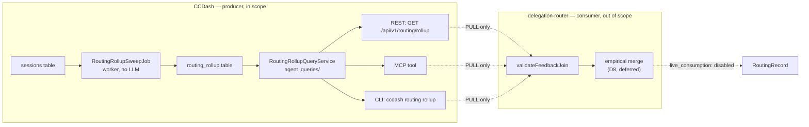

# Feature Brief & Metadata

**Feature Name:** Proof → Routing Feedback Loop — CCDash Producer Surface (BP-6)

**Filepath Name:** `proof-to-routing-loop-v1`

**Date:** 2026-07-29

**Author:** prd-writer (Sonnet 5), from an Opus-authored decisions block

**Related Epic(s)/PRD ID(s):** BP-6 (AOS "closing the backward pass" initiative, workstream #6); sibling to the shipped Automated AAR Review Loop v1

**Related Documents:**

- Decisions block: `.claude/worknotes/proof-to-routing-loop/decisions-block.md`
- Feasibility brief: `docs/project_plans/exploration/proof-to-routing-loop/proof-to-routing-loop-feasibility-brief.md` (verdict `conditional`, confidence 0.75; precondition cleared 2026-07-26)
- Spike findings: tech / value / risk legs under `docs/project_plans/exploration/proof-to-routing-loop/spikes/`
- Design spec: `docs/project_plans/design-specs/proof-to-routing-loop.md` (maturity `ready`)
- Pinned cross-repo contract: `agentic_meta_dev/docs/agentic-operator/contracts/routing-feedback.md` (`aos.routing.feedback` v1.0.0) + `routing-feedback-task-map.v1.json` (`ccdash.skill_name_to_aos.routing.task_class` v1.0.0)
- Sibling precedent: `docs/project_plans/design-specs/ccdash-aar-review-consumer-contract-v1.md`, `docs/project_plans/PRDs/features/ccdash-automated-aar-review-v1.md`, `docs/guides/aar-review-loop.md`

---

## 1. Executive Summary

CCDash already proves, per session, which `(skill, model)` route worked, failed, cost too much, or
regressed — but that proof is pure observability today: a human or agent has to look at a dashboard
to act on it. This feature makes CCDash the **producer** half of a cross-repo feedback loop: it
computes a deterministic, opt-in, no-model rollup keyed on `(task_class × model)` — where
`task_class` is derived *only* through the pinned `aos.routing.feedback` v1.0.0 contract's exact
`skill_name → task_class` mapping — and exposes it as a read-only PULL surface (REST + MCP + CLI)
that the MeatySkills delegation-router can fetch. CCDash never routes, dispatches, or actuates
anything; it only emits evidence, exactly as it already does for the shipped AAR-review consumer
contract.

**Priority:** MEDIUM

**Key Outcomes:**
- CCDash emits a versioned, self-describing, digest-pinned rollup that is safe to consume even if the
  router side never finishes its part (default-off, additive, zero blast radius).
- A repeatedly-failing or expensive `(task_class × model)` route becomes *visible* as a downweighting
  candidate without any agent re-discovering the lesson by hand.
- The cross-repo vocabulary-join risk that blocked this feature at exploration time is closed by
  construction: CCDash never emits raw `skill_name` as `task_class`, and the vendored mapping is
  digest-verified against the contract's normative copy on every CI run.

**Scope note**: This PRD ships the CCDash **producer** half only. The backward-pass loop —
outcome → learning → changed routing behavior — does not close end-to-end until the router-side
empirical merge lands in MeatySkills/`ibm-main` (a named cross-repo deferral, currently
`live_consumption_disabled`; tracked as DI-1). Nothing in this document should be read as claiming
routing improves automatically once this feature ships; it claims only that CCDash's evidence becomes
consumable.

---

## 2. Context & Background

### Current State

CCDash ingests rich per-session telemetry (`sessions.model`, `sessions.skill_name`, token/cost
metrics, error signals) and layers outcome judgments on top via the shipped Automated AAR Review
Loop (`aar_reviews` table, worker sweep, REST/MCP/CLI consumer contract — merged `7d96c3e`). Both are
**read surfaces**: an agent or human looks at them. Nothing today changes *how the next task is
dispatched*. The delegation-router's only empirical input is a hand-maintained scorecard
(`~/.claude/config/model-registry.yaml` `scores:`) that drifts until a human notices a bad route and
edits it by hand.

### Problem Space

A `(task_class × model)` combination that empirically fails, costs 5x, or regresses keeps getting
selected until a human intervenes. The lesson exists in CCDash's own data; it never feeds back into a
decision. This is the AOS "backward pass" gap named in the design spec: the forward pass
(idea → route → execute → record) is strong, the backward pass (outcome → learning → changed future
behavior) is weak.

### Current Alternatives / Workarounds

Manual scorecard tuning is the only mechanism today. It depends on a human re-learning the lesson,
drifts between edits, and does not scale across task classes — exactly the gap this feature closes on
the producer side.

### Architectural Context

This feature is a structural clone of the shipped AAR-review consumer contract and
`system_metrics.py` rollup pattern:

- **Compute**: transport-neutral `backend/application/services/agent_queries/` service, no LLM.
- **Persistence**: worker-primed table (`routing_rollup`, sibling of `aar_reviews`), dual DDL
  (SQLite + PostgreSQL), `retry_on_locked` + `busy_timeout=30000` (ADR-006/007 discipline).
- **Transport**: REST (`backend/routers/client_v1.py`), MCP (`backend/mcp/tools/`), CLI
  (`backend/cli/commands/`) — one shared DTO shape, capability-gated via `/api/v1/capabilities`.
- **Rollout**: default-off config flag, following `CCDASH_AAR_REVIEW_AUTONOMOUS_WORKER_ENABLED`.

---

## 3. Problem Statement

> As the delegation-router, when I select a model for a `(task_class × model)` route that has already
> failed repeatedly / cost 5x / regressed in CCDash's own telemetry, I keep re-selecting that same
> route instead of automatically downweighting it — because CCDash's proof never reaches me as a
> signal I can consume.

**Technical root cause:**
- No rollup artifact exists today that reduces session-level outcomes to a `(task_class × model)` key.
- `task_class` has no first-class column; the only viable CCDash-side source field (`sessions.skill_name`)
  lives in a different vocabulary namespace than the router's own `task_class` taxonomy — a silent
  non-join (or worse, a coincidental mis-join) is the dominant risk if CCDash ships a rollup without a
  negotiated, versioned, digest-pinned mapping.
- Files involved: `backend/application/services/agent_queries/` (new module), `backend/db/*_migrations.py`
  (new table), `backend/routers/client_v1.py`, `backend/mcp/tools/`, `backend/cli/commands/`,
  `backend/config.py`, `backend/adapters/jobs/` / `backend/runtime/` (worker sweep wiring).

---

## 4. Goals & Success Metrics

### Primary Goals

**Goal 1: Ship a contract-compliant, digest-verified rollup producer**
- CCDash emits the full 11-field `aos.routing.feedback` v1.0.0 join envelope on every rollup key,
  vendoring the pinned `routing-feedback-task-map.v1.json` and CI-verifying its SHA-256 against the
  contract's `mapping_digest` on every build.

**Goal 2: Never fabricate a routing key**
- Raw `skill_name` is never copied into `task_class`. Unmapped, null, and executor-identity skill
  names surface as `_unclassified`, coverage-only, never addressable as a routing key by a compliant
  consumer.

**Goal 3: Zero-blast-radius, fully reversible rollout**
- Additive-only schema and endpoints; default-off flag; disabling the flag deterministically reverts
  every read surface to an empty/disabled envelope with no residual writes.

### Success Metrics

| Metric | Baseline | Target | Measurement Method |
|--------|----------|--------|-------------------|
| Mapping digest parity | N/A (feature doesn't exist) | 100% — vendored mapping bytes SHA-256 == contract's pinned `mapping_digest` | CI parity test, every run |
| No-LLM compliance | N/A | 100% — zero banned model-client/Task-dispatch symbols in the module's transitive import graph | AST-walk CI guard (clone of `test_aar_review_no_llm_imports.py`) |
| Determinism | N/A | 100% — two sweeps over an unchanged session window produce field-identical rollup rows | Fixture-DB determinism test |
| Disabled-state consistency | N/A | 100% — REST, MCP, and CLI return byte-identical disabled envelopes when the flag is off | Contract-lock test across all three transports |
| Coverage visibility | N/A | Rollup reports `mapped_count`, `unclassified_count`, and the full list of distinct unmapped skill names on every response | DTO contract-lock test |
| Rollout blast radius | N/A | Zero regressions in existing `sessions`/`aar_reviews` reads; zero new required migrations of existing rows | Existing regression suite green post-merge |

---

## 5. Consumers & Interaction Model

There is no human end-user for this feature and no frontend surface. The two parties are:

- **CCDash** (this repo) — producer. Computes and serves the rollup. Never routes, dispatches, or
  writes to any external system.
- **Delegation-router** (MeatySkills, branch `ibm-main`) — consumer, external, out of scope. PULLs the
  rollup, independently re-validates each row's `source_skill_name → task_class` join against its own
  copy of the taxonomy (`validateFeedbackJoin()`, already implemented on the router side), and owns
  all merge/adjustment math. Live consumption remains `disabled` regardless of what CCDash ships.



---

## 6. Requirements

### 6.1 Functional Requirements

| ID | Requirement | Priority | Notes |
| :-: | ----------- | :------: | ----- |
| FR-1 | Vendor `routing-feedback-task-map.v1.json` into CCDash at a stable path (OQ-5) and pin `contract_id`/`contract_version`/`taxonomy_id`/`taxonomy_version`/`taxonomy_digest`/`mapping_id`/`mapping_version`/`mapping_digest` as constants. | Must | Digest-verified against the normative contract copy in CI. |
| FR-2 | Add capability string `routing:feedback` to `_V1_CAPABILITIES` and config flag `CCDASH_ROUTING_FEEDBACK_ENABLED` (default `false`). | Must | Follows the `sessions:detail` / `aar-review` precedent in `backend/routers/client_v1.py`. |
| FR-3 | Create `routing_rollup` table with dual DDL (SQLite + PostgreSQL) and a repository using `retry_on_locked` + `busy_timeout=30000`. | Must | ADR-006/007 discipline; column-parity allowlist entry. |
| FR-4 | Implement `RoutingRollupQueryService` (`agent_queries/`) that aggregates sessions at `(source_skill_name × model)` grain per project per window, applies the pinned mapping to derive `task_class`, and computes the metric payload (D5). | Must | Pure SQL/threshold arithmetic; no model import anywhere in the transitive closure. |
| FR-5 | Never collapse rows across distinct `source_skill_name` values that share a `task_class`. Each emitted key is self-describing per the contract's literal envelope; any `task_class`-level merge across skill names is the router's responsibility (D8). | Must | Resolves an ambiguity in D2's "(task_class × model) tuple" wording — see §6.3. |
| FR-6 | Emit `_unclassified` and protected-class (`orchestration`, `mode_d`) rows as coverage-only: `eligible_for_adjustment: false` hardcoded, never overridable, config-gated visibility (OQ-4). | Must | Never presented as an addressable routing key to a compliant consumer. |
| FR-7 | Emit `mapped_count`, `unclassified_count`, and the full list of distinct unmapped `source_skill_name` values on every response, enabled or not. | Must | Contract-mandated operator visibility. |
| FR-8 | Implement `RoutingRollupSweepJob` (worker), cloning `AARReviewSweepJob`: multi-project (`workspace_registry.list_projects()`, ADR-006), incremental, idempotent, flag-gated, cache-invalidate on write. | Must | No-op entirely when the flag is off. |
| FR-9 | Expose `GET /api/v1/routing/rollup` (REST), an MCP tool, and a CLI command (`ccdash routing rollup`) — one shared DTO, capability-gated. | Must | Sibling of the AAR-review REST/MCP/CLI trio. |
| FR-10 | When `CCDASH_ROUTING_FEEDBACK_ENABLED` is `false`, all three transports return a deterministic, field-identical disabled envelope (`enabled: false`, empty `keys[]`, zero counts). | Must | HTTP 200, not 404 — capability presence signals feature existence independent of enabled state. |
| FR-11 | Port the AAR-review no-LLM CI guard (AST-walk of the transitive import graph) to the new module. | Must | Enforces AOS Constraint 4 at build time, not just by convention. |
| FR-12 | Author a v1 routing-feedback consumer-contract doc (mirroring `ccdash-aar-review-consumer-contract-v1.md`) and an operator guide (mirroring `aar-review-loop.md`). | Should | Documents exactly which guardrails are CCDash's (verifiable) vs. the router's (asserted only) — per risk-findings §4. |
| FR-13 | Author a DOC-006 deferred-items design-spec stub naming the router-side empirical merge + live consumption as an explicit cross-repo handoff. | Should | Do not describe router-repo implementation; name the seam only. |

### 6.2 Non-Functional Requirements

**Performance:**
- Rollup computation runs only on the worker (background sweep); all three read surfaces serve
  already-persisted rows — O(1)-ish PULL, no live aggregation on the request path.

**Security:**
- No new PII exposure. `skill_name` and `model` are already exposed via existing session/feature
  surfaces; the rollup exposes no transcript content or session-scoped secrets.

**Reliability:**
- Sweep is idempotent and incremental; a crashed or restarted sweep never double-counts or corrupts
  `routing_rollup` rows (upsert semantics, same pattern as `aar_reviews`).

**Observability:**
- OTEL span per sweep run; structured logs report row counts and coverage counters only — never
  session content, matching the redaction discipline already enforced for AAR-review logs.

**Determinism / no-LLM (AOS Constraint 4):**
- The compute and read paths import nothing from `backend.adapters.agents` / `services.agents` or any
  model-client SDK. CI-enforced, not merely asserted (FR-11).

### 6.3 Data Contracts — rollup row grain (resolves a D2 ambiguity)

D2 names the emitted tuple as `(task_class × model)`. Read literally, this could mean CCDash
collapses every `source_skill_name` that maps to the same `task_class` into one merged row before
emission. **This PRD resolves that ambiguity explicitly against the contract's literal envelope,
which requires a singular `source_skill_name` per key** (needed by the router's
`validateFeedbackJoin()` to independently re-verify each row's mapping — a defense-in-depth check
that requires the raw skill name, not a pre-merged label):

- **Emission/storage grain**: `(project_id, source_skill_name, model)` per rolling window. `task_class`
  is a derived, denormalized column computed at write time via the pinned mapping — never the raw
  `skill_name` string.
- **Router-facing "join key"**: `(task_class × model)` is the dimension the router treats as its
  actual adjustment key, but the *merge* of rows across multiple `source_skill_name` values sharing a
  `task_class` happens **router-side** (D8, out of scope here) after it independently validates each
  row's mapping.
- CCDash's `keys[]` array is therefore addressed at `(source_skill_name, model)` grain; a `task_class`
  grouping view may be offered as read-only operator convenience but is never the authoritative row.

Each `keys[]` entry carries the full contract-pinned envelope (self-describing, per the contract's
literal example) plus the D5 metric payload:

```jsonc
{
  // Pinned join envelope (aos.routing.feedback v1.0.0) — 11 fields, verbatim from the contract
  "producer": "ccdash",
  "contract_id": "aos.routing.feedback",
  "contract_version": "1.0.0",
  "taxonomy_id": "aos.routing.task_class",
  "taxonomy_version": "1.0.0",
  "taxonomy_digest": "sha256:d96a0819b0a3a42d14eccc1421d3146b8364253d975d9d54f4f264d4b6adeaca",
  "mapping_id": "ccdash.skill_name_to_aos.routing.task_class",
  "mapping_version": "1.0.0",
  "mapping_digest": "sha256:45a49bb1a6194c6a576160edab7c3212a9cc20e17e6a0b79d531c1c4928f63f5",
  "source_skill_name": "dev-execution",
  "task_class": "implementation",

  // CCDash-designed metric payload (D5) — OQ-2 finalizes exact types in the implementation plan
  "model": "claude-sonnet-5",
  "provider": "anthropic",                 // derived via derive_model_identity(); never an independent key
  "sample_count": 68,
  "success_rate": 0.91,
  "cost_index": 1.0,
  "regression_rate": 0.03,
  "confidence": 0.8,
  "eligible_for_adjustment": true,          // OQ-3: sample_count >= CCDASH_ROUTING_FEEDBACK_MIN_SAMPLE_SIZE
  "window_start": "2026-06-29T00:00:00Z",
  "window_end": "2026-07-29T00:00:00Z",
  "freshness_ts": "2026-07-29T02:00:00Z"
}
```

Top-level envelope (once per response, not per key):

```jsonc
{
  "enabled": true,
  "generated_at": "2026-07-29T02:00:00Z",
  "contract_id": "aos.routing.feedback",
  "contract_version": "1.0.0",
  "taxonomy_id": "aos.routing.task_class",
  "taxonomy_version": "1.0.0",
  "taxonomy_digest": "sha256:d96a0819...",
  "mapping_id": "ccdash.skill_name_to_aos.routing.task_class",
  "mapping_version": "1.0.0",
  "mapping_digest": "sha256:45a49bb1...",
  "mapped_count": 767,
  "unclassified_count": 13632,
  "distinct_unmapped_skill_names": ["…"],
  "keys": [ /* per-key rows, shape above */ ]
}
```

Disabled envelope (flag off) — deterministic across REST/MCP/CLI. Per AC-8, version fields are present
on EVERY response, enabled or disabled — the disabled envelope is not exempt:

```jsonc
{ "enabled": false, "generated_at": null,
  "contract_version": "1.0.0", "taxonomy_version": "1.0.0", "mapping_version": "1.0.0",
  "mapped_count": 0, "unclassified_count": 0,
  "distinct_unmapped_skill_names": [], "keys": [] }
```

Candidate config knobs (OQ-3/OQ-4/OQ-6 — implementation-plan-owned, not locked here):
`CCDASH_ROUTING_FEEDBACK_ENABLED` (bool, default `false`, D6-canonical name — supersedes the working
name `CCDASH_ROUTING_ROLLUP_ENABLED` used in earlier exploration artifacts),
`CCDASH_ROUTING_FEEDBACK_MIN_SAMPLE_SIZE` (int, candidate default `5`, anchored to value-findings
N≥5), `CCDASH_ROUTING_FEEDBACK_WINDOW_DAYS` (int, candidate default `30`, non-binding — see §11
Deferred Items), `CCDASH_ROUTING_FEEDBACK_INCLUDE_PROTECTED_ROWS` (bool, default `true`).

---

## 7. Scope

### In Scope

- `routing_rollup` table (dual DDL, repository, migration + column-parity allowlist).
- `RoutingRollupQueryService` (`agent_queries/`): aggregation, pinned-mapping application,
  coverage counters, metric-payload computation. No LLM.
- Vendored copy of `routing-feedback-task-map.v1.json` + digest-pin constants + CI parity test.
- `RoutingRollupSweepJob` (worker): multi-project, incremental, idempotent, flag-gated clone of
  `AARReviewSweepJob`.
- REST endpoint, MCP tool, CLI command — one shared DTO; capability string `routing:feedback`.
- Config flag `CCDASH_ROUTING_FEEDBACK_ENABLED` (default off) + companion tunables.
- No-LLM CI guard, DTO contract-lock test, digest-parity test, determinism test, disabled-state test.
- Consumer-contract doc + operator guide + DOC-006 deferred-items handoff stub.

### Out of Scope

- **Router-side empirical merge and live consumption** (bounded-adjustment cap, effective-score
  floor, minimum-sample re-gate, decay blend, `RoutingRecord` provenance) — owned by
  MeatySkills/`ibm-main`; currently `live_consumption_disabled`. Named as a pinned cross-repo seam +
  DOC-006 handoff, never planned as CCDash tasks (D1, D8).
- **Model/provider cross-repo namespacing** — CCDash emits `model` verbatim as captured and `provider`
  as derived by the existing `derive_model_identity()`; no cross-repo canonicalization of model
  naming is negotiated in this feature.
- **Window/decay numeric finalization** — the candidate `30`-day window and `5`-sample threshold are
  design placeholders anchored to the value-findings spike, not locked requirements (see §11).
- Any frontend/UI surface — this feature has no FE component.
- Any push/dispatch mechanism — CCDash never calls the router; the router always PULLs.
- Semantic or LLM-assisted `task_class` inference beyond the pinned exact mapping.
- Historical backfill of rollup rows for sessions predating flag enablement (worker computes forward
  from enablement, same convention as `CCDASH_AAR_REVIEW_AUTONOMOUS_WORKER_ENABLED`).

---

## 8. Dependencies & Assumptions

### External Dependencies (informational — no runtime call-out from CCDash)

- `agentic_meta_dev/docs/agentic-operator/contracts/routing-feedback.md` (`aos.routing.feedback` v1.0.0) —
  contract of record; CCDash vendors a frozen snapshot, never fetches it live.
- `agentic_meta_dev/docs/agentic-operator/contracts/routing-feedback-task-map.v1.json`
  (`ccdash.skill_name_to_aos.routing.task_class` v1.0.0) — the exact mapping CCDash vendors and
  digest-pins.
- `MeatySkills/meaty-agentic-ops/skills/delegation-router/task-class-vocabulary.v1.json`
  (`aos.routing.task_class` v1.0.0) — router-owned taxonomy; CCDash never reads this file directly,
  only its pinned digest.

### Internal Dependencies

- Shipped Automated AAR Review Loop v1 (`aar_reviews` table/repo/worker/REST/MCP/CLI) — the structural
  precedent this feature clones end-to-end.
- `workspace_registry.list_projects()` (ADR-006) — multi-project sweep scope.
- `repositories/base.py:retry_on_locked` (ADR-007) — write-path discipline for the new repository.
- `derive_model_identity()` (`backend/model_identity.py`) — the existing `provider` derivation CCDash
  reuses rather than re-implementing.
- `/api/v1/capabilities` advertisement handler (`backend/routers/client_v1.py`) — capability negotiation
  surface this feature appends one entry to.

### Assumptions

- **Row grain resolves D2's ambiguity as stated in §6.3** — `(source_skill_name × model)` at emission,
  `(task_class × model)` as the router's join dimension. This is a PRD-level design decision, not yet
  re-confirmed with the router owner; flagged in D9 (pending) for pre-Phase-5 socialization.
- **Flag naming**: `CCDASH_ROUTING_FEEDBACK_ENABLED` (D6, locked) is canonical. Earlier exploration
  artifacts (design spec, spike findings) used the working name `CCDASH_ROUTING_ROLLUP_ENABLED` before
  D6 was decided — this PRD and the implementation plan use the D6 name exclusively.
- Single-operator workload characteristics from the value-findings spike (5–23% `skill_name`
  population, 40 distinct `(skill_name, model)` keys, 52% clearing N≥5) are assumed to hold at build
  time; the implementation plan's fixture-DB tests should not assume higher density.
- CCDash never needs network access to agentic_meta_dev or MeatySkills repos at runtime; digest parity
  is a build/CI-time check against the vendored copy only.

### Feature Flags

- `CCDASH_ROUTING_FEEDBACK_ENABLED` (bool, default `false`) — master switch; gates worker sweep writes
  and non-disabled responses across REST/MCP/CLI.
- `CCDASH_ROUTING_FEEDBACK_MIN_SAMPLE_SIZE` (int, candidate default `5`) — eligibility threshold (OQ-3).
- `CCDASH_ROUTING_FEEDBACK_WINDOW_DAYS` (int, candidate default `30`, non-binding — OQ-6/§11).
- `CCDASH_ROUTING_FEEDBACK_INCLUDE_PROTECTED_ROWS` (bool, default `true`) — OQ-4 coverage-row gate.

---

## 9. Risks & Mitigations

| Risk | Impact | Likelihood | Mitigation |
| ----- | :----: | :--------: | ---------- |
| Silent non-join / cross-repo vocabulary drift — a well-formed rollup the router cannot (or wrongly can) join | High | Low (post-contract) | Emit canonical `task_class` via the exact pinned mapping only; carry all envelope digests verbatim; CI parity test on the vendored mapping bytes; router's `validateFeedbackJoin()` is the fail-closed backstop. |
| Per-key sparsity for a single-operator workload | Medium | Medium | Coarsened, density-validated tuple (52% N≥5); emit `sample_count` + `eligible_for_adjustment` so the router applies its own threshold; thin keys simply don't route — safe, not wrong. |
| Constraint-4 violation (LLM on the compute/read path) | Medium | Low | Pure-SQL aggregation; worker/service import nothing from `backend.adapters.agents`/`services.agents`; CI-enforced AST-walk guard (FR-11); determinism test over a fixture DB. |
| Metric-payload shape unconsumable by the router (unspecified by the contract) | Medium | Medium | D5 payload is additive-versioned; socialize to the router owner before Phase 5 ships (D9, pending); keep evidence-only so a mismatch is inert, never harmful. |
| Blast radius on CCDash (new table/worker/endpoints regress existing reads) | Low | Low | Additive-only DDL; default-off flag; zero mutation of `sessions`/`aar_reviews`; instant env-var revert; disabled state returns a deterministic empty envelope. |

---

## 10. Target State (Post-Implementation)

**When `CCDASH_ROUTING_FEEDBACK_ENABLED=true`:**
- The worker sweeps every registered project (ADR-006) on its scheduled interval, computing
  `(source_skill_name × model)` rows per window, applying the pinned mapping, and upserting
  `routing_rollup`.
- REST/MCP/CLI all return the full envelope: contract/taxonomy/mapping identity, coverage counters,
  and self-describing per-key rows with the D5 metric payload.
- `/api/v1/capabilities` advertises `routing:feedback`; a router that predates this feature simply
  never sees the capability and degrades gracefully (existing capability-negotiation convention).
- The delegation-router, if and when it enables live consumption, PULLs this surface, independently
  re-validates each row's mapping, and layers its own (out-of-scope) merge math on top. CCDash's role
  ends at "serve correct evidence."

**When disabled (default):**
- Worker sweep is a no-op; no new writes to `routing_rollup`.
- All three transports return the deterministic disabled envelope (`enabled: false`, empty `keys[]`,
  zero counts) — HTTP 200, capability still advertised (feature exists, is off), no 404/500.

**Completeness scope (do not overread)**: The D5 metric payload above is **provisional and
additive-versioned** — it is CCDash's own design surface (the contract leaves it unspecified) and is
**not guaranteed consumable by the router as-is**. This feature ships the producer surface only; it
does not, by itself, make routing improve automatically. The loop closes only after the router-side
empirical merge (bounded-adjustment cap, effective-score floor, decay blend, `RoutingRecord`
provenance) lands in MeatySkills/`ibm-main` — a named cross-repo deferral (DI-1, currently
`live_consumption_disabled`), never a blocking precondition for CCDash's own "done" state. Socializing
the D5 shape to the router owner before Phase 5 seals is a strong recommendation (D9), not a hard gate.

---

## 11. Overall Acceptance Criteria (Definition of Done)

This feature has **no frontend surface**. Per the decisions block's AC-discipline note, the
FE-fallback/UI-runtime-smoke resilience axes (R-P2/R-P4) are replaced by **consumer-absent /
version-mismatch / sparse-key / disabled-state** resilience — the actual failure modes for a
cross-repo PULL contract with no UI. `verified_by` task IDs are assigned by the implementation plan;
phase labels below are forward pointers to the decisions-block phase table.

#### AC-1: Envelope completeness
- target_surfaces:
    - backend/application/services/agent_queries/routing_rollup.py
    - backend/routers/client_v1.py
    - backend/mcp/tools/reports.py
    - backend/cli/commands/report.py
- propagation_contract: Every enabled response, on every transport, carries all 11 pinned envelope
  fields per key plus `mapped_count`, `unclassified_count`, and `distinct_unmapped_skill_names` at the
  top level.
- resilience: A response missing any pinned field is a contract violation, not a partial success —
  the DTO contract-lock test fails the build.
- visual_evidence_required: false
- verified_by: P6 (DTO contract-lock test)

#### AC-2: Mapping fidelity
- target_surfaces:
    - backend/application/services/agent_queries/routing_task_map_v1.json (vendored copy, path per OQ-5)
- propagation_contract: The vendored mapping file's SHA-256 digest equals the contract's pinned
  `mapping_digest` (`sha256:45a49bb1a6194c6a576160edab7c3212a9cc20e17e6a0b79d531c1c4928f63f5`) byte-for-byte.
- resilience: A digest mismatch fails CI immediately, before any rollup logic can run against a stale
  or edited mapping.
- visual_evidence_required: false
- verified_by: P1/P6 (digest-parity test)

#### AC-3: Determinism + no-LLM
- target_surfaces:
    - backend/application/services/agent_queries/routing_rollup.py
    - backend/adapters/jobs/routing_rollup_sweep_job.py
- propagation_contract: Two sweep runs over an unchanged session window produce field-identical
  `routing_rollup` rows; the module's transitive import graph contains zero banned model-client or
  Task/Agent-dispatch symbols.
- resilience: Any accidental model import anywhere in the closure fails the AST-walk CI guard, not
  just a runtime assertion.
- visual_evidence_required: false
- verified_by: P3/P6 (determinism test + no-LLM AST-walk guard)

#### AC-4: Default-off disabled behavior
- target_surfaces:
    - backend/routers/client_v1.py (REST)
    - backend/mcp/tools/reports.py (MCP)
    - backend/cli/commands/report.py (CLI)
- propagation_contract: With `CCDASH_ROUTING_FEEDBACK_ENABLED=false`, all three transports return the
  byte-identical disabled envelope (`enabled: false`, empty `keys[]`, zero counts), HTTP 200.
- resilience: A consumer that predates this feature never sees the capability string at all
  (`/api/v1/capabilities` omits `routing:feedback`); a consumer that supports it but finds it disabled
  gets a well-formed, distinguishable "off" response — never a 404/500/empty-body ambiguity.
- visual_evidence_required: false
- verified_by: P5/P6 (disabled-state contract test across all three transports)

#### AC-5: Sparse-key / eligibility visibility
- target_surfaces:
    - backend/application/services/agent_queries/routing_rollup.py
- propagation_contract: Every emitted key carries `sample_count` and `eligible_for_adjustment`
  regardless of whether it clears the minimum-sample threshold; sub-threshold keys are never
  suppressed from the response.
- resilience: A router applying its own (possibly different) minimum-sample gate always has the raw
  `sample_count` to do so — CCDash's threshold is advisory (`eligible_for_adjustment`), not a filter
  that hides data.
- visual_evidence_required: false
- verified_by: P3/P6 (sparse-key visibility test against the value-findings density fixture)

#### AC-6: `_unclassified` / protected-class coverage-only handling
- target_surfaces:
    - backend/application/services/agent_queries/routing_rollup.py
- propagation_contract: Rows for `_unclassified`, `orchestration`, and `mode_d` task classes carry a
  hardcoded, non-overridable `eligible_for_adjustment: false` and are never presented as an addressable
  routing key to a compliant consumer.
- resilience: Even if a naive consumer ignores `eligible_for_adjustment`, no protected-class row ever
  contains a `task_class` value the pinned taxonomy marks as MUST-stay — the mapping itself enforces
  this at the source (D3).
- visual_evidence_required: false
- verified_by: P3/P6 (protected-class + `_unclassified` fixture test)

#### AC-7: Reversibility
- target_surfaces:
    - backend/config.py
    - backend/adapters/jobs/routing_rollup_sweep_job.py
- propagation_contract: Flipping `CCDASH_ROUTING_FEEDBACK_ENABLED` to `false` and restarting the
  worker/API process stops all new `routing_rollup` writes and causes the very next call on every
  transport to return the disabled envelope — no partial state, no stale enabled rows served.
- resilience: No write path exists that leaves residue after disablement; re-enabling resumes forward
  computation without requiring a backfill or migration.
- visual_evidence_required: false
- verified_by: P4/P6 (flag-flip reversibility test)

#### AC-8: Version-mismatch resilience
- target_surfaces:
    - backend/application/services/agent_queries/routing_rollup.py
- propagation_contract: Every response — enabled or disabled — carries `contract_version`,
  `taxonomy_version`, and `mapping_version` so a consumer pinned to a different version can detect the
  mismatch and refuse to actuate, per the contract's compatibility rules (no best-effort coercion).
- resilience: CCDash never silently upgrades or downgrades its emitted version fields to match an
  assumed consumer version; a mismatch is the consumer's decision to fail closed, not CCDash's to hide.
- visual_evidence_required: false
- verified_by: P1/P6 (version-field-presence test)

---

## 12. Assumptions & Open Questions

### Assumptions

- The row-grain resolution in §6.3 (`(source_skill_name × model)` emission, `(task_class × model)`
  router-facing join dimension) is the correct reading of D2 + the contract's literal envelope; the
  implementation plan should treat this as settled unless the router owner's D9 socialization surfaces
  a conflict.
- The AAR-review consumer-contract and operator-guide docs are the correct structural templates for
  FR-12; no new documentation pattern is introduced.

### Open Questions

See frontmatter `open_questions` (OQ-1 resolved by D3; OQ-2 through OQ-5 open, assigned to
`implementation-planner`; OQ-6 explicitly deferred — see §13).

---

## 13. Deferred Items (carry into the implementation plan's DOC-006)

| Item | Why deferred | Where it's captured |
|---|---|---|
| Router-side empirical merge + live consumption (bounded-adjustment cap, effective-score floor, minimum-sample re-gate, decay blend, `RoutingRecord` provenance) | Owned by MeatySkills/`ibm-main`; not buildable from CCDash's working tree; `live_consumption_disabled` per the contract's current lifecycle state. | D1, D8 — implementation plan Phase 6, DOC-006 handoff design-spec stub. |
| Model/provider cross-repo namespacing | The contract does not pin a canonical `model` string format; CCDash emits its own captured value verbatim and derives `provider` locally. Any cross-repo canonicalization is a future negotiation, not this feature's scope. | Noted in §7 Out of Scope; no CCDash-side task. |
| Window/decay numeric defaults | The contract explicitly leaves rolling-window length, freshness, and decay-input representation to CCDash (OQ-6) but fixes no length; the `30`-day candidate here is anchored to the value-findings spike, not a requirement. | OQ-6 (frontmatter, status `deferred`); implementation plan finalizes the actual default and any override knob. |

---

## 14. Appendices & References

### Related Documentation

- Cross-repo contract: `agentic_meta_dev/docs/agentic-operator/contracts/routing-feedback.md`
  (`aos.routing.feedback` v1.0.0)
- Cross-repo mapping: `agentic_meta_dev/docs/agentic-operator/contracts/routing-feedback-task-map.v1.json`
  (`ccdash.skill_name_to_aos.routing.task_class` v1.0.0)
- Feasibility brief: `docs/project_plans/exploration/proof-to-routing-loop/proof-to-routing-loop-feasibility-brief.md`
- Design spec: `docs/project_plans/design-specs/proof-to-routing-loop.md`
- Sibling precedent PRD: `docs/project_plans/PRDs/features/ccdash-automated-aar-review-v1.md`
- Sibling consumer contract: `docs/project_plans/design-specs/ccdash-aar-review-consumer-contract-v1.md`
- Operator guide precedent: `docs/guides/aar-review-loop.md`

### Prior Art

- Automated AAR Review Loop v1 (merged `7d96c3e`) — structural anchor for every phase in this feature;
  ~30–45 pts across 7 phases, of which this feature needs neither the multi-hop evidence-correlation
  phase nor the SkillMeat semantic 5th-flag phase (no analogue here — aggregation is a flat GROUP BY
  over already-typed session rows).
- `system_metrics.py` — worker-primed rollup precedent for the query-service shape.

---

## Implementation (phased overview — full task breakdown lives in the implementation plan)

| Phase | Name | Points | Primary Agent(s) | Exit Gate |
|-------|------|--------|-------------------|-----------|
| P1 | Contract & Envelope Foundations | 2 | backend-architect, python-backend-engineer | Digest-parity test green; flag reads `false` by default. |
| P2 | Data Layer | 3 | data-layer-expert | Dual-DDL parity + repo tests green (ADR-006/007). |
| P3 | Rollup Compute Service | 4 | backend-architect, python-backend-engineer | Determinism + mapping-fidelity + no-LLM-import tests green. |
| P4 | Worker Sweep Job | 2 | python-backend-engineer | Multi-project sweep test + flag-off no-op test green. |
| P5 | Transport Surfaces | 3 | python-backend-engineer | DTO contract-lock test + disabled-state test green across REST/MCP/CLI. |
| P6 | Validation, Guards & Docs | 2 | documentation-writer, python-backend-engineer, task-completion-validator (gate) | `task-completion-validator` + `karen` (feature end) pass. |

**Critical path**: P1 → P2 → P3 → (P4 ∥ P5) → P6. Full phase boundaries, agent routing, risk hotspots,
estimation anchors, dependency map, and model routing are authoritative in the decisions block
(`.claude/worknotes/proof-to-routing-loop/decisions-block.md`) and are expanded verbatim by
`implementation-planner` into `docs/project_plans/implementation_plans/infrastructure/proof-to-routing-loop-v1.md`.

---

**Progress Tracking:**

See progress tracking (once the implementation plan exists): `.claude/progress/proof-to-routing-loop/`
