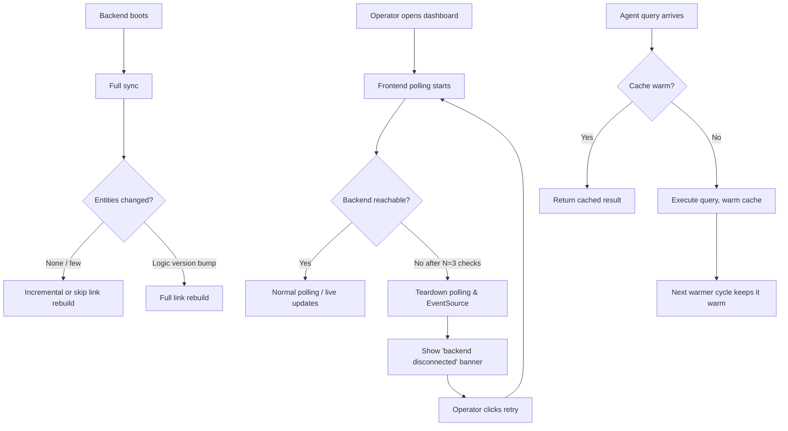

# Feature Brief & Metadata

**Feature Name:**

> CCDash Runtime Performance Hardening v1

**Filepath Name:**

> `runtime-performance-hardening-v1`

**Date:**

> 2026-04-20

**Author:**

> Nick Miethe

**Related Epic(s)/PRD ID(s):**

> `performance-and-reliability-v1` meta-plan

**Related Documents:**

> - `docs/project_plans/design-specs/runtime-performance-hardening-v1.md` (source design spec)
> - `docs/project_plans/meta_plans/performance-and-reliability-v1.md`
> - `docs/project_plans/implementation_plans/db-caching-layer-v1.md`
> - `docs/project_plans/implementation_plans/refactors/deployment-runtime-modularization-v1.md`
> - `docs/project_plans/implementation_plans/refactors/data-platform-modularization-v1.md`

---

## 1. Executive Summary

This initiative addresses three operator-visible performance and reliability symptoms in CCDash that are **not** resolved by the three concurrent infrastructure initiatives (db-caching-layer, data-platform-modularization, deployment-runtime-modularization). The targeted symptoms are: frontend browser tabs growing to 2GB+ memory over time, startup link-rebuild double-work that degrades cold-start latency, and cached agent-query cold windows combined with N+1 workflow detail fetches that produce elevated p95 API latencies. Delivering these fixes produces a measurably more stable local-first dashboard experience for operators running long-lived sessions.

**Priority:** HIGH

**Key Outcomes:**
- Outcome 1: Frontend tab memory stays flat under ±50MB during sustained 60-minute idle with the worker running.
- Outcome 2: Startup link rebuilds are scoped to changed entities and deferred rebuild is opt-in, eliminating redundant full-workspace traversals on boot.
- Outcome 3: Cached query cold windows are eliminated by aligning TTL defaults with the warmer interval; workflow detail N+1 is replaced by a single batch query.

---

## 2. Context & Background

### Current state

CCDash is a local-first dashboard backed by a Python/FastAPI backend (SQLite or PostgreSQL) and a React 19 / TypeScript frontend. Three concurrent infrastructure plans (db-caching-layer, data-platform-modularization, deployment-runtime-modularization) are delivering foundational improvements: a TTL query cache, modular storage profiles, and separated runtime processes. Those plans are assumed to be landing in parallel.

### Problem space

After the foundational improvements land, three residual operator-visible problems remain:

1. **Frontend tab memory growth** — polling loops, unbounded session-log arrays, unbounded document pagination, and a leaking in-flight request map cause browser tabs to grow beyond 2GB, eventually crashing or slowing the browser.
2. **Link-rebuild double-work** — on every boot the scheduler performs a full sync, then (by default) queues a second full deferred link rebuild. Any downstream entity change also triggers a full rebuild, even when only a small set of entities changed.
3. **Cached query cold windows + N+1 workflow fetches** — the default TTL (60s) is shorter than the warmer cycle (300s), causing entries to expire four times per cycle. `get_workflow_registry_detail()` is called in a per-workflow loop instead of in a single batch query.

### Current alternatives / workarounds

Operators have no documented workarounds beyond restarting the browser tab or the backend process. Adjusting env-var knobs (`CCDASH_QUERY_CACHE_TTL_SECONDS`, `CCDASH_STARTUP_DEFERRED_REBUILD_LINKS`) is possible but underdocumented and counter-intuitive at their shipped defaults.

### Architectural context

- **Frontend shell providers** (`AppEntityDataContext`, `AppRuntimeContext`) own polling loops and EventSource connections.
- **SessionInspector** / `sessionTranscriptLive.ts` own log append and rendering.
- **`backend/db/sync_engine.py`** drives the full-sync and link-rebuild scheduling.
- **`backend/application/services/agent_queries/workflow_intelligence.py`** contains the N+1 detail loop at line 157.
- **`backend/routers/cache.py`** and `backend/config.py` own cache TTL knobs.

---

## 3. Problem Statement

**User story (operator):**
> "As a CCDash operator running a long-lived session, when I leave the dashboard open overnight, my browser tab consumes 2GB+ of memory and the backend cold-starts with redundant link rebuilds that delay first-response by seconds—neither of which is addressed by the three ongoing infrastructure plans."

**Technical root causes:**

| Symptom | Root cause | Primary files |
|---------|-----------|---------------|
| Frontend memory growth | Unbounded `session.logs` array; unbounded `while (offset < total)` doc pagination; `sessionDetailRequestsRef` entries never GC'd on rejection; polling/EventSource loops do not stop when backend is unreachable | `components/SessionInspector.tsx`, `services/live/sessionTranscriptLive.ts`, `contexts/AppEntityDataContext.tsx`, `contexts/AppRuntimeContext.tsx` |
| Link-rebuild double-work | `CCDASH_STARTUP_DEFERRED_REBUILD_LINKS` defaults to `true`; `_should_rebuild_links_after_full_sync()` returns a boolean so granular rebuild is not possible; `rglob` traversals are repeated per scan type | `backend/db/sync_engine.py` |
| Cold query windows + N+1 | Default TTL (60s) < warmer interval (300s); per-workflow `get_workflow_registry_detail()` call in a loop | `backend/application/services/agent_queries/workflow_intelligence.py:157`, `backend/config.py` |

---

## 4. Goals & Success Metrics

### Primary goals

**Goal 1: Frontend memory stability**
Prevent browser tab memory from growing without bound during a long-lived session by introducing log windowing, document pagination caps, polling lifecycle teardown, and in-flight request cache TTLs.

**Goal 2: Scoped link rebuilds**
Eliminate redundant full link rebuilds on startup and on incremental entity changes by making deferred rebuild opt-in and introducing incremental scoping.

**Goal 3: Warm query cache + batch workflow diagnostics**
Ensure the shipped warmer keeps entries warm at all times and remove the N+1 workflow detail query by replacing it with a single batch fetch.

### Success metrics

| Metric | Baseline | Target | Measurement method |
|--------|----------|--------|--------------------|
| Tab memory after 60-min idle + worker running | 2GB+ (observed) | Flat within ±50MB of initial load | Load-test harness, browser memory profiler |
| Cache hit rate during steady-state operation | <80% (est., due to 60s TTL < 300s warmer) | ≥95% | Prometheus `ccdash_query_cache_hit_total` |
| Cold-start p95 latency (`GET /api/project-status`) on 50k-session workspace | Unmeasured baseline | <500ms with new defaults | Cold-start benchmark script |
| Full link rebuilds per boot (new default) | 2 (sync + deferred) | ≤1 | `ccdash_link_rebuild_scope{scope="full"}` counter |
| Workflow detail batch rows per diagnostics call | N (one query per workflow) | 1 batch query regardless of workflow count | `ccdash_workflow_detail_batch_rows` counter |

---

## 5. User Personas & Journeys

### Personas

**Primary persona: Local operator**
- Role: Developer running CCDash against a local project workspace for hours at a time.
- Needs: Stable browser tab; fast startup after restarts; low-latency agent query responses.
- Pain points: Tab crashes overnight; multi-second cold starts; stale dashboard data after TTL expiry.

**Secondary persona: Hosted operator (remote deployment)**
- Role: Developer running CCDash as a containerized service (post deployment-runtime-modularization).
- Needs: Predictable memory footprint in the container; consistent API latency.
- Pain points: Pod OOM kills; cache cold windows visible as latency spikes in monitoring.

### High-level flow

---

## 6. Requirements

### 6.1 Functional requirements

| ID | Requirement | Priority | Notes |
|:--:|-------------|:--------:|-------|
| FR-1 | Cap `session.logs` to 5000 rows using ring-buffer semantics; emit `transcriptTruncated` marker when rows are dropped | Must | `SessionInspector.tsx`, `sessionTranscriptLive.ts` |
| FR-2 | Add virtualized rendering (react-virtual) to the session log list | Must | Caps DOM node count |
| FR-3 | Introduce `MAX_DOCUMENTS_IN_MEMORY` (default 2000); stop `while (offset < total)` loop at cap; fetch subsequent pages lazily | Must | `AppEntityDataContext.tsx` |
| FR-4 | Tear down `setInterval` and `EventSource` reconnect loops after N=3 consecutive unreachable health checks | Must | `AppRuntimeContext.tsx` |
| FR-5 | Show a user-facing "backend disconnected" banner with a manual retry button when polling is torn down | Must | Replaces silent infinite retry |
| FR-6 | Clear `sessionDetailRequestsRef` entries on rejection (not only on resolve) | Must | Fixes leak on network failure |
| FR-7 | Add a 30s TTL to `sessionDetailRequestsRef` Map entries; GC stale entries on every insert | Must | Bounds in-flight request cache size |
| FR-8 | Change default of `CCDASH_STARTUP_DEFERRED_REBUILD_LINKS` from `true` to `false` | Must | Document cold-start cost |
| FR-9 | Extend `_should_rebuild_links_after_full_sync()` to return a scope object (`full \| entities_changed \| none`) | Must | `sync_engine.py` |
| FR-10 | When scope is `entities_changed`, call `EntityLinksRepository.rebuild_for_entities(ids)` instead of full rebuild | Must | New or extended repository method |
| FR-11 | Preserve full rebuild when `CCDASH_LINKING_LOGIC_VERSION` bumps | Must | Ensures correctness after schema changes |
| FR-12 | Memoize `rglob` results per (root, pattern) tuple for the life of a sync run | Should | Single directory traversal per run |
| FR-13 | Persist `filesystem_scan_manifest` table (path, mtime, size); skip re-walk when inode stats are unchanged and `CCDASH_STARTUP_SYNC_LIGHT_MODE=true` | Should | `sync_engine.py`, new migration |
| FR-14 | Change `CCDASH_QUERY_CACHE_TTL_SECONDS` default from 60 to 600 | Must | Aligns with warmer interval |
| FR-15 | Replace per-workflow `get_workflow_registry_detail()` loop with a single `fetch_workflow_details(ids)` batch query | Must | `workflow_intelligence.py:157` |
| FR-16 | Retain `get_workflow_registry_detail(id)` for single-item queries | Must | Backward compatibility |
| FR-17 | Add Prometheus counters: `ccdash_frontend_poll_teardown_total`, `ccdash_link_rebuild_scope{scope}`, `ccdash_filesystem_scan_cached_total`, `ccdash_workflow_detail_batch_rows` | Must | `backend/observability/` |
| FR-18 | Extend `/api/health` with a `runtimePerfDefaults` block reporting resolved values of TTL and deferred-rebuild knobs | Must | Operator verification |

### 6.2 Non-functional requirements

**Performance:**
- Frontend tab memory stays flat within ±50MB over a 60-minute idle + worker-running load test.
- Cold-start `GET /api/project-status` p95 < 500ms on a reference 50k-session workspace with new defaults.
- Cache hit rate ≥ 95% during steady-state operation.

**Reliability:**
- Polling teardown must not prevent manual operator recovery (retry button always available).
- Incremental link rebuild must not produce stale edges; correctness verified by comparing entity graph before/after on a fixture workspace.
- Raising default TTL to 600s must not cause stale dashboard data beyond the existing warmer refresh cycle.

**Observability:**
- All four new counters expose labeled metrics consumable by the existing Prometheus/OTEL pipeline.
- `/api/health` `runtimePerfDefaults` block must reflect env-var overrides accurately.

**Rollout safety:**
- `VITE_CCDASH_MEMORY_GUARD_ENABLED` flag (default `true`) gates all frontend memory hardening changes.
- `CCDASH_INCREMENTAL_LINK_REBUILD_ENABLED` flag (default `false`) gates incremental rebuild; flip to `true` after one minor-version soak.
- Default changes (FR-8, FR-14) ship with a one-minor-version deprecation note in operator docs.

---

## 7. Scope

### In scope

- Frontend transcript log windowing and virtualized rendering.
- Frontend document pagination cap and lazy loading.
- Frontend polling lifecycle teardown and "backend disconnected" UX.
- Frontend in-flight request cache leak fix (rejection clearing + 30s TTL + GC).
- Backend deferred link-rebuild default change to opt-in.
- Backend incremental link-rebuild scope resolver and `rebuild_for_entities` helper.
- Backend `rglob` memoization and `filesystem_scan_manifest` table.
- Backend default TTL change (60s → 600s).
- Backend workflow diagnostics batch query replacing N+1 loop.
- Prometheus counters and `/api/health` `runtimePerfDefaults` block.
- Vitest and pytest coverage for all new logic.
- Operator documentation updates for changed defaults and new feature flags.

### Out of scope

- Rebuilding the sync engine core (covered by db-caching-layer).
- Changing storage profile contracts (covered by data-platform-modularization).
- Runtime/worker packaging and container composition (covered by deployment-runtime-modularization phases 4-6).
- Adding a soft-eviction LRU policy to the agent query cache (open question; deferred to a follow-on spec if TTL change proves insufficient).
- On-demand fetch of older transcript rows beyond the 5000-row window (open question; "older messages hidden" with manual refresh is the v1 UX).

---

## 8. Dependencies & Assumptions

### External dependencies

- **react-virtual (or @tanstack/react-virtual)**: Virtualized list rendering for session log view. Version compatible with React 19 required.

### Internal dependencies

- **db-caching-layer plan**: TTL query cache infrastructure must be present before FR-14 and FR-15 changes are meaningful. Assumed to be landing in parallel.
- **`EntityLinksRepository`**: FR-10 requires either an existing `rebuild_for_entities(ids)` method or a new one (open question OQ-2 below).
- **`backend/db/migrations.py`**: FR-13 requires a new `filesystem_scan_manifest` migration.

### Assumptions

- The three parallel infrastructure initiatives land before or concurrently with this plan; this plan does not block on them but benefits from their foundations.
- The reference 50k-session workspace used for cold-start benchmarks is available in the development environment.
- `CCDASH_QUERY_CACHE_REFRESH_INTERVAL_SECONDS` default (300s) is not changing as part of this initiative; only TTL is raised.

### Feature flags

| Flag | Default | Purpose |
|------|---------|---------|
| `VITE_CCDASH_MEMORY_GUARD_ENABLED` | `true` | Gates all frontend memory hardening (FR-1 through FR-7) |
| `CCDASH_INCREMENTAL_LINK_REBUILD_ENABLED` | `false` | Gates incremental link rebuild scope resolver (FR-9, FR-10); flip after soak |
| `CCDASH_STARTUP_SYNC_LIGHT_MODE` | `false` | Enables manifest-based scan skip (FR-13) |

---

## 9. Risks & Mitigations

| Risk | Impact | Likelihood | Mitigation |
|------|:------:|:----------:|------------|
| Transcript ring-buffer truncation loses diagnostic data operators need for debugging | Medium | Medium | Expose truncation marker in UI; document 5000-row default; make cap configurable via env var in v1.1 |
| Incremental link rebuild produces stale or incorrect edges if scope resolver has a bug | High | Low | Default flag to `false`; validate graph correctness against fixture workspace before flipping default |
| Raising TTL to 600s causes operators to see stale data if the warmer fails | Medium | Low | Surface `runtimePerfDefaults` in `/api/health` so operators can detect misconfiguration; document override path |
| `rglob` memoization uses stale directory results if filesystem changes mid-sync | Low | Low | Scope memoization to a single sync-run lifetime; do not share across runs |
| Adding react-virtual introduces a new dependency that conflicts with React 19 | Medium | Low | Verify compatibility in a feature branch before merging; fallback is CSS-overflow with DOM cap |
| Polling teardown hides connectivity issues from operators who do not notice the banner | Medium | Medium | Banner is persistent and prominent; manual retry is always available; log teardown event to OTEL |

---

## 10. Target state (post-implementation)

**User experience:**
- Operators can leave the dashboard open for hours without browser tab memory growing unbounded. A persistent "backend disconnected" banner with a retry button replaces the silent infinite reconnect loop.
- The session log view handles large transcripts smoothly via virtualized rendering with a clear "older messages hidden" indicator when the 5000-row cap is reached.

**Technical architecture:**
- Frontend shell providers enforce memory caps on log arrays, document collections, and in-flight request maps; polling and EventSource connections self-terminate on sustained backend unreachability.
- The backend sync engine performs at most one link rebuild per boot (and only a partial rebuild when a small set of entities changed), driven by a scope resolver returning `full | entities_changed | none`.
- The `filesystem_scan_manifest` table allows subsequent syncs (when light mode is enabled) to skip directory traversal for unchanged paths.
- The shipped default TTL (600s) keeps cached agent-query entries warm across the full warmer cycle (300s); workflow diagnostics use a single batch query regardless of active workflow count.

**Observable outcomes:**
- Prometheus counters surface teardown events, rebuild scopes, scan cache hits, and batch row counts.
- `/api/health` reports resolved knob values so operators can verify effective posture without reading source.

---

## 11. Overall acceptance criteria (definition of done)

### Functional acceptance

- [ ] FR-1 through FR-18 implemented and verified.
- [ ] Transcript truncation marker appears in the UI when the 5000-row cap is exceeded.
- [ ] "Backend disconnected" banner appears after 3 consecutive unreachable health checks; retry restores polling.
- [ ] `sessionDetailRequestsRef` entries are cleared on rejection and GC'd after 30s.
- [ ] Boot with default config produces at most one link rebuild; `ccdash_link_rebuild_scope{scope="full"}` counter increments at most once per boot.
- [ ] `fetch_workflow_details(ids)` replaces the N+1 loop; `ccdash_workflow_detail_batch_rows` counter confirms single-query execution.
- [ ] `/api/health` response includes `runtimePerfDefaults` block with correct resolved values.

### Technical acceptance

- [ ] `VITE_CCDASH_MEMORY_GUARD_ENABLED=false` disables all frontend memory hardening without breaking existing behaviour.
- [ ] `CCDASH_INCREMENTAL_LINK_REBUILD_ENABLED=true` activates incremental rebuild; entity graph matches full-rebuild output on fixture workspace.
- [ ] All four Prometheus counters are registered and emit correctly under the existing OTEL pipeline.
- [ ] New `filesystem_scan_manifest` migration runs cleanly against SQLite and PostgreSQL.

### Quality acceptance

- [ ] Vitest coverage for transcript windowing, document pagination cap, polling teardown, and in-flight request GC logic.
- [ ] Pytest coverage for scope resolver, manifest diff logic, `fetch_workflow_details` batch query.
- [ ] Load-test harness: 60-min idle + worker — tab memory flat within ±50MB; cache hit rate ≥ 95%.
- [ ] Cold-start benchmark: `boot → GET /api/project-status` p95 < 500ms on 50k-session workspace.

### Documentation acceptance

- [ ] Operator guide updated for changed defaults (`CCDASH_STARTUP_DEFERRED_REBUILD_LINKS`, `CCDASH_QUERY_CACHE_TTL_SECONDS`) with one-minor-version deprecation note.
- [ ] New feature flags documented in setup-user-guide and `backend/config.py` docstrings.
- [ ] CHANGELOG `[Unreleased]` entry added before release covering operator-visible changes.

---

## 12. Assumptions & open questions

### Assumptions

- The 5000-row transcript cap and 2000-document memory cap are reasonable starting defaults; they can be made configurable in a follow-on if operators report issues.
- `CCDASH_QUERY_CACHE_REFRESH_INTERVAL_SECONDS` remains at 300s (not changed here); TTL is raised to 600s to exceed it.

### Open questions

- [ ] **OQ-1**: Should transcript truncation persist a pointer so operators can fetch older rows on demand, or is "older messages hidden" with a manual refresh the intended v1 UX?
  - **A**: Deferred — v1 ships "older messages hidden" with manual refresh. On-demand fetch is out of scope (see §7).
- [ ] **OQ-2**: Does `EntityLinksRepository` already expose a `rebuild_for_entities(ids)` method, or does a new method need to be added?
  - **A**: TBD — implementation plan must audit the repository and add the method if absent.
- [ ] **OQ-3**: Should a soft-eviction LRU + max-size policy be added to the agent query cache in addition to raising the TTL?
  - **A**: Deferred — out of scope for v1. Revisit if the raised TTL combined with the warmer is insufficient in practice.

---

## 13. Appendices & references

### Related documentation

- **Design spec**: `docs/project_plans/design-specs/runtime-performance-hardening-v1.md`
- **Meta-plan**: `docs/project_plans/meta_plans/performance-and-reliability-v1.md`
- **DB caching layer plan**: `docs/project_plans/implementation_plans/db-caching-layer-v1.md`
- **Deployment runtime modularization plan**: `docs/project_plans/implementation_plans/refactors/deployment-runtime-modularization-v1.md`
- **Data platform modularization plan**: `docs/project_plans/implementation_plans/refactors/data-platform-modularization-v1.md`
- **Query cache tuning guide**: `docs/guides/query-cache-tuning-guide.md`

---

## Implementation

### Phased approach

**Phase 1: Frontend memory hardening**
- Duration: 3-4 days
- Tasks:
  - [ ] Implement transcript ring-buffer cap (5000 rows) and `transcriptTruncated` marker
  - [ ] Add react-virtual to session log list rendering
  - [ ] Introduce `MAX_DOCUMENTS_IN_MEMORY` (2000) and lazy pagination in `AppEntityDataContext`
  - [ ] Add polling lifecycle teardown after N=3 unreachable health checks and "backend disconnected" banner
  - [ ] Fix `sessionDetailRequestsRef` rejection clearing and add 30s TTL + GC
  - [ ] Gate all changes behind `VITE_CCDASH_MEMORY_GUARD_ENABLED` flag (default `true`)

**Phase 2: Link rebuild dedup & throttling**
- Duration: 2-3 days
- Tasks:
  - [ ] Change `CCDASH_STARTUP_DEFERRED_REBUILD_LINKS` default to `false`
  - [ ] Extend `_should_rebuild_links_after_full_sync()` to return scope object
  - [ ] Implement `EntityLinksRepository.rebuild_for_entities(ids)` (or verify it exists)
  - [ ] Invoke incremental rebuild when scope is `entities_changed`; gate behind `CCDASH_INCREMENTAL_LINK_REBUILD_ENABLED` (default `false`)
  - [ ] Memoize `rglob` per sync-run lifetime
  - [ ] Add `filesystem_scan_manifest` table migration and manifest-based scan skip (gated by `CCDASH_STARTUP_SYNC_LIGHT_MODE`)

**Phase 3: Cached query cold-window fixes**
- Duration: 1-2 days
- Tasks:
  - [ ] Change `CCDASH_QUERY_CACHE_TTL_SECONDS` default to 600
  - [ ] Add `fetch_workflow_details(ids)` batch repository helper
  - [ ] Replace N+1 loop in `workflow_intelligence.py:157` with batch call
  - [ ] Retain `get_workflow_registry_detail(id)` for single-item queries

**Phase 4: Observability & telemetry**
- Duration: 1 day
- Tasks:
  - [ ] Register `ccdash_frontend_poll_teardown_total` counter
  - [ ] Register `ccdash_link_rebuild_scope{scope}` labeled counter
  - [ ] Register `ccdash_filesystem_scan_cached_total` counter
  - [ ] Register `ccdash_workflow_detail_batch_rows` counter
  - [ ] Add `runtimePerfDefaults` block to `/api/health` response

**Phase 5: Testing, rollout & docs**
- Duration: 2 days
- Tasks:
  - [ ] Vitest: transcript windowing, pagination cap, polling teardown, in-flight GC
  - [ ] Pytest: scope resolver, manifest diff, batch workflow query
  - [ ] Run load-test harness (60-min, memory flat check, cache hit rate ≥ 95%)
  - [ ] Run cold-start benchmark (50k-session workspace, p95 < 500ms)
  - [ ] Update operator docs for changed defaults with deprecation note
  - [ ] Document new feature flags in setup-user-guide and `config.py`
  - [ ] Add CHANGELOG `[Unreleased]` entry

### Epics & user stories backlog

| Story ID | Short name | Description | Acceptance criteria | Estimate |
|----------|-----------|-------------|---------------------|----------|
| RPH-001 | Transcript ring buffer | Cap session logs to 5000 rows with truncation marker | Ring buffer drops oldest; marker rendered in UI | 3 pts |
| RPH-002 | Log list virtualization | Add react-virtual to session log list | DOM node count constant regardless of log size | 2 pts |
| RPH-003 | Document pagination cap | Enforce 2000-doc in-memory cap with lazy load | Loop stops at cap; subsequent pages fetched on scroll/filter | 3 pts |
| RPH-004 | Polling teardown | Teardown polling after N=3 unreachable checks | Interval/EventSource cleared; banner shown; retry works | 3 pts |
| RPH-005 | In-flight request GC | Clear rejected entries and add 30s TTL | Map does not grow after network failures | 2 pts |
| RPH-006 | Deferred rebuild opt-in | Default `CCDASH_STARTUP_DEFERRED_REBUILD_LINKS=false` | Boot produces ≤1 full rebuild with default config | 1 pt |
| RPH-007 | Incremental link rebuild | Scope resolver + `rebuild_for_entities` | Partial entity change triggers partial rebuild only | 5 pts |
| RPH-008 | rglob memoization | Single directory traversal per sync run | Scan count = 1 per run regardless of entity types | 2 pts |
| RPH-009 | Filesystem scan manifest | Persist mtime/size manifest; skip unchanged paths | Light-mode boot skips re-walk for unchanged paths | 3 pts |
| RPH-010 | TTL default raise | Change default TTL from 60s to 600s | Cache hit rate ≥ 95% in steady-state load test | 1 pt |
| RPH-011 | Workflow batch query | Replace N+1 loop with `fetch_workflow_details(ids)` | Single query per diagnostics call confirmed by counter | 3 pts |
| RPH-012 | Observability counters | Register four new Prometheus counters | Counters appear in `/metrics` and increment correctly | 2 pts |
| RPH-013 | Health runtimePerfDefaults | Add knob-reporting block to `/api/health` | Block present with accurate resolved values | 1 pt |
| RPH-014 | Tests & load validation | Vitest + pytest coverage; load-test harness run | All targets in §11 Quality Acceptance met | 4 pts |
| RPH-015 | Docs & changelog | Operator guide, flag docs, CHANGELOG entry | All targets in §11 Documentation Acceptance met | 2 pts |

---

**Progress tracking:**

See progress tracking: `.claude/progress/runtime-performance-hardening/all-phases-progress.md`
