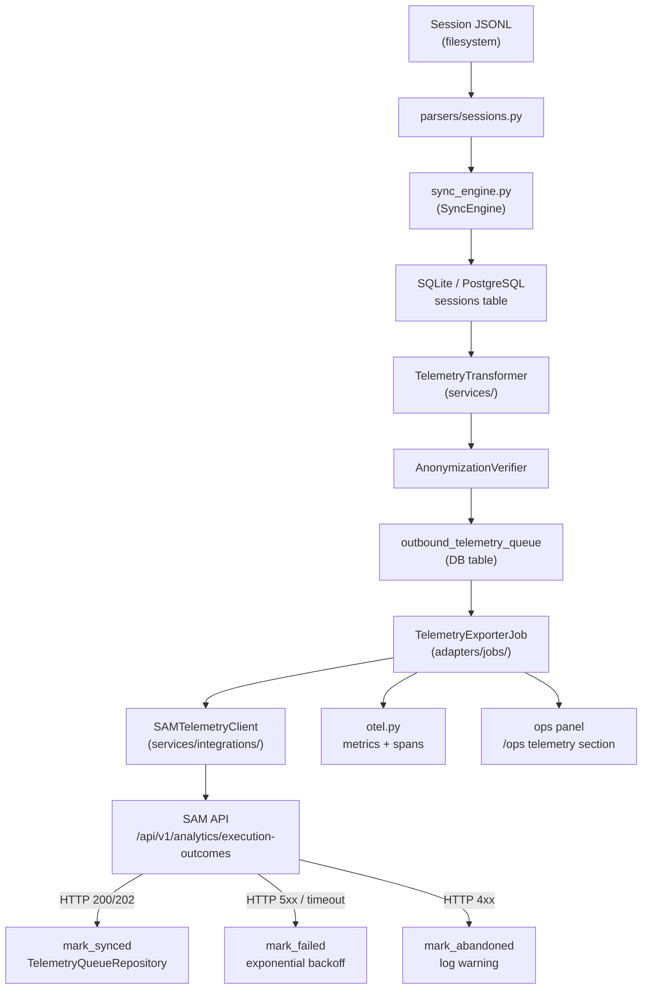

# PRD: CCDash Closed-Loop Telemetry Exporter

## Executive summary

CCDash serves as the local intelligence layer for AI-assisted software development. It parses Claude Code session JSONL logs, attributes token costs to features and tasks, scores test-health signals, computes workflow effectiveness rollups, and correlates execution outcomes with SkillMeat-recommended stacks. All of that data lives entirely within the local or project-isolated SQLite database.

The result is a closed observability loop that terminates at the team level. The enterprise platform — SkillMeat Artifact Manager (SAM) — recommends workflows and stacks but receives no signal about whether those recommendations work in practice. Teams that run CCDash accumulate direct evidence of stack effectiveness, model performance, rework rates, and context utilization patterns, but none of that flows back upstream.

This PRD defines the **CCDash Closed-Loop Telemetry Exporter**: a background worker, transformation pipeline, persistent outbound queue, and operator UI that push anonymized, aggregated execution-outcome telemetry to SAM on a configurable schedule. The exporter closes the feedback loop between local project execution and the enterprise AI tooling platform, enabling SAM to refine recommendations using real outcome data rather than static configuration. CCDash becomes not just a local forensic dashboard but a live sensor in the enterprise AI observability network.

## Current state

CCDash captures and stores the following telemetry locally today:

| Signal | Source | Storage |
|--------|--------|---------|
| Session token counts (input, output, cache) | `backend/parsers/sessions.py` | `sessions` table |
| Per-session cost estimates in USD | `backend/parsers/sessions.py` | `sessions` table |
| Tool call inventory with outcomes | Session JSONL parsing | `sessions` table (JSON blob) |
| Session duration and message counts | Session JSONL parsing | `sessions` table |
| Feature/task attribution | `backend/db/sync_engine.py` linking | `entity_links` table |
| Workflow effectiveness rollups | `backend/services/workflow_effectiveness.py` | Analytics snapshots |
| Test integrity signals | `backend/parsers/sessions.py` | `sessions` table |
| Context utilization peak | Session JSONL parsing | `sessions` table |
| Model identity and family | `backend/model_identity.py` | `sessions` table |

The existing `backend/observability/otel.py` module already instruments ingestion latency, token counts, cost totals, and tool call outcomes for internal OTel/Prometheus consumption. The `backend/routers/analytics.py` router exposes this data through endpoints that return `WorkflowEffectivenessResponse` and `SessionUsageAggregateResponse` shapes.

The gap is outbound: no mechanism exists to push any of this telemetry to SAM. There is no outbound queue, no HTTP client for the SAM ingestion API, no anonymization pipeline, and no operator control for enabling or monitoring the export.

## Problem statement

As a platform engineer or enterprise AI ops administrator, I need CCDash to push anonymized workflow execution outcomes to SAM so that the enterprise can track which recommended stacks and workflows actually succeed or fail in practice. Today, CCDash accumulates this evidence silently, SAM has no visibility into it, and the organization cannot close the AI ROI feedback loop without manual reporting.

As a team lead, I need confidence that only aggregated, anonymized metrics leave the local environment. Source code, raw prompt text, file paths, and raw error strings must never appear in outbound payloads.

As a platform operator, I need to be able to enable, disable, and monitor the telemetry exporter from the CCDash operations panel, with visibility into queue depth, last successful push, and any HTTP errors.

## Goals

1. Implement a persistent, asynchronous outbound telemetry queue backed by the existing SQLite or PostgreSQL database.
2. Build a background `TelemetryExporterJob` that runs under the existing `worker` runtime profile (established in the Deployment Runtime Modularization PRD) without blocking the API process.
3. Define a strict anonymization pipeline that transforms local CCDash models into SAM's `execution-outcomes` payload contract, stripping all sensitive fields before transmission.
4. Deliver retry logic with exponential backoff so that transient SAM outages do not result in permanent data loss.
5. Provide opt-in/opt-out configuration through both environment variables and a UI toggle in `Settings > Integrations > SkillMeat`.
6. Surface exporter health (queue depth, last push timestamp, error counts) in the existing operations panel (`/ops`).
7. Integrate exporter self-monitoring into the existing `backend/observability/otel.py` instrumentation so that export activity appears in OTel traces and Prometheus metrics.

## Non-goals / out of scope

The following are explicitly not covered by this PRD:

1. Bidirectional sync: SAM pushing updates back to CCDash as a result of ingested telemetry is out of scope for V1.
2. Real-time streaming: this PRD covers scheduled batch export only. WebSocket or SSE-based streaming to SAM is not in scope.
3. SAM ingestion API design: this PRD assumes the SAM `/api/v1/analytics/execution-outcomes` endpoint exists and documents only the CCDash-side payload contract.
4. Cross-project telemetry aggregation: the exporter operates per-project; cross-project rollup is a SAM-side concern.
5. Raw session transcript export: individual session JSONL content must never be exported. Only derived metrics and identifiers are in scope.
6. Telemetry ingestion from other tools: the exporter sends CCDash-derived data only. It does not aggregate data from external CI or IDE plugins.

## User personas

### Enterprise ops admin

Responsible for the SAM deployment and AI tooling budget. Needs to see workflow effectiveness evidence aggregated from many teams and environments. Cannot access individual team codebases or local CCDash instances. Depends on SAM receiving reliable telemetry from field deployments to inform stack recommendations and report AI ROI to leadership.

### Platform engineer

Deploys and operates CCDash alongside the team's development infrastructure. Needs full control over whether telemetry export is enabled, which SAM endpoint is targeted, and how the exporter behaves under network instability. Needs observability into export health without grepping log files.

### AI team lead

Uses CCDash daily to understand which workflows their team runs, how they perform, and what rework patterns emerge. Needs assurance that enabling telemetry export does not expose sensitive project content. Wants to see confirmation that export is active and data is flowing.

## Functional requirements

### Group 1: Export worker

| ID | Requirement | Priority |
|----|-------------|----------|
| FR-1.1 | Introduce a `TelemetryExporterJob` class in `backend/adapters/jobs/` that implements the existing job interface compatible with `InProcessJobScheduler` and `RuntimeJobAdapter`. | Must |
| FR-1.2 | The job must run on a configurable interval (default 900 seconds, matching `ANALYTICS_SNAPSHOT_INTERVAL_SECONDS`). The interval must be overridable via `CCDASH_TELEMETRY_EXPORT_INTERVAL_SECONDS`. | Must |
| FR-1.3 | The job must also trigger on explicit lifecycle events: when a Feature transitions to `done` status and when a workflow execution session is finalized in the sync engine. Domain events from `backend/application/live_updates/domain_events.py` should be the preferred mechanism. | Should |
| FR-1.4 | The exporter must read unsynced rows from the `outbound_telemetry_queue` table in batches. Batch size must be configurable via `CCDASH_TELEMETRY_EXPORT_BATCH_SIZE` (default 50). | Must |
| FR-1.5 | The job must run exclusively under the `worker` runtime profile. It must not run when the API-only runtime profile is active. The `RuntimeContainer` in `backend/runtime/container.py` must enforce this. | Must |
| FR-1.6 | The job must be safely re-entrant: if a previous batch push is still in progress when the next interval fires, the new run must skip rather than start a parallel push. | Must |

### Group 2: Outbound telemetry queue

| ID | Requirement | Priority |
|----|-------------|----------|
| FR-2.1 | Add an `outbound_telemetry_queue` table to the DB schema via the existing migration runner in `backend/db/migrations.py`. Schema: `id` (UUID), `session_id` (UUID), `project_slug` (text), `payload_json` (text), `status` (enum: `pending`, `synced`, `failed`, `abandoned`), `created_at`, `last_attempt_at`, `attempt_count` (int), `last_error` (text nullable). | Must |
| FR-2.2 | Add a `TelemetryQueueRepository` in `backend/db/repositories/` following the existing repository base pattern. It must support: enqueue, fetch-pending-batch, mark-synced, mark-failed, and purge-old-synced. | Must |
| FR-2.3 | The enqueue operation must be idempotent with respect to `session_id`: re-queuing a session that already has a `pending` or `synced` row must be a no-op. | Must |
| FR-2.4 | Failed rows must be retried with exponential backoff. Base backoff: 60 seconds, maximum backoff: 4 hours, maximum attempt count: 10. Rows that exceed `attempt_count` must transition to `abandoned` and emit a warning log with the session UUID. | Must |
| FR-2.5 | Synced rows older than 30 days must be purged by the job on each run to prevent unbounded queue growth. The retention window must be configurable via `CCDASH_TELEMETRY_QUEUE_RETENTION_DAYS`. | Should |

### Group 3: Data transformation and anonymization

| ID | Requirement | Priority |
|----|-------------|----------|
| FR-3.1 | Introduce a `TelemetryTransformer` service in `backend/services/` that maps CCDash session and analytics models to the `ExecutionOutcomePayload` DTO defined in this PRD's data contract section. | Must |
| FR-3.2 | The transformer must strip all of the following before writing to the queue: absolute file paths, raw prompt content, raw error strings, usernames, hostnames, and any field that is not a UUID, slug, enum value, integer count, float metric, or ISO 8601 timestamp. | Must |
| FR-3.3 | Project identity must be represented as `project_slug` only. The slug must be the project's configured identifier. If no slug is configured, a stable SHA-256 hash of the project root path must be used and stored as the slug, with the original path never written to the queue. | Must |
| FR-3.4 | Model identity must use the canonical family name returned by `backend/model_identity.py`'s `model_family_name()` function (e.g., `claude-3-5`, `gpt-4o`) rather than the raw model string from the session. | Must |
| FR-3.5 | The transformer must produce a `test_pass_rate` field only when test integrity signals are present in the session. When signals are absent, the field must be omitted rather than set to null or zero. | Should |
| FR-3.6 | A unit-testable `AnonymizationVerifier` must be implemented that accepts a payload dict and raises if any value matches a blocklist of sensitive field names or a regex for absolute paths or email-shaped strings. This verifier must run before every enqueue operation. | Must |

### Group 4: HTTP client and SAM push

| ID | Requirement | Priority |
|----|-------------|----------|
| FR-4.1 | Implement a `SAMTelemetryClient` in `backend/services/integrations/` or `backend/adapters/` that wraps `aiohttp` (already available via the existing SkillMeat integration) for posting batch payloads to SAM. | Must |
| FR-4.2 | The client must POST to `{CCDASH_SAM_ENDPOINT}/api/v1/analytics/execution-outcomes` with a JSON body of shape `{"schema_version": "1", "events": [...]}`. | Must |
| FR-4.3 | Authentication must use `Authorization: Bearer {CCDASH_SAM_API_KEY}`. If the key is absent or the connection is unauthenticated, the exporter must halt and log a structured warning. It must not queue items or attempt pushes while unconfigured. | Must |
| FR-4.4 | The client must treat HTTP 200 and 202 responses as success. HTTP 429 must trigger immediate backoff. HTTP 4xx (except 429) must mark the batch as `abandoned` after logging. HTTP 5xx must mark the batch as `failed` for retry. Network-level errors (timeout, connection refused) must also mark as `failed` for retry. | Must |
| FR-4.5 | The client must enforce a request timeout of 30 seconds (configurable via `CCDASH_TELEMETRY_EXPORT_TIMEOUT_SECONDS`). | Must |

### Group 5: UI and configuration

| ID | Requirement | Priority |
|----|-------------|----------|
| FR-5.1 | Add an "Enable Enterprise Telemetry Export" toggle to `Settings > Integrations > SkillMeat`. The toggle must be disabled and grayed out when `CCDASH_SAM_ENDPOINT` or `CCDASH_SAM_API_KEY` are not configured. | Must |
| FR-5.2 | The settings panel must show the configured SAM endpoint URL (masked beyond the hostname) and the last-verified connection status. | Must |
| FR-5.3 | Update the operations panel (`/ops`) to include a "Telemetry Export" section showing: current queue depth by status (pending, failed, abandoned), last successful push timestamp, total events pushed in the last 24 hours, and the most recent HTTP error message if any. | Must |
| FR-5.4 | The ops panel section must include a "Push Now" action that triggers an immediate export batch outside the scheduled interval. The action must be disabled if the exporter is not configured or not enabled. | Should |
| FR-5.5 | If `CCDASH_TELEMETRY_EXPORT_ENABLED` is set to `false` via environment variable, the UI toggle must reflect the disabled state and must not allow the user to re-enable via UI alone. The UI must display a hint that the setting is controlled by environment configuration. | Must |

### Group 6: Observability and self-monitoring

| ID | Requirement | Priority |
|----|-------------|----------|
| FR-6.1 | Extend `backend/observability/otel.py` with new counters and histograms: `ccdash_telemetry_export_events_total` (labels: `status`, `project`), `ccdash_telemetry_export_latency_ms` (labels: `project`), `ccdash_telemetry_export_queue_depth` (gauge, labels: `status`, `project`), and `ccdash_telemetry_export_errors_total` (labels: `error_type`, `project`). | Must |
| FR-6.2 | Each export batch must be wrapped in an OTel span named `telemetry.export.batch` with attributes: `batch_size`, `project_slug`, `sam_endpoint_host`, and `outcome` (success/retry/abandon). | Should |
| FR-6.3 | The `TelemetryExporterJob` must emit a structured log entry at INFO level on each run with fields: `run_id` (UUID), `batch_size`, `duration_ms`, `outcome`, and `queue_depth_remaining`. | Must |
| FR-6.4 | When the exporter is disabled via config, the worker profile must still record a `ccdash_telemetry_export_disabled` gauge with value 1 so that alerting dashboards can detect unconfigured deployments. | Should |

## Non-functional requirements

### Performance

- The `TelemetryExporterJob` must consume less than 2% of background worker CPU when processing a 50-event batch at the default interval.
- The database enqueue operation must complete in under 50 milliseconds for a single session record on the default SQLite backend.
- The total serialized size of a single `ExecutionOutcomePayload` must not exceed 4 KB. The transformer must truncate or omit optional fields to meet this constraint if necessary.
- Batch pushes to SAM must complete within 30 seconds under normal network conditions.

### Security and privacy

- The `AnonymizationVerifier` must run synchronously before every enqueue operation and must not allow bypass.
- The `CCDASH_SAM_API_KEY` value must never appear in log output, OTel span attributes, or the ops panel UI. Only the first 8 characters may be shown for identification purposes.
- TLS must be enforced for all outbound SAM connections. The HTTP client must reject plaintext `http://` SAM endpoints unless `CCDASH_TELEMETRY_ALLOW_INSECURE=true` is explicitly set (development use only).
- The `outbound_telemetry_queue` table must store only the already-anonymized payload JSON. Raw session data must never be written to the queue.

### Reliability

- The exporter must survive worker process restarts without data loss. Pending queue rows written before a crash must be picked up and retried on the next worker start.
- The exporter must degrade gracefully when SAM is unreachable: it must accumulate pending queue rows locally and resume pushing when connectivity is restored, without operator intervention.
- Queue growth must be bounded: once `outbound_telemetry_queue` contains more than `CCDASH_TELEMETRY_EXPORT_MAX_QUEUE_SIZE` pending rows (default 10,000), new enqueue operations must be dropped with a warning rather than causing unbounded DB growth.

### Scalability

- The exporter design must support a PostgreSQL backend without code changes. The `TelemetryQueueRepository` must use only SQL constructs portable across both SQLite and PostgreSQL dialects already used in the codebase.
- Batch size and export interval must be independently tunable to accommodate both low-throughput local instances and high-throughput shared deployments.

## Architecture and data flow



### Component responsibilities

**`backend/parsers/sessions.py` and `backend/db/sync_engine.py` (existing)**
These components parse JSONL session files and persist structured session records. The sync engine's session-finalization event is the primary trigger for enqueuing new telemetry events. No changes to parsing logic are required.

**`TelemetryTransformer` (new, `backend/services/telemetry_transformer.py`)**
Accepts a session row (or a batch of rows) from the `sessions` table and the linked analytics metadata. Produces one `ExecutionOutcomePayload` per session. Calls the `AnonymizationVerifier` before returning. Relies on `model_family_name()` from `backend/model_identity.py` for normalized model identity.

**`AnonymizationVerifier` (new, `backend/services/telemetry_transformer.py` or separate module)**
A stateless validator that inspects every field of a candidate payload for sensitive content. Raises `AnonymizationError` if any violation is detected. Implemented as a pure function to be unit-testable without DB or network dependencies.

**`TelemetryQueueRepository` (new, `backend/db/repositories/telemetry_queue.py`)**
Follows the existing `base.py` repository pattern. Uses the async SQLite connection from `backend/db/connection.py`. Provides coroutines: `enqueue`, `fetch_pending_batch`, `mark_synced`, `mark_failed`, `mark_abandoned`, `get_queue_stats`, and `purge_old_synced`.

**`TelemetryExporterJob` (new, `backend/adapters/jobs/telemetry_exporter.py`)**
Implements the scheduled job interface. On each tick: fetches a pending batch from the queue, calls `SAMTelemetryClient.push_batch()`, then updates row statuses. Enforces re-entrancy guard. Records OTel spans and Prometheus metrics via `backend/observability/otel.py`.

**`SAMTelemetryClient` (new, `backend/services/integrations/sam_telemetry_client.py`)**
Wraps the HTTP push to SAM. Validates configuration at construction time. Handles HTTP response codes per FR-4.4. Enforces TLS and timeout constraints.

**`RuntimeContainer` (`backend/runtime/container.py`, modified)**
Registers `TelemetryExporterJob` in the worker profile only. The job must not be instantiated or scheduled in the API-only or local-only profiles unless explicitly opted in via configuration.

## Data contract

The following JSON schema defines the `ExecutionOutcomePayload` that CCDash posts to SAM. Each element in the `events` array conforms to this shape.

```json
{
  "schema_version": "1",
  "events": [
    {
      "event_id": "550e8400-e29b-41d4-a716-446655440000",
      "project_slug": "my-team-platform",
      "session_id": "7d793037-a076-4bf0-8c35-df6b5f67fe73",
      "workflow_type": "feature-implementation",
      "model_family": "claude-3-5",
      "token_input": 48200,
      "token_output": 12800,
      "token_cache_read": 6400,
      "token_cache_write": 3200,
      "cost_usd": 0.42,
      "tool_call_count": 37,
      "tool_call_success_count": 34,
      "duration_seconds": 1842,
      "message_count": 22,
      "outcome_status": "completed",
      "test_pass_rate": 0.91,
      "context_utilization_peak": 0.78,
      "feature_slug": "auth-token-refresh",
      "timestamp": "2026-03-24T14:32:10Z",
      "ccdash_version": "0.9.0"
    }
  ]
}
```

### Field definitions

| Field | Type | Required | Source | Notes |
|-------|------|----------|--------|-------|
| `event_id` | UUID string | Yes | Generated at enqueue time | Stable per queue row; used for SAM-side deduplication |
| `project_slug` | string | Yes | Project config or path hash | Never an absolute path |
| `session_id` | UUID string | Yes | `sessions.id` | CCDash session UUID; never a filesystem path |
| `workflow_type` | string | No | Derived workflow family | Omitted if no workflow correlation exists |
| `model_family` | string | Yes | `model_family_name()` | Canonical family string, not the full model ID |
| `token_input` | integer | Yes | `sessions.token_input` | Raw count |
| `token_output` | integer | Yes | `sessions.token_output` | Raw count |
| `token_cache_read` | integer | No | `sessions.token_cache_read` | Omitted if zero or absent |
| `token_cache_write` | integer | No | `sessions.token_cache_write` | Omitted if zero or absent |
| `cost_usd` | float | Yes | Computed cost estimate | Rounded to 4 decimal places |
| `tool_call_count` | integer | Yes | Tool call inventory count | |
| `tool_call_success_count` | integer | No | Tool call inventory | Omitted if not available |
| `duration_seconds` | integer | Yes | Session wall-clock duration | |
| `message_count` | integer | Yes | `sessions.message_count` | |
| `outcome_status` | enum | Yes | Derived from session state | Values: `completed`, `interrupted`, `errored` |
| `test_pass_rate` | float | No | Test integrity signals | Range 0.0–1.0; omitted if no test signals |
| `context_utilization_peak` | float | No | Context window usage peak | Range 0.0–1.0; omitted if not measured |
| `feature_slug` | string | No | Linked feature identifier | Omitted if no feature link |
| `timestamp` | ISO 8601 | Yes | Session completion time | UTC |
| `ccdash_version` | string | Yes | Application version constant | From `backend/constants.py` or equivalent |

Fields that are absent or zero-value for optional fields must be omitted from the payload rather than included as `null`. The SAM ingestion endpoint must treat missing optional fields as absent, not as zero.

## Configuration

The following environment variables govern the telemetry exporter. All follow the existing `CCDASH_*` naming convention and use the `_env_bool` / `_env_int` / `os.getenv` helpers in `backend/config.py`.

| Variable | Type | Default | Description |
|----------|------|---------|-------------|
| `CCDASH_TELEMETRY_EXPORT_ENABLED` | bool | `false` | Master switch. Must be explicitly set to `true` to activate the exporter. Defaults to off for safety. |
| `CCDASH_SAM_ENDPOINT` | string | `""` | Base URL of the SAM API (e.g., `https://sam.internal`). Required when export is enabled. |
| `CCDASH_SAM_API_KEY` | string | `""` | Bearer token for SAM API authentication. Required when export is enabled. |
| `CCDASH_TELEMETRY_EXPORT_INTERVAL_SECONDS` | int | `900` | How often the export job runs. Minimum enforced value: 60 seconds. |
| `CCDASH_TELEMETRY_EXPORT_BATCH_SIZE` | int | `50` | Number of queue rows processed per export run. Range: 1–500. |
| `CCDASH_TELEMETRY_EXPORT_TIMEOUT_SECONDS` | int | `30` | HTTP request timeout for SAM push calls. |
| `CCDASH_TELEMETRY_EXPORT_MAX_QUEUE_SIZE` | int | `10000` | Maximum pending rows in the queue before new enqueues are dropped. |
| `CCDASH_TELEMETRY_QUEUE_RETENTION_DAYS` | int | `30` | Days to retain `synced` rows before purging. |
| `CCDASH_TELEMETRY_ALLOW_INSECURE` | bool | `false` | Allow plaintext HTTP SAM endpoints. For development use only. |

These variables must be added to `backend/config.py` alongside the existing feature flag block and documented in `.env.example`.

## Dependencies

### Internal dependencies

| Dependency | Nature | Notes |
|------------|--------|-------|
| Deployment Runtime Modularization PRD (`deployment-runtime-modularization-v1.md`) | Prerequisite (must ship first) | Provides the `worker` runtime profile and `RuntimeContainer` that the exporter job runs under. |
| Hexagonal Foundation PRD (`ccdash-hexagonal-foundation-v1.md`) | Prerequisite | Provides the job port/adapter interfaces and composition root patterns used to register `TelemetryExporterJob`. |
| `backend/db/connection.py` | Existing | Async DB connection singleton. The queue repository uses this directly. |
| `backend/db/migrations.py` | Existing (extended) | Must add `outbound_telemetry_queue` table migration. |
| `backend/adapters/jobs/` | Existing (extended) | `TelemetryExporterJob` follows the `InProcessJobScheduler` / `RuntimeJobAdapter` patterns. |
| `backend/observability/otel.py` | Existing (extended) | New metric names added for export instrumentation. |
| `backend/model_identity.py` | Existing | `model_family_name()` is used by the transformer for canonical model representation. |
| `backend/application/live_updates/domain_events.py` | Existing | Session-finalized and feature-done events used as optional push triggers. |

### External dependencies

| Dependency | Nature | Notes |
|------------|--------|-------|
| SAM ingestion API | External (required when enabled) | Must expose `POST /api/v1/analytics/execution-outcomes`. CCDash does not define this API; it is a SAM-side concern. |
| `aiohttp` | Python package | Already present in the project for SkillMeat integration HTTP calls. Used by `SAMTelemetryClient`. |

## Risks and mitigations

| Risk | Impact | Likelihood | Mitigation |
|------|--------|------------|------------|
| Anonymization pipeline has a blind spot and leaks a sensitive field | High | Low | Implement the `AnonymizationVerifier` as a blocklist-plus-regex guard that runs before every enqueue. Add property-based tests that generate adversarial payloads. Conduct an explicit field-by-field audit before the first production push. |
| SAM API contract changes without notice, breaking export silently | Medium | Medium | Pin the schema version field (`schema_version: "1"`) in payloads. Log the response body on non-200 for debugging. Add a canary export test mode that posts a single synthetic event and reports the result in the ops panel. |
| Queue grows unboundedly during extended SAM outages | High | Low | Enforce the `CCDASH_TELEMETRY_EXPORT_MAX_QUEUE_SIZE` cap with drop-and-warn behavior. Expose queue depth prominently in the ops panel with a warning threshold alert. |
| Exporter job consumes excessive DB I/O on SQLite under high session volume | Medium | Medium | Use indexed `status` and `created_at` columns on the queue table. Process in bounded batches. Run queue maintenance (purge) at off-peak times relative to the sync engine schedule. |
| Platform engineers disable the exporter but ops admin assumes it is running | Medium | Low | Surface exporter-disabled state explicitly in the ops panel with a visible banner. Emit the `ccdash_telemetry_export_disabled` Prometheus gauge so alerting dashboards can detect it. |
| Worker profile restarts mid-batch, leaving rows in an ambiguous state | Low | Medium | Use a two-phase update: claim rows by setting `last_attempt_at` before pushing, then mark synced or failed after. A restarted worker will re-claim rows where `last_attempt_at` is old relative to the export interval. |

## Success metrics

| Metric | Baseline | Target |
|--------|----------|--------|
| Delivery rate (events reaching SAM within 1 hour of session completion) | 0% (no export exists) | >= 99.5% |
| Queue-to-delivery latency (p95) | N/A | <= 20 minutes under normal conditions |
| Exporter CPU overhead (background worker) | N/A | < 2% per export cycle |
| Anonymization violations in production payloads | N/A | 0 |
| Operator time to diagnose an export failure | Manual log search | < 2 minutes via ops panel |
| SAM-side data freshness (time since last CCDash push) | N/A | Visible staleness warning if > 2 export intervals pass without a successful push |
| Abandoned events (exceeded retry limit) | N/A | < 0.1% of total enqueued events per week |

## User stories

| ID | Story | Acceptance criteria |
|----|-------|---------------------|
| US-1 | As a platform engineer, I can enable telemetry export by setting `CCDASH_TELEMETRY_EXPORT_ENABLED=true`, `CCDASH_SAM_ENDPOINT`, and `CCDASH_SAM_API_KEY`, then confirming the ops panel shows the exporter as active and the first batch is pushed within one export interval. | Ops panel shows "active" status; first push succeeds; SAM receives at least one event. |
| US-2 | As a platform engineer, I can view the current queue depth (pending, failed, abandoned), last successful push timestamp, and most recent error in the `/ops` panel without accessing log files or the database directly. | Ops panel telemetry section renders all four fields. Values update after each export cycle. |
| US-3 | As a platform engineer, I can trigger an immediate export batch from the ops panel without waiting for the next scheduled interval. | "Push Now" button is enabled when exporter is configured. Clicking it initiates a batch export and refreshes queue stats within 5 seconds. |
| US-4 | As a team lead, I can verify that no source code, file paths, or prompt text appear in the outbound payloads by inspecting the queue table or enabling debug-level logging, and I see only UUIDs, slugs, token counts, and derived metric scores. | `AnonymizationVerifier` is documented. A verification mode or test endpoint confirms payload shape. Debug log output contains only anonymized fields. |
| US-5 | As an enterprise ops admin, I can see in SAM that a CCDash instance has been pushing telemetry, including the project slug, model family, workflow types observed, and aggregate effectiveness scores, without any identifiable developer information in the payload. | SAM ingestion API receives valid `execution-outcomes` payloads. No PII-shaped fields appear in any event. |
| US-6 | As a platform engineer, I can disable telemetry export entirely by setting `CCDASH_TELEMETRY_EXPORT_ENABLED=false`, and the UI toggle reflects the disabled state with a hint that the setting is environment-controlled, preventing accidental re-enablement from the settings panel. | UI toggle is visually disabled. Tooltip explains env-var control. No export batches run. |
| US-7 | As a platform engineer, when SAM is unreachable for several hours, the queue accumulates pending events locally and automatically resumes pushing when SAM becomes reachable, without manual intervention or data loss (up to the max queue size cap). | After simulated SAM outage and recovery, pending rows transition to `synced`. No manual queue reset is needed. |
| US-8 | As an AI team lead, I can toggle "Enable Enterprise Telemetry Export" in `Settings > Integrations > SkillMeat` when the SAM endpoint and API key are already configured via environment variables, and the change takes effect on the next export cycle. | Toggle state persists. Ops panel reflects enabled/disabled on next cycle. No restart required. |

## Phasing suggestion

### Phase 1: Foundation — queue and models (week 1)

Deliverables:
- DB migration for `outbound_telemetry_queue` table with indexes on `status` and `created_at`.
- `TelemetryQueueRepository` with full CRUD operations and a test suite covering enqueue idempotency, batch fetch, and status transitions.
- `ExecutionOutcomePayload` Pydantic model matching the data contract above.
- `TelemetryTransformer` service with field mapping from `sessions` table rows.
- `AnonymizationVerifier` with unit tests covering common sensitive-field patterns.
- New config variables in `backend/config.py` and `.env.example`.

Exit criteria: a session row can be transformed and enqueued without touching the network; the anonymization verifier rejects a payload containing an absolute path.

### Phase 2: Export worker and HTTP client (weeks 1-2)

Deliverables:
- `SAMTelemetryClient` with configurable endpoint, API key, timeout, TLS enforcement, and response-code handling.
- `TelemetryExporterJob` implementing the scheduled job interface, with batch fetch, push, and status-update cycle.
- Re-entrancy guard and exponential backoff for failed rows.
- Worker-profile registration in `RuntimeContainer`.
- Integration test using a mock SAM HTTP server validating push, retry, and abandon paths.

Exit criteria: the worker runtime pushes a batch to a mock SAM endpoint, retries on 5xx, and abandons on 4xx after logging.

### Phase 3: UI controls and ops panel (week 2-3)

Deliverables:
- "Enable Enterprise Telemetry Export" toggle in `Settings > Integrations > SkillMeat`, gated on SAM endpoint/key presence.
- Env-var override lock behavior in the settings UI.
- Telemetry Export section in the `/ops` page showing queue depth by status, last push timestamp, 24-hour event count, and most recent error.
- "Push Now" action in the ops panel.

Exit criteria: an operator can enable the exporter, see queue stats, and trigger an immediate push from the UI without touching config files.

### Phase 4: Hardening — retry, backpressure, and monitoring (week 3-4)

Deliverables:
- Queue-size cap enforcement with drop-and-warn behavior.
- Synced-row purge on configurable retention window.
- New OTel counters and histograms wired into `backend/observability/otel.py`.
- OTel span wrapping each export batch.
- Prometheus gauge for exporter-disabled state.
- Load test demonstrating the exporter meets the < 2% CPU overhead NFR at 50-event batches.
- End-to-end documentation in `docs/` covering configuration, ops panel usage, and troubleshooting.

Exit criteria: all success metrics are measurable; the ops panel shows staleness warnings; all NFRs are verified by automated or manual testing.

## Assumptions and open questions

### Assumptions

1. The SAM `/api/v1/analytics/execution-outcomes` ingestion endpoint exists and accepts the payload schema described in this PRD. Any deviation in the SAM-side contract requires a schema negotiation before Phase 2 begins.
2. `aiohttp` is already available in the project's Python environment through the existing SkillMeat integration. If not, it must be added to `backend/requirements.txt` in Phase 1.
3. The `worker` runtime profile defined in the Deployment Runtime Modularization PRD is deployed before this exporter ships to production. Local-only deployments that do not run a separate worker process will not receive telemetry export capability.
4. A `project_slug` field is already configured or derivable for all projects that will use the exporter.

### Open questions

1. Should the exporter operate at the per-project level (one queue per project) or at the instance level (shared queue across all active projects)? A shared queue simplifies the worker job but complicates per-project enable/disable controls.
2. Does SAM require a signed or HMAC-verified payload in addition to the bearer token? If so, a signing step must be added to `SAMTelemetryClient` before Phase 2 ships.
3. What is the maximum accepted payload size per POST request on the SAM ingestion endpoint? This determines whether the default batch size of 50 events is safe or needs to be reduced.

## Acceptance criteria

1. CCDash exports anonymized session execution telemetry to SAM when `CCDASH_TELEMETRY_EXPORT_ENABLED=true` and valid SAM credentials are configured.
2. The `AnonymizationVerifier` prevents any absolute paths, raw prompt content, usernames, or hostnames from being written to the outbound queue.
3. Failed export batches are retried with exponential backoff and transition to `abandoned` after 10 attempts, without blocking subsequent batches.
4. The ops panel displays queue depth, last push timestamp, and most recent error without requiring log file access.
5. The exporter runs exclusively under the `worker` runtime profile and does not start or block the API process.
6. All six new Prometheus metrics emit correctly and appear in the existing metrics endpoint.
7. Disabling the exporter via `CCDASH_TELEMETRY_EXPORT_ENABLED=false` stops all export activity immediately and reflects the disabled state in the settings UI.
8. The feature ships with unit tests for the transformer, anonymization verifier, queue repository, and HTTP client; and an integration test covering the full enqueue-push-sync cycle against a mock SAM server.
