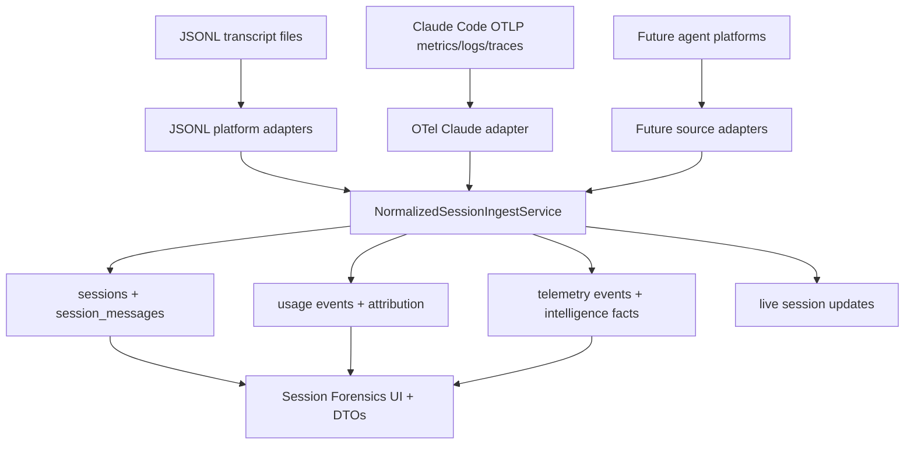

# PRD: OTel Session Metrics Ingestion V1

## Executive Summary

Claude Code now exports session-level usage, cost, tool, command, hook, skill, compaction, and trace telemetry through OpenTelemetry. As of Claude Code 2.1.126 on 2026-05-01, the current surface includes metrics such as `claude_code.session.count`, `claude_code.token.usage`, `claude_code.cost.usage`, `claude_code.lines_of_code.count`, `claude_code.code_edit_tool.decision`, and `claude_code.active_time.total`; structured log events such as user prompts, tool results, API requests/errors, tool decisions, hooks, compaction, `at_mention`, and `skill_activated`; and beta traces with `claude_code.interaction`, `claude_code.llm_request`, and tool execution spans.

CCDash should support this as an inbound source for session forensics. The OTel data path must not bypass the existing session DTOs, canonical transcript storage, usage attribution, analytics, or live updates. Instead, CCDash should introduce a normalized session ingestion module that can accept multiple source adapters:

1. local JSONL transcript parser output,
2. Claude Code OTLP metrics/logs/traces,
3. future Codex or other agent platform telemetry,
4. future remote daemon or collector-backed ingestion.

V1 focuses on Claude Code OTel ingestion and the refactor needed to make this extensible.

## Current State

CCDash currently ingests agent sessions through local filesystem parsing:

1. `backend/parsers/sessions.py` delegates to `backend/parsers/platforms/registry.py`.
2. The registry detects `.jsonl` files and tries Codex first, then Claude Code.
3. `backend/db/sync_engine.py` discovers JSONL files under the project sessions path and calls `_sync_single_session()`.
4. `_sync_single_session()` parses a file into `AgentSession`, then performs all persistence and derived work inline: session upsert, canonical `session_messages`, legacy log fallback, tool/file/artifact tables, observability fields, usage attribution, telemetry events, commit correlations, intelligence facts, outbound telemetry queue, and live session events.
5. Read APIs and UI consume the same session DTOs and repositories regardless of source.

This gives CCDash a strong canonical forensics surface, but the persistence pipeline is coupled to local files. Adding OTel directly to routers or analytics would create a second ingestion path with inconsistent semantics.

## Claude Code OTel Research Baseline

Official Claude Code monitoring documentation describes OTel as opt-in via `CLAUDE_CODE_ENABLE_TELEMETRY=1` plus signal exporters such as `OTEL_METRICS_EXPORTER=otlp`, `OTEL_LOGS_EXPORTER=otlp`, and beta `OTEL_TRACES_EXPORTER=otlp`. OTLP can use gRPC or HTTP/protobuf endpoints. Metrics default to a 60 second export interval, logs to 5 seconds, and traces to 5 seconds.

Standard attributes include `session.id`, `app.version`, organization/account/user identifiers when available, `user.id`, `user.email`, and `terminal.type`. Cardinality switches include `OTEL_METRICS_INCLUDE_SESSION_ID`, `OTEL_METRICS_INCLUDE_VERSION`, and `OTEL_METRICS_INCLUDE_ACCOUNT_UUID`.

Privacy defaults matter. Prompt text, tool arguments, tool content, and raw API bodies are not all emitted by default. The most sensitive fields require explicit variables such as `OTEL_LOG_USER_PROMPTS=1`, `OTEL_LOG_TOOL_DETAILS=1`, `OTEL_LOG_TOOL_CONTENT=1`, or `OTEL_LOG_RAW_API_BODIES`.

Relevant recent release notes:

1. 2.1.126 added `claude_code.skill_activated` emission for user-typed slash commands and a new `invocation_trigger` attribute.
2. 2.1.122 added `claude_code.at_mention` log events and fixed numeric attributes on `api_request`/`api_error` log events.
3. 2.1.51 added synchronous account metadata environment variables for early telemetry events.
4. 2.1.49 fixed `tool_decision` emission in headless/SDK mode.

## Problem Statement

As a CCDash user, I want to ingest Claude Code OTel metrics and events so session usage, cost, tool behavior, skills, active time, and related signals can enrich the same session forensics views that currently depend on local JSONL transcript files.

As a platform engineer, I need this implemented through a modular ingestion architecture so future Codex, Bob Shell, SDK, hosted-agent, and collector-backed sources do not require new parallel write paths.

As a security-conscious operator, I need clear source provenance and privacy controls because OTel can be configured to include prompt text, tool inputs, and raw API bodies.

Root causes:

1. Current session persistence is embedded in file sync, not exposed as a reusable ingest service.
2. OTel telemetry is grouped by `session.id` and `prompt.id`, while CCDash canonical sessions are `AgentSession` documents with transcript rows and derived facts.
3. Metrics, logs, and traces have different completeness and timing semantics than JSONL transcripts.
4. CCDash has outbound OTel instrumentation and telemetry export, but no inbound OTLP receiver or telemetry-to-session normalizer.

## Goals

1. Add an inbound OTel ingestion module for Claude Code metrics, log events, and optional traces.
2. Refactor the current JSONL persistence block into a shared normalized session ingest service.
3. Preserve `AgentSession`, `SessionLog`, `session_messages`, usage attribution, session intelligence, analytics, and live update contracts as the downstream canonical surface.
4. Support OTel-only sessions, JSONL-only sessions, and merged sessions where both sources exist.
5. Capture source provenance, confidence, and freshness for every telemetry-derived field.
6. Establish a module boundary that future platform adapters can implement without touching routers, UI, or repository internals.

## Non-Goals

1. Replacing JSONL transcript forensics. OTel is additive and can be primary only where JSONL is unavailable.
2. Building a general-purpose observability backend. CCDash should ingest only the agent session telemetry needed for its forensics model.
3. Storing raw OTLP payloads indefinitely by default.
4. Requiring prompt/tool content OTel settings. V1 must work with structural telemetry only.
5. Fully reconstructing transcript text from metrics-only OTel data.
6. Supporting every OTel transport in V1. HTTP/protobuf is the preferred first receiver; gRPC can be collector-forwarded or added later.

## Functional Requirements

| ID | Requirement | Priority |
|----|-------------|----------|
| FR-1 | Introduce a normalized session ingestion service that persists `AgentSession`-compatible envelopes independent of source. | Must |
| FR-2 | Refactor `_sync_single_session()` so JSONL parsing calls the shared ingest service instead of owning all persistence inline. | Must |
| FR-3 | Add an OTel source adapter for Claude Code OTLP metrics and logs, with trace support behind a beta flag. | Must |
| FR-4 | Normalize Claude OTel metrics into session usage fields: session count/start type, token usage, cost usage, active time, lines changed, commits, PRs, and code edit decisions. | Must |
| FR-5 | Normalize Claude OTel log events into `SessionLog` and `sessionForensics` structures when event detail is available. | Must |
| FR-6 | Preserve `session.id`, `prompt.id`, event sequence, resource attributes, app version, terminal type, model, and user/account/org attributes in provenance metadata. | Must |
| FR-7 | Merge OTel-derived updates with JSONL-derived sessions by canonical session ID without deleting higher-fidelity JSONL transcript rows. | Must |
| FR-8 | Expose source provenance and confidence in `sessionForensics` and derived telemetry event payloads. | Must |
| FR-9 | Add project-level configuration for inbound OTel endpoints, accepted platforms, retention, and privacy policy. | Should |
| FR-10 | Support future adapters through an `IngestSourceAdapter` protocol and registry. | Must |
| FR-11 | Emit CCDash internal ingestion metrics labeled by source (`jsonl`, `otel`) and platform (`claude_code`, future values). | Must |
| FR-12 | Document Claude Code environment variable setup for sending telemetry to CCDash directly or through an OTel collector. | Must |

## Target Architecture

Core design decisions:

1. `AgentSession` remains the downstream canonical DTO.
2. OTel ingestion produces partial or complete `AgentSession` envelopes with source provenance.
3. JSONL and OTel sources are merged at the session-ingest layer, not in frontend code.
4. Raw OTel payload persistence is short-lived and optional; normalized session facts are durable.
5. Existing outbound `TelemetryTransformer` remains separate from inbound OTel normalization.

## Data Contract

### Normalized Session Envelope

V1 should introduce an internal envelope shape with:

| Field | Purpose |
|---|---|
| `project_id` | Target CCDash project |
| `source` | `jsonl`, `otel`, or future adapter key |
| `platform_type` | `claude_code`, `codex`, etc. |
| `source_identity` | File path, OTLP stream key, or collector source |
| `session_id` | Canonical `AgentSession.id` |
| `source_observed_at` | Ingest receive time or file mtime |
| `session` | `AgentSession` or partial session payload |
| `merge_policy` | `replace_source`, `patch_metrics`, `append_events`, or `upsert_complete` |
| `provenance` | Raw signal names, metric temporality, resource attrs, and confidence |

### Claude OTel Mapping

| OTel Signal | CCDash Target |
|---|---|
| `claude_code.session.count` | session lifecycle/start event, `sessionType`, start type metadata |
| `claude_code.token.usage` | `tokensIn`, `tokensOut`, cache fields when attributes provide type/family |
| `claude_code.cost.usage` | `reportedCostUsd`, `displayCostUsd`, cost provenance `reported` or `estimated` |
| `claude_code.active_time.total` | session forensics active-time summary by `user`/`cli` type |
| `claude_code.lines_of_code.count` | code churn facts and file update aggregate when no JSONL file rows exist |
| `claude_code.commit.count` / `pull_request.count` | impact history / artifact summary counts |
| `claude_code.code_edit_tool.decision` | tool decision summary and permission friction facts |
| `claude_code.user_prompt` | `SessionLog` user event if prompt logging is enabled; otherwise prompt-length metadata |
| `claude_code.tool_result` | tool log / tool usage aggregate; tool parameters only if configured |
| `claude_code.api_request` / `api_error` | model request telemetry events and error facts |
| `claude_code.skill_activated` | `skillsUsed`, command/skill attribution; include `invocation_trigger` |
| `claude_code.at_mention` | session forensics mention events and artifact/file linkage hints |
| `claude_code.compaction` | context management facts and timeline event |
| `claude_code.interaction` trace | optional turn timeline and latency waterfall |

## Merge Semantics

1. JSONL transcript rows have higher transcript fidelity than OTel metrics-only data.
2. OTel usage/cost metrics may improve totals when JSONL lacks reported fields.
3. OTel logs/events can append structural timeline events, but should not erase parser-derived logs.
4. Merge decisions must be deterministic and idempotent by source key.
5. Every merged field must preserve a provenance summary in `sessionForensics.otel`.
6. If `session.id` is disabled in metrics, logs/traces with `session.id` may still join; otherwise V1 stores aggregate OTel facts under an unlinked telemetry bucket and marks them unresolved.

## Privacy and Security Requirements

1. Default receiver policy rejects or redacts raw prompt text, raw API bodies, and tool content unless explicitly enabled.
2. OTel user email/account/org attributes must be treated as sensitive and configurable for storage, hashing, or redaction.
3. Raw OTLP request bodies should not be logged.
4. Any temporary raw payload retention must have a bounded TTL and be disabled by default.
5. The receiver must support a shared secret or bearer token for non-local deployments.
6. Documentation must warn that enabling `OTEL_LOG_RAW_API_BODIES` may export full conversation history.

## Success Metrics

| Metric | Baseline | Target |
|---|---|---|
| Claude Code OTel session visibility | Not supported | OTel-only session appears in `/sessions` with usage/cost/tool facts |
| Shared ingest reuse | File-only persistence inline | JSONL and OTel use one session-ingest service |
| JSONL regression | Current parser path | Existing session parser tests pass unchanged or with explicit source assertions |
| Merge correctness | N/A | Same session from JSONL + OTel dedupes and preserves higher-fidelity transcript rows |
| Ingest latency | N/A | OTel log event to session update p95 <= 10 seconds in local dev |
| Provenance | N/A | OTel-derived fields expose source/confidence metadata |

## Risks and Mitigations

| Risk | Mitigation |
|---|---|
| OTel metrics are delta or cumulative depending on backend/client config | Store temporality and source sequence; normalize idempotently by time window and source key |
| Missing `session.id` creates unjoinable metrics | Warn in setup docs; support unresolved aggregate bucket; prefer logs/traces for session joins |
| Refactor of `_sync_single_session()` could regress existing ingestion | Extract behind tests first; keep JSONL behavior identical before adding OTel |
| OTel payloads can contain sensitive content | Default-deny content fields; add redaction tests; document opt-in variables |
| Metrics-only sessions lack transcript richness | Represent as telemetry-enriched sessions with clear fidelity labels instead of synthetic transcript text |
| Claude OTel schema may change | Version adapter by platform and app version; preserve unknown attributes in bounded provenance |

## Acceptance Criteria

1. A local Claude Code session configured with OTel can send metrics/log events to CCDash and appear in the existing Session Forensics UI.
2. A JSONL-ingested session and OTel-ingested data with the same `session.id` merge into one session record.
3. Existing `/api/sessions`, `/api/v1/sessions`, analytics, and planning session board consumers keep using current DTOs.
4. The JSONL parser registry still supports Claude Code and Codex.
5. Unit tests cover OTel metric mapping, log event mapping, merge semantics, privacy redaction, and JSONL regression.
6. Operator docs include Claude Code environment variable examples and collector forwarding examples.

