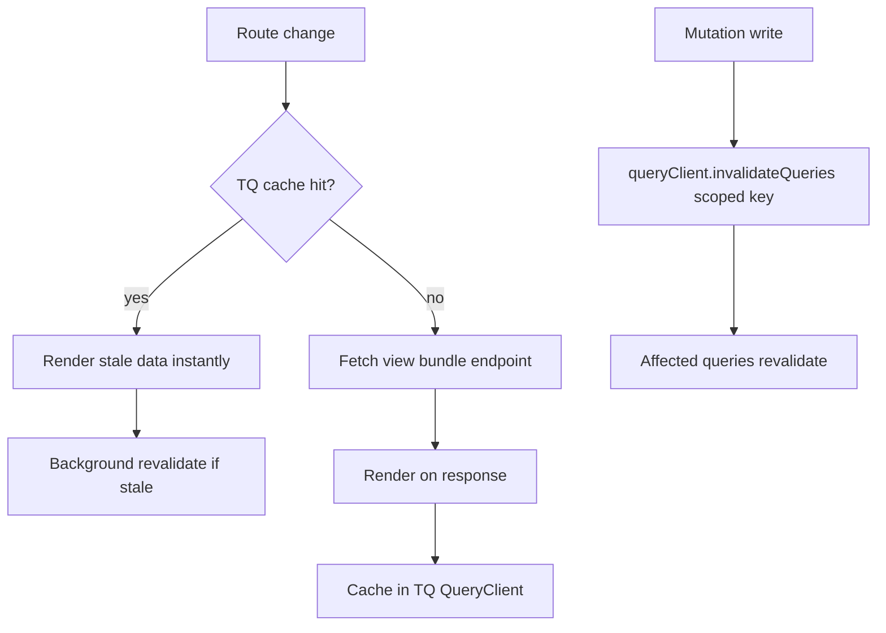

# Feature Brief & Metadata

**Feature Name:**

> CCDash Frontend Data Layer Refactor — TanStack Query migration, eager-load removal, cache consolidation, backend bundle endpoints, and virtualization hardening

**Filepath Name:**

> `ccdash-frontend-data-layer-refactor-v1`

**Date:**

> 2026-05-28

**Author:**

> Claude (Sonnet 4.6) — PRD Writer agent

**Related Epic(s)/PRD ID(s):**

> Refactors track. Related: `feature-surface-data-loading-redesign-v1` (prior feature-surface cache work, partially shipped).

**Related Documents:**

> - `.claude/worknotes/ccdash-frontend-data-layer-refactor/inventory-frontend.md` — frontend context/cache/consumer audit
> - `.claude/worknotes/ccdash-frontend-data-layer-refactor/inventory-backend.md` — backend fat-read bundle design
> - `.claude/worknotes/ccdash-frontend-data-layer-refactor/inventory-priorart.md` — prior art, test conventions, Next.js coupling analysis
> - `docs/guides/feature-surface-architecture.md` — feature surface hook + cache contracts (shipped)

---

## 1. Executive Summary

CCDash fires 7-8 parallel HTTP requests on every authenticated page load, shows spinners on back-navigation, and maintains three independent hand-rolled SWR+LRU caches that duplicate work TanStack Query (`@tanstack/react-query`) provides for free. This refactor replaces all bespoke server-state machinery with TQ, stops eager-loading non-page data at the root provider, adds backend fat-read bundle endpoints so each view issues at most one above-fold request, and virtualizes all large list surfaces. A gated final epic defines the entry criteria for a future Next.js / SSR migration without committing to its full execution.

**Priority:** HIGH

**Key Outcomes:**
- Outcome 1: Back-navigation renders from cache instantly — zero refetch spinners for any previously-visited route.
- Outcome 2: Dashboard cold paint is no longer blocked by documents, features, alerts, or notifications data.
- Outcome 3: Three hand-rolled cache systems (planning.ts, featureSurfaceCache.ts, AppEntityDataContext bespoke refs) are retired and replaced by a single TQ `QueryClient`.

---

## 2. Context & Background

### Current state

CCDash is a Vite + React 19 + HashRouter SPA (~190 `.tsx` files, Tailwind v3). Server state is split across three provider files:

- `AppEntityDataContext.tsx` (476 lines) — sessions, documents, tasks, features, alerts, notifications, plus bespoke in-flight dedup refs and TTL maps.
- `AppRuntimeContext.tsx` (293 lines) — runtime health polling, eager-fetch waterfall orchestration, three separate polling intervals.
- `AppSessionContext.tsx` (88 lines) — projects and active-project switching.

Two additional domain-specific hand-rolled caches exist at the service layer: `services/planning.ts` (1483 lines, three module-scope LRU Maps, SWR via in-flight Promise refs) and `services/featureSurfaceCache.ts` (455 lines, two-tier LRU+SWR with a companion `featureCacheBus.ts` pub/sub bus).

### Problem space

The system is slow for architectural, not inherent, reasons. Four root causes are identified:

1. **No unified query cache.** Three independent hand-rolled caches implement partial TTL, in-flight dedup, and stale-while-revalidate without a shared eviction strategy or coordinated invalidation. Navigation away from and back to any screen triggers full refetches and spinners.
2. **Eager-load waterfall at root.** `AppRuntimeContext` fires 7-8 parallel requests on mount covering all six domains simultaneously, regardless of which screen the user is on. There is also a duplicate session fetch: `AppEntityDataContext` fires `refreshSessions(true)` on its own mount (line 111) before `AppRuntimeContext.refreshAll` fires the same call.
3. **Mega-context fan-out.** A single large context value causes every consumer to re-render on any field change. Twelve of fifteen screens consume `useData()`.
4. **Unbounded fetches.** Tasks and features are fetched with `limit=5000` — never paginated at the client. The legacy features list in ProjectBoard renders all 5000 entries with plain `.map()`.

### Architectural context

- **Backend layered pattern**: `routers/` → `services/` + `application/services/agent_queries/` → `repositories/` → DB. New composed reads land in `agent_queries/` first.
- **Feature flags**: runtime-resolved backend env vars exposed via `/api/health` (e.g., `CCDASH_FEATURE_SURFACE_V2_ENABLED`). This is the preferred gating mechanism for progressive rollout. Build-time `VITE_` vars are acceptable for simpler dev-vs-prod gates.
- **Existing TQ dependency**: `@tanstack/react-virtual` is already installed (used by `TranscriptView.tsx` and `icon-picker.tsx`). `@tanstack/react-query` is the same org; no new vendor relationship is introduced.
- **Server-side TTL cache**: `@memoized_query` decorator wraps `agent_queries` service methods at 600s TTL. Bundle endpoints compose already-cached sub-results at near-zero extra DB cost — the server and client caches are complementary, independent layers.

---

## 3. Problem Statement

> "As a developer using CCDash, when I navigate between dashboard, session inspector, and planning views, I see loading spinners on every back-navigation and the app issues duplicate or redundant HTTP requests — instead of loading from a cache and showing stale data instantly while revalidating in the background."

**Technical root causes:**
- `AppEntityDataContext.tsx:111` — duplicate session fetch on context mount.
- `AppRuntimeContext.tsx:221,225,249` — eager 7-8 parallel request fan-out + three polling intervals with no per-query staleTime differentiation.
- `services/planning.ts`, `services/featureSurfaceCache.ts` — module-scope LRU Maps re-implementing SWR without shared invalidation.
- `services/apiClient.ts:401,413` — `limit=5000` on tasks and features, never paginated.
- `components/SessionInspector.tsx:5856-5901`, `components/PlanCatalog.tsx` — large lists rendered via plain `.map()` with no virtualization.

---

## 4. Goals & Success Metrics

### Primary goals

**Goal 1: Zero refetch spinners on back-navigation**
- Any route visited within the TQ `gcTime` window renders instantly from cache. No loading indicator on back-nav for sessions, documents, features, or planning data.

**Goal 2: Eliminate duplicate cold-load session fetch**
- On cold load, exactly one `GET /api/sessions` call is issued. The duplicate from `AppEntityDataContext.tsx:111` is removed.

**Goal 3: Dashboard cold paint decoupled from non-Dashboard domains**
- Dashboard mount triggers at most `GET /api/v1/dashboard` (sessions + task counts). Documents, features, alerts, and notifications are not fetched until a view that needs them is visited.

**Goal 4: Retire all three hand-rolled cache systems**
- `planning.ts` LRU Maps, `featureSurfaceCache.ts` two-tier LRU, and `AppEntityDataContext` bespoke in-flight refs are removed. `featureCacheBus.ts` is replaced by `queryClient.invalidateQueries`.

**Goal 5: Bounded over-fetch**
- Tasks and features are never fetched with `limit=5000`. Each view receives a page or card-level bounded payload.

### Success metrics

| Metric | Baseline | Target | Measurement method |
|--------|----------|--------|-------------------|
| Cold load request count | 8 parallel + 1 duplicate = 9 total | ≤ 1 above-fold request per view | Browser DevTools network waterfall |
| Back-navigation spinner (sessions view) | Always shows spinner | 0 ms spinner for cached routes (warm) | Manual timing + Vitest mock |
| Warm render time (planning summary) | ~250 ms (current budget) | < 250 ms p50 from cache | `performance.now()` in hook |
| Cold render time p95 (planning summary) | ~2 s | < 2 s p95 | Network throttle simulation |
| Duplicate session fetch | 2 calls on cold load | 1 call | Network log assertion in tests |
| Hand-rolled cache modules | 3 (planning.ts, featureSurfaceCache.ts, AppEntityDataContext refs) | 0 | Source-reading guardrail tests |
| Non-virtualized large lists | 3 (session list, document list, legacy feature list) | 0 | Vitest source-read assertion |

---

## 5. User personas & journeys

### Personas

**Primary persona: Developer / AI engineer**
- Role: Uses CCDash daily to review session logs, check feature status, inspect planning artifacts.
- Needs: Fast page transitions; no re-fetch delays when switching between sessions and planning.
- Pain points: Spinner on every back-navigation; duplicate network calls; browser memory growth with 5000-entry feature loads.

**Secondary persona: Operator / project manager**
- Role: Reviews Dashboard and Analytics.
- Needs: Dashboard loads fast without waiting for all other screen data.
- Pain points: Cold paint blocked by documents and features the Dashboard never displays.

### High-level data flow (target state)



---

## 6. Requirements

### 6.1 Functional requirements

| ID | Requirement | Priority | Notes |
|:--:|-------------|:--------:|-------|
| FR-1 | Install `@tanstack/react-query` and wrap app in `QueryClientProvider` with a project-scoped `QueryClient`. | Must | Same vendor as `@tanstack/react-virtual` already installed. |
| FR-2 | Migrate sessions domain to TQ query keys; deduplicate the cold-load double fetch. | Must | Start migration domain; proves the pattern. |
| FR-3 | Migrate all remaining entity domains (documents, tasks, features, alerts, notifications, projects) to TQ. | Must | One domain per PR; sequential to control blast radius. |
| FR-4 | Retire `services/planning.ts` LRU Maps and replace with TQ queries + `staleTime`. | Must | Planning freshness-bucket keying folds into queryKey or manual invalidation. |
| FR-5 | Retire `services/featureSurfaceCache.ts` + `featureCacheBus.ts` and replace with TQ `invalidateQueries`. | Must | Preserve existing `useFeatureSurface` public API via a thin hook wrapper. |
| FR-6 | Remove eager-load fan-out from `AppRuntimeContext`; fetch only data required by the active route using `enabled` flags or route-colocated queries. | Must | Dashboard must not trigger documents/features/alerts fetch. |
| FR-7 | Shrink context providers to client-state only (theme, model colors, auth, active project). Server state lives in TQ. | Must | `AppEntityDataContext` becomes a thin compatibility shim, then deleted. |
| FR-8 | Add `GET /api/v1/dashboard` bundle endpoint composing sessions summary + task counts. | Must | Backend transport-neutral: land in `agent_queries/` first, wire into router. |
| FR-9 | Add `GET /api/agent/planning/view?include=graph,session_board` bundle endpoint composing planning summary, graph, and session board in one call. | Should | `include=` opt-in for heavy sub-payloads. |
| FR-10 | Add `GET /api/analytics/overview-bundle` endpoint for Analytics above-fold data. | Should | Tabs remain lazy. |
| FR-11 | Virtualize session list in `SessionInspector` (past sessions + thread roots). | Must | `useVirtualizer` from already-installed `@tanstack/react-virtual`. |
| FR-12 | Virtualize document list in `PlanCatalog`. | Must | Same virtualizer. |
| FR-13 | Virtualize legacy feature list in `ProjectBoard` (non-v2 path). | Should | v2 surface is already paginated; legacy path render-blocks the DOM. |
| FR-14 | Request narrow field sets for list views; never `limit=5000` from the client for tasks or features. | Must | Introduce offset pagination on tasks; leverage existing `view=cards` on features. |
| FR-15 | Preserve `AppDataProviderGate` auth guard — TQ queries gated via `enabled: !!authResolved`. | Must | No queries fire before auth context resolves. |
| FR-16 | Port optimistic updates for feature/phase/task status mutations to TQ `onMutate`/`onError`/`onSettled`. | Must | Replace manual snapshot/restore pattern. |
| FR-17 | Define entry criteria for Next.js/SSR migration epic (gated — see §7 Scope). | Could | No implementation in this PRD; criteria only. |

### 6.2 Non-functional requirements

**Performance:**
- Warm render (back-nav to cached route): < 50 ms to first paint from cache (no network).
- Cold p95 render (planning summary): < 2 s (existing planning budget).
- Dashboard cold paint: first meaningful paint ≤ 1 above-fold request.
- No `limit=5000` fetches from any frontend path after migration.

**Reliability:**
- Every new optional backend field added in bundle endpoints requires an explicit FE fallback AC (resilience-by-default convention).
- TQ retry policy: 3 retries with exponential backoff for non-4xx errors; 0 retries for 4xx.
- `AppDataProviderGate` auth guard preserved; no query fires before auth resolves.

**Maintainability:**
- Source-reading guardrail tests assert: no `hand-rolled LRU` patterns remain, no `useEffect`+`fetch` inside context providers (post-migration), no `limit=5000` in client calls.
- Query keys follow a centralized `queryKeys.ts` registry — no inline string keys.

**Observability:**
- Existing OpenTelemetry spans in backend bundle endpoints via `backend/observability/otel.py`.
- Frontend: TQ `onError` callbacks emit structured console errors with query key + status for debuggability.

**Security:**
- No change to auth model. Project-scope header (`client.setProjectScope`) preserved in TQ's `QueryClient` default headers.

---

## 7. Scope

### In scope

- TQ installation and `QueryClientProvider` setup (Epic A).
- Sessions domain migration — duplicate fetch removal, TQ query key, cache policy (Epic A).
- All remaining domain migrations: documents, tasks, features (paginated), alerts, notifications, projects (Epic B).
- Retirement of `planning.ts` LRU Maps and `featureSurfaceCache.ts` / `featureCacheBus.ts` (Epic B).
- Eager-load removal from `AppRuntimeContext`; route-colocated queries with `enabled` flags (Epic B).
- Context shrinkage — `AppEntityDataContext` becomes client-state-only then is deleted (Epic B).
- Backend `GET /api/v1/dashboard` bundle endpoint (Epic C).
- Backend `GET /api/agent/planning/view` bundle endpoint with `include=` (Epic C, should).
- Backend `GET /api/analytics/overview-bundle` (Epic C, should).
- `limit=5000` elimination for tasks and features (Epic C).
- Session list virtualization in `SessionInspector` (Epic C).
- Document list virtualization in `PlanCatalog` (Epic C).
- Legacy feature list virtualization in `ProjectBoard` (Epic C, should).
- Optimistic mutation port to TQ `onMutate`/`onError`/`onSettled` (Epic B).
- Source-reading guardrail tests for no-regression enforcement (all epics).
- **Next.js / SSR migration entry criteria definition** — gated, in-scope as scoping artifact only (Epic D).

### Out of scope

- **Next.js / SSR migration execution** — Epic D defines entry criteria and risk only. Full execution warrants a separate sub-plan after Epic C ships and HashRouter→App Router conversion is resourced.
- Server-side rendering of any route (blocked by `window.location.hash` reads at module scope in `AppRuntimeContext.tsx:43` and HashRouter across ~30 files).
- Real-time collaborative features or WebSocket state management beyond the existing EventSource live-invalidation wiring (which is preserved and wired to TQ `invalidateQueries`).
- Backend repository or DB schema changes — bundle endpoints compose existing cached reads; no new queries.
- `ModelColorsContext` server-state refactor (single fetch on mount, low frequency — low ROI).

---

## 8. Dependencies & Assumptions

### External dependencies

- **`@tanstack/react-query` ^5.x**: Server-state cache, dedup, SWR, mutation helpers. Same vendor as `@tanstack/react-virtual` (already installed). No new vendor relationship.
- **`@tanstack/react-virtual` ^3.x**: Already installed. Used for new virtualizer instances (session list, document list).

### Internal dependencies

- **`backend/application/services/agent_queries/`**: Transport-neutral extension point for all new bundle endpoint logic. Bundle reads land here first.
- **`backend/routers/client_v1.py`**: Primary router for new `/api/v1/dashboard` and existing `/api/v1/features/{id}/modal` pattern.
- **`CCDASH_FEATURE_SURFACE_V2_ENABLED`**: Must remain functional during migration; v2 surface is the primary consumer of `featureSurfaceCache.ts`.
- **`AppDataProviderGate`**: Auth guard preserved verbatim; TQ `enabled` flags key off the same auth resolution signal.

### Assumptions

- SPIKE is waived for this PRD. The inventory notes (`inventory-frontend.md`, `inventory-backend.md`, `inventory-priorart.md`) serve as the research basis and provide sufficient codebase grounding.
- TanStack Query v5 API is used (not v4). Query key arrays, `queryOptions` helper pattern, and `useSuspenseQuery` are available but Suspense integration is opt-in per domain — not required for Epic A/B.
- The `featureCacheBus.ts` event shape is stable; replacement with `queryClient.invalidateQueries` uses the same mutation call-sites as triggers.
- Backend `@memoized_query` 600s TTL cache is additive to client TQ cache; the two layers are documented as complementary and do not conflict.
- Planning freshness-bucket keying (`dataFreshness` field from backend) is folded into the TQ `queryKey` array (e.g., `['planning', projectId, freshnessToken]`) rather than a custom predicate.

### Feature flags

| Flag | Mechanism | Purpose |
|------|-----------|---------|
| `CCDASH_TQ_MIGRATION_ENABLED` | Backend env → `/api/health` → `lib/featureFlags.ts` | Gates TQ provider and migrated query hooks; allows rollback without redeploy. Prefer runtime-resolved pattern (same as `CCDASH_FEATURE_SURFACE_V2_ENABLED`). |
| `VITE_CCDASH_MEMORY_GUARD_ENABLED` | Existing build-time flag (default `true`) | Continues to gate transcript ring-buffer cap and document pagination cap via TQ `select` transforms after migration. |

---

## 9. Risks & mitigations

| Risk | Impact | Likelihood | Mitigation |
|------|:------:|:----------:|-----------|
| TQ staleTime misconfiguration causes over-fetching (worse than baseline) | High | Medium | Define canonical `staleTime` values per domain in `queryKeys.ts`; add Vitest fetch-spy tests asserting max call count per interaction sequence. |
| `featureSurfaceCache.ts` retirement breaks `useFeatureSurface` consumers silently | High | Medium | Preserve `useFeatureSurface` public API surface during Epic B via a thin TQ-backed adapter; existing `FeatureSurfaceRegressionMatrix.test.tsx` extended to cover TQ path. |
| Planning freshness-bucket token folded into queryKey incorrectly causes stale renders | High | Low | Explicit AC: planning summary with changed `dataFreshness` must revalidate within one poll cycle. Cover with mock-server test. |
| `AppDataProviderGate` removed or bypassed during context shrinkage | Critical | Low | AC: no TQ query may fire before `authResolved === true`. Source-reading guardrail asserts `enabled` flag on every root-level query. |
| Next.js epic scoped too early before Epic C stabilizes | Medium | Medium | Epic D is explicitly gated: entry criterion is "Epics A–C shipped and smoke-clean for 2 weeks". No implementation until gate opens. |
| Bundle endpoint composition adds backend latency | Medium | Low | Bundle endpoints compose `@memoized_query` cached reads; DB cost is near-zero. Add p95 logging to new routes via existing OTEL instrumentation. |
| Virtualization of session/document lists causes scroll-position loss on back-nav | Medium | Medium | TQ scroll-position restoration via `scrollRestoration` browser API; `useVirtualizer` `initialOffset` from TQ query meta. Cover in smoke AC. |

---

## 10. Target state

### User experience

- **Back-navigation**: Any route visited within `gcTime` (default 5 min) renders instantly from TQ cache. No loading indicator. Background revalidation triggers silently when `staleTime` has elapsed.
- **Dashboard cold load**: One request (`GET /api/v1/dashboard`). Documents, features, and alerts load only when the user navigates to a screen that needs them.
- **Session inspector**: Session list is virtualized; only visible rows are in the DOM. Pagination loads incrementally via TQ `useInfiniteQuery`.
- **Plan catalog**: Document list is virtualized; 2000-entry list renders without DOM thrashing.
- **Mutations**: Feature/phase/task status changes apply optimistically via TQ `onMutate`, with automatic rollback on error and cache invalidation on settle.

### Technical architecture

```
QueryClientProvider (root, project-scoped)
  AuthSessionProvider
    AppDataProviderGate
      AppSessionProvider (client-state: activeProject, switchProject)
        ThemeProvider (client-state: theme)
          ModelColorsProvider (client-state: color overrides + derived registry)
            <route screens> — each imports domain query hooks directly
```

- Server state lives entirely in TQ `QueryClient`. Contexts hold only client-state (no `useState` for server arrays).
- Query keys follow `queryKeys.ts` registry: `['sessions', projectId, filters]`, `['documents', projectId, page]`, `['features', projectId, query, page]`, `['planning', projectId, freshnessToken]`, etc.
- Bundle endpoints (`/api/v1/dashboard`, `/api/agent/planning/view`) reduce above-fold request count to 1 per view.
- `featureCacheBus.ts` is deleted; mutation call-sites call `queryClient.invalidateQueries({ queryKey: ['features', projectId] })` directly.
- Three polling intervals collapse to TQ `refetchInterval` per query key: health (30s), features/sessions live-mode (EventSource invalidation replaces 5s poll when live is available).

### Observable outcomes

- Network waterfall: 1 above-fold request per view (cold), 0 requests (warm back-nav).
- `npm run test` — source-reading guardrail suite confirms zero hand-rolled LRU patterns remain.
- Bundle size: `@tanstack/react-query` adds ~13 KB gzip; `planning.ts` + `featureSurfaceCache.ts` removal saves ~40 KB — net reduction.

---

## 11. Overall acceptance criteria

### Epic A — TQ foundation + sessions domain

#### AC-A1: QueryClient provider mounted
- `QueryClientProvider` wraps `DataProvider` in `App.tsx`.
- `queryClient` is project-scoped: switching projects calls `queryClient.clear()` or uses project-keyed invalidation.
- `enabled` flag on all root-level queries reads from `AppDataProviderGate` auth signal.
- verified_by: unit test in `contexts/__tests__/dataArchitecture.test.ts` extended to assert `QueryClientProvider` present above `DataProvider`.

#### AC-A2: Sessions domain migrated, duplicate fetch eliminated
- `useSessionsQuery(projectId, filters, page)` replaces `AppEntityDataContext.refreshSessions`.
- Cold load issues exactly one `GET /api/sessions` call (down from two).
- target_surfaces:
    - `contexts/AppEntityDataContext.tsx` (duplicate fetch removed at line 111)
    - `components/SessionInspector.tsx` (consumer migrated to hook)
    - `components/Dashboard.tsx` (consumer migrated)
    - `components/Planning/PlanningAgentSessionBoard.tsx` (consumer migrated)
- propagation_contract: `useSessionsQuery` returns `{ data, isLoading, isFetching, error }`; consumers replace `sessions` array reference with `data?.items ?? []`.
- resilience: `data` undefined on first load renders existing empty-state UI; no change to error boundary.
- visual_evidence_required: DevTools network screenshot showing single `/api/sessions` call on cold load.
- verified_by: Vitest fetch-spy asserting `fetch` called once for sessions on mount; source-reading guardrail asserting no `refreshSessions` call at `AppEntityDataContext.tsx:111`.

#### AC-A3: Back-navigation renders from cache
- After visiting SessionInspector and navigating away, returning to SessionInspector shows session list without a network request (within `gcTime` window).
- target_surfaces:
    - `components/SessionInspector.tsx`
    - `components/Dashboard.tsx`
- resilience: If TQ cache is empty (first visit or post-clear), loading state is shown — same as baseline.
- visual_evidence_required: false (covered by fetch-spy count assertion).
- verified_by: Vitest test navigating away and back; fetch spy asserts 0 additional session calls.

### Epic B — Remaining domains + cache consolidation + context shrinkage

#### AC-B1: All entity domains migrated to TQ
- target_surfaces:
    - `contexts/AppEntityDataContext.tsx` (replaced)
    - `contexts/AppRuntimeContext.tsx` (eager fan-out removed)
    - `services/planning.ts` (LRU Maps removed)
    - `services/featureSurfaceCache.ts` (deleted)
    - `services/featureCacheBus.ts` (deleted)
    - `services/useFeatureSurface.ts` (TQ-backed adapter)
- propagation_contract: Each domain has a canonical query hook in `services/queries/[domain].ts`; contexts expose only client-state.
- resilience: Each domain hook returns `{ data: T | undefined, isLoading, error }`; all consumers handle `undefined` data with existing empty-state patterns.
- visual_evidence_required: false.
- verified_by: Source-reading guardrail test in `services/__tests__/noHandRolledCache.test.ts` asserting absence of `new Map()` + TTL patterns in migrated files; `featureSurfaceDecoupling.test.ts` extended to cover TQ path.

#### AC-B2: Dashboard does not fetch non-Dashboard domains on cold load
- Cold Dashboard mount issues requests only for sessions summary and task counts.
- target_surfaces:
    - `components/Dashboard.tsx`
- propagation_contract: `useDocumentsQuery`, `useAlertsQuery`, `useFeaturesQuery` have `enabled: false` when current route is `/` (Dashboard).
- resilience: If route detection fails, queries fall back to `enabled: true` — existing behavior, no regression.
- visual_evidence_required: Network screenshot showing Dashboard cold load with ≤ 2 requests (sessions + tasks, or single dashboard bundle after Epic C).
- verified_by: Vitest mount test for `Dashboard.tsx` with fetch spy asserting no `/api/documents`, `/api/features`, `/api/analytics/alerts` calls.

#### AC-B3: `useData()` facade compatibility preserved during migration
- `DataContext.useData()` continues to export all fields consumed by existing components throughout the migration window.
- target_surfaces:
    - `contexts/DataContext.tsx`
    - All 15 screen components listed in inventory §3 consumer graph
- propagation_contract: `useData()` is a thin shim reading from TQ hooks; field shapes are unchanged.
- resilience: Any TQ hook returning `undefined` data propagates the existing falsy defaults already used by consumers.
- visual_evidence_required: false.
- verified_by: `contexts/__tests__/dataArchitecture.test.ts` asserts `useData()` still exports all required fields; runtime smoke gate on all screens after each domain migration.

#### AC-B4: Optimistic mutations ported to TQ
- `updateFeatureStatus`, `updatePhaseStatus`, `updateTaskStatus` use TQ `useMutation` with `onMutate` snapshot, `onError` rollback, `onSettled` invalidation.
- target_surfaces:
    - `components/ProjectBoard.tsx`
    - `contexts/AppEntityDataContext.tsx` (optimistic map removed after migration)
- resilience: On `onError`, cache is restored to snapshot; UI reflects rollback within one render cycle.
- visual_evidence_required: false.
- verified_by: Unit test simulating network failure asserts UI rolls back optimistic update.

### Epic C — Backend bundles + waterfall collapse + virtualization

#### AC-C1: Dashboard bundle endpoint ships
- `GET /api/v1/dashboard` returns sessions page (limit 20, sorted by `started_at` desc) + task counts (by status) in one response.
- Backend implementation lands in `backend/application/services/agent_queries/` first, wired to `backend/routers/client_v1.py`.
- target_surfaces:
    - `backend/application/services/agent_queries/dashboard.py` (new)
    - `backend/routers/client_v1.py` (new route)
    - `services/queries/dashboard.ts` (new TQ query)
    - `components/Dashboard.tsx`
- resilience: FE `useDataQuery` handles missing `taskCounts` field with `taskCounts ?? {}` default; handles missing `sessions` with `sessions ?? []`.
- visual_evidence_required: Network waterfall screenshot showing single `/api/v1/dashboard` call on Dashboard cold load.
- verified_by: Backend pytest asserting route returns both session and task data; FE fetch-spy asserting single call on Dashboard mount.

#### AC-C2: `limit=5000` eliminated
- No frontend code path issues `GET /api/tasks?limit=5000` or `GET /api/features?limit=5000` after migration.
- Tasks use offset pagination (page size 100 configurable).
- Features use existing `GET /api/v1/features?view=cards&page=N` paginated endpoint.
- target_surfaces:
    - `services/apiClient.ts` (getTasks, getFeatures methods updated)
    - `services/queries/tasks.ts` (new paginated query)
    - `services/queries/features.ts` (updated to use v1 paginated endpoint)
    - `components/OpsPanel.tsx` (all-task consumer updated)
- resilience: `OpsPanel` and `Settings` components that previously consumed all tasks handle paginated `items + total` shape.
- visual_evidence_required: false.
- verified_by: Source-reading guardrail asserting `limit=5000` string absent from `services/` and `contexts/`; integration test asserting task query uses `limit ≤ 200`.

#### AC-C3: Session list virtualized in SessionInspector
- Past sessions list and thread roots in `SessionInspector` use `useVirtualizer` from `@tanstack/react-virtual`.
- target_surfaces:
    - `components/SessionInspector.tsx` (lines 5856-5901, `pastSessionThreadRoots.map` + `pastSessions.map`)
- propagation_contract: Virtualizer renders only visible rows; scroll position is preserved on back-navigation via `initialOffset` stored in TQ query meta.
- resilience: If virtualizer fails to initialize (e.g., container height 0), falls back to capped `.map()` render (first 200 items) with a console warning.
- visual_evidence_required: Runtime smoke screenshot showing session list in SessionInspector with >50 items rendering without layout thrash.
- verified_by: Vitest render test asserting DOM contains `role="listitem"` count ≤ `overscan * 2 + visibleCount`; runtime smoke AC.

#### AC-C4: Document list virtualized in PlanCatalog
- Document list in `PlanCatalog` uses `useVirtualizer`.
- target_surfaces:
    - `components/PlanCatalog.tsx`
- propagation_contract: Same virtualizer pattern as AC-C3; document count badge reads `total` from TQ query, not `documents.length`.
- resilience: Same fallback as AC-C3.
- visual_evidence_required: Runtime smoke screenshot showing PlanCatalog with ≥500 documents without scrollbar jank.
- verified_by: Render test + runtime smoke.

### Epic D — Next.js / SSR entry criteria (gated)

#### AC-D1: Entry criteria defined and documented
Entry criteria that must ALL be true before Epic D execution begins:
1. Epics A, B, and C are shipped and runtime-smoke-clean for a minimum of 14 calendar days.
2. `window.location.hash` module-scope reads in `AppRuntimeContext.tsx:43` are refactored to use a safe browser-check guard (`typeof window !== 'undefined'`).
3. HashRouter is replaced with `BrowserRouter` (or removed) across all ~30 affected files — verified by source grep asserting no `HashRouter` import.
4. A dedicated sub-plan (`ccdash-nextjs-migration-v1.md`) is authored and approved.
5. Feature flag `CCDASH_NEXTJS_ENABLED` is defined in backend health and tested via canary deploy.
- verified_by: This AC is a documentation gate, not a runtime test. The implementation plan for Epic D references this AC as its entry check.

---

## 12. Assumptions & open questions

### Assumptions

- TQ v5 API is used. v4 `useQuery` overload signatures differ; if v4 is required for peer-dependency reasons, the `queryOptions` helper pattern is replaced with the v4 object signature. Treat as a confirmed constraint if `package.json` shows v4.
- `DataContext.useData()` backward-compat facade is maintained through all Epic A and B migrations and deleted only after all 15 screen consumers are individually migrated and verified.
- The planning `dataFreshness` token received from the backend is stable enough to use as a queryKey segment. If it rotates faster than 60s, `staleTime` is the preferred mechanism instead.
- Backend bundle endpoints are additive (new routes); no existing endpoints are deprecated in this PRD. Deprecation is a separate cleanup task.

### Open questions

- **OQ-1**: Should `useInfiniteQuery` replace offset pagination for the session list (enabling infinite scroll), or should classic page-number pagination be preserved for the `loadMoreSessions` UX pattern? **A:** TBD at Epic A implementation time. Recommend `useInfiniteQuery` — matches existing "Load more" UX without requiring page-number state.
- **OQ-2**: Does `ModelColorsContext` (one eager fetch on mount, `/api/analytics/model-facets`) warrant migration to TQ in this PRD, or is it deferred? **A:** Deferred. Single low-frequency fetch; risk/reward unfavorable in this refactor window.
- **OQ-3**: Should the `CCDASH_TQ_MIGRATION_ENABLED` flag be a backend env→health var (runtime) or a `VITE_` build-time var? **A:** Defaulting to runtime-resolved (same pattern as `CCDASH_FEATURE_SURFACE_V2_ENABLED`) for per-deploy progressive rollout. Revisit if build complexity outweighs benefit.

---

## 13. Appendices & references

### Related documentation

- **Feature surface architecture**: `docs/guides/feature-surface-architecture.md` — hook API, cache policy, performance budgets (warm <250ms, cold p95 <2s). Migration must not regress these budgets.
- **Feature surface data loading redesign PRD**: `docs/project_plans/PRDs/refactors/feature-surface-data-loading-redesign-v1.md` — prior art for the two-tier cache now being retired.
- **Memory guard flag guide**: `CLAUDE.md §Memory guard flag` — `VITE_CCDASH_MEMORY_GUARD_ENABLED` governs transcript ring-buffer and document pagination cap; these behaviors move into TQ `select` transforms.
- **System-wide metrics**: `backend/application/services/agent_queries/system_metrics.py` — transport-neutral extension point; dashboard bundle follows same pattern.
- **Query cache tuning guide**: `docs/guides/query-cache-tuning-guide.md` — server-side `@memoized_query` TTL knobs; complements client TQ cache.

### Prior art

- `services/featureSurfaceCache.ts` + `services/featureCacheBus.ts` — hand-rolled two-tier LRU+SWR (the primary replacement target).
- `services/planning.ts:76-78` — three module-scope LRU Maps with SWR via in-flight Promise refs.
- `contexts/__tests__/dataArchitecture.test.ts:10-30` — source-reading guardrail pattern to extend for TQ enforcement.
- `components/__tests__/ProjectBoardEagerLoop.test.tsx:266-297` — banned-symbol source-read pattern (copy for "no hand-rolled LRU" gate).

---

## Implementation — high-level epic approach

Four sequential epics. Epics A→C are the committed scope; Epic D is gated.

**Epic A: TQ foundation + sessions domain** (~5 pts)
- Install `@tanstack/react-query`; add `QueryClientProvider` in `App.tsx`.
- Author `lib/queryKeys.ts` registry.
- Migrate sessions domain: `useSessionsQuery` hook, deduplicate cold-load fetch, TQ cache policy (staleTime 30s, gcTime 5min).
- Extend `dataArchitecture.test.ts` guardrail; add fetch-spy session dedup test.
- Runtime smoke: Dashboard + SessionInspector.

**Epic B: Remaining domains + cache consolidation + eager-load removal + context shrinkage** (~13 pts)
- Domain-by-domain migration (documents, tasks, features, alerts, notifications, projects) — one PR per domain.
- Retire `planning.ts` LRU Maps → TQ queries with planning-domain queryKeys.
- Retire `featureSurfaceCache.ts` + `featureCacheBus.ts` → TQ `invalidateQueries`; preserve `useFeatureSurface` public API via thin adapter.
- Remove eager fan-out from `AppRuntimeContext`; add `enabled` flags per route.
- Port optimistic mutations to TQ `onMutate`/`onError`/`onSettled`.
- Shrink `AppEntityDataContext` to client-state shim; schedule deletion after all consumers migrated.
- Source-reading guardrail suite: `noHandRolledCache.test.ts`, `noEagerLoadAtRoot.test.ts`.
- Runtime smoke: all 15 screens after final domain migration.

**Epic C: Backend bundles + waterfall collapse + virtualization** (~10 pts)
- `GET /api/v1/dashboard` bundle endpoint (transport-neutral first).
- `GET /api/agent/planning/view?include=...` bundle endpoint.
- Eliminate `limit=5000` client calls; introduce tasks pagination.
- Virtualize session list (`SessionInspector`) and document list (`PlanCatalog`) via `useVirtualizer`.
- Virtualize legacy feature list in `ProjectBoard` (should).
- Runtime smoke: Dashboard (1-request waterfall), PlanCatalog (virtualized scroll), SessionInspector (virtualized list).

**Epic D: Next.js / SSR — gated** (scope TBD; entry criteria in AC-D1)
- Blocked until Epics A–C are smoke-clean for 14 days.
- Scope: HashRouter→BrowserRouter across ~30 files, `window.location.hash` module-scope removal, `next.config.ts` + `rewrites` replacing Vite proxy, sub-plan authored and approved.
- This PRD does not specify execution detail for Epic D; a separate `ccdash-nextjs-migration-v1.md` plan is required before Epic D starts.

### Epics & user stories backlog

| Story ID | Short name | Description | Acceptance criteria | Estimate |
|----------|------------|-------------|--------------------|---------:|
| FE-DL-001 | TQ install + QueryClient setup | Install TQ v5; wrap app; define queryKeys registry | AC-A1 | 1 pt |
| FE-DL-002 | Sessions domain migration | `useSessionsQuery` hook; deduplicate cold fetch | AC-A2, AC-A3 | 3 pts |
| FE-DL-003 | Documents domain migration | `useDocumentsQuery`; paginated; remove AppEntityDataContext docs state | AC-B1 subset | 2 pts |
| FE-DL-004 | Tasks domain migration | `useTasksQuery`; paginated (limit ≤ 200); remove 5000 fetch | AC-B1, AC-C2 subset | 2 pts |
| FE-DL-005 | Features domain migration | `useFeaturesQuery` via v1 paginated endpoint; retire legacy 5000 fetch | AC-B1, AC-C2 subset | 2 pts |
| FE-DL-006 | Alerts + notifications migration | `useAlertsQuery`, `useNotificationsQuery`; replace polling interval | AC-B1 subset | 1 pt |
| FE-DL-007 | Planning cache retirement | Replace planning.ts LRU Maps with TQ queries | AC-B1 subset | 3 pts |
| FE-DL-008 | Feature surface cache retirement | Retire featureSurfaceCache + featureCacheBus; TQ-backed useFeatureSurface | AC-B1 subset | 3 pts |
| FE-DL-009 | Eager-load removal + context shrinkage | Remove AppRuntimeContext fan-out; route-enabled queries; shrink AppEntityDataContext | AC-B2, AC-B3 | 3 pts |
| FE-DL-010 | Optimistic mutations port | Port status mutations to TQ onMutate/onError/onSettled | AC-B4 | 2 pts |
| FE-DL-011 | Dashboard bundle endpoint | GET /api/v1/dashboard; TQ query; Dashboard consumer | AC-C1 | 3 pts |
| FE-DL-012 | Session list virtualization | useVirtualizer on SessionInspector past-sessions list | AC-C3 | 2 pts |
| FE-DL-013 | Document list virtualization | useVirtualizer on PlanCatalog document list | AC-C4 | 1 pt |
| FE-DL-014 | Planning view bundle endpoint | GET /api/agent/planning/view?include= | AC implied by FR-9 | 2 pts |
| FE-DL-015 | Next.js entry criteria gate | Document and verify AC-D1 entry criteria; author sub-plan | AC-D1 | 1 pt |

**Total estimated: ~31 pts across Epics A–C (committed) + 1 pt Epic D gate artifact.**

---

**Progress tracking:**

See `.claude/progress/ccdash-frontend-data-layer-refactor/` (created when implementation plan is authored).
