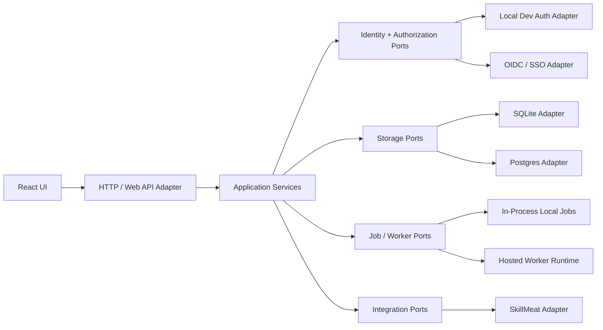

# PRD: CCDash Hexagonal Foundation V1

## Executive Summary

CCDash has outgrown its original single-user, single-process composition. The current backend starts migrations, sync, watchers, analytics jobs, SkillMeat refresh, and API routing from one FastAPI lifespan path, while many routers fetch DB connections and repositories directly. That composition is efficient for local-first development, but it is the wrong base for RBAC, shared SSO with SkillMeat, multi-runtime deployment, and stronger storage strategies.

This PRD defines the refactoring pass required before those capabilities are added. The target state is a hexagonal foundation with explicit application services, ports for identity/storage/jobs/integrations, and runtime-specific adapters for local desktop and hosted server modes.

## Current Architecture Analysis

### Observed Structural Constraints

1. `backend/main.py` composes API startup, migrations, sync, SkillMeat refresh, file watching, and periodic analytics in a single application lifespan.
2. Routers across `backend/routers/` call `connection.get_connection()` directly and instantiate repositories via `backend/db/factory.py`, so HTTP handlers still know about adapter choice.
3. `backend/db/factory.py` selects adapters through connection-type inspection, which couples persistence selection to runtime objects instead of declared capabilities.
4. `backend/project_manager.py` persists active-project state through a global singleton, which makes request-scoped tenancy and per-user workspace state awkward.
5. `contexts/DataContext.tsx` acts as both cache, polling coordinator, project switcher, and eventual auth boundary for the entire frontend.
6. Background concerns such as filesystem watch, test ingestion, analytics snapshots, and integration refresh are currently application boot behavior rather than separately deployable workers.

### Why This Blocks the Next Phase

RBAC and SSO require a request principal, an authorization policy boundary, and a clean way to pass scoped context into application services. Hosted deployment requires the API to run without mandatory local file watchers and desktop-style state assumptions. More robust database methods require persistence to be selected by composition, not by direct factory calls from routers.

## Problem Statement

As CCDash expands from a local-first observability tool into a shared platform integrated with SkillMeat, its current architecture forces core business flows to depend on global runtime state and concrete adapters. That makes every new concern, especially auth, deployment, and storage, spread across routers and startup code instead of being introduced behind stable interfaces.

## Goals

1. Introduce an application core organized around use-case services instead of router-level orchestration.
2. Define explicit ports for identity, authorization, workspace/project context, storage, background jobs, and external integrations.
3. Separate runtime composition so local, hosted, worker, and test modes can be bootstrapped independently.
4. Move adapter selection out of routers and into composition roots.
5. Create a frontend session/data boundary that can support authenticated and unauthenticated runtime profiles.

## Success Metrics

| Metric | Baseline | Target |
|--------|----------|--------|
| Router endpoints calling DB connection directly | Many hot-path endpoints | 0 in newly refactored bounded contexts |
| Startup responsibilities in API process | Migrations + sync + watch + analytics + integration refresh | API startup limited to API composition and required infrastructure wiring |
| New cross-cutting capabilities needing router edits in multiple files | High | Low; added primarily via service/port adapters |
| Runtime modes officially supported | Local dev only | Local desktop, hosted API, worker, test harness |

## Requirements

### Functional Requirements

| ID | Requirement | Priority | Notes |
|----|-------------|----------|-------|
| FR-1 | Introduce a composition root layer for API, worker, and local runtime profiles. | Must | Runtime profile chooses adapters and background capabilities. |
| FR-2 | Define application services for core bounded contexts: sessions/documents/features, execution, integrations, identity/access, and workspace management. | Must | Routers become HTTP mapping only. |
| FR-3 | Define ports for `IdentityProvider`, `AuthorizationPolicy`, `WorkspaceRegistry`, `StorageUnitOfWork`, `JobScheduler`, and `IntegrationClient`. | Must | Ports must be framework-agnostic. |
| FR-4 | Move filesystem sync, watcher, analytics snapshots, and integration refresh behind worker-oriented adapters. | Must | Hosted mode must run without mandatory local watch behavior. |
| FR-5 | Replace direct repository selection in routers with injected application services. | Must | Storage adapter choice belongs in composition. |
| FR-6 | Introduce request context carrying principal, workspace scope, project scope, and tracing metadata. | Must | Required by downstream auth and auditing work. |
| FR-7 | Split frontend concerns into at least session/auth state, data-access clients, and page composition boundaries. | Should | Avoid making `DataContext` the implicit auth container. |
| FR-8 | Preserve local-first operation through a no-auth/local adapter profile. | Must | The refactor must not break desktop-style usage. |

### Non-Functional Requirements

1. Preserve existing REST contracts wherever possible during the refactor.
2. Keep SQLite and Postgres support functional during transition.
3. Support incremental migration by bounded context, not a big-bang rewrite.
4. Add architecture tests or lint checks that prevent direct router-to-adapter regressions.

## Target Architecture

## In Scope

1. Backend architectural refactor and composition changes.
2. Frontend boundary cleanup required to support authenticated/runtime-aware app shells.
3. Runtime separation for API versus worker responsibilities.
4. Guardrails and conventions for future feature work.

## Out of Scope

1. Full RBAC and SSO delivery itself.
2. Final hosted infrastructure rollout.
3. Storage-engine replacement by itself.

## Sequencing and Dependencies

1. This PRD is the prerequisite foundation for:
   - `docs/project_plans/PRDs/enhancements/shared-auth-rbac-sso-v1.md`
   - `docs/project_plans/PRDs/refactors/deployment-runtime-modularization-v1.md`
   - `docs/project_plans/PRDs/refactors/data-platform-modularization-v1.md`
2. The execution connector work already establishes a useful adapter pattern and should be used as a reference implementation.
3. The refactor should happen by bounded context, starting with identity/workspace composition and persistence injection.

## Risks and Mitigations

| Risk | Impact | Likelihood | Mitigation |
|------|--------|------------|------------|
| Refactor churn slows feature delivery | High | Medium | Sequence by bounded context and preserve APIs during transition. |
| New abstractions become ceremony without reducing coupling | High | Medium | Require removal of direct router/factory usage as the success condition. |
| Local-first workflows regress | High | Medium | Keep explicit local adapter profile and compatibility tests. |
| Architecture stays partially migrated | Medium | High | Add guardrails and ownership for each boundary. |

## Acceptance Criteria

1. API, worker, and local runtimes can be started independently through explicit composition code.
2. New application services own business orchestration for at least the first migrated bounded contexts.
3. Request-scoped context exists and can carry principal + workspace information even in local mode.
4. Routers in migrated areas no longer call `connection.get_connection()` or repository factory functions directly.
5. The project has a documented port/adapter map that later auth, deployment, and data work can target without reopening the same architectural questions.
