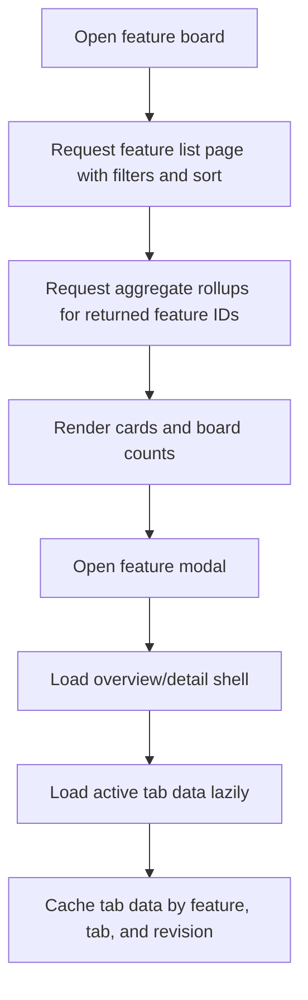

# Feature Brief & Metadata

**Feature Name:** Feature Surface Data Loading Redesign

**Filepath Name:** `feature-surface-data-loading-redesign-v1`

**Date:** 2026-04-22

**Author:** Codex

**Related Documents:**
- `/docs/project_plans/implementation_plans/refactors/feature-surface-data-loading-redesign-v1.md`
- `/docs/project_plans/implementation_plans/refactors/testing-page-performance-pass-v1.md`
- `/docs/guides/storage-profiles-guide.md`
- `/docs/guides/query-cache-tuning-guide.md`

---

## 1. Executive Summary

The feature board and feature modal currently over-fetch linked-session data, with one expensive linked-session request per visible feature and additional eager modal requests before the user opens the Sessions tab. This refactor redesigns the data surface around storage-backed feature listing, batched aggregate rollups, lazy detail endpoints, and predictable cache invalidation so the app keeps all current metrics, filtering, sorting, searching, organization, modal tabs, and session context while sharply reducing request fan-out and payload size.

**Priority:** HIGH

**Key Outcomes:**
- The feature board loads with bounded request count and bounded payload size at small and large project scales.
- Feature cards retain current metrics/counts without loading full linked-session arrays or session logs.
- Feature modal tabs load only the data needed for the active tab, with visible loading and error states.
- Filtering, sorting, search, status grouping, counts, and date filters remain functionally equivalent or improve by moving to repository-backed queries.
- Local SQLite and Postgres deployments share the same contracts and behavior, with storage-specific query optimizations hidden behind repositories.

---

## 2. Context & Background

### Current State

The current ProjectBoard receives feature data from `/api/features?offset=0&limit=5000`, then filters and sorts in React. It also loops over every filtered feature and calls `/api/features/{feature_id}/linked-sessions` to compute card summaries. The modal calls `/api/features/{feature_id}` and `/api/features/{feature_id}/linked-sessions` on mount regardless of the active tab.

The linked-session endpoint is heavy. It resolves feature links, fetches session rows, fetches session logs for badge/title/task enrichment, and expands root thread families into inherited subthreads. This behavior is appropriate for a detailed Sessions tab, but not for every feature card on first page load.

### Problem Space

Users see intermittent Sessions tab failures and slow feature page loads because the page eagerly performs expensive work before user intent is clear. The current design also scales poorly with feature count, linked session count, session log size, and subthread family size.

### Current Alternatives / Workarounds

The app can be run against Postgres, which may reduce query cost in some paths, but it does not address request fan-out or payload shape. Local SQLite makes the issue more visible because many linked-session and log operations are serialized, but the design gap exists in both runtime profiles.

### Architectural Context

The target design follows the existing layered architecture:
- **Routers** define bounded HTTP contracts, validate query options, and return DTOs.
- **Services** assemble feature summaries, rollups, and details without exposing database rows.
- **Repositories** own all DB I/O, filters, sorting, cursor/page pagination, aggregate queries, and storage-specific SQL.
- **Frontend data hooks** own query identity, lazy loading, visible loading/error state, and bounded client caches.

---

## 3. Problem Statement

As a user opening the feature board or feature modal, I need the page to show complete and accurate feature card metrics and modal details without loading every linked session and log for every feature before I ask for them.

**Technical Root Cause:**
- `components/ProjectBoard.tsx` eagerly calls `/api/features/{id}/linked-sessions` for each filtered feature.
- The modal fetches feature detail and full linked sessions on mount, not by active tab.
- Modal fetch paths use raw feature IDs in some URLs, which can break IDs with reserved URL characters.
- Linked-session endpoint does per-session row and log reads plus thread-family expansion.
- Filtering and sorting are partially client-side or in-memory after pagination on existing v1 paths.
- There is no list contract that returns feature cards plus the required aggregate rollups without full session detail.

---

## 4. Goals & Success Metrics

### Primary Goals

**Goal 1: Bounded Initial Load**
- Replace per-feature linked-session calls with one feature list request and at most one aggregate rollup request for the current result window.
- Preserve card counters, token/cost summaries, status grouping, dates, document coverage, dependency state, and family signals.

**Goal 2: Lazy, Reliable Modal Details**
- Load modal overview, phases, docs, relations, sessions, test status, and history by tab need.
- Encode feature IDs consistently.
- Show tab-level loading/error/retry states instead of silently rendering empty data after failures.

**Goal 3: Storage-Backed Query Semantics**
- Move board search, filters, sorting, pagination, and counts into repository/service contracts.
- Ensure SQLite and Postgres implementations return equivalent data and metadata.

**Goal 4: Cache Deliberately**
- Cache list pages and aggregate rollups by query parameters, project, and revision.
- Avoid caching full session logs or full linked-session detail for every feature.
- Invalidate on feature/session/document/task sync and live update topics.

### Success Metrics

| Metric | Baseline | Target | Measurement Method |
|--------|----------|--------|--------------------|
| Initial feature board calls | 1 feature list + N linked-session calls | <= 3 calls for first page/window | Browser network trace and tests |
| Initial feature board linked-session payload | Full sessions/log-derived metadata per visible feature | Aggregate rollup only | Network payload size measurement |
| Modal Sessions tab reliability | Silent empty state on transient failures | Visible loading/error/retry and successful lazy fetch | Component and integration tests |
| Feature list filtering correctness | Some filters client-side or post-pagination | Repository-backed with accurate totals | Backend tests |
| Large project responsiveness | Degrades with feature count | Stable under hundreds of features and thousands of sessions | Benchmark fixture |

---

## 5. User Personas & Journeys

**Primary Persona: Developer/Planner**
- Needs fast feature board navigation, reliable feature modal details, and accurate counts for planning and execution.
- Pain Points: page load stalls, Sessions tab sometimes appears empty, card metrics require too many backend calls.

**Secondary Persona: Operator/Reviewer**
- Needs scalable overview metrics across all project artifacts and confidence that filters/search reflect the whole data set.
- Pain Points: in-memory filtering and eager detail fetches make large local deployments feel unreliable.

### High-Level Flow

---

## 6. Requirements

### 6.1 Functional Requirements

| ID | Requirement | Priority | Notes |
| :-: | ----------- | :------: | ----- |
| FR-1 | Provide a feature list/card endpoint that supports search, status, category, date ranges, dependency/quality filters, sort, limit, offset or cursor, and accurate totals. | Must | Replaces `limit=5000` as the default board path. |
| FR-2 | Provide a feature aggregate rollup endpoint for a bounded list of feature IDs. | Must | Returns counts and metrics needed by cards without full linked sessions. |
| FR-3 | Preserve all current board grouping, filtering, sorting, and visible card metrics. | Must | If any metric cannot be exact cheaply, DTO must mark freshness/precision. |
| FR-4 | Provide lazy modal endpoints or query modes for overview, phases/tasks, documents, relations, sessions, test status, and history. | Must | Sessions tab should fetch linked sessions only when opened or explicitly prefetched. |
| FR-5 | Provide true paginated linked-session detail retrieval. | Must | Do not materialize every session before slicing. |
| FR-6 | Encode feature IDs in all client fetch paths. | Must | Prevent route failures for IDs containing reserved URL characters. |
| FR-7 | Show tab-level loading, empty, error, and retry states in the feature modal. | Must | Silent catch blocks must be replaced. |
| FR-8 | Keep local SQLite and Postgres behavior equivalent. | Must | Storage-specific SQL is hidden in repositories. |
| FR-9 | Add bounded frontend caching keyed by project, query, feature IDs, tab, and backend revision/freshness. | Should | Avoid duplicate work while preventing stale over-caching. |
| FR-10 | Keep legacy API compatibility during migration. | Should | Existing components can be migrated incrementally. |

### 6.2 Non-Functional Requirements

**Performance:**
- Initial board load must not scale linearly with visible feature count in request count.
- Card rollups must not fetch session logs.
- Linked-session detail must page at the data source.
- Queries must support hundreds of features and thousands of sessions on SQLite and Postgres.

**Reliability:**
- Failed detail requests must not masquerade as valid empty data.
- Cache invalidation must respond to sync completion, write-through updates, and live feature/session invalidations.
- v1 and legacy behavior must not disagree on feature/session counts after migration.

**Observability:**
- Add metrics for feature list latency, rollup latency, linked-session detail latency, request fan-out, cache hit/miss, and payload size.
- Log query parameters and result counts without logging large payloads.

**Compatibility:**
- Preserve current board, list view, modal tabs, FeatureExecutionWorkbench, PlanningHomePage, PlanCatalog, SessionInspector link flows, and tests.
- Existing write-through feature/phase/task status updates must continue to update visible data.

---

## 7. Scope

### In Scope

- Feature board data contract redesign.
- Feature card aggregate rollups.
- Feature modal lazy loading and tab-level state.
- Linked-session summary/detail split.
- Repository-level filters, sorting, counts, and pagination for SQLite and Postgres.
- Frontend data hooks/cache for feature surfaces.
- Migration from legacy `/api/features` hot paths toward stable v1/service contracts.
- Tests, benchmarks, and observability for the redesigned flow.

### Out of Scope

- Redesigning visual layout or removing existing feature tabs.
- Replacing the sync engine or entity link generation algorithm.
- Rewriting session ingestion, transcript parsing, or test visualizer internals beyond integration needs.
- Introducing a new external cache service.
- Changing auth or multi-tenant ownership semantics.

---

## 8. Dependencies & Assumptions

### Internal Dependencies

- Existing feature, task, document, session, entity link, and test health repositories.
- Existing live update topics and sync invalidation events.
- Existing agent query cache patterns.
- Existing runtime profile split between local SQLite and Postgres-backed deployments.

### Assumptions

- Exact full linked-session arrays are needed only in detail contexts, not on every card.
- Card metrics can be computed from aggregate queries plus link/session summary fields.
- SQLite remains a supported deployment profile and must receive equivalent query methods.
- Existing frontend can be refactored incrementally without changing the user-visible workflow.

### Feature Flags

- Introduce `FEATURE_SURFACE_V2` or equivalent local flag for route/hook migration.
- Keep legacy linked-session endpoint available until v2 card and modal flows are verified.

---

## 9. Target State

### API Shape

1. `GET /api/v1/features`
   - Returns feature card/list DTOs with page metadata and accurate totals.
   - Supports filters, search, sort, and pagination in the backend.

2. `POST /api/v1/features/rollups`
   - Accepts bounded feature IDs plus requested rollup fields.
   - Returns session counts, primary/subthread counts, token/cost totals, last activity, document/task/test summary metrics, and precision/freshness metadata.

3. `GET /api/v1/features/{feature_id}`
   - Returns lightweight modal overview shell; can include requested sections by `include=`.

4. `GET /api/v1/features/{feature_id}/sessions`
   - Returns linked sessions with true pagination and optional `include=badges,tasks,thread_children`.
   - Defaults to summary-safe fields; expensive enrichment is explicit.

5. `GET /api/v1/features/{feature_id}/activity`
   - Returns history/timeline and commit/session aggregates without forcing the Sessions tab payload.

### Frontend Shape

- `ProjectBoard` consumes a feature surface hook instead of issuing ad hoc fetches from component effects.
- Cards render from list DTO + rollup DTO.
- Modal has per-tab loaders, error states, retries, and optional prefetch only for likely next tabs.
- URL construction always encodes feature IDs.
- Client cache is bounded by project, query, feature IDs, section, and freshness token.

---

## 10. Risks & Mitigations

| Risk | Impact | Mitigation |
|------|--------|------------|
| Aggregate counts drift from full detail behavior | High | Define rollup DTO semantics, add parity tests against legacy detail for fixtures. |
| SQLite aggregate queries become complex | Medium | Keep repository methods storage-specific and test SQLite first because it is more constrained. |
| Incremental migration creates duplicate code paths | Medium | Use feature flag and retire legacy path after parity gates pass. |
| UI loses existing metrics during refactor | High | Inventory every card/modal metric before implementation and map each to list, rollup, or tab detail source. |
| Cache serves stale data after sync/write-through | High | Centralize invalidation on project feature/session/document/task topics and include freshness metadata. |

---

## 11. Acceptance Criteria

1. Opening the feature board no longer issues one linked-session request per feature.
2. Feature board cards show the same or better metrics/counts as today from list and rollup contracts.
3. Board search, filtering, sorting, and totals are backend-backed and correct under pagination.
4. Opening a feature modal does not fetch full linked sessions unless the Sessions tab is active or explicitly prefetched.
5. Sessions tab shows loading, error, retry, empty, and populated states correctly.
6. Feature IDs with reserved URL characters load correctly in board and modal paths.
7. SQLite and Postgres repository tests cover equivalent list, rollup, and linked-session pagination behavior.
8. Benchmarks verify bounded request count and improved payload size at large scale.
9. Existing feature board, planning, execution workbench, and session inspector flows remain functional.

---

## 12. Implementation Overview

The work should be delivered in phased order:

1. Contract inventory and metric mapping.
2. Repository/query foundation for filtered feature lists and aggregate rollups.
3. Service and v1 API contracts for list, rollups, modal sections, and linked-session pagination.
4. Frontend feature surface data layer and ProjectBoard migration.
5. Modal lazy loading and reliability remediation.
6. Cross-surface cleanup, observability, compatibility retirement, and performance guardrails.

