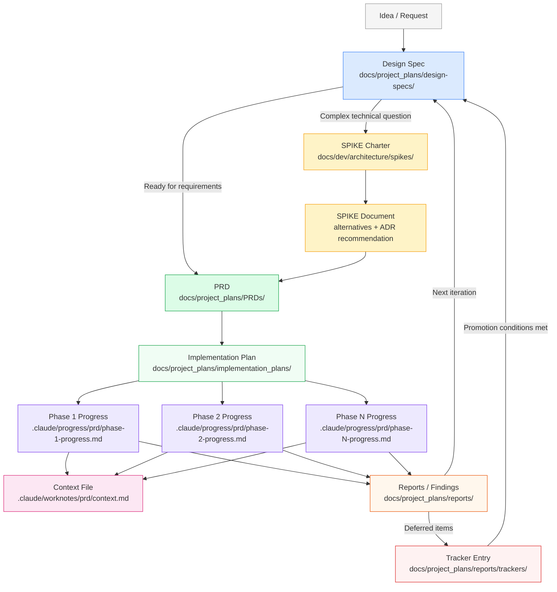
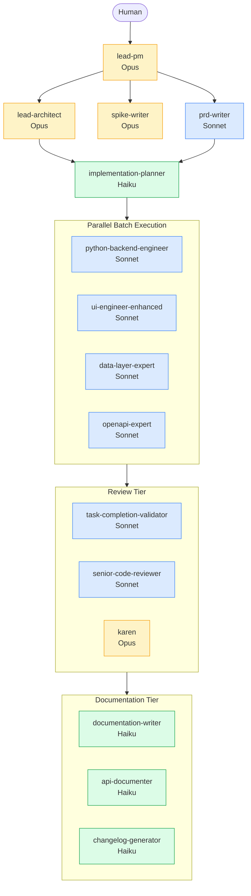

# SkillMeat Planning Workflow: A Comprehensive Analysis of AI-Native SDLC

**Subject:** Complete planning workflow architecture, tooling, and evolution  
**Audience:** Internal teams (workflow improvement) and external (blog/whitepaper)  
**Date:** 2026-04-13

## Table of Contents

1. [Executive Summary](#1-executive-summary)
2. [The Planning Artifact Ecosystem](#2-the-planning-artifact-ecosystem)
   - 2.1 [Document Types and Locations](#21-document-types-and-locations)
   - 2.2 [Document Lifecycle Flow](#22-document-lifecycle-flow)
   - 2.3 [YAML Frontmatter Schema v2](#23-yaml-frontmatter-schema-v2)
   - 2.4 [Scale and Scope](#24-scale-and-scope)
3. [The Agent Orchestra — Who Does What](#3-the-agent-orchestra--who-does-what)
   - 3.1 [Orchestration Tier (Opus)](#31-orchestration-tier-opus)
   - 3.2 [Planning Tier (Sonnet/Haiku)](#32-planning-tier-sonnethaiku)
   - 3.3 [Execution Tier (Sonnet)](#33-execution-tier-sonnet)
   - 3.4 [Review and Documentation Tiers](#34-review-and-documentation-tiers)
4. [Programmatic Automation — The Script Layer](#4-programmatic-automation--the-script-layer)
   - 4.1 [Task-Level Scripts](#41-task-level-scripts)
   - 4.2 [Plan-Level Scripts](#42-plan-level-scripts)
   - 4.3 [Cross-Feature Scripts](#43-cross-feature-scripts)
   - 4.4 [Status Propagation Logic](#44-status-propagation-logic)
5. [The Complete Workflow — From Idea to Completion](#5-the-complete-workflow--from-idea-to-completion)
   - 5.1 [Phase 0: Ideation and Research](#51-phase-0-ideation-and-research)
   - 5.2 [Phase 1: Planning](#52-phase-1-planning)
   - 5.3 [Phase 2: Execution](#53-phase-2-execution)
   - 5.4 [Phase 3: Validation and Finalization](#54-phase-3-validation-and-finalization)
   - 5.5 [Phase 4: Tracking and Retrospective](#55-phase-4-tracking-and-retrospective)
6. [The Evolution — How We Got Here](#6-the-evolution--how-we-got-here)
7. [Key Design Principles](#7-key-design-principles)
8. [Meta-Analysis — Insights for Blog and Whitepaper Content](#8-meta-analysis--insights-for-blog-and-whitepaper-content)
9. [Recommendations and Enhancement Opportunities](#9-recommendations-and-enhancement-opportunities)

---

## 1. Executive Summary

SkillMeat is a personal collection manager for Claude Code artifacts. What makes it unusual is not what it manages, but how it is built: every feature, bug fix, and architectural decision flows through a structured planning system designed from the ground up for AI agent orchestration.

This document analyzes that planning system in full. The system is best understood as an **AI-native SDLC** — a software development lifecycle where AI agents are first-class participants at every stage, from ideation through post-implementation triage. Humans set direction; agents plan, implement, validate, and document.

The system comprises several interlocking components:

- A **document hierarchy** of eight artifact types spanning the full lifecycle, from design specs through retrospective reports
- An **agent orchestra** of 25+ specialized agents arranged in tiers (orchestration, planning, execution, review, documentation), each with defined responsibilities and cost-appropriate model assignments
- A **script layer** of seven Python programs that replace expensive agent-mediated status updates with sub-100-token CLI calls, achieving 99.8% token savings on routine operations
- A **schema system** of 14 JSON schemas validating all planning documents, with a migration script for bulk conversion

The planning system has evolved through five distinct eras — from manual markdown tracking through CLI-first token discipline to the current orchestration-driven model where Opus reads only YAML frontmatter (~2KB) before delegating implementation batches to Sonnet agents in parallel.

The result is a system capable of managing 814+ completed planning documents and 175+ active progress tracking folders with a context budget of roughly 25-30K tokens per feature phase.

This report documents the system for two audiences. Internally, it serves as a reference for improving and extending the workflow. Externally, it provides source material for blog posts and whitepapers on AI-native software development practices.

---

## 2. The Planning Artifact Ecosystem

### 2.1 Document Types and Locations

The planning system defines eight primary document types, each with a specific location, purpose, and lifecycle.

#### Design Specs

**Location:** `docs/project_plans/design-specs/`

Design specs are the entry point for new ideas. They capture vision, trade-off exploration, and problem framing before any commitment to implementation. A design spec may exist for months in shaping state before a feature is approved.

**Maturity levels:** `idea` → `shaping` → `ready` → `future` → `deprecated`

The `ready` state is significant: it signals that a spec has been sufficiently shaped to warrant promotion to a PRD. The plan-status skill's Route 6 (pre-plan intake) identifies specs at `ready` state and flags them for promotion.

#### SPIKEs

**Location:** `docs/dev/architecture/spikes/`

SPIKEs are technical research investigations with explicit charters. A SPIKE charter defines research questions, time-boxes the investigation, and specifies the expected output (typically an alternatives analysis and ADR recommendation).

SPIKEs are produced by the `spike-writer` agent in charter-aware mode: it reads the research questions, delegates to domain experts (backend, frontend, architecture), and synthesizes their findings into a structured document. The SPIKE output feeds directly into PRD creation.

#### PRDs (Product Requirements Documents)

**Location:** `docs/project_plans/PRDs/{category}/`

**Categories:** `features`, `init`, `harden-polish`, `refactors`, `integrations`, `enhancements`, `tools-api-support`

PRDs define what will be built and why. They include contracts across four dimensions: API surface, data model, UX behavior, and telemetry. The `prd-writer` agent synthesizes feature briefs and prior design docs into PRDs, delegating UI/UX design to `ui-designer` and API surface design to `backend-architect`.

**Status lifecycle:** `draft` → `approved` → `in-progress` → `completed` → `superseded`

#### Implementation Plans

**Location:** `docs/project_plans/implementation_plans/{type}/`

Implementation plans transform PRD requirements into phased task breakdowns. They follow the canonical **8-layer architecture sequence**:

1. DB (schema migrations)
2. Repository (data access layer)
3. Service (business logic)
4. API (FastAPI routers and schemas)
5. UI (Next.js components and pages)
6. Testing (unit, integration, end-to-end)
7. Docs (user guides, API docs, changelogs)
8. Deployment (container config, migrations)

Each phase in an implementation plan maps to a single progress file. The plan includes YAML frontmatter with batch groupings and agent assignments that Opus reads directly to orchestrate execution.

#### Progress Files

**Location:** `.claude/progress/{prd}/phase-N-progress.md`

Progress files are the operational core of the planning system. There is exactly **one per phase**. Each file uses a YAML+Markdown hybrid format: YAML frontmatter contains structured task arrays with status, agent assignment, and batch grouping; the markdown body contains implementation notes and decision rationale.

The one-per-phase constraint is a deliberate design decision. It prevents context fragmentation, ensures Opus can read a complete phase picture in a single frontmatter block, and keeps the progress directory navigable.

#### Context Files

**Location:** `.claude/worknotes/{prd}/context.md`

Context files capture decision rationale, gotchas, and cross-cutting notes for a PRD across its full lifecycle. There is exactly **one per PRD**. These files persist decisions that are too granular for the PRD itself but too important to lose in git commit messages.

#### Meta-Plans

**Location:** `docs/project_plans/meta-plans/`

Meta-plans coordinate sequencing and dependencies across multiple features. They are used when several PRDs must proceed in a specific order (e.g., a storage refactor must complete before a new API surface can be built on top of it).

#### Trackers

**Location:** `docs/project_plans/reports/trackers/`

Trackers are deferred-work registries. When items are explicitly out-of-scope for a feature but worth tracking, they receive tracker entries with promotion paths (the conditions under which they graduate to a design spec or PRD). The `dvcs-future-work.md` tracker is a current example.

#### Reports

**Location:** `docs/project_plans/reports/`

Reports are point-in-time snapshots. The reports directory contains several subdirectories:

| Subdirectory | Contents |
|---|---|
| `investigations/` | Deep-dive analyses (this document) |
| `audits/` | Code and compliance audits |
| `findings/` | Inline findings during implementation |
| `planning-status/` | Periodic status snapshots from plan-status-report.py |
| `post-mortems/` | Feature retrospectives |
| `architecture/` | Architecture decision records and reviews |
| `performance/` | Performance investigations |

### 2.2 Document Lifecycle Flow

The following diagram shows how planning artifacts flow from idea to completion and into the next cycle.



### 2.3 YAML Frontmatter Schema v2

All planning documents use standardized YAML frontmatter validated by 14 JSON schemas. Schema v2 is the current standard.

**Core fields present in all document types:**

```yaml
schema_version: 2
doc_type: prd | implementation_plan | design_spec | spike | progress | context | tracker | report
status: draft | approved | in-progress | completed | superseded | idea | shaping | ready
created: "YYYY-MM-DD"
updated: "YYYY-MM-DD"
feature_slug: "kebab-case-feature-name"
prd_ref: "docs/project_plans/PRDs/features/feature-name.md"
plan_ref: "docs/project_plans/implementation_plans/features/feature-name.md"
```

**Progress-file-specific fields:**

```yaml
phase: 1
phase_name: "DB and Repository Layer"
parallelization:
  batch_1:
    - TASK-1.1
    - TASK-1.2
  batch_2:
    - TASK-1.3
tasks:
  - id: TASK-1.1
    title: "Create migration for new table"
    status: completed
    assigned_to: python-backend-engineer
    points: 1
  - id: TASK-1.2
    title: "Add repository interface"
    status: in-progress
    assigned_to: python-backend-engineer
    points: 2
metrics:
  total_tasks: 5
  completed_tasks: 3
  in_progress_tasks: 1
  blocked_tasks: 0
  progress: 60
```

The `parallelization` field is the key interface between plans and orchestration. Opus reads only the frontmatter, extracts batch groups and `assigned_to` values, then delegates each batch as a parallel set of `Task()` calls.

**Validation** is performed by `validate_artifact.py` against the appropriate JSON schema for each `doc_type`. Strict mode catches missing required fields; default mode reports warnings only.

### 2.4 Scale and Scope

As of April 2026, the planning system manages:

| Metric | Value |
|---|---|
| Completed planning documents | 814 |
| Inferred-complete documents | 214 |
| Active draft documents | 134 |
| Progress tracking folders | 175+ |
| Active progress tracking folders | 182 (progress dir count) |
| JSON validation schemas | 14 |
| Specialized agent definitions | 25+ |
| Python automation scripts | 7+ |

---

## 3. The Agent Orchestra — Who Does What

The planning system distributes work across agents arranged in five tiers. Model selection is cost-driven: Opus ($15/$75/M tokens) for reasoning and orchestration, Sonnet ($3/$15/M) for implementation and moderate reasoning, Haiku ($0.80/$4/M) for mechanical operations.



### 3.1 Orchestration Tier (Opus)

These agents reason, coordinate, and make architectural decisions. They never write implementation code directly.

#### lead-pm

The SDLC orchestrator. `lead-pm` is the entry point for all new work. It classifies incoming requests across five categories:

| Category | Trigger | Downstream Path |
|---|---|---|
| Ideation | New concept, no clear scope | Design spec creation |
| Feature | New user-facing capability | Full PRD + implementation plan |
| Bug | Regression or broken behavior | Direct to debug skill or quick fix |
| Enhancement | Extension of existing feature | Abbreviated planning or quick feature |
| Architecture | Cross-cutting system concern | lead-architect + SPIKE |

After classification, `lead-pm` runs a complexity assessment (S/M/L/XL) that determines the planning depth and which agents to involve. It coordinates all downstream planning agents and ensures artifacts are created in the correct locations with correct frontmatter.

Skills loaded: `planning`, `artifact-tracking`, `meatycapture-capture`

#### spike-writer

Technical research coordinator. `spike-writer` operates in charter-aware mode: it reads a SPIKE charter defining specific research questions, then delegates investigation to domain experts — `backend-architect` for API and data concerns, `frontend-architect` for UI and state management, `ai-engineer` for ML/embedding concerns.

The output is a SPIKE document containing:
- Summary of research findings per question
- Alternatives analysis with trade-offs
- ADR recommendation (the recommended path forward)
- Open questions and risks

#### lead-architect

Architecture decision-maker for cross-cutting concerns. `lead-architect` is invoked when a feature requires architectural guidance beyond the scope of a single specialist. It delegates investigation to specialists and synthesizes findings into architectural guidance that feeds into PRD and implementation plan creation.

### 3.2 Planning Tier (Sonnet/Haiku)

These agents translate high-level direction into structured, actionable plans.

#### prd-writer (Sonnet)

Synthesizes feature briefs, design specs, and SPIKE outputs into formal PRDs. The PRD includes four contract dimensions:

- **API contracts:** Endpoint signatures, request/response schemas, auth requirements
- **Data contracts:** Model changes, migration requirements, query patterns
- **UX contracts:** Component behavior, state transitions, error states
- **Telemetry contracts:** Events to emit, metrics to expose, alerts to configure

`prd-writer` delegates UI/UX design questions to `ui-designer` and API surface questions to `backend-architect`, then integrates their outputs into the PRD narrative.

#### feature-planner (Sonnet)

Handles feature brief creation and complexity classification. Feature planners produce the complexity score (S/M/L/XL) and select the orchestration pattern:

| Pattern | Use Case | Models Used |
|---|---|---|
| Full-Stack | Features touching API and UI | Sonnet (BE) + Sonnet (FE) |
| UI-Heavy | Frontend-dominant changes | Sonnet (FE) lead |
| Backend-Heavy | API/data dominant changes | Sonnet (BE) lead |
| Performance | Optimization-focused | Sonnet + profiling tools |

#### implementation-planner (Haiku)

Transforms SPIKE/PRD outputs into phased implementation plans following the 8-layer architecture sequence. Three workflow tracks:

| Track | Complexity | Models | Description |
|---|---|---|---|
| Fast | S (small) | Haiku only | Single-file or minimal-scope changes |
| Standard | M (medium) | Haiku + Sonnet | 3-8 files, 1-3 phases |
| Full | L/XL (large) | All models + Opus review | Complex features, 3+ phases, cross-cutting |

The implementation plan output includes YAML frontmatter with explicit `parallelization.batch_N` arrays and `assigned_to` fields for each task — the machine-readable interface that Opus reads during execution.

#### task-decomposition-expert (Haiku)

Breaks goals into granular tasks with semantic deduplication. Has ChromaDB integration for searching existing task patterns before creating new ones, reducing redundancy in large plans.

### 3.3 Execution Tier (Sonnet)

Fifteen-plus specialist implementation agents execute assigned tasks. Each agent has defined expertise, file scope, and permission mode (`acceptEdits`).

| Agent | Primary Scope | Typical Task Types |
|---|---|---|
| `python-backend-engineer` | `skillmeat/`, `tests/` | FastAPI routers, SQLAlchemy models, Alembic migrations |
| `ui-engineer-enhanced` | `skillmeat/web/` | React components, Next.js pages, Tailwind styling |
| `ui-engineer` | `skillmeat/web/` | Frontend-only changes |
| `frontend-developer` | `skillmeat/web/` | Component implementation |
| `frontend-architect` | `skillmeat/web/` | Architecture-level frontend decisions |
| `backend-architect` | `skillmeat/api/`, `skillmeat/core/` | API design, service patterns |
| `backend-typescript-architect` | API + TypeScript | Cross-stack API/client type sync |
| `nextjs-architecture-expert` | `skillmeat/web/app/` | App Router patterns, server components |
| `data-layer-expert` | `skillmeat/cache/`, `skillmeat/core/` | Repository patterns, ORM queries |
| `refactoring-expert` | Any | Cross-file refactors, pattern extraction |
| `openapi-expert` | `skillmeat/api/openapi.json` | OpenAPI contract maintenance |
| `ai-engineer` | ML/embedding code | Semantic search, vector operations |

The dev execution skill provides four execution modes:

- **Phase Execution:** Full phase from progress file, batch-delegated
- **Quick Execution:** Single-file or small-scope changes without full phase machinery
- **Story Execution:** User story implementation with acceptance criteria
- **Scaffold Execution:** Template-based project initialization

### 3.4 Review and Documentation Tiers

#### Review Tier

| Agent | Model | Role |
|---|---|---|
| `task-completion-validator` | Sonnet | Validates task outputs against acceptance criteria |
| `senior-code-reviewer` | Sonnet | Code quality, pattern adherence, security |
| `karen` | Opus | Reality-check agent; validates plans against actual codebase state |
| `code-reviewer` | Sonnet | General code review |

`karen` is notable: it is an adversarial validation agent that reads actual code and challenges plan assumptions. It catches cases where a plan assumes a pattern that does not exist or a file that has moved.

#### Documentation Tier

All documentation agents use Haiku for cost efficiency. Documentation is treated as a mechanical operation once the content is defined.

| Agent | Output |
|---|---|
| `documentation-writer` | User guides, developer docs in `/docs/` |
| `documentation-complex` | Multi-system integration docs (Sonnet, rare) |
| `api-documenter` | API reference from OpenAPI spec |
| `changelog-generator` | CHANGELOG entries from git log |

---

## 4. Programmatic Automation — The Script Layer

The script layer is the most significant engineering innovation in the planning system. It replaces agent-mediated status updates — which require loading a full agent, reading a file into context, making changes, and writing back — with direct Python CLI calls costing roughly 50 tokens.

**Token comparison:**

| Operation | Agent-Mediated | CLI Script | Savings |
|---|---|---|---|
| Single task status update | ~25,000 tokens | ~50 tokens | 99.8% |
| Batch update (5 tasks) | ~50,000 tokens | ~100 tokens | 99.8% |
| Query blocked tasks | ~75,000 tokens | ~3,000 tokens | 96% |
| Cross-feature status report | ~200,000+ tokens | ~5,000 tokens | 97.5% |

At scale — 175+ progress folders, multiple active phases — this is not an optimization. It is what makes the system viable.

### 4.1 Task-Level Scripts

Located at `.claude/skills/artifact-tracking/scripts/`

#### update-status.py

Updates a single task's status in a progress file's YAML frontmatter.

```bash
python .claude/skills/artifact-tracking/scripts/update-status.py \
  -f .claude/progress/dvcs-enterprise-federation/phase-4-progress.md \
  -t FED-4.1 \
  -s completed
```

**Side effects:** Automatically recalculates `metrics.completed_tasks`, `metrics.in_progress_tasks`, `metrics.blocked_tasks`, `metrics.progress`. When `progress` reaches 100, the file's `status` field is automatically set to `completed`.

#### update-batch.py

Updates multiple tasks in a single CLI call. The primary tool used after parallel batch execution.

```bash
python .claude/skills/artifact-tracking/scripts/update-batch.py \
  -f .claude/progress/dvcs-enterprise-federation/phase-4-progress.md \
  --updates "FED-4.1:completed,FED-4.2:completed,FED-4.3:in-progress"
```

Accepts the same metrics recalculation side effects as `update-status.py`.

#### update-field.py

Updates arbitrary frontmatter fields beyond status. Used for adding notes, changing priority, or recording blockers.

```bash
python .claude/skills/artifact-tracking/scripts/update-field.py \
  -f .claude/progress/dvcs-enterprise-federation/phase-4-progress.md \
  --set "blockers=Waiting on upstream trust store API"
```

### 4.2 Plan-Level Scripts

#### manage-plan-status.py

Reads and updates plan-level status fields (the `status` field in PRDs and implementation plans, not progress files).

```bash
# Read current status
python .claude/skills/artifact-tracking/scripts/manage-plan-status.py \
  --read docs/project_plans/PRDs/features/dvcs-enterprise-federation.md

# Update status
python .claude/skills/artifact-tracking/scripts/manage-plan-status.py \
  --file docs/project_plans/implementation_plans/features/dvcs-enterprise-federation.md \
  --status completed

# Query all plans with a given status
python .claude/skills/artifact-tracking/scripts/manage-plan-status.py \
  --query --status in-progress --type implementation_plan
```

#### query_artifacts.py

Queries metadata across all planning artifacts. Supports filtering by status, doc type, feature slug, date range, and other frontmatter fields.

```bash
# Find all in-progress PRDs
python .claude/skills/artifact-tracking/scripts/query_artifacts.py \
  --status in-progress --doc-type prd --format json

# Find all artifacts updated in the last 7 days
python .claude/skills/artifact-tracking/scripts/query_artifacts.py \
  --updated-since 2026-04-06 --format table
```

#### validate_artifact.py

Validates a planning artifact against its JSON schema.

```bash
# Standard validation
python .claude/skills/artifact-tracking/scripts/validate_artifact.py \
  -f docs/project_plans/PRDs/features/dvcs-enterprise-federation.md

# Strict mode (required fields only, no warnings)
python .claude/skills/artifact-tracking/scripts/validate_artifact.py \
  -f docs/project_plans/PRDs/features/dvcs-enterprise-federation.md \
  --strict
```

#### migrate-frontmatter.py

Bulk migration tool for schema upgrades. Used when schema v2 was introduced to convert all existing documents.

```bash
# Scan for documents needing migration
python .claude/skills/artifact-tracking/scripts/migrate-frontmatter.py --scan

# Dry run showing what would change
python .claude/skills/artifact-tracking/scripts/migrate-frontmatter.py \
  --target docs/project_plans/ --dry-run

# Execute migration
python .claude/skills/artifact-tracking/scripts/migrate-frontmatter.py \
  --target docs/project_plans/ --migrate
```

### 4.3 Cross-Feature Scripts

Located at `.claude/skills/plan-status/`

The `plan-status-report.py` script is the cross-feature visibility tool. It operates in seven distinct routes, each addressing a different visibility need.

| Route | Flag | Purpose |
|---|---|---|
| Route 1 | (default) | Full status aggregation with effective status propagation |
| Route 2 | `--mismatches-only` | Detect status mismatches (task completion vs file status) |
| Route 3 | `--batch-remediate` | Batch-fix common mismatch patterns |
| Route 4 | `--by-feature` | Group status by feature slug |
| Route 5 | `--by-phase` | Status breakdown by phase across all features |
| Route 6 | `--route6` | Pre-plan intake: specs ready to promote, stale shapers, orphans |
| Route 7 | `--route7` | Findings triage: archive candidates, missing frontmatter |

**Route 6 example output:**

```
PRE-PLAN INTAKE REPORT
======================
Ready for promotion (status: ready):
  docs/project_plans/design-specs/dvcs-fs-watcher-sync.md (shaping → ready 14 days ago)

Stale shapers (shaping > 30 days, no recent commits):
  docs/project_plans/design-specs/ai-merge-suggestions.md (shaping, last updated 45 days ago)

Orphaned specs (no linked PRD, status: ready):
  docs/project_plans/design-specs/planning-system-ui.md
```

### 4.4 Status Propagation Logic

The plan-status-report.py computes **effective status** by inferring upward through the document hierarchy. Raw status fields are never mutated; propagation is read-only inference.

**Propagation rules:**

```
Progress file effective status:
  completed  = status == "completed" AND metrics.progress == 100
  in-progress = status == "in-progress" OR metrics.progress > 0
  blocked    = any task with status == "blocked"

Implementation plan effective status:
  completed  = ALL linked progress files are effectively completed
  in-progress = ANY progress file is in-progress
  blocked    = ANY progress file is blocked

PRD effective status:
  completed  = linked implementation plan is effectively completed
  in-progress = implementation plan is in-progress
  blocked    = implementation plan is blocked
```

This design allows a PRD to remain in `in-progress` raw status while the progress reports accurately show the true state. When a human or script explicitly updates the raw status, the propagation engine no longer needs to infer — explicit always wins over inferred.

---

## 5. The Complete Workflow — From Idea to Completion

### 5.1 Phase 0: Ideation and Research

The workflow begins with an idea, bug report, or architectural question.

**Capture:** Ideas are captured via MeatyCapture (`mc-quick.sh`) for token-efficient logging, or through direct conversation with `lead-pm`. The `mc-quick.sh` script accepts a type, domain, subdomain, title, problem statement, and goal in a single command (~50 tokens).

**Design spec creation:** `lead-pm` determines whether the idea warrants a design spec. Low-certainty or large-scope ideas start at `idea` status; more developed ideas start at `shaping`. The spec lives at `docs/project_plans/design-specs/` and may remain in shaping for weeks or months while understanding develops.

**Research (SPIKE):** When technical uncertainty is high — e.g., "which sync architecture should we use?" or "how should we model multi-tenant federation?" — `lead-pm` invokes `spike-writer`. The SPIKE charter specifies:

- Research questions (concrete, answerable)
- Time box (prevents open-ended investigation)
- Expected deliverables (alternatives table, ADR recommendation, risk assessment)

`spike-writer` delegates each research question to the appropriate domain expert and synthesizes outputs into a SPIKE document at `docs/dev/architecture/spikes/`.

**Pre-plan intake:** The `plan-status-report.py --route6` command provides a periodic view of which design specs have reached `ready` status and are eligible for promotion to PRDs. This prevents the "ready but forgotten" failure mode.

### 5.2 Phase 1: Planning

**Command invoked:** `/plan:feature` or `/plan:*` (loads `planning` and `artifact-tracking` skills first)

**Step 1 — Classification and complexity assessment**

`lead-pm` reads the design spec and any SPIKE output. It classifies the request and assigns a complexity score. The complexity score determines the planning depth:

- **S:** Quick feature path. `feature-planner` creates a brief plan. No full PRD required for trivial changes.
- **M:** Standard path. `prd-writer` creates a PRD; `implementation-planner` creates a 1-3 phase plan.
- **L/XL:** Full path. SPIKE may be required. PRD goes through review. Implementation plan may include coordination across multiple feature teams.

**Step 2 — PRD creation**

`prd-writer` (Sonnet) synthesizes all available inputs:
- The design spec narrative
- SPIKE findings and ADR recommendation
- Existing codebase patterns (provided as file paths, not contents)
- API contract requirements (OpenAPI-first)

The PRD is placed at the appropriate category path under `docs/project_plans/PRDs/` with `status: draft`.

**Step 3 — Implementation plan creation**

`implementation-planner` (Haiku) reads the PRD and produces a phased plan following the 8-layer sequence. Each phase includes:

- Explicit task list with IDs (e.g., `FED-4.1`, `FED-4.2`)
- Agent assignments per task
- Batch groupings for parallelization
- Estimated complexity points
- File-ownership mapping (which files each task touches)

**Step 4 — Progress and context file creation**

For each phase in the implementation plan, a progress file is created at `.claude/progress/{feature_slug}/phase-N-progress.md`. A single context file is created at `.claude/worknotes/{feature_slug}/context.md`.

**Step 5 — Optional plan review**

For L/XL features, the Planning Review Board (an HTML visualization of the plan) may be generated. `karen` is invoked for reality-check validation against the actual codebase state.

### 5.3 Phase 2: Execution

**Command invoked:** `/dev:execute-phase N` (loads `dev-execution` and `artifact-tracking` skills first)

**Step 1 — Frontmatter read (Opus, ~2KB)**

Opus reads ONLY the YAML frontmatter from the current phase's progress file. This is approximately 2KB versus the 25KB a full file read would require.

From the frontmatter, Opus extracts:
- `parallelization.batch_N` arrays (which tasks run together)
- `tasks[].assigned_to` (which agent handles each task)
- `tasks[].status` (which tasks are already complete)

**Step 2 — Parallel batch delegation**

Opus constructs a single message containing multiple `Task()` calls — one per agent in the batch. Each Task() call includes:
- The agent name (pre-configured with permissions and model)
- A concise prompt (<500 words) with file paths, not file contents
- Reference to relevant patterns by path ("follow pattern in `skillmeat/api/routers/git_connections.py`")

File-ownership-first grouping prevents conflicts: tasks that touch the same file are placed in different batches, never the same batch.

**Step 3 — Status update after each batch**

After batch agents complete, Opus calls `update-batch.py` with all completed task IDs. This is a single CLI call costing ~100 tokens regardless of how many tasks completed.

```bash
python .claude/skills/artifact-tracking/scripts/update-batch.py \
  -f .claude/progress/dvcs-enterprise-federation/phase-4-progress.md \
  --updates "FED-4.1:completed,FED-4.2:completed"
```

**Step 4 — Validation**

After each batch (or at phase end for smaller phases), validation is delegated to `task-completion-validator`. Opus does not read output files; the validator checks them directly and reports pass/fail with actionable findings.

**Step 5 — Phase completion**

When `update-batch.py` calculates `metrics.progress = 100`, it automatically sets `status: completed` in the progress file. Opus proceeds to the next phase.

### 5.4 Phase 3: Validation and Finalization

**Schema validation**

`validate_artifact.py` runs against all artifacts produced during implementation: OpenAPI updates, new router files, schema files. Strict mode is used for pre-PR validation.

**Documentation finalization**

The last phase of every implementation plan is the **Documentation Finalization** phase. It evaluates:

- CHANGELOG: Does it reflect all significant changes?
- README: Does it need updating for new features or changed commands?
- User guides: Are new user-facing behaviors documented?
- Developer docs: Are new patterns documented for future implementors?
- Context file: Are key decisions and gotchas captured?

This is a standard phase, not an afterthought. Treating documentation as a phase with tasks and acceptance criteria prevents the "we'll document it later" failure mode.

**Deferred item capture**

Items explicitly deferred during implementation are captured as design specs (status: `idea` or `future`) or tracker entries. The tracker entry includes the conditions under which the item should be promoted.

**Pre-PR validation**

The `pre-pr-validation` command runs final quality gates:
- `validate_artifact.py --strict` on all modified planning docs
- `plan-status-report.py --mismatches-only` to catch stale statuses
- TypeScript type check (`npx tsc --noEmit`) and Python lint

### 5.5 Phase 4: Tracking and Retrospective

**Cross-feature status**

`plan-status-report.py` (Route 1) generates a cross-feature status snapshot. This is saved to `docs/project_plans/reports/planning-status/` with a datestamped filename.

**Mismatch remediation**

Route 2 (`--mismatches-only`) surfaces cases where a progress file's raw status disagrees with the calculated effective status. These are remediated either automatically (Route 3) or manually.

**Tracker update**

The feature's deferred items are added to the relevant tracker file. Each entry includes:
- Brief description of the deferred work
- Reason for deferral
- Promotion conditions (what would trigger this becoming a design spec or PRD)
- Link to the original progress file where it was identified

**Findings triage**

Route 7 (`--route7`) surfaces findings documents that are candidates for archival (old, resolved, no open actions) and documents missing required frontmatter.

---

## 6. The Evolution — How We Got Here

The planning system did not arrive fully formed. It evolved through five distinct eras, each responding to a specific scaling failure.

### Era 1: Manual Tracking (Early Development)

The first iteration of planning was conventional: large markdown files (often 1200+ lines) combining narrative, task lists, and status in prose. Status was tracked by editing text like "~~Task 1.1~~ (complete)" or adding "(in progress)" annotations.

**Problems that emerged:**
- Agent context cost: reading a full 1200-line plan cost ~3,000 tokens per reference
- Status was unreliable: prose annotations were missed, inconsistent, or overwritten
- No machine-readable interface: extracting "what's done?" required an LLM read
- No cross-feature visibility: understanding overall project state required reading dozens of files

### Era 2: Structured Frontmatter (Schema v2 Introduction)

The introduction of YAML frontmatter with a standardized schema (v2) was the first systematic response to the reliability problem.

Key commit: `15147c67` — "Aligned frontmatter with CCDash schema v2"

This commit introduced:
- The 14 JSON schemas for document validation
- Standardized `doc_type`, `status`, `feature_slug`, and cross-reference fields
- `validate_artifact.py` for schema enforcement
- `migrate-frontmatter.py` for converting existing documents in bulk

Frontmatter made status machine-readable for the first time. An agent or script could extract "all in-progress features" without reading file bodies.

### Era 3: Token Discipline (CLI-First Revolution)

The CLI-first revolution addressed the cost problem. Even with structured frontmatter, updating status required an agent to load, read, modify, and write a file — roughly 25KB of tokens per operation.

Key commits: `d8e7dd50` and `bdae224e` — "CLI-first updates for 99% token reduction"

These commits introduced `update-status.py` and `update-batch.py`, replacing agent-mediated updates with Python scripts that parse and modify YAML directly.

The token math was stark:
- Agent-mediated update: load agent (~10KB) + read file (~3KB) + write file (~3KB) + overhead = ~25KB
- CLI script: `python update-status.py -f FILE -t TASK -s completed` = ~50 bytes of context

Commit `d3ccc6e8` formalized this as a project rule: "CLI-first for status operations; agents for content creation only."

This era also codified the "Opus orchestrates, subagents execute" principle with teeth: a `.claude/rules/context-budget.md` rule file that treats token usage as an engineering constraint, not just a preference.

### Era 4: Cross-Feature Visibility (Plan-Status Skill)

As the number of concurrent features grew, individual-feature tracking was no longer sufficient. Project-level questions — "what's in-progress across all features?", "which PRDs are complete but have stale plan files?" — required reading dozens of files.

Key commit: `376b57bd` — "Effective status propagation across related docs"

The plan-status skill introduced:
- The seven-route reporting system
- Effective status propagation (inference without mutation)
- Pre-plan intake (Route 6) for spec promotion pipeline
- Findings triage (Route 7) for document lifecycle management

The "inference, not mutation" design was deliberate. Computed status that modifies raw files would create confusion about what was manually set versus inferred. The separation preserves human authority over raw status while providing accurate computed views.

### Era 5: Orchestration-Driven Development (Current)

The current era fully realizes the AI-native SDLC model. Two key capabilities define it.

Key commit: `be5f169e` — "Full orchestration with progress file YAML delegation"

**Frontmatter-only reads:** Opus no longer reads full progress files. It reads only the YAML frontmatter (~2KB) to extract batch groups and agent assignments, then delegates. The file body (notes, decisions, narrative) is for humans and context files, not orchestration.

**File-ownership-first batching:** After an incident where two agents edited the same file in parallel (different sections), a formal batching rule was introduced: tasks are grouped by target file first, semantic meaning second. If two tasks touch `routes/git_connections.py`, they go in different batches even if their changes are logically independent.

The current era also introduced **Agent Teams** for complex multi-component features. Rather than sequential subagent calls, Agent Teams allow a lead agent to coordinate multiple specialists in parallel, with the orchestration machinery handling result collection and conflict resolution.

Multi-model integration reached maturity in this era, with explicit model routing by capability type:

| Capability | Model | Rationale |
|---|---|---|
| Orchestration and deep reasoning | Opus | Irreplaceable for architectural decisions |
| Implementation (default) | Sonnet | Near-Opus for coding at 1/5 the cost |
| Exploration and search | Haiku | Mechanical operations, no reasoning required |
| Web research | Gemini 3.1 Pro | Current web information access |
| Plan review (second opinion) | GPT-5.3-Codex | Opt-in checkpoint for critical plans |

---

## 7. Key Design Principles

Eight principles govern the planning system. These are not aspirational; they are implemented and enforced.

### 1. Progressive Disclosure

Context is loaded in layers, matched to the task at hand:

1. Runtime truth (OpenAPI spec, symbol graphs) — always available
2. CLAUDE.md — scope and invariants
3. Key-context playbooks — domain-specific patterns
4. Deep context — only when the above leaves open questions
5. Historical plans and reports — only for decision rationale; never for behavioral reference

This principle applies to agents as well as humans. An agent executing a single task should not load the full implementation plan — only the relevant phase frontmatter.

### 2. YAML as Source of Truth

All structured planning metadata lives in YAML frontmatter. Markdown bodies are narrative; YAML is data. This separation enables:
- Machine-readable queries without full-file reads
- Schema validation without parsing markdown
- Status propagation without understanding document narrative
- Batch operations via simple YAML parsers

When in doubt about planning state, query frontmatter fields — never parse prose.

### 3. AI-First Design

Every planning artifact is optimized for agent consumption, not just human reading. This means:
- Frontmatter fields are named to be self-explanatory without surrounding context
- `assigned_to` values are exact agent names, not descriptions
- `parallelization.batch_N` arrays are directly executable as Task() parameters
- Status values are a closed enumeration, not free-form strings

Human readability is a secondary constraint, not the primary one.

### 4. One Artifact Per Lifecycle

| Constraint | Scope | Rationale |
|---|---|---|
| ONE progress file | Per phase | Prevents context fragmentation; complete view in single frontmatter read |
| ONE context file | Per PRD | Single authoritative location for decisions and gotchas |
| ONE findings file | Per feature | Avoids proliferating half-finished investigation documents |
| ONE worknotes file | Per PRD | Same as context file rationale |

Violations of these constraints are caught by the doc policy spec (`/.claude/specs/doc-policy-spec.md`) and flagged in pre-commit hooks.

### 5. CLI-First Operations

Status operations use Python scripts (~50 tokens). Agent mediation is reserved for:
- Content creation (writing a new PRD or plan)
- Updates requiring contextual judgment (recording a blocker with explanation)
- Validation requiring code understanding

Anything reducible to a structured field update is a CLI operation.

### 6. Delegation Over Exploration

Opus provides file paths and patterns to subagents; it does not read implementation files itself. The CLAUDE.md rule is explicit: "When you catch yourself about to edit a file: STOP. Delegate instead."

This extends to validation: Opus does not run type checks, read output files, or verify implementations directly. It delegates to `task-completion-validator` and reads only the pass/fail result.

### 7. Inference Over Mutation

Status propagation computes effective status without changing raw values. Raw status is always what a human or script explicitly set. Computed status is what the system infers from the hierarchy.

This design preserves human authority over document state and prevents automated tools from creating misleading raw status values. A PRD marked `in-progress` by a human remains `in-progress` in raw status even if all implementation work is complete — until a human or explicit script updates it.

### 8. File-Ownership-First Batching

Parallel task batches are grouped by file ownership, not semantic meaning. If Task A and Task B both touch `skillmeat/api/routers/git_connections.py`, they belong in different sequential batches regardless of how logically independent their changes are.

This principle was learned from a specific failure: two agents editing different sections of a 600-line file in parallel produced correct individual edits that, when merged, failed due to import ordering conflicts that neither agent could detect.

---

## 8. Meta-Analysis — Insights for Blog and Whitepaper Content

### What Makes This Novel

SkillMeat's planning system is, to our knowledge, one of the most sophisticated implementations of AI-native SDLC in active use. Several characteristics distinguish it from common patterns of "using AI for software development":

**Agents as team members, not tools.** The system does not use AI agents as smart autocomplete or code generation assistants. Each agent has a defined role, a defined scope, a defined cost tier, and defined interfaces with other agents. The orchestration mirrors a real engineering org chart, with PM, architect, engineers, QA, and docs functions all filled by agents.

**Token efficiency as a first-class concern.** Token cost is measured, optimized, and budgeted at the system level. The planning system has a context budget (~148K tokens available for work per session after baseline), a per-phase budget (~25-30K tokens), and specific guardrails (task prompts <500 words, no `TaskOutput()` for file-writing agents, no full-file reads for delegated work). This is treated with the same rigor as CPU or memory budgets in traditional systems.

**The script layer as the key innovation.** The seven Python scripts that enable CLI-first status updates are not a convenience. They are what makes the system tractable at scale. Without them, maintaining 175+ progress files across 814+ planning documents would require orders of magnitude more agent compute.

**Inference over mutation.** The status propagation design (compute effective status, never mutate raw status) reflects a sophisticated understanding of the difference between ground truth and derived views. This is a common pattern in database design (materialized views, computed columns) that is rarely applied to project management systems.

### Key Metrics for Content

| Metric | Value | Significance |
|---|---|---|
| Token savings from CLI-first updates | 99.8% | Enables scale that would otherwise be unaffordable |
| Context reduction from plan splitting | 50-70% | One progress file per phase vs. one monolithic plan |
| Completed planning documents | 814+ | System has been in production use across full product lifecycle |
| Active progress tracking folders | 175+ | Concurrent complexity the system manages |
| Specialized implementation agents | 15+ | Division of labor enabling deep specialization |
| Planning/orchestration agents | 6 | Thin orchestration layer relative to execution depth |
| JSON schemas for validation | 14 | Structural guarantees enforced at creation, not review |
| Python automation scripts | 7+ | Mechanical operations removed from agent scope |

### Quotable Patterns

**"Opus thinks, Sonnet codes, Haiku searches"** — The multi-model division of labor in one sentence. The cost differential (Opus at $15/M, Sonnet at $3/M, Haiku at $0.80/M) maps to a responsibility structure: deep reasoning is expensive and rare; implementation is the default; exploration is cheap and frequent.

**"50 bytes, not 25 kilobytes"** — The CLI-first status update principle. When a status update can be expressed as a CLI command, it should be. The 500x token savings is not marginal; it changes what is possible.

**"Inference, not mutation"** — The status propagation philosophy. Computed state and recorded state are different things. The system maintains both without conflating them.

**"Progressive disclosure for machines"** — The context loading strategy. Agents, like humans, should load only the context they need for the current task. An agent executing a database migration should not have the full UI design spec in context.

**"File-ownership-first batching"** — The parallel execution grouping rule. Semantic parallelism is not physical parallelism. Two agents writing logically independent changes to the same file will produce conflicts.

### Analogies for General Audiences

**The virtual PMO.** The orchestration tier (Opus agents) functions as a virtual Project Management Office. `lead-pm` classifies and routes work; `lead-architect` makes architectural decisions; `spike-writer` commissions and synthesizes research. The PMO does not write code; it ensures the right work is being done in the right order by the right people.

**Token budgets as sprint capacity.** Just as a sprint has finite story points, a planning session has a finite token budget (~148K usable tokens after baseline). Phase work is budgeted at ~25-30K tokens. Exceeding budget means either descoping the phase or carrying work forward — the same tradeoffs as sprint planning.

**YAML frontmatter as a queryable database.** The frontmatter in every planning document functions as a row in a document database. `query_artifacts.py` and `plan-status-report.py` query this database without reading document bodies. This enables cross-feature reporting that would otherwise require reading thousands of lines of markdown.

**The agent org chart as a real org chart.** Lay the agent hierarchy next to a typical engineering org chart: PM, architect, tech lead, senior engineer, engineer, QA, technical writer. The roles map almost exactly. The difference is cost structure (Opus for PM/architect, Sonnet for engineering, Haiku for QA/docs) and the absence of coordination overhead — agents do not have meetings.

---

## 9. Recommendations and Enhancement Opportunities

These recommendations are prioritized by implementation effort and potential impact.

### Immediate Opportunities (Low Effort)

**1. Unified CLI entry point**

Currently, interacting with the planning system requires remembering seven script paths across two skill directories. A single `skillmeat plan` subcommand that wraps all planning operations would reduce friction significantly.

```bash
# Proposed unified interface
skillmeat plan status                          # Route 1: full status
skillmeat plan status --mismatches-only        # Route 2: mismatches
skillmeat plan update FED-4.1 completed        # update-status.py
skillmeat plan update --batch "T1:done,T2:done" # update-batch.py
skillmeat plan validate docs/project_plans/... # validate_artifact.py
skillmeat plan intake                          # Route 6: pre-plan intake
```

**2. Auto-generated Planning Review Board**

The HTML Planning Review Board currently requires manual generation. A pre-commit or post-push hook that regenerates it automatically would keep it current without additional process overhead.

**3. Mismatch auto-remediation as pre-commit hook**

Route 2 detects status mismatches; Route 3 can remediate common patterns. Wrapping these in a pre-commit hook would catch stale statuses before they accumulate. The hook could run in warning mode (report but not block) to avoid interrupting flow.

### Medium-Term Opportunities

**4. Planning status API endpoint**

`plan-status-report.py` is CLI-only. A `/api/v1/planning/status` endpoint would make planning state available to the SkillMeat web UI, enabling dashboards and notifications without a separate script invocation.

**5. Tracker auto-population**

When `update-field.py` or agent notes record an item as deferred, the relevant tracker file could be automatically updated with a draft entry. The agent would still need to provide the description and promotion conditions, but the mechanical entry creation would be automated.

**6. Git-aware stale detection**

`plan-status-report.py` could be extended to query git log for the last commit that touched each progress file. Phases that have been `in-progress` for more than N days with no commits would be flagged as potentially stale, prompting human review.

### Long-Term and Visionary Opportunities

**7. Planning memory integration**

The SkillMeat memory system (SQLite/PostgreSQL-backed, with CLI and API interfaces) currently captures implementation gotchas and decisions. Connecting it to planning artifacts would enable:
- When a gotcha is captured, auto-link it to the PRD and context file for the feature being implemented
- When planning a new feature, search memories for related past decisions
- Surface recurring blockers as planning anti-patterns

**8. Cross-project planning templates**

The current system is scoped to the SkillMeat project itself. As a collection manager for Claude Code artifacts, SkillMeat could distribute planning templates — PRD templates, implementation plan templates, progress file schemas — as installable artifacts. Projects managed by SkillMeat could adopt the same planning workflow.

**9. Planning analytics**

The frontmatter database enables velocity tracking that is not currently being used:
- Time from PRD creation to `in-progress` (planning cycle time)
- Time from `in-progress` to `completed` (implementation cycle time)
- Average phase duration by feature complexity tier
- Agent utilization rates by phase
- Token cost per feature (estimable from session logs)

These metrics would enable evidence-based process improvement rather than anecdotal adjustment.

**10. Interactive planning UI**

A web UI in the SkillMeat frontend for browsing and managing planning artifacts. The `/api/v1/planning/status` endpoint (recommendation 4) would back this UI. Key views:
- Feature pipeline (Kanban by status)
- Phase progress (Gantt or burndown by feature)
- Tracker backlog (deferred items with promotion conditions)
- Schema validation dashboard (documents failing validation)

**11. Natural language plan queries**

`query_artifacts.py` provides a structured query interface. A conversational layer — "What features are blocked?" or "Show me everything related to DVCS" — backed by this infrastructure would make the planning database accessible to users who do not know the CLI syntax. This is a natural fit for integration with the SkillMeat chat interface.

**12. Automated retrospectives**

After a feature's progress files all reach `completed`, a retrospective could be auto-generated by comparing:
- Estimated complexity points vs. actual tasks completed
- Planned phase count vs. actual phases executed
- Deferral rate (what fraction of originally-planned work was deferred)
- Blocker frequency and resolution time

Patterns across retrospectives — "API phases consistently take longer than estimated", "UI phases have the highest deferral rate" — would surface planning calibration opportunities.

---

*This report was produced by analyzing the SkillMeat planning system as it exists in April 2026, spanning the `feat/dvcs-enterprise-federation` branch and the main development branch. Scale metrics reflect the current state of the `.claude/progress/`, `docs/project_plans/`, and planning script directories.*
