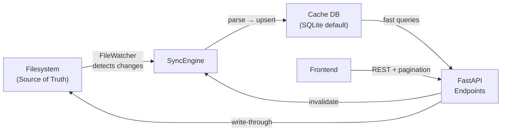
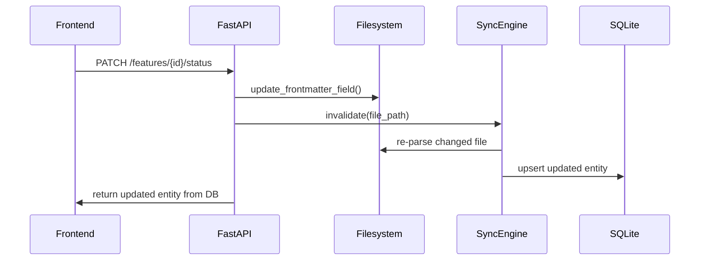

# Implementation Plan: DB Caching Layer

**Project:** CCDash — Agentic Analytics Dashboard
**Complexity:** High (H) | **Track:** Standard
**Timeline:** Follow-on work across 4 incremental phases after the hexagonal foundation refactor

---

## Table of Contents

1. [Executive Summary](#executive-summary)
2. [Current Applicability Review](#current-applicability-review)
3. [Updated Architecture Direction](#updated-architecture-direction)
4. [Problem Statement](#problem-statement)
5. [Architectural Design](#architectural-design)
6. [Schema Design](#schema-design)
7. [Sync Engine](#sync-engine)
8. [API Changes](#api-changes)
9. [Frontend Changes](#frontend-changes)
10. [Phase Breakdown](#phase-breakdown)
11. [File Structure](#file-structure)
12. [Verification Plan](#verification-plan)

---

## Executive Summary

This plan is still relevant, but no longer as a greenfield roadmap. The original cache/sync foundation has largely landed in the codebase: CCDash now has runtime profiles, a runtime container, SQLite and Postgres migrations/repositories, a sync engine, a file watcher, cache/status APIs, and a split frontend data shell.

The plan should now be treated as a **bridge document** for the remaining data-platform work:

- Keep the **local-first cache model** strong: filesystem-derived artifacts remain practical in local mode, with SQLite as the default portable store.
- Evolve the existing implementation into **explicit storage profiles** for `local` and `enterprise`, rather than treating Postgres as an optional parity backend.
- Finish the **hexagonal migration** so routers and services stop selecting storage through connection-type checks and global singletons.
- Lay the **schema and repository seams** needed for future session canonicalization, including message-level storage and richer transcript intelligence.

The original goals still matter, but several “future” items in this document are already implemented and should no longer be planned as net-new work.

## Current Applicability Review

### Verdict

This plan is **partially applicable**:

1. **Still applicable** for the local SQLite cache, filesystem sync, entity-linking, and derived analytics substrate.
2. **Outdated** where it assumes the pre-hexagonal architecture is still current.
3. **Insufficient on its own** for the new local-vs-enterprise deployment/storage model and session-storage modernization roadmap.

### Already Landed In Code

The following are already present and should be treated as baseline, not future scope:

- Runtime profiles and composition for `local`, `api`, `worker`, and `test`
- `backend/db/` package with SQLite and Postgres migrations/repositories
- Incremental sync engine and file watcher
- Cache management and cache observability endpoints
- Worker bootstrap and background-job separation from hosted API boot
- Frontend data-shell split (`DataClient`, app session/runtime/entity contexts) plus typed API client
- Pagination, analytics expansion, and broader DB-backed read paths

### Remaining Gaps

The follow-on work is now concentrated in architectural cleanup and platform definition:

- Many routers still import `backend.db.connection`, `backend.db.factory`, or `backend.project_manager` directly.
- Storage selection still relies on runtime `isinstance` dispatch inside `backend/db/factory.py` and the compatibility `FactoryStorageUnitOfWork`.
- Cache state, canonical app data, integration snapshots, telemetry queues, and future auth/audit concerns still live in one broad data layer without explicit domain ownership.
- The enterprise/shared-Postgres posture is not yet defined clearly enough for CCDash-only Postgres vs a shared SkillMeat-backed instance.
- Session-storage modernization needs explicit groundwork so Postgres can become canonical for enterprise-grade conversational analytics without breaking local-first workflows.

## Updated Architecture Direction

### Storage Profiles

The cache plan should now align to **deployment/storage profiles**, not just “SQLite now, Postgres later”.

| Profile | Primary Storage | Source of Truth | Notes |
|---|---|---|---|
| Local | SQLite + filesystem adapters | Filesystem for parsed artifacts; DB for cache/app metadata | Portable, zero-config, single-user-first |
| Enterprise | Postgres | Postgres for app/canonical state; filesystem/Git adapters become ingestion sources | Hosted/shared deployment target |
| Enterprise (shared instance) | Shared Postgres with schema/tenant isolation | Same as enterprise | Must support CCDash-owned schema boundaries when co-located with SkillMeat |

### Updated Design Principles

1. **Local-first remains first-class**. SQLite + filesystem is still the default operational mode.
2. **Enterprise is no longer optional parity**. Postgres should be treated as a first-class hosted profile, not a backend toggle hanging off repository factories.
3. **Runtime composition chooses adapters**. Storage selection belongs in runtime/container wiring, not connection-type inspection inside routers or repositories.
4. **Derived cache vs canonical data must be explicit**. Filesystem-derived entities, integration caches, telemetry queues, auth data, and future canonical session transcripts should not be treated as one undifferentiated persistence layer.
5. **Session modernization starts here**. This effort should create stable repository seams and provenance models so `session_messages`, embeddings, churn facts, and scope-drift analytics can land cleanly later.

### Relationship To Other Plans

This plan should be read as an implementation bridge under:

- `docs/project_plans/implementation_plans/refactors/ccdash-hexagonal-foundation-v1.md`
- `docs/project_plans/PRDs/refactors/deployment-runtime-modularization-v1.md`
- `docs/project_plans/PRDs/refactors/data-platform-modularization-v1.md`
- `docs/project_plans/PRDs/enhancements/session-intelligence-canonical-storage-v1.md`

Its role is to preserve and harden the existing cache/sync substrate while preparing CCDash for explicit deployment/storage selection and future canonical session storage.

**Key Deliverables:**

- Preserve the local SQLite + filesystem cache workflow as the default product posture
- Introduce explicit `local` vs `enterprise` storage composition rather than only `CCDASH_DB_BACKEND`
- Finish migrating remaining request paths onto injected ports/storage/workspace boundaries
- Define data-domain ownership for cache data, canonical app data, integration snapshots, operational/job metadata, and future auth/audit data
- Establish the repository and schema seams required for future canonical session-message storage in Postgres

---

## Problem Statement

| Issue | Current Behavior | With Cache |
|---|---|---|
| Load time (459 sessions) | 60+ seconds → timeout | < 50ms (DB query) |
| Polling (30s interval) | Re-parses all files every cycle | Lightweight DB reads |
| Session cap | Limited to 50 most recent | All sessions ingested incrementally |
| Cross-entity links | Rebuilt from scratch each load | Persisted, queryable, manually editable |
| Analytics | Point-in-time only, re-computed | Historical snapshots, trend queries |
| App metadata | Lost on restart (ratings, notes) | Persisted in DB |
| Alert configs | Hardcoded in API | Stored in DB, user-editable |

---

## Architectural Design

### Data Flow


```mermaid
graph LR
  FS["Filesystem<br/>(Source of Truth)"] -->|"FileWatcher<br/>detects changes"| Sync["SyncEngine"]
  Sync -->|"parse → upsert"| DB["Cache DB<br/>(SQLite default)"]
  DB -->|"fast queries"| API["FastAPI<br/>Endpoints"]
  API -->|"write-through"| FS
  API -->|"invalidate"| Sync
  FE["Frontend"] -->|"REST + pagination"| API
```

**Core principle**: Filesystem remains source of truth. DB is a **read cache** that additionally stores app-specific metadata, entity links, and analytics snapshots that don't belong in files.

### Database Selection

| Criterion | Local Profile | Enterprise Profile |
|---|---|---|
| Default storage | SQLite | Postgres |
| Operational model | Portable, single-user, local-first | Hosted/shared, multi-user-ready |
| Filesystem dependency | Expected | Optional ingestion adapter, not API assumption |
| Background work | May run in-process | Should route through worker/runtime capabilities |
| Session source of truth | Filesystem-derived cache is acceptable | Postgres should be able to become canonical over time |

**Current default:** SQLite in WAL mode remains the correct zero-config local profile.

**Updated requirement:** Postgres should be treated as the first-class enterprise profile, with explicit schema and ownership boundaries when shared with SkillMeat.

### Repository Pattern (DB Abstraction)

All DB access should continue moving through abstract `Protocol` interfaces, but the selection mechanism must shift from repository-factory type inspection to runtime composition:

```python
# backend/db/repositories/base.py
class SessionRepository(Protocol):
    async def upsert(self, session: AgentSession, project_id: str) -> None: ...
    async def get_by_id(self, session_id: str) -> AgentSession | None: ...
    async def list_paginated(self, offset: int, limit: int, **filters) -> list[AgentSession]: ...
    async def count(self, **filters) -> int: ...
    async def get_linked(self, entity_type: str, entity_id: str) -> list[AgentSession]: ...

# Same pattern for: DocumentRepository, TaskRepository, FeatureRepository,
#                    EntityLinkRepository, AnalyticsRepository, TagRepository
```

Concrete implementations already exist for both SQLite and Postgres.

**Required update:** replace “backend selected by env var” as the primary design story with “storage profile selected by runtime composition”. `CCDASH_DB_BACKEND` can remain a low-level compatibility input, but should not be the architectural control point for `local` vs `enterprise`.

---

## Schema Design

### 1. Sync State (Incremental Change Detection)

```sql
CREATE TABLE sync_state (
    file_path    TEXT PRIMARY KEY,
    file_hash    TEXT NOT NULL,
    file_mtime   REAL NOT NULL,
    entity_type  TEXT NOT NULL,        -- 'session' | 'document' | 'task' | 'feature'
    project_id   TEXT NOT NULL,
    last_synced  TEXT NOT NULL,
    parse_ms     INTEGER DEFAULT 0
);
```

### 2. Universal Entity Cross-Linking

A single junction table enables **any entity to link to any other**. Designed for efficient 1-to-many queries and **tree-view traversal** (parent/child/sibling chains):

```sql
CREATE TABLE entity_links (
    id            INTEGER PRIMARY KEY AUTOINCREMENT,
    source_type   TEXT NOT NULL,           -- 'session' | 'feature' | 'document' | 'task' | 'project'
    source_id     TEXT NOT NULL,
    target_type   TEXT NOT NULL,
    target_id     TEXT NOT NULL,
    link_type     TEXT DEFAULT 'related',  -- 'related' | 'parent' | 'child' | 'blocks' | 'implements' | 'references'
    origin        TEXT DEFAULT 'auto',     -- 'auto' (parser-discovered) | 'manual' (user-created)
    confidence    REAL DEFAULT 1.0,        -- for auto-discovered: parser confidence
    depth         INTEGER DEFAULT 0,       -- tree depth from root (0 = root, 1 = direct child, etc.)
    sort_order    INTEGER DEFAULT 0,       -- ordering among siblings
    metadata_json TEXT,                    -- optional extra context
    created_at    TEXT NOT NULL,
    UNIQUE(source_type, source_id, target_type, target_id, link_type)
);

-- Efficient lookups in BOTH directions (source→targets, target→sources)
CREATE INDEX idx_links_source ON entity_links(source_type, source_id);
CREATE INDEX idx_links_target ON entity_links(target_type, target_id);
-- Fast tree traversal: "get all children of entity X"
CREATE INDEX idx_links_tree   ON entity_links(source_type, source_id, link_type, depth);
-- Find all manual links (for UI editing)
CREATE INDEX idx_links_origin ON entity_links(origin) WHERE origin = 'manual';
```

**Tree-view queries:**

```sql
-- Get full tree for feature F-123 (parent, children, siblings)
-- 1. Children (direct + nested via depth)
SELECT * FROM entity_links
  WHERE source_type = 'feature' AND source_id = 'F-123'
    AND link_type = 'child'
  ORDER BY depth, sort_order;

-- 2. Parent chain
SELECT * FROM entity_links
  WHERE target_type = 'feature' AND target_id = 'F-123'
    AND link_type = 'child';  -- reverse: "who has F-123 as child?"

-- 3. Siblings (same parent)
SELECT sibling.* FROM entity_links AS parent
  JOIN entity_links AS sibling
    ON sibling.source_type = parent.source_type
    AND sibling.source_id = parent.source_id
    AND sibling.link_type = 'child'
  WHERE parent.target_type = 'feature' AND parent.target_id = 'F-123'
    AND parent.link_type = 'child'
    AND sibling.target_id != 'F-123';

-- 4. All linked entities OF ANY TYPE for entity X (1-to-many fan-out)
SELECT * FROM entity_links
  WHERE (source_type = 'feature' AND source_id = 'F-123')
     OR (target_type = 'feature' AND target_id = 'F-123');
```

**External links** (URLs, PRs, issues) use a separate table to avoid polluting entity IDs:

```sql
CREATE TABLE external_links (
    id            INTEGER PRIMARY KEY AUTOINCREMENT,
    entity_type   TEXT NOT NULL,
    entity_id     TEXT NOT NULL,
    url           TEXT NOT NULL,
    link_label    TEXT DEFAULT '',         -- 'GitHub PR #42', 'Jira PROJ-123'
    link_category TEXT DEFAULT 'other',    -- 'vcs' | 'issue_tracker' | 'docs' | 'other'
    created_at    TEXT NOT NULL
);
CREATE INDEX idx_ext_links ON external_links(entity_type, entity_id);
```

### 3. Tags System

Shared tagging across all entity types with optional UI colors:

```sql
CREATE TABLE tags (
    id    INTEGER PRIMARY KEY AUTOINCREMENT,
    name  TEXT NOT NULL UNIQUE,
    color TEXT DEFAULT ''
);

CREATE TABLE entity_tags (
    entity_type TEXT NOT NULL,
    entity_id   TEXT NOT NULL,
    tag_id      INTEGER NOT NULL REFERENCES tags(id),
    PRIMARY KEY (entity_type, entity_id, tag_id)
);
CREATE INDEX idx_entity_tags_tag ON entity_tags(tag_id);
```

### 4. Sessions (Core + Normalized Detail Tables)

```sql
CREATE TABLE sessions (
    id               TEXT PRIMARY KEY,
    project_id       TEXT NOT NULL,
    task_id          TEXT DEFAULT '',
    status           TEXT DEFAULT 'completed',
    model            TEXT DEFAULT '',
    duration_seconds INTEGER DEFAULT 0,
    tokens_in        INTEGER DEFAULT 0,
    tokens_out       INTEGER DEFAULT 0,
    total_cost       REAL DEFAULT 0.0,
    quality_rating   INTEGER DEFAULT 0,
    friction_rating  INTEGER DEFAULT 0,
    git_commit_hash  TEXT,
    git_author       TEXT,
    git_branch       TEXT,
    -- Classification
    session_type     TEXT DEFAULT '',       -- 'coding' | 'review' | 'planning' | 'debugging'
    -- Hierarchy
    parent_session_id TEXT,
    -- Timestamps
    started_at       TEXT DEFAULT '',
    ended_at         TEXT DEFAULT '',
    created_at       TEXT NOT NULL,         -- ingested into DB
    updated_at       TEXT NOT NULL,
    -- Source
    source_file      TEXT NOT NULL
);
CREATE INDEX idx_sessions_project ON sessions(project_id, started_at DESC);

-- Normalized log entries (queryable: "find all tool calls across sessions")
CREATE TABLE session_logs (
    id             INTEGER PRIMARY KEY AUTOINCREMENT,
    session_id     TEXT NOT NULL REFERENCES sessions(id) ON DELETE CASCADE,
    log_index      INTEGER NOT NULL,
    timestamp      TEXT NOT NULL,
    speaker        TEXT NOT NULL,           -- 'user' | 'agent'
    type           TEXT NOT NULL,           -- 'message' | 'tool' | 'subagent' | 'skill'
    content        TEXT DEFAULT '',
    agent_name     TEXT,
    tool_name      TEXT,
    tool_args      TEXT,
    tool_output    TEXT,
    tool_status    TEXT DEFAULT 'success'
);
CREATE INDEX idx_logs_session ON session_logs(session_id, log_index);
CREATE INDEX idx_logs_tool    ON session_logs(tool_name) WHERE tool_name IS NOT NULL;

-- Tool usage summary per session
CREATE TABLE session_tool_usage (
    session_id    TEXT NOT NULL REFERENCES sessions(id) ON DELETE CASCADE,
    tool_name     TEXT NOT NULL,
    call_count    INTEGER DEFAULT 0,
    success_count INTEGER DEFAULT 0,
    total_ms      INTEGER DEFAULT 0,
    PRIMARY KEY (session_id, tool_name)
);

-- File changes per session
CREATE TABLE session_file_updates (
    id           INTEGER PRIMARY KEY AUTOINCREMENT,
    session_id   TEXT NOT NULL REFERENCES sessions(id) ON DELETE CASCADE,
    file_path    TEXT NOT NULL,
    additions    INTEGER DEFAULT 0,
    deletions    INTEGER DEFAULT 0,
    agent_name   TEXT DEFAULT ''
);
CREATE INDEX idx_file_updates_session ON session_file_updates(session_id);
CREATE INDEX idx_file_updates_path   ON session_file_updates(file_path);

-- Session artifacts (generated docs/code)
CREATE TABLE session_artifacts (
    id           TEXT PRIMARY KEY,
    session_id   TEXT NOT NULL REFERENCES sessions(id) ON DELETE CASCADE,
    title        TEXT NOT NULL,
    type         TEXT DEFAULT 'document',
    description  TEXT DEFAULT '',
    source       TEXT DEFAULT ''
);
```

### 5. Documents

```sql
CREATE TABLE documents (
    id             TEXT PRIMARY KEY,
    project_id     TEXT NOT NULL,
    title          TEXT NOT NULL,
    file_path      TEXT NOT NULL,
    status         TEXT DEFAULT 'active',
    author         TEXT DEFAULT '',
    content        TEXT,
    -- Classification
    doc_type       TEXT DEFAULT '',         -- 'prd' | 'implementation_plan' | 'report' | 'spec' | 'phase_plan'
    category       TEXT DEFAULT '',
    -- Hierarchy
    parent_doc_id  TEXT,
    -- Timestamps
    created_at     TEXT DEFAULT '',
    updated_at     TEXT DEFAULT '',
    last_modified  TEXT DEFAULT '',
    -- Raw
    frontmatter_json TEXT NOT NULL,
    source_file    TEXT NOT NULL
);
CREATE INDEX idx_docs_project ON documents(project_id);
CREATE INDEX idx_docs_type    ON documents(doc_type);
```

### 6. Tasks

```sql
CREATE TABLE tasks (
    id             TEXT PRIMARY KEY,
    project_id     TEXT NOT NULL,
    title          TEXT NOT NULL,
    description    TEXT DEFAULT '',
    status         TEXT DEFAULT 'backlog',
    priority       TEXT DEFAULT 'medium',
    owner          TEXT DEFAULT '',
    last_agent     TEXT DEFAULT '',
    cost           REAL DEFAULT 0.0,
    -- Classification
    task_type      TEXT DEFAULT '',         -- 'implementation' | 'review' | 'testing' | 'docs'
    project_type   TEXT DEFAULT '',
    project_level  TEXT DEFAULT '',
    -- Hierarchy
    parent_task_id TEXT,
    feature_id     TEXT,                    -- direct FK to features
    phase_id       TEXT,                    -- which phase within feature
    -- Direct linking (from frontmatter)
    session_id     TEXT DEFAULT '',
    commit_hash    TEXT DEFAULT '',
    -- Timestamps
    created_at     TEXT DEFAULT '',
    updated_at     TEXT DEFAULT '',
    completed_at   TEXT DEFAULT '',
    -- Source
    source_file    TEXT NOT NULL,
    data_json      TEXT NOT NULL
);
CREATE INDEX idx_tasks_feature ON tasks(feature_id, phase_id);
CREATE INDEX idx_tasks_status  ON tasks(project_id, status);
```

### 7. Features

```sql
CREATE TABLE features (
    id              TEXT PRIMARY KEY,
    project_id      TEXT NOT NULL,
    name            TEXT NOT NULL,
    status          TEXT DEFAULT 'backlog',
    category        TEXT DEFAULT '',
    total_tasks     INTEGER DEFAULT 0,
    completed_tasks INTEGER DEFAULT 0,
    -- Hierarchy (sub-features)
    parent_feature_id TEXT,
    -- Timestamps
    created_at      TEXT DEFAULT '',
    updated_at      TEXT DEFAULT '',
    completed_at    TEXT DEFAULT '',
    -- Full data
    data_json       TEXT NOT NULL
);
CREATE INDEX idx_features_project ON features(project_id);

CREATE TABLE feature_phases (
    id              TEXT PRIMARY KEY,      -- "{feature_id}:phase-{n}"
    feature_id      TEXT NOT NULL REFERENCES features(id) ON DELETE CASCADE,
    phase           TEXT NOT NULL,
    title           TEXT DEFAULT '',
    status          TEXT DEFAULT 'backlog',
    progress        INTEGER DEFAULT 0,
    total_tasks     INTEGER DEFAULT 0,
    completed_tasks INTEGER DEFAULT 0
);
CREATE INDEX idx_phases_feature ON feature_phases(feature_id);
```

### 8. Analytics (Multi-Entity Time-Series)

```sql
-- Metric type registry (extensible)
CREATE TABLE metric_types (
    id            TEXT PRIMARY KEY,        -- 'session_cost' | 'tokens_used' | 'task_velocity'
    display_name  TEXT NOT NULL,
    unit          TEXT DEFAULT '',          -- '$' | 'tokens' | 'count' | '%' | 'seconds'
    value_type    TEXT DEFAULT 'gauge',     -- 'gauge' | 'counter' | 'histogram'
    aggregation   TEXT DEFAULT 'sum',       -- how to roll up: 'sum' | 'avg' | 'max' | 'min' | 'count'
    description   TEXT DEFAULT ''
);

-- Analytics data points
CREATE TABLE analytics_entries (
    id            INTEGER PRIMARY KEY AUTOINCREMENT,
    project_id    TEXT NOT NULL,
    metric_type   TEXT NOT NULL REFERENCES metric_types(id),
    value         REAL NOT NULL,
    captured_at   TEXT NOT NULL,
    period        TEXT DEFAULT 'point',     -- 'point' | 'hourly' | 'daily' | 'weekly'
    metadata_json TEXT                      -- extra context (model breakdown, etc.)
);
CREATE INDEX idx_analytics_lookup
    ON analytics_entries(project_id, metric_type, captured_at);
CREATE INDEX idx_analytics_period
    ON analytics_entries(project_id, period, captured_at);

-- Link analytics entries to entities (many-to-many across types)
CREATE TABLE analytics_entity_links (
    analytics_id  INTEGER NOT NULL REFERENCES analytics_entries(id) ON DELETE CASCADE,
    entity_type   TEXT NOT NULL,
    entity_id     TEXT NOT NULL,
    PRIMARY KEY (analytics_id, entity_type, entity_id)
);
CREATE INDEX idx_analytics_entity
    ON analytics_entity_links(entity_type, entity_id);
```

**Example queries:**

```sql
-- Project-wide daily cost trend (no entity joins needed)
SELECT captured_at, value FROM analytics_entries
  WHERE project_id = ? AND metric_type = 'session_cost' AND period = 'daily'
  ORDER BY captured_at;

-- All cost metrics linked to feature F-123
SELECT ae.* FROM analytics_entries ae
  JOIN analytics_entity_links ael ON ae.id = ael.analytics_id
  WHERE ael.entity_type = 'feature' AND ael.entity_id = 'F-123'
    AND ae.metric_type = 'session_cost';

-- Total tokens across all sessions linked to a feature
SELECT SUM(s.tokens_in + s.tokens_out) FROM sessions s
  JOIN entity_links el ON el.target_type = 'session' AND el.target_id = s.id
  WHERE el.source_type = 'feature' AND el.source_id = 'F-123';
```

**Seed metric types:**

| id | display_name | unit | aggregation |
|---|---|---|---|
| `session_cost` | Session Cost | `$` | sum |
| `session_tokens` | Tokens Used | `tokens` | sum |
| `session_duration` | Session Duration | `seconds` | avg |
| `session_count` | Sessions | `count` | count |
| `task_velocity` | Tasks Completed | `count` | count |
| `task_completion_pct` | Completion % | `%` | avg |
| `feature_progress` | Feature Progress | `%` | avg |
| `tool_call_count` | Tool Calls | `count` | sum |
| `tool_success_rate` | Tool Success Rate | `%` | avg |
| `file_churn` | Files Modified | `count` | sum |

### 9. App-Specific Metadata + Alert Configs

```sql
CREATE TABLE app_metadata (
    entity_type  TEXT NOT NULL,
    entity_id    TEXT NOT NULL,
    key          TEXT NOT NULL,
    value        TEXT NOT NULL,
    updated_at   TEXT NOT NULL,
    PRIMARY KEY (entity_type, entity_id, key)
);

CREATE TABLE alert_configs (
    id         TEXT PRIMARY KEY,
    project_id TEXT,
    name       TEXT NOT NULL,
    metric     TEXT NOT NULL,
    operator   TEXT NOT NULL,
    threshold  REAL NOT NULL,
    is_active  INTEGER DEFAULT 1,
    scope      TEXT DEFAULT 'session'
);
```

---

## Sync Engine

### Incremental File Scanning

```python
class SyncEngine:
    async def sync_project(self, project: Project):
        await self._sync_sessions(project)
        await self._sync_documents(project)
        await self._sync_progress(project)
        await self._sync_features(project)       # re-derive after docs+progress
        await self._rebuild_entity_links(project) # auto-discover cross-references
        await self._capture_analytics(project)    # snapshot metrics

    async def _sync_sessions(self, project: Project):
        for jsonl_file in sessions_dir.glob("*.jsonl"):
            mtime = jsonl_file.stat().st_mtime
            cached = await self.sync_repo.get_sync_state(str(jsonl_file))
            if cached and cached.file_mtime == mtime:
                continue  # unchanged
            session = parse_session_file(jsonl_file)
            if session:
                await self.session_repo.upsert(session, project.id)
                await self.session_repo.upsert_logs(session.id, session.logs)
                await self.session_repo.upsert_tool_usage(session.id, session.toolsUsed)
                await self.session_repo.upsert_file_updates(session.id, session.updatedFiles)
```

### File Watcher

```python
async def watch_project_dirs(project: Project, sync_engine: SyncEngine):
    paths = [sessions_path, docs_path, progress_path]
    async for changes in awatch(*[p for p in paths if p.exists()]):
        affected = classify_changes(changes)
        await sync_engine.sync_changed_files(affected)
```

### Write-Through Flow


```mermaid
sequenceDiagram
    participant FE as Frontend
    participant API as FastAPI
    participant FS as Filesystem
    participant SE as SyncEngine
    participant DB as SQLite
    FE->>API: PATCH /features/{id}/status
    API->>FS: update_frontmatter_field()
    API->>SE: invalidate(file_path)
    SE->>FS: re-parse changed file
    SE->>DB: upsert updated entity
    API->>FE: return updated entity from DB
```

---

## API Changes

### Pagination

```python
class PaginatedResponse(BaseModel, Generic[T]):
    items: list[T]
    total: int
    offset: int
    limit: int

@sessions_router.get("", response_model=PaginatedResponse[AgentSession])
async def list_sessions(offset: int = 0, limit: int = 50, project_id: str | None = None,
                        sort_by: str = "started_at", sort_order: str = "desc"):
    items = await session_repo.list_paginated(offset, limit, project_id)
    total = await session_repo.count(project_id)
    return PaginatedResponse(items=items, total=total, offset=offset, limit=limit)
```

### Entity Links API

```python
@links_router.get("/{entity_type}/{entity_id}")
async def get_entity_links(entity_type: str, entity_id: str, link_type: str | None = None):
    """Get all links for an entity (bidirectional). Used for tree-view rendering."""

@links_router.post("")
async def create_link(link: EntityLinkCreate):
    """Create a manual entity link."""

@links_router.get("/{entity_type}/{entity_id}/tree")
async def get_entity_tree(entity_type: str, entity_id: str):
    """Get full tree (parent chain + children + siblings) for tree-view display."""
```

### Analytics Export

```python
@analytics_router.get("/trends")
async def get_trends(metric_type: str, project_id: str, period: str = "daily",
                     start: str | None = None, end: str | None = None): ...

@analytics_router.get("/export/prometheus")
async def export_prometheus(project_id: str | None = None):
    """Prometheus exposition format for Grafana import."""
```

### Cache Management

```python
@app.get("/api/cache/status")
async def cache_status(): ...

@app.post("/api/cache/rescan")
async def trigger_rescan(): ...
```

---

## Frontend Changes

### Pagination in DataContext

```typescript
const [sessionPage, setSessionPage] = useState(0);
const PAGE_SIZE = 50;

const loadMoreSessions = useCallback(async () => {
    const next = sessionPage + 1;
    const data = await fetchJson<PaginatedResponse<AgentSession>>(
        `/sessions?offset=${next * PAGE_SIZE}&limit=${PAGE_SIZE}`
    );
    setSessions(prev => [...prev, ...data.items]);
    setSessionPage(next);
    setHasMore(data.total > (next + 1) * PAGE_SIZE);
}, [sessionPage]);
```

### Entity Link Tree View

Render parent/child/sibling structures on entity detail pages using the `/tree` endpoint.

---

## Phase Breakdown

### Phase 0: Baseline Already Landed

These items are substantially present in the current app and should be considered the starting point:

| Task ID | Title | Current State |
|---|---|---|
| DB-B0-01 | Runtime profile spine | Landed via `backend/runtime/` (`local`, `api`, `worker`, `test`) |
| DB-B0-02 | DB package + migrations | Landed for SQLite and Postgres |
| DB-B0-03 | Incremental sync + watcher | Landed via `backend/db/sync_engine.py` and `backend/db/file_watcher.py` |
| DB-B0-04 | Cache/status APIs | Landed via `backend/routers/cache.py` |
| DB-B0-05 | Frontend data-shell split | Landed via `DataClient` + app session/runtime/entity contexts |

### Phase 1: Complete Storage Composition Migration

| Task ID | Title | Description |
|---|---|---|
| DB-P1-01 | Replace compatibility storage wiring | Introduce explicit local/enterprise storage adapters in runtime composition; reduce reliance on `FactoryStorageUnitOfWork` |
| DB-P1-02 | Finish router migration | Move remaining read/write paths off direct `connection`/`factory`/`project_manager` imports and onto injected ports |
| DB-P1-03 | Tighten architecture guardrails | Extend tests/lint checks so newly migrated routers cannot regress back to direct DB singleton usage |
| DB-P1-04 | Normalize workspace resolution | Make workspace/project resolution consistently go through the workspace registry on migrated request paths |

### Phase 2: Define Local Vs Enterprise Storage Profiles

| Task ID | Title | Description |
|---|---|---|
| DB-P2-01 | Data-domain ownership matrix | Classify tables into derived cache, canonical app state, integration snapshot, operational/job, and future auth/audit domains |
| DB-P2-02 | Enterprise profile contract | Define how CCDash selects dedicated Postgres vs shared Postgres, including schema/tenant boundaries for SkillMeat co-location |
| DB-P2-03 | Adapter responsibility split | Treat filesystem watch/sync as local/ingestion adapters rather than universal API-runtime assumptions |
| DB-P2-04 | Deployment selection model | Define how deployment method (`local` vs `enterprise`) selects runtime profile and storage profile coherently |

### Phase 3: Session Storage Modernization Groundwork

| Task ID | Title | Description |
|---|---|---|
| DB-P3-01 | Canonical transcript seams | Introduce explicit repository/service seams for message-level session storage beyond the current cache-oriented logs model |
| DB-P3-02 | Stable provenance model | Ensure source provenance, transcript ordering, root-session lineage, and conversation-family identifiers are consistently stored across profiles |
| DB-P3-03 | Postgres-ready canonical tables | Prepare additive schema path for `session_messages`, embeddings, churn facts, and scope-drift facts without disrupting local SQLite mode |
| DB-P3-04 | Compatibility read model | Keep existing session/detail APIs stable while new canonical session storage lands behind adapters |

### Phase 4: Governance, Verification, and Rollout

| Task ID | Title | Description |
|---|---|---|
| DB-P4-01 | Storage-profile test matrix | Verify SQLite local, dedicated Postgres enterprise, and shared-instance enterprise compositions |
| DB-P4-02 | Migration governance | Add schema-capability checks and parity tests for supported backends |
| DB-P4-03 | Runtime health reporting | Expose storage-profile/runtime capability health clearly for API and worker modes |
| DB-P4-04 | Documentation refresh | Update setup/deployment/operator docs to describe deployment/storage selection and supported boundaries |

---

## File Structure

```
backend/
├── application/
│   ├── context.py
│   ├── ports/
│   └── services/
├── adapters/
│   ├── auth/
│   ├── jobs/
│   ├── storage/
│   └── workspaces/
├── runtime/
│   ├── bootstrap.py
│   ├── bootstrap_api.py
│   ├── bootstrap_local.py
│   ├── bootstrap_worker.py
│   ├── container.py
│   └── profiles.py
└── db/
    ├── connection.py
    ├── migrations.py
    ├── sqlite_migrations.py
    ├── postgres_migrations.py
    ├── repositories/
    ├── sync_engine.py
    └── file_watcher.py
```

---

## Verification Plan

### Automated Tests

- **SyncEngine**: Verify incremental sync only re-parses changed files
- **Repository CRUD**: All entity types against SQLite
- **Storage profiles**: Verify local SQLite, dedicated Postgres, and shared-instance Postgres composition
- **Load test**: Ingest 459 session files, verify query time < 50ms in local profile
- **Write-through**: Update status → verify filesystem → verify DB
- **Entity links**: "All sessions for feature X", tree traversal queries
- **Analytics**: Snapshot capture, trend queries, Prometheus format
- **Session groundwork**: Verify compatibility APIs remain stable while canonical session-storage seams are introduced

### Manual Verification

- Start with empty DB → verify full scan completes and populates all tables
- Modify a session JSONL file → verify watcher triggers re-parse
- Change project paths in Settings → verify rescan populates new data
- Scroll through sessions list → verify pagination loads more
- View entity detail → verify tree-view shows linked entities
- Import Prometheus endpoint into Grafana
- Boot `api` and `worker` profiles independently and verify runtime/storage capability reporting
- Validate enterprise profile against both CCDash-owned Postgres and a schema-isolated shared instance
