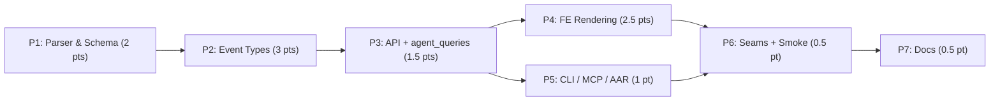

# Implementation Plan: JSONL Shape Gap Coverage

**Plan ID**: `IMPL-2026-05-19-JSONL-SHAPE-GAP-COVERAGE`
**Date**: 2026-05-19
**Author**: implementation-planner (sonnet)
**Human Brief**: N/A — not created (11 pts, borderline; decisions block + PRD carry the orchestration view)
**Related Documents**:
- **PRD**: `docs/project_plans/PRDs/enhancements/jsonl-shape-gap-coverage-v1.md`
- **Decisions block**: `.claude/worknotes/jsonl-shape-gap-coverage/decisions-block.md`
- **Audit findings**: `.claude/worknotes/jsonl-shape-audit/findings-2026-05-19.md`

**Complexity**: Medium | **Total Estimated Effort**: 11 pts | **Target Timeline**: 3–4 weeks

---

## Executive Summary

This plan closes all 13 Claude Code JSONL shape gaps identified in the 2026-05-19 audit via seven strictly-ordered phases that follow CCDash's additive-only constraint. Phases 1–3 form the critical path (parser/schema → event types → API surface); Phases 4 and 5 run in parallel once P3 is stable; Phase 6 validates end-to-end seams and smoke-tests every new UI surface; Phase 7 finalizes documentation and the CHANGELOG entry. Every new optional backend field introduced in Phases 1–2 has a paired R-P2 FE fallback task in Phase 4. Estimation rationale lives in PRD §9 (H1–H6); this plan references PRD §9, not re-derives it.

---

## Implementation Strategy

### Architecture Sequence

CCDash layered architecture for this feature:
1. **Parser** (`backend/parsers/platforms/claude_code/parser.py`) — reads JSONL, populates `AgentSession`
2. **Models + Migration** (`backend/models.py`, `backend/db/migrations.py`) — nullable column-add for both SQLite and PostgreSQL
3. **Repository** (`backend/db/repositories/sessions.py`) — persist and read new columns
4. **Agent queries** (`backend/application/services/agent_queries/`) — transport-neutral forensics layer
5. **Routers** (`backend/routers/api.py`, `backend/routers/agent.py`) — REST exposure
6. **MCP + CLI** (`backend/mcp/server.py`, `backend/cli/`) — additional transports
7. **Frontend** (`types.ts`, `components/SessionInspector.tsx`, `components/Planning/PlanningAgentSessionBoard.tsx`) — rendering with explicit null fallbacks
8. **Documentation** — CHANGELOG, README, skill SPEC if needed

### Parallel Work Opportunities

- **Within P1**: parser captures (Task T1-001) and model/migration changes (Tasks T1-002, T1-003) are file-disjoint → `batch_1` parallel.
- **Within P4**: each new FE widget targets disjoint component regions → batch up to 4 in parallel.
- **P4 ∥ P5**: file-disjoint after P3 merges (`components/**` vs `packages/ccdash_cli/**` + `backend/mcp/**`).

### Critical Path

```
P1 → P2 → P3 → P6 → P7
```

P4 and P5 are off the critical path and can run in parallel after P3.



### Phase Summary

Canonical orchestration index. Keep in sync with detailed phase breakdowns.

| Phase | Name | Estimate | Primary Subagent(s) | Secondary Subagent | Model(s) | Effort | AC IDs Covered |
|-------|------|----------|---------------------|--------------------|----------|--------|----------------|
| P1 | Parser & Schema Enrichment | 2 pts | python-backend-engineer | data-layer-expert | sonnet | adaptive | AC-A1…A6 |
| P2 | New Event-Type Handling | 3 pts | python-backend-engineer | — | sonnet | extended | AC-B1…B5, AC-C7 |
| P3 | API + agent_queries Exposure | 1.5 pts | python-backend-engineer | backend-typescript-architect | sonnet | adaptive | AC-A2, AC-A3, AC-A5, AC-A6, AC-B5, AC-C6 |
| P4 | Transcript & Session Inspector FE | 2.5 pts | ui-engineer-enhanced | frontend-developer | sonnet | adaptive | AC-C1…C5, AC-C7, AC-B1 (FE), AC-B3 (FE), AC-B4 (FE) |
| P5 | Forensics CLI / MCP / AAR | 1 pt | python-backend-engineer | — | sonnet | adaptive | AC-C6, AC-C4 (MCP) |
| P6 | Integration Seams + Cross-Surface Smoke | 0.5 pt | task-completion-validator | ui-engineer-enhanced | sonnet | extended | All R-P1 target_surfaces |
| P7 | Documentation Finalization | 0.5 pt | documentation-writer | ai-artifacts-engineer | haiku (docs); sonnet (skill SPEC, conditional) | adaptive | — |
| **Total** | — | **11 pts** | — | — | — | — | — |

---

## Deferred Items & In-Flight Findings Policy

### Deferred Items

No deferred items at plan creation. The findings doc (`.claude/worknotes/jsonl-shape-audit/findings-2026-05-19.md`) is a backward-looking source confirming the gaps — it is not an in-flight findings doc. All 13 audit gaps are in scope.

| Item ID | Category | Reason Deferred | Trigger for Promotion | Target Spec Path |
|---------|----------|-----------------|-----------------------|-----------------|
| — | — | N/A — no deferred items | — | — |

### In-Flight Findings

Lazy-create `.claude/findings/jsonl-shape-gap-coverage-findings.md` on first real finding; set `findings_doc_ref` in this plan's frontmatter at that time.

---

## Phase Breakdown

**Column conventions**: `Estimate` = story points; `Effort` = model reasoning budget (`adaptive`/`extended` for Claude); never mix.

---

### Phase 1: Parser & Schema Enrichment (Bucket A)

**Estimate**: 2 pts | **Dependencies**: None
**Primary**: python-backend-engineer | **Secondary**: data-layer-expert
**Model default**: sonnet / adaptive
**integration_owner**: python-backend-engineer (sole owner; no FE overlap in this phase)
**Exit gate**: `task-completion-validator` confirms additive-only schema diff + migration round-trip on both DB backends.

#### Batch Definitions

- `batch_1`: [T1-001 (parser captures), T1-002 (model fields + types.ts), T1-003 (DB migrations)] — T1-001 owns `parser.py`; T1-002 owns `models.py` + `types.ts`; T1-003 owns `migrations.py` — file-disjoint, run in parallel.
- `batch_2`: [T1-004 (unit tests), T1-005 (CI migration smoke)] — sequential after batch_1 writes stabilize.
- `batch_3`: [T1-006 (phase reviewer)] — terminal gate.

#### Task Table

| Task ID | Name | Description | Acceptance Criteria | Estimate | Subagent(s) | Model | Effort | Files Affected | AC Refs |
|---------|------|-------------|---------------------|----------|-------------|-------|--------|----------------|---------|
| T1-001 | Parser field captures | Extend `record_entry_context` (~L2219) to accumulate `attributionSkill`, `attributionPlugin`, `promptId`, `sessionKind` per entry. Extend session-assembly block (~L1857) to roll into `skillsUsed`, `pluginsUsed`, `promptId`. Add `thinking.signature` capture alongside thinking-block text. Add `bridge-session` branch for `bridgeSessionId`/`lastSequenceNum`. | All 8 fields captured on fixture parse; null-safe on fixtures missing fields. | 0.75 pt | python-backend-engineer | sonnet | adaptive | `backend/parsers/platforms/claude_code/parser.py` | AC-A1, AC-A2, AC-A3, AC-A4, AC-A5, AC-A6 |
| T1-002 | Model fields + types.ts | Add nullable fields to `AgentSession` in `backend/models.py`: `session_kind`, `prompt_id`, `leaf_uuid`, `bridge_session_id`, `last_sequence_num`, `plugins_used` (JSON array), `ai_title_source`, `permission_mode_transitions` (JSON), `turn_durations` (JSON), `away_summaries` (JSON), `thinking_signatures` (JSON). Mirror all new fields in `types.ts`. | Fields present in both Python model and TypeScript interface; all nullable. | 0.5 pt | python-backend-engineer | sonnet | adaptive | `backend/models.py`, `types.ts` | AC-A1…A6 |
| T1-003 | DB migrations (SQLite + PostgreSQL) | Add `ALTER TABLE agent_sessions ADD COLUMN …` for all 11 new columns. Both SQLite and PostgreSQL paths covered; `prompt_id` gets an index. Add `CONCURRENTLY` qualifier on the PostgreSQL index path (per PRD §10 risk note). | Migrations run idempotently on SQLite default and `CCDASH_DB_BACKEND=postgres`; index present on `prompt_id`. | 0.5 pt | data-layer-expert | sonnet | adaptive | `backend/db/migrations.py` | AC-A1, AC-A3, AC-A5, AC-A6 |
| T1-004 | Parser unit tests (Bucket A) | Fixture-based tests: each new field populated from a synthetic JSONL fixture. Separate fixture with all new fields absent confirms null-safe behavior. | 8 fixture assertions pass; null-fixture test green. | 0.25 pt | python-backend-engineer | sonnet | adaptive | `backend/tests/` | AC-A1…A6 |
| T1-005 | CI migration smoke (both backends) | Add a CI step (or test) that runs the migration sequence against both `CCDASH_DB_BACKEND=sqlite` and `CCDASH_DB_BACKEND=postgres` in the test suite. | Migration round-trip passes on both backends; no column-missing errors. | 0.25 pt | data-layer-expert | sonnet | adaptive | `backend/tests/`, CI config | AC-A1, OQ-3 resolution |
| T1-006 | Phase reviewer gate | `task-completion-validator` reviews: schema diff is additive-only, both backend migration tests pass, AC-A1…A6 unit tests green. | Reviewer approves or returns with blocking issues. | — | task-completion-validator | sonnet | extended | — | AC-A1…A6 |

**Phase 1 Quality Gates:**
- [ ] All 8 new fields captured on fixture with data; null-safe on fixture without.
- [ ] DB migrations run on both SQLite and PostgreSQL without error.
- [ ] `prompt_id` index created on `agent_sessions` table.
- [ ] Schema diff is additive-only (no DROP, no NOT NULL without DEFAULT).
- [ ] `task-completion-validator` sign-off.

---

### Phase 2: New Event-Type Handling (Bucket B)

**Estimate**: 3 pts | **Dependencies**: P1
**Primary**: python-backend-engineer | **Secondary**: none (sole owner of `parser.py` in this phase)
**Model default**: sonnet / extended (14-subtype dispatch has classification nuance per decisions block §6)
**integration_owner**: python-backend-engineer
**Exit gate**: Fixture coverage for each new event type + every attachment subtype + unknown-subtype fallback test green; `task-completion-validator` confirms.

#### Batch Definitions

Sequential within `parser.py` to avoid merge conflicts. Each task is a discrete parser region:
- `batch_1`: [T2-001 (attachment branch)] — largest change, isolate first.
- `batch_2`: [T2-002 (ai-title), T2-003 (last-prompt), T2-004 (permission-mode), T2-005 (bridge-session guard)] — smaller independent branches; file-disjoint from attachment logic if coded as separate elif branches.
- `batch_3`: [T2-006 (system.subtype dispatch), T2-007 (tool-category classifier)] — disjoint parser regions.
- `batch_4`: [T2-008 (unit tests), T2-009 (phase reviewer)] — terminal.

#### Task Table

| Task ID | Name | Description | Acceptance Criteria | Estimate | Subagent(s) | Model | Effort | Files Affected | AC Refs |
|---------|------|-------------|---------------------|----------|-------------|-------|--------|----------------|---------|
| T2-001 | Attachment branch (14 subtypes) | Add `type: "attachment"` branch with per-subtype dispatch table. 6 subtypes (`hook_success`, `file`, `nested_memory`, `edited_text_file`, `opened_file_in_ide`, `selected_lines_in_ide`) additionally call `add_artifact()`. All subtypes produce a `"attachment:<subtype>"` system-log entry. Unknown subtype: log `attachment.unknown_subtype` at DEBUG and store as `"attachment:unknown"`. | All 14 subtypes handled; `"attachment:unknown"` fixture handled without exception; `add_artifact()` called for 6 artifact-bearing subtypes. | 1.25 pt | python-backend-engineer | sonnet | extended | `backend/parsers/platforms/claude_code/parser.py` | AC-B1, OQ-1 (denormalized lean confirmed) |
| T2-002 | ai-title branch | New `type: "ai-title"` branch: set `AgentSession.title` from `aiTitle` when `titleSource != "manual"`; set `aiTitleSource = "ai-title"`. | Fixture with `ai-title` sets title; fixture with `titleSource: "manual"` does NOT override. | 0.25 pt | python-backend-engineer | sonnet | extended | `backend/parsers/platforms/claude_code/parser.py` | AC-B2 |
| T2-003 | last-prompt branch | New `type: "last-prompt"` branch: capture `lastPrompt` snippet (first 200 chars) and `leafUuid` into session metadata. | `leafUuid` and `lastPromptSnippet` populated from fixture; absent when event missing. | 0.25 pt | python-backend-engineer | sonnet | extended | `backend/parsers/platforms/claude_code/parser.py` | AC-B3, AC-A5 (leafUuid) |
| T2-004 | permission-mode branch | New `type: "permission-mode"` transition branch: append `{timestamp, mode}` to `permissionModeTransitions[]`. | Transition list has correct entries from fixture; list empty when event absent. | 0.25 pt | python-backend-engineer | sonnet | extended | `backend/parsers/platforms/claude_code/parser.py` | AC-B4, OQ-4 (per-turn timeline confirmed) |
| T2-005 | bridge-session guard | Verify/reinforce `type: "bridge-session"` branch (started in T1-001) does not conflict with new event branches; add test coverage. | `bridgeSessionId`/`lastSequenceNum` captured; no branch collision. | 0.1 pt | python-backend-engineer | sonnet | adaptive | `backend/parsers/platforms/claude_code/parser.py` | AC-A6 |
| T2-006 | system.subtype dispatch (4 new values) | Extend `system` entry dispatch for `turn_duration` (append to `turnDurations[]`), `away_summary` (create artifact `kind: "away_summary"`, truncate at 8 KB), `bridge_status` (append to system event log), `local_command` (append to system event log). Add `agent-setting` and `agent-name` low-volume stubs (metadata stored, no UI). | All 4 subtypes produce correct output; fixture with all 4 passes; `away_summary` content truncated at 8 KB. | 0.5 pt | python-backend-engineer | sonnet | extended | `backend/parsers/platforms/claude_code/parser.py` | AC-B5 |
| T2-007 | Tool-category classifier extension | Add `TaskCreate`, `TaskUpdate`, `TaskList`, `Monitor`, `EnterWorktree`, `ExitWorktree`, `AskUserQuestion`, `ToolSearch`, `SendMessage`, `NotebookEdit` to the classifier near `parser.py ~L3066–3140`. Each maps to a `toolCategory` value. Unclassified names fall back to `"other"`. | All 10 new tool names classify correctly; test with unknown name returns `"other"`. | 0.25 pt | python-backend-engineer | sonnet | adaptive | `backend/parsers/platforms/claude_code/parser.py` | AC-C7 |
| T2-008 | Parser unit tests (Bucket B) | One fixture per new event type; attachment fixture covers all 14 subtypes + 1 unknown-subtype fixture; system.subtype fixture covers all 4 new values. | All Bucket B fixtures pass; unknown-attachment fallback test green; no regressions in existing tests. | 0.25 pt | python-backend-engineer | sonnet | adaptive | `backend/tests/` | AC-B1…B5, AC-C7 |
| T2-009 | Phase reviewer gate | `task-completion-validator` reviews: fixture coverage, unknown-subtype fallback, no regressions to existing parser branches. | Reviewer approves. | — | task-completion-validator | sonnet | extended | — | AC-B1…B5 |

**Phase 2 Quality Gates:**
- [ ] All 14 attachment subtypes produce system-log entries.
- [ ] Unknown-subtype fallback fixture passes (no exception; stores as `"attachment:unknown"`).
- [ ] All 4 new `system.subtype` values handled.
- [ ] All 10 new tool names classify correctly.
- [ ] No regressions in existing parser branch tests.
- [ ] `task-completion-validator` sign-off.

---

### Phase 3: API + agent_queries Exposure

**Estimate**: 1.5 pts | **Dependencies**: P2
**Primary**: python-backend-engineer | **Secondary**: backend-typescript-architect
**Model default**: sonnet / adaptive
**integration_owner**: python-backend-engineer (BE owner) + backend-typescript-architect (types.ts seam)
**Exit gate**: `task-completion-validator` confirms transport-neutral layer is single source of truth; contract tests pass; `types.ts` in sync.

#### Batch Definitions

- `batch_1`: [T3-001 (repository updates), T3-002 (router endpoints), T3-003 (agent_queries surfaces)] — T3-001 owns `repositories/sessions.py`; T3-002 owns `routers/api.py` + `routers/agent.py`; T3-003 owns `agent_queries/` — file-disjoint, run in parallel.
- `batch_2`: [T3-004 (MCP tools), T3-005 (CLI subcommands)] — parallel; own disjoint files.
- `batch_3`: [T3-006 (types.ts + OpenAPI regen), T3-007 (contract tests)] — sequential after batch_1+2.
- `batch_4`: [T3-008 (phase reviewer)] — terminal.

#### Task Table

| Task ID | Name | Description | Acceptance Criteria | Estimate | Subagent(s) | Model | Effort | Files Affected | AC Refs |
|---------|------|-------------|---------------------|----------|-------------|-------|--------|----------------|---------|
| T3-001 | Repository: persist + read new columns | Update `backend/db/repositories/sessions.py` to write and read all 11 new `AgentSession` columns in INSERT/SELECT. | Repository round-trip test: session written with all new fields; re-read returns same values. | 0.25 pt | python-backend-engineer | sonnet | adaptive | `backend/db/repositories/sessions.py` | AC-A1…A6, AC-B5 |
| T3-002 | Router: new query params + response fields | Update `GET /api/sessions` to accept `prompt_id` and `leaf_uuid` query params. Update `GET /api/sessions/{id}` response to include all new fields. Wire into `backend/routers/api.py` and `backend/routers/agent.py`. | New query params filter correctly; response includes all new fields; existing fields unchanged. | 0.25 pt | python-backend-engineer | sonnet | adaptive | `backend/routers/api.py`, `backend/routers/agent.py` | AC-A5, AC-C6 |
| T3-003 | agent_queries: forensics surfaces | Add `search_by_prompt_id(prompt_id)`, `trace_leaf_uuid(leaf_uuid)`, `attribution_breakdown(session_id)` to `backend/application/services/agent_queries/`. Wire into `backend/routers/agent.py` endpoints. | Three new agent_query surfaces callable from REST; no SQL in router; transport-neutral. | 0.4 pt | python-backend-engineer | sonnet | adaptive | `backend/application/services/agent_queries/`, `backend/routers/agent.py` | AC-A5, AC-C6, AC-C4, OQ-5 (agent_queries confirmed as home) |
| T3-004 | MCP tools | Add to `backend/mcp/server.py`: `search_sessions_by_prompt_id`, `trace_leaf_uuid`, `get_attribution_breakdown`. Each tool delegates to the agent_queries surface from T3-003. | MCP tools callable in JSON-mode; return correct shapes; registered in MCP server. | 0.2 pt | python-backend-engineer | sonnet | adaptive | `backend/mcp/server.py` | AC-C6, AC-C4 |
| T3-005 | CLI subcommands | Add `ccdash session search --prompt-id <id>` and `ccdash session show --leaf-uuid <id>` to `backend/cli/`. Both support `--json` flag. | CLI exits 0 with results on match; empty list on no match; `--json` returns valid JSON; 400 on malformed id. | 0.2 pt | python-backend-engineer | sonnet | adaptive | `backend/cli/` | AC-C6 |
| T3-006 | types.ts + OpenAPI regen | backend-typescript-architect mirrors all new `AgentSession` fields into `types.ts` frontend interface. Confirms OpenAPI regeneration includes new query params and response fields. | `types.ts` `AgentSession` interface matches Python model field-for-field; OpenAPI diff shows new params. | 0.1 pt | backend-typescript-architect | sonnet | adaptive | `types.ts` | AC-A1…A6 |
| T3-007 | Contract tests | API contract tests: `GET /api/sessions?prompt_id=`, `GET /api/sessions/{id}` returns all new fields, `attribution_breakdown` endpoint, MCP JSON-mode regression for 3 new tools. | All contract tests pass in CI. | 0.1 pt | python-backend-engineer | sonnet | adaptive | `backend/tests/` | AC-A5, AC-C4, AC-C6 |
| T3-008 | Phase reviewer gate + seam check (R-P3) | `task-completion-validator` confirms: agent_queries is transport-neutral (no router-side SQL), types.ts in sync with models.py, OpenAPI regen clean. Seam check: T3-006 types.ts delta consumed by P4 without type mismatch. | Reviewer approves; seam contract documented. | — | task-completion-validator | sonnet | extended | — | R-P3 |

**Phase 3 Quality Gates:**
- [ ] Repository round-trip for all 11 new columns.
- [ ] `GET /api/sessions?prompt_id=` returns correct sessions.
- [ ] `search_by_prompt_id`, `trace_leaf_uuid`, `attribution_breakdown` in agent_queries; no SQL in routers.
- [ ] MCP tools registered and callable.
- [ ] CLI subcommands pass exit-0 and `--json` tests.
- [ ] `types.ts` in sync with `models.py`.
- [ ] `task-completion-validator` sign-off.

---

### Phase 4: Transcript & Session Inspector Rendering (FE)

**Estimate**: 2.5 pts | **Dependencies**: P3 (can start immediately after P3 merges)
**Primary**: ui-engineer-enhanced | **Secondary**: frontend-developer
**Model default**: sonnet / adaptive
**integration_owner**: ui-engineer-enhanced (R-P3: P1↔P4 and P3↔P4 seams declared here)
**Exit gate**: Vitest passes; manual runtime smoke confirms pre-enrichment sessions render without regressions; `task-completion-validator` sign-off.

**R-P2 contract**: Every new optional backend field from P1/P2/P3 has a paired null/missing-field task in this phase. The task table below includes explicit fallback ACs for each new field.

#### Batch Definitions

- `batch_1`: [T4-001 (attachment cards), T4-002 (permission-mode chips), T4-003 (turn-duration histogram), T4-004 (away-summary banner)] — each targets disjoint regions of `SessionInspector.tsx`; parallel.
- `batch_2`: [T4-005 (promptId/leafUuid forensics row), T4-006 (attribution rollup panel), T4-007 (sessionKind badge + churn metric)] — disjoint; parallel.
- `batch_3`: [T4-008 (null-handling tests), T4-009 (FE unit tests), T4-010 (perf guard)] — sequential after batch_1+2 stabilize.
- `batch_4`: [T4-011 (phase reviewer gate)] — terminal.

#### Task Table

| Task ID | Name | Description | Acceptance Criteria | Estimate | Subagent(s) | Model | Effort | Files Affected | AC Refs |
|---------|------|-------------|---------------------|----------|-------------|-------|--------|----------------|---------|
| T4-001 | Attachment cards in transcript | Add collapsible `AttachmentCard` component to `SessionInspector.tsx` transcript log renderer. Card header: subtype icon + label. Body: subtype-relevant fields (hookName + exitCode for hook_success; filename for file; path for nested_memory; etc.). Unknown subtype: generic "attachment" card with "(no detail available)". **FE fallback (R-P2):** card payload malformed or empty → render header only, no throw. | Fixture session with hook_success, file, nested_memory cards renders correctly. Unknown subtype renders generic card. Malformed payload renders header only. Visual evidence: desktop ≥1440px screenshot (hook_success expanded). | 0.6 pt | ui-engineer-enhanced | sonnet | adaptive | `components/SessionInspector.tsx` | AC-B1, AC-C1 |
| T4-002 | Permission-mode chips | Render `{timestamp, mode}` entries from `permissionModeTransitions[]` as chips inline at the correct timestamp position in the transcript timeline. **FE fallback (R-P2):** `permissionModeTransitions` null or empty → no chips rendered, no error state. | Fixture session shows chips between message entries at correct positions. Empty array → zero chips, no layout gap. Visual evidence: desktop ≥1440px screenshot. | 0.4 pt | ui-engineer-enhanced | sonnet | adaptive | `components/SessionInspector.tsx`, `components/Planning/PlanningAgentSessionBoard.tsx` | AC-B4, OQ-4 confirmed |
| T4-003 | Turn-duration histogram | Add small bar histogram in session summary panel driven by `turnDurations[]`. Tooltip: `messageCount` per turn. **FE fallback (R-P2):** `turnDurations` null or empty → panel hidden entirely (not an empty chart frame). | Fixture with 3+ turn_duration entries renders histogram. Empty array → panel hidden. Visual evidence: desktop ≥1440px. | 0.4 pt | frontend-developer | sonnet | adaptive | `components/SessionInspector.tsx` | AC-B5, AC-C2 |
| T4-004 | Away-summary banner | Render most-recent `awaySummaries` entry as a collapsible banner at top of transcript. Label: "Session summary (away)" + timestamp. **FE fallback (R-P2):** `awaySummaries` empty or null → banner absent (no empty frame). | Fixture with away_summary shows banner with model text. Empty → no banner. Visual evidence: desktop ≥1440px. | 0.4 pt | ui-engineer-enhanced | sonnet | adaptive | `components/SessionInspector.tsx` | AC-B5, AC-C3 |
| T4-005 | promptId/leafUuid forensics row | Render a "Forensics" metadata row in session header showing `promptId` and `leafUuid` values. Values are copy-to-clipboard. **FE fallback (R-P2):** both null → row absent; one null, one present → partial display. | Row with both values renders; copy-to-clipboard functional. Both null → row absent. One null, one present → partial. | 0.3 pt | ui-engineer-enhanced | sonnet | adaptive | `components/SessionInspector.tsx` | AC-A5, AC-C5 |
| T4-006 | Attribution rollup panel | Add `skillsUsed` + `pluginsUsed` rollup panel in session metadata/analytics tab AND in `PlanningAgentSessionBoard.tsx` expanded card. Each list: name → count, sorted descending. **FE fallback (R-P2):** both lists empty or null → panel hidden; one list present → render only that list. | Panel with skill+plugin data renders. Empty both → hidden. One present → renders that list. | 0.4 pt | ui-engineer-enhanced | sonnet | adaptive | `components/SessionInspector.tsx`, `components/Planning/PlanningAgentSessionBoard.tsx` | AC-A2, AC-A3, AC-C4 |
| T4-007 | sessionKind badge + snapshot-churn metric | Render "BG" badge on session list cards and `PlanningAgentSessionBoard` cards when `sessionKind == "bg"`. Render snapshot-churn metric (isSnapshotUpdate count / total file-history-snapshot count) in session summary. Add ai-title provenance line and last-prompt resume hint row in session header. **FE fallback (R-P2):** `sessionKind` null → no badge; `leafUuid` null → no resume hint row. | BG badge shows for fixture with `sessionKind: "bg"`. No badge when null. Resume hint shows for fixture with leafUuid. Hidden when null. | 0.3 pt | frontend-developer | sonnet | adaptive | `components/SessionInspector.tsx`, `components/Planning/PlanningAgentSessionBoard.tsx` | AC-A1, AC-B2, AC-B3, AC-C5 |
| T4-008 | Null-handling tests (R-P2 verification) | One Vitest test per new component prop: null-input fixture confirms no render crash, no "undefined" string, no empty placeholder shown when field must be absent. | All null-input Vitest tests pass. | 0.25 pt | ui-engineer-enhanced | sonnet | adaptive | `components/__tests__/`, `services/__tests__/` | AC-A1, AC-A3, AC-B1, AC-B3, AC-B4, AC-C2, AC-C3, AC-C5 |
| T4-009 | FE unit tests (component rendering) | One Vitest test per new component widget covering: data-present render, empty/null render, interaction (copy, expand). | All component unit tests pass. | 0.25 pt | frontend-developer | sonnet | adaptive | `components/__tests__/` | AC-C1, AC-C2, AC-C3, AC-C4, AC-C5, AC-C7 |
| T4-010 | Perf guard (Risk 3 mitigation) | Run `codebase-explorer` against existing virtualization patterns in `SessionInspector.tsx`. Confirm attachment cards lazy-render payload bodies on expand (not upfront). If existing virtualization present, verify it covers new card kinds. | Attachment card body not pre-rendered; expand triggers body load. Scroll perf baseline preserved (no jank on 500-event fixture). | 0.1 pt | ui-engineer-enhanced | sonnet | adaptive | `components/SessionInspector.tsx` | Risk 3 mitigation |
| T4-011 | Phase reviewer gate | `task-completion-validator` confirms: all R-P2 null-handling tests pass; Vitest suite green; no "undefined" string literals in new component render paths. | Reviewer approves. | — | task-completion-validator | sonnet | extended | — | R-P2, R-P4 |

**Phase 4 Quality Gates:**
- [ ] All new component widgets render with data-present and null/empty fixtures.
- [ ] No "undefined" strings, no crashes on missing fields.
- [ ] Visual evidence screenshots captured for: AC-B1 (hook_success card expanded), AC-B4 (permission-mode chip), AC-C2 (histogram), AC-C3 (away-summary banner). Desktop ≥1440px.
- [ ] Lazy-render confirmed for attachment card bodies.
- [ ] Vitest suite passes (no regressions).
- [ ] `task-completion-validator` sign-off.

---

### Phase 5: Forensics Rollups via CLI / MCP / AAR

**Estimate**: 1 pt | **Dependencies**: P3 (parallel with P4)
**Primary**: python-backend-engineer | **Secondary**: none
**Model default**: sonnet / adaptive
**integration_owner**: python-backend-engineer
**Exit gate**: `task-completion-validator` confirms CLI + MCP + AAR parity with REST query surfaces.

#### Batch Definitions

- `batch_1`: [T5-001 (CLI end-to-end tests), T5-002 (MCP regression tests), T5-003 (AAR integration)] — tests are file-disjoint; parallel.
- `batch_2`: [T5-004 (PlanningAgentSessionBoard top-plugins widget)] — FE addition; separate file.
- `batch_3`: [T5-005 (promptId index decision), T5-006 (phase reviewer)] — T5-005 is a decision/implementation task; terminal.

#### Task Table

| Task ID | Name | Description | Acceptance Criteria | Estimate | Subagent(s) | Model | Effort | Files Affected | AC Refs |
|---------|------|-------------|---------------------|----------|-------------|-------|--------|----------------|---------|
| T5-001 | CLI end-to-end tests | End-to-end tests against a local fixture DB: `ccdash session search --prompt-id <id>` (match, no-match, malformed id). `ccdash session show --leaf-uuid <id>` (match, no-match). Both `--json` mode. | All 6 test cases pass; exit codes correct; JSON output validates. | 0.3 pt | python-backend-engineer | sonnet | adaptive | `packages/ccdash_cli/tests/`, `backend/tests/` | AC-C6 |
| T5-002 | MCP regression tests | JSON-mode regression for: `search_sessions_by_prompt_id` (match + no-match), `trace_leaf_uuid` (match + no-match), `get_attribution_breakdown` (session with data, session without). | MCP tool tests pass; output shapes match data contracts (PRD §6.3). | 0.25 pt | python-backend-engineer | sonnet | adaptive | `backend/tests/test_mcp_server.py` | AC-C4, AC-C6 |
| T5-003 | AAR report attribution integration | Update AAR report inputs in agent_queries to include `skillsUsed`/`pluginsUsed` breakdown per session. Test: fixture session with known `attributionSkill` values appears in AAR attribution section. | AAR attribution section includes skill/plugin breakdown; fixture test passes. | 0.2 pt | python-backend-engineer | sonnet | adaptive | `backend/application/services/agent_queries/` | AC-C4 (AAR) |
| T5-004 | PlanningAgentSessionBoard top-plugins widget | Add top-5 `pluginsUsed` aggregate widget to `PlanningAgentSessionBoard.tsx`. Aggregate across all sessions in board; show top-5 bar; empty state when no plugin data. **FE fallback (R-P2):** no plugin data → empty state, not crash. | Top-5 widget renders with fixture data; empty state renders when no data; no crash. | 0.2 pt | python-backend-engineer | sonnet | adaptive | `components/Planning/PlanningAgentSessionBoard.tsx` | AC-C4 |
| T5-005 | promptId index decision (OQ-2 resolution) | Evaluate whether CLI/MCP forensics filters land from T5-001/T5-002. If queries filter by `prompt_id` and the index from T1-003 is confirmed necessary (query plan shows seq scan), document rationale in migration comment. If index already present from P1, mark resolved. | OQ-2 explicitly resolved: index status documented and justified; no ambiguity. | 0.05 pt | python-backend-engineer | sonnet | adaptive | `backend/db/migrations.py` (comment) | OQ-2 |
| T5-006 | Phase reviewer gate | `task-completion-validator` confirms parity: REST + CLI + MCP query surfaces return consistent shapes for the same input. | Reviewer approves. | — | task-completion-validator | sonnet | extended | — | AC-C4, AC-C6 |

**Phase 5 Quality Gates:**
- [ ] CLI `--prompt-id` and `--leaf-uuid` tests pass (6 cases).
- [ ] MCP regression tests pass for all 3 new tools.
- [ ] AAR attribution section populated in fixture test.
- [ ] OQ-2 (promptId index) explicitly resolved.
- [ ] `task-completion-validator` sign-off with REST/CLI/MCP parity confirmation.

---

### Phase 6: Integration Seams + Cross-Surface Smoke

**Estimate**: 0.5 pt | **Dependencies**: P4 + P5
**Primary**: task-completion-validator | **Secondary**: ui-engineer-enhanced
**Model default**: sonnet / extended (cross-owner contract verification)
**integration_owner**: task-completion-validator (authors seam contract trace); ui-engineer-enhanced (executes runtime smoke)
**Exit gate**: Runtime smoke artifact (console-clean + visual confirmation) attached to phase progress.

#### Batch Definitions

- `batch_1`: [T6-001 (seam test: JSONL → DB), T6-002 (seam test: API → FE type match)] — independent seam assertions; parallel.
- `batch_2`: [T6-003 (runtime smoke — new-shape JSONL), T6-004 (runtime smoke — pre-enrichment JSONL)] — sequential (same dev server); parallel across distinct sessions possible.
- `batch_3`: [T6-005 (regression: existing parser tests), T6-006 (end-of-phase reviewer + karen kick-off)] — terminal.

#### Task Table

| Task ID | Name | Description | Acceptance Criteria | Estimate | Subagent(s) | Model | Effort | Files Affected | AC Refs |
|---------|------|-------------|---------------------|----------|-------------|-------|--------|----------------|---------|
| T6-001 | Seam test: JSONL → parser → DB | Parse a fixture JSONL containing all new event types; assert DB row has all 11 new columns populated correctly; confirm no data loss in attachment system-log entries. | DB assertion test passes; all columns populated from fixture; zero attachment events lost. | 0.15 pt | task-completion-validator | sonnet | extended | `backend/tests/` | AC-B1, AC-B5, R-P3 seam (P1↔P4) |
| T6-002 | Seam test: API → FE type consistency | Verify `GET /api/sessions/{id}` response shape matches `types.ts AgentSession` interface field-for-field. No type mismatch between P3 API changes and P4 FE component props. | TypeScript compilation passes with no type errors on updated `types.ts`; API response shape verified. | 0.1 pt | task-completion-validator | sonnet | extended | — (verification only) | R-P3 seam (P3↔P4) |
| T6-003 | Runtime smoke: new-shape JSONL session | Start dev server; open Session Inspector on a fixture session with all new fields. Enumerate R-P1 `target_surfaces`: (1) `components/SessionInspector.tsx` — attachment cards, permission-mode chips, turn-duration histogram, away-summary banner, promptId/leafUuid forensics row, attribution rollup panel; (2) `components/Planning/PlanningAgentSessionBoard.tsx` — sessionKind badge, attribution panel. Assert each surface renders its data. Console must be clean (no errors, no "undefined" strings). | All 8 target surfaces render data from new-shape fixture. Zero console errors. | 0.15 pt | ui-engineer-enhanced | sonnet | adaptive | Dev server (no file changes) | R-P4, AC-B1, AC-B4, AC-C1, AC-C2, AC-C3, AC-C4, AC-C5 |
| T6-004 | Runtime smoke: pre-enrichment session (R-P2 verification) | Open Session Inspector on a pre-enrichment JSONL session (all new fields absent). Assert: no "—" gap visual noise, no empty placeholder frames, no console errors. Specifically check: no BG badge, no permission chips, no histogram, no away banner, no forensics row, no attribution panel. | Zero R-P2 regressions: absent fields render as "field absent" state, not empty UI. Console clean. | 0.1 pt | ui-engineer-enhanced | sonnet | adaptive | Dev server (no file changes) | R-P2, Risk 5 mitigation |
| T6-005 | Regression: existing parser + FE tests | Run full test suite; confirm no regressions in any existing parser branch, repository, or FE component tests. | All pre-existing tests pass. | — | task-completion-validator | sonnet | extended | — | General regression gate |
| T6-006 | Phase reviewer + karen end-of-feature | `task-completion-validator` final review with smoke artifact attached. `karen` end-of-feature pass: confirm all AC-A1…A6, AC-B1…B5, AC-C1…C7 are verifiably covered; no open AC without a `verified_by` task. | Validator and karen both approve. | — | task-completion-validator, karen | sonnet | extended | — | All ACs |

**Phase 6 Quality Gates:**
- [ ] JSONL→DB seam test passes for all 11 new columns.
- [ ] API→FE type seam: zero TypeScript type errors.
- [ ] Runtime smoke (new-shape): all 8 R-P1 target surfaces render data; console clean.
- [ ] Runtime smoke (pre-enrichment): all R-P2 fallbacks active; no visual noise; console clean.
- [ ] All existing tests pass (zero regressions).
- [ ] `task-completion-validator` sign-off with smoke artifact.
- [ ] `karen` end-of-feature approval.

---

### Phase 7: Documentation Finalization

**Estimate**: 0.5 pt | **Dependencies**: P6
**Primary**: documentation-writer | **Secondary**: ai-artifacts-engineer (conditional on P5 CLI commands landing)
**Model default**: haiku / adaptive (docs); sonnet / adaptive for skill SPEC if needed
**Exit gate**: CHANGELOG `[Unreleased]` entry present; markdown lint passes; reviewer sign-off.

#### Batch Definitions

- `batch_1`: [T7-001 (CHANGELOG entry), T7-002 (README/docs delta), T7-003 (CLAUDE.md pointer)] — parallel; disjoint files.
- `batch_2`: [T7-004 (ccdash skill SPEC — CONDITIONAL), T7-005 (cli-timeout-debugging cross-link — CONDITIONAL)] — only if P5 ships new CLI flags.
- `batch_3`: [T7-006 (plan frontmatter finalization), T7-007 (deferred items + findings confirmation), T7-008 (feature guide), T7-009 (phase reviewer)] — terminal.

#### Task Table

| Task ID | Name | Description | Acceptance Criteria | Estimate | Subagent(s) | Model | Effort | Files Affected | AC Refs |
|---------|------|-------------|---------------------|----------|-------------|-------|--------|----------------|---------|
| T7-001 | CHANGELOG `[Unreleased]` entry | Add `[Unreleased]` entry under `Added` category covering: new attachment/permission-mode/turn-duration/away-summary surfaces in Session Inspector; `sessionKind` background-session labeling; `promptId`/`leafUuid` forensics search via CLI (`--prompt-id`, `--leaf-uuid`) and MCP; attribution rollup panel. Categorization: `Added` per `.claude/specs/changelog-spec.md`. | Entry exists under `[Unreleased]`; correct category; `changelog_ref` frontmatter set. | 0.15 pt | changelog-generator | haiku | adaptive | `CHANGELOG.md` | changelog_required: true |
| T7-002 | README + CLI guide delta | Update `docs/guides/` with new CLI flags: `--prompt-id` usage, `--leaf-uuid` usage, attribution breakdown. Update any README section referencing session parse capabilities. | Guide sections accurate; new flags documented with example output. | 0.15 pt | documentation-writer | haiku | adaptive | `docs/guides/`, `README.md` | AC-C6 (docs) |
| T7-003 | CLAUDE.md session-data pointer | If parser conventions change in a way agents must know (new event type handling, new field names), add a one-liner + path reference to `CLAUDE.md §Session data`. Max 3 lines per addition. | CLAUDE.md pointer added (or confirmed unchanged); progressive disclosure preserved. | 0.05 pt | documentation-writer | haiku | adaptive | `CLAUDE.md` | — |
| T7-004 | ccdash skill SPEC update (CONDITIONAL) | **condition**: P5 ships new CLI commands (`--prompt-id`, `--leaf-uuid`, `--attribution-plugin`, `--attribution-skill`). If condition true: update `.claude/skills/ccdash/SPEC.md` Capability Coverage matrix; bump SPEC.md Changelog + `updated` date. If false: skip with note "N/A — no new CLI command syntax". Owner: ai-artifacts-engineer. | SPEC.md Capability Coverage matrix includes new CLI flags; Changelog bumped. OR: N/A documented. | 0.1 pt | ai-artifacts-engineer | sonnet | adaptive | `.claude/skills/ccdash/SPEC.md` | OQ per decisions block §7 |
| T7-005 | cli-timeout-debugging cross-link (CONDITIONAL) | **condition**: Forensics CLI flags (`--prompt-id`, `--leaf-uuid`) introduce timeout-sensitive behavior. If condition true: add cross-link in `docs/guides/cli-timeout-debugging.md` referencing these flags and recommended `--timeout` values. If false: skip. | Cross-link added and accurate OR: N/A documented. | 0.05 pt | documentation-writer | haiku | adaptive | `docs/guides/cli-timeout-debugging.md` | — |
| T7-006 | Plan frontmatter finalization | Set `status: completed`; populate `commit_refs`, `pr_refs`, `files_affected`, `updated` in this plan's frontmatter. | Frontmatter lifecycle fields complete per schema. | 0.05 pt | documentation-writer | haiku | adaptive | This plan file | — |
| T7-007 | Deferred items + findings confirmation | Confirm deferred items triage table is N/A (no deferred items). If `findings_doc_ref` was populated during execution, finalize findings doc status `draft → accepted`. | Triage table N/A confirmed; findings doc finalized OR marked N/A. | 0.05 pt | documentation-writer | haiku | adaptive | Findings doc if created | — |
| T7-008 | Feature guide | Create `.claude/worknotes/jsonl-shape-gap-coverage/feature-guide.md`. Sections: What Was Built (new transcript surfaces, forensics CLI/MCP, attribution rollup), Architecture Overview (parser → models → repositories → routers → agent_queries → FE), How to Test (fixture commands, CLI examples), Test Coverage Summary, Known Limitations (backfill excluded; historical sessions show "—"). | Feature guide exists and covers all 5 required sections; under 200 lines. | 0.05 pt | documentation-writer | haiku | adaptive | `.claude/worknotes/jsonl-shape-gap-coverage/feature-guide.md` | — |
| T7-009 | Phase reviewer gate | `task-completion-validator` confirms: CHANGELOG entry present and correctly categorized; conditional tasks resolved with documented outcome. | Reviewer approves. | — | task-completion-validator | sonnet | adaptive | — | — |

**Phase 7 Quality Gates:**
- [ ] CHANGELOG `[Unreleased]` entry present under `Added` category.
- [ ] CLI guide updated with `--prompt-id` and `--leaf-uuid` examples.
- [ ] CLAUDE.md updated (or confirmed unchanged with note).
- [ ] T7-004 and T7-005 resolved (shipped or explicitly marked N/A).
- [ ] Plan frontmatter complete (`status: completed`).
- [ ] Deferred items confirmed N/A; findings doc finalized if any.
- [ ] Feature guide created.
- [ ] `task-completion-validator` sign-off.

---

## Open Questions

Carried from decisions block §7 verbatim; resolution path added.

| ID | Question | Lean / Default | Resolution Path |
|----|----------|----------------|-----------------|
| OQ-1 | Should `attachment` events become first-class artifact rows (new table or new `event_kind`), or stay denormalized on session payload? | Denormalized initially (P2 ships as system-log entries); promote if forensics demand emerges in P5. Implementation plan does NOT add a new `attachments` table. | **Resolved in T2-001** (P2): denormalized path implemented. Revisit if P5 forensics demand direct attachment-type queries. |
| OQ-2 | Should `promptId` become a queryable index on `AgentSession.events` or just a passthrough field? | Capture in P1 unindexed on events; P5 adds index only if CLI/MCP forensics filters land. Plan explicitly flags index decision as a P5 task. | **Resolution owner: T5-005** (P5): evaluate after T5-001/T5-002 land; index already provisioned on `agent_sessions.prompt_id` in T1-003; T5-005 confirms necessity and documents. |
| OQ-3 | Are PostgreSQL migrations required, or only SQLite? | Both backends required (CCDash dual-targets per CLAUDE.md). P1 exit gate runs both backends through CI. | **Resolved in T1-003 + T1-005** (P1): both backends migrated; CI smoke confirms. |
| OQ-4 | Should `permission-mode` transitions feed the existing per-turn timeline or a separate transition log? | Per-turn timeline (chips inline with the turn they apply to). No separate "transitions" view. Verify with ui-engineer-enhanced via `codebase-explorer`. | **Resolved in T2-004** (P2) and **T4-002** (P4): per-turn timeline confirmed; ui-engineer-enhanced uses codebase-explorer to verify existing timeline component pattern. |
| OQ-5 | Where do `attributionPlugin`/`attributionSkill` rollups live — agent_queries (multi-transport) or Session Inspector–only? | agent_queries (per CCDash transport-neutral convention); P3 implements the query, P4 renders the rollup panel, P5 exposes via MCP filter. | **Resolved in T3-003** (P3): `attribution_breakdown` added to agent_queries; OQ-5 confirmed per transport-neutral convention. |

---

## Risk Mitigation

Carried from decisions block §3; mitigation tasks mapped to plan.

### Risk 1: PostgreSQL migration parity drift
**Severity**: Medium
**Rationale**: CCDash dual-targets SQLite (default) and PostgreSQL. Eight new nullable columns × two backends = real surface area.
**Mitigation tasks**: T1-003 (data-layer-expert authors migrations against both backends); T1-005 (CI smoke against both backends as P1 exit gate); T6-001 confirms no column-missing errors at seam test. `task-completion-validator` rejects P1 merge if either backend migration is missing.

### Risk 2: Attachment subtype coverage gaps
**Severity**: Medium
**Rationale**: 14 subtypes sampled from 30 sessions. Real-world distribution may include unobserved subtypes; silent drop loses forensics value.
**Mitigation tasks**: T2-001 includes `default` branch → `attachment:unknown` log + system-log entry; T2-008 includes an "unknown_subtype" fixture test locking the fallback contract. AC-B1 explicitly requires unknown-subtype handling.

### Risk 3: Transcript render-cost regression
**Severity**: Medium
**Rationale**: Sessions with 100+ attachment events × new card components could degrade scroll perf.
**Mitigation tasks**: T4-010 (ui-engineer-enhanced runs `codebase-explorer` on existing virtualization patterns; confirms lazy-render on expand); T6-003 smoke test includes a large-transcript fixture.

### Risk 4: promptId indexing cost vs forensics ROI
**Severity**: Low
**Rationale**: Over-indexing without confirmed forensics consumers is YAGNI.
**Mitigation tasks**: T1-003 provisions index on `agent_sessions.prompt_id` (already called for by AC-A5); T5-005 explicitly evaluates ROI post-P5 and documents the decision. No index on `events` rows unless evidence emerges.

### Risk 5: FE resilience regressions on pre-enrichment sessions
**Severity**: Low (contract-mandated by R-P2)
**Rationale**: Older JSONL files omit every new field. Naive access produces empty cells, "undefined" strings, or layout collapse.
**Mitigation tasks**: T4-008 (null-handling Vitest tests for each new component prop); T6-004 (runtime smoke on pre-enrichment fixture); R-P2 explicitly enforced in P4 task table with `FE fallback` AC entries for every new field.

---

## Success Metrics

Drawn from PRD §3:

| Metric | Target | Verification |
|--------|--------|-------------|
| Parser branch coverage | 13/13 event types handled or explicitly skipped | T2-008 fixture suite |
| `sessionKind` background-session tagging | 100% accuracy for `sessionKind: "bg"` sessions | T1-004 integration test |
| Attachment event loss rate | 0% dropped; all 14 subtypes produce system-log entry | T2-008 fixture suite |
| `attributionSkill` coverage | `skillsUsed` populated from field (binding-activated skills visible) | T1-004 + T3-007 |
| Turn-duration histogram | Renders for sessions with ≥1 `turn_duration` entry | T4-009 + T6-003 |
| `promptId` forensics | `ccdash session search --prompt-id` returns matches | T5-001 |

---

## Estimation Reference

Estimation rationale (H1–H6 heuristics) is in **PRD §9**. This plan references PRD §9; the heuristics are not re-derived here. Bottom-up total: 11 pts. Anchor: `claude-code-session-context-and-cost-observability-v1` (6 phases, 2–4 weeks). No H2 multiplier (single-tenant). No H3 flag (attachment dispatch is conditional logic, not algorithmic). H6 hidden plumbing (~15%) absorbed across phases.

Upside risk: PG migration complexity could push P1 to 2.5 pts (T1-003, T1-005). Downside: P4 widgets share existing card primitive → could land at 2 pts. Bottom-up total of 11 pts is the plan anchor.

---

**Progress Tracking**: `.claude/progress/jsonl-shape-gap-coverage/` (to be initialized by artifact-tracking skill)

**Implementation Plan Version**: 1.0 | **Last Updated**: 2026-05-19
