# Implementation Plan: CCDash Automated AAR Review Loop — Remaining Efforts (P2-P4)

**Plan ID**: `IMPL-2026-07-22-CCDASH-AUTOMATED-AAR-REVIEW`
**Date**: 2026-07-22
**Author**: Claude Sonnet 5 (implementation-planner expansion of Opus decisions block)
**Human Brief**: `docs/project_plans/human-briefs/ccdash-automated-aar-review.md`
**Related Documents**:
- **PRD**: `docs/project_plans/PRDs/features/ccdash-automated-aar-review-v1.md`
- **Decisions Block** (phase boundaries / routing / estimates — authoritative, do not re-litigate):
  `.claude/worknotes/ccdash-automated-aar-review/decisions-block.md`
- **P1 baseline** (shipped, not re-planned): `docs/project_plans/feature_contracts/features/ccdash-aar-review-mvp.md`
- **ADR** (accepted seam contract): `docs/project_plans/exploration/ccdash-automated-aar-review/ccdash-automated-aar-review-proposed-adr.md`

**Complexity**: Large/XL (Tier 3)
**Total Estimated Effort**: 26-34 pts remaining (bottom-up floor per decisions block §4; P1's ~12 pts
already shipped)
**Target Timeline**: 7 sequential phases (critical path is serial — see Dependency Map below)

## Executive Summary

P1 shipped a read-only, model-free AAR↔session triage service (feature contract, commit `e4c38cd`).
This plan covers the remaining PRD roadmap (§6 P2-P4): reconcile the shipped DTO to the PRD's
canonical 3-value/nested contract and persist it (Phase 1); sharpen the 5 canonical flags with full
session-metadata + linked-plan/task-frontmatter evidence, purely deterministically (Phase 2); wire
SkillMeat artifact-ranking evidence and implement the 5th flag (Phase 3); ship a read-only FE panel
and a v1 LAN endpoint (Phase 4); specify the cross-repo `op` consumer contract (Phase 5); and land a
gated, self-recursion-guarded writeback seam plus an autonomous scheduled worker (Phase 6). Phase 7
closes out documentation and deferred-item design specs. Every phase is bound by 4 hard invariants
(no LLM on the compute path; CCDash emits only — writeback solely via `op approve`; reuse existing
CorePorts, no new correlation key; consume only redaction-passed `session_detail`) — violation of any
is a review failure in any phase.

## Implementation Strategy

### Architecture Sequence

This plan follows the transport-neutral `agent_queries` layered pattern, extended (not restructured):
1. **Persistence Foundation** (Phase 1) — DTO/verdict reconciliation + `aar_reviews` table (ADR-007).
2. **Evidence Enrichment** (Phase 2) — deterministic doc→feature→plan→task traversal sharpening the
   4 shipped flags.
3. **SkillMeat Linkage + 5th Flag** (Phase 3) — read-only `artifact_intelligence` correlation.
4. **Read Surfaces** (Phase 4) — FE panel + v1 LAN endpoint + capability string.
5. **Cross-Repo Consumer Contract** (Phase 5) — specification only; implementation is out-of-repo.
6. **Gated Writeback + Autonomous Worker** (Phase 6) — highest blast radius; last on the critical path.
7. **Documentation Finalization** (Phase 7) — guides, CHANGELOG, deferred-item design specs.

### Parallel Work Opportunities

- Phase 2's enrichment-evidence contract (once frozen) unblocks a parallel scaffold of Phase 3's
  SkillMeat-ranking plumbing (task-level parallelism inside the Phase 2→3 boundary, not a wave-level
  split — Phase 3 still formally depends on Phase 2 completing).
- Phase 4 FE (`FeatureAARReviewPanel.tsx`) and the v1 endpoint (`client_v1.py`) parallelize under file
  ownership, joined by a mandatory seam task (T4-004).
- Phase 7 documentation drafting may begin against the frozen Phase 5 contract before Phase 6 lands.

### Critical Path

Phase 1 (schema/verdict freeze) → Phase 2 (evidence enrichment) → Phase 3 (SkillMeat + 5th flag) →
Phase 4 (read surfaces) → Phase 5 (consumer contract) → Phase 6 (worker + writeback) → Phase 7 (docs).
This is a **strictly serial** critical path per the decisions block's Boundary Rationale: each
boundary sits where the *shape of the work product* changes (schema → evidence → external contract →
autonomy) and the highest-blast-radius phase (writeback) is deliberately last.

```mermaid
graph LR
  P1["Ph1: Verdict Reconcile + Persist (5-7)"]
  P2["Ph2: Full-Metadata Enrichment (5-7)"]
  P3["Ph3: SkillMeat + 5th Flag (3-5)"]
  P4["Ph4: FE + v1 LAN Endpoint (4-6)"]
  P5["Ph5: Cross-Repo Contract + Transport (5-8)"]
  P6["Ph6: Worker + Gated Writeback + Guards (6-9)"]
  P7["Ph7: Docs + Deferred Specs (2-3)"]
  P1 --> P2 --> P3 --> P4 --> P5 --> P6 --> P7
  P2 -. task-level scaffold .-> P3
```

### Phase Summary

| Phase | Title | Estimate | Target Subagent(s) | Model(s) | Notes |
|-------|-------|----------|--------------------|----------|-------|
| 1 | [Verdict Reconciliation + Persistence Foundation](./ccdash-automated-aar-review-v1/phase-1-verdict-persistence.md) | 5-7 pts | data-layer-expert, python-backend-engineer | sonnet | ADR-007 dual-DDL migration + DTO reconciliation |
| 2 | [Full-Metadata Evidence Enrichment](./ccdash-automated-aar-review-v1/phase-2-evidence-enrichment.md) | 5-7 pts | backend-architect, python-backend-engineer | sonnet (extended for design) | No-LLM compute-path test ships here |
| 3 | [SkillMeat Artifact-Review Linkage + 5th Flag](./ccdash-automated-aar-review-v1/phase-3-skillmeat-fifth-flag.md) | 3-5 pts | python-backend-engineer | sonnet | Read-only `artifact_intelligence` wiring |
| 4 | [Read Surfaces: FE Panel + v1 LAN Endpoint](./ccdash-automated-aar-review-v1/phase-4-read-surfaces.md) | 4-6 pts | ui-engineer-enhanced, python-backend-engineer | sonnet | FE ∥ BE seam; **karen milestone (end of P2)** |
| 5 | [Cross-Repo Consumer Contract + Transport Decision](./ccdash-automated-aar-review-v1/phase-5-consumer-contract.md) | 5-8 pts | backend-architect, documentation-writer | sonnet (extended) + haiku | Contract-fidelity only; op impl is out-of-repo |
| 6 | [Gated Writeback Seam + Autonomous Worker + Guards](./ccdash-automated-aar-review-v1/phase-6-writeback-worker.md) | 6-9 pts | backend-architect, python-backend-engineer | sonnet (extended) | Highest blast radius; **karen milestone (end of P4)** |
| 7 | [Documentation Finalization + Deferred-Items Design Specs](./ccdash-automated-aar-review-v1/phase-7-documentation.md) | 2-3 pts | documentation-writer, changelog-generator | haiku (sonnet for DOC-006/DOC-008) | **karen end-of-feature** |
| **Total** | — | **26-34 pts (floor)** | — | — | Phase ranges are individual estimation bands (decisions block §4); not strictly additive per H4 |

> Estimation rationale (H1-H6) lives in the Human Brief. This plan retains phase/task-level estimates
> only, per decisions block §4 (do not re-derive; those ranges are locked estimation anchors).

## Deferred Items & In-Flight Findings Policy

### Deferred Items

#### Deferred Items Triage Table

| Item ID | Category | Reason Deferred | Trigger for Promotion | Target Spec Path |
|---------|----------|-----------------|------------------------|-------------------|
| OQ-3 | dependency-blocked | Exact `op story` frontmatter contract for a session-ref increment requires cross-repo agreement; not a P1-P4 blocker (two-hop fallback needs nothing new) | OQ-1 sampling (Phase 1, T1-001) shows low real-world direct-frontmatter prevalence, making the increment worth pursuing | `docs/project_plans/design-specs/op-story-session-ref-frontmatter-contract.md` |
| OQ-4 | research-needed | Escalation-quota default (count/time-window, per-project vs global) resolved operationally in Phase 6, but the tuning rationale and knobs warrant a durable design spec for future adjustment | Real-world escalation volume observed post-Phase-6 ship reveals the default needs revision | `docs/project_plans/design-specs/aar-review-escalation-quota-tuning.md` |
| OQ-6 | dependency-blocked | Event transport (pull vs push, D5) is decided in Phase 5 from cross-repo smoke evidence; if the smoke proves pull-only insufficient, promoting to a durable push becomes a real build item | Phase 5 cross-repo smoke demonstrates the PULL transport is insufficient for `op`'s consumption pattern | `docs/project_plans/design-specs/aar-review-event-transport-promotion.md` |

*Populate `deferred_items_spec_refs` in this frontmatter as each spec above is authored in Phase 7
(DOC-006).*

### In-Flight Findings

**Lazy-creation rule**: the findings doc is NOT pre-created. Create only on the first real finding.
Path: `.claude/findings/ccdash-automated-aar-review-findings.md`. On creation, set `findings_doc_ref`
in this plan's frontmatter and follow the promotion rule in
`.claude/skills/planning/references/deferred-items-and-findings.md`.

### Quality Gate

Phase 7 cannot be sealed until every row above has a design-spec path in `deferred_items_spec_refs`
(or is explicitly re-marked N/A with rationale), and — if populated — `findings_doc_ref` is advanced
from `draft` to `accepted`.

## Phase Breakdown (Index)

Each phase is detailed in its own file (this plan exceeds ~800 lines when fully expanded, per the
planning skill's file-size guidance). Column conventions for every task table below: `Estimate` =
story points (never Effort); `Model` = `sonnet` | `haiku` (Claude only, per decisions block §6);
`Effort` = `adaptive` | `extended` (Claude vocabulary only — never a size estimate).

1. [Phase 1: Verdict Reconciliation + Persistence Foundation](./ccdash-automated-aar-review-v1/phase-1-verdict-persistence.md)
2. [Phase 2: Full-Metadata Evidence Enrichment](./ccdash-automated-aar-review-v1/phase-2-evidence-enrichment.md)
3. [Phase 3: SkillMeat Artifact-Review Linkage + 5th Flag](./ccdash-automated-aar-review-v1/phase-3-skillmeat-fifth-flag.md)
4. [Phase 4: Read Surfaces — FE Panel + v1 LAN Endpoint](./ccdash-automated-aar-review-v1/phase-4-read-surfaces.md)
5. [Phase 5: Cross-Repo Consumer Contract + Transport Decision](./ccdash-automated-aar-review-v1/phase-5-consumer-contract.md)
6. [Phase 6: Gated Writeback Seam + Autonomous Worker + Guards](./ccdash-automated-aar-review-v1/phase-6-writeback-worker.md)
7. [Phase 7: Documentation Finalization + Deferred-Items Design Specs](./ccdash-automated-aar-review-v1/phase-7-documentation.md)

## Hard Invariants (restated — review-failure conditions, every phase)

| # | Invariant | Encoded as AC in |
|---|-----------|-------------------|
| 1 | No LLM/semantic judgment anywhere on the CCDash triage/recall compute path. | Phase 2 (import-audit test); reaffirmed Phase 1, 3, 6 |
| 2 | CCDash never dispatches ARC/swarm and never mutates SkillMeat/skills/agents; P4 writeback triggers exclusively via `op approve`. | Phase 3 (no-write review), Phase 6 (gated writeback AC + guard tests) |
| 3 | Reuse, don't rebuild — no new correlation key, no new `CorePort` (D6). | Phase 1, Phase 2 (traversal reuses existing ports/services) |
| 4 | Every new write path follows ADR-007; every triage input consumes redaction-passed `session_detail`, never raw JSONL. | Phase 1 (ADR-007 checklist), Phase 2 + Phase 4 (redaction-passed consumption ACs) |

## Risk Mitigation

### Technical Risks (from decisions block §3 — full detail in each phase file)

| Risk | Impact | Likelihood | Mitigation Strategy |
|------|--------|------------|----------------------|
| Hard-Invariant #1 violation (semantic judgment creeping into enrichment) | Critical | Medium | Every flag evaluator is a pure function, unit-tested over fixtures; Phase 2 ships a no-model-client import/invocation test; code review explicitly checks Invariant 1 |
| Contract divergence (flat/2-value vs nested/3-value) breaking future consumers | Critical | Medium | D1 reconciles in Phase 1 before persistence and before any consumer; schema_version bumped; contract test pins the shape |
| Writeback blast radius + self-recursion (P4/Phase 6) | Critical | Medium | 3 guards designed from Phase 1, enforced at Phase 6; integration test asserts a rejected/pending run never writes; worker flag-gated default-off |
| Correlation reliability — two-hop is the norm (OQ-1/OQ-2) | Medium | Medium | Keep the 0.64-1.0 band; resolve OQ-2 in Phase 1; sample ≥5 real AARs during Phase 1-2 |
| Autonomous worker load on the sync/watcher hot path | Medium | Medium | Incremental sweep (changed/new AAR docs only); reuse existing `(project_id, trigger)` coalescing guard; no second scheduler |
| LAN egress of session-derived evidence without redaction | Medium | Low-Medium | v1 endpoint + events consume only redaction-passed `session_detail`; events remain count-only (IDs, flag_ids, verdict) |

### Schedule Risks

| Risk | Impact | Likelihood | Mitigation Strategy |
|------|--------|------------|-----------------------|
| Phase 5's cross-repo dependency stalls the critical path (op-side impl is out-of-repo) | Medium | Medium | Phase 5's in-repo exit criteria are contract-fidelity + best-effort smoke, not a working `op` implementation — the plan does not block on cross-repo code landing |
| Phase 6 guard-logic debugging churns local cycles | Low | Low-Medium | Escalate to `gpt-5.3-codex` only after 2+ failed local debug cycles, per decisions block §6 notes |

## Reviewer Gates

| Checkpoint | Reviewer | Phase |
|------------|----------|-------|
| End of every phase | `task-completion-validator` | 1-7 |
| End-of-P2 milestone | `karen` | 4 (Read Surfaces) |
| End-of-P4 milestone | `karen` | 6 (Writeback + Worker) |
| End-of-feature | `karen` | 7 (Documentation Finalization) |

A phase is not "complete" until its reviewer gate clears. Do not commit past a milestone gate before
`karen` signs off.

## Model & Effort Assignment

All tasks use **Claude models only** (`sonnet` | `haiku`) per decisions block §6 — no external-model
(Codex/Gemini) tasks are anticipated for this plan. Effort is `adaptive` (default) or `extended`
(reserved for genuine algorithmic-design tasks: Phase 2's traversal design, Phase 5's transport
decision, Phase 6's guard/quota design) — never a size estimate. Escalate Phase 6 guard-logic
debugging to `gpt-5.3-codex` only after 2+ failed local Claude debug cycles.

## Wrap-Up: Feature Guide & PR

Triggered automatically after Phase 7 is sealed (all phase quality gates + the end-of-feature `karen`
gate pass). Delegate to `documentation-writer` (haiku) to create
`.claude/worknotes/ccdash-automated-aar-review/feature-guide.md` per the standard template (What Was
Built / Architecture Overview / How to Test / Test Coverage Summary / Known Limitations), then open
the PR referencing the CHANGELOG entry authored in Phase 7.

---

**Progress Tracking**: `.claude/progress/ccdash-automated-aar-review/` (one file per phase, created as
each phase begins execution per CLAUDE.md's Documentation Policy).

---

**Implementation Plan Version**: 1.0
**Last Updated**: 2026-07-22
