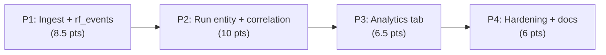

# Implementation Plan: Research Foundry Run Telemetry in CCDash

**Plan ID**: `IMPL-2026-07-21-RESEARCH-FOUNDRY-RUN-TELEMETRY`
**Date**: 2026-07-21
**Author**: Sonnet 5, expanding Opus decisions block
**Human Brief**: `docs/project_plans/human-briefs/research-foundry-run-telemetry.md`
**Related Documents**:
- **PRD**: `docs/project_plans/PRDs/features/research-foundry-run-telemetry-v1.md`
- **Decisions Block**: `.claude/worknotes/research-foundry-run-telemetry/decisions-block.md`
- **Proposed ADR**: `docs/project_plans/exploration/research-foundry-run-telemetry/research-foundry-run-telemetry-proposed-adr.md`
- **Dedup precedent spec**: `docs/project_plans/design-specs/f-w6-001-correlation-overcounting.md`

**Complexity**: Large (Tier 3)
**Total Estimated Effort**: 31 points (bottom-up; see Estimation Sanity Check in Human Brief for the +19% delta vs. the decisions-block anchor of 26)
**Target Timeline**: Sequential critical path, no fixed ship date — approximately 4–6 engineer-weeks depending on batching within phases

## Executive Summary

Research Foundry (RF) emits schema-validated per-run telemetry (`ccdash_event`) that today never leaves RF's own workspace. This plan builds a contract-first ingest endpoint and a new `research_runs` entity — correlated to CCDash sessions via `entity_graph.py` link rows keyed by a genuine UUID, never RF's semantic slugs — culminating in a 4-panel "Provider Economics" tab inside the existing `AnalyticsDashboard.tsx`. The four phases are strictly sequential (P1 ingest → P2 entity/correlation → P3 visualization → P4 hardening/docs) because each phase's output is the next phase's typed contract; every surface is buildable and testable today with zero live RF traffic via seeded fixtures.

## Implementation Strategy

### Architecture Sequence

This plan does **not** follow the generic 8-layer template phase-for-phase — each of the 4 phases below is itself a vertical slice spanning DB → Repository/Service → API (and, for Phase 3, UI) for one part of the run-telemetry lifecycle, per the Opus decisions block's phase boundaries (§1 of the decisions block). This keeps the ingest contract, the run entity, and the visualization independently shippable and testable:

1. **Phase 1 — Ingest transport + `rf_events` persistence** (DB + API layers for the raw event log)
2. **Phase 2 — Run entity + intelligence + correlation** (DB + Service + API layers for the derived rollup and cross-entity linking)
3. **Phase 3 — Analytics visualization tab** (UI layer)
4. **Phase 4 — Hardening + docs + deferred specs** (Documentation Finalization equivalent)

### Parallel Work Opportunities

- **P1 intra-phase**: schema/migration work (`data-layer-expert`, T1-001/T1-002) can proceed in parallel with endpoint scaffolding (`python-backend-engineer`, T1-003/T1-004) under file ownership — they touch disjoint files until the migration lands.
- **P4 intra-phase**: DOC-006 deferred-item specs (T4-001 through T4-007) and the operator guide/CHANGELOG (T4-008/T4-009) can start once P3's MVP scope is locked, without waiting for P3's exit gate — no shared files.
- **No inter-phase parallelism**: P2 depends on P1's stable ingest contract; P3 renders P2's typed contract; P4's deferred specs describe what P3 actually shipped. The critical path is strictly P1 → P2 → P3 → P4 (decisions block §5).

### Critical Path

### Phase Summary

| Phase | Title | Estimate | Target Subagent(s) | Model(s) | Notes |
|-------|-------|----------|--------------------|----------|-------|
| 1 | Ingest transport + `rf_events` persistence | 8.5 pts | data-layer-expert, python-backend-engineer, task-completion-validator | sonnet | Contract-first; buildable with zero live RF traffic |
| 2 | Run entity + intelligence + correlation | 10 pts | python-backend-engineer, backend-architect, data-layer-expert, karen, task-completion-validator | sonnet (extended for correlation/dedup) | Algorithmic risk hotspot — D-001 dedup + karen milestone gate |
| 3 | Analytics visualization tab | 6.5 pts | ui-engineer-enhanced, frontend-developer, backend-architect (seam), task-completion-validator | sonnet | `integration_owner: backend-architect`; seam task T3-000 |
| 4 | Hardening + docs + deferred specs | 6 pts | documentation-writer, changelog-generator, karen, task-completion-validator | haiku (sonnet for DOC-006 specs) | 7 DOC-006 tasks, one per PRD §12 deferred item |
| **Total** | — | **31 pts** | — | — | Decisions-block anchor was 26 pts; +19% delta documented in Human Brief §2 |

**Model column conventions**: Claude-only phases list the single Claude model; the decisions block's original "medium"/"low" effort labels for P1/P3 have been corrected to the canonical Claude vocabulary (`adaptive`/`extended` only — see `references/multi-model-guidance.md`). P2's `backend-architect` correlation/dedup tasks retain `extended` effort as the decisions block intended, since that phase is the named algorithmic risk hotspot.

## Deferred Items & In-Flight Findings Policy

### Deferred Items

Every row below corresponds 1:1 to a PRD §12 deferred item. Each has a dedicated DOC-006 design-spec authoring task in Phase 4 — see `docs/project_plans/implementation_plans/features/research-foundry-run-telemetry-v1/phase-4-hardening-docs.md`.

| Item ID | Category | Reason Deferred | Trigger for Promotion | Target Spec Path | DOC-006 Task |
|---------|----------|-----------------|-----------------------|-------------------|--------------|
| DF-001 | dependency-blocked | Per-provider cost/quality splits: RF's §16 event carries only a provider list, not splits | RF emits per-provider splits in a future schema version, OR CCDash joins RF's `source_cards` | `docs/project_plans/design-specs/rf-per-provider-cost-quality-splits.md` | T4-001 |
| DF-002 | dependency-blocked | Useful-source rate by domain: domain lives on `source_card.url`, not the event | Same `source_cards` join as DF-001 | `docs/project_plans/design-specs/rf-useful-source-rate-by-domain.md` | T4-002 |
| DF-003 | dependency-blocked | Extraction failure rate by extractor: extractor identity lives on `source_card.extractor`, not the event | Same `source_cards` join as DF-001 | `docs/project_plans/design-specs/rf-extraction-failure-rate-by-extractor.md` | T4-003 |
| DF-004 | dependency-blocked | Search→report latency: no report/synthesis timestamp on the event | RF adds a report-completion timestamp in a future schema version | `docs/project_plans/design-specs/rf-search-to-report-latency.md` | T4-004 |
| DF-005 | research-needed | Claims unsupported/conflicted/stale panel: requires ingesting RF's claim ledger (§11.4), a distinct entity | A follow-up feature ingests `claim` records correlated to `research_runs` | `docs/project_plans/design-specs/rf-claim-ledger-panel.md` | T4-005 |
| DF-006 | dependency-blocked | Reusable-patterns-promoted-to-SkillMeat panel: cross-system, explicitly out of exploration charter scope | A follow-up feature reads `search_run.writebacks.skillmeat_candidate_ids` and joins SkillMeat's artifact-intelligence surfaces | `docs/project_plans/design-specs/rf-skillmeat-promotion-panel.md` | T4-006 |
| DF-007 | dependency-blocked | IntentTree `intent_id`/`task_node_id` resolution: would require a live IntentTree API call; opaque storage sufficient for v1 | IntentTree API access wired for CCDash's backend | `docs/project_plans/design-specs/rf-intenttree-intent-id-resolution.md` | T4-007 |

### In-Flight Findings

`findings_doc_ref` starts `null` per policy. Do not pre-create `.claude/findings/research-foundry-run-telemetry-findings.md` — create it lazily on the first real finding during Phase 1–4 execution, then set `findings_doc_ref` in this plan's frontmatter and append the path to `related_documents`. See `.claude/skills/planning/references/deferred-items-and-findings.md` for the full lifecycle.

### Quality Gate

Phase 4 cannot be sealed until all 7 rows above have their DOC-006 spec authored (or explicitly marked N/A — none are expected to be N/A given the PRD's explicit §12 enumeration) and `deferred_items_spec_refs` is populated with all 7 paths.

## Phase Breakdown

Detailed task tables, ACs, and quality gates live in per-phase files (progressive disclosure — each file <800 lines):

- **[Phase 1: Ingest transport + `rf_events` persistence](./research-foundry-run-telemetry-v1/phase-1-ingest.md)** — 8.5 pts
- **[Phase 2: Run entity + intelligence + correlation](./research-foundry-run-telemetry-v1/phase-2-run-entity-correlation.md)** — 10 pts
- **[Phase 3: Analytics visualization tab](./research-foundry-run-telemetry-v1/phase-3-analytics-tab.md)** — 6.5 pts
- **[Phase 4: Hardening + docs + deferred specs](./research-foundry-run-telemetry-v1/phase-4-hardening-docs.md)** — 6 pts

## Risk Mitigation

### Technical Risks (from decisions block §3)

| Risk | Impact | Likelihood | Mitigation Strategy | Owning Phase |
|------|--------|------------|----------------------|--------------|
| D-001 correlation over-count reproduced at run↔session join | High | Medium-High if shipped without dedup | `DISTINCT`/`GROUP BY`-before-sum from day one; dedup regression test as exit gate, not deferred (T2-007) | P2 |
| Correlation-key mismatch (RF slugs vs. CCDash UUIDs) corrupts AOS URN graph if force-fit | Medium | Certain if attempted | Entity-link rows keyed by genuine UUID `run_id`; RF ids stored display-only; zero `aos_correlation.py` changes (T2-006) | P2 |
| Per-provider data gap: "by provider/domain/extractor" panels not computable from the event alone | Medium | Certain (confirmed by spec inspection) | Honest per-mode/per-run MVP grain (P3); named deferred items DF-001–DF-004 with unblock conditions, not silently dropped | P3, P4 |
| RF telemetry may not flow yet (transport is `defined_stubbed`) | Medium | Medium (separate deploy lifecycle) | Contract-first P1 buildable/testable via seeded fixtures now; resilience-by-default; feature flag; fail-open at both ends | P1 |
| Dual-DDL parity drift across two new tables | Low-Medium | Low (governance test auto-fails CI) | `ingest_cursors` v36 precedent exactly; parity + direct-count test as exit gate in both P1 and P2 (T1-002, T2-002) | P1, P2 |

### Schedule Risks

| Risk | Impact | Likelihood | Mitigation Strategy |
|------|--------|------------|----------------------|
| P2 (algorithmic hotspot) overruns its 10-pt estimate | Medium | Medium | `karen` milestone review at P2 exit (T2-008) before P3 starts; re-run estimation heuristics on P3/P4 if P2 lands >50% over |
| DOC-006 (7 specs) treated as filler and rushed | Low-Medium | Medium | Each DOC-006 task is independently estimated (0.5 pt) and individually verified in Phase 4's quality gate — not a single bundled line item |

## Model & Effort Assignment

All tasks use the canonical Claude effort vocabulary (`adaptive` | `extended` — never `medium`/`low`/numeric points). See `.claude/skills/planning/references/multi-model-guidance.md` → Canonical Effort Vocabulary. No external (non-Claude) models are required for this feature; the decisions block's model routing table (§6) confirmed "no external-model callouts required."

**Correction from decisions block**: The decisions block's model-routing table (§6) used `medium`/`low` effort labels for P1 and P3 Claude tasks. Those are not valid Claude effort values — this plan maps them to `adaptive` (the Claude default), preserving `extended` only for P2's `backend-architect` correlation/dedup tasks, which the decisions block explicitly flagged as the algorithmic risk hotspot.

## Resource Requirements

### Team Composition
- Backend (data-layer-expert, python-backend-engineer, backend-architect): full engagement P1–P2, none needed P3, review-only P4
- Frontend (ui-engineer-enhanced, frontend-developer): none P1–P2, full engagement P3, none P4
- Docs (documentation-writer, changelog-generator): light P1–P3 (none required), full engagement P4
- Reviewers (task-completion-validator every phase; karen at P2 milestone + feature end)

### Skill Requirements
- FastAPI routers, dual-DDL SQLite+Postgres migrations, transport-neutral `agent_queries` services, entity-link correlation patterns
- React 19 + TanStack Query, `recharts`/`TrendChart` primitives, `AnalyticsDashboard.tsx` tab conventions
- OpenTelemetry spans, structured logging with trace_id/span_id

## Success Metrics

- 100% of POSTed RF events persist idempotently (no duplicate `rf_events` rows on re-POST of the same `event_id`).
- `research_runs` rollup queryable via REST/MCP/CLI with zero cross-run cost double-counting (D-001 regression test green).
- Provider Economics tab renders KPI strip + 3 panels from live or seeded data and degrades to an explicit empty state with zero events (never `0`/`NaN`).

## Communication Plan

- Phase-boundary check-ins at each exit gate (P1→P2, P2→P3, P3→P4).
- `karen` milestone review surfaced explicitly at P2 exit (algorithmic risk hotspot) and at feature end.
- No external stakeholder cadence required — solo-operator LAN feature.

## Post-Implementation

- Monitor `ingest_sources[]` `rf` entry state transitions (idle → connected → backed_up → disconnected) once RF's companion transport lands.
- Revisit DF-001–DF-007 deferred specs when their unblock conditions are met (most commonly: RF ships `source_cards` ingestion as a follow-up feature).
- Feed actual P1–P4 costs back into `estimation-heuristics.md` as a new anchor for future ingest+entity+viz features (H5).

---

**Progress Tracking:**

See `.claude/progress/research-foundry-run-telemetry/phase-N-progress.md` (created at implementation-plan approval time).

---

**Implementation Plan Version**: 1.0
**Last Updated**: 2026-07-21
