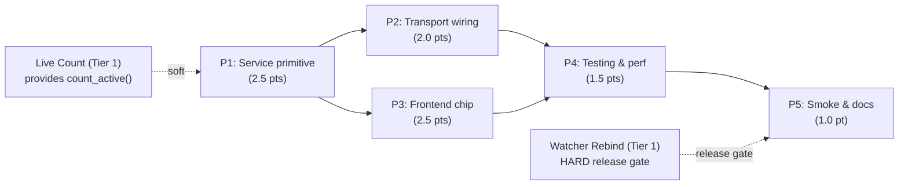

# Implementation Plan: System-Wide Metrics

**Plan ID**: `IMPL-2026-05-20-SYSTEM-WIDE-METRICS`
**Date**: 2026-05-20
**Author**: Implementation Planner (sonnet)
**Human Brief**: N/A — not created (10 pts but single-domain feature with straightforward wave structure; estimation rationale captured in PRD §13)
**Related Documents**:
- **PRD**: `docs/project_plans/PRDs/features/system-wide-metrics-v1.md`
- **Decisions Block**: `.claude/worknotes/system-wide-metrics/decisions-block.md`
- **Spike**: `.claude/worknotes/system-wide-live-metrics-spike/spike.md`
- **Tier 1 Preconditions**: `docs/project_plans/feature_contracts/features/live-agents-count-v1.md`, `docs/project_plans/feature_contracts/features/watcher-rebind-on-active-project-switch-v1.md`

**Complexity**: Medium
**Total Estimated Effort**: 10 pts
**Target Timeline**: ~2 weeks from Tier 1 preconditions landing

---

## Executive Summary

This plan delivers a transport-neutral `SystemMetricsQueryService` that aggregates live agent counts across all known CCDash projects, exposes them via REST, MCP, and CLI, and renders a trustworthy "Live now" chip on the home dashboard with per-project staleness indicators. The implementation follows CCDash's established `agent_queries/` pattern and proceeds in five phases: service primitive, transport wiring (parallel with frontend), frontend chip, testing/validation, and documentation. The hard release gate is the `watcher-rebind-on-active-project-switch-v1` Tier 1 precondition; the feature is buildable and testable without it, but should not be shipped to users until watcher rebind is in place.

**Key milestones**: DTO contract frozen (end P1) → REST endpoint live (end P2) → dashboard chip rendering (end P3) → all tests green including p95 < 200ms (end P4) → smoke + changelog + deferred specs (end P5).

---

## Implementation Strategy

### Architecture Sequence

This feature follows the CCDash transport-neutral pattern:

1. **Service Layer** — `SystemMetricsQueryService` in `backend/application/services/agent_queries/system_metrics.py`; DTOs in `backend/models.py`; env vars in `backend/config.py`
2. **Transport Layer** — REST endpoint in `backend/routers/agent.py`; MCP tool in `backend/mcp/server.py`; CLI command in `backend/cli/system.py`
3. **Frontend Layer** — `components/SystemMetricsChip.tsx` (new file); integration into `components/Dashboard.tsx`
4. **Testing Layer** — unit tests, integration tests, performance test, frontend component tests, FE/BE seam test
5. **Documentation / Smoke** — runtime smoke, CHANGELOG entry, CLAUDE.md pointer, deferred-items design spec stubs

No database schema changes are required. The feature reads from the existing `sessions` table via `SessionsRepository.count_active()` (from the `live-agents-count-v1` Tier 1 primitive).

### Parallel Work Opportunities

- **P2 and P3 run in parallel** after P1 lands and the DTO shape is frozen. File ownership is fully disjoint: P2 owns backend transport files; P3 owns `components/`. No shared files between P2 and P3.
- **P4 BE and P4 FE tests** can also run in parallel (different test runners, read-only fixture sharing).
- **P5 docs** can begin during P4 — CHANGELOG draft and CLAUDE.md update do not depend on test outcomes, only on implementation being final.

### Critical Path

**P1 → P2 → P4 → P5** (service → REST transport → integration+perf test → smoke/docs)

P3 runs in parallel with P2 and gates P4 from the frontend side. P5 is the terminal phase gated by both P4 and the `watcher-rebind-on-active-project-switch-v1` Tier 1 for user-facing release.



### Phase Summary

| Phase | Title | Estimate | Target Subagent(s) | Model(s) | Notes |
|-------|-------|----------|--------------------|----------|-------|
| 1 | Service Primitive | 2.5 pts | `python-backend-engineer` | sonnet | `data-layer-expert` advisory on Postgres staleness path |
| 2 | Transport Wiring | 2.0 pts | `python-backend-engineer` | sonnet | Parallel with P3 |
| 3 | Frontend Chip | 2.5 pts | `ui-engineer-enhanced` | sonnet | Parallel with P2; `integration_owner: python-backend-engineer` per R-P3 |
| 4 | Testing & Performance | 1.5 pts | `python-backend-engineer`, `ui-engineer-enhanced` | sonnet | BE and FE test subtasks can run in parallel; `task-completion-validator` gates this phase |
| 5 | Smoke & Documentation | 1.0 pt | `documentation-writer`, `changelog-generator` | haiku (docs), sonnet (deferred specs) | `karen` end-of-feature gate |
| **Total** | — | **10 pts** | — | — | — |

---

## Deferred Items & In-Flight Findings Policy

### Deferred Items

The following items are explicitly out of scope for v1 but are planned follow-ons. Each has a corresponding design-spec authoring task in Phase 5 (DOC-006 rows). Spec paths will be populated in `deferred_items_spec_refs` in this plan's frontmatter at the end of P5.

| Item ID | Category | Reason Deferred | Trigger for Promotion | Target Spec Path |
|---------|----------|-----------------|-----------------------|-----------------|
| DEF-001 | `scope-cut` | Background rollup table (spike Option 3) — separate backing store beneath `SystemMetricsQueryService`. V1 in-process fan-out sufficient for 36 projects. | Project count exceeds ~100 (p95 > 200ms sustained) OR a desktop widget requiring sub-10ms response is implemented | `docs/project_plans/design-specs/system-metrics-background-rollup.md` |
| DEF-002 | `scope-cut` | Lazy on-demand per-project rescan during `get_system_active_count` (PRD OQ-1). Scope risk in v1: rescan concurrency + stampede on home-dashboard load. `is_stale` flag is the v1 mitigation. | `watcher-rebind-on-active-project-switch-v1` ships AND operator reports stale counts exceeding 2h on non-active projects | `docs/project_plans/design-specs/system-metrics-lazy-rescan.md` |
| DEF-003 | `research-needed` | Desktop widget API hardening — additional fields, pagination, or auth layer needed for a public/external widget consumer. The v1 contract is widget-friendly but not yet hardened. | A desktop widget feature enters planning | `docs/project_plans/design-specs/system-metrics-widget-api-hardening.md` |

### In-Flight Findings

The findings doc is NOT pre-created. Create `.claude/findings/system-wide-metrics-findings.md` only on the first real in-flight discovery. If created, set `findings_doc_ref` in this plan's frontmatter and append the path to `related_documents`.

### Quality Gate

Phase 5 cannot be sealed until all three deferred items have spec paths in `deferred_items_spec_refs`, OR are explicitly marked N/A with rationale above.

---

## Phase Breakdown

**Column conventions** (apply to every task table below):
- `Estimate` — Task size in story points
- `Model` — `sonnet` | `haiku` (no external models needed for this feature)
- `Effort` — Reasoning budget: `adaptive` (default for all Claude tasks here)

---

### Phase 1: Service Primitive

**Duration**: ~3 days
**Dependencies**: `live-agents-count-v1` Tier 1 (soft — provides `count_active()`); no upstream phases
**Assigned Subagent(s)**: `python-backend-engineer` (primary); `data-layer-expert` (advisory on Postgres staleness path)
**Exit Gate**: All unit tests pass; service returns valid DTO for a fixture with 3+ projects including stale and erroring entries; DTO shape frozen for P2/P3 parallel start

**P1 Implementation Decision Required — OQ-5 / Risk 4:**
At P1 start, resolve the Postgres staleness query path. Preferred approach: add `max_updated_at` as an optional return field from `count_active()` in a single SQL query, avoiding a separate `SELECT MAX(updated_at)` call per project. If Postgres composite index semantics make this materially more expensive than two queries, document the decision and use two queries. If resolution adds more than 1 pt of scope, escalate to Opus before proceeding.

| Task ID | Task Name | Description | Acceptance Criteria | Estimate | Subagent(s) | Model | Effort | Dependencies |
|---------|-----------|-------------|---------------------|----------|-------------|-------|--------|--------------|
| T1-001 | DTO models | Author `SystemActiveCountDTO` and `ProjectActiveCountSummaryDTO` Pydantic models in `backend/models.py`. Fields: `total: int`, `per_project: list[ProjectActiveCountSummaryDTO]`, `generated_at: datetime`, `window_seconds: int`, `status: Literal["ok", "partial"]`. Per-project fields: `project_id: str`, `project_name: str`, `count: int | None`, `is_stale: bool | None`, `last_synced_at: datetime | None`, `error: str | None`. | Both DTOs validate with `pydantic.parse_obj_as`. `count: None` is accepted (not a validation error). `is_stale: None` is accepted. `status` field present on aggregate. Matches PRD §FR-1, FR-2. | 0.5 pt | `python-backend-engineer` | sonnet | adaptive | None |
| T1-002 | Env vars | Add `CCDASH_SYSTEM_METRICS_STALE_HORIZON_SECONDS` (default 3600), `CCDASH_SYSTEM_METRICS_CACHE_TTL_SECONDS` (default 30), and `CCDASH_SYSTEM_METRICS_CONCURRENCY` (default 10) to `backend/config.py`. Follow existing `CCDASH_*` env var pattern. | Three new env vars readable from `backend.config`. Each has correct type and default. Does not conflict with existing `CCDASH_QUERY_CACHE_TTL_SECONDS`. Satisfies PRD §FR-6 (separate cache TTL) and §FR-5 (semaphore bound). | 0.25 pt | `python-backend-engineer` | sonnet | adaptive | None |
| T1-003 | SystemMetricsQueryService | Author `backend/application/services/agent_queries/system_metrics.py`. Class follows `project_status.py` structural model. Method `get_system_active_count()`: (a) calls `workspace_registry.list_projects()` to enumerate all projects; (b) fans out via `asyncio.gather(return_exceptions=True)` with `asyncio.Semaphore(CCDASH_SYSTEM_METRICS_CONCURRENCY)` across all projects; (c) per project calls `SessionsRepository.count_active(project_id, window_seconds=CCDASH_LIVE_AGENTS_WINDOW_SECONDS)` and resolves `is_stale` by comparing `max(sessions.updated_at)` against `CCDASH_SYSTEM_METRICS_STALE_HORIZON_SECONDS`; (d) maps exceptions to error entries per FR-4; (e) aggregates total and sets `status="partial"` when any error entries present; (f) wraps result in `@memoized_query` with `ttl=CCDASH_SYSTEM_METRICS_CACHE_TTL_SECONDS`. | FR-1 through FR-6 satisfied. Unit test with 3-project fixture (fresh, stale, erroring) returns valid `SystemActiveCountDTO`. `is_stale=True` when project `max_updated_at` > horizon. Erroring project returns `{count: null, error: "..."}` and aggregate continues. `status="partial"` when ≥1 error. Cache hit measured: second call within TTL window returns cached result without DB queries. | 1.5 pts | `python-backend-engineer` | sonnet | adaptive | T1-001, T1-002 |
| T1-004 | OTel instrumentation | Wrap `get_system_active_count()` with an OpenTelemetry span. Span attributes: `project_count`, `stale_project_count`, `error_project_count`, `cache_hit: bool`. Follow existing OTel patterns in `backend/observability/otel.py`. Structured log: DEBUG per project in fan-out; single INFO at aggregate completion (duration, total count, stale count). | Span emitted on every call. Attributes present and non-negative integers. Cache-hit calls emit span with `cache_hit=True`. Follows existing OTEL pattern (does not introduce new SDK imports). Satisfies PRD §6.2 Observability. | 0.25 pt | `python-backend-engineer` | sonnet | adaptive | T1-003 |

**Phase 1 Quality Gates:**
- [ ] T1-001 through T1-004 complete
- [ ] Unit test: 3-project fixture with fresh/stale/erroring entries → valid DTO returned, `status="partial"`, stale flags correct
- [ ] Unit test: `is_stale=True` when `max_updated_at` exceeds horizon; `is_stale=False` when within horizon
- [ ] Unit test: erroring project returns `{count: None, error: "..."}`, aggregate total excludes erroring project
- [ ] DTO shape frozen — P2 and P3 teams can begin work against this contract
- [ ] OQ-5 resolution documented in task notes (single-query or two-query approach chosen)

---

### Phase 2: Transport Wiring

**Duration**: ~2 days
**Dependencies**: P1 complete (DTO shape frozen)
**Assigned Subagent(s)**: `python-backend-engineer`
**Parallel with**: P3 (file ownership fully disjoint — P2 owns backend; P3 owns `components/`)
**Exit Gate**: Integration test `test_system_metrics_transport_parity` green

| Task ID | Task Name | Description | Acceptance Criteria | Estimate | Subagent(s) | Model | Effort | Dependencies |
|---------|-----------|-------------|---------------------|----------|-------------|-------|--------|--------------|
| T2-001 | REST endpoint | Add `GET /api/agent/system/active-count` to `backend/routers/agent.py`. Thin adapter: calls `SystemMetricsQueryService.get_system_active_count()`, returns DTO as JSON. Include `Cache-Control: max-age=30` response header (FR-13). Register with OpenAPI (summary, description referencing recommended polling interval and staleness semantics). | HTTP 200 returns valid `SystemActiveCountDTO` JSON. `Cache-Control: max-age=30` header present. OpenAPI `GET /api/agent/system/active-count` entry visible in schema. Satisfies FR-7 and FR-13. | 0.75 pt | `python-backend-engineer` | sonnet | adaptive | T1-003 |
| T2-002 | MCP tool | Register `ccdash_system_active_count` tool in `backend/mcp/server.py` using the existing `@mcp.tool()` decorator pattern. Tool delegates to `SystemMetricsQueryService.get_system_active_count()` and returns identical payload as REST (FR-8). Include docstring explaining staleness semantics. | MCP tool registered. Calling the tool returns the same aggregate as `GET /api/agent/system/active-count` for identical DB state. Satisfies FR-8 and AC-1 (MCP surface). | 0.5 pt | `python-backend-engineer` | sonnet | adaptive | T1-003 |
| T2-003 | CLI command | Create `backend/cli/system.py` — a new Typer app with `app.command("active-count")`. Accepts `--json` flag. Without `--json`: renders a human-readable table (total count + per-project rows with stale indicator). With `--json`: emits raw `SystemActiveCountDTO` as JSON. Wire the `system` subcommand group to the CLI root following the pattern for existing subgroups. Follows existing `--timeout` / `--no-cache` conventions. | `ccdash system active-count` renders human-readable output. `ccdash system active-count --json` emits valid JSON matching REST response shape. New `system` subcommand group establishes namespace for future `ccdash system *` commands. Satisfies FR-9 and AC-1 (CLI surface). OQ-EXP-5: new `system` group confirmed. | 0.75 pt | `python-backend-engineer` | sonnet | adaptive | T1-003 |

**Phase 2 Quality Gates:**
- [ ] T2-001 through T2-003 complete
- [ ] `GET /api/agent/system/active-count` returns HTTP 200 with `Cache-Control: max-age=30`
- [ ] OpenAPI schema updated with new endpoint
- [ ] MCP tool callable and returns matching payload
- [ ] `ccdash system active-count` and `ccdash system active-count --json` both functional
- [ ] All three transports call service directly — no transport-local aggregation logic

---

### Phase 3: Frontend Home Dashboard Surface

**Duration**: ~3 days
**Dependencies**: P1 complete (DTO shape frozen); develops against P2 REST endpoint (can start with mocked OpenAPI response)
**Assigned Subagent(s)**: `ui-engineer-enhanced` (primary)
**Integration Owner**: `python-backend-engineer` (R-P3 — FE+BE seam, `python-backend-engineer` owns the contract verification)
**Parallel with**: P2 (fully disjoint file ownership)
**Exit Gate**: All component tests green; manual expand/collapse confirmed

> R-P3 applies: this phase has ≥2 owner specialties (FE + BE seam) with overlapping DTO contract. `integration_owner: python-backend-engineer` is declared above. A dedicated seam task (`T4-004 test_dashboard_contract_parity`) is required in Phase 4.

> R-P4 applies: this phase touches `components/Dashboard.tsx` (a `.tsx` file). Phase 5 must include a runtime smoke task referencing both `components/Dashboard.tsx` and `components/SystemMetricsChip.tsx`.

| Task ID | Task Name | Description | Acceptance Criteria | Estimate | Subagent(s) | Model | Effort | Dependencies |
|---------|-----------|-------------|---------------------|----------|-------------|-------|--------|--------------|
| T3-001 | SystemMetricsChip component | Create `components/SystemMetricsChip.tsx` as a new standalone component. State: `total`, `perProject[]`, `isLoading`, `isError`, `expanded` (collapsed by default). Renders: (a) collapsed — a chip labeled "Live now" with total count; (b) expanded — a per-project breakdown table with name, count, and stale indicator (warning icon + `last_synced_at` tooltip for `is_stale=true` entries). Polling: own `useInterval`-style hook, 30s interval, paused when `document.visibilityState === 'hidden'` (FR-12). Fetches `GET /api/agent/system/active-count` via `services/apiClient.ts`. Follows Tailwind slate dark-mode palette and `Surface`/`cn` patterns from existing `Dashboard.tsx`. OQ-EXP-2: new file (not inline). OQ-EXP-4: own simpler polling hook (not the planning cache). | Component renders in all states: loading (neutral placeholder `--`), success (count chips), partial (count + per-project error entries), error (last known value + "data may be outdated"). `is_stale=null` treated as `true` (warning icon). `count: null` renders `—` (em-dash). `per_project` absent or empty renders "breakdown unavailable". Toggle expand/collapse works without re-fetching. Poll pauses on hidden tab. No console errors. Satisfies FR-10, FR-11, FR-12, AC-5. OQ-EXP-4: no dependency on planning cache. | 1.5 pts | `ui-engineer-enhanced` | sonnet | adaptive | T1-001 |
| T3-002 | Dashboard.tsx integration | Integrate `SystemMetricsChip` into `components/Dashboard.tsx`. Placement: between the "Feature Portfolio" surface block (lines ~207-230) and the KPI stat card grid (lines ~232+). This maintains the "summary → workspace-live-status → feature-counts → detailed-KPIs" visual hierarchy. The chip is always rendered (not behind a feature flag in v1). | `SystemMetricsChip` appears in Dashboard between Feature Portfolio and KPI cards. Dashboard re-render does not disrupt existing feature portfolio or KPI state. No layout shift on chip expand/collapse. Satisfies FR-10, AC-5 (`target_surfaces: [components/Dashboard.tsx]`). | 0.5 pt | `ui-engineer-enhanced` | sonnet | adaptive | T3-001 |
| T3-003 | R-P2 resilience states | Explicitly verify all R-P2 resilience contracts in the component. `count: null` → renders `—`. `per_project: []` or absent → renders "breakdown unavailable". `is_stale: null` → treats as `true`, renders warning icon. Full fetch error → renders last known value with "data may be outdated" indicator. None of these states throw to the React error boundary. | Each resilience state manually exercised (mock API response). No error boundary throw in any variant. Satisfies AC-5 resilience sub-clauses and PRD §6.2 Resilience. | 0.5 pt | `ui-engineer-enhanced` | sonnet | adaptive | T3-001 |

**Phase 3 Quality Gates:**
- [ ] T3-001 through T3-003 complete
- [ ] `SystemMetricsChip.tsx` exists as a new file
- [ ] Dashboard renders chip between Feature Portfolio and KPI cards
- [ ] Expand/collapse interaction works
- [ ] All R-P2 resilience states handled without error boundary throw
- [ ] Poll pauses on hidden tab
- [ ] Vitest component tests added (required before P4; test file may be authored in T4-003)

---

### Phase 4: Testing & Performance Validation

**Duration**: ~2 days
**Dependencies**: P2 and P3 complete
**Assigned Subagent(s)**: `python-backend-engineer` (backend tests), `ui-engineer-enhanced` (frontend tests), `task-completion-validator` (phase gate — mandatory Tier 2)
**Exit Gate**: All test suites green; p95 < 200ms performance budget met; `task-completion-validator` sign-off

> This phase includes the R-P3 seam task `T4-004 test_dashboard_contract_parity` required because P3 (FE) and P2 (BE) crossed a FE/BE seam.

| Task ID | Task Name | Description | Acceptance Criteria | Estimate | Subagent(s) | Model | Effort | Dependencies |
|---------|-----------|-------------|---------------------|----------|-------------|-------|--------|--------------|
| T4-001 | Unit tests — service | Author unit tests for `SystemMetricsQueryService` in `backend/tests/test_system_metrics.py`. Test cases: `test_stale_horizon_boundary` (fixture with fresh/boundary/stale projects — assert `is_stale` values); `test_partial_aggregate_resilience` (one project stubbed to raise `Exception` — assert `count=None`, `error` populated, aggregate continues, `status="partial"`); `test_cache_hit` (second call within TTL window does not execute DB queries); `test_all_errors_returns_partial_status` (all projects error — returns DTO with `status="partial"`, `total=0`). | All four unit tests pass. Multi-project fixture covers at least 3 projects including one stale and one erroring. Satisfies AC-2 and AC-3. | 0.5 pt | `python-backend-engineer` | sonnet | adaptive | T1-003 |
| T4-002 | Integration & performance tests | Author integration tests in `backend/tests/test_system_metrics.py`. `test_system_metrics_transport_parity`: seeds a multi-project fixture (≥5 projects, including one stale) and calls `SystemMetricsQueryService` directly, then `GET /api/agent/system/active-count`, and asserts counts match exactly (AC-1). `test_system_metrics_performance`: seeds a 36-project fixture in SQLite WAL mode and calls `get_system_active_count()` 10 times, asserting p95 < 200ms (AC-4). `test_system_metrics_performance_cached`: calls twice within TTL, asserts second call completes in < 20ms (AC-4). | `test_system_metrics_transport_parity` green. `test_system_metrics_performance`: p95 < 200ms over 10 runs. Cached repeat < 20ms. Satisfies AC-1 and AC-4. | 0.75 pt | `python-backend-engineer` | sonnet | adaptive | T2-001, T1-003 |
| T4-003 | Frontend component tests (Vitest) | Author Vitest tests for `SystemMetricsChip` in `components/__tests__/SystemMetricsChip.test.tsx` (or co-located). Test variants: (a) full mock response — chip renders total count; (b) partial response (`status="partial"`, one error entry) — renders count + error entry; (c) empty `per_project` — renders "breakdown unavailable"; (d) `count: null` entry — renders `—`; (e) `is_stale: null` — renders warning icon; (f) full fetch failure — renders "data may be outdated". | All six Vitest test cases pass. No error boundary throw in any variant. Expand/collapse toggle verified. Satisfies AC-5 `verified_by` clause. | 0.25 pt | `ui-engineer-enhanced` | sonnet | adaptive | T3-001 |
| T4-004 | Seam test: test_dashboard_contract_parity (R-P3) | Author `test_dashboard_contract_parity` in `backend/tests/test_system_metrics.py`. This is the R-P3 required seam task. Fetches the live REST response from `GET /api/agent/system/active-count` against a test fixture and asserts that every field consumed by the frontend exists: `total` (int), `per_project` (list), `per_project[n].project_id` (str), `per_project[n].project_name` (str), `per_project[n].count` (int or None), `per_project[n].is_stale` (bool or None), `per_project[n].last_synced_at` (str or None). Also asserts `status` and `generated_at` fields present. **Integration owner**: `python-backend-engineer` runs this test and signs off on contract parity before P5 begins. | Test passes. All fields used by `SystemMetricsChip.tsx` confirmed present in REST response. DTO drift would fail this test. Satisfies R-P3 requirement. | 0.25 pt | `python-backend-engineer` | sonnet | adaptive | T2-001, T3-001 |
| T4-005 | task-completion-validator gate | `task-completion-validator` reviews: all test results (T4-001 through T4-004), performance budget evidence (p95 < 200ms), and R-P3 seam test sign-off. Must confirm: no test failures, performance budget met, seam contract verified. | Reviewer pass documented. All tests green. Performance budget confirmed. R-P3 seam signed off by integration owner. Tier 2 phase gate cleared. | 0 pts (gate) | `task-completion-validator` | sonnet | adaptive | T4-001, T4-002, T4-003, T4-004 |

**Phase 4 Quality Gates:**
- [ ] T4-001 through T4-005 complete
- [ ] `test_stale_horizon_boundary`: fresh/boundary/stale fixture — `is_stale` values correct
- [ ] `test_partial_aggregate_resilience`: erroring project isolated; aggregate continues
- [ ] `test_system_metrics_transport_parity`: REST response matches service output exactly
- [ ] `test_system_metrics_performance`: p95 < 200ms over 10 runs (36-project fixture)
- [ ] Cached repeat: < 20ms
- [ ] `test_dashboard_contract_parity`: all FE-consumed fields present in REST response (R-P3 gate)
- [ ] All six Vitest component test variants pass (including null/missing field resilience)
- [ ] `task-completion-validator` sign-off recorded

---

### Phase 5: Runtime Smoke & Documentation

**Duration**: ~1 day
**Dependencies**: P4 complete (all tests green)
**Assigned Subagent(s)**: `documentation-writer` (CLAUDE.md pointer + deferred spec stubs), `changelog-generator` (CHANGELOG entry)
**Reviewer**: `karen` (mandatory Tier 2 end-of-feature gate)
**Exit Gate**: Smoke test signed off; CHANGELOG entry present; deferred spec stubs authored; `karen` review passed; `deferred_items_spec_refs` populated in frontmatter

> R-P4 applies: Phase 3 touched `components/Dashboard.tsx` and `components/SystemMetricsChip.tsx`. This phase MUST include a runtime smoke task referencing both surfaces.

| Task ID | Task Name | Description | Acceptance Criteria | Estimate | Subagent(s) | Model | Effort | Dependencies |
|---------|-----------|-------------|---------------------|----------|-------------|-------|--------|--------------|
| T5-001 | Runtime smoke test (R-P4) | Full dev-stack smoke test per AC-6. Run `npm run dev`. Open home dashboard. Confirm: (a) `SystemMetricsChip` is visible on `components/Dashboard.tsx` between Feature Portfolio and KPI cards; (b) chip shows total count (integer); (c) expanding chip shows per-project breakdown; (d) known-stale project entries (any non-active project with `updated_at` older than 1h in local DB) show warning icon. Take screenshot of expanded chip. Surfaces: `components/Dashboard.tsx`, `components/SystemMetricsChip.tsx`, `GET /api/agent/system/active-count`. | Screenshot captured showing chip expanded with at least one stale indicator. No console errors. If runtime unavailable: mark `runtime_smoke: skipped` with explicit infrastructure reason (unit-test pass is NOT a substitute per CLAUDE.md). Satisfies AC-6. | 0.25 pt | `documentation-writer` | haiku | adaptive | T4-005 |
| T5-002 | CHANGELOG entry | Add entry under `[Unreleased]` in `CHANGELOG.md` using `changelog-generator` agent. Category: `Added`. Entry: "Added system-wide live agent count chip to home dashboard, showing total running agents across all projects with per-project staleness indicators. Available via REST (`GET /api/agent/system/active-count`), MCP (`ccdash_system_active_count`), and CLI (`ccdash system active-count`)." Follow `.claude/specs/changelog-spec.md` categorization rules. `changelog_required: true` is set on this plan — this task is mandatory before release. | Entry present under `[Unreleased]` with correct `Added` category. `changelog_ref` frontmatter updated to `CHANGELOG.md`. Satisfies `changelog_required: true` contract. | 0.25 pt | `changelog-generator` | haiku | adaptive | T5-001 |
| T5-003 | CLAUDE.md convention pointer | Update `CLAUDE.md` to add a pointer (≤3 lines) under the `Key Conventions` section referencing `SystemMetricsQueryService` as the extension point for future system-wide metrics (sessions/day, token usage by project, error rates). Follow progressive disclosure: pointer only in CLAUDE.md; detail lives in the worknotes feature guide. | CLAUDE.md has ≤3 new lines pointing to `system_metrics.py` as the system-wide metrics extension point. Does not duplicate existing transport-neutral agent_queries convention entry. | 0.25 pt | `documentation-writer` | haiku | adaptive | T5-001 |
| T5-004 | Deferred-items design spec stubs | Author three design spec stubs in `docs/project_plans/design-specs/`: (a) `system-metrics-background-rollup.md` — background rollup table (spike Option 3), maturity `shaping`; (b) `system-metrics-lazy-rescan.md` — lazy on-demand per-project rescan (PRD OQ-1), maturity `idea`; (c) `system-metrics-widget-api-hardening.md` — desktop widget API hardening, maturity `idea`. Each stub: frontmatter with `doc_type: design_spec`, `prd_ref`, `feature_slug`, correct `maturity`; problem statement; known constraints from spike/PRD; open questions for next iteration. Append all three paths to `deferred_items_spec_refs` in this plan's frontmatter. | Three design spec files exist at stated paths. Each has valid frontmatter with `prd_ref` set to the system-wide-metrics PRD. `deferred_items_spec_refs` in this plan's frontmatter populated with all three paths. Satisfies Deferred Items triage table and planning skill §7.5. | 0.25 pt | `documentation-writer` | sonnet | adaptive | T5-001 |
| T5-005 | Plan frontmatter finalization + karen gate | Update this plan's frontmatter: `status: completed`, populate `commit_refs` and `pr_refs`, confirm `files_affected` matches reality. Then `karen` end-of-feature review: verify all AC satisfied (AC-1 through AC-6), all Tier 2 reviewer gates cleared, all deferred specs authored, CHANGELOG entry present, smoke test signed off. | Plan frontmatter complete per lifecycle spec. `karen` pass documented with explicit sign-off on each AC. Tier 2 feature closure gate cleared. | 0 pts (gate) | `karen` | sonnet | adaptive | T5-001, T5-002, T5-003, T5-004 |

**Phase 5 Quality Gates:**
- [ ] T5-001 through T5-005 complete
- [ ] Runtime smoke completed against `components/Dashboard.tsx` and `components/SystemMetricsChip.tsx` (R-P4 target surfaces)
- [ ] CHANGELOG `[Unreleased]` entry present (mandatory — `changelog_required: true`)
- [ ] CLAUDE.md pointer added (≤3 lines)
- [ ] Three deferred-items design specs authored: background-rollup, lazy-rescan, widget-api-hardening
- [ ] `deferred_items_spec_refs` populated in plan frontmatter
- [ ] Plan frontmatter: `status: completed`, `commit_refs`, `pr_refs` populated
- [ ] `karen` end-of-feature sign-off recorded

---

## Wrap-Up: Feature Guide & PR

**Triggered**: After Phase 5 quality gates pass and `karen` sign-off is recorded.

### Step 1 — Feature Guide

Delegate to `documentation-writer` (haiku) to create `.claude/worknotes/system-wide-metrics/feature-guide.md`.

Required frontmatter:
```yaml
---
doc_type: feature_guide
feature_slug: system-wide-metrics
prd_ref: docs/project_plans/PRDs/features/system-wide-metrics-v1.md
plan_ref: docs/project_plans/implementation_plans/features/system-wide-metrics-v1.md
spike_ref: .claude/worknotes/system-wide-live-metrics-spike/spike.md
adr_refs: []
created: 2026-05-20
---
```

Required sections (under 200 lines total):
1. **What Was Built** — `SystemMetricsQueryService`, all three transports, Dashboard chip
2. **Architecture Overview** — `agent_queries/system_metrics.py` → `routers/agent.py` / `mcp/server.py` / `cli/system.py` → `SystemMetricsChip.tsx`; `is_stale` semantics
3. **How to Test** — `ccdash system active-count --json`, curl REST endpoint, browser smoke
4. **Test Coverage Summary** — unit (staleness boundary, partial resilience, cache), integration (parity, performance), frontend (Vitest variants)
5. **Known Limitations** — watcher-rebind HARD release gate; fan-out ceiling at ~100 projects; deferred items (DEF-001 through DEF-003)

### Step 2 — Open PR

```bash
gh pr create \
  --title "feat: system-wide live agent count (REST/MCP/CLI + dashboard chip)" \
  --body "$(cat <<'EOF'
## Summary
- Adds SystemMetricsQueryService aggregating live agent counts across all projects via asyncio fan-out
- Exposes GET /api/agent/system/active-count, ccdash_system_active_count MCP tool, and ccdash system active-count CLI
- Renders 'Live now' count chip on home dashboard with per-project staleness indicators and expand/collapse breakdown

## Feature Guide
.claude/worknotes/system-wide-metrics/feature-guide.md

## Test plan
- [ ] All backend unit + integration tests pass (pytest backend/tests/test_system_metrics.py)
- [ ] Vitest component tests pass (components/__tests__/SystemMetricsChip.test.tsx)
- [ ] Smoke-tested locally: Dashboard chip visible, expand works, stale indicators visible
- [ ] CHANGELOG [Unreleased] entry present
- [ ] task-completion-validator and karen sign-off recorded in P4/P5

🤖 Generated with Claude Code
EOF
)"
```

---

## Risk Mitigation

All five risks from the Decisions Block §3 are carried forward below.

### Technical Risks

| Risk | Impact | Likelihood | Mitigation |
|------|--------|------------|------------|
| **Risk 1**: Stale `status='active'` rows for non-active projects produce wrong live counts (OQ-3 verified — 93-day stale rows exist) | High | High | `is_stale` flag is a mandatory contract field (not optional). Frontend treats missing `is_stale` as `true`. HARD dependency on `watcher-rebind-on-active-project-switch-v1` before user-facing release. Document in service docstring that staleness handling is load-bearing. |
| **Risk 2**: FE/BE seam drift — DTO shape changes in P2 silently break P3 frontend (R-P3 trigger) | Medium | Medium | `integration_owner: python-backend-engineer` declared on P3. Dedicated seam task T4-004 (`test_dashboard_contract_parity`) in P4. DTO shape frozen at end of P1 and gated before P3 merges. |
| **Risk 3**: Fan-out performance regression at scale (36 → 100+ projects) | Medium | Low | P95 < 200ms performance test at 36 projects (AC-4, T4-002). Bounded `asyncio.Semaphore` (default 10). Deferred-items spec DEF-001 documents single-SQL and background-rollup escape hatches with promotion thresholds. |
| **Risk 4**: Postgres staleness query path divergence from SQLite (OQ-5 / PRD OQ-5) | Low | Low | Resolved during P1 (T1-003 decision point). If single-query approach costs >1 pt extra, escalate to Opus for re-routing. |
| **Risk 5**: Frontend polling stampede across multiple tabs | Low | Low | `@memoized_query` (TTL 30s) absorbs duplicate polls. `Cache-Control: max-age=30` header lets browser dedup. Poll paused on hidden tab (FR-12). |

### Schedule Risks

| Risk | Impact | Likelihood | Mitigation |
|------|--------|------------|------------|
| Watcher-rebind Tier 1 delayed — system-wide metrics ships without it | High | Medium | Gate user-facing release on watcher-rebind. If shipped without it: display a persistent banner in the per-project breakdown ("counts for inactive projects may be stale") and ensure `is_stale` tooltip is always visible. |
| OQ-5 resolution adds >1 pt to P1 | Medium | Low | Buffer included in 10 pt estimate (rounded from 9.5). If OQ-5 resolution grows P1, P4 shrinks proportionally (less concurrency edge-case testing). Escalate to Opus if net growth exceeds buffer. |

---

## Estimation Sanity Check

Carried forward verbatim from PRD §13. DO NOT re-derive — the PRD locked 10 pts.

### H1 — Noun counting

New domain nouns introduced: **2**
- `SystemActiveCountDTO` (aggregate response DTO)
- `ProjectActiveCountSummaryDTO` (per-project summary DTO)

These are read-only DTOs — no new CRUD tables, no new write paths. H1 floor: ~0.5 pts for DTO authoring.

### H2 — Dual-implementation multiplier

Not applied. CCDash uses a single SQLite/Postgres path (not split local/enterprise). `count_active` from Tier 1 already authored.

### H3 — Algorithmic flag

Not triggered. Fan-out aggregation is trivially parallel; staleness is a timestamp comparison.

### H4 — Bundle decomposition (≥3 capability areas)

| Capability area | Independent estimate |
|-----------------|---------------------|
| `SystemMetricsQueryService` (fan-out + staleness + cache) | 2.5 pts |
| REST endpoint + DTO models | 1.0 pt |
| MCP tool | 0.5 pt |
| CLI command | 0.5 pt |
| Frontend (chip + breakdown + polling + resilience) | 2.5 pts |
| Testing (unit + integration + smoke) | 1.5 pts |
| Docs + CHANGELOG + CLAUDE.md update | 0.5 pt |
| **Σ** | **9.0 pts** |

### H5 — Anchor reference

**Anchor**: `ccdash-cli-mcp-enablement-v1` (~8 pts, transport wiring for existing services, no new DB schema). This plan adds a new service layer plus a frontend surface. Bottom-up Σ of 9 pts is within ±15% of the spike's "8–10 pts" bracket.

### H6 — Hidden plumbing budget

Included in Documentation row (0.5 pt): env var declarations in `config.py`, `CLAUDE.md` convention pointer, CHANGELOG entry, OpenAPI schema registration, `Cache-Control` header wiring.

### Sanity check summary

**Bottom-up total:** 9.0 pts
**Spike recommendation:** 8–10 pts
**Locked estimate:** **10 pts** (0.5 pt buffer for OQ-5 Postgres path uncertainty; 0.5 pt for R-P3 seam task that per-phase decomposition under-weighted)

---

## Open Questions (Resolved)

The following OQs from Decisions Block §7 are resolved at planning time:

**OQ-EXP-1 (chip placement)**: Resolved. The `SystemMetricsChip` is placed in `components/Dashboard.tsx` between the "Feature Portfolio" surface block (lines ~207-230) and the KPI stat card grid (lines ~232+). Rationale: Dashboard currently flows as "header → feature portfolio summary → KPI cards → charts." Inserting the live-count chip between the Feature Portfolio surface and the KPI stat cards maintains the "workspace summary → live-status → detailed analytics" hierarchy without disrupting the existing layout grid. The Feature Portfolio surface already uses the chip pattern (`FeatureSummaryChip`) so the visual language is consistent.

**OQ-EXP-2 (component decomposition)**: Resolved. New file `components/SystemMetricsChip.tsx`. The `FeatureSummaryChip` in Dashboard.tsx is 14 lines and stateless. `SystemMetricsChip` has significant local state (polling, expand/collapse, multiple resilience states) and warrants its own file per CCDash component decomposition patterns.

**OQ-EXP-3 / PRD OQ-5 (Postgres staleness path)**: Remains open at planning time. Surface as a P1 implementation decision in T1-003. Preferred: extend `count_active()` to optionally return `max_updated_at` in a single round-trip. Evaluate during P1; escalate to Opus if resolution adds >1 pt.

**OQ-EXP-4 (frontend cache layer)**: Resolved. Own simpler polling — a `useInterval`-style hook with `document.visibilityState` pause. The planning cache (`services/planning.ts`) uses SWR+LRU with a cross-surface invalidation bus — that complexity is overkill for a single-endpoint 30s poll.

**OQ-EXP-5 (CLI subcommand group)**: Resolved. New `system` subcommand group (`backend/cli/system.py`) establishes the `ccdash system *` namespace for future system-wide commands.

---

## Success Metrics

### Delivery

- All 5 phases complete with quality gates passed
- `task-completion-validator` sign-off at end of P4
- `karen` sign-off at end of P5

### Technical

- p95 < 200ms uncached aggregation (36 projects, SQLite WAL)
- < 20ms cached repeat calls
- 100% stale-project flag accuracy (verified by unit fixture)
- REST/MCP/CLI transport parity verified by `test_system_metrics_transport_parity`
- All R-P2 resilience states handled without error boundary throw
- R-P3 seam test green (`test_dashboard_contract_parity`)

### User-Facing

- Home dashboard shows system-wide live agent count on every load
- Per-project breakdown expandable without additional API calls
- Stale indicators visible for known-stale projects (any non-active project with `updated_at` > 1h)
- CHANGELOG `[Unreleased]` entry confirms user-facing change

---

**Progress Tracking:**

See `.claude/progress/system-wide-metrics/` (to be created by `artifact-tracking` skill per CLAUDE.md policy).

---

**Implementation Plan Version**: 1.0
**Last Updated**: 2026-05-20
