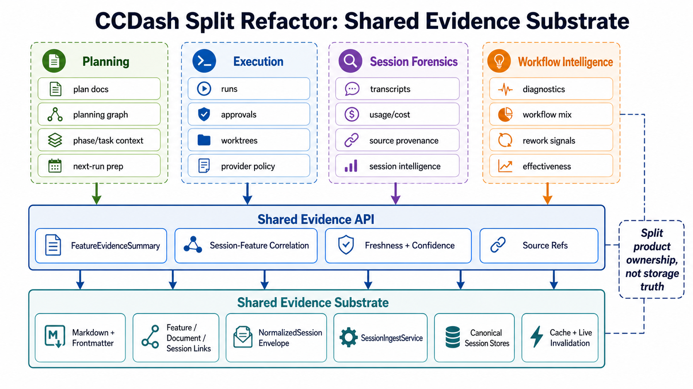
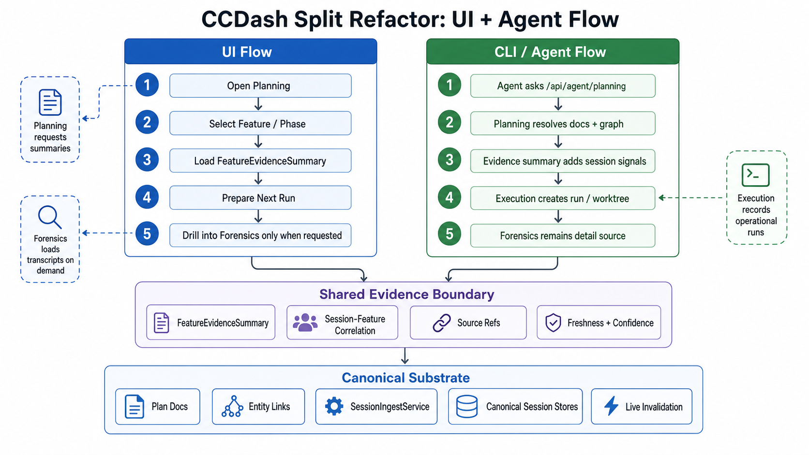

# Implementation Plan: Planning / Forensics Boundary Extraction

**Plan ID:** `IMPL-2026-05-06-PLANNING-FORENSICS-BOUNDARY-EXTRACTION`
**Date:** 2026-05-06
**Author:** Codex
**Complexity:** L
**Total Estimated Effort:** 55 points
**Target Timeline:** 2-4 engineering weeks, depending on frontend extraction depth and available test fixtures

## Executive Summary

This plan separates planning/execution workflows from session forensics/metrics by adding a bounded shared evidence contract, migrating planning reads away from full forensic DTOs, extracting reusable session-feature correlation, and splitting frontend feature-detail ownership by product domain.

The refactor is intentionally not a storage split. The shared substrate remains canonical for plan docs, feature/document/session links, normalized session ingestion, cache/provenance, and live invalidation.

## Architecture Diagrams

## Architecture Direction

### Target Ownership

| Module | Owns |
| --- | --- |
| Planning | Plan docs, planning graph, raw/effective status, phases, tasks, batch/run-prep context, mismatch/provenance |
| Execution | Runs, approvals, provider/worktree context, policy, retries, run events |
| Session Forensics | Transcripts, session messages, source provenance, usage/cost, telemetry, intelligence facts, forensic detail |
| Workflow Intelligence | Workflow effectiveness, diagnostics, workflow mix, rework/failure signals |
| Shared Evidence | Feature/document/session links, bounded summaries, freshness/confidence, source refs, cache/live invalidation helpers |

### New Read Contract

Add `FeatureEvidenceSummary` as a transport-neutral service/DTO and expose it additively.

Required fields:

- `feature_id`
- `project_id`
- `session_count`
- `representative_sessions`
- `primary_session_ids`
- `token_usage_by_model`
- `total_tokens`
- `estimated_cost`
- `workflow_mix`
- `latest_activity_at`
- `freshness`
- `confidence`
- `source_refs`
- `warnings`

The summary must not fetch transcript logs by default. Full transcript and forensic enrichment remain behind feature-forensics/session-forensics surfaces.

## Phase Overview

| Phase | Title | Effort | Primary Owner |
| --- | --- | --- | --- |
| 0 | Contract Inventory And Guardrails | 5 pts | architecture/documentation worker |
| 1 | Shared Evidence Summary Service | 10 pts | backend boundary worker |
| 2 | Planning Query Migration | 9 pts | planning backend worker |
| 3 | Session-Feature Correlation Extraction | 9 pts | backend correlation worker |
| 4 | Frontend Feature Detail Boundary | 12 pts | frontend surface worker |
| 5 | Workflow Intelligence Ownership Cleanup | 4 pts | workflow/frontend worker |
| 6 | Validation, Compatibility, Docs Closeout | 6 pts | validation worker |

## Phase 0: Contract Inventory And Guardrails

**Goal:** Lock the exact consumers and fields before code moves.

**Tasks:**

| ID | Task | Acceptance Criteria | Assigned Subagent(s) |
| --- | --- | --- | --- |
| P0-001 | Inventory planning consumers of forensics/token/session evidence | List all planning services, routes, hooks, and components that read token/session evidence | backend-architect, documentation-writer |
| P0-002 | Inventory feature/session frontend consumers | List modal/session/detail surfaces that need summary versus full forensics | frontend-developer, ui-engineer-enhanced |
| P0-003 | Define compatibility fields | Existing planning DTO fields that must remain stable are documented | backend-architect |
| P0-004 | Add guardrail notes | Note that no database split, service fork, or OTel merge-policy implementation is in this refactor | documentation-writer |

**Quality Gate:** Implementation cannot start until compatibility fields and summary fields are fixed.

## Phase 1: Shared Evidence Summary Service

**Goal:** Add a bounded backend evidence-summary contract.

**Tasks:**

| ID | Task | Acceptance Criteria | Assigned Subagent(s) |
| --- | --- | --- | --- |
| P1-001 | Add DTO/model types for `FeatureEvidenceSummary` | DTO includes required fields and source/freshness metadata | python-backend-engineer |
| P1-002 | Add transport-neutral query/service | Service aggregates session counts, token totals, workflow mix, latest activity, confidence, and source refs without transcript-log enrichment | backend-architect |
| P1-003 | Add additive route exposure | Agent/client route returns the summary without changing existing planning or forensics endpoints | python-backend-engineer |
| P1-004 | Add cache/invalidation policy | Cache key and invalidation topics are documented and covered by tests where practical | backend-architect |

**Quality Gate:** Summary service works for linked sessions, empty evidence, partial/missing telemetry, and stale data without calling transcript enrichment.

## Phase 2: Planning Query Migration

**Goal:** Planning consumes bounded evidence rather than full feature forensics.

**Tasks:**

| ID | Task | Acceptance Criteria | Assigned Subagent(s) |
| --- | --- | --- | --- |
| P2-001 | Replace direct forensics dependency in planning query service | Planning feature context no longer imports or calls full `FeatureForensicsQueryService` for token evidence | python-backend-engineer |
| P2-002 | Preserve response compatibility | Existing planning token telemetry, total token, and token usage fields remain present | python-backend-engineer |
| P2-003 | Add compatibility tests | Tests compare old expected planning token/session fields against new summary-backed output | testing-specialist |
| P2-004 | Review next-run preview context selection | Selected explicit sessions still resolve correctly; richer forensic context is only loaded when explicitly requested | backend-architect |

**Quality Gate:** Existing planning APIs pass compatibility tests, and planning no longer depends on transcript-heavy forensic detail for summary evidence.

## Phase 3: Session-Feature Correlation Extraction

**Goal:** Move reusable correlation logic behind a shared boundary.

**Tasks:**

| ID | Task | Acceptance Criteria | Assigned Subagent(s) |
| --- | --- | --- | --- |
| P3-001 | Extract shared correlation helper/query | Explicit links, phase hints, task hints, command tokens, and lineage behavior are preserved | backend-architect |
| P3-002 | Migrate planning session board to shared correlation | Board output remains compatible for project-wide and feature-scoped views | python-backend-engineer |
| P3-003 | Make evidence summary use shared correlation where needed | Summary and board do not duplicate correlation heuristics | python-backend-engineer |
| P3-004 | Add regression fixtures | Tests cover explicit links, inferred links, subagent sessions, missing feature links, and ambiguous hints | testing-specialist |

**Quality Gate:** Old and new correlation outputs match on fixtures. No projection table is added in this phase.

## Phase 4: Frontend Feature Detail Boundary

**Goal:** Separate planning, forensics, and execution UI ownership inside feature detail surfaces.

**Tasks:**

| ID | Task | Acceptance Criteria | Assigned Subagent(s) |
| --- | --- | --- | --- |
| P4-001 | Extract reusable feature-detail shell/data boundary | Shell owns tab frame, loading, retry, and section boundaries without owning product-specific tab internals | frontend-developer, ui-engineer-enhanced |
| P4-002 | Move planning-native tabs/actions into planning module | Planning drawer/modal renders planning phases, tasks, docs, status provenance, and next-run controls from planning-owned components | frontend-developer |
| P4-003 | Move session evidence tabs into forensics/session module | Linked sessions, transcript evidence, usage, and forensic detail load only in forensics-owned tabs | frontend-developer |
| P4-004 | Preserve lazy loading and encoded IDs | Tests prove no eager linked-session detail loading and path parameters are encoded | ui-engineer-enhanced |
| P4-005 | Retire legacy detail fetch only after equivalent v1 sections exist | `getLegacyFeatureDetail` removal is gated by feature parity and tests | frontend-developer |

**Quality Gate:** Modal/drawer behavior remains functionally equivalent, with planning and forensics tabs owned by separate modules and no eager linked-session regression.

## Phase 5: Workflow Intelligence Ownership Cleanup

**Goal:** Make workflow diagnostics/effectiveness a product module rather than generic Analytics ownership.

**Tasks:**

| ID | Task | Acceptance Criteria | Assigned Subagent(s) |
| --- | --- | --- | --- |
| P5-001 | Identify current workflow diagnostics UI/routes | Existing entrypoints and Analytics dependencies are documented | frontend-developer |
| P5-002 | Move ownership to workflow-intelligence module | Workflow diagnostics/effectiveness components and hooks live under a workflow-owned boundary | frontend-developer |
| P5-003 | Preserve Analytics discoverability | Analytics links or embeds still navigate users to workflow diagnostics | ui-engineer-enhanced |

**Quality Gate:** Workflow diagnostics still render and Analytics no longer owns workflow-specific behavior.

## Phase 6: Validation, Compatibility, Docs Closeout

**Goal:** Prove behavior stability and close the planning artifacts.

**Tasks:**

| ID | Task | Acceptance Criteria | Assigned Subagent(s) |
| --- | --- | --- | --- |
| P6-001 | Run backend focused tests | Agent query, planning, feature surface, ingestion boundary, and correlation tests pass | testing-specialist |
| P6-002 | Run frontend focused tests | Modal/drawer lazy loading, encoded IDs, session detail, and workflow routing tests pass | frontend-developer |
| P6-003 | Run typecheck/build where available | Frontend build/typecheck and backend compile checks pass or environment caveats are documented | testing-specialist |
| P6-004 | Update docs and status | PRD/implementation plan status and any progress file created for implementation are updated accurately | documentation-writer |

**Quality Gate:** Validation output includes exact commands, pass counts, and any environment caveats. Broad Python collection segfaults, if still present, are recorded as environment caveats rather than regressions.

## Public Interfaces And Compatibility

Additive interfaces:

- A new backend `FeatureEvidenceSummary` DTO/model.
- A new transport-neutral query/service for evidence summaries.
- A new route for evidence summaries, preferably under the agent query surface first.
- Shared correlation helper/query callable by planning session board and evidence summary.

Compatibility requirements:

- Existing `/api/agent/planning/*` response fields remain stable.
- Existing `/api/agent/feature-forensics/{feature_id}` continues to return full forensic detail.
- Existing feature-surface v1 contracts remain available during frontend migration.
- No existing ingest adapter or JSONL persistence behavior changes.

## Validation Plan

Backend focused suites:

- Evidence summary aggregation, empty-state, partial telemetry, stale/fresh confidence, and no transcript enrichment.
- Planning query compatibility for summary/context token fields.
- Planning session board and shared correlation fixtures.
- Feature-forensics route compatibility.
- Ingestion boundary tests proving JSONL complete upsert behavior is unchanged.

Frontend focused suites:

- Planning feature detail modal/drawer lazy tab behavior.
- No eager linked-session detail loading on board/modal open.
- Encoded feature IDs across detail and write paths touched by the refactor.
- Session/forensics tabs still render linked sessions and transcript evidence.
- Workflow diagnostics route/module remains reachable from Analytics.

Commands should be chosen from existing package scripts and focused pytest targets. Avoid a broad Python 3.12 collection run if it still triggers the known runtime-bootstrap segfault.

## Rollout Strategy

1. Land backend evidence summary additively.
2. Migrate planning reads while preserving response fields.
3. Extract correlation and validate against fixtures.
4. Migrate frontend shell/tabs behind existing route behavior.
5. Move workflow diagnostics ownership.
6. Remove legacy frontend fetches only after equivalent v1 section APIs and tests exist.
7. Defer OTel partial metrics/event merge semantics to a later plan.

## Risk Mitigation

| Risk | Mitigation |
| --- | --- |
| Summary contract grows too large | Keep the DTO bounded and explicitly exclude transcript logs. |
| Planning consumers regress | Preserve response fields and add compatibility tests before deleting old code. |
| Correlation output changes | Compare old/new fixtures before switching consumers. |
| Frontend lazy loading regresses | Add request-count tests and tab-level loading/error tests. |
| Workflow move hides diagnostics | Keep Analytics navigation to the workflow-intelligence surface. |
| OTel partial merge becomes entangled | Keep merge-policy support deferred and documented as out of scope. |

## Assumptions

- This plan does not create a progress tracker until implementation begins.
- The first implementation branch should use task- or phase-scoped commits.
- Subagents should be delegated bounded backend, frontend, and validation slices.
- `entity_links` remains the v1 bridge contract.
- No new database tables are added unless later profiling proves the shared correlation query needs a projection table.
- Markdown/frontmatter artifacts remain canonical for planning.
- `backend/ingestion/SessionIngestService` remains the canonical session persistence path.
