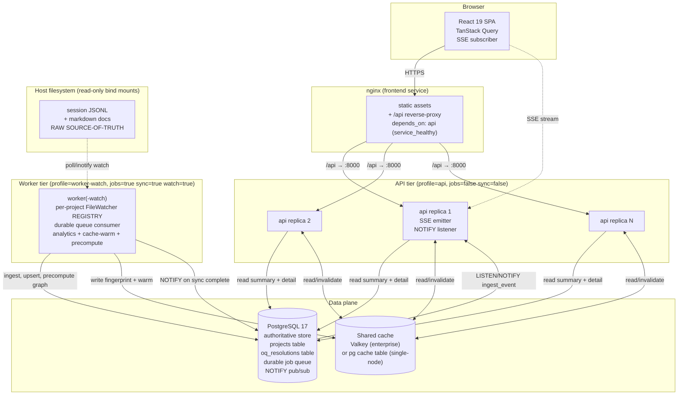

# CCDash Enterprise Target Architecture Proposal

> Adopts the synthesis brief §6 target-architecture decisions and §8 open decisions verbatim. The
> root-cause framing, Phase 0-6 boundaries, and enterprise-primary stance are inherited from
> `.claude/worknotes/ccdash-enterprise-edition-v1/synthesis-brief.md`. Every nontrivial claim cites
> file:line evidence from the 12-domain forensic investigation.
>
> **Thesis (synthesis §0):** CCDash already contains most of the enterprise scaffolding it needs.
> The enterprise edition is not failing because the architecture is wrong; it is failing because the
> last mile is mis-wired and disabled-by-default, plus a cluster of data-volume / N+1 /
> cache-correctness defects make it slow at `skillmeat` scale. The work ahead is **finishing, wiring,
> and hardening** — not rewriting. **Container + Postgres is the PRIMARY target; local mode is a dev mode.**

---

## 1. Principles & Target Topology

### 1.1 Architectural Principles (enterprise-primary)

| # | Principle | Why (evidence) |
|---|-----------|----------------|
| P1 | **Postgres is authoritative for all enterprise tiers; SQLite is dev-only.** | The 10 GB SQLite single-connection serializes all reads/writes (`backend/db/connection.py` singleton — multi-project investigation Gap 2). SQLite stays for `local` profile only. |
| P2 | **State that must be shared across replicas lives in Postgres or the shared cache — never in process memory or a host file.** | `projects.json` is a host file that diverges across replicas (`backend/project_manager.py:287`); `_OQ_OVERLAY` and the `TTLCache` singleton are per-process (`cache.py:50`). |
| P3 | **Fail loud, never silently empty.** Misconfiguration must fail `readyz`, not return an empty dashboard. | Watcher passes `readyz` while watching zero paths (`file_watcher.py:252-266`, ingestion-fs Finding 11). |
| P4 | **Summary reads are cheap, cached, and column-projected; detail reads are lazy and per-entity.** | Every planning service does `SELECT *` `list_all → LIMIT 5000` (`planning.py:660,670`; backend-api §6.1). |
| P5 | **The worker owns all heavy/precompute work; the api container only serves and reads cache.** | `api` profile is `jobs=False, sync=False` by design (`profiles.py:41-52`). This is correct — keep it. |
| P6 | **Resilience-by-default: every new optional backend field requires an explicit FE fallback.** Missing is a contract state, not a bug. | Inherited from CLAUDE.md operating procedures. |
| P7 | **Defaults are the contract.** A standard `docker compose up` enterprise deploy must ingest live data with zero extra flags. | `live-watch` profile + 3 disabled-by-default flags currently break this (synthesis §1). |

### 1.2 Target Topology Diagram



ASCII fallback (same topology):

```
                         +------------------+
  Browser (SPA + SSE) -->|  nginx frontend  |---/api proxy-->+------------------+
                         |  depends_on:api  |                |  api replica 1   |--SSE-->Browser
                         +------------------+                |  api replica 2   |
                                                             |  api replica N   |
                                                             +--------+---------+
                                                                      |  read summary/detail
                          +------------------+   LISTEN/NOTIFY         v        <--read/invalidate-->  +--------------+
                          |  worker(-watch)  |--NOTIFY-->+------------------------+                    | Shared cache |
   host FS (RO mounts) -->|  watcher REGISTRY|---upsert->|     PostgreSQL 17      |<--fingerprint/warm-| Valkey / pg  |
   session JSONL + md     |  durable queue   |  precompute|  projects table        |                    +--------------+
   = RAW SOURCE-OF-TRUTH  |  analytics/warm  |  graph    |  oq_resolutions table  |
                          +------------------+           |  durable job queue     |
                                                         +------------------------+
```

**Key topology decisions (synthesis §6):**
- Frontend nginx → api replicas: api is stateless and horizontally scalable because all shared state moves to Postgres + Valkey.
- Worker → Postgres NOTIFY → api SSE: the live-ingest fan-out already exists (`container.py:216-235`, worker publishes / api listens) and is correct — keep and harden (add reconnect/backoff, ingestion-fs Finding 9).
- Volumes: host FS bind-mounted read-only into the worker only; api never reads the filesystem.
- Durable queue: Postgres-backed (default) or Valkey-backed (opt-in), replacing the bare `asyncio.create_task()` scheduler (`adapters/jobs/local.py:8-10`).

---

## 2. Backend Architecture

### 2.1 Keep the layered router → service → repository pattern

The layered architecture is sound and is **not** the problem. Routers (`backend/routers/agent.py`) call transport-neutral services (`backend/application/services/agent_queries/`) which call repositories (`backend/db/repositories/`). The agent-query layer is correctly shared across REST + CLI + MCP. No restructuring; the changes below operate **within** this pattern.

### 2.2 Summary-vs-Detail Endpoint Split (synthesis §6 decision 5; principle P4)

Today every planning surface loads the full project on every call. The split:

| Read | Today | Target |
|------|-------|--------|
| Planning summary list | `features.list_all → LIMIT 5000` + per-feature projection loop (`planning.py:929-935`) | `features.list_summary(project_id)` — column-projected; non-terminal default filter |
| Feature detail (modal) | Loads ALL features + ALL docs for one feature (`planning.py:1334,1343`) | Summary on modal open; per-tab detail fetch keyed by `feature_id` |
| Command-center item | `get_command_center(page_size=500)` then scans for one item (`planning_command_center.py:567-578`) | Scoped DB lookup by `feature_id` (backend-api Fix 4) |
| Session board | `list_paginated(0, 500)` unconditional (`planning_sessions.py:609`) | Server pagination + cursor; cache wrapper |

### 2.3 Parallelize bundle sub-calls (`asyncio.gather`)

`get_planning_view_bundle` calls three sub-services **sequentially** (`planning.py:2199, 2220, 2242`), and each independently re-loads all features + all docs — **6× `list_all` per `?include=graph,session_board` request** (backend-api §6.2). Target:

```python
# get_planning_view_bundle (planning.py:2158) — target shape
features, docs = await asyncio.gather(_load_all_features(...), _load_all_doc_rows(...))  # ONE shared pass
summary, graph, board = await asyncio.gather(
    _build_summary(features, docs), _build_graph(features, docs), _build_board(features, docs)
)
```

This is backend-api Fix 2 (CRITICAL, M). The single-call sequential pattern at `agent.py:696` is the #2 highest-cost endpoint.

### 2.4 Column-projected `list_summary` variants (synthesis §6 decision 5)

`features.list_all` returns `SELECT *` including the large `data_json` blob (`features.py:260-265`; backend-api §6.9). Add `list_summary(project_id)` selecting only `id, name, status, category, updated_at, phases_json` (backend-api Fix 6). Documents get the same treatment (`documents.list_all → list_paginated(0, 5000)`, `documents.py:394-398`). Pair with `status NOT IN ('done','deferred','completed')` default filter for summary views (backend-api Fix 7).

### 2.5 Cache the V1 command center + session board

`PlanningCommandCenterQueryService.get_command_center` has **no** `@memoized_query` (`planning_command_center.py:351`; backend-api §6.6) and `PlanningSessionQueryService.get_session_board` likewise (`planning_sessions.py:560`). Add `@memoized_query` to both (backend-api Fix 3, Fix 8). Also port the MPCC `_NullGitProbe` deferral pattern to the V1 build phase so git subprocesses fire only for page-visible items (`worktree_git_state.py` spawns one `subprocess.run` per feature today — `planning_command_center.py:607`; backend-api Fix 9).

---

## 3. Database & Data-Access

### 3.1 Postgres authoritative; `projects` table replaces `projects.json`

`projects.json` is a host file loaded at `backend/project_manager.py:287`; `_save()` is a synchronous unguarded `write_text` (`project_manager.py:140-147`) that (a) corrupts under concurrent writes and (b) cannot be shared across replicas (multi-project Gap 1, CRITICAL). The read-only container mount makes `_save()` raise `PermissionError` on startup migration (`compose.yaml:48`; container-deploy §3.3). **Target:** a `projects` table (id, name, root_path, sessions_path, docs_path, progress_path, active flag, created_at, updated_at); `ProjectManager` becomes a thin repository facade. `CCDASH_PROJECTS_FILE` is currently a dead env var (container-deploy §3.4) — repurpose or remove.

### 3.2 Open-question (OQ) resolutions → DB

Resolutions live in process memory (`_OQ_OVERLAY`) and are lost on restart / incompatible with multi-instance (synthesis §4; issue-ledger HIGH). The only `clear_cache()` call site is `resolve_open_question()` at `planning.py:1567`. **Target:** an `oq_resolutions` table keyed by `(project_id, feature_id, question_id)`; resolution writes go to Postgres and emit a project-scoped cache invalidation (see §7.4).

### 3.3 Retention / TTL for `analytics_entries` + `telemetry_events`

The two unbounded tables (synthesis §2a):

| Table | Size | Growth | Fix |
|-------|------|--------|-----|
| `analytics_entries` | 1.8M rows / 466 MB (`dbstat`) | +~2,400-2,600 rows/snapshot, multiple/hr, **zero prune** (`repositories/analytics.py` has no DELETE) | 90-day rolling window `DELETE ... WHERE period='point' AND captured_at < now()-interval '90 days'`; or `daily` rollups beyond 7 days (50× reduction → ~90K rows) (database §8 Priority 1) |
| `analytics_entity_links` | 3.6M rows / 166 MB | 2 links/entry, unpruned (`database` §2c) | Prune in the same retention job |
| `telemetry_events.payload_json` | 918K rows / 1.6 GB, avg 1.6 KB (max 2.3 MB) | per-JSONL-entry, no TTL (`sqlite_migrations.py:500-542`) | TTL retention job + Postgres `jsonb` TOAST compression; offload payloads >30 days to filesystem (database §8 Priority 3) |

Retention runs as a scheduled worker job (Phase 6), not inline, to avoid blocking sync.

### 3.4 Transcript strategy (synthesis §8 — canonical-only)

**Decision (adopt synthesis recommendation): keep canonical `session_messages` only, drop duplicate `session_logs`, filesystem JSONL is raw source-of-truth.**

Evidence: `session_logs` (546K rows / 2.1 GB) and `session_messages` (385K rows / 1.2 GB) store the **same** transcript content twice (`sqlite_migrations.py:178-225`; database §2a). ~1.75 GB of `session_logs` is never purged after canonical `session_messages` exist (perf-evidence; issue-ledger MEDIUM). The filesystem JSONL is always re-derivable. Migration path: (1) confirm all consumers read `session_messages`; (2) stop populating `session_logs`; (3) backfill-drop. The `GET /api/sessions` list N+1 (§3.6 below) reads `session_logs` today (`api.py:628`) — that consumer must migrate first. FTS5 (SQLite) / `tsvector` (Postgres) replaces the `LIKE` full-table-scan content search (`session_messages` LIKE scan — database §8; perf-evidence MEDIUM).

### 3.5 Candidate indexes (backfill via `_ensure_index`, not DDL-block)

The composite index is **declared but absent from the live DB** because `_TABLES` only runs on a version bump and it was never added as an `_ensure_index` backfill (`sqlite_migrations.py:161-162` vs runner gate `sqlite_migrations.py:1362-1367`; database §3a). All of these must be added as backfill calls:

```sql
-- CRITICAL: count_active / list_active (sessions.py:434-457) — currently falls back to partial index
CREATE INDEX IF NOT EXISTS idx_sessions_project_status_updated ON sessions(project_id, status, updated_at);
-- HIGH: file-watch sync path list_by_source/delete_by_source — full table SCAN today (sessions.py:161-167; sync_engine.py:4121-4130)
CREATE INDEX IF NOT EXISTS idx_sessions_source_file ON sessions(source_file);
CREATE INDEX IF NOT EXISTS idx_sessions_project_source_file ON sessions(project_id, source_file);
-- MEDIUM: dominant analytics predicate (period='point') — HAVING anti-pattern today (analytics.py:103-121)
CREATE INDEX IF NOT EXISTS idx_analytics_entries_point ON analytics_entries(project_id, metric_type, captured_at DESC) WHERE period='point';
-- entity_links project scope (see §5) — enables project-scoped fingerprint
CREATE INDEX IF NOT EXISTS idx_links_project ON entity_links(project_id);
```

Also fix: the Postgres `idx_links_upsert` UNIQUE constraint is created as a **late** migration step (`postgres_migrations.py:1491-1498`), so on a fresh install `ON CONFLICT` silently inserts duplicates before the constraint exists (database §5a, HIGH). Move it into the initial `_TABLES` DDL block. Resolve the SQLite(27)/Postgres(28) schema-version divergence (`sqlite_migrations.py:16` vs `postgres_migrations.py:11`; database §6b).

### 3.6 Batched `executemany` + single-transaction upserts

| Anti-pattern | Evidence | Fix |
|--------------|----------|-----|
| `entity_graph.upsert()` commits per link → 25K commits per rebuild | `entity_graph.py:40` | batch `executemany` + single `commit()` at end of `_rebuild_entity_links` |
| `_capture_analytics` triple N+1: 367 features × (task list + link list + per-session get_by_id) = ~12-15K queries/snapshot | `sync_engine.py:5874-5960` | pre-load tasks/links/sessions in bulk keyed by feature; single pass |
| Postgres `upsert_logs`/`upsert_file_updates` = DELETE then N INSERT, **not atomic** (Pool acquires/releases per call) | `repositories/postgres/sessions.py:88+`; uses Pool not `postgres_transaction` helper | wrap in `async with conn.transaction()` via the existing `_transactions.py` helper |
| Row-by-row INSERT (no `executemany`) across telemetry/attribution/logs | perf-evidence; database §4 | `executemany` batches |
| Backfill loops: per-session `get_logs/get_tool_usage/get_file_updates/get_artifacts` = up to 37K SELECTs/run | `sync_engine.py:2058-2095` | batched/joined fetch |

### 3.7 SQLite pragma tuning (dev profile only)

Current SQLite opens with WAL + foreign_keys + busy_timeout but **no `cache_size`** → 2000 pages / 8 MB for a 9.5 GB DB (`connection.py:52-57`; database §5e, HIGH). Dev-mode pragmas:

```python
await conn.execute("PRAGMA cache_size=-131072")  # ~128 MB (negative = KiB)
await conn.execute("PRAGMA synchronous=NORMAL")  # cache DB is reconstructible from FS
await conn.execute("PRAGMA mmap_size=268435456") # 256 MB mmap
```

These apply to the `local` profile only; enterprise uses Postgres and never touches these.

---

## 4. Worker Architecture

### 4.1 Multi-project worker with a per-project FileWatcher REGISTRY

The root constraint: `FileWatcher` is a **process-level singleton** (`file_watcher.py:307`) — exactly one project watched at a time; switching stops/restarts on new paths (`rebind_watcher`, multi-project §4). Today multi-project = N worker containers, one per project, no orchestration (synthesis §3; multi-project Gap, CRITICAL XL).

**Target:** replace the singleton with a `FileWatcherRegistry` that holds one watcher task per registered project, each watching that project's resolved paths. The worker iterates `workspace_registry.list_projects()` (DB-backed per §3.1) at startup and registers a watcher per project. Analytics/cache-warm loops likewise iterate all projects instead of `bound_project or get_active_project()` (`runtime.py:794-799, 894-895`; workers-runtime Option B key change).

### 4.2 Durable task queue + retry / priority / backpressure / supervision

`InProcessJobScheduler.schedule()` is a 2-line bare `asyncio.create_task()` (`adapters/jobs/local.py:8-10`) with **no** queue, retry, priority, backpressure, or supervision. A crashed task is silently lost; `status_snapshot()` reports `idle` not `dead` (`runtime.py:385-420`; workers-runtime). There is **no durable queue** → full re-sync on every restart (`sync_engine.py:2966-2984`; workers-runtime HIGH XL).

**Target:** a durable, Postgres-backed (or Valkey-backed) task queue with:
- **Durability:** enqueued jobs survive restart; partial syncs resume from a checkpoint instead of full re-sync.
- **Retry:** exponential backoff on transient failure; dead-letter after max attempts.
- **Priority:** startup-sync and live-ingest outrank analytics/cache-warm/telemetry-export.
- **Backpressure:** bounded concurrency per project; queue-depth metric feeds readiness.
- **Supervision:** a watchdog detects task death and restarts or alarms; probe reports `dead` distinctly from `idle`.

Also fix wiring gaps: `CCDASH_WORKER_STARTUP_SYNC_ENABLED` and `CCDASH_WORKER_WATCH_PROJECT_ID` are compose-layer-only and unread by `config.py` (workers-runtime; `config.py:149,961`) — k8s/bare-container trap. Remove the module-level `container = build_worker_runtime()` import-time side effect (`bootstrap_worker.py:86`).

### 4.3 Topology options (synthesis §8 — present tradeoffs)

| Option | Mechanism | Pros | Cons | Best for |
|--------|-----------|------|------|----------|
| **A — one worker watch-all (DEFAULT)** | Single worker container with `FileWatcherRegistry`, one watcher task per project; analytics/warm loops iterate all projects | One container for all projects; shared scheduler; cross-project analytics aggregation; lowest ops burden | No isolation — one slow project's sync competes on the event loop; single failure domain | Small/medium fleets (< ~15 projects) |
| **B — one container per project (OPT-IN ISOLATION)** | N `worker-watch` containers, each `CCDASH_WORKER_PROJECT_ID=<id>` (today's shipped model) | Full blast-radius isolation; independent failure domains; per-project resource limits | N containers; no shared scheduler; linear ops burden | Projects with very different ingest rates, SLA/isolation requirements |
| **C — scoped worker pools (FUTURE)** | Stateless runners consuming the durable queue; projects enqueue sync/analytics jobs | True horizontal scaling; project-level concurrency control; durable retries | Largest refactor (XL); watcher still needs per-project FS access | > 15 projects, strict SLAs |

**Recommendation (synthesis §6 decision 4): Option A as default + Option B as opt-in isolation.** The durable queue (§4.2) is the substrate that makes A robust and is the migration path to C without a rewrite. Confirm against deployment scale expectations (synthesis §8 open decision).

### 4.4 Project-scoped scheduling + multi-project warming/analytics

Analytics snapshot and cache warming today use a single `current_project` (`runtime.py:794-799`); cache warming covers only 2 of 14 endpoints, active project only (caching §"warming"). Target: per-project scheduling iterating `list_projects()`, warming the high-traffic endpoints (`planning_project_summary`, `dashboard_bundle`, `analytics_overview_bundle`, `system_active_count`) for each project (caching Tier 6). Wire `TelemetryExporterJob`/`ArtifactRollupExportJob` for `worker-watch` (today `profile.name == "worker"` only — `container.py:144-156`).

---

## 5. Multi-Project Isolation Model

### 5.1 Project-scoped cache keys + fingerprint

Cache keys are already project-scoped: `{endpoint}:{project_id|global}:{param_hash}:{fingerprint}` (`cache.py:294-317`) — **no cross-project leakage**. The defect is the **fingerprint**: query #5 (`entity_links`) is a full global `GROUP_CONCAT` scan with **no `project_id` filter** because `entity_links` has no `project_id` column (`cache.py:258-289`; `sqlite_migrations.py:37-56`). This runs on every request to every cached endpoint, before the key is even computed (caching §"fingerprint"; backend-api §6.7).

**Target:**
1. Add `project_id` column to `entity_links` (index `idx_links_project`, §3.5) so the fingerprint can filter by project (synthesis §6 decision 5).
2. **Cache the fingerprint itself** with a short 5-10 s TTL — eliminates the 6 fingerprint DB queries on hot paths (caching Tier 3; the fingerprint is recomputed fresh every request today, `cache.py:84-142`).
3. Replace the `feature_phases` O(N) `GROUP_CONCAT` marker (`cache.py:195-255`) with a sync-engine-maintained version counter.

### 5.2 Session PK scoped by project; project_id on detail tables

`sessions.id` is a global PK; `ON CONFLICT(id)` omits `project_id` (`repositories/sessions.py:20-87`) → a cross-project session-ID collision silently "steals" a session from project A to B (multi-project §3, HIGH). `session_logs`, `session_tool_usage`, `session_file_updates` have **no `project_id` column** — isolation exists only at the `sessions` table. **Target:** scope the session uniqueness by `(project_id, id)`; add `project_id` to the three detail tables (synthesis §6; issue-ledger HIGH).

### 5.3 Fail-loud on headerless requests in enterprise

`resolve_project()` step 4 falls back to the global active project when no `X-CCDash-Project-Id` header is present (`application/services/common.py:93-120`; `container.py:415-425`) — a silent data-routing bug in a multi-tenant API (multi-project §2, HIGH). **Target:** in enterprise mode, a headerless request with no JWT project claim returns `400` (no global active fallback). Local mode keeps the convenience fallback. This makes the per-request project scope mandatory and explicit, consistent with the existing hosted-mode block on `POST /api/projects/active/{id}` (`routers/projects.py:138-147`).

---

## 6. Session-Ingestion Model (container-safe)

This is the root-cause-#1 cluster (synthesis §1). Four compounding defects, each sufficient alone to leave the container DB empty:

| Defect | Evidence | Fix |
|--------|----------|-----|
| Ingestion disabled by default | `CCDASH_ENTERPRISE_FILESYSTEM_INGESTION_ENABLED` defaults false in the `x-backend-service` anchor → `_sync_engine_enabled()` returns false → `SyncEngine` never built (`config.py:244-246`; `container.py:237-242`) | Flip worker ingestion/startup-sync defaults on; fold `live-watch` into the default enterprise topology (Phase 0) |
| Worker startup sync off | `CCDASH_WORKER_STARTUP_SYNC_ENABLED:-false` (`compose.yaml:133`) | Default true for the watch worker |
| Host paths don't resolve in-container | `projects.json` stores host-absolute `~/...` paths; `FilesystemProjectPathProvider.resolve()` calls `expanduser().resolve(strict=False)` verbatim (`providers/filesystem.py:25-28`); watcher silently drops non-existent paths (`file_watcher.py:252-266`) | **Auto-derive container path aliases from `ResolvedProjectPaths`** at `SyncEngine` construction, not from 6 hand-set env vars (ingestion-fs §"Reliable container ingest") |
| inotify doesn't fire on Docker bind mounts | `watchfiles` defaults to inotify; `WATCHFILES_FORCE_POLLING` defaults false (`file_watcher.py:16,183`) | **`WATCHFILES_FORCE_POLLING` default true in container** |

**Additional ingestion targets:**
- **`readyz` FAILS when watch paths == 0.** A `worker-watch` with zero existing watch paths is misconfigured and must fail readiness, not log a line and pass (`file_watcher.py:108-112`; ingestion-fs §"Minimum viable fix"). This is principle P3.
- **Manifest-based session-scan skip.** `_sync_sessions` does a full `rglob("*.jsonl")` + `stat` + DB lookup per file on every startup; the `_light_mode_scan_skip` only covers `.md` documents (`sync_engine.py:4107-4119, 4239-4278`; ingestion-fs Finding 5). Add an inode/mtime manifest snapshot for JSONL.
- **Canonical source-key delete path.** The watcher-triggered delete uses raw `str(path)` (`sync_engine.py:3943-3945`) while full-sync uses the canonical key (`sync_engine.py:4171`) → orphaned rows after file deletion (ingestion-fs Finding 7, HIGH). Use `_canonical_source_key(project_id, path, "session")` in both.
- **Postgres NOTIFY listener reconnect/backoff.** The listener has no backoff; a dropped connection silently kills live fan-out permanently (`adapters/live_updates/postgres_listener.py`; ingestion-fs Finding 9, FU-2).

---

## 7. Caching & Indexing Strategy

### 7.1 Shared cache (Valkey enterprise / Postgres-cache single-node fallback)

The `TTLCache(maxsize=512)` singleton (`cache.py:50`) lives in one process; each api replica has its own cold, inconsistent copy, and the `api` profile has `jobs=False` so it is **never** warmed (`profiles.py:41-52`; `runtime.py:192`). This is the single most important enterprise correctness fix (synthesis §6 decision 1; caching CRITICAL).

**Target:** a shared cache behind all replicas. Serialize values as msgpack/JSON; reuse the existing project-scoped key format; the worker writes/warms, the api replicas read. Per-metric TTL namespaces enforce the today-phantom `CCDASH_LIVE_COUNT_CACHE_TTL_SECONDS` (10 s) and `CCDASH_SYSTEM_METRICS_CACHE_TTL_SECONDS` (30 s) that are documented but never wired into the single-TTL `TTLCache` (caching §"phantom config"). Raise effective `maxsize` (Valkey has none; pg-cache table is unbounded) — 512 is insufficient for 36 projects × 14 endpoints × param variants (caching MEDIUM).

### 7.2 Cache the fingerprint

See §5.1.2 — cache the data-version fingerprint with a 5-10 s TTL to eliminate the 6 fingerprint DB queries on hot requests.

### 7.3 Precompute the planning graph in DB

`get_project_planning_graph` rebuilds the graph in-memory per cache TTL by calling `build_planning_graph` for every feature in a loop (`planning.py:1180,1247`; data-contracts HIGH). **Target:** the worker precomputes the graph and persists it; the api reads the materialized result (synthesis §6 decision 5).

### 7.4 Sync-triggered + pub/sub invalidation across replicas

The only `clear_cache()` call is in `resolve_open_question()` (`planning.py:1567`); sync endpoints (`routers/cache.py:363-424`) do **not** invalidate after `sync_project()` completes → up to 600 s stale window after a sync (caching §"invalidation"). **Target:** after `sync_project()` completes, the worker emits a project-scoped invalidation via Postgres NOTIFY / Valkey pub/sub; api replicas evict matching keys. This makes selective project-scoped eviction (not the current full-cache `clear()`) the norm (caching LOW — `clear_cache()` evicts all projects today).

---

## 8. Frontend Performance Approach

The TanStack Query migration is substantively complete (`AppEntityDataContext` deleted; QueryClient `useRef`-stabilized; SSE infra production-grade — frontend-core §12). The finish work (synthesis §6 decision 6):

| Item | Evidence | Target |
|------|----------|--------|
| Finish TQ: V1 command center | `PlanningCommandCenter` bypasses TQ — raw `useEffect`, no cache/dedup (synthesis §2d) | Migrate to TQ hooks |
| Finish TQ: `AnalyticsDashboard` | 7 parallel raw fetches on every mount, no caching (`AnalyticsDashboard.tsx:151-158`) | TQ hooks |
| Finish TQ: Dashboard charts | 3 raw `analyticsService.*` fetches re-fire on `[sessions.length, tasks.length]` (`Dashboard.tsx:251-253`) | TQ hooks |
| Reactive `useData` | shim uses `getQueryData()` snapshot not `useQuery()` → 13+ components see stale arrays (`DataContext.tsx:132-167`) | Replace with `useQuery()` subscriptions, or remove the facade |
| Server pagination + virtualization | V1 session board has no server pagination (full project payload/load) and no virtualization (synthesis §2d) | Cursor pagination + `@tanstack/react-virtual` |
| Replace `setInterval` with `refetchInterval`/SSE | `setInterval` sprawl across 8+ components bypasses TQ visibility/dedup (`Dashboard.tsx:117`, `ProjectBoard.tsx:1422`, `OpsPanel.tsx:885,900`, …) | TQ `refetchInterval` or SSE invalidation |
| Raise staleTimes | `useFeaturesQuery refetchInterval:5_000` when SSE off (enterprise default → 12 req/min); `useFeatureSurface` list `staleTime:0` refetches every mount (`features.ts:85`; `useFeatureSurface.ts:348`) | 30 s interval / ≥10 s staleTime; prefer SSE in enterprise |
| Viewport-deferred mounting | Planning home always-mounts session board + command center → 5 concurrent cold-load requests on entry (synthesis §2d) | Defer mount until in viewport |
| Self-host fonts | Planning fonts from Google Fonts CDN fail silently in restricted-egress containers (issue-ledger MEDIUM) | Bundle/self-host |
| Gemini key server-side | `vite.config.ts:84-87` bakes `GEMINI_API_KEY` into the JS bundle (frontend-core §10.4) | Proxy server-side; remove from bundle |
| Runtime (not build-time) flags | `MULTI_PROJECT_COMMAND_CENTER_ENABLED` is a Vite build-time constant requiring rebuild (issue-ledger MEDIUM) | Runtime capability flag |

---

## 9. Container Topology

### 9.1 Services

```
docker compose --profile enterprise --profile postgres up   # live-watch FOLDED IN by default (Phase 0)

postgres     → named volume, pg_isready health-gated, pg_advisory_lock on migrations
api          → profile=api; depends_on postgres (service_healthy); SSE + NOTIFY listener
             → CCDASH_ENTERPRISE_FILESYSTEM_INGESTION_ENABLED=false (correct: api never ingests)
worker(-watch)→ profile=worker-watch; depends_on api (service_healthy) + postgres
             → FileWatcherRegistry (all projects); durable-queue consumer; analytics/warm/precompute
             → CCDASH_ENTERPRISE_FILESYSTEM_INGESTION_ENABLED=true; STARTUP_SYNC=true (DEFAULT)
             → WATCHFILES_FORCE_POLLING=true (container default)
cache        → Valkey (enterprise) OR pg-cache table reuse (single-node fallback)
frontend     → nginx; depends_on api (service_healthy)  ← ADD (today missing → 502s at startup)
```

### 9.2 Volume / path strategy

- Host FS (session JSONL + markdown) bind-mounted **read-only** into the worker only; api never reads FS.
- `projects.json` mount removed once the `projects` table is authoritative (§3.1) — eliminates the read-only-mount `PermissionError` (`compose.yaml:48`).
- Container path aliases auto-derived from `ResolvedProjectPaths` (§6) rather than 6 hand-set env vars.

### 9.3 Health + startup ordering

- `entrypoint.sh` handles `worker-watch` (today missing → crash if command override removed; container-deploy §4).
- `frontend depends_on: api` (today absent → 502 Bad Gateway until api healthy; container-deploy §2).
- `pg_advisory_lock` on migrations: api + worker race on fresh Postgres today (no lock; container-deploy §5.2).
- `readyz` FAILS on zero watch paths (§6, principle P3).
- Drop/repair the diverged `compose.hosted.yml` (broken for current worker requirements; container-deploy §9).
- Restrict CORS: `bootstrap.py:57-66` always allows `localhost:3000` regardless of production config (container-deploy §11).

### 9.4 e2e smoke gate

A CI `docker compose up` smoke test asserts that sessions appear in the DB after a fixture is dropped into a watched path (synthesis §6 decision 2). This is the regression guard that makes "defaults are the contract" (P7) enforceable. Phase 0 deliverable; re-run as the Phase 6 container e2e CI gate.

---

## 10. Tradeoffs Table — Big Decisions (synthesis §8)

| Decision | Option A | Option B | Recommendation | Rationale & evidence |
|----------|----------|----------|----------------|----------------------|
| **Shared-cache tech** | **Valkey/Redis** — true distributed cache, no maxsize, native TTL namespaces, pub/sub invalidation | **Postgres-backed cache table** — no new infra, reuses existing pg, lower throughput | **Valkey for enterprise; pg-cache fallback for single-node** | Per-replica cold/inconsistent cache is the top enterprise correctness defect (`cache.py:50`; api `jobs=False`). Valkey also carries the durable queue and pub/sub. Single-node deployments avoid an extra dependency with the pg-cache table. (synthesis §8) |
| **Worker topology** | **One worker watch-all** — `FileWatcherRegistry`, shared scheduler, cross-project analytics | **One container per project** — full isolation, today's shipped model (`CCDASH_WORKER_PROJECT_ID`) | **Watch-all default + per-project opt-in isolation** | Singleton watcher today forces N containers with no orchestration (`file_watcher.py:307`; multi-project CRITICAL XL). Watch-all cuts ops burden; isolation stays available for divergent ingest rates / SLAs. Durable queue is the migration path to pools (Option C). Confirm against scale expectations. (workers-runtime; synthesis §8) |
| **Transcript storage** | **Canonical `session_messages` only + FS source-of-truth; drop `session_logs`** | Offload raw JSONL to object storage; store only derived rows | **Canonical-only + filesystem source-of-truth** | `session_logs` + `session_messages` duplicate transcript content (2.1 GB + 1.2 GB; `sqlite_migrations.py:178-225`); ~1.75 GB never purged. FS is always re-derivable. Object storage is a heavier dependency unjustified at current scale. Gate on confirming all consumers read `session_messages` (the `GET /api/sessions` N+1 reads `session_logs` today, `api.py:628`). (database §8; synthesis §8) |
| **SQLite in enterprise** | SQLite stays a supported enterprise tier | **SQLite dev-only; Postgres mandatory for all enterprise tiers** | **Postgres mandatory; SQLite dev-only** | Single 10 GB SQLite connection serializes all reads/writes and blocks across projects (`connection.py` singleton; multi-project Gap 2). Pragma tuning (§3.7) mitigates dev mode but cannot deliver multi-replica concurrency. Confirm Postgres mandatory for all enterprise tiers. (synthesis §8) |

---

## 11. Phase Mapping (synthesis §7 — adopt verbatim)

The architecture above maps onto the fixed Phase 0-6 boundaries. No alternative phase scheme is introduced.

| Phase | Title | This proposal's sections |
|-------|-------|--------------------------|
| **Phase 0** | Enterprise Liveness Hotfix | §6 (defaults + path-alias derivation + fail-loud readyz), §9.4 (e2e smoke) |
| **Phase 1** | Storage Hygiene & DB Performance | §3.3 (retention), §3.4 (transcript dedupe), §3.5 (indexes), §3.6 (batching), §3.7 (pragmas) |
| **Phase 2** | Cache & Query Correctness | §2.2-2.5 (summary/detail split, parallelize, projection), §5.1 (scope+cache fingerprint), §7 (shared cache, invalidation) |
| **Phase 3** | DB-backed Project Registry & Multi-Project Worker | §3.1 (`projects` table), §3.2 (OQ→DB), §4 (registry, durable queue, supervision), §5.2-5.3 (isolation) |
| **Phase 4** | Frontend Performance Finish | §8 (TQ finish, pagination/virtualization, polling cleanup, defer-mount, fonts, Gemini key) |
| **Phase 5** | Command Center as Multi-Project Control Plane | §7.3 (precompute graph), runtime capability flag, cross-project rollups (data contracts, Phase 5+) |
| **Phase 6** | Observability, Retention Ops & Validation | §3.3 scheduled retention/VACUUM, §9.4 container e2e CI gate, OTEL gaps, skillmeat-scale load test |

**Sequencing (synthesis §7):** Phase 0 makes enterprise usable at all; Phase 1 makes it fast and stops the DB bleeding; Phase 2 makes it correct/fast across replicas; Phase 3 makes it genuinely multi-project; Phase 4 finishes UX performance; Phase 5 delivers the command-center vision; Phase 6 hardens and validates. Phases 1 and 4 overlap (DB vs FE owners). Phase 2 depends on Phase 1's index/scoping work. Phase 5 depends on Phases 2-3 data contracts.

---

## 12. Confidence & Open Items

Confidence (synthesis §9): container live-data failure **HIGH** (4 agents corroborate); 10 GB DB / N+1 / unbounded analytics **HIGH** (measured row/byte counts); cache non-shared / fingerprint scan **HIGH**; single-project worker/watcher **HIGH**; data-contract target shapes **MEDIUM**.

Open decisions carried to human input (synthesis §8): shared-cache tech (Valkey vs pg-cache), worker topology default (watch-all vs per-project), transcript storage (canonical-only vs object-storage offload), ARC/MeatyWiki integration depth/timing (net-new, Phase 5+), and confirming Postgres is mandatory for all enterprise tiers. All four big decisions are resolved with recommendations in §10; the §8 items remain explicitly flagged for sign-off.
