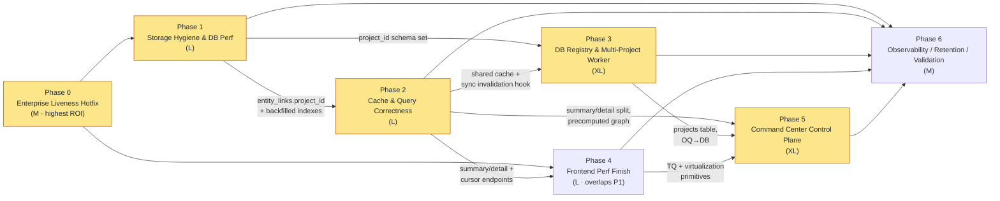

# CCDash Enterprise Edition Implementation Roadmap

> Staged, dependency-aware execution plan for the CCDash enterprise edition. Phase boundaries (Phase 0–6),
> root-cause framing, and target-architecture decisions are inherited **verbatim** from the steering brief
> (`.claude/worknotes/ccdash-enterprise-edition-v1/synthesis-brief.md` §6–7). Every nontrivial claim cites
> `file:line` evidence from the 12-domain forensic investigation; severities/complexities map to
> `.claude/worknotes/ccdash-enterprise-edition-v1/issue-ledger.md` (130 issues).
>
> **Thesis (synthesis §0):** CCDash already contains most of the enterprise scaffolding it needs. The
> enterprise edition is failing because **the last mile is mis-wired and disabled-by-default**, plus a
> cluster of data-volume / N+1 / cache-correctness defects make it slow at `skillmeat` scale. The work is
> **finishing, wiring, and hardening** — not rewriting. **Container + Postgres is the PRIMARY target; local
> mode is a dev mode.** Phase 0 is the highest-ROI unblock; Phases 1 and 4 overlap by owner.

---

## Phase Overview

| Phase | Goal | Primary owners / areas | Depends on | Quick-win? | Est complexity |
|-------|------|------------------------|------------|------------|----------------|
| **0** | Enterprise Liveness Hotfix — a default `docker compose up` ingests live data and fails loud on misconfig | container / devops, ingestion | — | **YES (highest ROI)** | M (mostly default flips + path-alias derive) |
| **1** | Storage Hygiene & DB Performance — shrink the 10 GB DB, kill the worst N+1s | database, backend (worker) | Phase 0 (live data to measure) | partial (pragmas, indexes, executemany are S) | L |
| **2** | Cache & Query Correctness — shared cache, scoped+cached fingerprint, summary/detail split | caching, backend-api | Phase 1 (indexes, `entity_links.project_id`, schema work) | no | L |
| **3** | DB-backed Project Registry & Multi-Project Worker — `projects` table, watcher registry, durable queue | workers, multi-project, database | Phase 1 (schema), Phase 2 (cache invalidation hooks) | no | XL |
| **4** | Frontend Performance Finish — TQ completion, pagination/virtualization, kill polling | frontend | Phase 2 (summary/detail + cursor endpoints) for full value; **overlaps Phase 1** | partial (staleTime/poll fixes, prefetch are S) | L |
| **5** | Command Center as Multi-Project Control Plane — portfolio default, ranked next-work, drill-down, artifacts | frontend + backend-api, integration | Phases 2, 3, 4 data contracts | no | XL |
| **6** | Observability, Retention Ops & Validation — OTEL gaps, scheduled retention/VACUUM, load test, e2e CI gate | observability, devops, QA | Phases 1–5 (instruments measure their fixes) | partial (OTEL points are S/M) | M |

**Overlap note (synthesis §7):** Phases **1 and 4 can run in parallel** — Phase 1 is DB/worker-owned, Phase 4
is FE-owned, with no shared files. Phase 2 **must** follow Phase 1 (it depends on the `entity_links.project_id`
column and the backfilled indexes). Phase 5 depends on the Phase 2/3 data contracts and the Phase 4 FE
primitives. Phase 0 unblocks everything by making enterprise produce live data at all.

---

## Phase 0 — Enterprise Liveness Hotfix

### Goal
A standard `docker compose --profile enterprise --profile postgres up` ingests live session data with **zero
extra flags**, and any misconfiguration **fails loud** (fails `readyz`) instead of silently serving an empty
dashboard. This is principle P7 ("defaults are the contract") and P3 ("fail loud, never silently empty") from
the target-arch proposal (05 §1.1). Introduces **no new subsystems**.

### Scope
**In:** the three-defect compounding wiring bug (gap-analysis §2 a/b/c), the §3 container topology defects, and
the CI e2e smoke gate.
**Out:** DB retention/index work (Phase 1), shared cache (Phase 2), DB-backed registry (Phase 3 — Phase 0 keeps
`projects.json` but makes it writable/atomic). No frontend changes.

### Key changes (issue-ledger items)

| Change | Evidence (file:line) | Ledger item |
|--------|----------------------|-------------|
| Flip enterprise filesystem-ingestion default ON / fold `live-watch` into the default enterprise topology | `config.py:244–246`; `compose.yaml:~27` | CRITICAL `CCDASH_ENTERPRISE_FILESYSTEM_INGESTION_ENABLED defaults false`; CRITICAL `Enterprise profile silently disables ingestion`; CRITICAL `live-watch profile not started by default` |
| Default `CCDASH_WORKER_STARTUP_SYNC_ENABLED=true` for the enterprise watch worker | `compose.yaml:133`; `config.py:961` | CRITICAL `Enterprise worker startup sync disabled by default` |
| Auto-derive container path aliases from `ResolvedProjectPaths` at `SyncEngine` construction (not 6 hand-set env vars) | `providers/filesystem.py:25–28`; `source_identity.py:271–308` | CRITICAL `Host-path projects.json paths do not resolve inside containers`; HIGH `Source-path alias policy not populated from ResolvedProjectPaths` |
| `readyz` **FAILS** when `worker-watch` resolves zero existing watch paths | `file_watcher.py:108–112,252–266` | HIGH `File watcher silently watches zero paths` |
| Default `WATCHFILES_FORCE_POLLING=true` for `worker-watch` on bind mounts | `compose.yaml:175`; `file_watcher.py:16,183` | HIGH `watchfiles inotify does not fire on Docker Desktop bind mounts` |
| Make `projects.json` writable (RW mount) + atomic `_save()` (temp-file + rename) | `compose.yaml:48`; `project_manager.py:140–146` | HIGH `projects.json mounted read_only but ProjectManager._save() writes`; MEDIUM `projects.json _save() torn file` |
| Add `frontend depends_on: api` (service_healthy) | `compose.yaml:195–217` | HIGH `frontend service has no depends_on:api — serves 502s` |
| Add `worker-watch` dispatch to `entrypoint.sh` | `entrypoint.sh:10–24`; `compose.yaml:165` | HIGH `entrypoint.sh does not handle worker-watch profile`; MEDIUM `worker-watch not launchable via entrypoint.sh` |
| `pg_try_advisory_lock` guard around `run_migrations()` | `container.py:106–108`; `postgres_migrations.py:1497` | MEDIUM `No pg_advisory_lock on migrations — api and worker race` |
| Gate CORS `localhost:3000` behind a dev flag | `bootstrap.py:57–66` | MEDIUM `CORS always allows localhost:3000` |
| Wire or remove the dead `CCDASH_PROJECTS_FILE` var | `config.py` (unread); `project_manager.py:287` | HIGH `CCDASH_PROJECTS_FILE env var is a dead variable` |
| Repair or deprecate `compose.hosted.yml` | container-deploy §9 | HIGH `compose.hosted.yml is diverged and broken` |
| Add a startup fail-loud log when enterprise + ingestion-off + empty DB | multi-project Gap 4 | (gap-table P0) `Startup warning: enterprise + ingestion off + empty DB` |
| **CI `docker compose up` e2e smoke gate** | ingestion-fs GAP; synthesis §6.2 | (gap-table P0) `Container e2e smoke test` |

### Dependencies
None. Phase 0 is the unblock. It does not require the `projects` table (Phase 3) — it keeps `projects.json` but
makes the write atomic and the mount RW.

### Risks
- **Default-on ingestion on a misconfigured host triggers a heavy blocking startup sync.** The Phase 1 N+1s and
  the §6.4 blocking-startup-sync (`runtime.py:731–784`, full-mode passes `rebuild_links/capture_analytics/
  backfill=True`) run synchronously on first boot. **Mitigation:** ship Phase 0 with `STARTUP_SYNC_LIGHT_MODE`
  defaulted true in container and reconcile the triple default mismatch (`config.py:966` False / `runtime.py:731`
  getattr True / `sync_engine.py:4261` getattr False) so heavy passes are deferred to the worker loop.
- **Force-polling raises CPU on large session dirs.** Acceptable for correctness; revisit interval in Phase 6.
- **Path-alias auto-derivation could mis-map a non-standard mount.** Mitigation: log the derived alias map at
  startup; the fail-loud `readyz` catches a zero-path result.

### Validation steps (how to MEASURE)
1. **e2e smoke (the contract gate):** `docker compose --profile enterprise --profile postgres up`; drop a fixture
   `.jsonl` into a watched path; assert `GET /api/sessions` returns ≥1 row within N seconds and `GET /readyz` on
   the worker is 200 only when watch paths > 0. This is the regression guard (05 §9.4).
2. **Fail-loud probe:** start with an intentionally unresolvable `projects.json` path; assert worker `readyz`
   returns non-200 and logs the zero-path reason (not "configured with no existing paths" + pass).
3. **No-PermissionError boot:** boot with a schema-migration-triggering `projects.json`; assert no
   `PermissionError` and an atomic write (no torn file).
4. **502 ordering:** assert nginx does not serve `/api` 502s before api `service_healthy`.

### Acceptance criteria
- Default enterprise compose ingests sessions with no extra flags and no `--profile live-watch`.
- Worker `readyz` is 200 **iff** watch paths > 0; zero paths fail readiness with an actionable log.
- `WATCHFILES_FORCE_POLLING=true` by default in the watch worker; live updates fire on Docker Desktop bind mounts.
- `entrypoint.sh` launches `worker-watch`; `frontend depends_on: api`; migrations are advisory-locked.
- The CI e2e smoke test is green and runs on every PR touching `deploy/runtime/**` or `backend/runtime/**`.

### Rollback considerations
Every change is a default flip, a compose edit, or an additive guard. Rollback = revert the env-var defaults and
the compose anchor; no schema migration, no data change. The path-alias derivation is additive (falls back to the
existing env-var path if derivation yields nothing). Lowest-risk phase to revert.

### Effort rollup
S: 8 · M: 4 · L: 0 · XL: 0 (Phase total complexity **M**; dominated by quick wiring fixes + one M-sized
path-alias derivation + the e2e smoke harness).

---

## Phase 1 — Storage Hygiene & DB Performance

### Goal
Shrink the 9.5 GB SQLite/Postgres DB and remove the worst N+1s and unbatched writes so sync is fast and the DB
stops bleeding. Highly measurable (row counts, byte sizes, query counts, sync duration). This is target-arch §3
and §6 (the storage-hygiene cluster).

### Scope
**In:** retention/TTL, transcript dedupe, SQLite pragmas, backfilled indexes, `executemany`/single-transaction
batching, the `_capture_analytics` N+1 rewrite, session-badge materialization, Postgres atomicity, schema-version
reconciliation, manifest-based session-scan skip, the canonical-source-key delete fix.
**Out:** shared cache (Phase 2), cache fingerprint scoping (Phase 2 — but the `entity_links.project_id` column is
**added here** so Phase 2 can consume it), DB-backed registry (Phase 3), FTS5 may slip to Phase 6 if time-boxed.

### Key changes (issue-ledger items)

| Change | Evidence (file:line) | Ledger item | Cplx |
|--------|----------------------|-------------|------|
| `analytics_entries` 90-day retention DELETE (+`ON CONFLICT` upsert on `(project_id, metric_type, date(captured_at))`) — 1.8M → ~30–90K rows (~50×) | `sync_engine.py:5802`; `repositories/analytics.py` (no DELETE) | CRITICAL `analytics_entries unbounded growth` | M (DELETE is S) |
| Prune `analytics_entity_links` (3.6M rows) in the same retention job | database §2c | (perf-forensics §2.1) | S |
| `telemetry_events.payload_json` TTL retention (1.6 GB; offload >30d) | `sqlite_migrations.py:500–542` | HIGH `telemetry_events.payload_json unbounded JSON blob storage` | M |
| Drop duplicate `session_logs` after canonical `session_messages` exist (~1.75 GB); migrate the `GET /api/sessions` consumer (`api.py:628`) off `session_logs` first | `sqlite_migrations.py:178–225`; `services/sessions.py:107–116` | HIGH `session_logs + session_messages dual transcript storage`; MEDIUM `~1.75 GB never purged` | L |
| SQLite pragmas (dev profile only): `cache_size=-131072` (128 MB), `synchronous=NORMAL`, `mmap_size`, `wal_autocheckpoint=1000`, `temp_store=MEMORY` | `connection.py:52–57` | HIGH `SQLite PRAGMA cache_size not configured` | **S (quick win)** |
| Backfill `idx_sessions_project_status_updated` via `_ensure_index` (declared but absent from live DB) | `sqlite_migrations.py:161–162` vs runner gate `:1362–1367` | HIGH `idx_sessions_project_status_updated missing from live DB` | **S** |
| Add `idx_sessions_source_file` + `idx_sessions_project_source_file` (full scan on every watch event today) | `repositories/sessions.py:161–167`; `sync_engine.py:4121–4130` | HIGH `sessions.source_file — no index causes full table scan` | **S** |
| Add analytics partial index `WHERE period='point'` (fix HAVING anti-pattern) | `analytics.py:103–121` | MEDIUM `analytics_entries HAVING anti-pattern` | S |
| **Add `project_id` column to `entity_links` + `idx_links_project`** (enables Phase 2 scoped fingerprint) | `sqlite_migrations.py:37–56` | CRITICAL/HIGH `entity_links fingerprint unscoped` (column is the prereq) | M |
| `_capture_analytics` N+1 rewrite — batch task/link/session loads via CTE/JOIN (12–15K queries/snapshot → ~3 batched) | `sync_engine.py:5876–5972` | CRITICAL `_capture_analytics N+1 — 12–15K DB queries per snapshot` | L |
| `entity_graph.upsert()` → single-transaction `executemany` (25K commits → 1) | `entity_graph.py:40` | HIGH `entity_graph.upsert() commit per link` | M |
| `executemany` for telemetry / usage-attribution / session-log INSERTs | `sync_engine.py:1457–1486`; `usage_attribution.py:26,53`; `sessions.py:730–753` | HIGH `Row-by-row INSERT without executemany` | **S** |
| Wrap Postgres `upsert_logs`/`upsert_file_updates` in `postgres_transaction` (DELETE+N-INSERT atomicity) | `repositories/postgres/sessions.py:88+`; `_transactions.py` unused | HIGH `Postgres upsert_logs/upsert_file_updates non-atomic` | M |
| Materialize session badge columns (`models_used_json`, `agents_used_json`, `skills_used_json`, `command_slug`, `latest_summary`, `subagent_type`) on `sessions` at sync | `api.py:624–660`; `services/sessions.py:92` | CRITICAL `N+1 full log-fetch on session list view` (the materialization is the fix) | L |
| Move Postgres `entity_links` UNIQUE constraint into initial `_TABLES` DDL | `postgres_migrations.py:1491–1498` | HIGH `entity_links UNIQUE constraint added post-DDL` | M |
| Reconcile SQLite(27)/Postgres(28) schema-version + `source_ref` drift | `sqlite_migrations.py:16`; `postgres_migrations.py:11` | MEDIUM `SCHEMA_VERSION 27 vs 28 divergence` | M |
| Manifest-based JSONL session-scan skip (inode/mtime), parity with the `.md` light-mode skip | `sync_engine.py:4107–4119,4239–4278` | HIGH `No manifest-based skip for session JSONL scan` | M |
| Canonical-source-key delete path in the watcher (not raw `str(path)`) | `sync_engine.py:3943–3945` vs `:4171` | HIGH `Watcher-triggered session delete uses raw path string` | S |
| FTS5 (SQLite) / `tsvector` (Postgres) on `session_messages.content` (replace `LIKE` full-scan) | `sqlite_migrations.py:178–225` | MEDIUM `session_messages content search uses LIKE full-table-scan` | M (may defer to Ph6) |

### Dependencies
Phase 0 (live data must exist to measure the before/after). Independent of Phase 2/3/4 file-wise — runs in
parallel with Phase 4.

### Risks
- **Retention DELETE on a 1.8M-row table can lock under load.** Mitigation: batch the DELETE (chunked by
  `captured_at`), run in the worker off the hot path, and gate behind a feature flag for the first release.
- **Dropping `session_logs` is irreversible if a consumer still reads it.** Mitigation: stage it — (1) confirm
  all consumers read `session_messages`, (2) stop populating `session_logs`, (3) backfill-drop. The
  `GET /api/sessions` N+1 reads `session_logs` today (`api.py:628`) and **must** migrate first (it depends on the
  badge-materialization change in this same phase).
- **Schema migrations on a 9.5 GB DB are slow.** Mitigation: `_ensure_index` backfills are `IF NOT EXISTS` and
  idempotent; run on a maintenance window; the e2e smoke (Phase 0) validates a fresh DB build.
- **Postgres advisory-lock interaction** with the new DDL (UNIQUE-into-`_TABLES`): the Phase 0 advisory lock must
  be in place first.

### Validation steps (how to MEASURE)
1. **DB size:** before/after `dbstat` byte totals — target ≥ 3 GB reclaimed (1.75 GB `session_logs` + 1.6 GB
   `telemetry_events` + ~440 MB `analytics_entries`). Assert `SELECT COUNT(*) FROM analytics_entries` drops ~50×.
2. **Query-count instrumentation:** wrap `_capture_analytics` (`sync_engine.py:5787`) with the Phase 6 OTEL
   counter `ccdash_analytics_entries_written_total` and a query counter — assert per-snapshot queries fall from
   ~12–15K to single digits.
3. **Sync write throughput:** time a single-session sync before/after `executemany` — target 10–50× fewer Python
   round-trips (perf-forensics §3.5).
4. **Link-rebuild commits:** counter at `entity_graph.py:40` (`ccdash_entity_link_commits_total`) — assert 25K → 1.
5. **Page-cache:** `PRAGMA cache_size` reads 128 MB; cache-miss gauge (`ccdash_sqlite_cache_miss_count`) drops on
   repeated analytical queries.
6. **Watch-event latency:** `EXPLAIN` on `list_by_source` shows index use (not `SCAN sessions`).
7. **Session-list latency:** `GET /api/sessions` page load drops from 50×5000-row fetches to a single projected
   query reading materialized badge columns; measure with `ccdash_session_list_badge_derivation_ms`.

### Acceptance criteria
- `analytics_entries` bounded (90-day window), DB shrinks ≥ 3 GB, no consumer reads dropped `session_logs`.
- All four indexes present in a live (non-fresh) DB via `_ensure_index` backfill.
- `_capture_analytics` issues single-digit batched queries per snapshot; `entity_graph` rebuild is one commit.
- Postgres `upsert_logs`/`upsert_file_updates` are atomic; UNIQUE constraint present from fresh install.
- SQLite(local) and Postgres(enterprise) report the same schema version.

### Rollback considerations
- Pragmas, indexes, `executemany`, batching, and the N+1 rewrite are **non-destructive** — revert the code, the
  data is untouched.
- Retention and `session_logs` drop are **destructive** — gate behind flags, snapshot the DB before first run,
  and keep the filesystem JSONL as the re-derivable source of truth (05 §3.4). Schema-version + UNIQUE-constraint
  changes need a forward-only migration plan.

### Effort rollup
S: 7 · M: 8 · L: 3 · XL: 0 (Phase total complexity **L**).

---

## Phase 2 — Cache & Query Correctness

### Goal
Make cached reads correct and fast **across replicas**: a shared cache so api replicas are not perpetually cold,
a project-scoped + self-cached fingerprint, sync-triggered invalidation, and the summary/detail endpoint split
with column projection and parallelized bundle sub-calls. Target-arch §2.2–2.5, §5.1, §7.

### Scope
**In:** shared cache (Valkey enterprise / Postgres-cache single-node fallback), `entity_links` fingerprint
scoping (consuming the Phase 1 `project_id` column) + fingerprint caching, per-metric TTL enforcement,
sync-triggered project-scoped invalidation, summary/detail split + `list_summary` projection + `asyncio.gather`
bundle, V1 command-center + session-board caching, `_NullGitProbe` deferral, warming coverage expansion.
**Out:** the `entity_links.project_id` schema migration (done in Phase 1), DB-backed registry (Phase 3),
worker-precomputed planning graph (begun in Phase 2 §7.5 but consumed by Phase 5), FE-side TQ fixes (Phase 4).

### Key changes (issue-ledger items)

| Change | Evidence (file:line) | Ledger item | Cplx |
|--------|----------------------|-------------|------|
| Shared cache (Valkey enterprise / pg-cache fallback) replacing the in-process `TTLCache(maxsize=512)` singleton; worker writes/warms, api replicas read | `cache.py:50`; `profiles.py:41–52` (`jobs=False`); `runtime.py:192` | CRITICAL `In-process cache is not shared across enterprise api+worker containers` | L |
| Project-scope the fingerprint `entity_links` query (now has `project_id`); **cache the fingerprint** with 5–10 s TTL (eliminates 6 DB queries/request) | `cache.py:84–142,258–289` | CRITICAL `entity_links fingerprint is a full global table scan`; HIGH `Cache fingerprint runs unscoped GROUP_CONCAT`; MEDIUM `Fingerprint computation is not itself cached` | M |
| Replace the `feature_phases` O(N) `GROUP_CONCAT` marker with a sync-maintained version counter (or `MAX(updated_at)+COUNT(*)`) | `cache.py:195–255` | HIGH `feature_phases fingerprint is an O(N) string concat` | S |
| Enforce per-metric TTL buckets: `CCDASH_LIVE_COUNT_CACHE_TTL_SECONDS` (10 s), `CCDASH_SYSTEM_METRICS_CACHE_TTL_SECONDS` (30 s) | `cache.py:50`; `config.py:987–1023` | HIGH `Per-metric TTLs documented but never enforced` | **S** |
| Sync-triggered, project-scoped cache invalidation after `sync_project()` (replace full `clear_cache()`); propagate via Postgres NOTIFY / Valkey pub/sub to api replicas | `routers/cache.py:363–424`; only clear site `planning.py:1567` | HIGH `No cache invalidation triggered after sync_project`; LOW `clear_cache() evicts all projects` | M |
| Summary/detail split + column-projected `list_summary(project_id)` (`id, name, status, category, updated_at, phases_json`); `documents.list_summary` likewise; default `status NOT IN ('done','deferred','completed')` for summary | `features.py:260–265`; `documents.py:394–398`; `planning.py:929–935` | HIGH `All planning services use SELECT * list_all` | M |
| Parallelize `get_planning_view_bundle` — one shared `_load_all_features`/`_load_all_doc_rows` pass, then `asyncio.gather` the 3 sub-builds (6× `list_all` → 1 shared) | `planning.py:2158,2199,2220,2242`; `agent.py:696` | CRITICAL `Planning view bundle performs 6x list_all scans`; MEDIUM `View bundle sub-services called sequentially` | M |
| Add `@memoized_query` to V1 `PlanningCommandCenterQueryService.get_command_center` and `PlanningSessionQueryService.get_session_board` | `planning_command_center.py:351`; `planning_sessions.py:560` | HIGH `PlanningCommandCenterQueryService (V1) has no @memoized_query`; HIGH `Session board (single-project) has no caching` | S |
| Scoped single-item lookup for `get_command_center_item` (DB lookup by `feature_id`, not 500-item page scan) | `planning_command_center.py:567–578` | HIGH `get_command_center_item loads 500-item full page` | S |
| Port `_NullGitProbe` deferral to the V1 build phase (git subprocess only for page-visible items) | `planning_command_center.py:607`; `worktree_git_state.py` | HIGH `git subprocess spawned per command-center item in V1` | **S** |
| `@memoized_query` on the legacy `GET /api/features` + remove per-feature `get_phases()` N+1 (the 5 s-poll target) | `features.py:837,868` | HIGH `Legacy /api/features polled every 5s with N+1 queries` | M |
| Raise `maxsize` (512 → 2048 interim; unbounded under shared cache); extend warming beyond 2/14 endpoints | `cache.py:50`; `runtime.py:840–982` | MEDIUM `TTLCache maxsize=512 insufficient`; MEDIUM `warming only covers 2 of 14+` | S |
| Begin worker-precomputed planning graph (consumed in Phase 5) | `planning.py:1180,1247` | HIGH `Planning graph computed in-memory per cache TTL` | M |

### Dependencies
- **Phase 1** — the `entity_links.project_id` column + `idx_links_project` (scoped fingerprint cannot exist
  without them); the `list_summary` projection benefits from the Phase 1 indexes.
- **Phase 0** — the shared-cache infra (Valkey) is a new container in the enterprise topology; the Phase 0
  advisory-lock + healthcheck pattern is reused for the cache service.

### Risks
- **Shared-cache tech is an open human decision (synthesis §8):** Valkey (operational dependency) vs
  Postgres-backed cache table. Recommendation stands (Valkey enterprise, pg-cache single-node) but the abstraction
  must support both; ship the pg-cache fallback first to de-risk the dependency, then Valkey.
- **Cache invalidation correctness:** a too-broad invalidation re-cold-starts replicas; too-narrow leaves stale
  data. Mitigation: project-scoped key-pattern eviction (`*:{project_id}:*`) and an integration test asserting a
  post-sync read returns fresh data within one fingerprint TTL.
- **Serialization overhead** (msgpack/JSON) on large bundle payloads. Mitigation: measure payload bytes
  (`ccdash_response_payload_bytes`) before/after; column projection should shrink them.

### Validation steps (how to MEASURE)
1. **Cache sharing:** with 2 api replicas, warm via the worker, then hit both replicas — assert both serve the
   cached value (hit, not a cold DB read). Today each replica is independently cold (`cache.py:50`).
2. **Fingerprint cost:** `ccdash_cache_fingerprint_ms{endpoint}` + `ccdash_cache_fingerprint_entity_links_ms`
   (Phase 6 instrument) — assert the 6-query / global-scan cost drops to one cached read on the hot path.
3. **Post-sync freshness:** drop a fixture, run `sync_project()`, assert `GET /api/agent/planning/summary`
   reflects it within ≤ fingerprint-TTL (not ≤ 600 s).
4. **Bundle parallelism:** `GET /api/agent/planning/view?include=graph,session_board` — assert one shared
   feature/doc load pass (not 6× `list_all`) and concurrent sub-builds; measure endpoint latency drop (rank-#2
   endpoint, perf-forensics §3.9).
5. **Per-metric TTL:** set `CCDASH_LIVE_COUNT_CACHE_TTL_SECONDS=10`; assert live count refreshes at 10 s, not 600 s.

### Acceptance criteria
- All api replicas share one cache; the api container serves warmed values (no per-replica cold/inconsistent
  cache).
- Fingerprint is project-scoped and cached; no global `entity_links` GROUP_CONCAT on the hot path.
- `sync_project()` triggers project-scoped invalidation; no ≤600 s stale window.
- The planning view bundle does one shared data pass + parallel sub-builds; V1 command center + session board are
  cached; off-page git probes are deferred.

### Rollback considerations
Cache changes are runtime-revertible (fall back to the in-process `TTLCache` if the shared cache is unavailable —
build the shared-cache adapter behind the existing `@memoized_query` seam). The summary/detail split adds new
methods alongside `list_all` (no removal), so a revert is a routing flip. The fingerprint scoping depends on the
Phase 1 column being present; if Phase 1 is rolled back, this phase must roll back too.

### Effort rollup
S: 5 · M: 6 · L: 1 · XL: 0 (Phase total complexity **L**).

---

## Phase 3 — DB-backed Project Registry & Multi-Project Worker

### Goal
Make CCDash genuinely multi-project across replicas: replace `projects.json` with a `projects` table, persist
open-question resolutions to DB, replace the singleton `FileWatcher` with a per-project registry, add a durable
job queue with supervision, and iterate analytics/warming across all projects. Target-arch §3.1–3.2, §4, §5.2–5.3.

### Scope
**In:** `projects` table + `ProjectManager` repository facade; `_OQ_OVERLAY` → `oq_resolutions` table;
`FileWatcherRegistry` (watch-all default + per-project opt-in isolation); durable queue + retry/priority/
backpressure/supervision; multi-project analytics/warming loop; session PK `(project_id, id)` isolation +
`project_id` on detail tables; fail-fast headerless requests in enterprise; `rebind_watcher` mutex; read
`CCDASH_WORKER_WATCH_PROJECT_ID`/`_STARTUP_SYNC_ENABLED` in `config.py`.
**Out:** command-center FE control plane (Phase 5), FE TQ-invalidation-on-project-switch (Phase 4),
ARC/MeatyWiki (Phase 5).

### Key changes (issue-ledger items)

| Change | Evidence (file:line) | Ledger item | Cplx |
|--------|----------------------|-------------|------|
| `projects` table (id, name, root/sessions/docs/progress paths, active flag, timestamps); `ProjectManager` → thin repository facade | `project_manager.py:287,140–147` | CRITICAL `projects.json is a local file, not DB-backed`; CRITICAL `projects.json as sole Project store` | L |
| `_OQ_OVERLAY` → `oq_resolutions` table keyed `(project_id, feature_id, question_id)`; resolution writes emit project-scoped invalidation | `planning.py:109,1567` | HIGH `Open question resolutions stored in process memory only` | M |
| `FileWatcherRegistry` (one watcher task per registered project) replacing the process-level singleton; worker iterates `list_projects()` at startup | `file_watcher.py:307`; `runtime.py:198–338` (rebind) | HIGH `FileWatcher is a process-level singleton`; CRITICAL XL `Single worker per project` | XL |
| Durable task queue (Postgres- or Valkey-backed): durability/checkpoint resume, retry+dead-letter, priority (startup/live-ingest > analytics/warm), bounded per-project concurrency, supervision (dead vs idle) | `adapters/jobs/local.py:8–10`; `runtime.py:385–420`; `sync_engine.py:2966–2984` | HIGH `No task supervision`; HIGH `InProcessJobScheduler has no queue/retry/concurrency`; HIGH XL `No durable task queue` | XL |
| Multi-project analytics + cache-warming loop iterating `list_projects()` (not `bound_project or get_active_project()`) | `runtime.py:794–799,894–895` | MEDIUM `Analytics snapshot and cache warming only iterate single active/bound project`; MEDIUM `Cache warming only warms bound/active project` | M |
| Session uniqueness scoped `(project_id, id)`; `ON CONFLICT` includes `project_id` | `repositories/sessions.py:20–87` | HIGH `Session primary key is globally unique — cross-project collision` | L |
| Add `project_id` to `session_logs`, `session_tool_usage`, `session_file_updates` (and `session_artifacts`) | multi-project §3 | HIGH `session_logs/tool_usage/file_updates have no project_id` | M |
| Fail-fast headerless requests in enterprise (remove the global active-project fallback in step 4) | `application/services/common.py:93–120`; `container.py:415–425` | HIGH `Global active-project fallback bypasses per-request isolation` | M |
| `rebind_watcher` `asyncio.Lock` mutex (multi-operator race) | multi-project §6 | MEDIUM `Concurrent rebind_watcher has no mutex` | S |
| Read `CCDASH_WORKER_WATCH_PROJECT_ID` + `CCDASH_WORKER_STARTUP_SYNC_ENABLED` in `config.py` (k8s/bare-container) | `config.py:149,961`; `compose.yaml:166,170` | HIGH `CCDASH_WORKER_WATCH_PROJECT_ID not implemented in Python config`; MEDIUM `per-service env vars not read by config.py` | S |
| Lazy-construct worker container (remove module-level `container = build_worker_runtime()`) | `bootstrap_worker.py:86` | MEDIUM `Module-level container creates orphaned container at import time` | S |
| Concurrent/batched startup backfill loops (37K single-row SELECTs → batched) | `sync_engine.py:2058–2095` | MEDIUM `Backfill loops are sequential single-row DB round-trips` | M |
| Wire `TelemetryExporterJob`/`ArtifactRollupExportJob` for `worker-watch` (today `worker` only) | `container.py:144–156` | LOW `TelemetryExporterJob/ArtifactRollupExportJob not wired for worker-watch` | S |

### Dependencies
- **Phase 1** — the session-PK and detail-table schema changes share the migration surface (`project_id`
  additions); coordinate so they land as one forward-only migration set.
- **Phase 2** — the durable queue + multi-project warming consume the Phase 2 shared cache and the
  sync-triggered invalidation hook (the worker emits invalidations the api replicas honor).

### Risks
- **Worker-topology default is an open human decision (synthesis §8):** watch-all (Option A) vs one-per-project
  (Option B). Recommendation: ship Option A as default + keep Option B (`CCDASH_WORKER_PROJECT_ID`) as opt-in
  isolation (target-arch §4.3). The durable queue is the migration path to scoped pools (Option C) without a
  rewrite — do not build pools now.
- **Session-PK change is data-shape-breaking** (cross-project collision is rare but the migration must rewrite
  the PK/conflict target). Mitigation: forward-only migration with a collision-detection pre-check; backfill
  `project_id` on detail tables before flipping the conflict target.
- **Removing the global active-project fallback** can 400 legitimate local-mode callers. Mitigation: gate the
  fail-fast on enterprise mode only; local keeps the convenience fallback (target-arch §5.3).
- **Watch-all event-loop contention** (one slow project starves others). Mitigation: bounded per-project
  concurrency in the durable queue; expose Option B for divergent ingest rates.

### Validation steps (how to MEASURE)
1. **Multi-replica registry:** add a project on replica A; assert replica B sees it without restart (today
   `projects.json` forks diverge — `project_manager.py:287`).
2. **OQ persistence:** resolve an open question, restart the worker, assert the resolution survives (today lost
   from `_OQ_OVERLAY`).
3. **Watch-all:** register 3 projects in one worker; drop a fixture in each; assert all three ingest (today only
   one project is watched — `file_watcher.py:307`).
4. **Durable resume:** kill the worker mid-sync; on restart assert it resumes from a checkpoint, not a full
   re-sync (`sync_engine.py:2966–2984`); assert a crashed job reports `dead` not `idle` (`runtime.py:385–420`).
5. **Isolation:** force a cross-project session-ID collision in a test; assert no row is "stolen" between
   projects (`repositories/sessions.py:20–87`).
6. **Headerless enterprise:** a request with no `X-CCDash-Project-Id` and no JWT claim returns 400 in enterprise.

### Acceptance criteria
- `projects` table is authoritative; `projects.json` mount removed; OQ resolutions persist in DB.
- One watch-all worker ingests all registered projects; per-project isolation still available via opt-in.
- Durable queue resumes from checkpoint on restart; supervision reports `dead`/`failed` distinctly.
- Session PK is project-scoped; detail tables carry `project_id`; analytics/warming iterate all projects.
- Enterprise headerless requests fail fast; `config.py` reads the worker env vars.

### Rollback considerations
The most structurally invasive phase. The `projects` table and session-PK migrations are forward-only — ship
behind a migration version gate, snapshot the DB, and keep a read-path compatibility shim that falls back to
`projects.json` for one release. The durable queue can fall back to the in-process scheduler behind the existing
`adapters/jobs/` port. The registry and fail-fast changes are enterprise-gated, so local mode is unaffected.

### Effort rollup
S: 4 · M: 4 · L: 2 · XL: 2 (Phase total complexity **XL**).

---

## Phase 4 — Frontend Performance Finish

### Goal
Finish the TanStack Query migration, add server pagination + virtualization, kill the polling storm, defer
above-fold mounting, self-host fonts, and move the Gemini key server-side. Target-arch §8. **Overlaps Phase 1**
(DB vs FE owners, no shared files).

### Scope
**In:** migrate V1 command center / `AnalyticsDashboard` / Dashboard charts to TQ; make `useData()` reactive;
cursor pagination + virtualization on the session board; replace `setInterval` sprawl with `refetchInterval`/SSE
invalidation; raise `staleTime`s; viewport-deferred mounting; self-host fonts; relocate the Gemini key; fix the
hover-prefetch cache bypass; TQ-invalidation on project switch.
**Out:** the multi-project portfolio default + new portfolio/next-work endpoints (Phase 5 — those need the Phase
2/3 backend contracts); ARC/MeatyWiki tabs (Phase 5).

### Key changes (issue-ledger items)

| Change | Evidence (file:line) | Ledger item | Cplx |
|--------|----------------------|-------------|------|
| Migrate V1 `PlanningCommandCenter` from raw `useEffect`+fetch to TQ hooks | `PlanningCommandCenter.tsx:94,133–161` | CRITICAL `V1 PlanningCommandCenter bypasses TanStack Query` | M |
| Cursor pagination on the session board (replace hard-coded `list_paginated(0,500)`) + `@tanstack/react-virtual` on V1 board columns | `planning_sessions.py:609`; `PlanningAgentSessionBoard.tsx:819` | CRITICAL `Session board has no server-side pagination`; HIGH `V1 session board has no virtualization` | L |
| Make `useData()` reactive — replace `getQueryData()` snapshots with `useQuery()` subscriptions (or remove the facade); fixes 13+ stale consumers | `DataContext.tsx:132–167` | HIGH `useData() shim uses getQueryData() not useQuery()` | M |
| Migrate `AnalyticsDashboard` (7 raw fetches/mount) + Dashboard charts (3 raw fetches keyed on `[sessions.length, tasks.length]`) to TQ | `AnalyticsDashboard.tsx:151–158`; `Dashboard.tsx:251–253` | MEDIUM `AnalyticsDashboard fires 7 parallel raw fetches`; MEDIUM `Dashboard analytics chart fetches outside TQ` | M |
| Replace `setInterval` sprawl with TQ `refetchInterval`/SSE invalidation (8+ components) | `Dashboard.tsx:117`; `ProjectBoard.tsx:1422`; `OpsPanel.tsx:885,900`; `SystemMetricsChip.tsx:73`; `SessionInspector.tsx:4646,5652`; `PlanningAgentSessionBoard.tsx:880` | MEDIUM `Multiple manual setInterval polls bypass TQ` | L |
| Raise staleTimes / cut poll: `useFeaturesQuery refetchInterval 5_000 → 30_000` when SSE off (prefer SSE in enterprise); `useFeatureSurface` list `staleTime 0 → 10–30 s`; planning summary `staleTime ≥5 s` | `features.ts:85`; `useFeatureSurface.ts:348`; `planning.ts:72` | HIGH `useFeaturesQuery polls every 5 s`; HIGH `useFeatureSurface staleTime: 0`; LOW `usePlanningSummaryQuery staleTime: 0` | **S** |
| Viewport-deferred mounting of the session board + command center on `/planning` (today always-mounted → 5 cold loads) | `PlanningHomePage.tsx:842,919`; `PlanningRouteLayout.tsx:146–147` | HIGH `Planning home always-mounts session board and command center` | M |
| Fix hover prefetch to use `queryClient.prefetchQuery` (warm modal) | `services/planning.ts:848` | HIGH `Hover prefetch bypasses TQ cache` | **S** |
| Self-host planning fonts (drop Google Fonts CDN) | `PlanningRouteLayout.tsx:31–48` | MEDIUM `Planning fonts loaded from Google Fonts CDN` | S |
| Move `GEMINI_API_KEY` server-side (remove from Vite bundle) | `vite.config.ts:84–87` | MEDIUM `GEMINI_API_KEY baked into JS bundle` | M |
| Invalidate TQ cache on project switch | `AppSessionContext.tsx`; multi-project §9 | LOW `TanStack Query cache not invalidated on project switch` | S |
| `React.memo` inner panels of `SessionInspector` (6101 lines) / `ProjectBoard` (3895 lines) feature-modal cards | `SessionInspector.tsx`; `ProjectBoard.tsx:1422` | MEDIUM `SessionInspector monolith has no React.memo`; MEDIUM `ProjectBoard re-renders feature modal every 15 s` | M |
| Migrate Dashboard KPI cards off the legacy imperative path (0-on-slow-load) | completed-work | HIGH `Dashboard KPI cards show 0 on slow/aborted load` | M |
| Gate `StaleIndicator` interval on stale state; stabilize hover highlight Sets (O(N) re-render cascade) | `PlanningAgentSessionBoard.tsx:880`; planning-frontend MED-05/MED-01 | MEDIUM `StaleIndicator setInterval starts immediately`; MEDIUM `Session board hover triggers O(N) Set re-construction` | S |

### Dependencies
- **Overlaps Phase 1** (different owners/files — schedule concurrently).
- **Cursor pagination + summary reads** reach full value once the **Phase 2** cursor/`list_summary`/projected
  endpoints exist. FE can stub against the existing `limit=500` board until then, but the production win is gated
  on Phase 2.
- **SSE-invalidation** replacement for polling leans on the existing SSE platform (`/api/live/stream`) — already
  shipped; harden the Postgres NOTIFY reconnect (Phase 6) for reliability.

### Risks
- **`useData()` removal touches 13+ components** (`OpsPanel.tsx:272`, `PlanningHomePage.tsx:928`,
  `ProjectBoard.tsx:1072`, `SessionInspector.tsx:3957`, …). Mitigation: replace the facade internals with
  `useQuery()` first (behavior-preserving), then remove call sites incrementally; the 176 TQ guardrail tests are
  the regression net.
- **Runtime smoke gate (CLAUDE.md):** every FE change requires a browser smoke check before a phase is marked
  complete. Mitigation: budget a `npm run dev` smoke per sub-batch; no `completed` without `runtime_smoke`.
- **Killing polling can mask staleness if SSE is misconfigured.** Mitigation: keep a long-interval
  `refetchInterval` floor as a backstop when SSE is off.

### Validation steps (how to MEASURE)
1. **Cold-load count:** instrument `/planning` entry — assert ≤ 2 above-fold requests (rollup + capabilities),
   down from 5 (planning-frontend §2); session board + command center fire only when scrolled into view.
2. **Poll rate:** assert `useFeaturesQuery` issues ≤ 2 req/min (30 s) when SSE off, down from 12 (`features.ts:85`);
   `ccdash_feature_surface_poll_interval_ms` gauge reflects 30 s.
3. **Reactivity:** trigger a TQ background refetch; assert `useData()` consumers re-render with fresh data (today
   they don't — `DataContext.tsx:132–167`).
4. **Board payload:** `ccdash_response_payload_bytes{/api/agent/planning/session-board}` drops with cursor
   pagination; the V1 board renders a windowed DOM (virtualizer), not all cards.
5. **Warm modal:** hover a feature, open it — assert no fresh request on open (prefetch populated TQ).
6. **No Gemini key in bundle:** grep the built JS for the key — absent.

### Acceptance criteria
- V1 command center, `AnalyticsDashboard`, and Dashboard charts are TQ-backed; `useData()` is reactive.
- Session board is cursor-paginated + virtualized; `/planning` fires ≤ 2 cold-load requests; board/command-center
  are viewport-deferred.
- `setInterval` sprawl replaced by `refetchInterval`/SSE; feature poll ≥ 30 s when SSE off; staleTimes raised.
- Fonts self-hosted; Gemini key server-side; hover prefetch warms the modal; project switch invalidates TQ.

### Rollback considerations
All changes are FE-only and behind component/hook boundaries; revert per-component. The Gemini-key relocation
needs a server proxy endpoint — ship the proxy before removing the bundle define so there is no capability gap.
No schema/data impact.

### Effort rollup
S: 5 · M: 7 · L: 2 · XL: 0 (Phase total complexity **L**).

---

## Phase 5 — Command Center as Multi-Project Control Plane

### Goal
Deliver the multi-project portfolio command center: a runtime-flagged portfolio default with four attention
lenses, a ranked next-work backlog, cross-project token/cost rollups, modal + deep-link drill-down, SkillMeat
artifact surfacing, and capability-gated ARC/MeatyWiki scaffolds. Per doc 04 (UX & data spec) and target-arch §7.3.

### Scope
**In:** runtime capability flag (replacing the build-time `MULTI_PROJECT_COMMAND_CENTER_ENABLED`); cross-project
portfolio rollup endpoint; ranked next-work endpoint; cross-project token/cost rollup; `tokenUsageByModel` on
`Feature` (KPI fix); `Feature.data_json` → columnar tags/owners/phases; live PR status (cached, fail-soft);
worker-precomputed planning graph read path; deep-linkable `/planning/feature/:id` route + lazy per-tab feature
shell; SkillMeat Artifacts tab; ARC/MeatyWiki scaffolds behind capability flags.
**Out:** the Phase 2/3/4 prerequisites it consumes; full ARC/MeatyWiki implementation depth (scaffold only —
synthesis §8 open decision).

### Key changes (issue-ledger items)

| Change | Evidence (file:line / endpoint) | Ledger item | Cplx |
|--------|----------------------------------|-------------|------|
| `tokenUsageByModel` on `Feature` (wire `PlanningTokenTelemetry.source` from always-`unavailable`) — schedule **first** | `planning.py:833`; `models.py:2052–2097` | CRITICAL `tokenUsageByModel missing from Feature model` | M |
| Runtime capability flag for multi-project (replace Vite build-time constant) via `getLaunchCapabilities()` | `constants.ts:418–421`; `PlanningHomePage.tsx:946` | MEDIUM `MULTI_PROJECT_COMMAND_CENTER_ENABLED is a Vite build-time constant`; MEDIUM `Multi-project command center flagged OFF` | M |
| `GET /api/agent/planning/portfolio/rollup` (cross-project, column-projected, `asyncio.Semaphore(10)` fan-out, `@memoized_query("planning_portfolio_rollup")`) | doc 04 §7.1; `multi_project_planning_command_center.py:355` | MEDIUM `No cross-project token/cost aggregate endpoint` (portfolio prereq) | L |
| `GET /api/agent/planning/next-work` ranked backlog (reuse `commandCenterLaunchReadiness` + `FeatureDependencyState` + `priority` + recency — no new heuristic) | doc 04 §7.2 | MEDIUM `Available-next-work backlog — no ranked endpoint` | M |
| `GET /api/agent/system/token-rollup` cross-project token/cost (add to `system_metrics.py`; `GROUP BY project_id, model_family`) | doc 04 §7.3; `system_metrics.py` | MEDIUM `No cross-project token/cost aggregate endpoint` | M |
| `Feature.data_json` BLOB → promote tags/owners/phases/linkedDocs to columns for SQL filtering | data-contracts; `models.py` | HIGH `Feature data_json BLOB — no columnar indexing` | L |
| Live PR status endpoint (cached GitHub state/checks/mergeable, fail-soft, capability-gated) | doc 04 §7.4; `models.py:2283` | MEDIUM `Pull request status not live` | M |
| Read worker-precomputed planning graph (built in Phase 2) for the detail Graph view | `planning.py:1180,1247`; doc 04 §7.5 | HIGH `Planning graph computed in-memory per cache TTL` | M |
| Deep-linkable `/planning/feature/:id` route + lazy per-tab `FeatureDetailShell` (Artifacts/Research/Council/Logs/Decisions/Blockers/Next) | `services/planningRoutes.ts:93`; doc 04 §5 | (synthesis §5) `Deep-linkable feature detail route` | L |
| SkillMeat Artifacts tab — pure FE surfacing of existing `/api/agent/artifact-intelligence/rankings` + recs | doc 04 §10.1 | (data-contracts) artifact intelligence = DONE; surface only | S |
| ARC council scaffold (`council_review` entity + `GET /api/agent/features/{id}/council`, capability-gated, empty-state default) | doc 04 §10.2 | HIGH XL `ARC/agentic-research-council integration — entirely missing` | XL |
| MeatyWiki research scaffold (`research_note` entity + `GET /api/integrations/meatywiki/research`, capability-gated) | doc 04 §10.2 | HIGH L `MeatyWiki research integration — entirely missing` | L |
| Cmd-K search + New Spec (replace stub toasts) | `PlanningTopBar.tsx`; planning-frontend §8.4–8.5 | LOW XL `Global Cmd-K search and New Spec creation are stubs` | XL |
| Remove synthesized fictions (sparkline, "tokens saved %") — back with real data or delete | `PlanningHomePage.tsx:127,135–142` | LOW `Sparkline data and token-saved % are heuristic fictions` | S |

### Dependencies
- **Phase 2** — summary/detail split, column-projected `list_summary`, parallelized bundle, project-scoped+cached
  fingerprint, and the worker-precomputed planning graph. Without these the portfolio rollup inherits the 10 GB-DB
  slowness (doc 04 §11).
- **Phase 3** — DB-backed `projects` registry (multi-project default must work across replicas), `_OQ_OVERLAY` →
  DB (Decisions tab).
- **Phase 4** — TQ completion, virtualization, viewport-deferred mounting, hover-prefetch fix, font self-host
  (several doc-04 §9 modifications are shared with Phase 4 — coordinate ownership so they are not done twice).

### Risks
- **ARC/MeatyWiki depth/timing is an open human decision (synthesis §8):** scaffold-now vs defer. Recommendation:
  scaffold behind capability flags (default off, clean empty-state) — a missing integration is a contract state,
  not a bug (resilience-by-default). Do **not** build full integration depth in this phase.
- **`Feature.data_json` → columnar is a schema migration** with a backfill over 367 features × N projects.
  Coordinate with Phase 1/3 migration sets; forward-only.
- **Live PR status calls GitHub** — air-gapped enterprise must disable it; capability-gate + fail-soft to the
  stored ref.
- **Cmd-K + New Spec are XL net-new** — time-box; they can slip to Phase 5+ without blocking the portfolio default.

### Validation steps (how to MEASURE)
1. **Portfolio default:** `/planning` renders the multi-project portfolio with four attention lenses and ≤ 2
   above-fold requests (rollup + capabilities); session board/command center viewport-deferred (doc 04 §12 AC-1).
2. **Runtime flag:** toggle the capability with no rebuild; when off, the single-project V1 center renders
   (doc 04 §12 AC-2).
3. **Token KPI:** assert `tokenTelemetry.source == "backend"` (not `"unavailable"`) and the header KPI shows real
   data or a defined fallback (doc 04 §12 AC-5).
4. **Next-work ranking:** `GET /api/agent/planning/next-work` returns ranked items from existing readiness +
   dependency state — no synthesized sparkline (doc 04 §12 AC-7).
5. **Drill-down parity:** modal and `/planning/feature/:id` share the TQ-cached context payload (no double-fetch);
   Sessions/Logs tabs never bulk-load transcripts (cursor-paginated, virtualized) (doc 04 §12 AC-3, AC-4).
6. **Integration empty-states:** Research/Council render clean empty-states when their capability is off (AC-6).

### Acceptance criteria
Doc 04 §12 (1–7) verbatim: portfolio default ≤ 2 cold loads; runtime gate; modal + route share cache;
transcripts per-session on click; `tokenTelemetry.source == "backend"`; capability-gated tabs with empty-states;
next-work backed by real readiness/dependency data.

### Rollback considerations
The portfolio default is behind the runtime capability flag — flip it off to fall back to the V1 single-project
center (preserves today's behavior). New endpoints are additive; the `Feature.data_json` columnar migration is
forward-only (snapshot + gate). ARC/MeatyWiki are scaffolds behind off-by-default flags, so reverting is flag-off.

### Effort rollup
S: 2 · M: 6 · L: 4 · XL: 3 (Phase total complexity **XL**).

---

## Phase 6 — Observability, Retention Ops & Validation

### Goal
Harden and prove: fill the OTEL gaps that measure the prior phases, schedule retention/VACUUM/ANALYZE as worker
jobs, add the Postgres NOTIFY reconnect/backoff, unskip the bootstrap tests, and gate the whole edition behind a
skillmeat-scale load test and a container `docker compose up` e2e CI gate. Target-arch §3.3 (scheduled retention),
§9.4 (e2e gate); perf-forensics §8 (instrumentation plan).

### Scope
**In:** the 9 OTEL instruments from perf-forensics §8; scheduled retention/VACUUM/ANALYZE worker jobs; Postgres
NOTIFY reconnect/backoff; unskip FU-004 bootstrap tests; live-fanout latency instruments (FU-3/FU-5/FU-7);
staleness alarm; skillmeat-scale load test; the container e2e CI gate (re-run of the Phase 0 smoke at scale).
**Out:** new product surfaces (all delivered by Phases 0–5). This phase measures and validates them.

### Key changes (issue-ledger items)

| Change | Evidence (file:line) | Ledger item | Cplx |
|--------|----------------------|-------------|------|
| OTEL instruments (9): analytics-snapshot duration/rows, session-list badge latency, sync INSERT batch size, cache fingerprint cost, response payload bytes, SQLite cache-miss gauge, startup-sync duration, feature-poll-interval gauge, link-rebuild commit counter | perf-forensics §8 (#1–9) | MEDIUM `No OTEL instrumentation for analytics snapshot, session list badge derivation, sync INSERT batch sizes` | M |
| Scheduled retention job (the Phase 1 `analytics_entries`/`telemetry_events` DELETEs run as a worker job, not inline) + VACUUM/ANALYZE | `database.md` §8; perf-forensics GAP | MEDIUM `Postgres migration has GIN indexes but analytics/telemetry retention policy absent`; (gap-table) `Scheduled VACUUM/ANALYZE` | M |
| Postgres NOTIFY listener reconnect/backoff (transient disconnect permanently kills live fanout today) | `adapters/live_updates/postgres_listener.py` (FU-2) | HIGH `Postgres NOTIFY listener has no reconnect/backoff`; MEDIUM `dropped connection silently kills live fan-out` | M |
| Unskip FU-004 bootstrap tests (5 classes/methods skip now-fixed code) | `test_runtime_bootstrap.py:616,680,716,1057,1333`; fields present at `bootstrap.py:176,224` | HIGH `Bootstrap test FU-004 skips cover code that appears fixed` | S |
| Live-fanout latency instruments + remaining FU-3/FU-5/FU-7 (publish exception isolation, OTel gaps) | completed-work | MEDIUM `Live ingest follow-ups FU-3/FU-5/FU-7 still open` | M |
| "Stale since" probe-contract staleness alarm | workers-runtime §Missing | (gap-table P2) `"Stale since" threshold alarm` | S |
| Wire-boundary SSE smoke test (FU-4, real-browser SSE path) | completed-work | (gap-table P2) `Wire-boundary SSE smoke test` | S |
| **skillmeat-scale load test** (10+ projects × 1000+ sessions; assert latency/throughput SLOs) | synthesis §6.2 | (gap-table P1) `skillmeat-scale load test` | L |
| **Container e2e CI gate** (`docker compose up`, fixture drop, assert sessions appear; the Phase 0 smoke re-run at scale on every release) | synthesis §6.2; 05 §9.4 | (gap-table P1) `Container e2e load gate` | M |

### Dependencies
Phases 1–5 (each instrument measures the fix it validates; the load test exercises the full stack). The Phase 0
e2e smoke is the seed for the Phase 6 scale gate.

### Risks
- **Load-test fixtures must mirror skillmeat scale** (9,246 sessions / 367 features / 1.8M analytics rows). Risk:
  an undersized fixture passes while production fails. Mitigation: generate a synthetic dataset at measured
  cardinality (perf-forensics §1) and assert against absolute SLOs, not relative.
- **OTEL cardinality explosion** (per-project labels). Mitigation: bound label sets (project_id is bounded;
  endpoint is enumerable).
- **VACUUM on a multi-GB DB blocks.** Mitigation: schedule in a maintenance window; use `VACUUM (ANALYZE)`
  incrementally on Postgres.

### Validation steps (how to MEASURE)
1. **Instrument coverage:** assert all 9 OTEL metrics emit on their hot paths (perf-forensics §8) and surface in
   the dashboard; each prior-phase fix has a metric proving its before/after.
2. **Load test SLOs:** at skillmeat scale, assert `GET /api/sessions` p95, `GET /api/agent/planning/view` p95, and
   cold-load request count meet defined budgets; assert DB stays bounded over a simulated multi-day run (retention
   job holds `analytics_entries` flat).
3. **Live-fanout resilience:** drop the Postgres connection mid-stream; assert the listener reconnects and live
   updates resume (today they stop permanently).
4. **e2e CI gate:** the container smoke is green on every release tag; a regression (e.g. re-disabling ingestion)
   fails the gate.
5. **Bootstrap coverage:** FU-004 tests unskipped and green.

### Acceptance criteria
- All 9 OTEL instruments emit; retention/VACUUM run on schedule and keep the DB bounded.
- NOTIFY reconnect/backoff verified; FU-004 tests unskipped; staleness alarm fires.
- The skillmeat-scale load test meets SLOs; the container e2e CI gate runs on every release and blocks
  regressions.

### Rollback considerations
Observability and tests are additive (no product behavior change) — revert freely. Scheduled retention is a
worker job behind a flag; the load test and CI gate are pipeline config. Lowest data-risk after Phase 0.

### Effort rollup
S: 3 · M: 5 · L: 1 · XL: 0 (Phase total complexity **M**).

---

## Sequencing & Critical Path



**Critical path:** P0 → P1 → P2 → P3 → P5 → P6 (the longest dependency chain; P3 and P5 are the XL phases on it).
**Parallel lane:** P4 (FE) runs alongside P1 (DB) — different owners, no shared files — but P4's full value is
gated on P2's cursor/summary endpoints, so P4 lands its S quick-wins (staleTimes, prefetch fix, fonts) early and
its endpoint-dependent work after P2. P6 fans in from all phases.

ASCII fallback:

```
P0 ──┬──► P1 ──┬──► P2 ──┬──► P3 ──┐
     │         │         │        ├──► P5 ──► P6
     └──► P4 ◄─┘ (P4 full value)  │        ▲
          (overlaps P1)  └────────┘        │
     P1,P2,P3,P4,P5 ──────────────────────► P6 (fan-in)
```

---

## Cross-Phase Dependency Map

| Produced by | Artifact | Consumed by | Why the dependency is hard |
|-------------|----------|-------------|----------------------------|
| Phase 0 | Live data ingestion + atomic `projects.json` + Valkey/cache service pattern | Phase 1 (data to measure), Phase 2 (cache infra) | Nothing downstream is measurable until the DB is non-empty (`config.py:244–246`) |
| Phase 1 | `entity_links.project_id` + `idx_links_project` (`sqlite_migrations.py:37–56`) | Phase 2 fingerprint scoping (`cache.py:258–289`) | The scoped fingerprint **cannot** filter without the column |
| Phase 1 | Backfilled indexes (`idx_sessions_project_status_updated`, `idx_sessions_source_file`) | Phase 2 `list_summary`, Phase 4 cursor over `(updated_at, id)` | Cursor pagination relies on the composite index (doc 04 §6.4) |
| Phase 1 | `project_id` on detail tables + session-PK migration surface | Phase 3 session isolation (`repositories/sessions.py:20–87`) | Same migration set — must land coherently |
| Phase 2 | Shared cache + sync-triggered invalidation hook (`routers/cache.py:363–424`) | Phase 3 durable queue + multi-project warming | The worker emits invalidations the api replicas honor |
| Phase 2 | Summary/detail split + column-projected `list_summary` + parallel bundle | Phase 4 cursor endpoints, Phase 5 portfolio rollup (doc 04 §7.1) | The rollup inherits 10 GB-DB slowness without the split |
| Phase 2 | Worker-precomputed planning graph (begun, `planning.py:1180`) | Phase 5 detail Graph view (doc 04 §7.5) | Graph must be read, not rebuilt per request |
| Phase 3 | `projects` table + `_OQ_OVERLAY` → DB | Phase 5 multi-project default + Decisions tab (doc 04 §11) | Multi-project default must work across replicas |
| Phase 4 | TQ completion, virtualization, viewport-defer, prefetch fix | Phase 5 command-center FE (doc 04 §9 shared modifications) | Coordinate ownership so V1-TQ/virtualization aren't done twice |
| Phases 1–5 | Each fix's hot path | Phase 6 OTEL instruments + load test (perf-forensics §8) | Each instrument measures the fix it validates |

---

## Consolidated Risk Register

| # | Risk | Severity | Phase | Mitigation |
|---|------|----------|-------|------------|
| R1 | Default-on ingestion triggers a heavy blocking startup sync on first enterprise boot (`runtime.py:731–784`) | HIGH | 0 | Default `STARTUP_SYNC_LIGHT_MODE=true` in container; reconcile the triple default mismatch; defer heavy passes to the worker loop |
| R2 | Path-alias auto-derivation mis-maps a non-standard mount → zero watch paths | MEDIUM | 0 | Log the derived alias map at startup; fail-loud `readyz` on zero paths catches it (`file_watcher.py:108–112`) |
| R3 | Retention DELETE locks the 1.8M-row `analytics_entries` under load | HIGH | 1 | Chunked DELETE by `captured_at` in the worker off the hot path; flag-gated first release |
| R4 | Dropping `session_logs` while a consumer still reads it (`api.py:628`) → data loss | HIGH | 1 | Stage: confirm consumers on `session_messages` → stop populating → backfill-drop; keep FS JSONL as re-derivable source |
| R5 | Schema migrations (indexes, UNIQUE-into-DDL, version reconcile) on a 9.5 GB DB are slow / racy | MEDIUM | 1 | `_ensure_index` idempotent backfills; Phase 0 advisory lock in place; maintenance window |
| R6 | Shared-cache tech is an unresolved human decision (Valkey vs pg-cache, synthesis §8) | MEDIUM | 2 | Build the adapter to support both; ship pg-cache fallback first to de-risk the dependency, then Valkey |
| R7 | Cache invalidation too broad (re-cold) or too narrow (stale) | MEDIUM | 2 | Project-scoped key-pattern eviction (`*:{project_id}:*`); integration test asserts post-sync freshness within one fingerprint TTL |
| R8 | Worker-topology default unresolved (watch-all vs per-project, synthesis §8) | MEDIUM | 3 | Ship Option A default + Option B opt-in (`CCDASH_WORKER_PROJECT_ID`); durable queue is the path to pools without rewrite |
| R9 | Session-PK `(project_id, id)` migration is data-shape-breaking | HIGH | 3 | Forward-only migration with collision pre-check; backfill detail-table `project_id` before flipping the conflict target; DB snapshot |
| R10 | Removing the global active-project fallback 400s legitimate local callers (`common.py:93–120`) | MEDIUM | 3 | Gate fail-fast on enterprise mode only; local keeps the convenience fallback |
| R11 | Watch-all event-loop contention (one slow project starves others, `file_watcher.py:307`) | MEDIUM | 3 | Bounded per-project concurrency in the durable queue; Option B for divergent ingest rates |
| R12 | `useData()` removal breaks 13+ consumers (`DataContext.tsx:132–167`) | MEDIUM | 4 | Replace facade internals with `useQuery()` first (behavior-preserving), then remove call sites incrementally; 176 TQ guardrail tests |
| R13 | Killing polling masks staleness if SSE misconfigured | MEDIUM | 4 | Long-interval `refetchInterval` floor as a backstop when SSE off; Phase 6 NOTIFY reconnect hardens SSE |
| R14 | Gemini-key relocation leaves a capability gap if proxy ships late | LOW | 4 | Ship the server proxy endpoint before removing the Vite `define` |
| R15 | ARC/MeatyWiki depth/timing unresolved (synthesis §8) | MEDIUM | 5 | Scaffold behind off-by-default capability flags with clean empty-states; do not build full depth this phase |
| R16 | `Feature.data_json` → columnar migration + backfill | MEDIUM | 5 | Coordinate with Phase 1/3 migration sets; forward-only; snapshot |
| R17 | Live PR status calls GitHub from air-gapped enterprise | LOW | 5 | Capability-gate + fail-soft to the stored ref |
| R18 | Cmd-K + New Spec are XL net-new and can blow the phase budget | LOW | 5 | Time-box; they slip to Phase 5+ without blocking the portfolio default |
| R19 | Undersized load-test fixture passes while production fails | HIGH | 6 | Synthetic dataset at measured skillmeat cardinality (9,246 sessions / 367 features / 1.8M analytics rows); absolute SLOs |
| R20 | OTEL cardinality explosion from per-project labels | LOW | 6 | Bound label sets (project_id bounded; endpoint enumerable) |

---

## Validation Strategy

### Per-phase validation (summary)
Each phase's "Validation steps" section above defines the **measurement**, not just a pass/fail. The throughline:
every fix is tied to a number from the perf-forensics evidence basis (perf-forensics §1) and, where possible, a
Phase 6 OTEL instrument that proves the before/after.

| Phase | Primary measured outcome | Instrument / method |
|-------|--------------------------|---------------------|
| 0 | Sessions appear after `docker compose up` + fixture drop; `readyz` fails on zero paths | e2e smoke; `readyz` probe assertion |
| 1 | DB shrinks ≥ 3 GB; `_capture_analytics` queries 12–15K → single digits; 25K commits → 1 | `dbstat`; `ccdash_analytics_entries_written_total`; `ccdash_entity_link_commits_total` |
| 2 | api replicas share warmed cache; fingerprint 6 q → 1 cached; post-sync freshness ≤ TTL | replica hit test; `ccdash_cache_fingerprint_ms`; freshness integration test |
| 3 | Multi-replica registry sync; durable resume from checkpoint; cross-project isolation | registry test; kill-mid-sync resume test; collision test |
| 4 | `/planning` ≤ 2 cold loads; feature poll ≤ 2 req/min; `useData()` reactive | cold-load instrument; `ccdash_feature_surface_poll_interval_ms`; refetch reactivity test |
| 5 | Portfolio default ≤ 2 above-fold requests; `tokenTelemetry.source == "backend"`; ranked next-work | doc 04 §12 ACs |
| 6 | All 9 OTEL instruments emit; load-test SLOs met; e2e gate green | OTEL coverage check; load test; CI gate |

### skillmeat-scale load test (Phase 6 gate)
Generate a synthetic dataset at measured skillmeat cardinality (perf-forensics §1: 9,246 sessions, 367 features,
1.8M `analytics_entries`, 918K `telemetry_events`, 26,681 `entity_links`) across **10+ projects**. Drive
concurrent load against the rank-ordered highest-cost endpoints (perf-forensics §3.9): `GET /api/sessions`,
`GET /api/agent/planning/view?include=graph,session_board`, `GET /api/agent/planning/command-center`. Assert:
- **Absolute p95 SLOs** on those three endpoints (not relative-to-baseline — R19).
- **Cold-load request count** on `/planning` ≤ 2 above the fold (Phase 4/5 AC).
- **DB bounded** over a simulated multi-day run: the retention job holds `analytics_entries` flat (Phase 1 +
  Phase 6 scheduled job).
- **Cache hit rate** ≥ target across replicas (Phase 2 shared cache).
- **Watch-all** ingestion keeps pace across all 10+ projects without one starving the others (Phase 3 R11).

### Container `docker compose up` e2e CI gate
The Phase 0 smoke (`docker compose --profile enterprise --profile postgres up` → fixture drop → assert sessions
appear) is promoted to a **release-blocking CI gate** in Phase 6, re-run at scale. It is the enforceable form of
principle P7 ("defaults are the contract", 05 §1.1): a regression that re-disables ingestion
(`CCDASH_ENTERPRISE_FILESYSTEM_INGESTION_ENABLED`), un-folds `live-watch`, or breaks path-alias derivation
**fails the gate**. It runs on every PR touching `deploy/runtime/**`, `backend/runtime/**`, or
`backend/db/sync_engine.py`, and on every release tag.

---

## Effort Rollup (all phases)

| Phase | S | M | L | XL | Phase complexity |
|-------|---|---|---|----|------------------|
| 0 | 8 | 4 | 0 | 0 | M |
| 1 | 7 | 8 | 3 | 0 | L |
| 2 | 5 | 6 | 1 | 0 | L |
| 3 | 4 | 4 | 2 | 2 | XL |
| 4 | 5 | 7 | 2 | 0 | L |
| 5 | 2 | 6 | 4 | 3 | XL |
| 6 | 3 | 5 | 1 | 0 | M |
| **Total** | **34** | **40** | **13** | **5** | — |

Quick-win density is highest in Phase 0 (8×S) and the Phase 1/Phase 4 quick-win clusters (SQLite pragmas,
`executemany`, index backfills; staleTime/poll fixes, hover-prefetch, fonts) — schedule those first within their
phases for early measurable ROI (perf-forensics §9). The XL mass concentrates in Phase 3 (durable queue, watcher
registry) and Phase 5 (ARC/MeatyWiki scaffolds, Cmd-K/New-Spec) — the net-new and structurally-invasive work,
correctly sequenced last after the wiring (P0), performance (P1/P2), and FE-finish (P4) groundwork.
