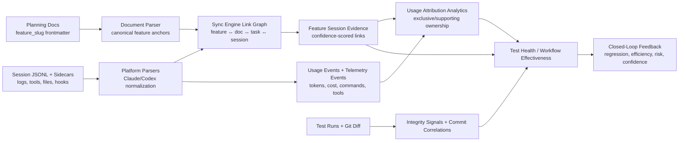

# PLAN 2: CCDash Observability & Integration Analysis

## Executive Summary

CCDash already implements a real closed-loop agentic telemetry model. The loop starts with planning documents whose frontmatter defines canonical feature anchors such as `feature_slug`, continues through session-log ingestion that captures transcript, tool, file, sidecar, and hook evidence, and ends with analytics and integrity surfaces that feed regressions, efficiency, and ownership back to the same feature/session graph.

The strongest part of the design is that the loop is mostly automatic. Developers do not need to manually report “what feature this work belonged to,” “which commands were run,” or “which tests regressed.” CCDash derives that from document frontmatter, command arguments, file paths, tool metadata, git commit windows, test mappings, and integrity detectors. The main limitation is that feature attribution in usage analytics is still conservative and usually supporting-only rather than exclusive.

## Closed-Loop Model

## 1. Ingestion Flow Mapping

### 1.1 Entry points

The public session parser is a thin wrapper over the platform registry, and the registry only accepts `.jsonl` transcripts. It attempts Codex parsing first, then Claude Code parsing: `backend/parsers/sessions.py:11-17`, `backend/parsers/platforms/registry.py:11-22`.

The real production ingestion path is the sync engine, not the ad hoc parser helper. `SyncEngine` recursively scans `sessions_dir.rglob("*.jsonl")`, parses each file, and upserts normalized rows: `backend/db/sync_engine.py:3456-3672`.

The discovery tooling in `backend/scripts/session_data_discovery.py` is broader than runtime ingestion. It uses discovery profiles that include `.jsonl`, `.json`, `.txt`, and sidecar globs, but this is for inventory/sampling rather than the live sync path: `backend/parsers/platforms/discovery_profiles.json`, `backend/scripts/session_data_discovery.py:51-84`, `docs/session-data-discovery.md`.

### 1.2 Claude Code parsing

Claude parsing is the richest ingestion path. The parser:

1. Reads JSONL entries and derives `session_id`, `raw_session_id`, `parent_session_id`, and `root_session_id`: `backend/parsers/platforms/claude_code/parser.py:1590-1630`.
2. Normalizes transcript blocks into `SessionLog` rows such as `message`, `thought`, `tool`, `subagent_start`, and merged tool-result records: `backend/parsers/platforms/claude_code/parser.py:2196-3305`.
3. Extracts file actions from read/write/edit tools, parsed command context from slash-command args, Bash/test metadata, commit hashes, resource observations, and test-run artifacts: `backend/parsers/platforms/claude_code/parser.py:1191-1234`, `backend/parsers/platforms/claude_code/parser.py:3032-3302`.
4. Collects sidecars for todos, task queues, team inboxes, session env snapshots, and tool-result directories: `backend/parsers/platforms/claude_code/parser.py:564-860`, `backend/parsers/platforms/claude_code/parser.py:3786-3890`.
5. Builds `sessionForensics` with context, cost, sidecars, subagent topology, queue pressure, resource footprint, test execution, and platform telemetry: `backend/parsers/platforms/claude_code/parser.py:4010-4110`.

Statusline snapshots are pulled from `session-env/{session_id}` and accepted only when `session_id` matches the transcript session. They drive context-window and reported-cost fields: `backend/parsers/platforms/claude_code/parser.py:1019-1051`, `backend/parsers/platforms/claude_code/parser.py:3791-3800`.

### 1.3 Codex parsing

Codex uses a different event wrapper but is still normalized into the same high-level `AgentSession` model. It emits message/command/tool/thought/system-style logs and can capture resource/file/test metadata from command tools: `backend/parsers/platforms/codex/parser.py:375-1069`.

Current gap: Codex does not yet provide Claude-equivalent sidecar ingestion and leaves top-level token/cost fields effectively empty in the parsed session model, so the closed loop is materially stronger on Claude today.

### 1.4 Persistence layers

After parsing a session file, `_sync_single_session()`:

1. Deletes prior rows for the same `source_file`.
2. Flattens `derivedSessions`.
3. Upserts the main `sessions` row.
4. Persists normalized logs, tool usage, file updates, artifacts, and relationships.
5. Derives observability fields.
6. Replaces usage-attribution rows.
7. Replaces telemetry-event rows.
8. Replaces commit-correlation rows.
9. Updates sync state.

Primary code: `backend/db/sync_engine.py:3481-3672`.

The main `sessions` row stores `session_forensics_json` plus dedicated context/cost fields; related normalized tables include `session_logs`, `session_tool_usage`, `session_file_updates`, `session_artifacts`, and `session_relationships`: `backend/db/repositories/sessions.py:17-133`, `backend/db/repositories/sessions.py:476-622`.

## 2. Traceability And Attribution Back To Planning Specs

### 2.1 Planning anchor: `feature_slug`

The repo’s planning anchor is the CCDash document frontmatter envelope. In the context of this analysis, that is the “SAM frontmatter” layer referenced in the request. The canonical schemas declare `feature_slug` in the shared envelope and require it for key planning docs such as PRDs and implementation plans: `docs/schemas/document_frontmatter/base-envelope.schema.yaml:75-77`, `docs/schemas/document_frontmatter/implementation-plan.schema.yaml`, `docs/schemas/document_frontmatter/prd.schema.yaml`.

`parse_document_file()` normalizes:

- `feature_slug`
- `feature`
- `feature_id`
- `feature_slug_hint`

into `featureSlug`, then derives `featureSlugHint` from frontmatter, path, or linked feature refs, and computes `featureSlugCanonical`: `backend/parsers/documents.py:705-754`.

`extract_frontmatter_references()` also extracts:

- `linked_features`
- `linked_sessions`
- `linked_tasks`
- `commit_refs`
- `integrity_signal_refs`

into normalized reference sets: `backend/document_linking.py:922-1045`.

### 2.2 Feature aliases and document evidence

The sync engine builds feature evidence from linked docs, doc paths, PRD refs, related refs, and task source files. It creates alias sets per feature from canonical IDs and path-derived tokens: `backend/db/sync_engine.py:4328-4424`.

This means the planning layer does not have to rely on a single exact string match. Feature families, versionless aliases, and feature-like tokens from canonical project paths all contribute to matching.

### 2.3 How terminal actions map back to features

CCDash links feature ↔ session relationships from several kinds of execution evidence:

- Explicit task/session linkage from task frontmatter or task records: `backend/db/sync_engine.py:4435-4464`
- File writes and reads that hit feature-owned planning/code paths: `backend/db/sync_engine.py:4645-4672`
- Slash-command arguments that include feature paths or feature slugs: `backend/db/sync_engine.py:4054-4084`, `backend/db/sync_engine.py:4677-4748`
- Parsed command metadata such as `featureSlugCanonical`, `featurePath`, and phase tokens: `backend/parsers/platforms/claude_code/parser.py:1191-1234`
- Commit windows whose payload already carries feature IDs, phase IDs, and task IDs: `backend/db/sync_engine.py:4770-4841`

The linker assigns different evidence weights by action type:

- `command` path context: `0.96`
- `write`/`edit` activity: `0.95`
- `bash`/`exec` shell reference: `0.84`
- `grep`/`glob` search reference: `0.66`
- `read`/`readfile`: `0.46`

Source: `backend/db/sync_engine.py:4099-4143`.

This directly answers the requested read/edit/bash/test traceability model:

- Read actions contribute weak evidence.
- Edit/write actions contribute strong evidence.
- Bash contributes medium shell-reference evidence and can also emit commit/test/resource signals.
- Test execution is captured separately as test-run artifacts and later tied back through mappings and integrity signals.

### 2.4 Usage attribution model

Usage attribution is a second attribution layer, separate from feature-session linking.

`build_session_usage_events()` converts normalized session logs into immutable token-bearing events:

- `model_input`
- `model_output`
- `cache_creation_input`
- `cache_read_input`
- `tool_result_*`
- `tool_reported_total`
- `relay_mirror_*`

Source: `backend/services/session_usage_attribution.py:129-379`.

`build_session_usage_attributions()` then chooses one primary owner per event with this priority order:

1. explicit skill invocation
2. explicit subthread ownership
3. explicit agent ownership
4. explicit command context
5. explicit artifact link

It also emits supporting links for nearby skills, nearby artifacts, workflow membership, and feature inheritance from `session.featureId` or `parsedCommand.featureSlugCanonical`: `backend/services/session_usage_attribution.py:12-17`, `backend/services/session_usage_attribution.py:382-728`.

Important implication: feature attribution in usage analytics is currently inherited/supporting by default, not exclusive. So CCDash can show that a feature materially participated in token burn and cost, but it does not yet claim strict exclusive feature ownership for most usage rows.

## 3. Metrics Extraction

### 3.1 Token burn and cost attribution

The core forensic metrics come from immutable usage events plus session rows:

- `delta_tokens`
- `token_family`
- `cost_usd_model_io`
- model
- tool name
- agent name
- linked session ID
- captured timestamp

Usage events are persisted through `session_usage_events`, and attribution links are persisted through `session_usage_attributions`: `backend/db/sync_engine.py:1262-1276`, `backend/db/repositories/usage_attribution.py:15-72`.

Model-I/O cost is allocated only across model input/output events from session `totalCost`, which preserves the rule that cache workload is not presented as direct spend: `backend/services/session_usage_attribution.py:362-379`.

### 3.2 Rollups and calibration

`session_usage_analytics.py` produces:

- exclusive tokens
- supporting tokens
- exclusive model-I/O tokens
- exclusive cache-input tokens
- exclusive/supporting cost
- session counts
- event counts
- method mix
- average confidence

Source: `backend/services/session_usage_analytics.py:243-379`.

Calibration adds:

- primary/supporting coverage
- unattributed event count
- ambiguous event count
- model-I/O gap
- cache gap
- confidence bands
- attribution method mix

Source: `backend/services/session_usage_analytics.py:441-545`.

### 3.3 Execution efficiency per feature/workflow

Workflow effectiveness is where CCDash turns telemetry into delivery-quality metrics. It combines:

- session duration
- token totals
- total cost
- queue pressure
- subagent fan-out
- test pass ratio
- integrity signals
- later debug/rework sessions

into `successScore`, `efficiencyScore`, `qualityScore`, and `riskScore`: `backend/services/workflow_effectiveness.py:29-56`, `backend/services/workflow_effectiveness.py:672-885`.

It then joins in session-scope attribution metrics:

- `attributedTokens`
- `supportingAttributionTokens`
- `attributedCostUsdModelIO`
- `averageAttributionConfidence`
- `attributionCoverage`
- `attributionCacheShare`

Source: `backend/services/workflow_effectiveness.py:888-1068`, `backend/services/session_usage_analytics.py:686-746`.

This is the main execution-efficiency-per-feature/workflow feedback loop in the repo today.

## 4. Integrity Signals And Regression Detection

### 4.1 Integrity signal capture

`IntegrityDetector` runs after test-run ingestion and inspects the git diff for the run’s `git_sha`. It emits:

- `assertion_removed`
- `skip_introduced`
- `xfail_added`
- `broad_exception`
- `edited_before_green`

Each signal is stored with:

- `git_sha`
- `file_path`
- optional `test_id`
- `linked_run_ids`
- `agent_session_id`
- severity
- structured details

Source: `backend/services/integrity_detector.py:50-241`, `backend/db/repositories/test_integrity.py:29-68`.

### 4.2 Test visualizer feedback loop

Test ingestion persists runs and test results with `agent_session_id`, `git_sha`, and run metadata: `backend/services/test_ingest.py:178-296`.

The test visualizer then exposes:

- domain health
- feature health
- feature timelines
- integrity alerts
- run correlation

Source: `backend/routers/test_visualizer.py:1002-1608`.

`TestHealthService.get_correlation()` closes the loop by taking a test run and resolving:

1. the linked agent session via `agent_session_id`
2. the latest commit window via `git_sha`
3. the affected features via primary test-feature mappings
4. the integrity signals for the same sha

Source: `backend/services/test_health.py:514-616`.

### 4.3 Commit correlation

`commit_correlations` are built from session payloads, parsed commands, file updates, task IDs, phases, token deltas, and observed commit hashes. Each window stores:

- `session_id`
- `root_session_id`
- `commit_hash`
- `feature_id`
- `phase`
- `task_id`
- token/file/change counts
- allocated cost
- `payload_json` with full feature/task/phase/file sets

Source: `backend/db/sync_engine.py:550-864`, `backend/db/sync_engine.py:1455-1586`.

This is the bridge between terminal activity and post-run regression evidence. When a test run points to a git sha, CCDash can recover the most recent session window that produced it.

## 5. Why This Counts As Closed-Loop Telemetry

The loop is closed because CCDash continuously reuses prior planning and execution artifacts as machine-readable evidence:

1. Planning docs define canonical feature anchors.
2. Session ingestion captures agent behavior without manual reporting.
3. Link rebuilding maps sessions back to features using paths, commands, tasks, and aliases.
4. Usage attribution converts transcript activity into cost/token ownership views.
5. Commit correlation and test ingestion connect changes to runs.
6. Integrity detection and workflow effectiveness convert regressions and delivery friction into feature/workflow feedback.

The result is a feedback model where planning, execution, validation, and analytics share the same graph. A developer does not have to write a manual status update for CCDash to know:

- which feature was likely being worked on
- what terminal actions occurred
- how many tokens/cost were consumed
- which tests were run
- which regressions were introduced
- which commit/session window likely caused them

## 6. Constraints And Gaps

### 6.1 Current strengths

- Claude ingestion is deep and captures transcript, sidecars, hook snapshots, file actions, test artifacts, and subagent topology.
- Feature-session linking uses multiple evidence types and explicit confidence scoring.
- Test visualizer correlation can resolve from run -> session -> commit -> feature.
- Workflow effectiveness already consumes attribution and integrity metrics together.

### 6.2 Current limitations

- Runtime ingestion only parses `.jsonl`, even though discovery tooling inventories broader file types.
- Codex parity is incomplete: no equivalent sidecar ingestion and weak top-level usage/cost capture.
- Feature usage attribution is mainly supporting-only, so feature cost ownership is conservative rather than exclusive.
- Many extended signals remain embedded in `session_forensics_json` instead of first-class queryable tables.
- `commit_correlations` preserve multi-feature detail in `payload_json`, but the top-level row only exposes one `feature_id`, `phase`, and `task_id`.
- Integrity health scoring counts open signals but does not weight severity as heavily as the underlying raw data would allow.

## 7. Assessment

CCDash already has the architecture needed for “Closed-Loop Agentic Telemetry.” The planning layer is grounded in document frontmatter and canonical feature slugs, the execution layer is captured from transcripts and sidecars, the attribution layer links session actions back to feature context with confidence, and the validation layer feeds regressions and efficiency signals back into the same graph.

The remaining work is mostly about tightening ownership semantics and cross-platform parity, not inventing the loop itself. The loop already exists. What is still maturing is how aggressively CCDash is willing to claim exclusive attribution for feature-level cost and token burn, especially outside the Claude ingestion path.
