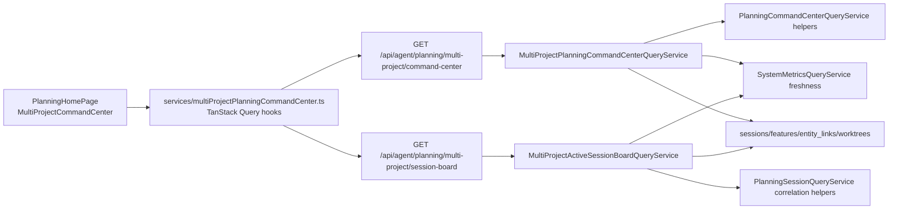

# Multi-Project Planning Command Center V1 - SPIKE Research

## Executive Summary

It is feasible to extend Planning Command Center V1 across every configured CCDash project, but it should be implemented as a first-class cross-project backend aggregate, not as the browser issuing one command-center request per project. The existing V1 work-item DTO, command resolver, system-wide metrics fan-out, watcher rebind, live active-count primitive, and Planning Agent Session Board provide enough prior art to make this a high-confidence enhancement.

The high-risk area is performance and freshness, not product fit. A consolidated board of active sessions across all projects should use a dedicated active-session aggregate path that queries only active/recent sessions and loads correlation data only for projects with active candidates. Reusing the full per-project session board across every project would multiply the current `limit=500` project query and correlation work and would be too expensive for a live single-screen cockpit.

## Research Questions

| ID | Question | Outcome |
|----|----------|---------|
| SP-1 | Can the V1 command center data contract be reused across projects? | Yes, with a wrapper that adds project metadata, freshness, and aggregate pagination. |
| SP-2 | Can all configured projects be read without switching the process-global active project? | Yes. Existing services already accept explicit `project_id` overrides; the cross-project service should resolve each project explicitly through the workspace registry. |
| SP-3 | Can the consolidated active-session board feed from existing project boards? | Partially. It can reuse the card DTO and correlation logic, but it needs an active-only aggregate query path instead of N full session-board calls. |
| SP-4 | Is custom project coloring/grouping feasible? | Yes. Use deterministic color/group fallbacks first, then persist optional project display metadata in `projects.json`. |
| SP-5 | Can this stay performant at current scale? | Yes for current project counts if fan-out is bounded, cached, active-only, and paginated. Promote SQL group-by or rollup tables above the documented thresholds. |

## Evidence Reviewed

| Area | Evidence | Relevance |
|------|----------|-----------|
| V1 command center backend | `backend/application/services/agent_queries/planning_command_center.py` | Single-project service composes features, docs, worktrees, git state, command resolution, filters, sort, and pagination. |
| V1 command center API | `backend/routers/agent.py` | Current endpoints are `GET /api/agent/planning/command-center` and `GET /api/agent/planning/command-center/{feature_id}` with explicit `project_id` support. |
| V1 frontend | `services/planningCommandCenter.ts`, `components/Planning/CommandCenter/PlanningCommandCenter.tsx` | Existing frontend assumes one project page at a time and keeps filters/view mode local. |
| Session board service | `backend/application/services/agent_queries/planning_sessions.py` | Builds session cards and correlations but currently loads up to 500 sessions for one project. |
| System metrics | `backend/application/services/agent_queries/system_metrics.py` | Proven bounded fan-out pattern across all projects with per-project errors, staleness, and memoized cache. |
| Project registry | `backend/project_manager.py`, `backend/routers/projects.py` | Projects are configured in `projects.json`; active project switching is local-only and should not be required for aggregate reads. |
| Freshness primitives | `docs/project_plans/feature_contracts/features/live-agents-count-v1.md`, `docs/project_plans/feature_contracts/features/watcher-rebind-on-active-project-switch-v1.md` | Active-count and watcher rebind are completed Tier 1 prerequisites for trustworthy cross-project reads. |
| Project-scoped frontend requests | `services/apiClient.ts`, `contexts/DataContext.tsx` | Existing project scoping and active-project switching are stateful; cross-project modals should pass explicit project scope instead of switching active project. |
| Live runtime topology | `backend/runtime/container.py`, `backend/adapters/jobs/runtime.py` | The local watcher is one-project-bound after rebind; all-project views require stale indicators unless a future watch-all topology lands. |

## SPIKE 1: Cross-Project Command-Center Aggregation

### Current State

`PlanningCommandCenterQueryService.get_command_center(...)` resolves exactly one project scope, loads features and document rows for that project, projects orphan docs into synthetic features, loads worktree contexts, then builds command-center items. The current API already accepts `project_id`, which means the browser could technically call the endpoint once per project. That is not the recommended architecture.

### Options Considered

| Option | Description | Pros | Cons | Decision |
|--------|-------------|------|------|----------|
| A | Browser fan-out to existing endpoint for each project | Minimal backend work | N HTTP requests, duplicated filtering, weak error isolation, hard to cache, poor route-local modal ownership | Reject |
| B | Backend fan-out that reuses V1 service internally | Reuses command resolver and item builder; one REST payload; central cache and warnings | Need aggregate DTO, project metadata, and per-project partial handling | Promote |
| C | Background rollup table for all planning work items | Fast reads at large scale | New write path and invalidation complexity | Defer until project count or payload size demands it |

### Decision

Promote Option B. Add `MultiProjectPlanningCommandCenterQueryService` that lists configured projects and invokes a refactored item-building helper per project under a bounded semaphore. The aggregate response must include:

- project summaries with id, name, display color, group, stale state, counts, and errors
- command-center work items with embedded project metadata
- aggregate totals and pagination
- warnings per project, not only global warnings
- generated timestamp and freshness token

### Performance Guardrails

- Default page size: 100 aggregate work items.
- Hard page size cap: 250 aggregate work items.
- Project fan-out concurrency default: 6 to 10, configurable.
- Cache TTL default: 30 seconds for aggregate reads.
- Do not probe git state for off-page work items.
- Do not load detail-only phase rows for collapsed/off-page cards unless the board view needs them.

## SPIKE 2: Consolidated Active-Session Board

### Current State

`PlanningSessionQueryService.get_session_board(...)` loads recent sessions for one project with `limit=500`, loads all features, bulk-loads entity links for those features, correlates every session, and groups the resulting cards. This is appropriate for a single project board. It is too broad for a live cross-project board whose first requirement is active sessions only.

### Options Considered

| Option | Description | Pros | Cons | Decision |
|--------|-------------|------|------|----------|
| A | Call `get_session_board` for every project and merge groups | Reuses existing service exactly | Worst-case 500 x project_count cards plus full correlation for cold projects | Reject |
| B | Add active-only repository query and aggregate active cards | Reads only running/recent sessions; clear performance envelope | Requires a new repository method and aggregate DTO | Promote |
| C | Use only `SystemMetricsQueryService` counts and no cards | Very cheap | Does not satisfy the requested consolidated operating board | Reject |

### Decision

Promote Option B. Add an active-session aggregate service that:

1. lists configured projects
2. queries active/recent sessions per project using a new indexed repository method
3. skips feature/link loading for projects with no active candidates
4. correlates only active candidates
5. groups cards by state, project, feature, phase, agent, or model
6. nests worker/subagent sessions under root cards where lineage is available

### Card Data Required For Operations

Each active-session card should include:

- project id, project name, display color, and group
- session id, title, state, platform, agent name/type, model, started time, last activity, duration
- parent/root/worker relationship summary
- token summary and context-window utilization when available
- recent activity markers and last command/tool summary
- correlated feature, phase, confidence, and evidence count
- next follow-up command or suggested action when resolvable
- transcript link, feature modal link, plan/document link, and workbench/launch affordances
- stale/freshness warning for the source project

## SPIKE 3: Project Grouping, Color, Tabs, And Single-Screen UX

### Current State

The app already has configured projects in `AppSessionContext`, active-project switching in the project router, and system-wide metrics with a per-project breakdown. The command center UI is mounted inside `PlanningHomePage` and has list, cards, and board modes, but it is active-project scoped and uses local component state for filters and view mode.

### Decision

Use one multi-project planning screen with:

- a compact project rail or segmented filter with `All`, group tabs, and project chips
- deterministic project colors generated from project id/name
- optional persisted project display config in `projects.json` for custom color, group, and sort order
- a consolidated active-session board as the first live operations lane
- a command-center work-item board/list as the follow-up lane
- route-local detail drawers that pass explicit `project_id` to existing detail APIs

Tabs per project are useful as filters, not as the primary information architecture. The default screen should remain consolidated because the user's core job is "operate across all sessions from one screen."

## SPIKE 4: Frontend Query Migration And Modal Scope

### Current State

`PlanningCommandCenter.tsx` owns manual fetch state today. That works for one active-project page but does not provide shared deduplication, cancellation, stale times, or aggregate invalidation for all-project mode. `PlanningAgentSessionBoard` already uses TanStack Query through `services/queries/planning.ts`, so the command center should move onto the same query layer before it scales.

Existing feature modal reuse is route-local but still oriented around the active project. Switching projects through the app data context clears query caches, so a card click from the portfolio screen must not switch the active project as a side effect.

### Decision

Add query keys and hooks for both current-project and multi-project command-center reads. Detail drawers should pass explicit `project_id` to detail fetches and keep a stable global card key such as `${projectId}:${featureId}` or `${projectId}:${sessionId}`.

Full reuse of existing feature/session modals is allowed only after the relevant hooks accept explicit project scope. Before that, the portfolio detail rail can show a compact aggregate detail and provide explicit "open in project" navigation.

## SPIKE 5: Live Coverage And Freshness Model

### Current State

Watcher rebind makes the active project fresh after a switch, but the local runtime still watches one active project at a time. System-wide metrics already treats non-active project freshness as a first-class trust signal.

### Decision

V1 should not claim that every configured project is continuously watched. The consolidated board should:

- use the active-session freshness window to suppress stale active rows
- show stale indicators for projects whose cache is old
- avoid a watch-all runtime topology in this feature
- leave one-watcher-per-project or multi-project watcher supervision as a deferred follow-up

This keeps the feature feasible without confusing "configured project" with "live watched project."

## Recommended Architecture

## Feasibility Assessment

| Dimension | Assessment | Rationale |
|-----------|------------|-----------|
| Product fit | High | V1 already positions the command center as a portfolio cockpit; this extends that shape to the platform level. |
| Backend feasibility | High | `system_metrics.py` proves safe all-project fan-out; V1 command-center and session-board services have reusable helpers. |
| Frontend feasibility | Medium-high | Existing command-center components are reusable, but project metadata, route-local project-scoped modals, virtualization, and query keys need deliberate work. |
| Performance feasibility | Medium-high | Active-only reads and caching keep the live board cheap; full feature aggregation requires pagination and off-page lazy details. |
| Freshness/trust | Medium | Watcher rebind and stale flags reduce risk, but non-active projects can still be stale if they have not been opened recently. Freshness must be visible. |
| Release risk | Medium-high | This is a major UX/data-contract surface touching planning, sessions, projects, and modals. It should ship behind a feature flag. |

## Promotion Criteria For PRD/Plan

Proceed to implementation planning if the plan includes:

1. aggregate backend endpoints instead of browser fan-out
2. active-only session query path with bounded per-project limits
3. project display metadata and deterministic fallback colors
4. route-local detail modals that keep explicit project scope
5. frontend query hooks and aggregate query keys before all-project UI rollout
6. performance tests with current-scale and threshold-scale fixtures
7. stale-project indicators in both project filters and cards
8. feature flag and fallback to the existing single-project command center

All criteria are reflected in the companion PRD and implementation plan.
